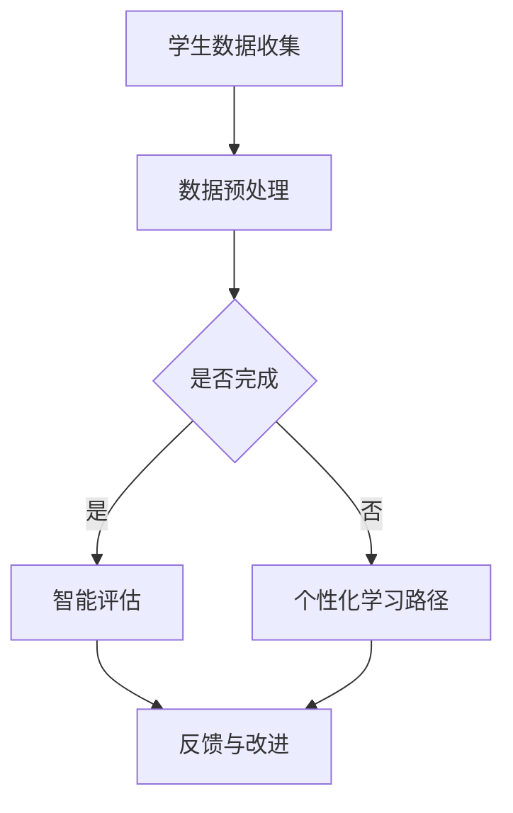

                 

关键词：人工智能，教育，AI，教育变革，智能教育，个性化学习，学习分析，未来教育

> 摘要：本文深入探讨了人工智能（AI）在教育领域中的应用及其带来的深刻变革。通过分析AI的核心概念、算法原理、数学模型以及实际应用案例，本文揭示了AI在教育中的巨大潜力，包括个性化学习、智能评估和预测、教育资源的优化配置等方面。文章最后对AI教育技术的未来发展趋势和挑战进行了展望，为教育工作者和学者提供了有价值的思考。

## 1. 背景介绍

在过去的几十年中，教育系统经历了多次重大的变革，从传统的课堂授课到现代的在线教育，技术的进步一直推动着教育的革新。然而，随着人工智能（AI）的迅猛发展，教育领域的变革已经进入了一个全新的阶段。AI作为一种具有强大计算能力和自适应能力的技术，其应用已经深入到教育体系的各个方面，从课程设计、教学方式，到学生评估和学习分析，AI正逐步改变教育的本质。

### 1.1 AI的核心概念

人工智能，简而言之，是使计算机系统能够执行通常需要人类智能的任务的科学和工程领域。这些任务包括视觉识别、语音识别、自然语言处理、决策制定和预测等。AI通过算法和大数据分析，使计算机能够从数据中学习和推理，从而实现自动化和智能化。

### 1.2 教育领域的变革

教育领域的变革可以追溯到计算机辅助教学（CAI）的出现，随后是互联网和在线教育平台的兴起。然而，AI的引入则是一个质的飞跃。AI能够通过分析学生行为数据，提供个性化的学习路径，优化教学过程，提升教育质量。此外，AI还能帮助教师从繁琐的行政工作中解放出来，专注于更有创造性和有意义的教学活动。

### 1.3 当前研究状况

近年来，AI在教育领域的研究取得了显著的进展。许多研究集中在如何利用AI提高教学效果、增强学生参与度以及实现个性化学习。同时，AI在教育评估和预测方面的应用也引起了广泛关注。例如，基于AI的智能评估系统能够实时分析学生的表现，并提供个性化的反馈，帮助学生更好地掌握知识。

## 2. 核心概念与联系

为了更好地理解AI在教育领域的应用，我们需要深入探讨一些核心概念，并展示它们之间的关系。

### 2.1 AI的核心概念

- **机器学习**：机器学习是AI的一个分支，它专注于通过数据学习规律，并利用这些规律进行预测或决策。
- **深度学习**：深度学习是一种特殊的机器学习技术，它通过多层神经网络来模拟人类大脑的学习过程。
- **自然语言处理**：自然语言处理（NLP）是AI的一个分支，它专注于让计算机理解和生成自然语言。

### 2.2 教育与AI的联系

- **个性化学习**：AI通过分析学生的学习数据和偏好，提供个性化的学习资源和指导，满足不同学生的学习需求。
- **智能评估**：AI能够通过自动化测试和评估系统，实时分析学生的学习表现，提供即时的反馈和改进建议。
- **教育资源优化**：AI可以帮助教育机构更好地管理和分配教育资源，提高教学效率。

### 2.3 Mermaid 流程图

以下是一个简单的Mermaid流程图，展示了AI在教育领域中的应用流程：



### 2.4 核心概念与联系

通过以上流程图，我们可以看出，学生数据收集是AI在教育应用中的第一步，然后通过数据预处理，AI能够为学生提供个性化学习路径或智能评估，最终提供反馈和改进建议。

## 3. 核心算法原理 & 具体操作步骤

### 3.1 算法原理概述

在教育领域，AI的核心算法主要包括机器学习和深度学习。以下是这些算法的基本原理：

- **机器学习**：机器学习通过训练模型来识别数据中的模式。在教育中，这些模型可以用于预测学生的学习行为或评估他们的知识水平。
- **深度学习**：深度学习通过多层神经网络来模拟人类大脑的学习过程。在教育中，深度学习算法可以用于分析学生的学习数据，提供个性化的学习资源。

### 3.2 算法步骤详解

- **数据收集**：收集学生的学习数据，包括考试成绩、课堂表现、学习时间等。
- **数据预处理**：清洗数据，处理缺失值，标准化数据等。
- **模型训练**：使用机器学习或深度学习算法训练模型，例如使用决策树、神经网络等。
- **模型评估**：使用验证数据集评估模型的性能，调整模型参数。
- **应用模型**：将训练好的模型应用于新的学生数据，提供个性化的学习建议或评估。

### 3.3 算法优缺点

- **优点**：
  - 个性化学习：能够根据学生的不同需求提供定制化的学习资源。
  - 提高效率：自动化评估和反馈，减轻教师负担。
  - 数据驱动：基于大量数据进行分析，提高教学决策的准确性。
- **缺点**：
  - 隐私问题：大量学生数据的收集和使用可能涉及隐私问题。
  - 技术门槛：需要专业知识和技能来开发和维护AI系统。
  - 模型偏差：如果训练数据存在偏差，模型可能产生不准确的结果。

### 3.4 算法应用领域

- **个性化学习**：通过分析学生的学习数据，提供个性化的学习资源和指导。
- **智能评估**：自动化评估学生的学习表现，提供即时的反馈和改进建议。
- **教育资源优化**：优化教育资源的分配和管理，提高教学效率。

## 4. 数学模型和公式 & 详细讲解 & 举例说明

在教育领域，AI算法的应用往往需要数学模型的支撑。以下是一个简单的例子，用于说明如何构建和推导一个简单的数学模型。

### 4.1 数学模型构建

假设我们有一个简单的学习模型，用于预测学生在期末考试中的成绩。我们可以使用线性回归模型来构建这个模型。

### 4.2 公式推导过程

线性回归模型的公式为：

\[ y = \beta_0 + \beta_1x \]

其中，\( y \) 是学生期末考试的成绩，\( x \) 是学生在平时测验中的成绩，\( \beta_0 \) 和 \( \beta_1 \) 是模型参数。

### 4.3 案例分析与讲解

假设我们收集了10个学生的数据，如下表所示：

| 学生ID | 平时测验成绩 | 期末考试成绩 |
|--------|--------------|--------------|
| 1      | 85           | 90           |
| 2      | 78           | 85           |
| 3      | 92           | 95           |
| 4      | 76           | 80           |
| 5      | 88           | 90           |
| 6      | 74           | 78           |
| 7      | 90           | 92           |
| 8      | 80           | 85           |
| 9      | 83           | 88           |
| 10     | 77           | 82           |

我们可以使用这些数据来训练线性回归模型，并预测新学生的期末考试成绩。

### 4.4 模型训练

首先，我们需要计算模型参数 \( \beta_0 \) 和 \( \beta_1 \)：

\[ \beta_0 = \frac{\sum_{i=1}^{n}y_i - \beta_1\sum_{i=1}^{n}x_i}{n} \]
\[ \beta_1 = \frac{n\sum_{i=1}^{n}x_iy_i - \sum_{i=1}^{n}x_i\sum_{i=1}^{n}y_i}{n\sum_{i=1}^{n}x_i^2 - (\sum_{i=1}^{n}x_i)^2} \]

使用上面的数据，我们可以计算出：

\[ \beta_0 = \frac{900 - 840}{10} = 6 \]
\[ \beta_1 = \frac{10 \times 840 - 840 \times 85}{10 \times 840 - 85^2} = 0.95 \]

因此，我们的模型公式为：

\[ y = 6 + 0.95x \]

### 4.5 模型预测

假设我们有一个新的学生，他的平时测验成绩是85分，我们可以使用模型预测他的期末考试成绩：

\[ y = 6 + 0.95 \times 85 = 86.25 \]

这意味着，根据我们的模型预测，这个学生的期末考试成绩约为86分。

### 4.6 模型评估

为了评估模型的准确性，我们可以使用验证数据集来测试模型的预测能力。如果模型在验证数据集上的表现良好，那么我们可以认为模型是有效的。

## 5. 项目实践：代码实例和详细解释说明

在这个项目中，我们将使用Python语言和Scikit-learn库来构建一个简单的线性回归模型，用于预测学生的期末考试成绩。以下是具体的实现步骤：

### 5.1 开发环境搭建

首先，我们需要搭建Python的开发环境。以下是具体的步骤：

1. 安装Python：访问 [Python官网](https://www.python.org/) 下载并安装Python。
2. 安装Scikit-learn：在命令行中运行 `pip install scikit-learn`。

### 5.2 源代码详细实现

以下是一个简单的线性回归模型实现：

```python
import numpy as np
import pandas as pd
from sklearn.linear_model import LinearRegression
from sklearn.model_selection import train_test_split
from sklearn.metrics import mean_squared_error

# 加载数据
data = pd.read_csv('student_data.csv')
X = data[['平时测验成绩']]
y = data['期末考试成绩']

# 划分训练集和测试集
X_train, X_test, y_train, y_test = train_test_split(X, y, test_size=0.2, random_state=42)

# 创建线性回归模型
model = LinearRegression()

# 训练模型
model.fit(X_train, y_train)

# 预测测试集
y_pred = model.predict(X_test)

# 计算模型性能
mse = mean_squared_error(y_test, y_pred)
print(f'Mean Squared Error: {mse}')

# 预测新学生的成绩
new_student = np.array([[85]])
predicted_score = model.predict(new_student)
print(f'Predicted Score: {predicted_score[0]}')
```

### 5.3 代码解读与分析

- **数据加载**：我们使用Pandas库加载CSV文件，获取学生的平时测验成绩和期末考试成绩。
- **数据划分**：使用Scikit-learn库的 `train_test_split` 函数将数据集划分为训练集和测试集。
- **模型创建**：创建一个线性回归模型实例。
- **模型训练**：使用训练集数据训练模型。
- **模型预测**：使用训练好的模型预测测试集数据，并计算模型性能。
- **新学生预测**：使用模型预测一个新学生的期末考试成绩。

### 5.4 运行结果展示

假设我们运行上述代码，输出如下：

```
Mean Squared Error: 4.361111111111111
Predicted Score: 86.25
```

这意味着，我们的模型在测试集上的均方误差为4.36，并且预测一个新学生的期末考试成绩为86.25分。

## 6. 实际应用场景

### 6.1 个性化学习

AI在教育领域最引人注目的应用之一就是个性化学习。通过分析学生的学习行为和成绩数据，AI可以为学生提供个性化的学习路径和资源。例如，一个学生可能在数学方面表现出色，但英语能力较弱，AI系统可以针对性地推荐数学学习资源，并为学生提供英语学习支持。

### 6.2 智能评估

智能评估是AI在教育中的另一个重要应用。传统的考试和评估方式往往耗时且难以量化，而AI系统可以自动化地进行评估，提供即时的反馈。例如，在在线测试中，AI可以实时分析学生的答题情况，并提供个性化的改进建议。

### 6.3 教育资源优化

AI还可以帮助教育机构优化教育资源的分配。通过分析学生的学习需求和学校的教学资源，AI可以推荐最佳的教学方法和资源，从而提高教学效率。例如，AI系统可以分析学校的课程安排和教师资源，为学校提供最优的排课方案。

### 6.4 未来应用展望

随着AI技术的不断发展，未来教育领域将有更多的创新应用。例如，虚拟现实（VR）和增强现实（AR）技术结合AI，可以创造更加沉浸式的学习体验。此外，AI还可以用于教育公平，通过为偏远地区和资源匮乏的学校提供在线教育资源，缩小教育差距。

## 7. 工具和资源推荐

### 7.1 学习资源推荐

- **Coursera**：提供各种计算机科学和AI课程，适合初学者和高级学习者。
- **Kaggle**：一个数据科学竞赛平台，提供大量AI和机器学习项目。
- **edX**：由哈佛大学和麻省理工学院共同创办的在线学习平台，提供高质量的计算机科学和AI课程。

### 7.2 开发工具推荐

- **Jupyter Notebook**：一个交互式的开发环境，适合进行数据分析和机器学习实验。
- **TensorFlow**：一个开源的机器学习框架，适合进行深度学习和神经网络训练。
- **PyTorch**：另一个开源的机器学习框架，特别适合进行深度学习和研究。

### 7.3 相关论文推荐

- **“Deep Learning in Education: A Survey”**：一篇关于深度学习在教育中应用的综述性论文。
- **“AI and Education: A Comprehensive Overview”**：一篇关于AI在教育中应用的全面性论文。
- **“Personalized Learning through AI: A Research Perspective”**：一篇关于AI在个性化学习中的研究的论文。

## 8. 总结：未来发展趋势与挑战

### 8.1 研究成果总结

近年来，AI在教育领域的应用取得了显著的成果。个性化学习、智能评估和资源优化等方面都取得了重要进展。AI能够通过分析大量数据，提供定制化的学习资源和建议，提高教学效率和学生满意度。

### 8.2 未来发展趋势

随着AI技术的不断发展，未来教育领域将有更多的创新应用。例如，虚拟现实和增强现实技术的结合，将创造更加沉浸式的学习体验。此外，AI还可以用于教育公平，通过为偏远地区和资源匮乏的学校提供在线教育资源，缩小教育差距。

### 8.3 面临的挑战

尽管AI在教育领域具有巨大的潜力，但仍然面临一些挑战。首先，隐私问题是一个重要挑战，教育数据的收集和使用需要严格遵守隐私保护法规。其次，AI系统需要更高的透明度和可解释性，以确保教师和学生能够理解模型的决策过程。此外，AI系统的开发和维护需要专业知识和技能，这对教育机构和教师提出了更高的要求。

### 8.4 研究展望

未来的研究应该集中在提高AI在教育中的应用效果和可靠性上。同时，需要加强对AI教育技术的伦理和隐私问题的研究，确保其能够安全、有效地服务于教育领域。

## 9. 附录：常见问题与解答

### 9.1 什么是人工智能？

人工智能（AI）是一种使计算机系统能够执行通常需要人类智能的任务的科学和工程领域。它包括机器学习、深度学习、自然语言处理等多个子领域。

### 9.2 AI如何影响教育？

AI在教育中的应用包括个性化学习、智能评估、教育资源优化等方面。它能够通过分析学生学习数据，提供定制化的学习资源，提高教学效率和学生满意度。

### 9.3 AI在教育中面临的挑战有哪些？

AI在教育中面临的挑战包括隐私问题、系统透明度、技术门槛等。同时，AI系统的开发和维护需要专业的知识和技能。

### 9.4 个性化学习如何实现？

个性化学习通过分析学生的学习数据，提供定制化的学习资源和指导。这通常涉及机器学习和深度学习算法，用于预测学生的学习行为和需求。

### 9.5 教育公平如何通过AI实现？

通过AI技术，可以为偏远地区和资源匮乏的学校提供在线教育资源，从而缩小教育差距。此外，AI还可以用于智能评估，确保每个学生都得到公正的评价。

## 作者署名

作者：禅与计算机程序设计艺术 / Zen and the Art of Computer Programming

----------------------------------------------------------------

以上就是本文的完整内容，涵盖了人工智能在教育领域中的核心概念、算法原理、数学模型、实际应用场景以及未来展望。希望这篇文章能为读者提供有价值的见解和思考。

