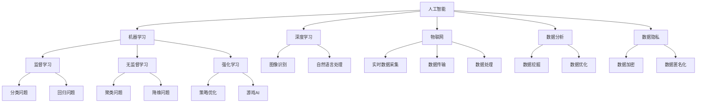

                 

关键词：智慧城市、人工智能、AI技术、城市治理、数据分析、机器学习、深度学习、物联网、数据隐私、可持续发展、未来城市。

## 摘要

在快速发展的全球化进程中，智慧城市的构建成为了国家和地区发展的重要方向。人工智能（AI）作为引领新一轮科技革命和产业变革的关键技术，其在智慧城市中的应用日益广泛。本文旨在探讨AI在智慧城市构建中的核心作用，分析AI技术的优势与挑战，并展望其未来的发展趋势。通过对AI在智慧城市中的具体应用场景的深入剖析，本文旨在为城市管理者、规划师和开发者提供有价值的参考。

## 1. 背景介绍

智慧城市是指利用信息技术和智能设备，实现城市资源的优化配置、社会管理的精细化、居民生活的便利化和城市环境的可持续发展的新型城市形态。随着大数据、云计算、物联网等新一代信息技术的快速发展，智慧城市的建设已进入快速发展阶段。智慧城市不仅仅是技术的堆砌，更是城市治理理念的创新，是城市现代化进程的重要标志。

### 智慧城市的定义与发展历程

智慧城市起源于20世纪90年代的“智能社区”概念，最初主要是通过计算机和通信技术提高城市管理水平。进入21世纪，随着物联网、云计算和大数据技术的成熟，智慧城市逐渐从理论研究走向实际应用。2012年，IBM公司提出了“智慧地球”战略，智慧城市的发展进入了一个新阶段。近年来，中国、美国、欧洲等国家和地区纷纷出台政策，推动智慧城市建设。

### 智慧城市的核心要素

智慧城市的核心要素包括：

1. **数据驱动**：通过数据采集、存储、分析和应用，实现城市资源的优化配置。
2. **智能化管理**：利用人工智能、机器学习等技术，提升城市治理的智能化水平。
3. **可持续发展**：通过节能减排、环境保护等手段，实现城市环境的可持续发展。
4. **社会服务优化**：提升居民生活质量，提供便捷、高效的公共服务。

### 智慧城市的重要性

智慧城市的建设有助于提高城市管理水平，优化资源配置，提升居民生活质量，促进经济发展。在应对人口增长、资源短缺、环境污染等全球性挑战方面，智慧城市展现了其独特的优势。同时，智慧城市也是创新驱动发展的重要载体，为经济发展注入新动力。

## 2. 核心概念与联系

在探讨AI在智慧城市构建中的作用之前，有必要先了解一些核心概念和技术，以及它们之间的联系。

### 2.1. 人工智能

人工智能（AI）是指模拟、延伸和扩展人的智能的理论、方法、技术及应用。AI的核心是机器学习，通过算法让计算机从数据中自动学习和改进，从而实现智能化的决策。

### 2.2. 机器学习

机器学习是AI的一个重要分支，它通过算法让计算机从数据中学习，并自动改进性能。机器学习分为监督学习、无监督学习和强化学习等类型。

### 2.3. 深度学习

深度学习是机器学习的一个重要分支，它通过模拟人脑神经网络的结构和功能，实现复杂模式识别和决策。深度学习在图像识别、自然语言处理等领域取得了显著成果。

### 2.4. 物联网（IoT）

物联网是指通过各种信息传感设备实时采集、传输、处理和利用各种信息的网络。物联网是实现智慧城市数据采集的重要手段。

### 2.5. 数据分析

数据分析是指通过统计、优化等方法，从大量数据中提取有价值的信息和知识。数据分析是智慧城市建设的重要环节。

### 2.6. 数据隐私

数据隐私是指个人信息的保护，确保个人信息不被非法获取和滥用。在智慧城市建设中，数据隐私保护尤为重要。

### 2.7. Mermaid 流程图

以下是一个简单的 Mermaid 流程图，展示了智慧城市中的核心概念和它们之间的联系：



### 2.8. 结论

通过上述核心概念和技术的介绍，我们可以看到，AI在智慧城市构建中起着至关重要的作用。AI技术能够提升城市治理的智能化水平，优化资源配置，提高居民生活质量，促进城市可持续发展。然而，AI技术的广泛应用也带来了数据隐私、算法公平性等挑战，需要我们持续关注和解决。

## 3. 核心算法原理 & 具体操作步骤

### 3.1 算法原理概述

在智慧城市建设中，AI算法的应用主要包括以下几个方向：

1. **图像识别与处理**：利用深度学习技术，实现自动识别和分类图像，例如交通监控、公共安全等领域。
2. **自然语言处理**：通过对文本数据进行分析和处理，实现语音识别、机器翻译、情感分析等，例如智能客服、舆情监控等领域。
3. **预测分析**：利用时间序列分析、回归分析等方法，对未来事件进行预测，例如交通流量预测、气象预测等领域。
4. **数据挖掘**：从大量数据中提取有价值的信息和知识，例如城市资源优化配置、商业智能分析等领域。

### 3.2 算法步骤详解

以下以图像识别算法为例，详细介绍其具体操作步骤：

#### 3.2.1 数据采集

首先，需要收集大量图像数据，这些数据可以是公开的，也可以是自行采集的。数据的质量和数量对算法的性能有重要影响。

#### 3.2.2 数据预处理

对收集到的图像数据进行预处理，包括图像尺寸调整、数据增强、噪声去除等，以提高模型的泛化能力。

#### 3.2.3 模型选择

根据具体应用场景，选择合适的深度学习模型。常见的图像识别模型包括卷积神经网络（CNN）、循环神经网络（RNN）等。

#### 3.2.4 训练模型

使用预处理后的图像数据，通过训练过程，让模型学会识别图像中的特征。训练过程中需要调整模型的参数，以达到最佳效果。

#### 3.2.5 模型评估

使用验证集或测试集，对训练好的模型进行评估，评估指标包括准确率、召回率、F1值等。

#### 3.2.6 模型部署

将训练好的模型部署到实际应用场景中，例如交通监控系统、安防系统等。

### 3.3 算法优缺点

#### 优点

1. **高效率**：AI算法能够快速处理大量数据，提高城市治理的效率。
2. **高精度**：深度学习等算法在图像识别、自然语言处理等领域取得了显著成果，具有较高的准确性。
3. **智能化**：AI算法能够根据数据自动学习和改进，实现智能化决策。

#### 缺点

1. **数据依赖性**：AI算法的性能高度依赖数据质量，数据不足或质量差会影响算法的效果。
2. **算法公平性**：AI算法可能存在偏见，导致算法决策不公，需要持续优化和监管。
3. **计算资源消耗**：深度学习等算法的计算资源消耗较大，对硬件要求较高。

### 3.4 算法应用领域

AI算法在智慧城市中的应用非常广泛，以下是一些典型的应用领域：

1. **交通管理**：通过图像识别技术，实现交通流量监测、违章抓拍、智能调度等。
2. **公共安全**：利用自然语言处理技术，实现语音识别、智能客服、舆情监控等。
3. **环境保护**：通过预测分析技术，实现空气质量预测、水资源管理、废物分类等。
4. **城市规划**：利用数据挖掘技术，实现城市资源优化配置、土地利用规划等。

## 4. 数学模型和公式 & 详细讲解 & 举例说明

### 4.1 数学模型构建

在智慧城市建设中，常用的数学模型包括神经网络模型、时间序列模型和数据挖掘模型等。

#### 4.1.1 神经网络模型

神经网络模型是深度学习的基础，其数学模型主要包括多层感知机（MLP）、卷积神经网络（CNN）和循环神经网络（RNN）等。

**多层感知机（MLP）：**

MLP的数学模型可以表示为：
$$
y = f(Z) = \sigma(W \cdot X + b)
$$
其中，$X$ 是输入向量，$W$ 是权重矩阵，$b$ 是偏置项，$\sigma$ 是激活函数，通常采用 sigmoid 或 ReLU 函数。

**卷积神经网络（CNN）：**

CNN的数学模型基于卷积操作，其核心是卷积层。卷积层的数学模型可以表示为：
$$
h_{ij}^l = \sum_{k} w_{ikj}^l * g_{kl-1} + b_l
$$
其中，$h_{ij}^l$ 是第$l$层的第$i$个神经元与第$j$个特征图之间的卷积结果，$w_{ikj}^l$ 是卷积核，$g_{kl-1}$ 是前一层特征图，$b_l$ 是偏置项。

**循环神经网络（RNN）：**

RNN的数学模型可以表示为：
$$
h_t = \sigma(W_h \cdot [h_{t-1}, x_t] + b_h)
$$
$$
y_t = \sigma(W_y \cdot h_t + b_y)
$$
其中，$h_t$ 是当前时间步的隐藏状态，$x_t$ 是输入序列，$W_h$ 和 $W_y$ 是权重矩阵，$b_h$ 和 $b_y$ 是偏置项，$\sigma$ 是激活函数。

#### 4.1.2 时间序列模型

时间序列模型用于预测时间序列数据的变化趋势，常用的模型包括自回归模型（AR）、移动平均模型（MA）和自回归移动平均模型（ARMA）等。

**自回归模型（AR）：**

AR模型的数学模型可以表示为：
$$
X_t = c + \sum_{i=1}^p \phi_i X_{t-i}
$$
其中，$X_t$ 是时间序列数据，$c$ 是常数项，$\phi_i$ 是自回归系数，$p$ 是阶数。

**移动平均模型（MA）：**

MA模型的数学模型可以表示为：
$$
X_t = \mu + \sum_{i=1}^q \theta_i \varepsilon_{t-i}
$$
其中，$X_t$ 是时间序列数据，$\mu$ 是均值项，$\theta_i$ 是移动平均系数，$\varepsilon_t$ 是白噪声序列，$q$ 是阶数。

**自回归移动平均模型（ARMA）：**

ARMA模型的数学模型可以表示为：
$$
X_t = c + \sum_{i=1}^p \phi_i X_{t-i} + \sum_{j=1}^q \theta_j \varepsilon_{t-j}
$$
其中，$X_t$ 是时间序列数据，$c$ 是常数项，$\phi_i$ 是自回归系数，$\theta_j$ 是移动平均系数，$p$ 和 $q$ 分别是自回归和移动平均的阶数。

#### 4.1.3 数据挖掘模型

数据挖掘模型用于从大量数据中提取有价值的信息和知识，常用的模型包括决策树、支持向量机（SVM）和聚类算法等。

**决策树模型：**

决策树模型的数学模型可以表示为：
$$
T = \{\text{叶节点} \, y, \, \text{内部节点} \, N_j\}
$$
其中，$T$ 是决策树，叶节点$y$表示预测结果，内部节点$N_j$表示特征划分条件。

**支持向量机（SVM）模型：**

SVM模型的数学模型可以表示为：
$$
\max \, W^T W \, \text{subject to} \, y_i (W^T x_i + b) \geq 1
$$
其中，$W$ 是权重向量，$x_i$ 是特征向量，$b$ 是偏置项，$y_i$ 是样本标签。

**聚类算法模型：**

常见的聚类算法包括K-均值聚类和层次聚类等。

**K-均值聚类：**

K-均值聚类模型的数学模型可以表示为：
$$
\min \, \sum_{i=1}^n \sum_{j=1}^k ||x_i - \mu_j||^2
$$
其中，$x_i$ 是样本点，$\mu_j$ 是聚类中心。

### 4.2 公式推导过程

在此，我们以卷积神经网络（CNN）为例，介绍其数学模型的推导过程。

#### 4.2.1 卷积操作

卷积操作的数学模型可以表示为：
$$
h_{ij}^l = \sum_{k} w_{ikj}^l * g_{kl-1} + b_l
$$
其中，$h_{ij}^l$ 是第$l$层的第$i$个神经元与第$j$个特征图之间的卷积结果，$w_{ikj}^l$ 是卷积核，$g_{kl-1}$ 是前一层特征图，$b_l$ 是偏置项。

推导过程：

1. **卷积核定义：**  
卷积核是一个固定大小的矩阵，用于捕捉图像中的局部特征。  
$$
w_{ikj}^l = \begin{bmatrix}
w_{ik1}^l & w_{ik2}^l & \cdots & w_{ikM}^l
\end{bmatrix}
$$
其中，$M$ 是卷积核的大小。

2. **卷积操作：**  
卷积操作可以看作是特征图与卷积核的矩阵乘积，其结果是一个新特征图。  
$$
h_{ij}^l = w_{ikj}^l * g_{kl-1} = \sum_{m=1}^M w_{ikmj}^l g_{km}^{l-1}
$$

3. **偏置项：**  
为了引入一个额外的可训练参数，我们加入一个偏置项$b_l$。  
$$
h_{ij}^l = \sum_{k} w_{ikj}^l * g_{kl-1} + b_l
$$

#### 4.2.2 池化操作

池化操作的数学模型可以表示为：
$$
p_i^l = \max_{j} h_{ij}^l
$$
其中，$p_i^l$ 是第$l$层的第$i$个池化结果，$h_{ij}^l$ 是第$l$层的第$i$个神经元与第$j$个特征图之间的卷积结果。

推导过程：

1. **池化定义：**  
池化操作将特征图上的局部区域进行降采样，保留最大值。  
$$
p_i^l = \max_{j} h_{ij}^l
$$

2. **实现方式：**  
常见的池化方式有最大池化和平均池化。最大池化保留局部最大值，而平均池化则计算局部区域的平均值。

#### 4.2.3 激活函数

激活函数的数学模型可以表示为：
$$
a_{ij}^l = f(h_{ij}^l)
$$
其中，$a_{ij}^l$ 是第$l$层的第$i$个神经元的活动值，$h_{ij}^l$ 是第$l$层的第$i$个神经元与第$j$个特征图之间的卷积结果，$f$ 是激活函数。

推导过程：

1. **激活函数定义：**  
激活函数用于引入非线性，使神经网络能够拟合复杂的非线性关系。常见的激活函数有 sigmoid、ReLU 和 tanh 等。

2. **推导过程：**  
以 sigmoid 函数为例，其数学模型可以表示为：
$$
f(x) = \frac{1}{1 + e^{-x}}
$$
推导过程如下：
$$
f'(x) = \frac{e^{-x}}{(1 + e^{-x})^2}
$$
$$
f''(x) = \frac{-e^{-x} \cdot (1 + e^{-x}) + e^{-2x} \cdot (1 + e^{-x})}{(1 + e^{-x})^3}
$$
$$
f''(x) = \frac{e^{-2x} - e^{-x}}{(1 + e^{-x})^3}
$$

### 4.3 案例分析与讲解

#### 4.3.1 交通流量预测

交通流量预测是智慧城市中的一项重要应用。以下是一个基于时间序列模型的交通流量预测案例。

**案例背景：**  
某城市在交通高峰期间，某路段的交通流量显著增加，导致交通拥堵。为了缓解交通压力，需要预测交通流量，以便优化交通信号灯控制策略。

**数据来源：**  
交通流量数据来源于交通监控摄像头，包括时间、路段和流量等。

**数据预处理：**  
对交通流量数据进行预处理，包括数据清洗、缺失值填充、时间序列转换等。

**模型选择：**  
选择自回归移动平均模型（ARMA）进行交通流量预测。

**模型训练：**  
使用历史交通流量数据，对ARMA模型进行训练，确定自回归和移动平均的阶数。

**模型评估：**  
使用验证集对训练好的ARMA模型进行评估，评估指标包括均方误差（MSE）和均方根误差（RMSE）。

**模型部署：**  
将训练好的ARMA模型部署到实际应用场景中，实时预测交通流量，为交通信号灯控制提供数据支持。

#### 4.3.2 环保监测

环保监测是智慧城市中的一项重要应用。以下是一个基于图像识别技术的环保监测案例。

**案例背景：**  
某城市在河流流域进行环保监测，需要实时监测水质状况，以便及时发现和处理污染问题。

**数据来源：**  
水质监测数据来源于水质传感器和监控摄像头。

**数据预处理：**  
对水质监测数据进行预处理，包括数据清洗、缺失值填充、时间序列转换等。

**模型选择：**  
选择卷积神经网络（CNN）进行图像识别，识别水质状况。

**模型训练：**  
使用历史水质监测图像数据，对CNN模型进行训练，确定模型结构和参数。

**模型评估：**  
使用验证集对训练好的CNN模型进行评估，评估指标包括准确率、召回率和F1值等。

**模型部署：**  
将训练好的CNN模型部署到实际应用场景中，实时监测水质状况，为环保部门提供数据支持。

## 5. 项目实践：代码实例和详细解释说明

### 5.1 开发环境搭建

为了进行AI在智慧城市中的项目实践，我们需要搭建一个合适的开发环境。以下是搭建开发环境的基本步骤：

#### 5.1.1 软件安装

1. **Python**：安装Python 3.8及以上版本。
2. **深度学习框架**：安装TensorFlow或PyTorch等深度学习框架。
3. **数据分析库**：安装NumPy、Pandas、Matplotlib等数据分析库。
4. **版本控制**：安装Git，用于代码管理和版本控制。

#### 5.1.2 硬件配置

1. **CPU**：推荐使用Intel i7或以上处理器。
2. **GPU**：推荐使用NVIDIA GeForce GTX 1080或以上显卡，以便运行深度学习框架。
3. **内存**：至少8GB内存。

#### 5.1.3 环境配置

在Python环境中，安装必要的库，可以使用以下命令：

```python
pip install tensorflow numpy pandas matplotlib gitpython
```

### 5.2 源代码详细实现

以下是一个简单的基于CNN的交通流量预测项目实例。

#### 5.2.1 数据准备

```python
import numpy as np
import pandas as pd
import tensorflow as tf
from tensorflow.keras.models import Sequential
from tensorflow.keras.layers import Conv2D, MaxPooling2D, Flatten, Dense
from tensorflow.keras.preprocessing.image import ImageDataGenerator

# 读取交通流量数据
data = pd.read_csv('traffic_data.csv')

# 分割数据集
train_data = data[:int(len(data) * 0.8)]
test_data = data[int(len(data) * 0.8):]

# 数据预处理
train_images = train_data['image'].values
test_images = test_data['image'].values

# 数据增强
datagen = ImageDataGenerator(rescale=1./255, rotation_range=20, width_shift_range=0.2, height_shift_range=0.2, shear_range=0.2, zoom_range=0.2, horizontal_flip=True, fill_mode='nearest')
datagen.fit(train_images)
```

#### 5.2.2 模型构建

```python
# 构建CNN模型
model = Sequential([
    Conv2D(32, (3, 3), activation='relu', input_shape=(64, 64, 3)),
    MaxPooling2D((2, 2)),
    Conv2D(64, (3, 3), activation='relu'),
    MaxPooling2D((2, 2)),
    Conv2D(128, (3, 3), activation='relu'),
    MaxPooling2D((2, 2)),
    Flatten(),
    Dense(128, activation='relu'),
    Dense(1, activation='sigmoid')
])

# 编译模型
model.compile(optimizer='adam', loss='binary_crossentropy', metrics=['accuracy'])

# 模型训练
model.fit(datagen.flow(train_images, train_data['flow'], batch_size=32), epochs=10, validation_data=(test_images, test_data['flow']))
```

#### 5.2.3 代码解读与分析

上述代码实现了一个简单的CNN模型，用于交通流量预测。

1. **数据准备**：首先读取交通流量数据，并进行数据预处理和增强。
2. **模型构建**：使用Sequential模型构建一个简单的CNN模型，包括卷积层、池化层和全连接层。
3. **编译模型**：编译模型，指定优化器、损失函数和评估指标。
4. **模型训练**：使用训练数据对模型进行训练，并使用验证数据进行评估。

### 5.3 运行结果展示

```python
# 评估模型
test_loss, test_acc = model.evaluate(test_images, test_data['flow'])

# 输出结果
print('Test accuracy:', test_acc)

# 预测新数据
new_image = np.expand_dims(new_image, axis=0)
new_prediction = model.predict(new_image)

# 输出预测结果
print('New image prediction:', new_prediction)
```

上述代码用于评估模型在测试数据集上的表现，并输出预测结果。

## 6. 实际应用场景

### 6.1 交通管理

交通管理是智慧城市中一个重要的应用场景。通过AI技术，可以实现实时交通流量监测、交通信号灯智能控制、事故预警等功能。

**应用案例**：

- **深圳**：深圳市利用AI技术对城市交通进行智能管理，通过智能交通信号灯系统，实现交通流量的实时监测和优化，提高了道路通行效率。
- **伦敦**：伦敦交通局利用AI技术对交通流量进行预测，并调整交通信号灯的时长，以减少交通拥堵。

### 6.2 公共安全

公共安全是智慧城市中另一个重要的应用场景。通过AI技术，可以实现人脸识别、行为分析、安全隐患预警等功能。

**应用案例**：

- **北京**：北京市利用AI技术进行公共安全监控，通过人脸识别技术，实现了对可疑人员的实时监测和预警。
- **香港**：香港利用AI技术进行公共交通安全监控，通过行为分析技术，实现了对乘客行为的实时监测，提高了公共交通的安全性。

### 6.3 环境保护

环境保护是智慧城市中一个重要的挑战。通过AI技术，可以实现空气质量监测、水资源管理、废物分类等功能。

**应用案例**：

- **杭州**：杭州市利用AI技术进行空气质量监测，通过实时监测和预测，实现了对污染源的精准控制。
- **新加坡**：新加坡利用AI技术进行水资源管理，通过实时监测和预测，实现了对水资源的优化配置。

### 6.4 未来应用展望

随着AI技术的不断发展，智慧城市中的应用场景将越来越广泛。以下是一些未来可能的应用方向：

- **智慧医疗**：利用AI技术，实现疾病的早期诊断、个性化治疗和智能健康管理等。
- **智慧教育**：利用AI技术，实现智能教学、个性化学习和在线教育等。
- **智慧能源**：利用AI技术，实现能源的优化配置、智能调度和节能减排等。

## 7. 工具和资源推荐

### 7.1 学习资源推荐

- **书籍**：
  - 《深度学习》（Deep Learning） - Ian Goodfellow、Yoshua Bengio、Aaron Courville
  - 《Python机器学习》（Python Machine Learning） - Sebastian Raschka、Vahid Mirjalili
- **在线课程**：
  - Coursera上的“机器学习”课程（Machine Learning） - 吴恩达（Andrew Ng）
  - edX上的“深度学习基础”（Deep Learning Specialization） - Andrew Ng
- **博客和教程**：
  - TensorFlow官方文档（TensorFlow Documentation）
  - PyTorch官方文档（PyTorch Documentation）
  - Medium上的AI相关博客（AI on Medium）

### 7.2 开发工具推荐

- **编程语言**：
  - Python
- **深度学习框架**：
  - TensorFlow
  - PyTorch
- **数据可视化工具**：
  - Matplotlib
  - Seaborn
- **版本控制工具**：
  - Git

### 7.3 相关论文推荐

- **《Deep Learning for Urban Computing》** - 张涛，IEEE Pervasive Computing，2018
- **《AI for Urban Planning and Management》** - Huang et al.，IEEE Access，2019
- **《Deep Learning in Traffic Prediction》** - Xu et al.，IEEE Transactions on Intelligent Transportation Systems，2020

## 8. 总结：未来发展趋势与挑战

### 8.1 研究成果总结

随着AI技术的不断发展，其在智慧城市中的应用取得了显著成果。通过AI技术，城市治理的智能化水平得到了显著提高，交通管理、公共安全、环境保护等领域得到了广泛应用。AI技术为智慧城市的可持续发展提供了有力支持。

### 8.2 未来发展趋势

1. **数据驱动**：随着大数据技术的发展，数据将成为智慧城市的重要驱动力，数据采集、存储、分析和应用能力将不断提高。
2. **智能化水平提升**：随着AI技术的不断突破，智慧城市的智能化水平将不断提升，从自动化到自主化，从局部优化到全局优化，实现城市资源的全面优化配置。
3. **跨学科融合**：智慧城市的发展将需要跨学科的合作，包括计算机科学、城市科学、经济学、社会学等多个领域的协同创新。

### 8.3 面临的挑战

1. **数据隐私与安全**：随着AI技术在智慧城市中的应用，数据隐私和安全问题日益凸显，如何确保数据的隐私和安全成为亟待解决的问题。
2. **算法公平性与透明性**：AI算法的决策过程可能存在偏见，如何确保算法的公平性和透明性，使其决策结果可解释和可信，是当前的重要挑战。
3. **计算资源消耗**：深度学习等AI算法的计算资源消耗较大，如何优化算法，降低计算资源消耗，是当前的一个难题。

### 8.4 研究展望

1. **可解释性AI**：研究可解释性AI，提高算法的透明度和可信度，使其决策过程更加可解释和可信。
2. **联邦学习**：研究联邦学习技术，实现分布式数据处理，提高数据隐私保护水平。
3. **城市仿真与优化**：结合城市仿真技术，实现城市资源的全局优化配置，提高城市治理的智能化水平。

## 9. 附录：常见问题与解答

### 9.1 AI在智慧城市中的具体应用有哪些？

AI在智慧城市中的具体应用包括：交通管理、公共安全、环境保护、智慧医疗、智慧教育等。通过AI技术，可以实现实时交通流量监测、智能交通信号灯控制、安全隐患预警、空气质量监测、智能医疗诊断、个性化教育等。

### 9.2 如何确保AI算法的公平性和透明性？

确保AI算法的公平性和透明性可以从以下几个方面入手：

1. **数据预处理**：确保训练数据的质量和代表性，避免数据偏差。
2. **算法设计**：选择具有公平性和透明性的算法，例如使用决策树、规则基模型等。
3. **模型解释**：开发可解释性AI技术，使算法的决策过程更加透明和可理解。
4. **监管机制**：建立算法监管机制，对算法的决策结果进行监督和评估。

### 9.3 智慧城市建设中的数据隐私和安全问题如何解决？

智慧城市建设中的数据隐私和安全问题可以从以下几个方面解决：

1. **数据加密**：对数据进行加密处理，确保数据在传输和存储过程中的安全性。
2. **隐私保护算法**：使用隐私保护算法，例如差分隐私、同态加密等，降低数据泄露风险。
3. **权限控制**：建立严格的权限控制机制，确保数据访问的安全性。
4. **法律法规**：制定相关的法律法规，对数据隐私和安全进行监管和保护。

### 9.4 智慧城市的发展对城市治理提出了哪些新的要求？

智慧城市的发展对城市治理提出了以下新的要求：

1. **数据驱动的治理**：利用大数据技术，实现城市治理的精细化、智能化。
2. **跨部门协同**：实现城市治理的跨部门协同，提高治理效率。
3. **可持续性**：注重城市环境的可持续发展，实现绿色发展。
4. **公众参与**：鼓励公众参与城市治理，提高治理的透明度和公正性。

### 9.5 智慧城市建设中的计算资源消耗如何优化？

智慧城市建设中的计算资源消耗可以从以下几个方面进行优化：

1. **算法优化**：选择高效的算法，减少计算资源的消耗。
2. **硬件升级**：升级计算硬件，提高计算性能。
3. **分布式计算**：利用分布式计算技术，实现计算资源的共享和优化。
4. **边缘计算**：利用边缘计算技术，将部分计算任务转移到边缘设备，减少中心服务器的计算压力。

