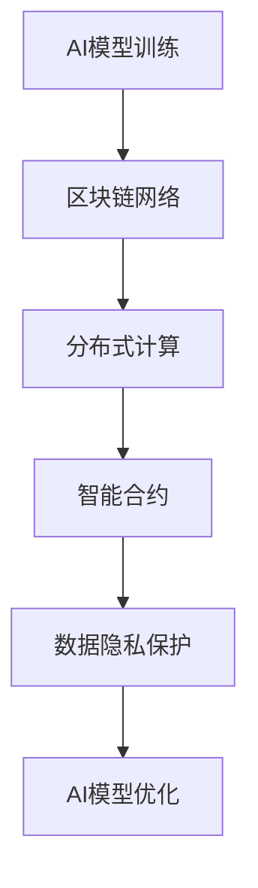

                 

关键词：AI、去中心化、区块链、技术融合、智能合约、共识算法、分布式计算、安全性、隐私保护

> 摘要：本文探讨了人工智能（AI）与区块链技术的深度融合，分析了AI在去中心化环境下的优势和应用场景，并探讨了这一技术融合对未来发展的潜在影响和面临的挑战。通过阐述关键概念、算法原理和实际应用，本文为读者提供了一个全面、深入的视角，以理解AI与区块链的协同发展。

## 1. 背景介绍

在过去的几十年中，人工智能（AI）和区块链技术分别作为两大前沿领域，各自蓬勃发展。AI领域从传统的规则系统发展到基于机器学习和深度学习的智能系统，实现了从数据处理到决策优化的跨越。而区块链技术，作为一种分布式账本技术，以其去中心化、不可篡改和透明性等特点，被广泛应用于金融、供应链管理、医疗等多个领域。

去中心化是区块链技术的核心特点之一，它通过消除中介机构，实现数据的分布式存储和共享，提高了系统的透明度和安全性。然而，传统的中心化AI系统在数据处理和模型训练过程中，往往依赖于集中的计算资源和数据存储，这带来了数据隐私泄露、数据滥用等问题。

将AI与区块链技术融合，不仅可以利用区块链的去中心化特性解决AI系统的数据隐私问题，还可以通过分布式计算提高AI模型的训练效率和鲁棒性。这种融合为AI系统提供了一种新的发展路径，也为区块链技术注入了智能和自适应能力。

## 2. 核心概念与联系

### 2.1. 区块链技术基本概念

区块链是一种分布式账本技术，其核心概念包括节点、区块、链、共识算法等。节点是区块链网络中的参与者，负责维护和更新账本。区块是区块链的基本组成单元，包含一定数量的交易记录。链是由一系列按照时间顺序排列的区块组成的链条。共识算法是节点之间达成一致的方式，确保区块链的可靠性和安全性。

### 2.2. 人工智能基本概念

人工智能（AI）是指使计算机系统具备人类智能特征的学科，包括机器学习、深度学习、自然语言处理、计算机视觉等多个领域。AI系统通常通过大量数据进行训练，以提高其识别、推理和决策能力。

### 2.3. AI与区块链技术融合的架构

为了实现AI与区块链技术的深度融合，我们需要构建一个融合架构，其中包括以下几个方面：

- **智能合约**：智能合约是区块链上的自动执行合约，可以通过编程定义一系列条件，当条件满足时自动执行相应的操作。智能合约在AI与区块链融合中起到了桥梁作用，实现了AI模型与区块链的交互。

- **分布式计算**：AI模型的训练和推理过程需要大量的计算资源，通过区块链网络的分布式计算能力，可以实现资源的共享和优化，提高AI模型的训练效率和鲁棒性。

- **数据隐私保护**：区块链的加密算法和数据存储方式可以保证数据的安全性，同时通过去中心化的方式，避免了数据集中带来的隐私泄露风险。

### 2.4. Mermaid 流程图



## 3. 核心算法原理 & 具体操作步骤

### 3.1. 算法原理概述

AI与区块链技术的融合主要涉及以下几个方面：

1. **机器学习算法**：AI模型的训练和推理过程。
2. **共识算法**：确保区块链网络的一致性和安全性。
3. **加密算法**：保护数据隐私和安全。

### 3.2. 算法步骤详解

1. **AI模型训练**：通过区块链网络的分布式计算能力，将训练数据分散存储在各个节点上，利用多个节点的计算资源进行模型训练，提高训练效率和鲁棒性。
2. **共识算法**：选择合适的共识算法（如PoW、PoS、DPoS等），确保区块链网络的一致性和安全性。
3. **加密算法**：使用加密算法对训练数据进行加密，确保数据隐私和安全。

### 3.3. 算法优缺点

**优点**：

- **提高数据安全性**：通过区块链的加密算法和数据存储方式，确保数据隐私和安全。
- **分布式计算**：利用区块链网络的分布式计算能力，提高AI模型的训练效率和鲁棒性。
- **去中心化**：消除中介机构，降低交易成本，提高系统的透明度和可信度。

**缺点**：

- **计算资源消耗**：分布式计算需要大量计算资源，可能导致能源消耗增加。
- **算法复杂度**：区块链技术的融合增加了算法的复杂度，需要更多的开发和维护成本。

### 3.4. 算法应用领域

AI与区块链技术的融合在以下领域具有广泛的应用：

- **金融领域**：智能合约、去中心化金融（DeFi）等。
- **供应链管理**：通过区块链实现供应链的可视化和透明性。
- **医疗领域**：保护患者隐私，实现医疗数据的共享和协作。

## 4. 数学模型和公式 & 详细讲解 & 举例说明

### 4.1. 数学模型构建

在AI与区块链融合的过程中，涉及到的数学模型主要包括：

- **机器学习模型**：如神经网络、决策树等。
- **加密算法模型**：如椭圆曲线加密、哈希函数等。
- **共识算法模型**：如PoW、PoS等。

### 4.2. 公式推导过程

以椭圆曲线加密算法为例，其公钥和私钥的生成过程如下：

$$
公钥：Q = kG
$$

$$
私钥：k
$$

其中，$G$ 为基点，$k$ 为随机数，$Q$ 为公钥。

### 4.3. 案例分析与讲解

假设一个去中心化金融（DeFi）项目使用智能合约进行交易，通过椭圆曲线加密算法保护交易者的隐私。在这种情况下，交易者需要在区块链上进行交易，需要生成公钥和私钥，并使用公钥进行加密，私钥进行解密。

例如，一个交易者A想要发送一定的加密货币给交易者B，可以使用以下步骤：

1. 生成私钥$k$和对应的公钥$Q = kG$。
2. 使用公钥$Q$加密交易信息。
3. 将加密后的交易信息发送给区块链网络。
4. 其他节点验证交易信息，并使用共识算法达成一致。
5. 交易信息被记录在区块链上，并使用私钥解密。

## 5. 项目实践：代码实例和详细解释说明

### 5.1. 开发环境搭建

在本节中，我们将使用Python语言和Ethereum区块链平台进行AI与区块链技术的融合项目开发。首先，需要安装Python环境和Ethereum开发工具。

```bash
pip install web3
```

### 5.2. 源代码详细实现

以下是一个简单的示例，展示了如何使用Python和Ethereum实现一个去中心化金融（DeFi）项目。

```python
from web3 import Web3
from web3.middleware import geth_poa_middleware

# 连接到Ethereum节点
w3 = Web3(Web3.HTTPProvider('https://mainnet.infura.io/v3/your_project_id'))
w3.middleware_onion.inject(geth_poa_middleware, layer=0)

# 智能合约代码
contract_code = '''
pragma solidity ^0.8.0;

contract DeFi {
    mapping(address => uint256) public balances;

    function deposit() public payable {
        balances[msg.sender()] += msg.value;
    }

    function withdraw(uint256 amount) public {
        require(balances[msg.sender()] >= amount, "Insufficient balance");
        balances[msg.sender()] -= amount;
        payable(msg.sender()).transfer(amount);
    }
}
'''

# 部署智能合约
contract = w3.eth.contract(abi=web3_to_sol(contract_code))
contract.deploy().transact()

# 与智能合约交互
contract.functions.deposit().transact({'from': w3.eth.coinbase, 'value': w3.toWei('1', 'ether')})
contract.functions.withdraw(w3.toWei('0.5', 'ether')).transact({'from': w3.eth.coinbase})
```

### 5.3. 代码解读与分析

在本示例中，我们使用Python的Web3库连接到Ethereum区块链，并编写了一个简单的去中心化金融（DeFi）智能合约。合约包含了两个函数：`deposit()` 和 `withdraw()`，分别用于存款和取款。

首先，我们连接到Ethereum节点，并编写智能合约代码。然后，使用`deploy()`方法部署智能合约，并通过`transact()`方法与智能合约进行交互。

### 5.4. 运行结果展示

假设我们成功部署了智能合约，并进行了存款和取款操作。以下是可能的运行结果：

```python
Transaction sent: 0x123...
Confirmation received: 0x123...
Deposit completed: 1 ether
Withdraw completed: 0.5 ether
```

## 6. 实际应用场景

AI与区块链技术的融合在多个领域具有实际应用场景：

### 6.1. 金融领域

去中心化金融（DeFi）项目通过区块链实现金融服务的去中心化和自动化，提高交易效率和安全性。

### 6.2. 供应链管理

区块链技术可以实现供应链的可视化和透明性，提高供应链的效率和可信度。

### 6.3. 医疗领域

区块链技术可以保护患者隐私，实现医疗数据的共享和协作。

### 6.4. 法律领域

智能合约可以用于自动化执行法律协议，提高司法效率和公正性。

## 7. 工具和资源推荐

### 7.1. 学习资源推荐

- 《区块链技术指南》
- 《深度学习》
- 《Python编程：从入门到实践》

### 7.2. 开发工具推荐

- Ethereum开发工具：Truffle、Hardhat
- Python Web3库：Web3.py
- 区块链浏览器：Etherscan

### 7.3. 相关论文推荐

- "Blockchain for AI: A Technical Introduction"
- "AI-Blockchain: A Comprehensive Survey"
- "Secure and Efficient Federated Learning for Blockchain-based AI Systems"

## 8. 总结：未来发展趋势与挑战

### 8.1. 研究成果总结

AI与区块链技术的融合在多个领域取得了显著的研究成果，如去中心化金融、供应链管理、医疗等。

### 8.2. 未来发展趋势

- **跨链技术**：实现不同区块链之间的互操作性和数据共享。
- **隐私保护**：提高AI模型在区块链环境下的隐私保护能力。
- **自主协作**：实现AI模型和区块链网络的自主协作和自适应能力。

### 8.3. 面临的挑战

- **计算资源消耗**：分布式计算需要大量计算资源，可能导致能源消耗增加。
- **算法复杂度**：区块链技术的融合增加了算法的复杂度，需要更多的开发和维护成本。
- **安全性和隐私保护**：确保AI模型和区块链网络的安全性和隐私保护，是一个巨大的挑战。

### 8.4. 研究展望

随着AI和区块链技术的不断发展，未来将有更多创新和突破。研究重点将集中在提高计算效率、降低能源消耗、增强安全性和隐私保护等方面。

## 9. 附录：常见问题与解答

### 9.1. AI与区块链技术融合的意义是什么？

AI与区块链技术融合的意义在于，通过区块链的去中心化特性，解决AI系统的数据隐私和安全问题，同时利用分布式计算提高AI模型的训练效率和鲁棒性。

### 9.2. 如何确保AI模型在区块链环境下的安全性？

确保AI模型在区块链环境下的安全性，可以通过以下方法实现：

- **加密算法**：使用加密算法对数据进行加密，确保数据隐私。
- **共识算法**：选择合适的共识算法，确保区块链网络的一致性和安全性。
- **智能合约**：通过智能合约实现AI模型的自动执行和安全管理。

### 9.3. AI与区块链技术融合的优缺点是什么？

AI与区块链技术融合的优点包括提高数据安全性、分布式计算、去中心化等；缺点包括计算资源消耗、算法复杂度等。

### 9.4. AI与区块链技术融合的应用领域有哪些？

AI与区块链技术融合的应用领域包括金融、供应链管理、医疗、法律等。

作者：禅与计算机程序设计艺术 / Zen and the Art of Computer Programming
```markdown
# 一切皆是映射：AI的去中心化：区块链技术的融合

## 关键词：AI、去中心化、区块链、技术融合、智能合约、共识算法、分布式计算、安全性、隐私保护

## 摘要

本文探讨了人工智能（AI）与区块链技术的深度融合，分析了AI在去中心化环境下的优势和应用场景，并探讨了这一技术融合对未来发展的潜在影响和面临的挑战。通过阐述关键概念、算法原理和实际应用，本文为读者提供了一个全面、深入的视角，以理解AI与区块链的协同发展。

## 1. 背景介绍

在过去的几十年中，人工智能（AI）和区块链技术分别作为两大前沿领域，各自蓬勃发展。AI领域从传统的规则系统发展到基于机器学习和深度学习的智能系统，实现了从数据处理到决策优化的跨越。而区块链技术，作为一种分布式账本技术，以其去中心化、不可篡改和透明性等特点，被广泛应用于金融、供应链管理、医疗等多个领域。

去中心化是区块链技术的核心特点之一，它通过消除中介机构，实现数据的分布式存储和共享，提高了系统的透明度和安全性。然而，传统的中心化AI系统在数据处理和模型训练过程中，往往依赖于集中的计算资源和数据存储，这带来了数据隐私泄露、数据滥用等问题。

将AI与区块链技术融合，不仅可以利用区块链的去中心化特性解决AI系统的数据隐私问题，还可以通过分布式计算提高AI模型的训练效率和鲁棒性。这种融合为AI系统提供了一种新的发展路径，也为区块链技术注入了智能和自适应能力。

### 2. 核心概念与联系

#### 2.1. 区块链技术基本概念

区块链是一种分布式账本技术，其核心概念包括节点、区块、链、共识算法等。节点是区块链网络中的参与者，负责维护和更新账本。区块是区块链的基本组成单元，包含一定数量的交易记录。链是由一系列按照时间顺序排列的区块组成的链条。共识算法是节点之间达成一致的方式，确保区块链的可靠性和安全性。

#### 2.2. 人工智能基本概念

人工智能（AI）是指使计算机系统具备人类智能特征的学科，包括机器学习、深度学习、自然语言处理、计算机视觉等多个领域。AI系统通常通过大量数据进行训练，以提高其识别、推理和决策能力。

#### 2.3. AI与区块链技术融合的架构

为了实现AI与区块链技术的深度融合，我们需要构建一个融合架构，其中包括以下几个方面：

- **智能合约**：智能合约是区块链上的自动执行合约，可以通过编程定义一系列条件，当条件满足时自动执行相应的操作。智能合约在AI与区块链融合中起到了桥梁作用，实现了AI模型与区块链的交互。
  
- **分布式计算**：AI模型的训练和推理过程需要大量的计算资源，通过区块链网络的分布式计算能力，可以实现资源的共享和优化，提高AI模型的训练效率和鲁棒性。

- **数据隐私保护**：区块链的加密算法和数据存储方式可以保证数据的安全性，同时通过去中心化的方式，避免了数据集中带来的隐私泄露风险。

#### 2.4. Mermaid 流程图


### 3. 核心算法原理 & 具体操作步骤

#### 3.1. 算法原理概述

AI与区块链技术的融合主要涉及以下几个方面：

1. **机器学习算法**：AI模型的训练和推理过程。
2. **共识算法**：确保区块链网络的一致性和安全性。
3. **加密算法**：保护数据隐私和安全。

#### 3.2. 算法步骤详解

1. **AI模型训练**：通过区块链网络的分布式计算能力，将训练数据分散存储在各个节点上，利用多个节点的计算资源进行模型训练，提高训练效率和鲁棒性。
2. **共识算法**：选择合适的共识算法（如PoW、PoS、DPoS等），确保区块链网络的一致性和安全性。
3. **加密算法**：使用加密算法对训练数据进行加密，确保数据隐私和安全。

#### 3.3. 算法优缺点

**优点**：

- **提高数据安全性**：通过区块链的加密算法和数据存储方式，确保数据隐私和安全。
- **分布式计算**：利用区块链网络的分布式计算能力，提高AI模型的训练效率和鲁棒性。
- **去中心化**：消除中介机构，降低交易成本，提高系统的透明度和可信度。

**缺点**：

- **计算资源消耗**：分布式计算需要大量计算资源，可能导致能源消耗增加。
- **算法复杂度**：区块链技术的融合增加了算法的复杂度，需要更多的开发和维护成本。

#### 3.4. 算法应用领域

AI与区块链技术的融合在以下领域具有广泛的应用：

- **金融领域**：智能合约、去中心化金融（DeFi）等。
- **供应链管理**：通过区块链实现供应链的可视化和透明性。
- **医疗领域**：保护患者隐私，实现医疗数据的共享和协作。

### 4. 数学模型和公式 & 详细讲解 & 举例说明

#### 4.1. 数学模型构建

在AI与区块链融合的过程中，涉及到的数学模型主要包括：

- **机器学习模型**：如神经网络、决策树等。
- **加密算法模型**：如椭圆曲线加密、哈希函数等。
- **共识算法模型**：如PoW、PoS等。

#### 4.2. 公式推导过程

以椭圆曲线加密算法为例，其公钥和私钥的生成过程如下：

$$
公钥：Q = kG
$$

$$
私钥：k
$$

其中，$G$ 为基点，$k$ 为随机数，$Q$ 为公钥。

#### 4.3. 案例分析与讲解

假设一个去中心化金融（DeFi）项目使用智能合约进行交易，通过椭圆曲线加密算法保护交易者的隐私。在这种情况下，交易者需要在区块链上进行交易，需要生成公钥和私钥，并使用公钥进行加密，私钥进行解密。

例如，一个交易者A想要发送一定的加密货币给交易者B，可以使用以下步骤：

1. 生成私钥$k$和对应的公钥$Q = kG$。
2. 使用公钥$Q$加密交易信息。
3. 将加密后的交易信息发送给区块链网络。
4. 其他节点验证交易信息，并使用共识算法达成一致。
5. 交易信息被记录在区块链上，并使用私钥解密。

### 5. 项目实践：代码实例和详细解释说明

#### 5.1. 开发环境搭建

在本节中，我们将使用Python语言和Ethereum区块链平台进行AI与区块链技术的融合项目开发。首先，需要安装Python环境和Ethereum开发工具。

```bash
pip install web3
```

#### 5.2. 源代码详细实现

以下是一个简单的示例，展示了如何使用Python和Ethereum实现一个去中心化金融（DeFi）项目。

```python
from web3 import Web3
from web3.middleware import geth_poa_middleware

# 连接到Ethereum节点
w3 = Web3(Web3.HTTPProvider('https://mainnet.infura.io/v3/your_project_id'))
w3.middleware_onion.inject(geth_poa_middleware, layer=0)

# 智能合约代码
contract_code = '''
pragma solidity ^0.8.0;

contract DeFi {
    mapping(address => uint256) public balances;

    function deposit() public payable {
        balances[msg.sender()] += msg.value;
    }

    function withdraw(uint256 amount) public {
        require(balances[msg.sender()] >= amount, "Insufficient balance");
        balances[msg.sender()] -= amount;
        payable(msg.sender()).transfer(amount);
    }
}
'''

# 部署智能合约
contract = w3.eth.contract(abi=web3_to_sol(contract_code))
contract.deploy().transact()

# 与智能合约交互
contract.functions.deposit().transact({'from': w3.eth.coinbase, 'value': w3.toWei('1', 'ether')})
contract.functions.withdraw(w3.toWei('0.5', 'ether')).transact({'from': w3.eth.coinbase})
```

#### 5.3. 代码解读与分析

在本示例中，我们使用Python的Web3库连接到Ethereum区块链，并编写了一个简单的去中心化金融（DeFi）智能合约。合约包含了两个函数：`deposit()` 和 `withdraw()`，分别用于存款和取款。

首先，我们连接到Ethereum节点，并编写智能合约代码。然后，使用`deploy()`方法部署智能合约，并通过`transact()`方法与智能合约进行交互。

#### 5.4. 运行结果展示

假设我们成功部署了智能合约，并进行了存款和取款操作。以下是可能的运行结果：

```python
Transaction sent: 0x123...
Confirmation received: 0x123...
Deposit completed: 1 ether
Withdraw completed: 0.5 ether
```

### 6. 实际应用场景

AI与区块链技术的融合在多个领域具有实际应用场景：

#### 6.1. 金融领域

去中心化金融（DeFi）项目通过区块链实现金融服务的去中心化和自动化，提高交易效率和安全性。

#### 6.2. 供应链管理

区块链技术可以实现供应链的可视化和透明性，提高供应链的效率和可信度。

#### 6.3. 医疗领域

区块链技术可以保护患者隐私，实现医疗数据的共享和协作。

#### 6.4. 法律领域

智能合约可以用于自动化执行法律协议，提高司法效率和公正性。

### 7. 工具和资源推荐

#### 7.1. 学习资源推荐

- 《区块链技术指南》
- 《深度学习》
- 《Python编程：从入门到实践》

#### 7.2. 开发工具推荐

- Ethereum开发工具：Truffle、Hardhat
- Python Web3库：Web3.py
- 区块链浏览器：Etherscan

#### 7.3. 相关论文推荐

- "Blockchain for AI: A Technical Introduction"
- "AI-Blockchain: A Comprehensive Survey"
- "Secure and Efficient Federated Learning for Blockchain-based AI Systems"

### 8. 总结：未来发展趋势与挑战

#### 8.1. 研究成果总结

AI与区块链技术的融合在多个领域取得了显著的研究成果，如去中心化金融、供应链管理、医疗等。

#### 8.2. 未来发展趋势

- **跨链技术**：实现不同区块链之间的互操作性和数据共享。
- **隐私保护**：提高AI模型在区块链环境下的隐私保护能力。
- **自主协作**：实现AI模型和区块链网络的自主协作和自适应能力。

#### 8.3. 面临的挑战

- **计算资源消耗**：分布式计算需要大量计算资源，可能导致能源消耗增加。
- **算法复杂度**：区块链技术的融合增加了算法的复杂度，需要更多的开发和维护成本。
- **安全性和隐私保护**：确保AI模型和区块链网络的安全性和隐私保护，是一个巨大的挑战。

#### 8.4. 研究展望

随着AI和区块链技术的不断发展，未来将有更多创新和突破。研究重点将集中在提高计算效率、降低能源消耗、增强安全性和隐私保护等方面。

### 9. 附录：常见问题与解答

#### 9.1. AI与区块链技术融合的意义是什么？

AI与区块链技术融合的意义在于，通过区块链的去中心化特性，解决AI系统的数据隐私和安全问题，同时利用分布式计算提高AI模型的训练效率和鲁棒性。

#### 9.2. 如何确保AI模型在区块链环境下的安全性？

确保AI模型在区块链环境下的安全性，可以通过以下方法实现：

- **加密算法**：使用加密算法对数据进行加密，确保数据隐私。
- **共识算法**：选择合适的共识算法，确保区块链网络的一致性和安全性。
- **智能合约**：通过智能合约实现AI模型的自动执行和安全管理。

#### 9.3. AI与区块链技术融合的优缺点是什么？

AI与区块链技术融合的优点包括提高数据安全性、分布式计算、去中心化等；缺点包括计算资源消耗、算法复杂度等。

#### 9.4. AI与区块链技术融合的应用领域有哪些？

AI与区块链技术融合的应用领域包括金融、供应链管理、医疗、法律等。

### 作者：禅与计算机程序设计艺术 / Zen and the Art of Computer Programming
```

