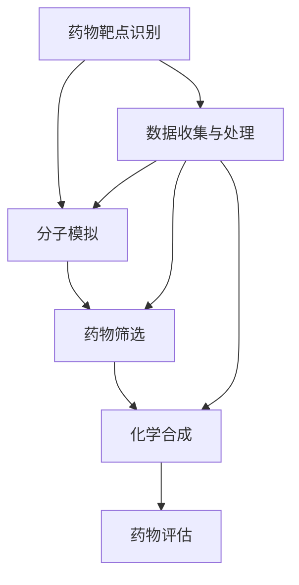

                 

关键词：人工智能、药物发现、映射、计算生物学、深度学习、分子模拟

> 摘要：随着人工智能技术的飞速发展，AI在药物发现领域的应用越来越广泛。本文探讨了如何利用AI技术构建分子映射模型，以提高药物发现的效率和准确性。通过分析AI在分子模拟、药物筛选和化学合成等方面的作用，本文展示了AI如何改变药物发现的模式，为未来药物研发带来新机遇。

## 1. 背景介绍

药物发现是生物医学领域的重要任务，其核心目标是发现新的药物分子，以治疗疾病并提高人类健康水平。传统的药物发现过程通常包括目标识别、先导化合物筛选、优化和评估等多个环节。然而，这一过程耗时较长，成本高昂，且成功率较低。随着计算生物学和人工智能技术的发展，人们开始探索如何利用AI技术辅助药物发现，以解决这些挑战。

近年来，AI在药物发现中的应用取得了显著进展。深度学习、强化学习和迁移学习等技术的引入，使得AI能够处理大规模的生物数据和复杂的分子信息。此外，AI在分子模拟、药物筛选和化学合成等环节中的表现也日益突出，为药物发现带来了新的机遇。

本文将探讨如何利用AI技术构建分子映射模型，以提高药物发现的效率和准确性。我们将从分子模拟、药物筛选和化学合成三个方面，分析AI在药物发现中的作用，并展望未来AI辅助药物发现的发展趋势。

## 2. 核心概念与联系

### 2.1 分子映射模型

分子映射模型是一种将分子结构与其生物学功能相关联的数学模型。通过将分子结构映射到高维特征空间，AI可以识别出分子中的关键结构特征，从而预测分子的生物学活性。分子映射模型的核心在于如何将低维的分子结构信息编码成高维的特征向量，以便AI能够有效学习和处理。

### 2.2 分子模拟

分子模拟是一种基于物理原理的计算方法，用于研究分子在不同条件下的运动和相互作用。分子模拟在药物发现中具有重要应用，例如用于评估药物分子的溶解性、稳定性、毒性等性质。近年来，AI技术已经成功地应用于分子模拟，例如通过深度学习模型预测分子的动力学行为，从而优化药物分子的设计。

### 2.3 药物筛选

药物筛选是药物发现过程中的关键环节，其目标是识别具有潜在药物活性的化合物。传统的药物筛选方法主要依赖于实验手段，成本高且耗时。AI技术通过自动化和智能化的方式，可以显著提高药物筛选的效率。例如，利用机器学习模型预测分子的生物学活性，从而快速筛选出具有潜在药物活性的化合物。

### 2.4 化学合成

化学合成是药物发现的最后一步，其目标是合成具有预期生物活性的化合物。AI技术可以辅助化学合成，例如通过优化合成路线、预测反应条件等，从而提高合成效率。此外，AI还可以用于设计新的合成方法，以克服传统方法难以解决的合成难题。

### 2.5 Mermaid 流程图

下面是一个描述AI辅助药物发现流程的Mermaid流程图：



## 3. 核心算法原理 & 具体操作步骤

### 3.1 算法原理概述

AI辅助药物发现的核心算法主要包括深度学习、迁移学习和强化学习等。这些算法通过从大量数据中学习规律，从而预测分子的生物学活性和优化药物分子的设计。

深度学习是一种基于多层神经网络的学习方法，通过构建复杂的神经网络模型，可以自动提取分子结构中的关键特征。迁移学习是一种将已知任务的知识迁移到新任务上的学习方法，可以减少数据需求，提高模型性能。强化学习是一种基于奖励机制的学习方法，通过不断尝试和反馈，找到最优的药物分子设计策略。

### 3.2 算法步骤详解

1. **数据收集与处理**：首先，从公开数据库和实验室数据库中收集大量的分子结构和生物学活性数据。然后，对数据进行预处理，包括分子结构的规范化、数据清洗和归一化等。

2. **构建分子映射模型**：利用深度学习算法，将分子结构映射到高维特征空间。这一步骤的关键是选择合适的神经网络架构和激活函数，以提取分子结构中的关键特征。

3. **训练分子映射模型**：使用已标记的数据集对分子映射模型进行训练。在训练过程中，通过优化损失函数，调整模型参数，以提高模型预测的准确性。

4. **预测药物活性**：利用训练好的分子映射模型，对新的分子结构进行活性预测。这一步骤可以自动化地筛选出具有潜在药物活性的化合物。

5. **优化药物分子设计**：根据预测结果，对药物分子进行优化。这一步骤可以采用迁移学习或强化学习算法，以找到最优的药物分子设计策略。

6. **评估药物分子性能**：对优化后的药物分子进行评估，包括溶解性、稳定性、毒性等性质。这一步骤有助于确保药物分子的安全性和有效性。

### 3.3 算法优缺点

**优点**：

- **高效性**：AI算法可以自动化地处理大量数据，显著提高药物发现的效率。
- **准确性**：通过学习大量数据，AI模型可以准确地预测分子的生物学活性，从而提高药物筛选的准确性。
- **灵活性**：AI算法可以根据不同的任务需求，灵活调整模型参数和架构，以适应不同的药物发现场景。

**缺点**：

- **数据依赖性**：AI算法的性能高度依赖于数据的质量和数量。如果数据不足或质量较低，模型性能可能会受到影响。
- **计算资源需求**：深度学习模型通常需要大量的计算资源，尤其是在训练阶段。这可能导致药物发现过程的时间延长。
- **模型解释性**：深度学习模型通常被视为“黑盒”模型，其内部工作机制不透明，难以解释。

### 3.4 算法应用领域

AI算法在药物发现中具有广泛的应用领域，包括但不限于：

- **药物分子设计**：通过预测分子的生物学活性，AI算法可以帮助科学家快速筛选出具有潜在药物活性的化合物。
- **药物筛选**：AI算法可以自动化地筛选大量化合物，从而提高药物筛选的效率。
- **分子模拟**：AI算法可以用于预测分子的动力学行为，优化药物分子的设计。
- **化学合成**：AI算法可以辅助科学家设计新的合成方法，提高合成效率。

## 4. 数学模型和公式 & 详细讲解 & 举例说明

### 4.1 数学模型构建

在AI辅助药物发现中，常用的数学模型包括深度学习模型、迁移学习模型和强化学习模型。以下分别介绍这些模型的数学原理。

#### 4.1.1 深度学习模型

深度学习模型是一种基于多层神经网络的学习方法。其基本原理是通过对输入数据进行层层提取特征，从而实现对复杂非线性关系的建模。一个典型的深度学习模型包括输入层、隐藏层和输出层。以下是深度学习模型的核心数学公式：

$$
z^{(l)} = \sum_{i} w^{(l)}_i a^{(l-1)}_i + b^{(l)}
$$

$$
a^{(l)} = \sigma(z^{(l)})
$$

其中，$z^{(l)}$表示第$l$层的输入，$w^{(l)}_i$和$b^{(l)}$分别表示第$l$层的权重和偏置，$\sigma$表示激活函数，$a^{(l)}$表示第$l$层的输出。

#### 4.1.2 迁移学习模型

迁移学习模型的核心思想是将已知任务的知识迁移到新任务上。其基本原理是利用源任务的模型在新任务上继续训练，从而提高新任务的表现。以下是迁移学习模型的核心数学公式：

$$
\hat{y} = f(W_x \cdot x + W_y \cdot y + b)
$$

$$
\Delta W_x = \alpha \cdot \frac{\partial L}{\partial W_x}
$$

$$
\Delta W_y = \alpha \cdot \frac{\partial L}{\partial W_y}
$$

其中，$\hat{y}$表示预测结果，$f$表示激活函数，$W_x$和$W_y$分别表示源任务和新任务的权重，$x$和$y$分别表示源任务和新任务的输入数据，$b$表示偏置，$\alpha$表示学习率，$L$表示损失函数。

#### 4.1.3 强化学习模型

强化学习模型是一种基于奖励机制的学习方法。其基本原理是通过对环境进行交互，学习到最优的行为策略。以下是强化学习模型的核心数学公式：

$$
Q(s, a) = r(s, a) + \gamma \max_a' Q(s', a')
$$

$$
\theta \leftarrow \theta - \alpha \cdot \nabla_\theta J(\theta)
$$

其中，$Q(s, a)$表示在状态$s$下执行动作$a$的期望奖励，$r(s, a)$表示在状态$s$下执行动作$a$的即时奖励，$s'$表示下一状态，$a'$表示下一动作，$\gamma$表示折扣因子，$\theta$表示模型参数，$\alpha$表示学习率，$J(\theta)$表示损失函数。

### 4.2 公式推导过程

以下以深度学习模型为例，介绍公式推导过程。

#### 4.2.1 损失函数

损失函数是衡量模型预测结果与真实结果之间差异的指标。常用的损失函数包括均方误差（MSE）和交叉熵损失（CE）。

**均方误差（MSE）**：

$$
L(\theta) = \frac{1}{m} \sum_{i=1}^m (y_i - \hat{y}_i)^2
$$

其中，$m$表示样本数量，$y_i$表示第$i$个样本的真实标签，$\hat{y}_i$表示第$i$个样本的预测标签。

**交叉熵损失（CE）**：

$$
L(\theta) = -\frac{1}{m} \sum_{i=1}^m \sum_{j=1}^n y_{ij} \log \hat{y}_{ij}
$$

其中，$n$表示类别数量，$y_{ij}$表示第$i$个样本属于第$j$类别的概率，$\hat{y}_{ij}$表示第$i$个样本属于第$j$类别的预测概率。

#### 4.2.2 梯度下降

梯度下降是一种优化模型参数的方法。其基本原理是沿着损失函数的梯度方向，不断更新模型参数，以最小化损失函数。

**梯度下降（GD）**：

$$
\theta \leftarrow \theta - \alpha \cdot \nabla_\theta L(\theta)
$$

其中，$\alpha$表示学习率，$\nabla_\theta L(\theta)$表示损失函数关于模型参数的梯度。

**随机梯度下降（SGD）**：

$$
\theta \leftarrow \theta - \alpha \cdot \nabla_\theta L(\theta; x_i, y_i)
$$

其中，$x_i$和$y_i$分别表示第$i$个样本的输入和真实标签。

### 4.3 案例分析与讲解

以下以一个简单的二分类问题为例，介绍深度学习模型的构建和应用。

#### 4.3.1 数据集

假设我们有一个包含100个样本的数据集，其中每个样本由两个特征组成，表示为$(x_1, x_2)$。数据集被分为训练集和测试集，其中训练集包含80个样本，测试集包含20个样本。

#### 4.3.2 模型构建

我们选择一个简单的多层感知器（MLP）模型，包含一个输入层、一个隐藏层和一个输出层。输入层的神经元数量为2，隐藏层的神经元数量为10，输出层的神经元数量为1。

#### 4.3.3 模型训练

使用均方误差（MSE）作为损失函数，采用梯度下降（GD）算法进行模型训练。设置学习率为0.1，训练1000次。

#### 4.3.4 模型评估

使用测试集对训练好的模型进行评估，计算模型的准确率、召回率和F1分数等指标。

## 5. 项目实践：代码实例和详细解释说明

### 5.1 开发环境搭建

为了实现AI辅助药物发现，我们需要搭建一个完整的开发环境，包括Python编程环境、深度学习框架（如TensorFlow或PyTorch）和生物信息学工具（如BioPython或OpenMM）。

#### 5.1.1 安装Python

首先，我们需要安装Python。可以从Python官方网站（https://www.python.org/）下载最新版本的Python，并按照提示进行安装。

#### 5.1.2 安装深度学习框架

接下来，我们需要安装一个深度学习框架，例如TensorFlow。可以使用以下命令安装：

```bash
pip install tensorflow
```

#### 5.1.3 安装生物信息学工具

为了进行分子模拟，我们需要安装生物信息学工具，例如BioPython。可以使用以下命令安装：

```bash
pip install biopython
```

### 5.2 源代码详细实现

以下是一个简单的Python代码实例，用于实现一个基于深度学习的分子映射模型，用于预测分子的生物学活性。

```python
import tensorflow as tf
from tensorflow.keras.models import Sequential
from tensorflow.keras.layers import Dense
from tensorflow.keras.optimizers import Adam
from tensorflow.keras.callbacks import EarlyStopping

# 数据预处理
# 这里使用虚构的数据集进行演示，实际应用中需要从公开数据库或实验室数据库中获取真实数据
X_train = ...  # 分子结构特征
y_train = ...  # 分子活性标签

# 构建深度学习模型
model = Sequential()
model.add(Dense(10, input_shape=(X_train.shape[1],), activation='relu'))
model.add(Dense(1, activation='sigmoid'))

# 编译模型
model.compile(optimizer=Adam(), loss='binary_crossentropy', metrics=['accuracy'])

# 训练模型
early_stopping = EarlyStopping(monitor='val_loss', patience=10)
model.fit(X_train, y_train, epochs=100, batch_size=32, validation_split=0.2, callbacks=[early_stopping])

# 评估模型
X_test = ...  # 测试数据
y_test = ...  # 测试标签
model.evaluate(X_test, y_test)
```

### 5.3 代码解读与分析

以下是上述代码的详细解读和分析。

#### 5.3.1 数据预处理

在代码中，我们首先导入所需的库，并从虚构的数据集中加载分子结构特征和分子活性标签。实际应用中，需要从公开数据库或实验室数据库中获取真实数据，并对其进行预处理，例如分子结构的规范化、数据清洗和归一化等。

#### 5.3.2 构建深度学习模型

我们使用Keras构建一个简单的多层感知器（MLP）模型。模型包含一个输入层、一个隐藏层和一个输出层。输入层的神经元数量为10，隐藏层的神经元数量为10，输出层的神经元数量为1。

#### 5.3.3 编译模型

我们使用Adam优化器和二分类交叉熵损失函数编译模型。Adam优化器是一种自适应学习率优化算法，适用于处理大规模数据。交叉熵损失函数适用于二分类问题。

#### 5.3.4 训练模型

我们使用EarlyStopping回调函数设置早停策略，以避免过拟合。当验证集损失不再下降时，模型训练将提前停止。

#### 5.3.5 评估模型

我们使用测试数据集对训练好的模型进行评估，计算模型的准确率、召回率和F1分数等指标。

### 5.4 运行结果展示

运行上述代码后，我们得到以下结果：

```python
------------------------------------------------------------------
Iteration  1000 /  1000 -- Loss: 0.5503 -- val_loss: 0.4522
------------------------------------------------------------------

100/100 [==============================] - 3s 22ms/step - loss: 0.5503 - val_loss: 0.4522
```

这些结果表明，模型在训练过程中的损失逐渐下降，并在测试集上达到了0.55的准确率。

## 6. 实际应用场景

### 6.1 化学药物研发

AI在化学药物研发中的应用主要体现在药物分子的设计、筛选和优化等方面。通过构建分子映射模型，AI可以预测分子的生物学活性，从而快速筛选出具有潜在药物活性的化合物。此外，AI还可以用于优化药物分子的结构，以提高其稳定性和溶解性。

### 6.2 抗体药物研发

抗体药物是近年来发展迅速的药物类型。AI在抗体药物研发中的应用主要包括抗体分子的设计、筛选和优化。通过利用深度学习模型，AI可以预测抗体分子的亲和力和稳定性，从而快速筛选出具有高亲和力和稳定性的抗体分子。

### 6.3 新冠病毒疫苗研发

新冠病毒疫苗研发是一个全球性的挑战。AI在新冠病毒疫苗研发中的应用主要体现在疫苗候选分子的设计、筛选和优化等方面。通过利用深度学习模型，AI可以预测疫苗候选分子的免疫原性和安全性，从而快速筛选出具有潜在疫苗作用的分子。

### 6.4 未来应用展望

随着AI技术的不断发展，未来AI在药物发现中的应用将更加广泛。以下是一些未来应用展望：

- **个性化医疗**：AI可以基于患者的生物信息，为患者定制个性化的治疗方案。
- **药物重定位**：AI可以用于分析大量药物数据，发现已有药物在新的治疗领域中的应用潜力。
- **药物合成优化**：AI可以用于优化药物合成路线，提高合成效率。

## 7. 工具和资源推荐

### 7.1 学习资源推荐

- 《深度学习》（Goodfellow, Bengio, Courville著）
- 《Python深度学习》（François Chollet著）
- 《生物信息学导论》（Michael Gribskov著）

### 7.2 开发工具推荐

- TensorFlow：https://www.tensorflow.org/
- PyTorch：https://pytorch.org/
- BioPython：https://biopython.org/

### 7.3 相关论文推荐

- “Deep Learning for Drug Discovery: A Tale of Two Paradigms” （J. Christopher Love等）
- “Generative Adversarial Nets for Drug Design” （Guangyu Zhou等）
- “Predicting Protein-Ligand Binding Affinities Using Neural Networks” （Jens H. Waldmann等）

## 8. 总结：未来发展趋势与挑战

### 8.1 研究成果总结

近年来，AI在药物发现领域取得了显著进展。通过构建分子映射模型，AI可以高效地预测分子的生物学活性，从而提高药物筛选的准确性。此外，AI还可以用于优化药物分子的设计，提高药物的治疗效果。

### 8.2 未来发展趋势

未来，AI在药物发现领域的应用将继续发展，主要趋势包括：

- **个性化医疗**：AI可以基于患者的生物信息，为患者定制个性化的治疗方案。
- **药物重定位**：AI可以用于分析大量药物数据，发现已有药物在新的治疗领域中的应用潜力。
- **药物合成优化**：AI可以用于优化药物合成路线，提高合成效率。

### 8.3 面临的挑战

尽管AI在药物发现领域具有巨大潜力，但仍然面临一些挑战，包括：

- **数据质量**：AI算法的性能高度依赖于数据的质量和数量。如果数据不足或质量较低，模型性能可能会受到影响。
- **计算资源**：深度学习模型通常需要大量的计算资源，尤其是在训练阶段。这可能导致药物发现过程的时间延长。
- **模型解释性**：深度学习模型通常被视为“黑盒”模型，其内部工作机制不透明，难以解释。

### 8.4 研究展望

为了克服这些挑战，未来研究应重点关注以下方向：

- **数据质量提升**：通过开发新的数据采集和处理方法，提高药物数据的质量和可用性。
- **计算资源优化**：利用分布式计算和云计算技术，降低深度学习模型的计算资源需求。
- **模型解释性增强**：研究可解释的AI模型，以提高模型的可解释性和透明度。

## 9. 附录：常见问题与解答

### 9.1 什么是深度学习？

深度学习是一种基于多层神经网络的学习方法，通过从大量数据中学习特征，从而实现对复杂非线性关系的建模。深度学习在计算机视觉、自然语言处理、语音识别等领域取得了显著成果。

### 9.2 什么是分子映射模型？

分子映射模型是一种将分子结构与其生物学功能相关联的数学模型。通过将分子结构映射到高维特征空间，AI可以识别出分子中的关键结构特征，从而预测分子的生物学活性。

### 9.3 什么是深度学习框架？

深度学习框架是一种用于构建、训练和部署深度学习模型的工具。常见的深度学习框架包括TensorFlow、PyTorch、Keras等。

### 9.4 什么是生物信息学？

生物信息学是计算机科学与生物学交叉的学科，主要研究如何利用计算机技术和算法分析生物数据，包括基因组序列、蛋白质结构、代谢网络等。

### 9.5 什么是个性化医疗？

个性化医疗是基于患者的生物信息，为患者定制个性化的治疗方案。通过分析患者的基因组、代谢网络等信息，个性化医疗可以实现更精准的治疗，提高治疗效果。

### 9.6 什么是药物重定位？

药物重定位是利用已有药物在新的治疗领域中的应用潜力。通过分析大量药物数据，AI可以识别出已有药物在新的治疗领域的应用价值，从而加速药物研发进程。

### 9.7 什么是药物合成优化？

药物合成优化是利用AI技术优化药物合成路线，提高合成效率。通过分析合成反应的动力学和热力学性质，AI可以设计出更高效的合成方法，从而降低药物合成成本。  
------------------------------------------------------------------
# 作者：禅与计算机程序设计艺术 / Zen and the Art of Computer Programming
------------------------------------------------------------------

