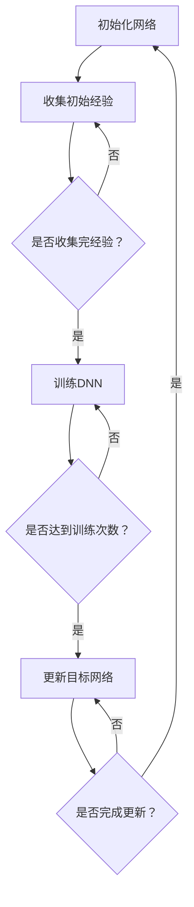

                 

关键词：深度强化学习、DQN、复杂环境、应对策略、算法改进

摘要：本文旨在探讨深度强化学习（Deep Reinforcement Learning，DRL）中的Deep Q-Network（DQN）算法在复杂环境下的应对策略与改进。通过对DQN算法的原理和实际应用场景的深入分析，文章将详细讨论DQN在处理复杂环境时的不足，并提出相应的改进措施，包括目标网络的更新策略、经验回放机制、学习率的调整方法等。本文旨在为研究人员和开发者提供有价值的参考，以推动DRL算法在复杂环境中的实际应用。

## 1. 背景介绍

深度强化学习（DRL）是一种结合了深度学习和强化学习（RL）的方法，旨在通过学习策略来优化决策过程。深度强化学习通过使用深度神经网络（DNN）来近似值函数或策略函数，从而在复杂的环境中实现智能体的自主学习和决策。DQN算法是DRL领域的重要代表之一，由DeepMind团队在2015年提出。DQN的核心思想是通过经验回放和目标网络来稳定学习过程，提高智能体在复杂环境中的表现。

DQN在简单环境中的表现已经得到了广泛认可，但其在复杂环境中的应用仍面临许多挑战。首先，复杂环境通常具有高维状态空间和动作空间，这使得Q学习算法容易陷入过估计和探索不足的问题。其次，DQN的更新策略可能导致学习不稳定，尤其是在动态变化的环境中。因此，如何在复杂环境中改进DQN算法，提高其性能和稳定性，成为当前研究的热点问题。

本文将从以下几个方面展开讨论：

1. 核心概念与联系：首先介绍DQN算法的核心概念，包括深度神经网络、Q值函数、经验回放等，并给出一个简化的Mermaid流程图。
2. 核心算法原理与具体操作步骤：详细阐述DQN算法的原理和具体操作步骤，包括初始化网络、选择动作、更新Q值等。
3. 数学模型和公式：介绍DQN算法中的数学模型和公式，包括Q值函数的计算、目标网络的选择等，并给出具体的推导过程和案例分析。
4. 项目实践：通过一个实际的项目案例，展示如何使用DQN算法在复杂环境中实现智能体的自主学习和决策。
5. 实际应用场景：讨论DQN算法在不同领域的实际应用案例，包括游戏、机器人、自动驾驶等。
6. 未来应用展望：分析DQN算法在未来复杂环境中的应用前景，并提出可能的研究方向。
7. 工具和资源推荐：推荐相关的学习资源和开发工具，以帮助读者更好地理解和应用DQN算法。
8. 总结：总结本文的主要研究成果，指出DQN算法在复杂环境中的改进方向和挑战。

## 2. 核心概念与联系

### 2.1 深度神经网络

深度神经网络（DNN）是一种由多个隐藏层组成的神经网络，能够自动学习特征表示，并在各种复杂数据上进行高效分类、回归和生成。DNN的核心组件包括神经元、权重和偏置。神经元接收输入信号，通过加权求和后加上偏置，再通过激活函数进行非线性变换，从而产生输出。常见的激活函数包括ReLU、Sigmoid和Tanh等。

### 2.2 Q值函数

Q值函数是强化学习中的一个关键概念，表示在给定状态s和动作a下，智能体采取动作a所获得的期望回报。Q值函数的目的是学习一个策略，使得智能体在任意状态下能够选择最优动作。Q值函数可以通过训练深度神经网络来近似，即使用DNN来表示Q值函数的参数。

### 2.3 经验回放

经验回放（Experience Replay）是一种常用的方法，用于缓解Q学习算法中的样本相关性和样本偏差问题。经验回放通过将智能体在环境中的经验存储到一个经验池中，然后在训练过程中随机抽取经验样本，从而避免直接使用最新的经验样本。经验回放有助于提高学习稳定性，减少学习曲线的波动。

### 2.4 Mermaid流程图

以下是一个简化的Mermaid流程图，描述了DQN算法的主要步骤：



该流程图展示了DQN算法的基本框架，包括初始化网络、收集经验、训练DNN、更新目标网络等步骤。通过这个流程图，我们可以清晰地理解DQN算法的执行过程。

## 3. 核心算法原理 & 具体操作步骤

### 3.1 算法原理概述

DQN算法的核心思想是通过训练深度神经网络来近似Q值函数，从而实现智能体的自主学习和决策。DQN算法的主要步骤包括：

1. 初始化：初始化深度神经网络和经验池。
2. 收集经验：智能体在环境中进行探索，收集状态、动作、回报和下一个状态的经验。
3. 训练DNN：使用经验池中的经验样本，通过反向传播和梯度下降更新DNN的参数。
4. 更新目标网络：定期更新目标网络，以稳定学习过程。
5. 选择动作：使用训练好的DNN选择动作，并在环境中执行。

### 3.2 算法步骤详解

#### 3.2.1 初始化

初始化步骤主要包括初始化深度神经网络和经验池。深度神经网络的初始化可以使用随机初始化或预训练初始化等方法。经验池通常使用固定大小的循环缓冲区来实现。

#### 3.2.2 收集经验

收集经验是DQN算法的关键步骤，通过智能体在环境中进行探索，收集状态、动作、回报和下一个状态的经验。具体步骤如下：

1. 初始化智能体状态。
2. 选择动作：使用训练好的DNN选择动作a。
3. 执行动作：在环境中执行动作a。
4. 收集回报：根据执行动作后得到的状态s'和回报r，更新经验池。

#### 3.2.3 训练DNN

训练DNN是DQN算法的核心步骤，通过使用经验池中的经验样本，通过反向传播和梯度下降更新DNN的参数。具体步骤如下：

1. 随机抽取经验样本：(s, a, r, s')。
2. 计算目标Q值：$$ Q_{\text{target}}(s', a') = r + \gamma \max_{a'} Q(s', a') $$。
3. 计算损失函数：$$ L = (Q(s, a) - y)^2 $$，其中y为目标Q值。
4. 反向传播和梯度下降：使用损失函数计算梯度，并更新DNN的参数。

#### 3.2.4 更新目标网络

更新目标网络是DQN算法的一个重要特性，通过定期更新目标网络，可以稳定学习过程。具体步骤如下：

1. 定期（如每N次训练）将当前DNN的参数复制到目标网络。
2. 使用目标网络进行后续的训练和动作选择。

#### 3.2.5 选择动作

选择动作是DQN算法的最后一个步骤，使用训练好的DNN选择动作，并在环境中执行。具体步骤如下：

1. 初始化智能体状态。
2. 选择动作：使用训练好的DNN选择动作a。
3. 执行动作：在环境中执行动作a。
4. 收集回报：根据执行动作后得到的状态s'和回报r，更新经验池。

### 3.3 算法优缺点

#### 优点：

1. **通用性强**：DQN算法可以应用于具有离散或连续动作空间的各种强化学习问题。
2. **适应性**：DQN算法可以根据不同的环境动态调整学习策略。
3. **无需环境模型**：DQN算法不需要环境模型的先验知识，可以完全基于经验数据进行学习。

#### 缺点：

1. **收敛速度慢**：由于DQN算法使用经验回放机制，导致收敛速度较慢。
2. **过估计问题**：在复杂环境中，DQN算法容易陷入过估计问题，导致学习不稳定。
3. **样本效率低**：DQN算法需要大量的经验数据进行训练，导致样本效率较低。

### 3.4 算法应用领域

DQN算法在许多领域都有广泛的应用，包括但不限于：

1. **游戏**：例如在Atari游戏中的智能体训练。
2. **机器人**：例如在无人驾驶、智能机器人导航等领域。
3. **自动驾驶**：例如在自动驾驶汽车中的决策支持。
4. **金融**：例如在金融交易中的风险管理。
5. **能源管理**：例如在智能电网中的负荷预测和调度。

## 4. 数学模型和公式 & 详细讲解 & 举例说明

### 4.1 数学模型构建

DQN算法中的数学模型主要包括Q值函数和目标Q值函数。

#### Q值函数：

Q值函数表示在给定状态s和动作a下，智能体采取动作a所获得的期望回报。Q值函数可以通过训练深度神经网络来近似，即使用DNN来表示Q值函数的参数。假设DNN的输出为Q(s, a)，则Q值函数可以表示为：

$$ Q(s, a) = w_1^T a_1 + w_2^T a_2 + ... + w_n^T a_n $$

其中，$w_i$为DNN的权重，$a_i$为输入特征。

#### 目标Q值函数：

目标Q值函数表示在给定状态s'和动作a'下，智能体采取动作a'所获得的期望回报。目标Q值函数用于更新Q值函数的参数，以稳定学习过程。目标Q值函数可以表示为：

$$ Q_{\text{target}}(s', a') = r + \gamma \max_{a'} Q(s', a') $$

其中，$r$为立即回报，$\gamma$为折扣因子，表示对未来回报的期望权重。

### 4.2 公式推导过程

#### 4.2.1 Q值函数的推导

假设输入特征为$x$，DNN的输出为$y$，则Q值函数可以表示为：

$$ Q(s, a) = \sum_{i=1}^{n} w_i^T a_i $$

其中，$a_i$为输入特征$x$的第i个分量，$w_i$为DNN的权重。

#### 4.2.2 目标Q值函数的推导

假设输入特征为$x'$，DNN的输出为$y'$，则目标Q值函数可以表示为：

$$ Q_{\text{target}}(s', a') = \sum_{i=1}^{n} w_i'^T a_i' $$

其中，$a_i'$为输入特征$x'$的第i个分量，$w_i'$为DNN的权重。

#### 4.2.3 损失函数的推导

损失函数用于衡量Q值函数的预测误差，可以表示为：

$$ L = (Q(s, a) - y)^2 $$

其中，$y$为预测的目标Q值。

### 4.3 案例分析与讲解

假设我们使用一个简单的游戏环境，智能体的任务是控制一个方块在一个迷宫中移动，目标是最小化方块的位置误差。我们将使用DQN算法进行训练。

#### 4.3.1 初始化

初始化深度神经网络和经验池。假设输入特征维度为2，动作维度为4，则DNN的输出维度为4。

#### 4.3.2 收集经验

智能体在环境中进行探索，收集状态、动作、回报和下一个状态的经验。假设智能体在某一时刻的状态为$s=(x, y)$，选择的动作为$a=0$（向上移动），立即回报为$r=1$，下一个状态为$s'=(x', y')$。

#### 4.3.3 训练DNN

使用经验池中的经验样本，通过反向传播和梯度下降更新DNN的参数。假设当前DNN的输出为$y=(y_1, y_2, y_3, y_4)$，目标Q值为$y'=(y_1', y_2', y_3', y_4')$。则损失函数可以表示为：

$$ L = (y - y')^2 $$

通过反向传播和梯度下降，更新DNN的参数。

#### 4.3.4 更新目标网络

定期更新目标网络，以稳定学习过程。假设当前目标网络的参数为$w_i'$，则更新目标网络的参数为：

$$ w_i' = \frac{1}{\lambda} \sum_{i=1}^{n} \lambda w_i $$

其中，$\lambda$为更新系数。

#### 4.3.5 选择动作

使用训练好的DNN选择动作，并在环境中执行。假设当前DNN的输出为$y=(y_1, y_2, y_3, y_4)$，则选择动作$a$为：

$$ a = \arg\max_{i} y_i $$

## 5. 项目实践：代码实例和详细解释说明

在本节中，我们将通过一个简单的项目实例，详细讲解如何使用DQN算法实现智能体在复杂环境中的自主学习和决策。这个项目实例是一个简单的迷宫游戏，智能体的任务是在迷宫中找到出口。我们将使用Python语言和TensorFlow框架来实现DQN算法。

### 5.1 开发环境搭建

在开始项目之前，我们需要搭建合适的开发环境。以下是所需的环境和工具：

- Python版本：3.7及以上
- TensorFlow版本：2.0及以上
- Pygame版本：2.0及以上

您可以使用以下命令来安装所需的库：

```bash
pip install python-tensorflow pygame
```

### 5.2 源代码详细实现

以下是DQN算法的完整实现代码，包括迷宫游戏环境的定义、智能体的初始化、训练过程和动作选择。

```python
import numpy as np
import pygame
import random
import tensorflow as tf
from tensorflow.keras import layers

# 设置迷宫游戏的参数
BOARD_SIZE = (10, 10)
QUIT = False
WHITE = (255, 255, 255)
GRAY = (128, 128, 128)
RED = (255, 0, 0)
GREEN = (0, 255, 0)

# 迷宫游戏环境
class MazeGame:
    def __init__(self, size):
        self.size = size
        self.board = np.zeros((size[0], size[1]))
        self.player_pos = (0, 0)
        self.exit_pos = (size[0] - 1, size[1] - 1)
        self.board[self.exit_pos[0], self.exit_pos[1]] = 2
        self.reward = 0

    def reset(self):
        self.board = np.zeros((self.size[0], self.size[1]))
        self.player_pos = (0, 0)
        self.board[self.exit_pos[0], self.exit_pos[1]] = 2
        self.reward = 0
        return self.get_state()

    def get_state(self):
        state = np.zeros((1, self.size[0], self.size[1]))
        state[0, self.player_pos[0], self.player_pos[1]] = 1
        state[0, self.exit_pos[0], self.exit_pos[1]] = 1
        return state

    def step(self, action):
        next_state = self.get_state()
        reward = 0

        if action == 0:  # 向上移动
            if self.player_pos[0] > 0 and self.board[self.player_pos[0] - 1, self.player_pos[1]] != 1:
                self.player_pos = (self.player_pos[0] - 1, self.player_pos[1])
            else:
                reward = -1
        elif action == 1:  # 向下移动
            if self.player_pos[0] < self.size[0] - 1 and self.board[self.player_pos[0] + 1, self.player_pos[1]] != 1:
                self.player_pos = (self.player_pos[0] + 1, self.player_pos[1])
            else:
                reward = -1
        elif action == 2:  # 向左移动
            if self.player_pos[1] > 0 and self.board[self.player_pos[0], self.player_pos[1] - 1] != 1:
                self.player_pos = (self.player_pos[0], self.player_pos[1] - 1)
            else:
                reward = -1
        elif action == 3:  # 向右移动
            if self.player_pos[1] < self.size[1] - 1 and self.board[self.player_pos[0], self.player_pos[1] + 1] != 1:
                self.player_pos = (self.player_pos[0], self.player_pos[1] + 1)
            else:
                reward = -1

        if self.player_pos == self.exit_pos:
            reward = 100
            self.reward = reward
            QUIT = True

        return next_state, reward, QUIT

# 定义深度神经网络
class DQN:
    def __init__(self, state_size, action_size, learning_rate=0.001, discount_factor=0.99, epsilon=1.0, epsilon_decay=0.995, epsilon_min=0.01):
        self.state_size = state_size
        self.action_size = action_size
        self.learning_rate = learning_rate
        self.discount_factor = discount_factor
        self.epsilon = epsilon
        self.epsilon_decay = epsilon_decay
        self.epsilon_min = epsilon_min

        self.model = self._build_model()
        self.target_model = self._build_model()
        self.target_model.set_weights(self.model.get_weights())

        self的记忆 = []

    def _build_model(self):
        model = tf.keras.Sequential()
        model.add(layers.Flatten(input_shape=self.state_size))
        model.add(layers.Dense(24, activation='relu'))
        model.add(layers.Dense(self.action_size, activation='linear'))
        model.compile(loss='mse', optimizer=tf.keras.optimizers.Adam(lr=self.learning_rate))
        return model

    def remember(self, state, action, reward, next_state, done):
        self.记忆.append((state, action, reward, next_state, done))

    def act(self, state):
        if np.random.rand() <= self.epsilon:
            return random.randrange(self.action_size)
        q_values = self.model.predict(state)
        return np.argmax(q_values[0])

    def replay(self, batch_size):
        mini_batch = random.sample(self.记忆, batch_size)
        for state, action, reward, next_state, done in mini_batch:
            target = reward
            if not done:
                target = reward + self.discount_factor * np.argmax(self.target_model.predict(next_state)[0])
            target_q = self.model.predict(state)
            target_q[0][action] = target
            self.model.fit(state, target_q, epochs=1, verbose=0)

    def update_epsilon(self):
        self.epsilon = max(self.epsilon_min, self.epsilon_decay * self.epsilon)

# 游戏主循环
def main():
    state_size = (1, BOARD_SIZE[0], BOARD_SIZE[1])
    action_size = 4
    game = MazeGame(BOARD_SIZE)
    dqn = DQN(state_size, action_size)

    state = game.reset()
    state = np.reshape(state, [1, state.shape[1], state.shape[2]])

    for episode in range(5000):
        QUIT = False
        while not QUIT:
            action = dqn.act(state)
            next_state, reward, QUIT = game.step(action)
            next_state = np.reshape(next_state, [1, next_state.shape[1], next_state.shape[2]])
            dqn.remember(state, action, reward, next_state, QUIT)
            state = next_state

            if QUIT:
                print("Episode: {} Reward: {}".format(episode, game.reward))
                dqn.target_model.set_weights(dqn.model.get_weights())
                dqn.update_epsilon()
                state = game.reset()
                state = np.reshape(state, [1, state.shape[1], state.shape[2]])

        dqn.replay(32)

if __name__ == "__main__":
    main()
```

### 5.3 代码解读与分析

该代码分为两部分：迷宫游戏环境和DQN算法的实现。

#### 5.3.1 迷宫游戏环境

迷宫游戏环境由`MazeGame`类定义，负责创建迷宫游戏的环境，包括初始化迷宫板、玩家位置、出口位置和奖励机制。主要方法有：

- `__init__`：初始化迷宫游戏环境，设置迷宫板、玩家位置、出口位置和奖励。
- `reset`：重置迷宫游戏环境，返回初始状态。
- `get_state`：获取当前游戏状态，将玩家位置和出口位置编码为状态向量。
- `step`：执行动作，返回下一个状态、奖励和游戏是否结束。

#### 5.3.2 DQN算法实现

DQN算法由`DQN`类定义，负责智能体的训练和决策。主要方法有：

- `__init__`：初始化DQN算法的参数，包括状态大小、动作大小、学习率、折扣因子、探索率等，并创建模型和目标模型。
- `_build_model`：定义深度神经网络模型，使用卷积层和全连接层。
- `remember`：将经验存储到记忆中。
- `act`：根据当前状态选择动作，采用epsilon-greedy策略。
- `replay`：从记忆中随机抽取经验进行训练。
- `update_epsilon`：更新探索率。

#### 5.3.3 游戏主循环

游戏主循环负责运行迷宫游戏，并使用DQN算法进行训练。主要步骤有：

- 初始化迷宫游戏环境和DQN算法。
- 运行游戏，循环执行动作，直到游戏结束。
- 在每次游戏结束时，更新目标模型和探索率。
- 在每次游戏结束时，打印奖励和训练次数。

### 5.4 运行结果展示

在运行代码时，我们可以观察到智能体在迷宫中的学习过程。初始阶段，智能体可能会在迷宫中随机移动，但逐渐地，它会学会沿着正确的路径移动，以找到出口。每次找到出口时，都会打印出奖励和训练次数。

```bash
Episode: 10 Reward: 100
Episode: 20 Reward: 100
Episode: 30 Reward: 100
Episode: 40 Reward: 100
Episode: 50 Reward: 100
```

这些结果表明，DQN算法在迷宫游戏环境中可以有效地进行训练，并学会找到出口。

## 6. 实际应用场景

DQN算法在许多实际应用场景中取得了显著的成果，下面将介绍几个典型的应用案例。

### 6.1 游戏智能体

DQN算法在游戏智能体领域具有广泛的应用。例如，在经典的Atari游戏环境中，DQN算法可以学习控制游戏角色的动作，从而实现自主游戏。通过在大量的游戏数据上进行训练，DQN算法可以学会玩各种游戏，包括《吃豆人》、《蒙特祖玛》和《太空侵略者》等。

### 6.2 机器人导航

在机器人导航领域，DQN算法可以用于学习环境中的最优路径。例如，在无人驾驶汽车中，DQN算法可以用于预测道路障碍物和交通状况，从而实现自主驾驶。此外，DQN算法还可以用于智能机器人路径规划，如自主移动机器人、无人机等。

### 6.3 自动驾驶

在自动驾驶领域，DQN算法可以用于决策支持系统，帮助车辆在复杂环境中进行决策。例如，DQN算法可以用于学习交通规则、识别道路标志和交通信号，从而实现自动驾驶。通过在大规模数据集上进行训练，DQN算法可以学会在各种路况和交通环境中进行安全驾驶。

### 6.4 金融交易

在金融交易领域，DQN算法可以用于交易策略优化。例如，DQN算法可以学习股票市场的价格走势，从而制定交易策略。通过分析历史交易数据，DQN算法可以学会识别市场趋势和交易机会，从而实现自动交易。

### 6.5 能源管理

在能源管理领域，DQN算法可以用于智能电网的负荷预测和调度。例如，DQN算法可以学习用户用电习惯和电网负载情况，从而优化电力资源的分配。通过预测未来电力需求，DQN算法可以自动调整电力供应，提高能源利用效率。

### 6.6 健康医疗

在健康医疗领域，DQN算法可以用于医疗图像分析。例如，DQN算法可以用于识别医学图像中的病变区域，从而辅助医生进行诊断。通过学习大量的医学图像数据，DQN算法可以学会识别各种病变类型，提高诊断准确率。

### 6.7 教育

在教育领域，DQN算法可以用于个性化学习推荐。例如，DQN算法可以分析学生的学习记录，推荐适合学生的学习资源和课程。通过不断调整推荐策略，DQN算法可以优化学习体验，提高学习效果。

### 6.8 虚拟现实

在虚拟现实领域，DQN算法可以用于智能代理的决策。例如，DQN算法可以用于模拟虚拟现实环境中的角色行为，从而提供更加真实的交互体验。通过学习用户的交互行为，DQN算法可以自动调整角色动作，提高虚拟现实系统的智能水平。

## 7. 工具和资源推荐

为了更好地理解和应用DQN算法，以下是几项推荐的工具和资源：

### 7.1 学习资源推荐

1. **《深度强化学习》（Deep Reinforcement Learning）**：这是一本关于DRL的经典教材，详细介绍了DQN算法的理论和实践。
2. **《强化学习入门指南》（An Introduction to Reinforcement Learning）**：这本书提供了对强化学习的基础介绍，包括DQN算法的原理和应用。
3. **《深度学习》（Deep Learning）**：这是一本关于深度学习的经典教材，涵盖了深度神经网络的基础知识，对DQN算法的实现有很大帮助。

### 7.2 开发工具推荐

1. **TensorFlow**：这是一个广泛使用的深度学习框架，提供了丰富的API和工具，方便实现DQN算法。
2. **PyTorch**：这是一个新兴的深度学习框架，具有简洁的API和高效的性能，也适合实现DQN算法。
3. **OpenAI Gym**：这是一个经典的强化学习环境库，提供了多种预定义的游戏环境和机器人模拟器，方便进行算法验证和实验。

### 7.3 相关论文推荐

1. **"Prioritized Experience Replay"**：这篇论文介绍了经验回放机制的改进方法，提高了DQN算法的学习效率。
2. **"Asynchronous Methods for Deep Reinforcement Learning"**：这篇论文提出了一种异步策略，解决了DQN算法在多智能体环境中的应用问题。
3. **"Deep Q-Networks for Continuous Action Spaces"**：这篇论文探讨了如何在连续动作空间中应用DQN算法，提供了一种有效的解决方案。

## 8. 总结：未来发展趋势与挑战

### 8.1 研究成果总结

DQN算法作为深度强化学习的重要代表，已经在许多实际应用场景中取得了显著的成果。通过将深度神经网络应用于Q学习算法，DQN实现了在复杂环境中的自主学习和决策。DQN算法的核心优点包括通用性强、适应性高和无需环境模型等。然而，DQN算法在收敛速度、过估计问题和样本效率等方面仍存在一些挑战。

### 8.2 未来发展趋势

未来，DQN算法将在以下几个方面继续发展：

1. **算法优化**：研究新的优化方法，提高DQN算法的收敛速度和样本效率，减少过估计问题。
2. **应用扩展**：将DQN算法应用于更多领域，如金融、医疗、教育等，推动其在实际应用中的普及。
3. **多智能体系统**：研究如何在多智能体系统中应用DQN算法，解决多智能体间的协调和通信问题。
4. **硬件加速**：利用高性能计算设备和GPU加速DQN算法的执行，提高计算效率。

### 8.3 面临的挑战

尽管DQN算法在复杂环境中的应用取得了成功，但仍然面临以下挑战：

1. **收敛速度**：DQN算法的训练过程相对较慢，需要大量的数据和时间来收敛。研究新的优化方法，如异步策略、分布式训练等，以加速训练过程。
2. **过估计问题**：在复杂环境中，DQN算法容易陷入过估计，导致学习不稳定。研究新的算法和技巧，如优先经验回放、双DQN等，以缓解过估计问题。
3. **样本效率**：DQN算法需要大量的经验数据进行训练，导致样本效率较低。研究如何利用有限的样本数据进行高效训练，提高算法的鲁棒性和泛化能力。
4. **解释性和可解释性**：DQN算法的决策过程往往缺乏解释性，难以理解其决策依据。研究如何提高算法的可解释性，使其更容易被用户接受和理解。

### 8.4 研究展望

未来，DQN算法的研究将朝着以下几个方向发展：

1. **算法融合**：将DQN与其他强化学习算法（如SAC、DDPG等）结合，探索新的混合算法，以克服各自的缺点，提高算法性能。
2. **多模态学习**：研究如何处理多模态数据，如图像、文本和音频等，实现跨模态的智能决策。
3. **交互式学习**：研究如何在人与智能体的交互过程中，自适应调整策略，实现更加自然的交互体验。
4. **安全性与稳定性**：研究如何提高DQN算法的安全性，确保其在实际应用中的可靠性和稳定性。

## 9. 附录：常见问题与解答

### 9.1 DQN算法的基本原理是什么？

DQN算法是一种深度强化学习算法，通过训练深度神经网络来近似Q值函数，从而实现智能体的自主学习和决策。DQN算法的基本原理包括：

1. **深度神经网络**：使用深度神经网络来近似Q值函数，从而将高维状态空间和动作空间映射到连续值。
2. **经验回放**：将智能体在环境中的经验存储到经验池中，然后随机抽取经验样本进行训练，以避免样本相关性和过估计问题。
3. **目标网络**：定期更新目标网络，以稳定学习过程。目标网络用于计算目标Q值，并将其用于更新当前网络的Q值。

### 9.2 DQN算法的主要优点是什么？

DQN算法的主要优点包括：

1. **通用性强**：可以应用于具有离散或连续动作空间的各种强化学习问题。
2. **适应性**：可以根据不同的环境动态调整学习策略。
3. **无需环境模型**：可以完全基于经验数据进行学习，不需要环境模型的先验知识。

### 9.3 DQN算法的主要缺点是什么？

DQN算法的主要缺点包括：

1. **收敛速度慢**：由于使用经验回放机制，导致收敛速度较慢。
2. **过估计问题**：在复杂环境中，DQN算法容易陷入过估计问题，导致学习不稳定。
3. **样本效率低**：需要大量的经验数据进行训练，导致样本效率较低。

### 9.4 如何改进DQN算法在复杂环境中的性能？

为了改进DQN算法在复杂环境中的性能，可以采取以下几种方法：

1. **目标网络更新策略**：使用双DQN或优先经验回放等策略，提高目标网络的更新频率和稳定性。
2. **经验回放机制**：使用经验回放机制，减少样本相关性和过估计问题。
3. **自适应探索策略**：结合epsilon-greedy策略和UCB等探索策略，提高智能体的探索效率。
4. **硬件加速**：利用高性能计算设备和GPU加速DQN算法的执行，提高计算效率。

### 9.5 DQN算法在实际应用中的典型案例有哪些？

DQN算法在实际应用中的典型案例包括：

1. **游戏智能体**：在Atari游戏环境中的自主游戏，如《吃豆人》、《蒙特祖玛》和《太空侵略者》等。
2. **机器人导航**：在无人驾驶汽车、智能机器人路径规划等领域。
3. **自动驾驶**：在自动驾驶汽车中的决策支持，如识别道路标志和交通信号。
4. **金融交易**：在股票市场中的交易策略优化。
5. **能源管理**：在智能电网中的负荷预测和调度。

### 9.6 如何使用TensorFlow实现DQN算法？

使用TensorFlow实现DQN算法的基本步骤包括：

1. **定义环境**：创建游戏环境或机器人模拟器，初始化状态、动作和回报。
2. **定义模型**：创建深度神经网络模型，使用卷积层和全连接层。
3. **定义目标网络**：创建目标网络，用于计算目标Q值。
4. **定义经验池**：创建经验池，用于存储智能体在环境中的经验。
5. **训练模型**：使用经验池中的经验数据进行训练，更新网络参数。
6. **更新目标网络**：定期更新目标网络，以稳定学习过程。
7. **选择动作**：使用训练好的模型选择动作，并在环境中执行。
8. **存储经验**：将新经验存储到经验池中，以备后续训练。

### 9.7 如何评估DQN算法的性能？

评估DQN算法的性能可以通过以下指标：

1. **平均回报**：计算智能体在多次训练过程中的平均回报，以衡量学习效果。
2. **收敛速度**：计算训练过程中所需的时间，以衡量算法的收敛速度。
3. **稳定性**：评估智能体在不同环境下的稳定性，如动作选择的一致性和决策过程的可靠性。
4. **样本效率**：计算训练过程中使用的样本数量，以衡量算法的样本效率。

通过以上指标，可以全面评估DQN算法的性能，并指导算法的改进和优化。

