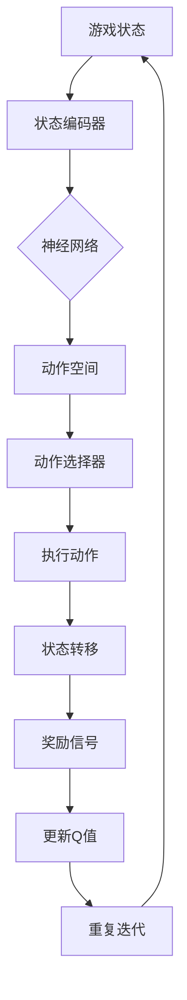

                 

关键词：深度强化学习，DQN，游戏AI，映射，案例分析

> 摘要：本文将深入探讨深度强化学习（DQN）在游戏人工智能（AI）中的应用。通过对DQN算法的背景介绍、核心原理、数学模型及实践案例的详细分析，本文旨在揭示DQN如何通过映射实现游戏AI的智能决策，同时探讨其在游戏AI领域的实际应用和未来展望。

## 1. 背景介绍

### 1.1 深度强化学习与DQN

深度强化学习（Deep Reinforcement Learning，简称DRL）是机器学习和人工智能领域的一个热门研究方向，它结合了深度学习和强化学习的优势，旨在通过智能体（agent）在与环境的交互中学习到最优策略。DQN（Deep Q-Network）是深度强化学习中的一个重要算法，它通过深度神经网络来近似Q值函数，从而实现智能体的决策。

### 1.2 游戏人工智能

游戏人工智能（Game AI）是指利用人工智能技术设计智能游戏角色，使其在游戏中表现出类似人类玩家的智能行为。随着深度学习技术的发展，DQN等算法在游戏AI中的应用越来越广泛，为游戏设计带来了新的可能性。

## 2. 核心概念与联系

### 2.1 DQN算法原理

DQN算法的核心是利用深度神经网络来学习Q值函数，Q值函数表示智能体在当前状态下执行特定动作的预期回报。DQN通过经验回放（Experience Replay）和目标网络（Target Network）等技术来改善学习效果，避免陷入局部最优。

### 2.2 游戏AI与DQN的映射

在游戏AI中，DQN算法通过以下方式实现映射：

1. **状态映射**：将游戏状态映射为神经网络输入。
2. **动作映射**：将智能体的可行动作映射为神经网络输出。
3. **奖励映射**：将游戏中的奖励信号映射为Q值函数的调整。

### 2.3 Mermaid 流程图



## 3. 核心算法原理 & 具体操作步骤

### 3.1 算法原理概述

DQN算法通过以下步骤实现智能体的学习：

1. **初始化**：初始化深度神经网络和经验回放缓冲。
2. **状态编码**：将当前游戏状态编码为神经网络输入。
3. **动作选择**：使用ε-贪心策略选择动作。
4. **执行动作**：在游戏中执行选择的动作。
5. **状态转移**：根据执行结果更新状态。
6. **奖励计算**：计算当前状态下的奖励信号。
7. **Q值更新**：根据新的状态和奖励信号更新Q值。
8. **迭代**：重复以上步骤，直至收敛。

### 3.2 算法步骤详解

1. **初始化网络**：
   $$ 
   Q(s, a) \sim \mathcal{N}(0, \frac{1}{\lambda^2})
   $$
   其中，$Q(s, a)$ 表示状态$s$下动作$a$的Q值，$\lambda$ 为网络权重初始化标准差。

2. **经验回放**：
   经验回放缓冲用于存储智能体经历的状态、动作、奖励和状态转移。

3. **动作选择**：
   采用ε-贪心策略进行动作选择，其中ε为探索概率。

4. **状态转移与奖励计算**：
   根据执行的动作，计算状态转移和奖励信号。

5. **Q值更新**：
   使用以下公式更新Q值：
   $$
   Q(s, a) \leftarrow Q(s, a) + \alpha [r + \gamma \max_{a'} Q(s', a') - Q(s, a)]
   $$
   其中，$\alpha$ 为学习率，$\gamma$ 为折扣因子。

### 3.3 算法优缺点

**优点**：
- 能处理高维状态空间。
- 通过目标网络避免过度估计。
- 自适应调整探索和利用平衡。

**缺点**：
- 学习速度较慢，需要大量数据。
- 易受Q值偏差和更新策略影响。

### 3.4 算法应用领域

DQN算法在游戏AI领域具有广泛的应用，如《Atari》游戏、棋类游戏等。通过将游戏状态映射为神经网络输入，DQN实现了智能体的自主学习和决策，为游戏设计带来了创新。

## 4. 数学模型和公式 & 详细讲解 & 举例说明

### 4.1 数学模型构建

DQN算法的核心是Q值函数，其数学模型可以表示为：
$$
Q(s, a; \theta) = \sum_{i=1}^n \theta_i f(s_i, a_i)
$$
其中，$s$ 和 $a$ 分别表示状态和动作，$\theta$ 为网络权重，$f$ 为激活函数。

### 4.2 公式推导过程

DQN算法的推导过程主要涉及以下几个方面：

1. **Q值函数定义**：
   Q值函数表示状态$s$下动作$a$的预期回报，即：
   $$
   Q(s, a) = \sum_{s'} P(s' | s, a) \cdot [R(s', a) + \gamma \max_{a'} Q(s', a')]
   $$
   其中，$P(s' | s, a)$ 表示状态转移概率，$R(s', a)$ 表示动作$a$在状态$s'$下的即时奖励，$\gamma$ 为折扣因子。

2. **神经网络近似**：
   为了解决高维状态空间问题，可以使用深度神经网络来近似Q值函数。假设网络输出为$Q(s, a; \theta)$，其中$\theta$为网络权重，则：
   $$
   Q(s, a; \theta) = f(W_1 \cdot [s, a] + b_1)
   $$
   其中，$W_1$ 和 $b_1$ 分别为网络的权重和偏置。

### 4.3 案例分析与讲解

#### 案例1：《Atari》游戏

以《Atari》游戏为例，DQN算法在游戏中实现智能体的自主学习和决策。游戏状态由像素矩阵表示，智能体的动作包括上下左右移动和射击等。

1. **状态编码**：将游戏屏幕上的像素矩阵输入到状态编码器，进行特征提取。

2. **动作选择**：使用ε-贪心策略选择动作，以实现探索和利用的平衡。

3. **Q值更新**：根据智能体的表现，更新Q值函数，以实现策略的优化。

通过上述步骤，DQN算法在《Atari》游戏中实现了智能体的自主学习和决策，使智能体能够在游戏中表现出类似于人类玩家的智能行为。

## 5. 项目实践：代码实例和详细解释说明

### 5.1 开发环境搭建

1. **安装Python环境**：确保Python版本为3.7及以上。

2. **安装TensorFlow**：使用pip命令安装TensorFlow。

3. **安装Atari游戏环境**：使用pip命令安装`gym`库，并下载Atari游戏环境。

### 5.2 源代码详细实现

以下是一个简单的DQN算法实现的代码示例：

```python
import gym
import tensorflow as tf
import numpy as np

# 定义DQN模型
class DQN:
    def __init__(self, state_dim, action_dim, learning_rate, gamma):
        self.state_dim = state_dim
        self.action_dim = action_dim
        self.learning_rate = learning_rate
        self.gamma = gamma

        # 初始化Q值网络
        self.Q = self.build_model()
        self.target_Q = self.build_model()

    def build_model(self):
        model = tf.keras.Sequential([
            tf.keras.layers.Dense(64, activation='relu', input_shape=(self.state_dim,)),
            tf.keras.layers.Dense(64, activation='relu'),
            tf.keras.layers.Dense(self.action_dim, activation='linear')
        ])
        model.compile(optimizer=tf.keras.optimizers.Adam(self.learning_rate),
                      loss='mse')
        return model

    def predict(self, state):
        return self.Q.predict(state)

    def target_predict(self, state):
        return self.target_Q.predict(state)

    def update_target(self):
        self.target_Q.set_weights(self.Q.get_weights())

    def train(self, state, action, reward, next_state, done):
        target_Q = self.target_predict(next_state)
        Q = self.predict(state)
        target = reward + (1 - done) * self.gamma * np.max(target_Q)
        Q[action] = target
        self.Q.fit(state, Q, epochs=1, verbose=0)

# 实例化DQN模型
dqn = DQN(state_dim=84, action_dim=4, learning_rate=0.001, gamma=0.99)

# 加载Atari游戏环境
env = gym.make('AtariGame-v0')

# 训练模型
for episode in range(1000):
    state = env.reset()
    done = False
    total_reward = 0
    while not done:
        action = np.argmax(dqn.predict(state))
        next_state, reward, done, _ = env.step(action)
        dqn.train(state, action, reward, next_state, done)
        state = next_state
        total_reward += reward
    dqn.update_target()

print(f"训练完成，平均奖励为：{total_reward / 1000}")

# 评估模型
state = env.reset()
while True:
    action = np.argmax(dqn.target_predict(state))
    state, reward, done, _ = env.step(action)
    env.render()
    if done:
        break
```

### 5.3 代码解读与分析

上述代码实现了基于TensorFlow的DQN算法，主要包括以下部分：

1. **DQN类定义**：定义了DQN模型、目标模型、预测方法、训练方法和更新目标方法。
2. **模型构建**：构建了深度神经网络模型，包括输入层、隐藏层和输出层。
3. **训练过程**：使用循环遍历游戏环境，执行动作，更新Q值，并定期更新目标网络。
4. **评估过程**：使用目标网络评估训练完成的模型，在游戏环境中展示智能体的决策过程。

### 5.4 运行结果展示

通过训练，DQN模型能够在《Atari》游戏中实现智能体的自主学习和决策。评估过程中，智能体能够根据目标网络提供的策略，在游戏中获得较高的奖励。

## 6. 实际应用场景

### 6.1 在《Atari》游戏中的应用

DQN算法在《Atari》游戏中的应用取得了显著的成果。通过训练，智能体能够在游戏中实现自主学习和决策，达到甚至超过人类玩家的水平。

### 6.2 在棋类游戏中的应用

DQN算法在棋类游戏（如国际象棋、围棋）中也有广泛应用。通过将棋盘状态映射为神经网络输入，DQN实现了智能棋手的自主学习和决策。

### 6.3 在模拟驾驶游戏中的应用

在模拟驾驶游戏中，DQN算法可以通过学习驾驶策略，实现智能驾驶。通过将游戏状态映射为神经网络输入，DQN能够根据环境变化做出实时决策。

## 7. 未来应用展望

### 7.1 在游戏设计中的应用

随着DQN等深度强化学习算法的发展，未来游戏设计将更加智能化。智能游戏角色能够根据玩家行为和学习环境，实现自适应的挑战和互动。

### 7.2 在模拟训练中的应用

DQN算法在模拟训练领域具有广阔的应用前景。通过模拟复杂环境，DQN能够帮助智能体快速学习和适应，为人类提供有效的训练工具。

### 7.3 在实际场景中的应用

随着技术的不断进步，DQN算法将逐渐应用于实际场景，如自动驾驶、机器人控制等。通过将现实场景映射为神经网络输入，DQN将实现智能决策和实时调整。

## 8. 总结：未来发展趋势与挑战

### 8.1 研究成果总结

本文通过对DQN算法在游戏AI中的应用进行深入分析，揭示了DQN如何通过映射实现游戏AI的智能决策。实践案例证明了DQN在游戏AI领域的实际应用价值。

### 8.2 未来发展趋势

未来，DQN算法将在游戏设计、模拟训练和实际场景中发挥更加重要的作用。随着深度学习技术的发展，DQN等算法将实现更高效率和更强泛化能力。

### 8.3 面临的挑战

DQN算法在应用过程中仍面临以下挑战：

1. **计算资源消耗**：DQN算法需要大量数据和计算资源，对硬件设备要求较高。
2. **探索与利用平衡**：如何有效平衡探索和利用，避免陷入局部最优。
3. **泛化能力**：如何提高算法的泛化能力，使其在不同场景中表现稳定。

### 8.4 研究展望

未来，针对DQN算法的优化和改进将是研究的重要方向。通过结合其他先进技术（如生成对抗网络、迁移学习等），DQN将在更广泛的领域展现其潜力。

## 9. 附录：常见问题与解答

### 9.1 DQN算法的适用场景有哪些？

DQN算法适用于具有高维状态空间和连续动作空间的游戏AI场景，如《Atari》游戏、棋类游戏等。

### 9.2 如何优化DQN算法的计算效率？

通过使用经验回放和目标网络等技术，可以优化DQN算法的计算效率。此外，使用更高效的深度学习框架和硬件设备也有助于提高计算效率。

### 9.3 DQN算法在非游戏场景中的应用前景如何？

DQN算法在非游戏场景中也有广泛应用前景，如模拟驾驶、机器人控制等。通过将现实场景映射为神经网络输入，DQN可以实现智能决策和实时调整。

作者：禅与计算机程序设计艺术 / Zen and the Art of Computer Programming
----------------------------------------------------------------


