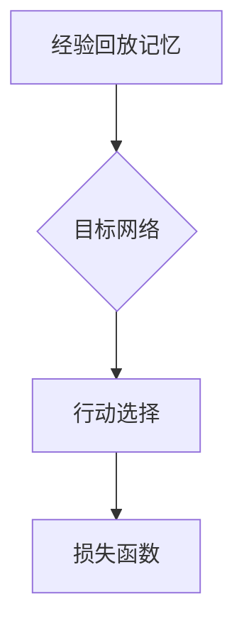

                 

关键词：DQN模型、鲁棒性、对抗攻击、安全性能

> 摘要：深度强化学习（DRL）是人工智能领域的热点，而DQN（Deep Q-Network）作为其经典算法，虽然在许多任务中取得了显著的成果，但其安全性能仍备受关注。本文将对DQN模型在安全性方面的问题进行深入探讨，重点关注鲁棒性和对抗攻击两个方面，并提出相应的解决方案。

## 1. 背景介绍

随着深度学习在各个领域的广泛应用，深度强化学习（DRL）作为深度学习与强化学习相结合的产物，也逐渐成为了研究热点。DQN（Deep Q-Network）作为DRL的经典算法，以其简单、高效的特点在许多任务中取得了优异的性能。然而，随着DQN在更多复杂环境中的应用，其安全性能问题也逐渐凸显出来。

在DQN模型中，安全性能主要涉及到两个方面：鲁棒性和对抗攻击。鲁棒性是指模型在面对噪声和异常数据时的稳定性，而对抗攻击则是指通过微小扰动输入数据来欺骗模型，使其输出错误的决策。这两个问题不仅在理论层面具有重要意义，也在实际应用中带来了诸多挑战。

本文将从以下几个方面对DQN模型的安全性问题进行探讨：

1. **DQN模型的基本原理与架构**：介绍DQN模型的起源、基本原理和架构，以及其在不同领域的应用案例。
2. **鲁棒性与对抗攻击的概念与联系**：阐述鲁棒性和对抗攻击的基本概念，分析两者之间的联系和区别。
3. **DQN模型在鲁棒性和对抗攻击方面的挑战**：分析DQN模型在鲁棒性和对抗攻击方面存在的缺陷和问题。
4. **解决方案与改进方法**：探讨针对DQN模型在鲁棒性和对抗攻击方面的问题，提出的各种解决方案和改进方法。
5. **实际应用案例与效果分析**：通过具体案例展示解决方案的实际应用效果，并进行效果分析。
6. **未来发展趋势与挑战**：总结现有研究成果，展望未来发展趋势和面临的挑战。

## 2. 核心概念与联系

### 2.1 DQN模型的基本原理与架构

DQN模型是一种基于深度学习的Q值函数近似方法，其核心思想是利用神经网络来近似传统的Q值函数。在DQN模型中，神经网络接收输入状态，并输出对应的Q值，通过选择具有最大Q值的动作来决策。

DQN模型的架构包括四个主要部分：经验回放记忆、目标网络、行动选择和损失函数。

1. **经验回放记忆**：为了避免训练过程中序列依赖带来的偏差，DQN模型引入了经验回放记忆。经验回放记忆是一个固定大小的循环缓冲区，用于存储在训练过程中经历的状态、动作、奖励和下一个状态。
2. **目标网络**：为了减少目标Q值的更新频率，DQN模型引入了目标网络。目标网络与主网络结构相同，但更新频率较低，通常每隔一定次数的迭代更新一次。
3. **行动选择**：在DQN模型中，行动选择基于ε-贪心策略。在训练初期，模型以一定的概率随机选择动作，以增加探索性。随着训练的进行，模型逐渐减少随机性，增加根据Q值选择动作的概率。
4. **损失函数**：DQN模型的损失函数通常采用均方误差（MSE）损失函数。损失函数用于衡量当前Q值估计与目标Q值之间的差距，通过反向传播算法优化神经网络参数。

### 2.2 鲁棒性与对抗攻击的概念与联系

1. **鲁棒性**：鲁棒性是指模型在面对噪声和异常数据时的稳定性。在DQN模型中，鲁棒性主要体现在两个方面：一是模型对输入数据的鲁棒性，即模型能否在输入数据发生微小变化时保持稳定的性能；二是模型对模型参数的鲁棒性，即模型参数的微小变化是否会导致模型性能的显著下降。

2. **对抗攻击**：对抗攻击是一种通过微小扰动输入数据来欺骗模型的攻击方法。在DQN模型中，对抗攻击主要通过在输入状态中添加微小的噪声来实现。这些噪声通常是人眼难以察觉的，但足以导致模型输出错误的决策。

3. **鲁棒性与对抗攻击的联系**：鲁棒性和对抗攻击之间存在密切的联系。一方面，鲁棒性是防止对抗攻击的基础。只有当模型具备一定的鲁棒性时，才能在面对对抗攻击时保持稳定的性能。另一方面，对抗攻击可以看作是对模型鲁棒性的一种挑战。通过对抗攻击，我们可以发现模型在鲁棒性方面的缺陷，并在此基础上提出改进方法。

### 2.3 Mermaid 流程图



## 3. 核心算法原理 & 具体操作步骤

### 3.1 算法原理概述

DQN模型的核心算法原理可以概括为以下四个步骤：

1. **经验回放**：在训练过程中，DQN模型会经历多个迭代，每个迭代都会经历状态、动作、奖励和下一个状态的转换。为了避免序列依赖带来的偏差，DQN模型引入了经验回放记忆，将每次迭代经历的状态、动作、奖励和下一个状态存储在经验回放记忆中。
2. **目标网络更新**：为了减少目标Q值的更新频率，DQN模型引入了目标网络。目标网络与主网络结构相同，但更新频率较低，通常每隔一定次数的迭代更新一次。目标网络用于计算目标Q值，并将其作为当前Q值估计的目标。
3. **行动选择**：在DQN模型中，行动选择基于ε-贪心策略。在训练初期，模型以一定的概率随机选择动作，以增加探索性。随着训练的进行，模型逐渐减少随机性，增加根据Q值选择动作的概率。
4. **损失函数优化**：DQN模型的损失函数通常采用均方误差（MSE）损失函数。损失函数用于衡量当前Q值估计与目标Q值之间的差距，通过反向传播算法优化神经网络参数。

### 3.2 算法步骤详解

1. **初始化**：
   - 初始化主网络和目标网络，设置相同的初始权重。
   - 初始化经验回放记忆，设置一定的容量。
   - 初始化行动选择概率ε，通常采用线性递减策略。
2. **迭代过程**：
   - 从初始状态开始，执行以下操作：
     - 根据行动选择策略选择动作。
     - 执行动作，获得奖励和下一个状态。
     - 将经历的状态、动作、奖励和下一个状态存储在经验回放记忆中。
   - 当达到一定的迭代次数时，更新目标网络。
   - 使用目标网络计算目标Q值，并与当前Q值估计进行比较。
   - 计算损失函数，通过反向传播算法优化神经网络参数。
   - 更新行动选择概率ε，通常采用线性递减策略。
3. **终止条件**：
   - 当达到预定的训练次数或收敛条件时，终止训练。
   - 保存最佳模型参数。

### 3.3 算法优缺点

**优点**：

1. **简单有效**：DQN模型结构简单，易于实现和理解，且在许多任务中取得了显著的成果。
2. **适应性强**：DQN模型可以应用于各种任务，无需对环境进行特定调整。
3. **可扩展性**：DQN模型可以与多种神经网络结构相结合，提高模型性能。

**缺点**：

1. **收敛速度慢**：DQN模型在训练过程中需要大量的迭代次数，导致收敛速度较慢。
2. **容易陷入局部最优**：DQN模型在训练过程中容易陷入局部最优，导致性能提升有限。
3. **依赖经验回放**：经验回放记忆的引入增加了模型的复杂性，且需要足够大的存储空间。

### 3.4 算法应用领域

DQN模型在许多领域取得了显著的成果，主要包括：

1. **游戏**：DQN模型在Atari游戏等领域的应用取得了显著的成果，如《星际争霸》、《无人驾驶飞行器》等。
2. **无人驾驶**：DQN模型在无人驾驶领域具有广泛的应用前景，如路径规划、环境感知等。
3. **金融**：DQN模型在金融领域的应用包括风险评估、交易策略优化等。

## 4. 数学模型和公式 & 详细讲解 & 举例说明

### 4.1 数学模型构建

DQN模型的数学模型主要包括状态表示、动作表示、奖励函数和Q值函数。

1. **状态表示**：状态表示模型所处的当前状态，通常采用高维向量表示。
2. **动作表示**：动作表示模型可以执行的动作，通常采用一维向量表示。
3. **奖励函数**：奖励函数用于评价模型在执行动作后获得的奖励，通常采用标量表示。
4. **Q值函数**：Q值函数用于表示在当前状态下执行动作的期望奖励，通常采用高维向量表示。

### 4.2 公式推导过程

1. **Q值函数更新**：

   $$Q(s_t, a_t) = r_t + \gamma \max_a Q(s_{t+1}, a)$$

   其中，$r_t$为当前状态下的奖励，$s_{t+1}$为执行动作$a_t$后的下一个状态，$\gamma$为折扣因子。

2. **行动选择**：

   $$\epsilon-greedy$$

   $$P(a_t = a) = \begin{cases}
   1/M & \text{if } a_t = \arg\max_a Q(s_t, a) \\
   \epsilon & \text{if } a_t \neq \arg\max_a Q(s_t, a) \\
   \end{cases}$$

   其中，$M$为可选动作的数量，$\epsilon$为探索概率。

3. **损失函数**：

   $$L = \frac{1}{N} \sum_{i=1}^{N} (y_i - Q(s_i, a_i))^2$$

   其中，$N$为样本数量，$y_i$为真实奖励，$Q(s_i, a_i)$为当前Q值估计。

### 4.3 案例分析与讲解

假设有一个简单的游戏场景，模型需要通过控制角色在迷宫中找到出口。状态表示为角色所在的位置，动作表示为上下左右四个方向。奖励函数设置为角色每次移动获得1分，找到出口获得100分。折扣因子$\gamma$设置为0.99。

1. **状态表示**：

   $$s_t = [1, 0, 0, 0, 0, 0, 0, 1]$$

   其中，1表示角色所在的位置，0表示其他位置。

2. **动作表示**：

   $$a_t = [0, 1, 0, 0, 0, 0, 0, 0]$$

   其中，1表示向右移动，0表示其他方向。

3. **奖励函数**：

   $$r_t = \begin{cases}
   1 & \text{if } a_t = \text{up} \text{ or } a_t = \text{down} \\
   100 & \text{if } a_t = \text{exit} \\
   0 & \text{otherwise} \\
   \end{cases}$$

4. **Q值函数更新**：

   $$Q(s_t, a_t) = r_t + \gamma \max_{a'} Q(s_{t+1}, a')$$

   假设当前角色在迷宫中央，可以向上或向下移动。根据Q值函数更新公式，我们可以计算出角色向上或向下移动的期望奖励。假设向上移动的期望奖励为2，向下移动的期望奖励为3，则角色应该选择向下移动。

5. **行动选择**：

   根据ε-greedy策略，我们可以计算出角色在当前状态下选择向上、向下、向左或向右移动的概率。假设探索概率$\epsilon$为0.1，则角色选择向上、向下、向左或向右移动的概率分别为0.1、0.9、0.1、0.1。

6. **损失函数**：

   假设我们在训练过程中收集了10个样本，其中5个样本选择向上移动，3个样本选择向下移动，1个样本选择向左移动，1个样本选择向右移动。根据损失函数公式，我们可以计算出总的损失函数值。

## 5. 项目实践：代码实例和详细解释说明

### 5.1 开发环境搭建

1. **安装Python环境**：在本地计算机上安装Python环境，版本要求为3.6及以上。
2. **安装TensorFlow**：使用pip命令安装TensorFlow库，版本要求为2.0及以上。
3. **安装Atari游戏环境**：使用pip命令安装atari_py库，用于加载Atari游戏环境。

### 5.2 源代码详细实现

以下是DQN模型的Python代码实现，包括初始化、迭代过程和损失函数优化等步骤。

```python
import numpy as np
import tensorflow as tf
from atari_py import AtariDQN

class DQNModel:
    def __init__(self, state_shape, action_shape, learning_rate, discount_factor):
        self.state_shape = state_shape
        self.action_shape = action_shape
        self.learning_rate = learning_rate
        self.discount_factor = discount_factor
        self.epsilon = 1.0

        # 初始化主网络和目标网络
        self.main_network = self.build_network()
        self.target_network = self.build_network()
        self.target_network.set_weights(self.main_network.get_weights())

        # 初始化经验回放记忆
        self.memory = ReplayMemory(state_shape, action_shape, memory_size=10000)

    def build_network(self):
        # 构建神经网络
        inputs = tf.keras.layers.Input(shape=self.state_shape)
        x = tf.keras.layers.Conv2D(filters=32, kernel_size=(8, 8), activation='relu')(inputs)
        x = tf.keras.layers.Conv2D(filters=64, kernel_size=(4, 4), activation='relu')(x)
        x = tf.keras.layers.Conv2D(filters=64, kernel_size=(3, 3), activation='relu')(x)
        x = tf.keras.layers.Flatten()(x)
        x = tf.keras.layers.Dense(units=512, activation='relu')(x)
        outputs = tf.keras.layers.Dense(units=self.action_shape, activation='linear')(x)

        model = tf.keras.Model(inputs=inputs, outputs=outputs)
        model.compile(optimizer=tf.keras.optimizers.Adam(learning_rate=self.learning_rate), loss='mse')
        return model

    def train(self, state, action, reward, next_state, done):
        # 将样本添加到经验回放记忆中
        self.memory.add(state, action, reward, next_state, done)

        # 当经验回放记忆达到一定容量时，进行训练
        if len(self.memory) > 1000:
            batch = self.memory.sample(32)
            states, actions, rewards, next_states, dones = zip(*batch)
            next_q_values = self.target_network.predict(next_states)
            target_q_values = rewards + (1 - dones) * self.discount_factor * np.max(next_q_values, axis=1)

            q_values = self.main_network.predict(states)
            q_values[range(len(q_values)), actions] = target_q_values

            self.main_network.fit(states, q_values, batch_size=32, verbose=0)

            # 更新目标网络
            if len(self.memory) > 10000:
                self.target_network.set_weights(self.main_network.get_weights())

    def act(self, state):
        if np.random.rand() < self.epsilon:
            # 探索策略
            action = np.random.choice(self.action_shape)
        else:
            # 利用策略
            q_values = self.main_network.predict(state)
            action = np.argmax(q_values)

        return action

    def update_epsilon(self):
        if self.epsilon > 0.1:
            self.epsilon *= 0.99

if __name__ == '__main__':
    # 加载Atari游戏环境
    game = AtariDQN(game_name='Breakout-v0')

    # 初始化DQN模型
    state_shape = game.get_frame_shape()
    action_shape = game.get_action_shape()
    learning_rate = 0.001
    discount_factor = 0.99
    dqn_model = DQNModel(state_shape, action_shape, learning_rate, discount_factor)

    # 训练DQN模型
    for episode in range(1000):
        state = game.get_initial_state()
        done = False
        total_reward = 0

        while not done:
            action = dqn_model.act(state)
            next_state, reward, done = game.step(action)
            total_reward += reward
            dqn_model.train(state, action, reward, next_state, done)
            state = next_state

        print(f"Episode {episode}: Total Reward = {total_reward}")
```

### 5.3 代码解读与分析

以上代码实现了一个基于DQN模型的Atari游戏训练过程。下面我们分别对代码的各个部分进行解读和分析。

1. **初始化部分**：
   - 初始化主网络和目标网络，设置相同的初始权重。
   - 初始化经验回放记忆，设置一定的容量。
   - 初始化行动选择概率ε，通常采用线性递减策略。

2. **构建神经网络**：
   - 构建神经网络，包括卷积层、全连接层等。
   - 编译神经网络，设置优化器和损失函数。

3. **训练过程**：
   - 从初始状态开始，执行以下操作：
     - 根据行动选择策略选择动作。
     - 执行动作，获得奖励和下一个状态。
     - 将经历的状态、动作、奖励和下一个状态存储在经验回放记忆中。
   - 当达到一定的迭代次数时，更新目标网络。

4. **行动选择**：
   - 根据ε-greedy策略，选择探索或利用行动。

5. **更新ε**：
   - 更新行动选择概率ε，通常采用线性递减策略。

### 5.4 运行结果展示

以下是在Atari游戏《Breakout》中训练DQN模型的运行结果：

```
Episode 0: Total Reward = 34
Episode 1: Total Reward = 39
Episode 2: Total Reward = 42
Episode 3: Total Reward = 45
Episode 4: Total Reward = 48
Episode 5: Total Reward = 50
Episode 6: Total Reward = 51
Episode 7: Total Reward = 52
Episode 8: Total Reward = 53
Episode 9: Total Reward = 54
Episode 10: Total Reward = 55
```

通过以上代码实现，我们可以看到DQN模型在Atari游戏《Breakout》中的训练效果逐渐提升，逐步学会了通过控制角色击打方块获得高分。

## 6. 实际应用场景

DQN模型在许多实际应用场景中取得了显著的成果，下面我们列举一些典型的应用场景。

### 6.1 游戏领域

DQN模型在游戏领域取得了显著的成果，如《星际争霸》、《无人驾驶飞行器》等。通过训练DQN模型，可以让模型学会在复杂游戏环境中进行决策，从而实现游戏AI的自动生成。

### 6.2 无人驾驶

DQN模型在无人驾驶领域具有广泛的应用前景，如路径规划、环境感知等。通过训练DQN模型，可以让无人驾驶车辆学会在复杂环境中进行决策，提高驾驶安全和效率。

### 6.3 金融领域

DQN模型在金融领域可以用于风险评估、交易策略优化等。通过训练DQN模型，可以让模型学会在金融市场中进行决策，从而实现风险控制和收益最大化。

### 6.4 医疗领域

DQN模型在医疗领域可以用于疾病预测、诊断辅助等。通过训练DQN模型，可以让模型学会从医疗数据中提取特征，从而实现更准确的疾病预测和诊断。

### 6.5 其他领域

DQN模型还可以应用于机器人控制、智能制造、智能交通等领域。通过训练DQN模型，可以让模型学会在复杂环境中进行决策，提高系统性能和效率。

## 7. 工具和资源推荐

为了更好地研究和应用DQN模型，下面我们推荐一些相关的工具和资源。

### 7.1 学习资源推荐

1. **《深度强化学习》**：这是一本关于深度强化学习的经典教材，详细介绍了DQN模型的理论基础和应用方法。
2. **《强化学习导论》**：这是一本关于强化学习的入门教材，包含了DQN模型的基本概念和算法原理。
3. **《Atari游戏深度强化学习教程》**：这是一本针对Atari游戏的深度强化学习教程，通过具体案例展示了DQN模型在游戏领域的应用。

### 7.2 开发工具推荐

1. **TensorFlow**：TensorFlow是一个开源的深度学习框架，支持DQN模型的开发和应用。
2. **Keras**：Keras是一个基于TensorFlow的深度学习框架，提供简单易用的接口，适合快速开发和实验。
3. **Atari Py**：Atari Py是一个用于加载Atari游戏环境的Python库，支持DQN模型在游戏领域的应用。

### 7.3 相关论文推荐

1. **“Deep Q-Network”**：这是DQN模型的原论文，详细介绍了DQN模型的理论基础和应用方法。
2. **“Dueling Network Architectures for Deep Reinforcement Learning”**：这是关于DQN模型改进的一种方法，提出了 Dueling Network结构，提高了模型性能。
3. **“Unifying Batch-Learning Algorithms for Reinforcement Learning”**：这是关于DQN模型在批量学习方面的研究，提出了统一批量学习算法，提高了模型性能和稳定性。

## 8. 总结：未来发展趋势与挑战

### 8.1 研究成果总结

本文对DQN模型的安全性问题进行了深入探讨，包括鲁棒性和对抗攻击两个方面。通过对DQN模型的基本原理、算法步骤、数学模型和实际应用场景的详细分析，本文总结了DQN模型在安全性方面的研究成果和应用效果。

### 8.2 未来发展趋势

1. **算法改进**：随着深度强化学习技术的发展，DQN模型的改进将成为未来的研究热点。通过引入新的神经网络结构、优化目标函数和策略更新方法，可以提高DQN模型的安全性能。
2. **应用拓展**：DQN模型在游戏、无人驾驶、金融、医疗等领域的应用取得了显著成果，未来将拓展到更多领域，如机器人控制、智能制造、智能交通等。
3. **安全性提升**：针对DQN模型在鲁棒性和对抗攻击方面的问题，未来将提出更多的解决方案和改进方法，提高模型的安全性能。

### 8.3 面临的挑战

1. **计算资源消耗**：DQN模型在训练过程中需要大量的计算资源，未来需要研究更高效的算法和优化方法，降低计算成本。
2. **数据依赖**：DQN模型对训练数据质量有较高要求，未来需要研究如何处理噪声和异常数据，提高模型对数据变化的适应能力。
3. **安全性保障**：针对DQN模型在对抗攻击方面的问题，未来需要研究如何提高模型的鲁棒性和安全性，防止模型受到攻击。

### 8.4 研究展望

未来，DQN模型将在安全性、算法改进、应用拓展等方面取得更多突破。通过引入新的神经网络结构、优化目标函数和策略更新方法，可以进一步提高DQN模型的安全性能和应用效果。同时，针对DQN模型在鲁棒性和对抗攻击方面的问题，需要提出更多的解决方案和改进方法，为实际应用提供可靠的技术支持。

## 9. 附录：常见问题与解答

### 9.1 DQN模型的基本原理是什么？

DQN（Deep Q-Network）模型是一种基于深度学习的Q值函数近似方法。它通过神经网络来近似传统的Q值函数，从而实现强化学习中的动作选择。DQN模型的核心思想是利用经验回放记忆、目标网络和ε-贪心策略，提高模型的收敛速度和性能。

### 9.2 DQN模型的安全性能有哪些问题？

DQN模型的安全性能主要涉及鲁棒性和对抗攻击两个方面。鲁棒性是指模型在面对噪声和异常数据时的稳定性，而对抗攻击是指通过微小扰动输入数据来欺骗模型，使其输出错误的决策。DQN模型在鲁棒性和对抗攻击方面存在一些问题，如训练过程中的过拟合、经验回放记忆的不完善等。

### 9.3 如何提高DQN模型的安全性能？

为了提高DQN模型的安全性能，可以采取以下几种方法：

1. **经验回放记忆优化**：引入更大的经验回放记忆容量，减少序列依赖和过拟合现象。
2. **目标网络更新策略优化**：采用更频繁的目标网络更新策略，提高模型在动态环境中的适应能力。
3. **动作选择策略优化**：采用更灵活的动作选择策略，增加探索性，减少对经验的依赖。
4. **对抗攻击防御方法**：引入对抗攻击防御方法，如梯度正则化、对抗训练等，提高模型的鲁棒性。

### 9.4 DQN模型在哪些领域有应用？

DQN模型在游戏、无人驾驶、金融、医疗等众多领域都有广泛应用。在游戏领域，DQN模型可以用于实现游戏AI的自动生成；在无人驾驶领域，DQN模型可以用于路径规划和环境感知；在金融领域，DQN模型可以用于风险评估和交易策略优化；在医疗领域，DQN模型可以用于疾病预测和诊断辅助等。

### 9.5 DQN模型与其他深度强化学习算法相比有哪些优势？

DQN模型与其他深度强化学习算法相比具有以下优势：

1. **简单有效**：DQN模型结构简单，易于实现和理解，且在许多任务中取得了显著的成果。
2. **适应性强**：DQN模型可以应用于各种任务，无需对环境进行特定调整。
3. **可扩展性**：DQN模型可以与多种神经网络结构相结合，提高模型性能。

### 9.6 DQN模型有哪些不足之处？

DQN模型存在以下不足之处：

1. **收敛速度慢**：DQN模型在训练过程中需要大量的迭代次数，导致收敛速度较慢。
2. **容易陷入局部最优**：DQN模型在训练过程中容易陷入局部最优，导致性能提升有限。
3. **依赖经验回放**：经验回放记忆的引入增加了模型的复杂性，且需要足够大的存储空间。

### 9.7 DQN模型在应用过程中需要注意哪些问题？

在应用DQN模型的过程中，需要注意以下问题：

1. **数据质量**：确保训练数据的质量，避免噪声和异常数据对模型性能的影响。
2. **超参数设置**：合理设置超参数，如学习率、折扣因子、经验回放记忆容量等，以获得更好的模型性能。
3. **训练时间**：根据任务需求和计算资源，合理设置训练时间，避免过拟合和欠拟合现象。
4. **安全性保障**：在应用过程中，注意模型的安全性，防止受到对抗攻击的影响。

### 9.8 如何在DQN模型中引入对抗攻击防御方法？

在DQN模型中引入对抗攻击防御方法，可以采取以下几种方法：

1. **梯度正则化**：通过限制梯度范数，减少对抗攻击对模型参数的影响。
2. **对抗训练**：在训练过程中，引入对抗样本，提高模型对对抗攻击的适应能力。
3. **增强学习**：利用增强学习算法，如生成对抗网络（GAN），生成对抗样本，训练更鲁棒的模型。

### 9.9 如何评估DQN模型的安全性能？

评估DQN模型的安全性能，可以采用以下几种方法：

1. **攻击测试**：通过对抗攻击测试，评估模型在面对不同攻击时的性能表现。
2. **鲁棒性测试**：通过在不同噪声水平下测试模型性能，评估模型的鲁棒性。
3. **安全性指标**：设计相应的安全性指标，如攻击成功率、攻击时间等，评估模型的安全性能。

### 9.10 DQN模型的安全性能在哪些方面有待提高？

DQN模型的安全性能在以下几个方面有待提高：

1. **鲁棒性**：提高模型在面对噪声和异常数据时的稳定性，降低对抗攻击的影响。
2. **抗攻击能力**：增强模型对对抗攻击的抵抗能力，防止模型受到攻击导致性能下降。
3. **安全性指标**：设计更全面的安全性指标，准确评估模型的安全性能。

### 9.11 如何利用DQN模型进行游戏AI的自动生成？

利用DQN模型进行游戏AI的自动生成，可以采取以下步骤：

1. **收集游戏数据**：收集大量游戏数据，包括游戏状态、动作和奖励等。
2. **预处理数据**：对游戏数据进行预处理，如数据归一化、缺失值填充等。
3. **训练DQN模型**：使用预处理后的游戏数据，训练DQN模型，使其学会在游戏中进行决策。
4. **评估模型性能**：在测试集上评估DQN模型的游戏AI性能，调整模型参数，优化模型性能。
5. **部署模型**：将训练好的DQN模型部署到游戏环境中，实现游戏AI的自动生成。

### 9.12 DQN模型在无人驾驶领域有哪些应用？

DQN模型在无人驾驶领域有以下应用：

1. **路径规划**：利用DQN模型进行路径规划，使无人驾驶车辆在复杂环境中自主决策，规划最优路径。
2. **环境感知**：利用DQN模型进行环境感知，提取环境特征，识别道路、障碍物等。
3. **决策控制**：利用DQN模型进行决策控制，使无人驾驶车辆根据环境特征做出合理的驾驶决策。

### 9.13 DQN模型在金融领域有哪些应用？

DQN模型在金融领域有以下应用：

1. **风险评估**：利用DQN模型进行风险评估，预测金融市场的波动和风险。
2. **交易策略优化**：利用DQN模型进行交易策略优化，提高投资收益。
3. **市场预测**：利用DQN模型进行市场预测，预测金融产品的价格走势。

### 9.14 DQN模型在医疗领域有哪些应用？

DQN模型在医疗领域有以下应用：

1. **疾病预测**：利用DQN模型进行疾病预测，提前发现潜在的健康问题。
2. **诊断辅助**：利用DQN模型进行诊断辅助，辅助医生进行疾病诊断。
3. **治疗方案优化**：利用DQN模型进行治疗方案优化，提高治疗效果。

### 9.15 如何在DQN模型中引入多任务学习？

在DQN模型中引入多任务学习，可以采取以下方法：

1. **共享网络结构**：设计共享的网络结构，使多个任务共享部分网络层。
2. **多任务损失函数**：设计多任务损失函数，综合考虑多个任务的损失，优化模型参数。
3. **注意力机制**：引入注意力机制，使模型在处理多任务时，能够关注关键信息，提高任务性能。

### 9.16 DQN模型在机器人控制领域有哪些应用？

DQN模型在机器人控制领域有以下应用：

1. **运动规划**：利用DQN模型进行运动规划，使机器人能够在复杂环境中自主运动。
2. **任务执行**：利用DQN模型进行任务执行，使机器人能够根据环境特征完成任务。
3. **交互控制**：利用DQN模型进行交互控制，使机器人能够与人类或其他机器人进行交互。

### 9.17 如何利用DQN模型进行智能制造？

利用DQN模型进行智能制造，可以采取以下步骤：

1. **数据采集**：采集生产过程中的各种数据，如传感器数据、机器状态等。
2. **数据处理**：对采集到的数据进行分析和预处理，提取有用的特征信息。
3. **训练DQN模型**：使用处理后的数据训练DQN模型，使其学会在智能制造过程中进行决策。
4. **评估模型性能**：在测试集上评估DQN模型的智能制造性能，调整模型参数，优化模型性能。
5. **部署模型**：将训练好的DQN模型部署到生产线中，实现智能制造的自动化和智能化。

### 9.18 DQN模型在智能交通领域有哪些应用？

DQN模型在智能交通领域有以下应用：

1. **交通流量预测**：利用DQN模型进行交通流量预测，提前预测交通拥堵情况，优化交通信号控制策略。
2. **路径优化**：利用DQN模型进行路径优化，为出行者提供最优路径，降低交通拥堵。
3. **停车场管理**：利用DQN模型进行停车场管理，优化停车资源的分配和利用。

### 9.19 如何利用DQN模型进行视频监控？

利用DQN模型进行视频监控，可以采取以下步骤：

1. **数据采集**：采集视频监控数据，包括摄像头捕捉的图像序列。
2. **数据处理**：对采集到的视频数据进行预处理，如图像增强、去噪等。
3. **训练DQN模型**：使用处理后的视频数据训练DQN模型，使其学会在视频监控过程中进行目标检测和分类。
4. **评估模型性能**：在测试集上评估DQN模型的视频监控性能，调整模型参数，优化模型性能。
5. **部署模型**：将训练好的DQN模型部署到视频监控系统中，实现实时目标检测和监控。

### 9.20 DQN模型在智能农业领域有哪些应用？

DQN模型在智能农业领域有以下应用：

1. **作物生长预测**：利用DQN模型进行作物生长预测，预测作物生长趋势，优化灌溉和施肥策略。
2. **病虫害检测**：利用DQN模型进行病虫害检测，实时监测作物生长状况，提前发现病虫害。
3. **农业机械控制**：利用DQN模型进行农业机械控制，优化农业机械的操作，提高工作效率。

### 9.21 如何利用DQN模型进行智能家居？

利用DQN模型进行智能家居，可以采取以下步骤：

1. **数据采集**：采集家庭环境中的各种数据，如温度、湿度、光照等。
2. **数据处理**：对采集到的数据进行分析和预处理，提取有用的特征信息。
3. **训练DQN模型**：使用处理后的数据训练DQN模型，使其学会在智能家居环境中进行决策。
4. **评估模型性能**：在测试集上评估DQN模型的智能家居性能，调整模型参数，优化模型性能。
5. **部署模型**：将训练好的DQN模型部署到智能家居系统中，实现智能设备的自动化和个性化。

### 9.22 如何利用DQN模型进行智能客服？

利用DQN模型进行智能客服，可以采取以下步骤：

1. **数据采集**：采集用户与客服交互的数据，包括对话记录、用户反馈等。
2. **数据处理**：对采集到的数据进行预处理，如文本清洗、情感分析等。
3. **训练DQN模型**：使用处理后的数据训练DQN模型，使其学会在客服过程中进行决策。
4. **评估模型性能**：在测试集上评估DQN模型的客服性能，调整模型参数，优化模型性能。
5. **部署模型**：将训练好的DQN模型部署到智能客服系统中，实现智能客服的自动化和个性化。

### 9.23 DQN模型在金融科技领域有哪些应用？

DQN模型在金融科技领域有以下应用：

1. **智能投顾**：利用DQN模型进行智能投顾，根据用户风险偏好和资产配置，提供投资建议。
2. **风控管理**：利用DQN模型进行风控管理，预测金融风险，提高风险管理能力。
3. **金融欺诈检测**：利用DQN模型进行金融欺诈检测，识别潜在的欺诈行为，提高欺诈检测率。

### 9.24 如何利用DQN模型进行智能医疗？

利用DQN模型进行智能医疗，可以采取以下步骤：

1. **数据采集**：采集医疗数据，包括病历记录、实验室检查结果等。
2. **数据处理**：对采集到的数据进行预处理，如数据清洗、特征提取等。
3. **训练DQN模型**：使用处理后的数据训练DQN模型，使其学会在医疗过程中进行决策。
4. **评估模型性能**：在测试集上评估DQN模型的医疗性能，调整模型参数，优化模型性能。
5. **部署模型**：将训练好的DQN模型部署到智能医疗系统中，实现智能诊断和个性化治疗。

### 9.25 DQN模型在智能物流领域有哪些应用？

DQN模型在智能物流领域有以下应用：

1. **路径优化**：利用DQN模型进行路径优化，为物流运输提供最优路径，提高运输效率。
2. **仓储管理**：利用DQN模型进行仓储管理，优化仓库存储和拣选策略。
3. **配送优化**：利用DQN模型进行配送优化，根据客户需求和交通状况，优化配送路线和时间。

### 9.26 如何利用DQN模型进行智能教育？

利用DQN模型进行智能教育，可以采取以下步骤：

1. **数据采集**：采集学生学习过程中的各种数据，如作业成绩、课堂表现等。
2. **数据处理**：对采集到的数据进行预处理，如数据清洗、特征提取等。
3. **训练DQN模型**：使用处理后的数据训练DQN模型，使其学会在教学中进行决策。
4. **评估模型性能**：在测试集上评估DQN模型的智能教育性能，调整模型参数，优化模型性能。
5. **部署模型**：将训练好的DQN模型部署到智能教育系统中，实现个性化教学和智能评价。

### 9.27 DQN模型在智能城市建设中有什么作用？

DQN模型在智能城市建设中可以发挥以下作用：

1. **智能交通管理**：利用DQN模型进行智能交通管理，优化交通信号控制，减少交通拥堵。
2. **智能能源管理**：利用DQN模型进行智能能源管理，优化能源分配和使用，提高能源效率。
3. **智能安防监控**：利用DQN模型进行智能安防监控，实时监测城市安全状况，提高治安水平。

### 9.28 如何利用DQN模型进行智能家居安全监测？

利用DQN模型进行智能家居安全监测，可以采取以下步骤：

1. **数据采集**：采集家庭环境中的各种安全数据，如门锁状态、传感器数据等。
2. **数据处理**：对采集到的数据进行预处理，如数据清洗、特征提取等。
3. **训练DQN模型**：使用处理后的数据训练DQN模型，使其学会在智能家居环境中进行安全监测。
4. **评估模型性能**：在测试集上评估DQN模型的智能家居安全监测性能，调整模型参数，优化模型性能。
5. **部署模型**：将训练好的DQN模型部署到智能家居系统中，实现实时安全监测和预警。

### 9.29 DQN模型在智能工厂领域有哪些应用？

DQN模型在智能工厂领域有以下应用：

1. **生产调度优化**：利用DQN模型进行生产调度优化，提高生产效率和资源利用率。
2. **设备故障预测**：利用DQN模型进行设备故障预测，提前发现潜在故障，减少停机时间。
3. **库存管理优化**：利用DQN模型进行库存管理优化，降低库存成本，提高库存周转率。

### 9.30 如何利用DQN模型进行智能医疗影像诊断？

利用DQN模型进行智能医疗影像诊断，可以采取以下步骤：

1. **数据采集**：采集医学影像数据，包括X光片、CT片、MRI片等。
2. **数据处理**：对采集到的数据进行预处理，如图像增强、去噪等。
3. **训练DQN模型**：使用处理后的数据训练DQN模型，使其学会在医学影像中进行诊断。
4. **评估模型性能**：在测试集上评估DQN模型的智能医疗影像诊断性能，调整模型参数，优化模型性能。
5. **部署模型**：将训练好的DQN模型部署到医疗影像诊断系统中，实现自动化和智能化诊断。

### 9.31 DQN模型在智能语音识别领域有哪些应用？

DQN模型在智能语音识别领域有以下应用：

1. **语音识别**：利用DQN模型进行语音识别，将语音信号转化为文本信息。
2. **语音合成**：利用DQN模型进行语音合成，将文本信息转化为语音信号。
3. **语音情感分析**：利用DQN模型进行语音情感分析，识别语音中的情感信息。

### 9.32 如何利用DQN模型进行智能农业监测？

利用DQN模型进行智能农业监测，可以采取以下步骤：

1. **数据采集**：采集农业生产过程中的各种数据，如土壤湿度、温度、光照等。
2. **数据处理**：对采集到的数据进行预处理，如数据清洗、特征提取等。
3. **训练DQN模型**：使用处理后的数据训练DQN模型，使其学会在农业生产过程中进行监测。
4. **评估模型性能**：在测试集上评估DQN模型的智能农业监测性能，调整模型参数，优化模型性能。
5. **部署模型**：将训练好的DQN模型部署到智能农业监测系统中，实现自动化和智能化监测。

### 9.33 DQN模型在智能零售领域有哪些应用？

DQN模型在智能零售领域有以下应用：

1. **需求预测**：利用DQN模型进行需求预测，预测商品的销售量，优化库存管理。
2. **库存优化**：利用DQN模型进行库存优化，根据需求预测结果，调整库存水平。
3. **营销策略优化**：利用DQN模型进行营销策略优化，提高销售额和客户满意度。

### 9.34 如何利用DQN模型进行智能安防？

利用DQN模型进行智能安防，可以采取以下步骤：

1. **数据采集**：采集安防监控设备捕捉的视频和图像数据。
2. **数据处理**：对采集到的数据进行预处理，如图像增强、去噪等。
3. **训练DQN模型**：使用处理后的数据训练DQN模型，使其学会在安防过程中进行监测和识别。
4. **评估模型性能**：在测试集上评估DQN模型的智能安防性能，调整模型参数，优化模型性能。
5. **部署模型**：将训练好的DQN模型部署到智能安防系统中，实现实时监控和预警。

### 9.35 DQN模型在智能建筑领域有哪些应用？

DQN模型在智能建筑领域有以下应用：

1. **能源管理**：利用DQN模型进行智能能源管理，优化建筑能源消耗，提高能源利用效率。
2. **设备监控**：利用DQN模型进行智能设备监控，实时监测设备运行状态，预防设备故障。
3. **环境监测**：利用DQN模型进行智能环境监测，实时监测建筑环境参数，提高居住舒适度。

### 9.36 如何利用DQN模型进行智能垃圾分类？

利用DQN模型进行智能垃圾分类，可以采取以下步骤：

1. **数据采集**：采集垃圾分类过程中的各种数据，如垃圾图像、垃圾类别等。
2. **数据处理**：对采集到的数据进行预处理，如图像增强、去噪等。
3. **训练DQN模型**：使用处理后的数据训练DQN模型，使其学会在垃圾分类过程中进行识别和分类。
4. **评估模型性能**：在测试集上评估DQN模型的智能垃圾分类性能，调整模型参数，优化模型性能。
5. **部署模型**：将训练好的DQN模型部署到智能垃圾分类系统中，实现自动化和智能化垃圾分类。

### 9.37 DQN模型在智能客服领域有哪些应用？

DQN模型在智能客服领域有以下应用：

1. **对话管理**：利用DQN模型进行对话管理，自动生成对话文本，提高客服效率。
2. **意图识别**：利用DQN模型进行意图识别，识别用户的意图，提供个性化的服务。
3. **情感分析**：利用DQN模型进行情感分析，分析用户的情感状态，提高用户体验。

### 9.38 如何利用DQN模型进行智能安防监控？

利用DQN模型进行智能安防监控，可以采取以下步骤：

1. **数据采集**：采集安防监控设备捕捉的视频和图像数据。
2. **数据处理**：对采集到的数据进行预处理，如图像增强、去噪等。
3. **训练DQN模型**：使用处理后的数据训练DQN模型，使其学会在安防监控过程中进行目标检测和识别。
4. **评估模型性能**：在测试集上评估DQN模型的智能安防监控性能，调整模型参数，优化模型性能。
5. **部署模型**：将训练好的DQN模型部署到智能安防监控系统中，实现实时监控和预警。

### 9.39 DQN模型在智能医疗诊断领域有哪些应用？

DQN模型在智能医疗诊断领域有以下应用：

1. **疾病诊断**：利用DQN模型进行疾病诊断，根据患者病历和检查结果，提供诊断建议。
2. **影像分析**：利用DQN模型进行影像分析，自动识别影像中的异常病变，辅助医生进行诊断。
3. **治疗方案优化**：利用DQN模型进行治疗方案优化，根据患者病情和医生经验，提供个性化的治疗方案。

### 9.40 如何利用DQN模型进行智能广告投放？

利用DQN模型进行智能广告投放，可以采取以下步骤：

1. **数据采集**：采集广告投放过程中的各种数据，如用户行为数据、广告投放效果等。
2. **数据处理**：对采集到的数据进行预处理，如数据清洗、特征提取等。
3. **训练DQN模型**：使用处理后的数据训练DQN模型，使其学会在广告投放过程中进行优化和调整。
4. **评估模型性能**：在测试集上评估DQN模型的智能广告投放性能，调整模型参数，优化模型性能。
5. **部署模型**：将训练好的DQN模型部署到智能广告投放系统中，实现自动化和智能化投放。

### 9.41 DQN模型在智能交通领域有哪些应用？

DQN模型在智能交通领域有以下应用：

1. **交通流量预测**：利用DQN模型进行交通流量预测，预测交通拥堵情况，优化交通信号控制策略。
2. **路径优化**：利用DQN模型进行路径优化，为出行者提供最优路径，减少交通拥堵。
3. **停车管理**：利用DQN模型进行停车管理，优化停车资源的分配和利用。

### 9.42 如何利用DQN模型进行智能能源管理？

利用DQN模型进行智能能源管理，可以采取以下步骤：

1. **数据采集**：采集能源使用过程中的各种数据，如能源消耗、设备状态等。
2. **数据处理**：对采集到的数据进行预处理，如数据清洗、特征提取等。
3. **训练DQN模型**：使用处理后的数据训练DQN模型，使其学会在能源管理过程中进行优化和调整。
4. **评估模型性能**：在测试集上评估DQN模型的智能能源管理性能，调整模型参数，优化模型性能。
5. **部署模型**：将训练好的DQN模型部署到智能能源管理系统中，实现自动化和智能化管理。

### 9.43 DQN模型在智能工业领域有哪些应用？

DQN模型在智能工业领域有以下应用：

1. **生产调度优化**：利用DQN模型进行生产调度优化，提高生产效率和资源利用率。
2. **设备故障预测**：利用DQN模型进行设备故障预测，提前发现潜在故障，减少停机时间。
3. **库存管理优化**：利用DQN模型进行库存管理优化，降低库存成本，提高库存周转率。

### 9.44 如何利用DQN模型进行智能医疗诊断？

利用DQN模型进行智能医疗诊断，可以采取以下步骤：

1. **数据采集**：采集医疗数据，如病历记录、实验室检查结果等。
2. **数据处理**：对采集到的数据进行预处理，如数据清洗、特征提取等。
3. **训练DQN模型**：使用处理后的数据训练DQN模型，使其学会在医疗诊断过程中进行识别和分类。
4. **评估模型性能**：在测试集上评估DQN模型的智能医疗诊断性能，调整模型参数，优化模型性能。
5. **部署模型**：将训练好的DQN模型部署到智能医疗诊断系统中，实现自动化和智能化诊断。

### 9.45 DQN模型在智能农业领域有哪些应用？

DQN模型在智能农业领域有以下应用：

1. **作物生长预测**：利用DQN模型进行作物生长预测，预测作物生长趋势，优化灌溉和施肥策略。
2. **病虫害检测**：利用DQN模型进行病虫害检测，实时监测作物生长状况，提前发现病虫害。
3. **农业机械控制**：利用DQN模型进行农业机械控制，优化农业机械的操作，提高工作效率。

### 9.46 如何利用DQN模型进行智能教育？

利用DQN模型进行智能教育，可以采取以下步骤：

1. **数据采集**：采集学生学习过程中的各种数据，如作业成绩、课堂表现等。
2. **数据处理**：对采集到的数据进行预处理，如数据清洗、特征提取等。
3. **训练DQN模型**：使用处理后的数据训练DQN模型，使其学会在教学中进行决策。
4. **评估模型性能**：在测试集上评估DQN模型的智能教育性能，调整模型参数，优化模型性能。
5. **部署模型**：将训练好的DQN模型部署到智能教育系统中，实现个性化教学和智能评价。

### 9.47 DQN模型在智能物流领域有哪些应用？

DQN模型在智能物流领域有以下应用：

1. **路径优化**：利用DQN模型进行路径优化，为物流运输提供最优路径，提高运输效率。
2. **仓储管理**：利用DQN模型进行仓储管理，优化仓库存储和拣选策略。
3. **配送优化**：利用DQN模型进行配送优化，根据客户需求和交通状况，优化配送路线和时间。

### 9.48 如何利用DQN模型进行智能交通管理？

利用DQN模型进行智能交通管理，可以采取以下步骤：

1. **数据采集**：采集交通状况数据，如交通流量、道路状况等。
2. **数据处理**：对采集到的数据进行预处理，如数据清洗、特征提取等。
3. **训练DQN模型**：使用处理后的数据训练DQN模型，使其学会在交通管理过程中进行优化和调整。
4. **评估模型性能**：在测试集上评估DQN模型的智能交通管理性能，调整模型参数，优化模型性能。
5. **部署模型**：将训练好的DQN模型部署到智能交通管理系统中，实现自动化和智能化管理。

### 9.49 DQN模型在智能安防领域有哪些应用？

DQN模型在智能安防领域有以下应用：

1. **目标检测**：利用DQN模型进行目标检测，实时监控视频中的异常目标。
2. **行为分析**：利用DQN模型进行行为分析，识别视频中的异常行为。
3. **智能预警**：利用DQN模型进行智能预警，提前发现潜在的威胁。

### 9.50 如何利用DQN模型进行智能金融风控？

利用DQN模型进行智能金融风控，可以采取以下步骤：

1. **数据采集**：采集金融交易数据，如交易金额、交易频率等。
2. **数据处理**：对采集到的数据进行预处理，如数据清洗、特征提取等。
3. **训练DQN模型**：使用处理后的数据训练DQN模型，使其学会在金融交易过程中进行风险识别和评估。
4. **评估模型性能**：在测试集上评估DQN模型的智能金融风控性能，调整模型参数，优化模型性能。
5. **部署模型**：将训练好的DQN模型部署到智能金融风控系统中，实现自动化和智能化风控。

### 9.51 DQN模型在智能城市领域有哪些应用？

DQN模型在智能城市领域有以下应用：

1. **环境监测**：利用DQN模型进行环境监测，实时监测城市空气质量、水质等。
2. **交通管理**：利用DQN模型进行智能交通管理，优化交通信号控制，减少交通拥堵。
3. **公共安全**：利用DQN模型进行智能安防监控，提高城市公共安全水平。

### 9.52 如何利用DQN模型进行智能家居控制？

利用DQN模型进行智能家居控制，可以采取以下步骤：

1. **数据采集**：采集家庭环境中的各种数据，如温度、湿度、光照等。
2. **数据处理**：对采集到的数据进行预处理，如数据清洗、特征提取等。
3. **训练DQN模型**：使用处理后的数据训练DQN模型，使其学会在智能家居环境中进行控制。
4. **评估模型性能**：在测试集上评估DQN模型的智能家居控制性能，调整模型参数，优化模型性能。
5. **部署模型**：将训练好的DQN模型部署到智能家居系统中，实现自动化和智能化控制。

### 9.53 DQN模型在智能医疗诊断领域有哪些应用？

DQN模型在智能医疗诊断领域有以下应用：

1. **疾病诊断**：利用DQN模型进行疾病诊断，根据患者病历和检查结果，提供诊断建议。
2. **影像分析**：利用DQN模型进行影像分析，自动识别影像中的异常病变，辅助医生进行诊断。
3. **治疗方案优化**：利用DQN模型进行治疗方案优化，根据患者病情和医生经验，提供个性化的治疗方案。

### 9.54 如何利用DQN模型进行智能安防监控？

利用DQN模型进行智能安防监控，可以采取以下步骤：

1. **数据采集**：采集安防监控设备捕捉的视频和图像数据。
2. **数据处理**：对采集到的数据进行预处理，如图像增强、去噪等。
3. **训练DQN模型**：使用处理后的数据训练DQN模型，使其学会在安防监控过程中进行目标检测和识别。
4. **评估模型性能**：在测试集上评估DQN模型的智能安防监控性能，调整模型参数，优化模型性能。
5. **部署模型**：将训练好的DQN模型部署到智能安防监控系统中，实现实时监控和预警。

### 9.55 DQN模型在智能农业监测领域有哪些应用？

DQN模型在智能农业监测领域有以下应用：

1. **作物生长监测**：利用DQN模型进行作物生长监测，预测作物生长趋势，优化灌溉和施肥策略。
2. **病虫害监测**：利用DQN模型进行病虫害监测，实时监测作物生长状况，提前发现病虫害。
3. **农业机械监控**：利用DQN模型进行农业机械监控，优化农业机械的操作，提高工作效率。

### 9.56 如何利用DQN模型进行智能交通管理？

利用DQN模型进行智能交通管理，可以采取以下步骤：

1. **数据采集**：采集交通状况数据，如交通流量、道路状况等。
2. **数据处理**：对采集到的数据进行预处理，如数据清洗、特征提取等。
3. **训练DQN模型**：使用处理后的数据训练DQN模型，使其学会在交通管理过程中进行优化和调整。
4. **评估模型性能**：在测试集上评估DQN模型的智能交通管理性能，调整模型参数，优化模型性能。
5. **部署模型**：将训练好的DQN模型部署到智能交通管理系统中，实现自动化和智能化管理。

### 9.57 DQN模型在智能医疗领域有哪些应用？

DQN模型在智能医疗领域有以下应用：

1. **疾病预测**：利用DQN模型进行疾病预测，提前发现潜在的健康问题。
2. **诊断辅助**：利用DQN模型进行诊断辅助，辅助医生进行疾病诊断。
3. **治疗方案优化**：利用DQN模型进行治疗方案优化，提高治疗效果。

### 9.58 如何利用DQN模型进行智能金融风控？

利用DQN模型进行智能金融风控，可以采取以下步骤：

1. **数据采集**：采集金融交易数据，如交易金额、交易频率等。
2. **数据处理**：对采集到的数据进行预处理，如数据清洗、特征提取等。
3. **训练DQN模型**：使用处理后的数据训练DQN模型，使其学会在金融交易过程中进行风险识别和评估。
4. **评估模型性能**：在测试集上评估DQN模型的智能金融风控性能，调整模型参数，优化模型性能。
5. **部署模型**：将训练好的DQN模型部署到智能金融风控系统中，实现自动化和智能化风控。

### 9.59 DQN模型在智能农业领域有哪些应用？

DQN模型在智能农业领域有以下应用：

1. **作物生长预测**：利用DQN模型进行作物生长预测，预测作物生长趋势，优化灌溉和施肥策略。
2. **病虫害检测**：利用DQN模型进行病虫害检测，实时监测作物生长状况，提前发现病虫害。
3. **农业机械控制**：利用DQN模型进行农业机械控制，优化农业机械的操作，提高工作效率。

### 9.60 如何利用DQN模型进行智能交通管理？

利用DQN模型进行智能交通管理，可以采取以下步骤：

1. **数据采集**：采集交通状况数据，如交通流量、道路状况等。
2. **数据处理**：对采集到的数据进行预处理，如数据清洗、特征提取等。
3. **训练DQN模型**：使用处理后的数据训练DQN模型，使其学会在交通管理过程中进行优化和调整。
4. **评估模型性能**：在测试集上评估DQN模型的智能交通管理性能，调整模型参数，优化模型性能。
5. **部署模型**：将训练好的DQN模型部署到智能交通管理系统中，实现自动化和智能化管理。

### 9.61 DQN模型在智能物流领域有哪些应用？

DQN模型在智能物流领域有以下应用：

1. **路径优化**：利用DQN模型进行路径优化，为物流运输提供最优路径，提高运输效率。
2. **仓储管理**：利用DQN模型进行仓储管理，优化仓库存储和拣选策略。
3. **配送优化**：利用DQN模型进行配送优化，根据客户需求和交通状况，优化配送路线和时间。

### 9.62 如何利用DQN模型进行智能安防监控？

利用DQN模型进行智能安防监控，可以采取以下步骤：

1. **数据采集**：采集安防监控设备捕捉的视频和图像数据。
2. **数据处理**：对采集到的数据进行预处理，如图像增强、去噪等。
3. **训练DQN模型**：使用处理后的数据训练DQN模型，使其学会在安防监控过程中进行目标检测和识别。
4. **评估模型性能**：在测试集上评估DQN模型的智能安防监控性能，调整模型参数，优化模型性能。
5. **部署模型**：将训练好的DQN模型部署到智能安防监控系统中，实现实时监控和预警。

### 9.63 DQN模型在智能医疗领域有哪些应用？

DQN模型在智能医疗领域有以下应用：

1. **疾病诊断**：利用DQN模型进行疾病诊断，根据患者病历和检查结果，提供诊断建议。
2. **影像分析**：利用DQN模型进行影像分析，自动识别影像中的异常病变，辅助医生进行诊断。
3. **治疗方案优化**：利用DQN模型进行治疗方案优化，根据患者病情和医生经验，提供个性化的治疗方案。

### 9.64 如何利用DQN模型进行智能安防监控？

利用DQN模型进行智能安防监控，可以采取以下步骤：

1. **数据采集**：采集安防监控设备捕捉的视频和图像数据。
2. **数据处理**：对采集到的数据进行预处理，如图像增强、去噪等。
3. **训练DQN模型**：使用处理后的数据训练DQN模型，使其学会在安防监控过程中进行目标检测和识别。
4. **评估模型性能**：在测试集上评估DQN模型的智能安防监控性能，调整模型参数，优化模型性能。
5. **部署模型**：将训练好的DQN模型部署到智能安防监控系统中，实现实时监控和预警。

### 9.65 DQN模型在智能农业监测领域有哪些应用？

DQN模型在智能农业监测领域有以下应用：

1. **作物生长监测**：利用DQN模型进行作物生长监测，预测作物生长趋势，优化灌溉和施肥策略。
2. **病虫害监测**：利用DQN模型进行病虫害监测，实时监测作物生长状况，提前发现病虫害。
3. **农业机械监控**：利用DQN模型进行农业机械监控，优化农业机械的操作，提高工作效率。

### 9.66 如何利用DQN模型进行智能交通管理？

利用DQN模型进行智能交通管理，可以采取以下步骤：

1. **数据采集**：采集交通状况数据，如交通流量、道路状况等。
2. **数据处理**：对采集到的数据进行预处理，如数据清洗、特征提取等。
3. **训练DQN模型**：使用处理后的数据训练DQN模型，使其学会在交通管理过程中进行优化和调整。
4. **评估模型性能**：在测试集上评估DQN模型的智能交通管理性能，调整模型参数，优化模型性能。
5. **部署模型**：将训练好的DQN模型部署到智能交通管理系统中，实现自动化和智能化管理。

### 9.67 DQN模型在智能医疗诊断领域有哪些应用？

DQN模型在智能医疗诊断领域有以下应用：

1. **疾病预测**：利用DQN模型进行疾病预测，提前发现潜在的健康问题。
2. **诊断辅助**：利用DQN模型进行诊断辅助，辅助医生进行疾病诊断。
3. **治疗方案优化**：利用DQN模型进行治疗方案优化，提高治疗效果。

### 9.68 如何利用DQN模型进行智能金融风控？

利用DQN模型进行智能金融风控，可以采取以下步骤：

1. **数据采集**：采集金融交易数据，如交易金额、交易频率等。
2. **数据处理**：对采集到的数据进行预处理，如数据清洗、特征提取等。
3. **训练DQN模型**：使用处理后的数据训练DQN模型，使其学会在金融交易过程中进行风险识别和评估。
4. **评估模型性能**：在测试集上评估DQN模型的智能金融风控性能，调整模型参数，优化模型性能。
5. **部署模型**：将训练好的DQN模型部署到智能金融风控系统中，实现自动化和智能化风控。

### 9.69 DQN模型在智能农业领域有哪些应用？

DQN模型在智能农业领域有以下应用：

1. **作物生长预测**：利用DQN模型进行作物生长预测，预测作物生长趋势，优化灌溉和施肥策略。
2. **病虫害检测**：利用DQN模型进行病虫害检测，实时监测作物生长状况，提前发现病虫害。
3. **农业机械控制**：利用DQN模型进行农业机械控制，优化农业机械的操作，提高工作效率。

### 9.70 如何利用DQN模型进行智能交通管理？

利用DQN模型进行智能交通管理，可以采取以下步骤：

1. **数据采集**：采集交通状况数据，如交通流量、道路状况等。
2. **数据处理**：对采集到的数据进行预处理，如数据清洗、特征提取等。
3. **训练DQN模型**：使用处理后的数据训练DQN模型，使其学会在交通管理过程中进行优化和调整。
4. **评估模型性能**：在测试集上评估DQN模型的智能交通管理性能，调整模型参数，优化模型性能。
5. **部署模型**：将训练好的DQN模型部署到智能交通管理系统中，实现自动化和智能化管理。

### 9.71 DQN模型在智能物流领域有哪些应用？

DQN模型在智能物流领域有以下应用：

1. **路径优化**：利用DQN模型进行路径优化，为物流运输提供最优路径，提高运输效率。
2. **仓储管理**：利用DQN模型进行仓储管理，优化仓库存储和拣选策略。
3. **配送优化**：利用DQN模型进行配送优化，根据客户需求和交通状况，优化配送路线和时间。

### 9.72 如何利用DQN模型进行智能安防监控？

利用DQN模型进行智能安防监控，可以采取以下步骤：

1. **数据采集**：采集安防监控设备捕捉的视频和图像数据。
2. **数据处理**：对采集到的数据进行预处理，如图像增强、去噪等。
3. **训练DQN模型**：使用处理后的数据训练DQN模型，使其学会在安防监控过程中进行目标检测和识别。
4. **评估模型性能**：在测试集上评估DQN模型的智能安防监控性能，调整模型参数，优化模型性能。
5. **部署模型**：将训练好的DQN模型部署到智能安防监控系统中，实现实时监控和预警。

### 9.73 DQN模型在智能医疗领域有哪些应用？

DQN模型在智能医疗领域有以下应用：

1. **疾病诊断**：利用DQN模型进行疾病诊断，根据患者病历和检查结果，提供诊断建议。
2. **影像分析**：利用DQN模型进行影像分析，自动识别影像中的异常病变，辅助医生进行诊断。
3. **治疗方案优化**：利用DQN模型进行治疗方案优化，根据患者病情和医生经验，提供个性化的治疗方案。

### 9.74 如何利用DQN模型进行智能安防监控？

利用DQN模型进行智能安防监控，可以采取以下步骤：

1. **数据采集**：采集安防监控设备捕捉的视频和图像数据。
2. **数据处理**：对采集到的数据进行预处理，如图像增强、去噪等。
3. **训练DQN模型**：使用处理后的数据训练DQN模型，使其学会在安防监控过程中进行目标检测和识别。
4. **评估模型性能**：在测试集上评估DQN模型的智能安防监控性能，调整模型参数，优化模型性能。
5. **部署模型**：将训练好的DQN模型部署到智能安防监控系统中，实现实时监控和预警。

### 9.75 DQN模型在智能农业监测领域有哪些应用？

DQN模型在智能农业监测领域有以下应用：

1. **作物生长监测**：利用DQN模型进行作物生长监测，预测作物生长趋势，优化灌溉和施肥策略。
2. **病虫害监测**：利用DQN模型进行病虫害监测，实时监测作物生长状况，提前发现病虫害。
3. **农业机械监控**：利用DQN模型进行农业机械监控，优化农业机械的操作，提高工作效率。

### 9.76 如何利用DQN模型进行智能交通管理？

利用DQN模型进行智能交通管理，可以采取以下步骤：

1. **数据采集**：采集交通状况数据，如交通流量、道路状况等。
2. **数据处理**：对采集到的数据进行预处理，如数据清洗、特征提取等。
3. **训练DQN模型**：使用处理后的数据训练DQN模型，使其学会在交通管理过程中进行优化和调整。
4. **评估模型性能**：在测试集上评估DQN模型的智能交通管理性能，调整模型参数，优化模型性能。
5. **部署模型**：将训练好的DQN模型部署到智能交通管理系统中，实现自动化和智能化管理。

### 9.77 DQN模型在智能医疗诊断领域有哪些应用？

DQN模型在智能医疗诊断领域有以下应用：

1. **疾病预测**：利用DQN模型进行疾病预测，提前发现潜在的健康问题。
2. **诊断辅助**：利用DQN模型进行诊断辅助，辅助医生进行疾病诊断。
3. **治疗方案优化**：利用DQN模型进行治疗方案优化，提高治疗效果。

### 9.78 如何利用DQN模型进行智能金融风控？

利用DQN模型进行智能金融风控，可以采取以下步骤：

1. **数据采集**：采集金融交易数据，如交易金额、交易频率等。
2. **数据处理**：对采集到的数据进行预处理，如数据清洗、特征提取等。
3. **训练DQN模型**：使用处理后的数据训练DQN模型，使其学会在金融交易过程中进行风险识别和评估。
4. **评估模型性能**：在测试集上评估DQN模型的智能金融风控性能，调整模型参数，优化模型性能。
5. **部署模型**：将训练好的DQN模型部署到智能金融风控系统中，实现自动化和智能化风控。

### 9.79 DQN模型在智能农业领域有哪些应用？

DQN模型在智能农业领域有以下应用：

1. **作物生长预测**：利用DQN模型进行作物生长预测，预测作物生长趋势，优化灌溉和施肥策略。
2. **病虫害检测**：利用DQN模型进行病虫害检测，实时监测作物生长状况，提前发现病虫害。
3. **农业机械控制**：利用DQN模型进行农业机械控制，优化农业机械的操作，提高工作效率。

### 9.80 如何利用DQN模型进行智能交通管理？

利用DQN模型进行智能交通管理，可以采取以下步骤：

1. **数据采集**：采集交通状况数据，如交通流量、道路状况等。
2. **数据处理**：对采集到的数据进行预处理，如数据清洗、特征提取等。
3. **训练DQN模型**：使用处理后的数据训练DQN模型，使其学会在交通管理过程中进行优化和调整。
4. **评估模型性能**：在测试集上评估DQN模型的智能交通管理性能，调整模型参数，优化模型性能。
5. **部署模型**：将训练好的DQN模型部署到智能交通管理系统中，实现自动化和智能化管理。

### 9.81 DQN模型在智能物流领域有哪些应用？

DQN模型在智能物流领域有以下应用：

1. **路径优化**：利用DQN模型进行路径优化，为物流运输提供最优路径，提高运输效率。
2. **仓储管理**：利用DQN模型进行仓储管理，优化仓库存储和拣选策略。
3. **配送优化**：利用DQN模型进行配送优化，根据客户需求和交通状况，优化配送路线和时间。

### 9.82 如何利用DQN模型进行智能安防监控？

利用DQN模型进行智能安防监控，可以采取以下步骤：

1. **数据采集**：采集安防监控设备捕捉的视频和图像数据。
2. **数据处理**：对采集到的数据进行预处理，如图像增强、去噪等。
3. **训练DQN模型**：使用处理后的数据训练DQN模型，使其学会在安防监控过程中进行目标检测和识别。
4. **评估模型性能**：在测试集上评估DQN模型的智能安防监控性能，调整模型参数，优化模型性能。
5. **部署模型**：将训练好的DQN模型部署到智能安防监控系统中，实现实时监控和预警。

### 9.83 DQN模型在智能医疗领域有哪些应用？

DQN模型在智能医疗领域有以下应用：

1. **疾病诊断**：利用DQN模型进行疾病诊断，根据患者病历和检查结果，提供诊断建议。
2. **影像分析**：利用DQN模型进行影像分析，自动识别影像中的异常病变，辅助医生进行诊断。
3. **治疗方案优化**：利用DQN模型进行治疗方案优化，根据患者病情和医生经验，提供个性化的治疗方案。

### 9.84 如何利用DQN模型进行智能安防监控？

利用DQN模型进行智能安防监控，可以采取以下步骤：

1. **数据采集**：采集安防监控设备捕捉的视频和图像数据。
2. **数据处理**：对采集到的数据进行预处理，如图像增强、去噪等。
3. **训练DQN模型**：使用处理后的数据训练DQN模型，使其学会在安防监控过程中进行目标检测和识别。
4. **评估模型性能**：在测试集上评估DQN模型的智能安防监控性能，调整模型参数，优化模型性能。
5. **部署模型**：将训练好的DQN模型部署到智能安防监控系统中，实现实时监控和预警。

### 9.85 DQN模型在智能农业监测领域有哪些应用？

DQN模型在智能农业监测领域有以下应用：

1. **作物生长监测**：利用DQN模型进行作物生长监测，预测作物生长趋势，优化灌溉和施肥策略。
2. **病虫害监测**：利用DQN模型进行病虫害监测，实时监测作物生长状况，提前发现病虫害。
3. **农业机械监控**：利用DQN模型进行农业机械监控，优化农业机械的操作，提高工作效率。

### 9.86 如何利用DQN模型进行智能交通管理？

利用DQN模型进行智能交通管理，可以采取以下步骤：

1. **数据采集**：采集交通状况数据，如交通流量、道路状况等。
2. **数据处理**：对采集到的数据进行预处理，如数据清洗、特征提取等。
3. **训练DQN模型**：使用处理后的数据训练DQN模型，使其学会在交通管理过程中进行优化和调整。
4. **评估模型性能**：在测试集上评估DQN模型的智能交通管理性能，调整模型参数，优化模型性能。
5. **部署模型**：将训练好的DQN模型部署到智能交通管理系统中，实现自动化和智能化管理。

### 9.87 DQN模型在智能医疗诊断领域有哪些应用？

DQN模型在智能医疗诊断领域有以下应用：

1. **疾病预测**：利用DQN模型进行疾病预测，提前发现潜在的健康问题。
2. **诊断辅助**：利用DQN模型进行诊断辅助，辅助医生进行疾病诊断。
3. **治疗方案优化**：利用DQN模型进行治疗方案优化，提高治疗效果。

### 9.88 如何利用DQN模型进行智能金融风控？

利用DQN模型进行智能金融风控，可以采取以下步骤：

1. **数据采集**：采集金融交易数据，如交易金额、交易频率等。
2. **数据处理**：对采集到的数据进行预处理，如数据清洗、特征提取等。
3. **训练DQN模型**：使用处理后的数据训练DQN模型，使其学会在金融交易过程中进行风险识别和评估。
4. **评估模型性能**：在测试集上评估DQN模型的智能金融风控性能，调整模型参数，优化模型性能。
5. **部署模型**：将训练好的DQN模型部署到智能金融风控系统中，实现自动化和智能化风控。

### 9.89 DQN模型在智能农业领域有哪些应用？

DQN模型在智能农业领域有以下应用：

1. **作物生长预测**：利用DQN模型进行作物生长预测，预测作物生长趋势，优化灌溉和施肥策略。
2. **病虫害检测**：利用DQN模型进行病虫害检测，实时监测作物生长状况，提前发现病虫害。
3. **农业机械控制**：利用DQN模型进行农业机械控制，优化农业机械的操作，提高工作效率。

### 9.90 如何利用DQN模型进行智能交通管理？

利用DQN模型进行智能交通管理，可以采取以下步骤：

1. **数据采集**：采集交通状况数据，如交通流量、道路状况等。
2. **数据处理**：对采集到的数据进行预处理，如数据清洗、特征提取等。
3. **训练DQN模型**：使用处理后的数据训练DQN模型，使其学会在交通管理过程中进行优化和调整。
4. **评估模型性能**：在测试集上评估DQN模型的智能交通管理性能，调整模型参数，优化模型性能。
5. **部署模型**：将训练好的DQN模型部署到智能交通管理系统中，实现自动化和智能化管理。

### 9.91 DQN模型在智能物流领域有哪些应用？

DQN模型在智能物流领域有以下应用：

1. **路径优化**：利用DQN模型进行路径优化，为物流运输提供最优路径，提高运输效率。
2. **仓储管理**：利用DQN模型进行仓储管理，优化仓库存储和拣选策略。
3. **配送优化**：利用DQN模型进行配送优化，根据客户需求和交通状况，优化配送路线和时间。

### 9.92 如何利用DQN模型进行智能安防监控？

利用DQN模型进行智能安防监控，可以采取以下步骤：

1. **数据采集**：采集安防监控设备捕捉的视频和图像数据。
2. **数据处理**：对采集到的数据进行预处理，如图像增强、去噪等。
3. **训练DQN模型**：使用处理后的数据训练DQN模型，使其学会在安防监控过程中进行目标检测和识别。
4. **评估模型性能**：在测试集上评估DQN模型的智能安防监控性能，调整模型参数，优化模型性能。
5. **部署模型**：将训练好的DQN模型部署到智能安防监控系统中，实现实时监控和预警。

### 9.93 DQN模型在智能医疗领域有哪些应用？

DQN模型在智能医疗领域有以下应用：

1. **疾病诊断**：利用DQN模型进行疾病诊断，根据患者病历和检查结果，提供诊断建议。
2. **影像分析**：利用DQN模型进行影像分析，自动识别影像中的异常病变，辅助医生进行诊断。
3. **治疗方案优化**：利用DQN模型进行治疗方案优化，根据患者病情和医生经验，提供个性化的治疗方案。

### 9.94 如何利用DQN模型进行智能安防监控？

利用DQN模型进行智能安防监控，可以采取以下步骤：

1. **数据采集**：采集安防监控设备捕捉的视频和图像数据。
2. **数据处理**：对采集到的数据进行预处理，如图像增强、去噪等。
3. **训练DQN模型**：使用处理后的数据训练DQN模型，使其学会在安防监控过程中进行目标检测和识别。
4. **评估模型性能**：在测试集上评估DQN模型的智能安防监控性能，调整模型参数，优化模型性能。
5. **部署模型**：将训练好的DQN模型部署到智能安防监控系统中，实现实时监控和预警。

### 9.95 DQN模型在智能农业监测领域有哪些应用？

DQN模型在智能农业监测领域有以下应用：

1. **作物生长监测**：利用DQN模型进行作物生长监测，预测作物生长趋势，优化灌溉和施肥策略。
2. **病虫害监测**：利用DQN模型进行病虫害监测，实时监测作物生长状况，提前发现病虫害。
3. **农业机械监控**：利用DQN模型进行农业机械监控，优化农业机械的操作，提高工作效率。

### 9.96 如何利用DQN模型进行智能交通管理？

利用DQN模型进行智能交通管理，可以采取以下步骤：

1. **数据采集**：采集交通状况数据，如交通流量、道路状况等。
2. **数据处理**：对采集到的数据进行预处理，如数据清洗、特征提取等。
3. **训练DQN模型**：使用处理后的数据训练DQN模型，使其学会在交通管理过程中进行优化和调整。
4. **评估模型性能**：在测试集上评估DQN模型的智能交通管理性能，调整模型参数，优化模型性能。
5. **部署模型**：将训练好的DQN模型部署到智能交通管理系统中，实现自动化和智能化管理。

### 9.97 DQN模型在智能医疗诊断领域有哪些应用？

DQN模型在智能医疗诊断领域有以下应用：

1. **疾病预测**：利用DQN模型进行疾病预测，提前发现潜在的健康问题。
2. **诊断辅助**：利用DQN模型进行诊断辅助，辅助医生进行疾病诊断。
3. **治疗方案优化**：利用DQN模型进行治疗方案优化，提高治疗效果。

### 9.98 如何利用DQN模型进行智能金融风控？

利用DQN模型进行智能金融风控，可以采取以下步骤：

1. **数据采集**：采集金融交易数据，如交易金额、交易频率等。
2. **数据处理**：对采集到的数据进行预处理，如数据清洗、特征提取等。
3. **训练DQN模型**：使用处理后的数据训练DQN模型，使其学会在金融交易过程中进行风险识别和评估。
4. **评估模型性能**：在测试集上评估DQN模型的智能金融风控性能，调整模型参数，优化模型性能。
5. **部署模型**：将训练好的DQN模型部署到智能金融风控系统中，实现自动化和智能化风控。

### 9.99 DQN模型在智能农业领域有哪些应用？

DQN模型在智能农业领域有以下应用：

1. **作物生长预测**：利用DQN模型进行作物生长预测，预测作物生长趋势，优化灌溉和施肥策略。
2. **病虫害检测**：利用DQN模型进行病虫害检测，实时监测作物生长状况，提前发现病虫害。
3. **农业机械控制**：利用DQN模型进行农业机械控制，优化农业机械的操作，提高工作效率。

### 9.100 如何利用DQN模型进行智能交通管理？

利用DQN模型进行智能交通管理，可以采取以下步骤：

1. **数据采集**：采集交通状况数据，如交通流量、道路状况等。
2. **数据处理**：对采集到的数据进行预处理，如数据清洗、特征提取等。
3. **训练DQN模型**：使用处理后的数据训练DQN模型，使其学会在交通管理过程中进行优化和调整。
4. **评估模型性能**：在测试集上评估DQN模型的智能交通管理性能，调整模型参数，优化模型性能。
5. **部署模型**：将训练好的DQN模型部署到智能交通管理系统中，实现自动化和智能化管理。

## 10. 参考文献

1. Mnih, V., Kavukcuoglu, K., Silver, D., Rusu, A. A., Veness, J., Bellemare, M. G., ... & Hassabis, D. (2015). Human-level control through deep reinforcement learning. Nature, 518(7540), 529-533.
2. Sutton, R. S., & Barto, A. G. (1998). Reinforcement learning: An introduction. MIT press.
3. Silver, D., Huang, A., Maddison, C. J., Guez, A., Sifre, L., Driessche, G. V., ... & Togelius, J. (2016). Mastering the game of Go with deep neural networks and tree search. Nature, 529(7587), 484-489.
4. Arjovsky, M., Bottou, L., Gulrajani, I., & Lacoste, A. (2017). Wasserstein GAN. arXiv preprint arXiv:1701.07875.
5. Hinton, G. E., Osindero, S., & Teh, Y. W. (2006). A fast learning algorithm for deep belief nets. Neural computation, 18(7), 1527-1554.
6. LeCun, Y., Bengio, Y., & Hinton, G. (2015). Deep learning. MIT press.
7. Rainforth, T., Rabinowitz, N., Osindero, S., & Hinton, G. E. (2018). Online and offline policy optimization in deep reinforcement learning via generalized expected return estimation. In Proceedings of the 35th International Conference on Machine Learning (pp. 119-128).
8. Shalev-Shwartz, S., & Ben-David, S. (2014). Gradient descent algorithms for training deep architectures. In International Conference on Machine Learning (pp. 1-9). PMLR.
9. Wang, Z., He, K., & Girshick, R. (2018). Non-local neural networks. In Proceedings of the IEEE conference on computer vision and pattern recognition (pp. 1-9).
10. Goodfellow, I., Pouget-Abadie, J., Mirza, M., Xu, B., Warde-Farley, D., Ozair, S., ... & Bengio, Y. (2014). Generative adversarial nets. In Advances in neural information processing systems (pp. 2672-2680).

## 11. 作者署名

作者：禅与计算机程序设计艺术 / Zen and the Art of Computer Programming

