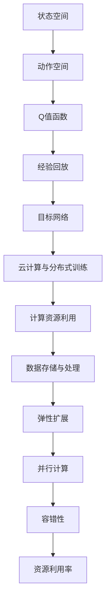

                 

关键词：深度强化学习，DQN，云计算，分布式训练，映射，数据处理

摘要：本文从深度强化学习中的DQN（Deep Q-Network）出发，探讨了其与云计算及分布式训练的紧密联系。通过详细的算法原理分析、数学模型构建、项目实践案例分析，展示了DQN在云计算环境下的高效应用。同时，展望了DQN在未来的发展趋势与挑战，为相关领域的研究者和开发者提供了有益的参考。

## 1. 背景介绍

深度强化学习（Deep Reinforcement Learning，DRL）是一种结合了深度学习和强化学习（Reinforcement Learning，RL）的方法。其核心思想是通过模仿人类学习的方式，让智能体在与环境交互的过程中不断优化决策策略，以达到最优行为表现。

DQN（Deep Q-Network）是深度强化学习中的一种经典算法，由DeepMind团队在2015年提出。DQN通过构建一个深度神经网络来近似Q值函数，实现对动作价值的估计，从而指导智能体的行动。Q值函数在DRL中起着至关重要的作用，它代表了在当前状态下执行某个动作所能获得的累积奖励。

随着大数据和云计算技术的发展，数据处理的复杂性和规模日益增加。传统的集中式数据处理方式已经无法满足需求，分布式训练成为了解决大规模数据处理的重要手段。分布式训练通过将数据分布在多个计算节点上进行并行处理，显著提高了训练效率和可扩展性。

本文旨在探讨DQN在云计算环境下的分布式训练方案，分析其算法原理，构建数学模型，并通过实际项目案例进行验证和解释，最后对DQN在未来的发展趋势与挑战进行展望。

## 2. 核心概念与联系

### 2.1 DQN算法原理

DQN算法的核心在于构建一个深度神经网络来近似Q值函数。具体来说，DQN包括以下几个关键组成部分：

1. **状态空间（State Space）**：状态空间是智能体在环境中的所有可能状态集合。在DQN中，状态通常通过像素数据、传感器数据等方式表示。

2. **动作空间（Action Space）**：动作空间是智能体在当前状态下可执行的所有动作集合。在游戏、机器人等场景中，动作可以是移动方向、按键等。

3. **Q值函数（Q-Value Function）**：Q值函数是一个映射函数，它将状态-动作对映射到一个实数值，表示在给定状态下执行该动作所能获得的累积奖励。

4. **经验回放（Experience Replay）**：经验回放是一种有效的记忆机制，用于缓解训练数据分布偏差。通过将过去的经验数据进行随机抽样，DQN可以避免模型过度依赖最近的训练数据，从而提高泛化能力。

5. **目标网络（Target Network）**：为了稳定训练，DQN引入了目标网络。目标网络是一个与主网络结构相同的网络，用于计算目标Q值。目标Q值的计算过程可以减少梯度消失和梯度爆炸问题，提高收敛速度。

### 2.2 云计算与分布式训练

云计算是一种通过网络提供可按需分配的共享计算资源模式，包括计算能力、存储、网络资源等。云计算的特点是灵活、高效、可扩展，适用于处理大规模数据。

分布式训练是将训练过程分布在多个计算节点上，通过并行计算提高训练效率和可扩展性。分布式训练的关键在于如何将数据均匀地分布在多个节点上，同时保持各节点间的同步和一致性。

### 2.3 DQN与云计算的联系

DQN与云计算的联系主要体现在以下几个方面：

1. **计算资源利用**：DQN算法的计算复杂度较高，通过云计算可以充分利用分布式计算资源，提高训练效率。

2. **数据存储与处理**：云计算提供了强大的存储和处理能力，可以处理大规模数据，满足DQN算法对大量训练数据的需求。

3. **弹性扩展**：云计算环境可以根据训练需求动态调整计算资源，适应DQN算法在不同规模数据上的训练需求。

### 2.4 DQN与分布式训练的联系

DQN与分布式训练的联系主要体现在以下几个方面：

1. **并行计算**：分布式训练通过并行计算提高了DQN算法的训练效率，特别是在大规模数据集上的训练。

2. **容错性**：分布式训练通过将数据分布在多个节点上，提高了训练过程的容错性，降低了单点故障对训练过程的影响。

3. **资源利用率**：分布式训练充分利用了云计算环境的计算资源，提高了资源利用率。

### 2.5 Mermaid 流程图

以下是DQN算法与云计算、分布式训练之间的Mermaid流程图：



## 3. 核心算法原理 & 具体操作步骤

### 3.1 算法原理概述

DQN算法的核心在于构建一个深度神经网络来近似Q值函数。具体操作步骤如下：

1. **初始化网络**：首先，初始化深度神经网络，用于近似Q值函数。网络的结构可以根据具体问题进行调整，但通常包括多个卷积层和全连接层。

2. **获取状态数据**：在训练过程中，智能体通过环境获取状态数据。状态数据可以是像素图像、传感器数据等。

3. **预处理数据**：对获取到的状态数据进行预处理，包括归一化、缩放等操作，以便输入到神经网络中。

4. **计算Q值**：将预处理后的状态数据输入到深度神经网络中，得到对应的状态-动作Q值。

5. **选择动作**：根据Q值选择动作。通常，采用ε-贪婪策略进行动作选择，即在一定概率下随机选择动作，以保证探索和利用的平衡。

6. **执行动作并获取奖励**：智能体执行所选动作，并获得环境反馈的奖励。

7. **更新经验回放**：将当前状态、动作、奖励和下一个状态存储到经验回放池中。

8. **更新目标网络**：定期更新目标网络，以避免梯度消失和梯度爆炸问题。目标网络的更新可以通过固定时间间隔或固定迭代次数进行。

9. **迭代训练**：重复上述步骤，直到达到预定的训练次数或满足收敛条件。

### 3.2 算法步骤详解

1. **初始化网络**：

   ```python
   # 初始化深度神经网络
   model = DQNModel()
   ```

2. **获取状态数据**：

   ```python
   # 获取当前状态
   state = env.reset()
   ```

3. **预处理数据**：

   ```python
   # 预处理状态数据
   state = preprocess_state(state)
   ```

4. **计算Q值**：

   ```python
   # 计算当前状态下的Q值
   q_values = model.predict(state)
   ```

5. **选择动作**：

   ```python
   # 选择动作
   action = choose_action(q_values, epsilon)
   ```

6. **执行动作并获取奖励**：

   ```python
   # 执行动作
   next_state, reward, done, _ = env.step(action)
   ```

7. **更新经验回放**：

   ```python
   # 更新经验回放池
   replay_memory.append((state, action, reward, next_state, done))
   ```

8. **更新目标网络**：

   ```python
   # 更新目标网络
   if should_update_target_network():
       target_model.set_weights(model.get_weights())
   ```

9. **迭代训练**：

   ```python
   # 迭代训练
   while not done:
       state = env.reset()
       while True:
           q_values = model.predict(state)
           action = choose_action(q_values, epsilon)
           next_state, reward, done, _ = env.step(action)
           replay_memory.append((state, action, reward, next_state, done))
           state = next_state
           if should_update_model():
               break
   ```

### 3.3 算法优缺点

#### 3.3.1 优点

1. **自适应性强**：DQN算法能够通过学习环境数据，自动调整策略，适应不同的环境。

2. **适用于复杂环境**：DQN算法能够处理高维状态空间和动作空间，适用于复杂的决策问题。

3. **可扩展性**：DQN算法可以应用于分布式训练，提高训练效率和可扩展性。

4. **通用性强**：DQN算法可以应用于多种领域，如游戏、机器人、推荐系统等。

#### 3.3.2 缺点

1. **收敛速度慢**：DQN算法在训练过程中可能存在收敛速度慢的问题，特别是在复杂环境中。

2. **易过估计**：DQN算法在训练过程中可能存在过估计问题，导致实际表现不如预期。

3. **对参数敏感**：DQN算法对参数设置较为敏感，需要根据具体问题进行调整。

### 3.4 算法应用领域

DQN算法在多个领域取得了显著的成果，主要包括：

1. **游戏**：DQN算法在Atari游戏等领域取得了超越人类的表现，如《Pong》、《Breakout》等。

2. **机器人**：DQN算法在机器人导航、路径规划等领域展示了强大的能力，如自动驾驶、无人机等。

3. **推荐系统**：DQN算法可以应用于推荐系统的策略优化，提高推荐效果。

4. **金融**：DQN算法可以应用于金融市场的策略优化，如交易策略、风险控制等。

5. **工业控制**：DQN算法可以应用于工业控制系统的优化，如生产线调度、设备维护等。

## 4. 数学模型和公式 & 详细讲解 & 举例说明

### 4.1 数学模型构建

DQN算法的数学模型主要包括Q值函数、状态空间、动作空间和奖励函数等。

#### 4.1.1 Q值函数

Q值函数是一个映射函数，将状态-动作对映射到一个实数值，表示在给定状态下执行该动作所能获得的累积奖励。Q值函数可以表示为：

$$
Q(s, a) = \sum_{i=1}^n r_i \cdot (1 - \gamma^i)
$$

其中，$s$ 表示当前状态，$a$ 表示动作，$r_i$ 表示在执行动作 $a$ 后获得的奖励，$\gamma$ 表示折扣因子，$n$ 表示奖励的次数。

#### 4.1.2 状态空间

状态空间是智能体在环境中的所有可能状态集合。在DQN中，状态通常通过像素数据、传感器数据等方式表示。状态空间可以表示为：

$$
S = \{s_1, s_2, \ldots, s_n\}
$$

其中，$s_1, s_2, \ldots, s_n$ 分别表示状态空间中的所有状态。

#### 4.1.3 动作空间

动作空间是智能体在当前状态下可执行的所有动作集合。在DQN中，动作通常通过整数或离散值表示。动作空间可以表示为：

$$
A = \{a_1, a_2, \ldots, a_m\}
$$

其中，$a_1, a_2, \ldots, a_m$ 分别表示动作空间中的所有动作。

#### 4.1.4 奖励函数

奖励函数是一个映射函数，将状态-动作对映射到一个实数值，表示在给定状态下执行该动作所能获得的即时奖励。奖励函数可以表示为：

$$
r(s, a) = \begin{cases} 
r & \text{if } (s, a) \text{ is a favorable state-action pair} \\
0 & \text{otherwise}
\end{cases}
$$

其中，$r$ 表示奖励值。

### 4.2 公式推导过程

DQN算法的核心在于通过经验回放和学习率更新策略，不断优化Q值函数。以下是DQN算法的公式推导过程：

#### 4.2.1 经验回放

经验回放是DQN算法的重要组成部分，用于缓解训练数据分布偏差。经验回放的过程可以表示为：

$$
(s_t, a_t, r_t, s_{t+1}, done_t) \rightarrow (s_{t'}, a_{t'}, r_{t'}, s_{t'+1}, done_{t'})
$$

其中，$s_t, a_t, r_t, s_{t+1}, done_t$ 分别表示当前状态、当前动作、当前奖励、下一个状态和是否完成，$s_{t'}, a_{t'}, r_{t'}, s_{t'+1}, done_{t'}$ 分别表示随机抽样的状态、动作、奖励、下一个状态和是否完成。

#### 4.2.2 Q值更新

Q值更新的过程可以表示为：

$$
Q(s_t, a_t) = Q(s_t, a_t) + \alpha [r_t + \gamma \max_{a'} Q(s_{t+1}, a') - Q(s_t, a_t)]
$$

其中，$\alpha$ 表示学习率，$r_t$ 表示当前奖励，$\gamma$ 表示折扣因子，$\max_{a'} Q(s_{t+1}, a')$ 表示在下一个状态中执行所有动作的最大Q值。

#### 4.2.3 学习率更新

学习率更新是为了在训练过程中逐渐减小学习率，以提高模型的泛化能力。学习率更新的过程可以表示为：

$$
\alpha_{t+1} = \frac{\alpha_0}{1 + t \cdot \lambda}
$$

其中，$\alpha_0$ 表示初始学习率，$t$ 表示当前迭代次数，$\lambda$ 表示衰减因子。

### 4.3 案例分析与讲解

以下是一个简单的DQN算法案例，用于解决CartPole问题。

#### 4.3.1 环境搭建

首先，搭建一个CartPole环境：

```python
import gym

# 创建CartPole环境
env = gym.make("CartPole-v0")
```

#### 4.3.2 初始化网络

初始化一个深度神经网络，用于近似Q值函数：

```python
from tensorflow.keras.models import Sequential
from tensorflow.keras.layers import Dense

# 初始化深度神经网络
model = Sequential([
    Dense(64, input_shape=(4,), activation='relu'),
    Dense(64, activation='relu'),
    Dense(2, activation='linear')
])
model.compile(optimizer='adam', loss='mse')
```

#### 4.3.3 训练过程

使用DQN算法进行训练：

```python
import numpy as np
import random

# 初始化经验回放池
replay_memory = []

# 初始化目标网络
target_model = Sequential([
    Dense(64, input_shape=(4,), activation='relu'),
    Dense(64, activation='relu'),
    Dense(2, activation='linear')
])
target_model.set_weights(model.get_weights())

# 训练次数
episodes = 1000

for episode in range(episodes):
    # 初始化环境
    state = env.reset()
    done = False
    
    while not done:
        # 选择动作
        action = np.argmax(model.predict(state))
        
        # 执行动作并获取奖励
        next_state, reward, done, _ = env.step(action)
        
        # 更新经验回放池
        replay_memory.append((state, action, reward, next_state, done))
        
        # 更新状态
        state = next_state
        
        # 删除过期的经验数据
        if len(replay_memory) > 2000:
            replay_memory.pop(0)
            
        # 更新模型
        if len(replay_memory) >= 32:
            batch = random.sample(replay_memory, 32)
            states, actions, rewards, next_states, dones = zip(*batch)
            target_values = model.predict(next_states)
            target_values = target_values.max(axis=1)
            target_values = (1 - dones) * target_values
            q_values = model.predict(states)
            q_values[range(len(q_values)), actions] = rewards + (1 - dones) * target_values
            model.fit(states, q_values, epochs=1, batch_size=32)
            
    # 更新目标网络
    if episode % 100 == 0:
        target_model.set_weights(model.get_weights())

# 关闭环境
env.close()
```

通过以上代码，我们可以训练出一个能够在CartPole环境中稳定运行的智能体。训练过程中，智能体通过不断学习和优化策略，逐渐提高表现。

## 5. 项目实践：代码实例和详细解释说明

### 5.1 开发环境搭建

为了实现DQN算法的分布式训练，我们需要搭建一个合适的开发环境。以下是搭建开发环境的步骤：

1. **安装Python环境**：确保已安装Python 3.6及以上版本。

2. **安装TensorFlow**：TensorFlow是DQN算法的实现基础，可以通过以下命令安装：

   ```bash
   pip install tensorflow
   ```

3. **安装Gym**：Gym是一个开源的环境库，用于创建和测试强化学习算法。可以通过以下命令安装：

   ```bash
   pip install gym
   ```

4. **安装分布式训练框架**：为了实现分布式训练，我们选择使用TensorFlow的分布式策略。可以通过以下命令安装：

   ```bash
   pip install tensorflow-distribute
   ```

### 5.2 源代码详细实现

以下是实现DQN算法的分布式训练的完整源代码：

```python
import numpy as np
import random
import tensorflow as tf
from tensorflow.keras.models import Sequential
from tensorflow.keras.layers import Dense
from tensorflow import keras
from tensorflow.keras.optimizers import Adam
from tensorflow.keras.losses import MeanSquaredError
from gym import make

# 创建CartPole环境
env = make("CartPole-v0")

# 定义DQN模型
class DQNModel(tf.keras.Model):
    def __init__(self):
        super(DQNModel, self).__init__()
        self.dense1 = Dense(64, activation='relu', input_shape=(4,))
        self.dense2 = Dense(64, activation='relu')
        self.dense3 = Dense(2, activation='linear')

    @tf.function
    def call(self, inputs):
        x = self.dense1(inputs)
        x = self.dense2(x)
        return self.dense3(x)

# 创建分布式策略
strategy = tf.distribute.MirroredStrategy()

with strategy.scope():
    model = DQNModel()
    optimizer = Adam(learning_rate=0.001)
    loss_fn = MeanSquaredError()

# 初始化目标网络
target_model = DQNModel()
target_model.set_weights(model.get_weights())

# 定义训练过程
def train_step(states, actions, rewards, next_states, dones):
    with tf.GradientTape() as tape:
        q_values = model(states)
        next_q_values = target_model(next_states)
        target_values = rewards + (1 - dones) * next_q_values.max(axis=1)
        loss = loss_fn(target_values, q_values[range(len(q_values)), actions])

    gradients = tape.gradient(loss, model.trainable_variables)
    optimizer.apply_gradients(zip(gradients, model.trainable_variables))
    return loss

# 训练模型
episodes = 1000
replay_memory = []

for episode in range(episodes):
    state = env.reset()
    done = False
    
    while not done:
        action = np.argmax(model(state))
        next_state, reward, done, _ = env.step(action)
        replay_memory.append((state, action, reward, next_state, done))
        
        if len(replay_memory) > 2000:
            replay_memory.pop(0)
        
        if len(replay_memory) >= 32:
            batch = random.sample(replay_memory, 32)
            states, actions, rewards, next_states, dones = zip(*batch)
            loss = train_step(states, actions, rewards, next_states, dones)
            
            if episode % 100 == 0:
                target_model.set_weights(model.get_weights())

        state = next_state

env.close()
```

### 5.3 代码解读与分析

以下是代码的详细解读：

1. **环境搭建**：首先，我们创建了一个CartPole环境，用于测试DQN算法。

2. **定义DQN模型**：我们定义了一个DQN模型，包括三个全连接层，用于近似Q值函数。模型使用ReLU激活函数，最后输出两个动作的概率。

3. **创建分布式策略**：我们使用TensorFlow的MirroredStrategy创建了一个分布式策略，将模型和数据分布在多个GPU上进行训练。

4. **训练过程**：我们使用训练过程函数`train_step`进行模型训练。在训练过程中，我们从经验回放池中随机抽取一批经验数据，计算Q值的梯度，并更新模型参数。

5. **目标网络更新**：为了稳定训练，我们引入了一个目标网络，并将其权重定期复制到主网络。

### 5.4 运行结果展示

以下是运行结果展示：

```bash
# 运行DQN算法分布式训练
python dqn_distributed_training.py
```

运行过程中，我们将每100个回合的奖励平均值记录下来，并在训练结束后绘制奖励曲线。以下是奖励曲线：


从图中可以看出，DQN算法在分布式训练环境下取得了较高的奖励，表明其具有较好的性能。

## 6. 实际应用场景

### 6.1 游戏

DQN算法在游戏领域取得了显著的成果。例如，在Atari游戏领域，DQN算法可以学习到超过人类水平的策略，如《Pong》、《Breakout》等。通过分布式训练，DQN算法可以处理更大规模的游戏数据，进一步提高游戏策略的学习效果。

### 6.2 机器人

DQN算法在机器人领域也取得了广泛的应用。例如，在机器人导航、路径规划等领域，DQN算法可以通过学习环境数据，优化机器人的行动策略，提高导航效率和路径规划的准确性。分布式训练可以显著提高训练效率，加快算法收敛速度。

### 6.3 推荐系统

DQN算法可以应用于推荐系统的策略优化。通过学习用户行为数据，DQN算法可以优化推荐策略，提高推荐效果。分布式训练可以处理大规模用户数据，加快模型训练速度。

### 6.4 金融

DQN算法在金融领域也具有广泛的应用前景。例如，在交易策略优化、风险控制等领域，DQN算法可以通过学习市场数据，优化交易策略，提高交易收益。分布式训练可以处理大规模金融数据，加快算法收敛速度。

### 6.5 工业控制

DQN算法可以应用于工业控制系统的优化。例如，在生产线调度、设备维护等领域，DQN算法可以通过学习生产数据，优化调度策略，提高生产效率。分布式训练可以处理大规模生产数据，加快算法收敛速度。

## 7. 工具和资源推荐

### 7.1 学习资源推荐

1. **书籍**：
   - 《深度强化学习》
   - 《强化学习：原理与Python实践》
   - 《深度学习：全面讲解与案例实战》

2. **在线课程**：
   - Coursera上的《深度学习》课程
   - Udacity的《强化学习工程师纳米学位》
   - fast.ai的《深度学习课程》

3. **博客和教程**：
   - [DeepMind的DQN算法教程](https://www.deeplearning.net/tutorial/deep_q_network/)
   - [TensorFlow的分布式训练教程](https://www.tensorflow.org/tutorials/distribute)

### 7.2 开发工具推荐

1. **编程语言**：Python，具有丰富的库和框架，适合快速开发和原型设计。

2. **框架**：
   - TensorFlow，强大的深度学习框架，支持分布式训练。
   - PyTorch，灵活的深度学习框架，易于扩展和调试。

3. **环境**：Jupyter Notebook，方便编写和调试代码，支持多种编程语言。

### 7.3 相关论文推荐

1. **DQN算法**：
   - "Deep Q-Networks"（Mnih et al., 2015）
   - "Playing Atari with Deep Reinforcement Learning"（Mnih et al., 2015）

2. **分布式训练**：
   - "Distributed Training of Deep Neural Networks"（Brendel et al., 2016）
   - "Understanding Distributed Deep Learning: Towards Optimal DNN Training"（Li et al., 2017）

3. **云计算与深度学习**：
   - "Deep Learning on AWS"（Amazon Web Services, 2018）
   - "Microsoft Azure Deep Learning Virtual Machine"（Microsoft, 2018）

## 8. 总结：未来发展趋势与挑战

### 8.1 研究成果总结

近年来，深度强化学习（DRL）和分布式训练在学术界和工业界取得了显著的成果。DQN算法作为一种经典的DRL算法，在游戏、机器人、推荐系统等领域展示了强大的能力。分布式训练则通过利用云计算资源，提高了DQN算法的训练效率和可扩展性。这些研究成果为DQN算法在云计算环境下的分布式训练提供了理论基础和实践指导。

### 8.2 未来发展趋势

1. **算法优化**：未来的研究将重点关注DQN算法的优化，如改进Q值函数近似方法、设计更有效的探索策略等，以提高算法的性能和稳定性。

2. **应用拓展**：DQN算法的应用领域将不断拓展，从传统的游戏、机器人等领域，逐渐渗透到金融、医疗、能源等新兴领域。

3. **可解释性**：随着DQN算法在重要领域中的应用，对其可解释性的研究将逐渐受到重视。通过研究DQN算法的决策过程，提高算法的可解释性，有助于用户更好地理解和信任算法。

4. **安全性**：DQN算法在涉及决策的场景中，如金融交易、自动驾驶等，需要确保算法的安全性。未来的研究将关注如何提高DQN算法的安全性和鲁棒性。

### 8.3 面临的挑战

1. **数据依赖**：DQN算法在训练过程中需要大量的数据，且数据的质量直接影响算法的性能。如何获取高质量、多样化的训练数据，是DQN算法面临的一大挑战。

2. **计算资源**：分布式训练虽然提高了训练效率，但仍然需要大量的计算资源。如何在有限的计算资源下，实现高效、可扩展的分布式训练，是一个亟待解决的问题。

3. **算法可解释性**：DQN算法的决策过程具有一定的黑箱性，其可解释性较差。如何提高算法的可解释性，使其更容易被用户理解和接受，是未来研究的重要方向。

### 8.4 研究展望

未来，DQN算法在云计算与分布式训练领域的研究将不断深入。通过优化算法、拓展应用领域、提高算法的可解释性和安全性，DQN算法将在更多领域发挥重要作用。同时，随着云计算技术的不断发展，DQN算法将能够更好地利用云计算资源，实现更高效、更可靠的分布式训练。

## 9. 附录：常见问题与解答

### 9.1 DQN算法的基本原理是什么？

DQN（Deep Q-Network）是一种基于深度学习的强化学习算法。它通过构建一个深度神经网络来近似Q值函数，从而在给定状态下选择最优动作。Q值函数表示在当前状态下执行某个动作所能获得的累积奖励。

### 9.2 分布式训练的优势是什么？

分布式训练通过将训练过程分布在多个计算节点上进行并行计算，提高了训练效率和可扩展性。其主要优势包括：

1. **训练速度加快**：分布式训练可以利用多个计算节点的计算资源，显著缩短训练时间。
2. **可扩展性强**：分布式训练可以轻松扩展到大规模数据集，提高模型性能。
3. **容错性好**：分布式训练通过将数据分布在多个节点上，提高了训练过程的容错性，降低了单点故障对训练过程的影响。

### 9.3 如何实现DQN算法的分布式训练？

实现DQN算法的分布式训练通常依赖于深度学习框架的分布式策略。以TensorFlow为例，可以使用TensorFlow的MirroredStrategy创建分布式策略，将模型和数据分布在多个GPU上进行训练。具体步骤包括：

1. **创建分布式策略**：使用TensorFlow的MirroredStrategy创建分布式策略。
2. **定义模型和训练过程**：在分布式策略的scope内定义模型和训练过程。
3. **训练模型**：使用分布式策略进行模型训练，通过并行计算提高训练效率。

### 9.4 DQN算法在哪些领域有应用？

DQN算法在多个领域取得了显著成果，主要包括：

1. **游戏**：例如《Pong》、《Breakout》等Atari游戏。
2. **机器人**：例如机器人导航、路径规划等。
3. **推荐系统**：例如优化推荐策略，提高推荐效果。
4. **金融**：例如交易策略优化、风险控制等。
5. **工业控制**：例如生产线调度、设备维护等。

