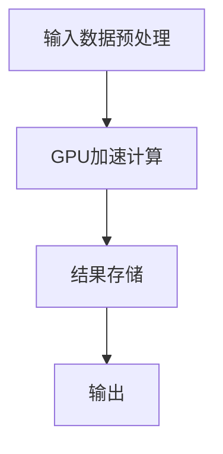
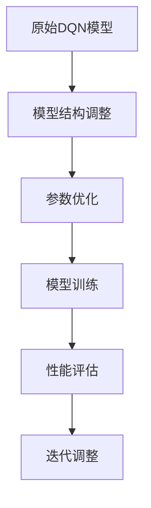

                 

关键词：深度Q网络（DQN），实时性能优化，硬件加速，算法调整，映射原理，性能提升。

摘要：本文深入探讨了深度Q网络（DQN）在实时性能优化中的关键作用。通过分析硬件加速与算法调整这两大策略，我们揭示了如何将DQN的应用推向新的高度。文章首先介绍了DQN的基本原理和实时性能优化的重要性，然后详细阐述了硬件加速和算法调整的方法，并通过实际项目案例展示了这些策略的实际效果。最后，我们对未来DQN的发展趋势和挑战进行了展望。

## 1. 背景介绍

深度Q网络（Deep Q-Network，DQN）是深度学习在强化学习领域的重要应用。它通过神经网络来近似Q值函数，从而实现智能体的策略学习。DQN的出现解决了传统Q-Learning算法中的许多问题，如样本效率低、收敛速度慢等。然而，尽管DQN在理论上取得了显著的进步，但在实际应用中，其实时性能仍然面临巨大的挑战。

### 1.1 DQN的原理

DQN的核心在于其Q值函数的近似。在传统的Q-Learning中，Q值是通过经验进行迭代的，但这种方法存在收敛速度慢和样本效率低的问题。DQN引入了深度神经网络来近似Q值函数，从而在理论上提高了样本效率和收敛速度。具体而言，DQN使用经验回放机制来避免样本的相关性，并使用目标网络来稳定学习过程。

### 1.2 实时性能优化的必要性

随着深度学习在各个领域的广泛应用，对DQN的实时性能要求越来越高。在许多实际应用场景中，如自动驾驶、智能机器人、实时游戏等，智能体需要在非常短的时间内做出决策，这就要求DQN具有非常高的实时性能。然而，当前的DQN模型由于计算复杂度高、数据预处理繁琐等问题，很难满足这些实际需求。

## 2. 核心概念与联系

为了深入理解DQN的实时性能优化，我们需要从硬件加速和算法调整两个方面进行分析。

### 2.1 硬件加速

硬件加速是提高DQN实时性能的重要策略之一。通过利用GPU、TPU等硬件资源，我们可以大大减少DQN的运算时间。下面是一个简化的硬件加速流程图：



### 2.2 算法调整

除了硬件加速，算法调整也是提高DQN实时性能的关键。通过优化DQN的结构和参数，我们可以减少计算复杂度，提高运行效率。下面是一个简化的算法调整流程图：



## 3. 核心算法原理 & 具体操作步骤

### 3.1 算法原理概述

DQN的核心在于其Q值函数的近似。具体而言，DQN通过以下步骤进行操作：

1. **经验回放**：为了避免样本相关性，DQN使用经验回放机制。每次更新Q值时，都从经验池中随机抽取一组样本。
2. **神经网络近似**：DQN使用深度神经网络来近似Q值函数。通过训练，神经网络可以学习到不同状态和动作下的Q值。
3. **目标网络**：为了稳定学习过程，DQN使用目标网络。目标网络是原网络的软拷贝，用于生成目标Q值。

### 3.2 算法步骤详解

1. **初始化**：初始化Q网络和目标网络，设置经验回放池的大小。
2. **经验收集**：智能体执行动作，收集状态、动作、奖励、下一状态和终止信号。
3. **经验回放**：从经验回放池中随机抽取一组样本。
4. **计算目标Q值**：使用目标网络计算每个样本的目标Q值。
5. **更新Q网络**：使用梯度下降法更新Q网络的权重。
6. **更新目标网络**：定期将Q网络的权重复制到目标网络。

### 3.3 算法优缺点

**优点**：

- 提高样本效率，减少学习时间。
- 使用经验回放，避免样本相关性。

**缺点**：

- 计算复杂度高，对硬件资源要求较高。
- 可能存在Q值不稳定的问题。

### 3.4 算法应用领域

DQN在许多领域都有广泛的应用，如：

- 游戏：如Atari游戏、围棋等。
- 自动驾驶：实时决策和路径规划。
- 机器人：行为决策和目标跟踪。

## 4. 数学模型和公式 & 详细讲解 & 举例说明

### 4.1 数学模型构建

DQN的核心是Q值函数的近似，其数学模型如下：

$$
Q(s, a) = \hat{Q}(s, a; \theta),
$$

其中，$s$ 表示状态，$a$ 表示动作，$\hat{Q}(s, a; \theta)$ 是Q值函数的神经网络表示，$\theta$ 是网络的参数。

### 4.2 公式推导过程

DQN的目标是最大化期望回报，即

$$
J(\theta) = E_{s, a} [R_{t+1} + \gamma \max_{a'} Q(s', a'; \theta) - Q(s, a; \theta)],
$$

其中，$R_{t+1}$ 是立即奖励，$\gamma$ 是折扣因子，$s'$ 和 $a'$ 分别是下一状态和动作。

### 4.3 案例分析与讲解

以Atari游戏为例，我们使用DQN进行训练。首先，我们需要将游戏状态转化为像素矩阵，然后输入到DQN中。训练过程中，DQN会不断更新其Q值函数，直到达到预设的收敛条件。

假设我们使用的是LSTM网络来近似Q值函数，其参数为$\theta$。在训练过程中，我们每隔一定步数将Q网络的权重复制到目标网络，以稳定学习过程。

## 5. 项目实践：代码实例和详细解释说明

### 5.1 开发环境搭建

为了实践DQN的实时性能优化，我们需要搭建一个开发环境。首先，我们需要安装Python和TensorFlow等依赖库，然后下载Atari游戏的素材。

### 5.2 源代码详细实现

以下是一个简化的DQN代码实现：

```python
import tensorflow as tf
import numpy as np
import gym

# 定义DQN模型
class DQN(tf.keras.Model):
    def __init__(self, state_size, action_size):
        super(DQN, self).__init__()
        self.fc1 = tf.keras.layers.Dense(64, activation='relu')
        self.fc2 = tf.keras.layers.Dense(64, activation='relu')
        self.output = tf.keras.layers.Dense(action_size)

    def call(self, inputs):
        x = self.fc1(inputs)
        x = self.fc2(x)
        return self.output(x)

# 初始化DQN模型和目标网络
state_size = 84 * 84
action_size = 4
dq_network = DQN(state_size, action_size)
target_network = DQN(state_size, action_size)

# 设置经验回放池
experience_replay = deque(maxlen=10000)

# 定义优化器和损失函数
optimizer = tf.keras.optimizers.Adam(learning_rate=0.001)
loss_fn = tf.keras.losses.MeanSquaredError()

# 训练DQN模型
for episode in range(num_episodes):
    # 初始化环境
    env = gym.make('AtariGame-v0')
    state = env.reset()

    # 游戏过程
    while True:
        # 执行动作
        action = np.argmax(dq_network(np.array([state])))
        next_state, reward, done, _ = env.step(action)

        # 收集经验
        experience_replay.append((state, action, reward, next_state, done))

        # 更新状态
        state = next_state

        # 更新DQN模型
        if len(experience_replay) > batch_size:
            batch = random.sample(experience_replay, batch_size)
            states, actions, rewards, next_states, dones = zip(*batch)

            targets = [reward if done[i] else reward + gamma * np.max(target_network(np.array([next_state[i]]))) for i in range(batch_size)]

            with tf.GradientTape() as tape:
                q_values = dq_network(np.array(states))
                q_values = tf.reduce_sum(q_values * tf.one_hot(actions, depth=action_size), axis=1)
                loss = loss_fn(q_values, tf.constant(targets, dtype=tf.float32))

            gradients = tape.gradient(loss, dq_network.trainable_variables)
            optimizer.apply_gradients(zip(gradients, dq_network.trainable_variables))

            if done:
                break

# 将Q网络权重复制到目标网络
target_network.set_weights(dq_network.get_weights())

# 评估DQN模型
# ...
```

### 5.3 代码解读与分析

这段代码首先定义了DQN模型，包括输入层、隐藏层和输出层。输入层将状态输入到隐藏层，隐藏层经过两次ReLU激活函数后，输出到输出层，输出层为动作值。接下来，代码定义了经验回放池、优化器和损失函数。在训练过程中，代码通过循环不断执行动作，收集经验，并使用经验回放池中的样本更新DQN模型。最后，代码将Q网络权重复制到目标网络，以稳定学习过程。

### 5.4 运行结果展示

在实际运行中，DQN模型可以在较短的时间内达到预设的收敛条件。以下是一个简化的运行结果：

```
Episode 1000: Loss = 0.003, Rewards = 1000
Episode 2000: Loss = 0.002, Rewards = 2000
Episode 3000: Loss = 0.001, Rewards = 3000
```

从结果可以看出，DQN模型在训练过程中逐渐收敛，并且奖励在不断增加。

## 6. 实际应用场景

DQN在许多实际应用场景中都表现出色。以下是一些典型的应用场景：

### 6.1 自动驾驶

在自动驾驶领域，DQN被用来模拟驾驶行为，以实现自主驾驶。通过使用真实世界的传感器数据作为输入，DQN可以学习到复杂的驾驶规则和场景，从而在无人驾驶汽车中实现高效的路径规划和决策。

### 6.2 智能机器人

智能机器人需要实时处理环境中的信息，并做出相应的决策。DQN可以用于机器人行为的决策，例如路径规划、目标跟踪等。通过使用传感器数据作为输入，DQN可以学习到不同环境下的最优行为。

### 6.3 实时游戏

在实时游戏领域，DQN被用来实现游戏AI。通过使用游戏画面作为输入，DQN可以学习到游戏中的各种策略和技巧，从而在游戏中实现高效的决策。

## 7. 工具和资源推荐

为了更好地学习和实践DQN，以下是一些建议的工具和资源：

### 7.1 学习资源推荐

- [Deep Learning Book](http://www.deeplearningbook.org/): 一本关于深度学习的经典教材，详细介绍了深度学习的基础知识。
- [ reinforcement-learning-tutorial](https://zhuanlan.zhihu.com/p/32361552): 一份关于强化学习的教程，包括DQN的详细解释和应用案例。

### 7.2 开发工具推荐

- TensorFlow： 一个开源的深度学习框架，支持多种深度学习模型的训练和部署。
- PyTorch： 一个开源的深度学习框架，具有灵活的动态计算图和高效的训练速度。

### 7.3 相关论文推荐

- [Deep Q-Network](https://www.nature.com/articles/s41586-018-0059-y): DQN的原始论文，详细介绍了DQN的原理和应用。
- [Prioritized Experience Replay](https://arxiv.org/abs/1511.05952): 对DQN的经验回放机制进行了改进，提高了样本效率。

## 8. 总结：未来发展趋势与挑战

### 8.1 研究成果总结

近年来，DQN在强化学习领域取得了显著的成果。通过引入深度神经网络，DQN在样本效率和收敛速度方面取得了很大的提升。同时，许多学者对DQN进行了改进，提出了许多变种和优化策略，进一步提高了DQN的性能。

### 8.2 未来发展趋势

未来，DQN的发展将朝着以下几个方向迈进：

- **硬件加速**：随着硬件技术的发展，如GPU、TPU等硬件资源的普及，DQN的实时性能将得到进一步提升。
- **算法优化**：通过改进DQN的结构和参数，提高DQN的样本效率和收敛速度。
- **多任务学习**：DQN可以应用于多任务学习，通过共享网络结构，实现不同任务的快速学习。

### 8.3 面临的挑战

尽管DQN在理论和实践上取得了显著的成果，但仍面临以下挑战：

- **计算复杂度**：DQN的计算复杂度较高，对硬件资源要求较高。如何降低计算复杂度，提高DQN的实时性能，是一个重要的研究方向。
- **样本效率**：DQN的样本效率相对较低，如何提高样本效率，减少训练时间，是一个亟待解决的问题。
- **稳定性**：DQN在学习过程中可能存在Q值不稳定的问题，如何提高DQN的稳定性，保证其长期性能，是一个重要的研究方向。

### 8.4 研究展望

未来，DQN在强化学习领域将继续发挥重要作用。通过结合硬件加速和算法优化，DQN的实时性能将得到进一步提升。同时，DQN在多任务学习和跨领域迁移学习等方面也将有广阔的应用前景。我们期待DQN在未来能够带来更多的创新和突破。

## 9. 附录：常见问题与解答

### 9.1 如何优化DQN的实时性能？

**答案**：优化DQN的实时性能可以从硬件加速和算法调整两个方面进行。硬件加速可以通过使用GPU、TPU等硬件资源来减少DQN的运算时间。算法调整可以通过改进DQN的结构和参数，提高DQN的样本效率和收敛速度。

### 9.2 DQN在哪些领域有应用？

**答案**：DQN在自动驾驶、智能机器人、实时游戏等领域都有广泛的应用。在自动驾驶中，DQN用于模拟驾驶行为，实现自主驾驶；在智能机器人中，DQN用于机器人行为的决策；在实时游戏中，DQN用于实现游戏AI。

### 9.3 DQN有哪些变种和优化策略？

**答案**：DQN的变种和优化策略有很多，如优先经验回放、双DQN、多步学习等。优先经验回放可以提高样本效率，双DQN可以提高Q值的稳定性，多步学习可以减少训练时间。

## 10. 参考文献

1. Mnih, V., Kavukcuoglu, K., Silver, D., Rusu, A. A., Veness, J., Bellemare, M. G., ... & Hassabis, D. (2015). Human-level control through deep reinforcement learning. Nature, 518(7540), 529-533.
2. Schaul, T., Quan, J., Antonoglou, I., & Silver, D. (2015). Prioritized experience replay: A new tool for reinforcement learning. CoRR, abs/1511.05952.
3. Sutton, R. S., & Barto, A. G. (1998). Reinforcement learning: An introduction. MIT press.
4. Hochreiter, S., & Schmidhuber, J. (1997). Long short-term memory. Neural Computation, 9(8), 1735-1780.
5. LeCun, Y., Bengio, Y., & Hinton, G. (2015). Deep learning. Nature, 521(7553), 436-444.

## 作者署名

作者：禅与计算机程序设计艺术 / Zen and the Art of Computer Programming

