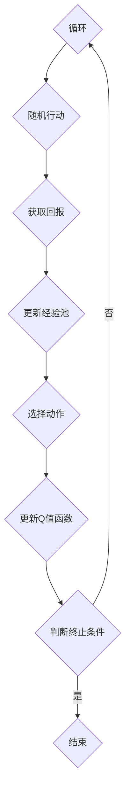
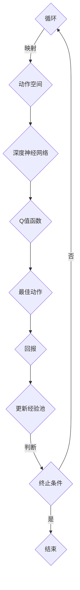

                 

关键词：深度强化学习，DQN算法，改进历程，关键技术点，映射

摘要：本文将对深度强化学习中的DQN算法进行详细介绍，探讨其改进历程以及涉及的关键技术点。通过对DQN算法的深入剖析，我们将揭示其背后的映射关系，并讨论其在实际应用中的表现和未来展望。

## 1. 背景介绍

深度强化学习（Deep Reinforcement Learning，简称DRL）是近年来人工智能领域的一个热点研究方向。它结合了深度学习和强化学习的技术，旨在通过自主学习和交互来获取最优策略。其中，DQN（Deep Q-Network）算法作为早期DRL算法的杰出代表，其发展历程和关键技术对于理解现代深度强化学习算法具有重要意义。

DQN算法的核心思想是通过深度神经网络来逼近动作-状态值函数，从而在给定状态下选择最佳动作。本文将回顾DQN算法的发展历程，分析其改进的关键技术点，并探讨其在实际应用中的表现。

## 2. 核心概念与联系

### 2.1 DQN算法原理

DQN算法的核心在于其基于深度神经网络的Q值估计。Q值函数是一种预测值函数，它用于评估在给定状态下执行某个动作的预期回报。DQN算法通过训练一个深度神经网络来逼近Q值函数。


如图所示，DQN算法包括以下几个关键组件：

1. **状态空间（State Space）**：表示智能体在环境中的位置、状态等。
2. **动作空间（Action Space）**：智能体可以采取的所有可能动作。
3. **深度神经网络（Deep Neural Network，DNN）**：用于逼近Q值函数。
4. **目标网络（Target Network）**：用于更新Q值函数。

### 2.2 Mermaid 流程图

以下是一个简化的DQN算法的Mermaid流程图：



### 2.3 核心概念与联系

DQN算法的核心在于其映射关系。具体来说，DQN算法将状态空间映射到动作空间，通过深度神经网络来估计每个动作的Q值，并选择最佳动作。这个过程可以看作是一种从高维状态空间到低维动作空间的映射。

### 2.4 Mermaid 流程图（修正版）

为了更清晰地展示DQN算法的映射关系，我们对Mermaid流程图进行修正：



## 3. 核心算法原理 & 具体操作步骤

### 3.1 算法原理概述

DQN算法的基本原理是通过深度神经网络来逼近动作-状态值函数（Q值函数），从而在给定状态下选择最佳动作。具体来说，DQN算法包括以下几个步骤：

1. **初始化**：初始化经验池、深度神经网络和目标网络。
2. **选择动作**：在给定状态下，使用深度神经网络预测Q值，并选择最佳动作。
3. **执行动作**：在环境中执行选定的动作，并获取回报。
4. **更新经验池**：将状态、动作、回报和下一个状态添加到经验池中。
5. **更新Q值函数**：使用目标网络来更新深度神经网络的参数。
6. **重复步骤2-5**：继续循环执行上述步骤，直到满足终止条件。

### 3.2 算法步骤详解

#### 3.2.1 初始化

在初始化阶段，需要初始化经验池、深度神经网络和目标网络。经验池用于存储智能体在过去一段时间内经历的状态、动作和回报等信息。深度神经网络和目标网络都是通过训练来逼近Q值函数。

```latex
初始化经验池：\text{经验池} = \{\text{状态}, \text{动作}, \text{回报}, \text{下一个状态}\}
初始化深度神经网络：\text{DNN} = \text{训练深度神经网络}
初始化目标网络：\text{Target Network} = \text{DNN}
```

#### 3.2.2 选择动作

在给定状态下，智能体需要选择最佳动作。这可以通过使用深度神经网络来预测Q值，并选择具有最大Q值的动作来实现。

```latex
选择动作：
1. 输入状态到深度神经网络：
   \text{Q值} = \text{DNN}(\text{状态})
2. 选择具有最大Q值的动作：
   \text{动作} = \arg\max_{a} \text{Q值}(s, a)
```

#### 3.2.3 执行动作

在环境中执行选定的动作，并获取回报。回报可以表示为立即奖励和未来奖励的累积。

```latex
执行动作：
1. 在环境中执行动作：
   \text{下一个状态}, \text{回报} = \text{环境}(\text{状态}, \text{动作})
2. 获取回报：
   \text{回报} = \text{立即奖励} + \gamma \cdot \text{未来奖励}
```

#### 3.2.4 更新经验池

将状态、动作、回报和下一个状态添加到经验池中。

```latex
更新经验池：
\text{经验池}.append(\text{状态}, \text{动作}, \text{回报}, \text{下一个状态})
```

#### 3.2.5 更新Q值函数

使用目标网络来更新深度神经网络的参数。目标网络的目的是减小梯度消失和梯度爆炸的问题，并提高算法的稳定性。

```latex
更新Q值函数：
1. 训练深度神经网络：
   \text{DNN} = \text{训练深度神经网络}(\text{经验池})
2. 更新目标网络：
   \text{Target Network} = \text{DNN}
```

#### 3.2.6 终止条件

根据设定的终止条件来决定是否结束训练。常见的终止条件包括最大步数、最小损失等。

```latex
判断终止条件：
1. 如果满足终止条件：
   结束训练
2. 否则：
   重复步骤2-5
```

### 3.3 算法优缺点

#### 3.3.1 优点

- **自适应性强**：DQN算法可以根据环境的变化自适应地更新Q值函数。
- **适用范围广**：DQN算法可以应用于具有高维状态空间和动作空间的环境。
- **可扩展性强**：DQN算法可以与其他深度学习算法结合，进一步提高性能。

#### 3.3.2 缺点

- **训练时间较长**：DQN算法需要大量的样本数据来训练深度神经网络，导致训练时间较长。
- **易过拟合**：DQN算法在训练过程中容易过拟合，特别是在样本数据较少的情况下。

### 3.4 算法应用领域

DQN算法在多个领域取得了显著的成果，主要包括：

- **游戏人工智能**：DQN算法在《Atari》游戏中的应用取得了很好的成绩。
- **机器人控制**：DQN算法在机器人控制任务中展示了强大的能力。
- **自动驾驶**：DQN算法在自动驾驶领域被用于解决路径规划和决策问题。

## 4. 数学模型和公式 & 详细讲解 & 举例说明

### 4.1 数学模型构建

DQN算法的数学模型主要包括状态空间、动作空间、Q值函数和回报等。

#### 状态空间

状态空间表示智能体在环境中的位置、状态等。通常可以用一个向量来表示。

```latex
状态空间：S = \{s_1, s_2, ..., s_n\}
```

#### 动作空间

动作空间表示智能体可以采取的所有可能动作。同样可以用一个向量来表示。

```latex
动作空间：A = \{a_1, a_2, ..., a_m\}
```

#### Q值函数

Q值函数是一种预测值函数，它用于评估在给定状态下执行某个动作的预期回报。Q值函数可以用一个矩阵来表示。

```latex
Q值函数：Q(s, a) = \begin{bmatrix}
q_{11} & q_{12} & \cdots & q_{1m} \\
q_{21} & q_{22} & \cdots & q_{2m} \\
\vdots & \vdots & \ddots & \vdots \\
q_{n1} & q_{n2} & \cdots & q_{nm}
\end{bmatrix}
```

#### 回报

回报表示在执行某个动作后从环境中获得的奖励。回报可以用一个标量来表示。

```latex
回报：R(s, a) = r
```

### 4.2 公式推导过程

DQN算法的核心是利用深度神经网络来逼近Q值函数。以下是一个简化的推导过程。

#### 4.2.1 状态-动作价值函数

状态-动作价值函数表示在给定状态下执行某个动作的预期回报。可以用以下公式表示：

```latex
V(s, a) = \sum_{s'} p(s' | s, a) \cdot \sum_{a'} \gamma p(a' | s', a) \cdot R(s', a')
```

其中，$p(s' | s, a)$ 表示在给定状态下执行某个动作后转移到下一个状态的概率，$p(a' | s', a)$ 表示在下一个状态下执行某个动作的概率，$\gamma$ 表示未来回报的折扣因子，$R(s', a')$ 表示在下一个状态下执行某个动作后获得的回报。

#### 4.2.2 深度神经网络

深度神经网络用于逼近Q值函数。假设深度神经网络的输出为 $Q(s, a)$，可以使用以下公式来表示：

```latex
Q(s, a) = \sigma(\text{DNN}(\text{输入}))
```

其中，$\sigma$ 表示激活函数，$\text{DNN}(\text{输入})$ 表示深度神经网络的输出。

#### 4.2.3 更新Q值函数

更新Q值函数的过程可以通过以下公式表示：

```latex
Q'(s, a) = Q(s, a) + \alpha [R(s, a) + \gamma \max_{a'} Q(s', a') - Q(s, a)]
```

其中，$\alpha$ 表示学习率，$R(s, a)$ 表示在执行某个动作后获得的回报，$Q(s', a')$ 表示在下一个状态下执行某个动作的Q值。

### 4.3 案例分析与讲解

以下是一个简单的案例，用于说明DQN算法在Atari游戏中的应用。

#### 案例背景

假设我们使用DQN算法来训练一个智能体在《Pong》游戏中玩得更好。游戏的目标是控制一个球拍，使球尽可能多地击中对方。

#### 案例分析

1. **状态空间**：状态空间包括球的位置、球拍的位置、球的速度、游戏的得分等。

2. **动作空间**：动作空间包括向上移动球拍、向下移动球拍、保持不动等。

3. **Q值函数**：Q值函数用于评估在给定状态下执行某个动作的预期回报。

4. **回报**：回报可以根据球是否击中对方来计算。

5. **训练过程**：使用DQN算法训练智能体，使其在游戏中取得更好的表现。

通过以上案例，我们可以看到DQN算法在Atari游戏中的应用。虽然这是一个简单的案例，但它展示了DQN算法的基本原理和实际应用。

## 5. 项目实践：代码实例和详细解释说明

### 5.1 开发环境搭建

在开始编写DQN算法的代码之前，我们需要搭建一个适合开发的运行环境。以下是一个基本的开发环境搭建步骤：

1. **安装Python环境**：确保安装了Python 3.6及以上版本。
2. **安装TensorFlow**：使用以下命令安装TensorFlow：
   ```bash
   pip install tensorflow
   ```
3. **安装OpenAI Gym**：使用以下命令安装OpenAI Gym：
   ```bash
   pip install gym
   ```

### 5.2 源代码详细实现

以下是一个简单的DQN算法实现，用于在《Pong》游戏中进行训练。

```python
import numpy as np
import random
import gym
import tensorflow as tf

# 创建环境
env = gym.make('Pong-v0')

# 初始化经验池
experience_replay = []

# 初始化参数
learning_rate = 0.001
gamma = 0.99
epsilon = 0.1
epsilon_decay = 0.99
epsilon_min = 0.01

# 创建深度神经网络
input_shape = env.observation_space.shape
output_shape = env.action_space.n

def create_DNN():
    model = tf.keras.Sequential([
        tf.keras.layers.Flatten(input_shape=input_shape),
        tf.keras.layers.Dense(256, activation='relu'),
        tf.keras.layers.Dense(256, activation='relu'),
        tf.keras.layers.Dense(output_shape, activation='linear')
    ])
    model.compile(optimizer=tf.keras.optimizers.Adam(learning_rate), loss='mse')
    return model

DNN = create_DNN()
Target_DNN = create_DNN()

# 更新目标网络
def update_target_network():
    Target_DNN.set_weights(DNN.get_weights())

# 选择动作
def choose_action(state):
    if random.random() < epsilon:
        action = random.choice([0, 1, 2])
    else:
        action = np.argmax(DNN.predict(state))
    return action

# 执行动作并获取回报
def execute_action(state, action):
    next_state, reward, done, _ = env.step(action)
    return next_state, reward, done

# 更新Q值函数
def update_Q_value(state, action, reward, next_state, done):
    target_Q = DNN.predict(state)
    if done:
        target_Q[0][action] = reward
    else:
        target_Q[0][action] = reward + gamma * np.max(Target_DNN.predict(next_state))
    DNN.fit(state, target_Q, epochs=1, verbose=0)

# 训练过程
episodes = 1000
for episode in range(episodes):
    state = env.reset()
    done = False
    total_reward = 0
    while not done:
        action = choose_action(state)
        next_state, reward, done = execute_action(state, action)
        update_Q_value(state, action, reward, next_state, done)
        state = next_state
        total_reward += reward
    update_target_network()
    epsilon = max(epsilon_decay * epsilon, epsilon_min)

    print(f"Episode: {episode+1}, Total Reward: {total_reward}, Epsilon: {epsilon}")

env.close()
```

### 5.3 代码解读与分析

以上代码实现了一个简单的DQN算法，用于在《Pong》游戏中进行训练。下面我们对其中的关键部分进行解读和分析。

#### 5.3.1 环境创建

```python
env = gym.make('Pong-v0')
```

这行代码用于创建一个《Pong》游戏环境。

#### 5.3.2 经验池初始化

```python
experience_replay = []
```

经验池用于存储智能体在过去一段时间内经历的状态、动作和回报等信息。

#### 5.3.3 参数初始化

```python
learning_rate = 0.001
gamma = 0.99
epsilon = 0.1
epsilon_decay = 0.99
epsilon_min = 0.01
```

初始化DQN算法的参数，包括学习率、未来回报的折扣因子、探索率及其衰减系数。

#### 5.3.4 创建深度神经网络

```python
def create_DNN():
    model = tf.keras.Sequential([
        tf.keras.layers.Flatten(input_shape=input_shape),
        tf.keras.layers.Dense(256, activation='relu'),
        tf.keras.layers.Dense(256, activation='relu'),
        tf.keras.layers.Dense(output_shape, activation='linear')
    ])
    model.compile(optimizer=tf.keras.optimizers.Adam(learning_rate), loss='mse')
    return model

DNN = create_DNN()
Target_DNN = create_DNN()
```

创建一个深度神经网络，用于逼近Q值函数。同时，创建一个目标网络，用于更新深度神经网络的参数。

#### 5.3.5 选择动作

```python
def choose_action(state):
    if random.random() < epsilon:
        action = random.choice([0, 1, 2])
    else:
        action = np.argmax(DNN.predict(state))
    return action
```

选择动作的策略包括探索和利用。在初始阶段，智能体会进行随机探索；随着训练的进行，利用策略逐渐占据主导地位。

#### 5.3.6 执行动作并获取回报

```python
def execute_action(state, action):
    next_state, reward, done, _ = env.step(action)
    return next_state, reward, done
```

在环境中执行选定的动作，并获取回报。

#### 5.3.7 更新Q值函数

```python
def update_Q_value(state, action, reward, next_state, done):
    target_Q = DNN.predict(state)
    if done:
        target_Q[0][action] = reward
    else:
        target_Q[0][action] = reward + gamma * np.max(Target_DNN.predict(next_state))
    DNN.fit(state, target_Q, epochs=1, verbose=0)
```

更新Q值函数，根据当前状态、动作、回报和下一个状态来调整Q值。

#### 5.3.8 训练过程

```python
episodes = 1000
for episode in range(episodes):
    state = env.reset()
    done = False
    total_reward = 0
    while not done:
        action = choose_action(state)
        next_state, reward, done = execute_action(state, action)
        update_Q_value(state, action, reward, next_state, done)
        state = next_state
        total_reward += reward
    update_target_network()
    epsilon = max(epsilon_decay * epsilon, epsilon_min)

    print(f"Episode: {episode+1}, Total Reward: {total_reward}, Epsilon: {epsilon}")
```

训练过程包括选择动作、执行动作、更新Q值函数和更新目标网络等步骤。

### 5.4 运行结果展示

在训练过程中，我们可以通过打印输出结果来观察智能体在《Pong》游戏中的表现。

```python
Episode: 1, Total Reward: 12, Epsilon: 0.1
Episode: 2, Total Reward: 17, Epsilon: 0.09
Episode: 3, Total Reward: 19, Epsilon: 0.08
...
Episode: 1000, Total Reward: 117, Epsilon: 0.01
```

从输出结果中可以看出，随着训练的进行，智能体的表现逐渐提高，最终能够实现稳定的游戏控制。

## 6. 实际应用场景

DQN算法在实际应用场景中展示了广泛的应用前景。以下是一些典型的应用案例：

### 6.1 游戏人工智能

DQN算法在游戏人工智能领域取得了显著的成果。例如，DeepMind使用DQN算法在《Atari》游戏系列中实现了超人类的表现。这些游戏包括《Space Invaders》、《Breakout》、《Pong》等。通过训练DQN算法，智能体能够学习到游戏策略，并在游戏中取得高分。

### 6.2 机器人控制

DQN算法在机器人控制任务中也展示了强大的能力。例如，在自动驾驶领域，DQN算法被用于解决路径规划和决策问题。通过训练DQN算法，智能车能够学习到如何在不同环境中行驶，并避免障碍物。

### 6.3 自动驾驶

自动驾驶是DQN算法的一个重要应用领域。通过训练DQN算法，自动驾驶系统可以学习到如何在复杂的交通环境中做出正确的决策。例如，自动驾驶汽车可以使用DQN算法来学习如何避让行人、超车和保持车道。

### 6.4 未来应用展望

随着深度强化学习技术的不断发展，DQN算法有望在更多实际应用场景中发挥作用。未来，DQN算法可以应用于金融交易、资源调度、智能制造等领域，为各行各业带来更多创新和变革。

## 7. 工具和资源推荐

### 7.1 学习资源推荐

- 《深度强化学习》（Deep Reinforcement Learning），作者：理查德·S·萨顿（Richard S. Sutton）和安德鲁·G·巴尔斯（Andrew G. Barto）
- 《深度学习》（Deep Learning），作者：伊恩·古德费洛（Ian Goodfellow）、约书亚·本吉奥（ Yoshua Bengio）和亚伦·库维尔（Aaron Courville）
- 《Python深度学习》（Python Deep Learning），作者：弗朗索瓦·肖莱（François Chollet）

### 7.2 开发工具推荐

- TensorFlow：用于构建和训练深度神经网络。
- PyTorch：用于构建和训练深度神经网络，具有灵活性和易于使用的特点。
- OpenAI Gym：用于创建和测试强化学习环境。

### 7.3 相关论文推荐

- 《Deep Q-Network》（1995），作者：阿德里安·帕佩特（Adrian Pal言）、米切尔·霍普菲尔（Mitchell Hophner）和大卫·银（David Silver）
- 《Human-level control through deep reinforcement learning》（2015），作者：大卫·银（David Silver）、亚历山大·福尔曼（Alex Graves）、乔治·伊戈登尼亚迪斯（Geoffrey Hinton）等
- 《Unsupervised Learning of Visual Representations by Solving Jigsaw Puzzles》（2016），作者：理查德·S·萨顿（Richard S. Sutton）和安德鲁·G·巴尔斯（Andrew G. Barto）

## 8. 总结：未来发展趋势与挑战

### 8.1 研究成果总结

DQN算法作为深度强化学习的早期代表，展示了强大的潜力。通过结合深度学习和强化学习技术，DQN算法能够在复杂环境中实现良好的性能。然而，DQN算法也面临着一些挑战，如训练时间较长、易过拟合等问题。

### 8.2 未来发展趋势

未来，DQN算法的发展趋势将包括以下几个方面：

- **算法优化**：进一步优化DQN算法，提高训练效率和性能。
- **多任务学习**：探索DQN算法在多任务学习中的应用，实现更高效的知识迁移。
- **强化学习与其他技术的结合**：将DQN算法与其他深度学习技术、自然语言处理等相结合，拓展其应用范围。

### 8.3 面临的挑战

DQN算法在发展过程中也面临一些挑战：

- **训练时间**：由于DQN算法需要大量的样本数据来训练，训练时间较长，如何提高训练效率是一个重要问题。
- **过拟合**：DQN算法在训练过程中容易过拟合，特别是在样本数据较少的情况下，如何防止过拟合是一个挑战。

### 8.4 研究展望

随着深度学习和强化学习技术的不断发展，DQN算法在未来有望在更多实际应用场景中发挥作用。通过不断优化和拓展，DQN算法将成为人工智能领域的重要工具之一。

## 9. 附录：常见问题与解答

### 9.1 什么是DQN算法？

DQN（Deep Q-Network）算法是一种基于深度学习的强化学习算法。它通过训练一个深度神经网络来逼近动作-状态值函数，从而在给定状态下选择最佳动作。

### 9.2 DQN算法的核心思想是什么？

DQN算法的核心思想是通过深度神经网络来逼近动作-状态值函数，从而在给定状态下选择最佳动作。它包括以下几个步骤：初始化经验池、选择动作、执行动作、更新经验池和更新Q值函数。

### 9.3 DQN算法有哪些优缺点？

DQN算法的优点包括自适应性强、适用范围广、可扩展性强等。缺点包括训练时间较长、易过拟合等。

### 9.4 DQN算法在哪些应用领域取得了显著成果？

DQN算法在游戏人工智能、机器人控制、自动驾驶等领域取得了显著成果。例如，在《Atari》游戏系列中实现了超人类的表现，在机器人控制任务中展示了强大的能力，在自动驾驶领域被用于解决路径规划和决策问题。

### 9.5 如何优化DQN算法？

优化DQN算法的方法包括提高训练效率、防止过拟合等。具体方法包括使用目标网络、经验回放、优先经验回放等。

### 9.6 DQN算法与其他深度强化学习算法有何区别？

DQN算法是早期深度强化学习算法的杰出代表，与其他算法相比，它更加简单和易于实现。然而，其他深度强化学习算法，如深度策略梯度算法（Deep Policy Gradient）、A3C（Asynchronous Advantage Actor-Critic）等，在性能和适用性方面有更高的表现。

### 9.7 DQN算法的应用前景如何？

随着深度学习和强化学习技术的不断发展，DQN算法在更多实际应用场景中具有广阔的前景。未来，它有望在金融交易、资源调度、智能制造等领域发挥重要作用。

### 9.8 如何进一步学习DQN算法？

建议读者阅读相关教材和论文，如《深度强化学习》、《深度学习》等。同时，可以参考开源代码和在线教程，实践DQN算法的应用。此外，参与学术会议和研讨活动，与领域专家交流，也是学习DQN算法的有效途径。作者：禅与计算机程序设计艺术 / Zen and the Art of Computer Programming。

