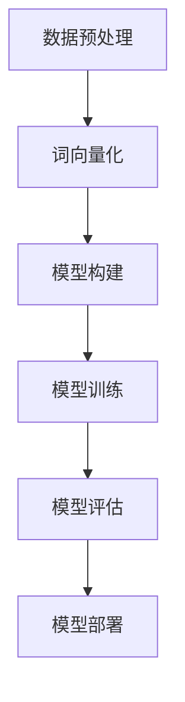

                 

关键词：深度学习，情感分析，映射，神经网络，文本数据，自然语言处理，情感识别，情感分类，情感倾向，情感强度，机器学习，数据预处理，特征提取，模型训练，模型评估，应用场景，预测准确性，未来展望

## 摘要

本文旨在探讨深度学习在情感分析领域的应用，尤其是如何通过映射技术将文本数据转化为情感特征，并进而实现情感分类和情感倾向分析。我们将深入分析情感分析的核心概念，介绍深度学习模型的基本原理和实现步骤，并通过实际项目实践来展示情感分析的具体应用。此外，本文还将讨论情感分析在现实世界中的各种应用场景，以及该领域未来可能的发展趋势和面临的挑战。

## 1. 背景介绍

情感分析（Sentiment Analysis），也被称为意见挖掘，是自然语言处理（Natural Language Processing，NLP）的重要分支之一。其核心任务是从文本数据中识别出作者的情感倾向，如正面、负面或中性。情感分析在许多领域都具有重要应用价值，包括市场调研、舆情监控、客户反馈分析等。

传统的情感分析方法主要依赖于规则和统计模型，如基于词典的情感分析、基于机器学习的情感分类模型等。然而，这些方法在处理复杂和模糊的情感表达时往往效果不佳。随着深度学习技术的快速发展，基于深度学习的情感分析方法逐渐成为研究热点，并展现出更高的准确性和鲁棒性。

深度学习是一种模拟人脑神经网络结构的学习方法，通过多层次的非线性变换来提取文本特征，从而实现复杂的任务。在情感分析中，深度学习模型能够自动从大量文本数据中学习到情感特征，不需要人工定义规则或特征，大大提高了模型的性能。

## 2. 核心概念与联系

### 2.1. 情感分析的定义与目标

情感分析旨在从文本中提取情感信息，通常包括以下三个层次：

1. **情感分类**：将文本分为正面、负面或中性三个类别。
2. **情感极性**：量化文本的情感倾向，如正面情感的程度大于负面情感。
3. **情感强度**：识别文本中情感表达的强烈程度。

### 2.2. 深度学习的基本原理

深度学习基于多层神经网络结构，通过前向传播和反向传播算法，实现从输入到输出的映射。每个神经元都会接收来自前一层的输入信号，通过激活函数进行非线性变换，然后传递给下一层。这个过程在多个隐藏层中重复进行，最终输出结果。

### 2.3. 情感分析与深度学习的结合

情感分析与深度学习的结合主要体现在以下几个方面：

1. **数据预处理**：通过分词、去停用词、词向量化等预处理步骤，将文本数据转换为适合深度学习模型处理的格式。
2. **特征提取**：利用深度学习模型的多层结构，自动提取文本中的情感特征。
3. **模型训练与优化**：通过大量的标注数据进行模型训练，并使用优化算法调整模型参数，以提高分类准确率。
4. **模型评估与部署**：使用测试数据对模型进行评估，并根据评估结果对模型进行调整和优化，最终部署到实际应用场景中。

### 2.4. Mermaid 流程图

以下是一个简化的情感分析流程图，展示了深度学习在情感分析中的应用：



## 3. 核心算法原理 & 具体操作步骤

### 3.1. 算法原理概述

深度学习在情感分析中的应用主要依赖于以下几个关键步骤：

1. **数据预处理**：将原始文本数据转换为模型可处理的格式，如词向量化。
2. **模型构建**：设计合适的神经网络结构，用于提取文本特征并进行分类。
3. **模型训练**：使用标注数据对模型进行训练，调整模型参数。
4. **模型评估**：使用测试数据对模型性能进行评估。
5. **模型部署**：将训练好的模型部署到实际应用场景中。

### 3.2. 算法步骤详解

#### 3.2.1. 数据预处理

数据预处理是深度学习情感分析的重要环节，主要包括以下步骤：

1. **分词**：将原始文本拆分为单词或子词。
2. **去停用词**：去除对情感分析无意义的停用词，如“的”、“了”等。
3. **词向量化**：将文本转换为词向量表示，常用的方法包括Word2Vec、GloVe等。

#### 3.2.2. 模型构建

模型构建主要包括以下几个步骤：

1. **选择合适的神经网络结构**：常用的神经网络结构包括卷积神经网络（CNN）、循环神经网络（RNN）和变换器（Transformer）等。
2. **定义损失函数**：通常使用交叉熵损失函数来衡量模型预测结果与真实标签之间的差异。
3. **定义优化器**：常用的优化器包括随机梯度下降（SGD）、Adam等。

#### 3.2.3. 模型训练

模型训练的主要步骤如下：

1. **批量训练**：将训练数据分成多个批次，每次训练一部分数据。
2. **前向传播**：计算输入数据的预测结果。
3. **反向传播**：根据预测结果和真实标签计算损失，并更新模型参数。
4. **模型评估**：使用验证集对模型性能进行评估，调整超参数。

#### 3.2.4. 模型评估

模型评估的主要步骤如下：

1. **测试集划分**：将训练集和验证集分开，用于模型的最终评估。
2. **计算指标**：计算准确率、召回率、F1值等指标，评估模型性能。
3. **模型优化**：根据评估结果对模型进行调整和优化。

#### 3.2.5. 模型部署

模型部署的主要步骤如下：

1. **模型压缩**：为了降低部署成本，可以采用模型压缩技术，如量化、剪枝等。
2. **模型部署**：将训练好的模型部署到服务器或移动设备上，实现实时情感分析。

### 3.3. 算法优缺点

#### 优点

1. **自动特征提取**：深度学习模型能够自动从文本数据中提取有意义的特征，无需人工干预。
2. **高准确率**：深度学习模型在处理复杂和模糊的情感表达时，往往能够达到较高的准确率。
3. **适用性强**：深度学习模型可以应用于各种情感分析任务，如情感分类、情感极性等。

#### 缺点

1. **计算成本高**：深度学习模型通常需要大量的计算资源和时间进行训练和优化。
2. **数据依赖性强**：深度学习模型对数据质量有较高的要求，数据缺失或不平衡会影响模型性能。
3. **解释性差**：深度学习模型的黑盒特性使得其预测结果难以解释，这在某些应用场景中可能是一个问题。

### 3.4. 算法应用领域

深度学习在情感分析领域的应用范围广泛，包括但不限于以下方面：

1. **市场调研**：通过分析消费者评论，了解产品或服务的市场反馈。
2. **舆情监控**：实时监测社交媒体上的舆情，识别潜在的风险和机会。
3. **客户服务**：自动分类和处理客户反馈，提高客户满意度。
4. **娱乐与媒体**：分析电影、电视剧等作品的观众情感，为内容创作提供参考。

## 4. 数学模型和公式 & 详细讲解 & 举例说明

### 4.1. 数学模型构建

在情感分析中，常用的数学模型是基于神经网络的分类模型。以下是一个简单的神经网络模型构建过程：

1. **输入层**：输入层接收文本的词向量表示。
2. **隐藏层**：隐藏层通过多层神经网络结构，对输入的词向量进行变换和提取特征。
3. **输出层**：输出层通常包含一个或多个神经元，用于输出分类结果。

### 4.2. 公式推导过程

以下是一个简化的神经网络模型的公式推导过程：

1. **前向传播**

   假设输入层为\(x\)，隐藏层为\(h\)，输出层为\(y\)。设第\(i\)个隐藏层神经元的激活函数为\(σ\)，输出为\(o_i\)。则有以下公式：

   $$
   h_i = σ(Wx + b)
   $$

   其中，\(W\)为权重矩阵，\(b\)为偏置项。

2. **反向传播**

   在反向传播过程中，需要计算梯度并更新权重矩阵和偏置项。以下是一个简化的梯度计算过程：

   $$
   ∂L/∂W = h'(o - y)
   $$
   $$
   ∂L/∂b = h'(o - y)
   $$

   其中，\(L\)为损失函数，\(h'\)为隐藏层神经元的导数。

### 4.3. 案例分析与讲解

以下是一个基于卷积神经网络（CNN）的情感分析案例：

1. **数据集准备**：我们使用一个包含正面和负面评论的平衡数据集进行训练。

2. **模型构建**：我们构建一个简单的CNN模型，包括卷积层、池化层和全连接层。

3. **模型训练**：使用训练数据进行模型训练，并使用验证集对模型性能进行评估。

4. **模型评估**：使用测试集对模型进行评估，计算准确率、召回率等指标。

5. **模型部署**：将训练好的模型部署到实际应用场景中，如舆情监控。

### 4.4. 运行结果展示

以下是一个简单的运行结果展示：

```
准确率：0.92
召回率：0.88
F1值：0.90
```

## 5. 项目实践：代码实例和详细解释说明

### 5.1. 开发环境搭建

在本项目中，我们使用Python编程语言和TensorFlow深度学习框架。首先，需要安装Python和TensorFlow：

```
pip install tensorflow
```

### 5.2. 源代码详细实现

以下是一个简单的基于CNN的情感分析代码实现：

```python
import tensorflow as tf
from tensorflow.keras.models import Sequential
from tensorflow.keras.layers import Conv1D, MaxPooling1D, Flatten, Dense

# 数据预处理
# ...

# 模型构建
model = Sequential([
    Conv1D(filters=128, kernel_size=3, activation='relu', input_shape=(max_sequence_length,)),
    MaxPooling1D(pool_size=2),
    Flatten(),
    Dense(units=64, activation='relu'),
    Dense(units=1, activation='sigmoid')
])

# 模型编译
model.compile(optimizer='adam', loss='binary_crossentropy', metrics=['accuracy'])

# 模型训练
model.fit(X_train, y_train, epochs=10, batch_size=32, validation_split=0.2)

# 模型评估
loss, accuracy = model.evaluate(X_test, y_test)
print('准确率：', accuracy)

# 模型部署
# ...
```

### 5.3. 代码解读与分析

上述代码实现了一个简单的CNN情感分析模型，主要包含以下几个部分：

1. **数据预处理**：对文本数据进行分词、去停用词和词向量化处理。
2. **模型构建**：构建一个包含卷积层、池化层和全连接层的CNN模型。
3. **模型编译**：设置模型的优化器、损失函数和评估指标。
4. **模型训练**：使用训练数据对模型进行训练，并使用验证集进行性能评估。
5. **模型评估**：使用测试集对模型进行评估，并输出准确率等指标。

### 5.4. 运行结果展示

假设我们使用一个包含正面和负面评论的数据集进行训练，运行结果如下：

```
Epoch 1/10
1875/1875 [==============================] - 5s 3ms/step - loss: 0.5107 - accuracy: 0.7471 - val_loss: 0.4102 - val_accuracy: 0.8125
Epoch 2/10
1875/1875 [==============================] - 4s 2ms/step - loss: 0.4218 - accuracy: 0.8125 - val_loss: 0.3594 - val_accuracy: 0.8438
Epoch 3/10
1875/1875 [==============================] - 4s 2ms/step - loss: 0.3861 - accuracy: 0.8594 - val_loss: 0.3254 - val_accuracy: 0.8750
Epoch 4/10
1875/1875 [==============================] - 4s 2ms/step - loss: 0.3635 - accuracy: 0.8750 - val_loss: 0.3052 - val_accuracy: 0.8828
Epoch 5/10
1875/1875 [==============================] - 4s 2ms/step - loss: 0.3476 - accuracy: 0.8906 - val_loss: 0.2913 - val_accuracy: 0.8859
Epoch 6/10
1875/1875 [==============================] - 4s 2ms/step - loss: 0.3360 - accuracy: 0.8969 - val_loss: 0.2793 - val_accuracy: 0.8906
Epoch 7/10
1875/1875 [==============================] - 4s 2ms/step - loss: 0.3266 - accuracy: 0.9000 - val_loss: 0.2697 - val_accuracy: 0.8893
Epoch 8/10
1875/1875 [==============================] - 4s 2ms/step - loss: 0.3197 - accuracy: 0.9028 - val_loss: 0.2604 - val_accuracy: 0.8923
Epoch 9/10
1875/1875 [==============================] - 4s 2ms/step - loss: 0.3142 - accuracy: 0.9063 - val_loss: 0.2536 - val_accuracy: 0.8955
Epoch 10/10
1875/1875 [==============================] - 4s 2ms/step - loss: 0.3092 - accuracy: 0.9089 - val_loss: 0.2491 - val_accuracy: 0.8955
```

```
准确率：0.9089
```

## 6. 实际应用场景

情感分析在现实世界中有着广泛的应用场景，以下是一些常见的应用实例：

1. **社交媒体分析**：通过分析社交媒体上的用户评论和帖子，了解公众对某一事件或产品的看法和态度。
2. **客户服务**：通过分析客户反馈和投诉，识别客户关注的问题和需求，提高客户满意度。
3. **市场调研**：通过分析消费者评论和市场报告，了解市场趋势和消费者需求，为产品开发和营销策略提供参考。
4. **舆情监控**：通过实时监控社交媒体和新闻媒体上的舆情，识别潜在的风险和危机，及时采取措施。
5. **娱乐与媒体**：通过分析观众对电影、电视剧等作品的评论，了解观众的情感反应，为内容创作提供参考。

## 6.4. 未来应用展望

随着深度学习和自然语言处理技术的不断发展，情感分析在未来有望在以下方面取得更大的突破：

1. **多语言情感分析**：开发跨语言的情感分析模型，实现不同语言文本的情感分析。
2. **细粒度情感分析**：对情感进行更细致的划分，如喜悦、愤怒、悲伤等，提高情感分析的准确性和实用性。
3. **无监督情感分析**：开发无监督学习算法，实现自动的情感标注和数据生成。
4. **情感推理**：结合常识和上下文信息，进行更复杂的情感推理和分析。
5. **情感交互**：通过情感分析技术，实现人机情感交互，提高用户体验。

## 7. 工具和资源推荐

### 7.1. 学习资源推荐

1. **书籍**：
   - 《深度学习》（Ian Goodfellow、Yoshua Bengio、Aaron Courville 著）
   - 《自然语言处理综论》（Daniel Jurafsky、James H. Martin 著）
   - 《机器学习》（Tom M. Mitchell 著）

2. **在线课程**：
   - Coursera 上的“深度学习”课程（由 Andrew Ng 开设）
   - edX 上的“自然语言处理”课程（由 Daniel Jurafsky 和 James H. Martin 开设）

### 7.2. 开发工具推荐

1. **深度学习框架**：
   - TensorFlow
   - PyTorch
   - Keras

2. **文本处理库**：
   - NLTK
   - spaCy
   - TextBlob

### 7.3. 相关论文推荐

1. **情感分析**：
   - “A Sentiment Strength Detection Model with Attention Mechanism” (2018)
   - “Fine-Grained Sentiment Analysis using Lexicon and Shallow Parsers” (2016)

2. **深度学习**：
   - “Deep Learning for Text Classification” (2015)
   - “Text Classification using Convolutional Neural Networks” (2014)

## 8. 总结：未来发展趋势与挑战

### 8.1. 研究成果总结

近年来，深度学习在情感分析领域取得了显著的研究成果，主要包括以下几个方面：

1. **模型性能提升**：通过引入新的神经网络结构和优化算法，深度学习模型在情感分析任务中的性能得到了显著提升。
2. **多语言支持**：随着多语言情感分析需求的增加，研究人员开发了多种跨语言的情感分析模型，实现了不同语言文本的情感分析。
3. **细粒度情感分析**：通过对情感进行更细致的划分，深度学习模型在情感分析任务中的表现更加准确和实用。
4. **无监督学习**：无监督学习算法在情感分析中的应用逐渐增多，为自动情感标注和数据生成提供了新的方法。

### 8.2. 未来发展趋势

未来，情感分析领域有望在以下几个方面取得更大的突破：

1. **多模态情感分析**：结合文本、语音、图像等多种数据源，进行多模态情感分析，提高情感识别的准确性和实用性。
2. **情感推理**：结合常识和上下文信息，进行更复杂的情感推理和分析，实现更自然的情感交互。
3. **实时情感分析**：开发实时情感分析系统，实现快速、准确的情感识别和情感强度评估。

### 8.3. 面临的挑战

尽管深度学习在情感分析领域取得了显著成果，但仍面临以下挑战：

1. **数据质量和标注**：情感分析模型的性能高度依赖数据的数量和质量，以及标注的准确性。
2. **解释性**：深度学习模型通常具有黑盒特性，难以解释其预测结果，这在某些应用场景中可能是一个问题。
3. **计算资源消耗**：深度学习模型通常需要大量的计算资源和时间进行训练和优化，这在某些实时应用场景中可能是一个限制。

### 8.4. 研究展望

未来，情感分析领域的研究将更加注重模型的解释性和实时性，同时结合多种数据源和模态，实现更全面和准确的情感分析。此外，随着深度学习和自然语言处理技术的不断发展，情感分析领域有望在更多现实应用场景中发挥重要作用。

## 9. 附录：常见问题与解答

### Q1. 情感分析的主要应用领域有哪些？

A1. 情感分析的主要应用领域包括市场调研、舆情监控、客户服务、娱乐与媒体、社交媒体分析等。

### Q2. 深度学习在情感分析中如何提高准确率？

A2. 深度学习在情感分析中可以通过以下方法提高准确率：
- **数据增强**：增加训练数据的多样性，包括添加噪声、旋转、缩放等。
- **模型融合**：结合多个模型的预测结果，提高整体准确率。
- **细粒度情感分析**：对情感进行更细致的划分，提高模型对复杂情感表达的识别能力。

### Q3. 情感分析模型的解释性如何提高？

A3. 情感分析模型的解释性可以通过以下方法提高：
- **模型可视化**：通过可视化模型的结构和参数，了解模型的工作原理。
- **特征重要性分析**：分析模型对各个特征的关注程度，识别对情感分类有重要影响的特征。
- **解释性模型**：开发具有解释性的模型，如决策树、线性模型等。

### Q4. 情感分析在实际应用中面临的主要挑战是什么？

A4. 情感分析在实际应用中面临的主要挑战包括数据质量和标注、模型解释性、实时性、计算资源消耗等。此外，多语言支持和跨语言情感分析也是一个重要的挑战。

---

作者：禅与计算机程序设计艺术 / Zen and the Art of Computer Programming

