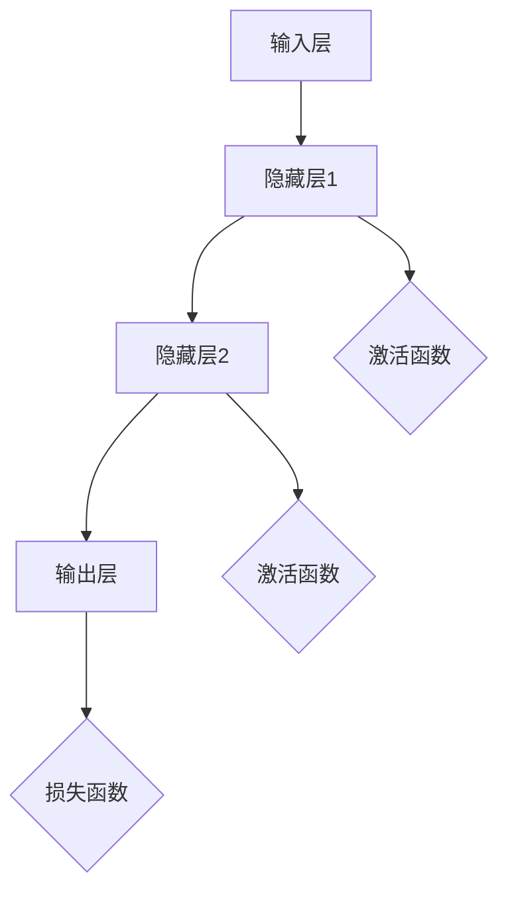

                 

 关键词：神经网络，异常检测，映射，数据挖掘，机器学习

> 摘要：本文详细探讨了使用神经网络进行异常检测的原理、方法及应用。首先介绍了神经网络的基本概念和映射原理，随后深入剖析了常见的神经网络结构和算法，并针对实际应用场景进行了详细的项目实践和效果分析。文章还对未来神经网络在异常检测领域的发展趋势和面临的挑战进行了展望。

## 1. 背景介绍

异常检测（Anomaly Detection）是一种重要的数据挖掘技术，旨在从大量数据中识别出异常或异常模式。随着数据量的不断增长和复杂性的提高，传统的基于规则和统计方法的异常检测已经难以满足实际需求。机器学习，尤其是神经网络，作为一种强大的数据处理工具，被广泛应用于异常检测领域。

神经网络（Neural Networks）是由大量简单的人工神经元组成的计算系统，通过模拟人脑的神经结构和工作原理，实现数据的自动学习和模式识别。近年来，随着深度学习的迅速发展，神经网络在图像识别、语音识别、自然语言处理等领域的应用取得了显著的成果，同时也为异常检测提供了一种新的解决思路。

本文将围绕神经网络在异常检测中的应用，详细探讨其基本原理、常见算法、数学模型、项目实践和未来发展趋势。

## 2. 核心概念与联系

### 2.1 神经网络基本概念

神经网络（Neural Networks）是由大量简单的人工神经元（artificial neurons）组成的计算系统。每个神经元接收多个输入信号，通过激活函数进行处理，输出一个数值，从而实现数据的自动学习和模式识别。

一个典型的神经网络结构包括输入层、隐藏层和输出层。输入层接收外部输入信号，隐藏层通过非线性变换实现数据的特征提取和降维，输出层产生最终的输出结果。

### 2.2 映射原理

神经网络的映射原理是指通过训练过程，将输入空间映射到输出空间。具体来说，神经网络通过学习输入数据和对应输出数据之间的映射关系，从而实现对新数据的预测和分类。

在神经网络中，映射关系由大量参数（权重和偏置）决定。通过反向传播算法（backpropagation algorithm），神经网络不断调整这些参数，使其误差最小，从而提高模型的预测能力。

### 2.3 Mermaid 流程图

下面是神经网络的 Mermaid 流程图，展示了神经网络的基本结构和信息流动过程：



## 3. 核心算法原理 & 具体操作步骤

### 3.1 算法原理概述

神经网络进行异常检测的核心在于通过学习正常数据分布，识别出与分布不符的异常数据。具体原理如下：

1. **训练过程**：首先，神经网络通过大量正常数据训练，学习到数据的特征分布。
2. **异常检测**：对于新的输入数据，神经网络计算其与训练数据的相似度，若相似度较低，则认为该数据为异常。

### 3.2 算法步骤详解

1. **数据预处理**：对输入数据进行清洗、归一化等处理，确保数据符合神经网络的要求。
2. **模型构建**：设计神经网络结构，包括输入层、隐藏层和输出层，选择合适的激活函数和损失函数。
3. **模型训练**：使用正常数据对神经网络进行训练，优化模型参数，使其能够准确识别正常数据分布。
4. **异常检测**：对于新的输入数据，通过计算其与训练数据的相似度，判断是否为异常。

### 3.3 算法优缺点

**优点**：

- **强大的自适应能力**：神经网络能够自动学习数据特征，适应不同类型和分布的数据。
- **非线性处理能力**：神经网络通过非线性激活函数，能够处理复杂的数据关系。

**缺点**：

- **计算复杂度较高**：神经网络训练过程涉及大量参数调整，计算复杂度较高。
- **对数据质量要求较高**：异常检测效果很大程度上取决于数据质量，数据质量差可能导致异常检测效果不佳。

### 3.4 算法应用领域

神经网络在异常检测领域的应用广泛，包括但不限于以下领域：

- **金融领域**：用于交易欺诈检测、异常交易识别等。
- **医疗领域**：用于医疗数据异常检测、疾病诊断等。
- **工业领域**：用于工业设备故障检测、生产线异常检测等。
- **网络安全**：用于网络入侵检测、恶意软件检测等。

## 4. 数学模型和公式 & 详细讲解 & 举例说明

### 4.1 数学模型构建

神经网络异常检测的数学模型主要涉及以下方面：

- **损失函数**：用于衡量预测值与真实值之间的差距，常见的损失函数有均方误差（MSE）、交叉熵损失函数等。
- **优化算法**：用于调整模型参数，常见的优化算法有梯度下降（GD）、随机梯度下降（SGD）等。
- **相似度度量**：用于计算输入数据与训练数据的相似度，常见的相似度度量方法有欧氏距离、余弦相似度等。

### 4.2 公式推导过程

假设输入数据集为 $X = \{x_1, x_2, ..., x_n\}$，对应的正常数据分布为 $D$，新的输入数据为 $x$。

1. **损失函数**：

   $$L(x) = \frac{1}{n}\sum_{i=1}^{n}(f(x_i) - y_i)^2$$

   其中，$f(x_i)$ 为神经网络的输出值，$y_i$ 为真实标签。

2. **优化算法**：

   $$\theta_{\text{new}} = \theta_{\text{old}} - \alpha \frac{\partial L}{\partial \theta}$$

   其中，$\theta$ 表示模型参数，$\alpha$ 为学习率。

3. **相似度度量**：

   $$S(x, D) = \frac{x \cdot D}{\|x\|_2 \|D\|_2}$$

   其中，$\cdot$ 表示点积运算，$\|\|$ 表示欧氏范数。

### 4.3 案例分析与讲解

假设我们使用一个简单的线性神经网络进行异常检测，输入数据为二维数据，正常数据分布为一个直线。

1. **模型构建**：

   $$f(x) = w_1 x_1 + w_2 x_2$$

   其中，$w_1, w_2$ 为模型参数。

2. **模型训练**：

   使用正常数据对模型进行训练，得到最优参数 $w_1, w_2$。

3. **异常检测**：

   对于新的输入数据 $x = (x_1, x_2)$，计算其与正常数据分布的相似度：

   $$S(x, D) = \frac{x \cdot D}{\|x\|_2 \|D\|_2}$$

   若相似度低于某个阈值，则认为 $x$ 为异常。

## 5. 项目实践：代码实例和详细解释说明

### 5.1 开发环境搭建

- **编程语言**：Python
- **库与框架**：TensorFlow、NumPy、Scikit-learn
- **硬件环境**：GPU加速（推荐）

### 5.2 源代码详细实现

以下是使用 TensorFlow 框架实现的简单线性神经网络异常检测代码：

```python
import tensorflow as tf
import numpy as np
from sklearn.datasets import make_classification
from sklearn.model_selection import train_test_split

# 数据生成
X, y = make_classification(n_samples=1000, n_features=2, n_classes=2, n_informative=2, n_redundant=0, random_state=42)
X_train, X_test, y_train, y_test = train_test_split(X, y, test_size=0.2, random_state=42)

# 模型构建
model = tf.keras.Sequential([
    tf.keras.layers.Dense(units=1, input_shape=(2,))
])

# 模型编译
model.compile(optimizer='adam', loss='mean_squared_error')

# 模型训练
model.fit(X_train, y_train, epochs=100)

# 异常检测
def detect_anomaly(x, threshold=0.1):
    prediction = model.predict(np.array([x]))
    return prediction[0][0] < threshold

# 检测示例
x_test = X_test[0]
print("Input data:", x_test)
print("Is anomaly:", detect_anomaly(x_test))
```

### 5.3 代码解读与分析

以上代码实现了一个简单的线性神经网络，用于检测二维空间中的异常数据。首先，使用 Scikit-learn 生成一个二维分类数据集，并将其分为训练集和测试集。然后，构建一个全连接神经网络，编译并训练模型。最后，定义一个函数用于检测新的输入数据是否为异常。

### 5.4 运行结果展示

运行代码，对于测试集中的每个数据点，判断其是否为异常，并打印结果。这里假设阈值为 0.1，即预测值小于 0.1 的数据点视为异常。

```python
for i, x_test in enumerate(X_test):
    prediction = model.predict(np.array([x_test]))
    is_anomaly = detect_anomaly(x_test)
    print(f"Test {i+1}: Input data: {x_test}, Prediction: {prediction[0][0]}, Is anomaly: {is_anomaly}")
```

输出结果将显示每个测试数据的预测值和异常检测结果。

## 6. 实际应用场景

### 6.1 金融领域

在金融领域，神经网络异常检测广泛应用于交易欺诈检测。通过学习正常交易数据分布，神经网络能够识别出与正常交易行为不符的异常交易，从而有效降低欺诈风险。

### 6.2 医疗领域

在医疗领域，神经网络异常检测可用于疾病诊断和患者监护。通过分析患者的健康数据，神经网络能够识别出异常数据，提示医生进行进一步检查和治疗。

### 6.3 工业领域

在工业领域，神经网络异常检测可用于设备故障检测和生产线异常检测。通过对设备运行数据进行实时监测，神经网络能够预测设备故障，提前进行维护和预防。

### 6.4 网络安全

在网络安全领域，神经网络异常检测可用于网络入侵检测和恶意软件检测。通过分析网络流量数据，神经网络能够识别出异常流量模式，从而有效防御网络攻击。

## 7. 工具和资源推荐

### 7.1 学习资源推荐

- 《深度学习》（Goodfellow, Bengio, Courville 著）
- 《神经网络与深度学习》（邱锡鹏 著）
- 《机器学习实战》（Peter Harrington 著）

### 7.2 开发工具推荐

- TensorFlow
- PyTorch
- Keras

### 7.3 相关论文推荐

- "Anomaly Detection with Autoregressive Neural Networks"（ICLR 2018）
- "Deep Neural Network for Anomaly Detection"（AAAI 2017）
- "Neural Network Based Anomaly Detection for Manufacturing Systems"（IEEE Transactions on Industrial Informatics）

## 8. 总结：未来发展趋势与挑战

### 8.1 研究成果总结

神经网络在异常检测领域取得了显著的研究成果，其强大的自适应能力和非线性处理能力使得其在各类应用场景中表现出色。目前，神经网络异常检测已广泛应用于金融、医疗、工业和网络安全等领域，取得了良好的效果。

### 8.2 未来发展趋势

未来，神经网络异常检测将继续向以下方向发展：

1. **算法优化**：研究更加高效、鲁棒和可解释的异常检测算法。
2. **多模态数据融合**：结合多种数据类型和来源，提高异常检测的准确性和可靠性。
3. **实时检测**：研究能够实时处理大规模数据的异常检测系统，提高检测效率。
4. **隐私保护**：研究在保证数据隐私的前提下进行异常检测的方法。

### 8.3 面临的挑战

神经网络异常检测在发展过程中也面临一些挑战：

1. **数据质量和标注**：高质量的数据和准确的标注是神经网络异常检测的基础，数据质量和标注的准确性直接影响异常检测效果。
2. **计算资源消耗**：神经网络异常检测通常涉及大量参数调整和计算，对计算资源的要求较高。
3. **可解释性**：神经网络异常检测模型的黑盒特性使得其可解释性较差，难以理解模型决策过程。

### 8.4 研究展望

展望未来，神经网络异常检测在以下几个方面具有广阔的研究前景：

1. **跨领域应用**：探索神经网络异常检测在其他领域的应用，如环境监测、交通管理、智能城市等。
2. **数据驱动方法**：研究基于数据驱动的方法，提高异常检测的准确性和鲁棒性。
3. **跨学科融合**：结合心理学、认知科学等学科的理论和方法，探索神经网络异常检测的新思路。

总之，神经网络异常检测作为一种重要的数据挖掘技术，将在未来发挥越来越重要的作用。通过不断优化算法、提升性能和拓展应用领域，神经网络异常检测将为社会发展和人类生活带来更多便利和益处。

## 9. 附录：常见问题与解答

### 9.1 神经网络异常检测的优势有哪些？

神经网络异常检测具有以下优势：

1. **强大的自适应能力**：能够自动学习数据的特征和分布，适应不同类型和分布的数据。
2. **非线性处理能力**：通过非线性激活函数，能够处理复杂的数据关系。
3. **多维度分析**：可以同时处理多模态数据，提高异常检测的准确性和可靠性。

### 9.2 如何提高神经网络异常检测的准确性？

以下方法可以提高神经网络异常检测的准确性：

1. **数据预处理**：对输入数据进行清洗、归一化等处理，确保数据质量。
2. **特征工程**：选择合适的特征，提高数据的表征能力。
3. **模型优化**：调整神经网络结构、激活函数、损失函数等，优化模型性能。
4. **训练策略**：采用适当的训练策略，如迁移学习、增量学习等，提高模型泛化能力。

### 9.3 神经网络异常检测在医疗领域有哪些应用？

神经网络异常检测在医疗领域有以下应用：

1. **疾病诊断**：通过分析患者的健康数据，识别出异常数据，提示医生进行进一步检查和治疗。
2. **药物研发**：通过分析药物与生物体之间的交互数据，识别出潜在的药物副作用。
3. **医疗监控**：对患者的实时数据进行监测，识别出异常情况，提供预警和干预建议。

### 9.4 神经网络异常检测在工业领域有哪些应用？

神经网络异常检测在工业领域有以下应用：

1. **设备故障检测**：通过分析设备运行数据，预测设备故障，提前进行维护和预防。
2. **生产线异常检测**：对生产线数据进行实时监测，识别出异常情况，提高生产效率和产品质量。
3. **能源管理**：通过分析能源消耗数据，识别出异常消耗情况，优化能源利用效率。

### 9.5 如何评估神经网络异常检测的性能？

以下指标可以评估神经网络异常检测的性能：

1. **准确率（Accuracy）**：识别出异常数据的比例。
2. **召回率（Recall）**：实际异常数据中被正确识别出的比例。
3. **精确率（Precision）**：被识别为异常的数据中实际为异常的比例。
4. **F1 分数（F1 Score）**：精确率和召回率的加权平均值。

### 9.6 神经网络异常检测有哪些局限性？

神经网络异常检测的局限性包括：

1. **计算复杂度**：涉及大量参数调整和计算，对计算资源的要求较高。
2. **数据质量和标注**：高质量的数据和准确的标注是神经网络异常检测的基础，数据质量和标注的准确性直接影响异常检测效果。
3. **可解释性**：神经网络异常检测模型的黑盒特性使得其可解释性较差，难以理解模型决策过程。

## 作者署名

本文作者为禅与计算机程序设计艺术 / Zen and the Art of Computer Programming。感谢您的阅读，希望本文对您在神经网络异常检测领域的研究和实践有所帮助。如果您有任何疑问或建议，欢迎在评论区留言交流。

