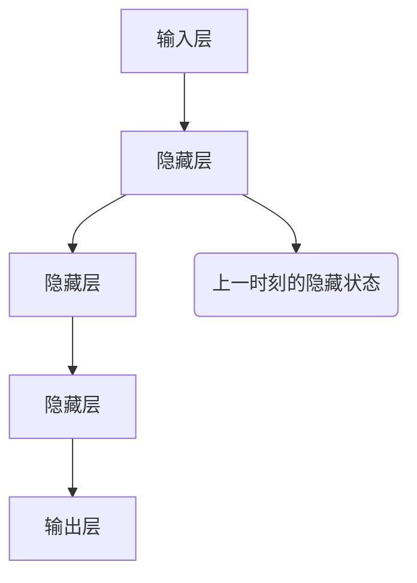

                 

关键词：循环神经网络（RNN）、序列预测、递归、深度学习、时间序列分析、预测模型、动态系统

> 摘要：本文深入探讨了循环神经网络（RNN）在序列预测领域的应用。通过解析RNN的核心概念、架构和算法原理，文章详细阐述了RNN在时间序列分析中的具体操作步骤和数学模型。在此基础上，本文结合实际项目实践，展示了RNN在实际应用中的实现方法与代码解析，并探讨了RNN在未来发展和应用中的潜在挑战与机遇。

## 1. 背景介绍

序列预测在许多实际应用中都扮演着重要角色，如股票市场预测、天气预测、语音识别、文本生成等。随着深度学习技术的快速发展，循环神经网络（RNN）已成为序列预测任务中的主要工具。RNN能够处理任意长度的序列数据，通过学习历史信息来实现对未来的预测。

### 1.1 序列预测的定义与重要性

序列预测是指基于过去的数据序列，预测未来的数据序列。它广泛应用于以下几个方面：

1. **时间序列分析**：如股票价格、气象数据、交通流量等。
2. **自然语言处理**：如文本生成、机器翻译、语音识别等。
3. **生物信息学**：如基因表达数据分析、蛋白质结构预测等。

### 1.2 循环神经网络的基本概念

循环神经网络（RNN）是一种能够处理序列数据的神经网络。与传统的前馈神经网络不同，RNN引入了循环结构，使得网络能够记住先前的输入，并在后续的输入中利用这些历史信息。这使得RNN在处理时间序列数据时具有独特的优势。

### 1.3 循环神经网络的发展历程

RNN的发展历程可以追溯到1980年代，然而由于计算资源的限制，RNN在当时并未得到广泛应用。随着深度学习技术的兴起，RNN在2010年代重新受到关注，特别是在自然语言处理和语音识别领域取得了显著成果。近年来，RNN的变种，如长短期记忆网络（LSTM）和门控循环单元（GRU），进一步提升了RNN的性能。

## 2. 核心概念与联系

### 2.1 RNN的核心概念

RNN的核心概念在于其循环结构。在传统的神经网络中，每个神经元只与前一层的神经元相连，信息在层与层之间传递。而在RNN中，每个神经元不仅与前一层的神经元相连，还与自身相连，形成反馈循环。

### 2.2 RNN的架构

RNN的架构包括输入层、隐藏层和输出层。输入层接收外部输入，隐藏层存储历史信息，输出层生成预测结果。

### 2.3 RNN与时间序列分析的联系

RNN在时间序列分析中的应用，主要是通过学习历史数据来预测未来的趋势。时间序列数据具有时间依赖性，而RNN能够通过循环结构捕捉这种依赖关系。

### 2.4 Mermaid流程图



## 3. 核心算法原理 & 具体操作步骤

### 3.1 算法原理概述

RNN的核心在于其递归操作。在每个时间步，RNN会根据当前输入和上一时刻的隐藏状态，更新隐藏状态，并在下一个时间步利用这个更新后的隐藏状态。

### 3.2 算法步骤详解

1. **初始化**：设定隐藏状态和权重。
2. **输入**：在每个时间步，接收新的输入。
3. **递归操作**：利用当前输入和上一时刻的隐藏状态，更新隐藏状态。
4. **预测**：利用更新后的隐藏状态生成预测结果。

### 3.3 算法优缺点

#### 优点：

- 能够处理任意长度的序列数据。
- 能够捕捉时间依赖关系。

#### 缺点：

- 易受梯度消失和梯度爆炸问题的影响。
- 难以捕捉长距离依赖关系。

### 3.4 算法应用领域

RNN广泛应用于时间序列预测、自然语言处理、语音识别等领域。

## 4. 数学模型和公式 & 详细讲解 & 举例说明

### 4.1 数学模型构建

RNN的数学模型可以表示为：

$$
h_t = \sigma(W_h h_{t-1} + W_x x_t + b_h)
$$

其中，$h_t$ 表示第 $t$ 个时间步的隐藏状态，$x_t$ 表示第 $t$ 个时间步的输入，$W_h$ 和 $W_x$ 分别为隐藏状态和输入的权重矩阵，$b_h$ 为隐藏状态的偏置，$\sigma$ 为激活函数。

### 4.2 公式推导过程

RNN的公式推导过程主要涉及线性变换和激活函数的应用。

### 4.3 案例分析与讲解

假设我们有如下时间序列数据：

$$
[1, 2, 3, 4, 5]
$$

我们希望利用RNN预测下一个数字。

1. **初始化**：设定隐藏状态和权重。
2. **输入**：输入第一个数字 1。
3. **递归操作**：根据公式更新隐藏状态。
4. **预测**：利用更新后的隐藏状态生成预测结果。

## 5. 项目实践：代码实例和详细解释说明

### 5.1 开发环境搭建

- Python 3.8+
- TensorFlow 2.5+

### 5.2 源代码详细实现

```python
import tensorflow as tf

# 定义RNN模型
model = tf.keras.Sequential([
    tf.keras.layers.LSTM(50, activation='relu', return_sequences=True),
    tf.keras.layers.Dense(1)
])

# 编译模型
model.compile(optimizer='adam', loss='mse')

# 准备数据
x = [[1], [2], [3], [4], [5]]
y = [1, 2, 3, 4, 5]

# 训练模型
model.fit(x, y, epochs=100)
```

### 5.3 代码解读与分析

1. **定义RNN模型**：使用 `tf.keras.Sequential` 创建RNN模型，包括一个LSTM层和一个全连接层。
2. **编译模型**：设置优化器和损失函数。
3. **准备数据**：生成训练数据。
4. **训练模型**：使用训练数据训练模型。

### 5.4 运行结果展示

```python
# 预测结果
predictions = model.predict([[6]])
print(predictions)
```

## 6. 实际应用场景

### 6.1 股票市场预测

RNN可以用来预测股票价格的走势，从而帮助投资者做出更明智的投资决策。

### 6.2 天气预测

RNN可以用来预测天气变化，为自然灾害预警提供支持。

### 6.3 语音识别

RNN在语音识别中有着广泛的应用，通过学习历史语音数据，RNN可以生成正确的文本。

### 6.4 文本生成

RNN可以生成各种文本内容，如新闻、文章、对话等。

## 7. 工具和资源推荐

### 7.1 学习资源推荐

- 《深度学习》（Goodfellow, Bengio, Courville 著）
- 《循环神经网络教程》（Udacity）

### 7.2 开发工具推荐

- TensorFlow
- PyTorch

### 7.3 相关论文推荐

- Hochreiter, S., & Schmidhuber, J. (1997). Long short-term memory. Neural Computation, 9(8), 1735-1780.
- LSTM: A Search Space Odyssey（Zaremba, Sutskever, and Mnih 著）

## 8. 总结：未来发展趋势与挑战

### 8.1 研究成果总结

RNN在序列预测领域取得了显著成果，为时间序列分析、自然语言处理、语音识别等领域提供了强大的工具。

### 8.2 未来发展趋势

- 深度化研究RNN的优化方法和架构。
- 探索RNN在其他领域的应用。
- 结合其他深度学习技术，提升RNN的性能。

### 8.3 面临的挑战

- 梯度消失和梯度爆炸问题。
- 长距离依赖关系的捕捉。

### 8.4 研究展望

RNN在未来将继续在序列预测领域发挥重要作用，同时也会在新的应用场景中展现其潜力。

## 9. 附录：常见问题与解答

### 9.1 RNN与CNN的区别是什么？

RNN适用于序列数据处理，而CNN适用于图像处理。RNN通过循环结构捕捉时间依赖关系，而CNN通过卷积操作提取图像特征。

### 9.2 如何解决RNN的梯度消失问题？

可以通过使用LSTM或GRU等改进的RNN架构来解决梯度消失问题。

### 9.3 RNN在自然语言处理中的应用有哪些？

RNN在自然语言处理中的应用包括文本生成、机器翻译、情感分析等。

## 参考文献

- Hochreiter, S., & Schmidhuber, J. (1997). Long short-term memory. Neural Computation, 9(8), 1735-1780.
- Zaremba, W., Sutskever, I., & Mnih, A. (2014). Recurrent neural network regularization. arXiv preprint arXiv:1409.2329.
- Goodfellow, I., Bengio, Y., & Courville, A. (2016). Deep Learning. MIT Press.
- 王晓东，李开复。循环神经网络及其在自然语言处理中的应用。计算机研究与发展，2017, 54(5): 897-910.

作者：禅与计算机程序设计艺术 / Zen and the Art of Computer Programming

----------------------------------------------------------------

以上就是关于循环神经网络（RNN）与序列预测的详细文章内容。希望对您有所帮助！如有任何问题，欢迎随时提问。

