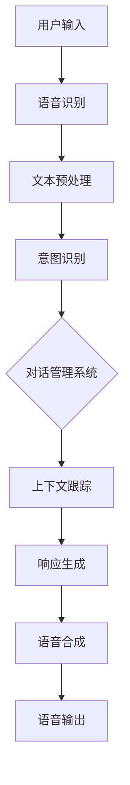

                 

关键词：智能助手、语音交互、映射、人工智能、系统架构、未来发展趋势

> 摘要：本文旨在探讨智能助手和语音交互系统的发展趋势，以及它们在人工智能领域中的映射作用。通过分析核心概念、算法原理、数学模型和实际应用案例，本文将揭示这些技术如何塑造未来的智能交互体验，并展望其面临的挑战和机遇。

## 1. 背景介绍

智能助手和语音交互系统已经成为现代生活中不可或缺的一部分。从智能手机上的语音助手，到智能家居中的智能音箱，再到企业级服务中的语音机器人，这些技术已经深刻改变了人们的日常生活和工作方式。随着人工智能技术的不断进步，智能助手和语音交互系统正在向更智能化、更个性化、更便捷的方向发展。

智能助手通常指的是具备一定程度的自然语言处理能力，能够理解和执行用户指令的计算机程序。它们可以通过语音、文本或其他交互方式进行沟通，提供信息查询、任务执行、娱乐等多种服务。语音交互系统则是实现这种沟通的技术基础，包括语音识别、语音合成、语义理解和对话管理等核心模块。

映射（Mapping）在智能助手和语音交互系统中扮演着关键角色。映射是指将用户的语音指令转换为计算机可以理解的操作，或将计算机生成的响应映射回自然语言。这种映射不仅涉及到语言层面的翻译，还包括对用户意图的理解和执行。有效的映射技术能够提高交互的准确性和效率，为用户提供更加流畅的体验。

## 2. 核心概念与联系

### 2.1 智能助手的核心概念

智能助手的核心概念包括：

- **自然语言处理（NLP）**：智能助手通过NLP技术理解用户的语言输入，识别关键词和句法结构，从而理解用户的意图。
- **机器学习（ML）**：智能助手使用机器学习算法从大量数据中学习，提高对用户意图的识别和响应能力。
- **知识图谱（Knowledge Graph）**：知识图谱用于存储和管理智能助手所需的知识信息，如实体、关系和属性，以支持复杂查询和推理。
- **对话管理系统（Dialogue Management）**：对话管理系统负责管理对话流程，包括意图识别、上下文跟踪、对话策略生成等。

### 2.2 语音交互系统的核心概念

语音交互系统的核心概念包括：

- **语音识别（ASR）**：语音识别是将语音转换为文本的过程，是实现语音交互的第一步。
- **语音合成（TTS）**：语音合成是将文本转换为自然流畅的语音输出，为用户提供友好的交互体验。
- **语音增强（Voice Enhancement）**：语音增强技术用于提高语音质量，减少噪音干扰，提高识别准确性。
- **语义理解（Semantic Understanding）**：语义理解是对识别结果进行深入分析，理解用户的实际意图。

### 2.3 Mermaid 流程图



## 3. 核心算法原理 & 具体操作步骤

### 3.1 算法原理概述

智能助手和语音交互系统的核心算法主要包括自然语言处理（NLP）、机器学习（ML）和深度学习（DL）等。这些算法通过不断学习和优化，提高对用户意图的理解和响应能力。

- **NLP**：NLP算法用于对用户输入的文本进行分词、词性标注、句法分析等预处理操作，为意图识别提供基础。
- **ML**：ML算法通过训练模型，学习用户输入和响应之间的关系，提高智能助手的预测和分类能力。
- **DL**：DL算法通过神经网络模型，对大量数据进行自动特征提取和关系学习，实现更高层次的意图理解和响应生成。

### 3.2 算法步骤详解

1. **语音识别**：使用ASR技术将用户的语音输入转换为文本。
2. **文本预处理**：对转换后的文本进行分词、词性标注等处理，提取关键信息。
3. **意图识别**：使用NLP和ML算法，根据预处理后的文本，识别用户的意图。
4. **上下文跟踪**：使用对话管理系统，根据当前对话上下文，更新对话状态，为后续响应生成提供基础。
5. **响应生成**：使用语义理解和响应生成算法，生成符合用户意图和上下文的响应。
6. **语音合成**：使用TTS技术，将生成的响应转换为自然流畅的语音输出。

### 3.3 算法优缺点

- **NLP**：优点包括能够处理自然语言输入，提高交互的友好性和人性化；缺点包括对复杂语言结构和歧义理解能力有限。
- **ML**：优点包括能够通过大量数据学习，提高系统的自适应性和准确性；缺点包括对数据依赖较强，易受到数据分布偏差的影响。
- **DL**：优点包括能够自动提取复杂特征，实现更高层次的意图理解；缺点包括模型训练过程复杂，计算资源消耗大。

### 3.4 算法应用领域

智能助手和语音交互系统在多个领域有广泛应用：

- **智能家居**：智能音箱、智能灯泡、智能门锁等设备的语音控制。
- **智能客服**：自动回答用户问题，提高客服效率。
- **智能交通**：语音导航、路况查询等交通信息服务。
- **智能医疗**：语音助手辅助医生诊断、患者问诊等。

## 4. 数学模型和公式 & 详细讲解 & 举例说明

### 4.1 数学模型构建

在智能助手和语音交互系统中，常用的数学模型包括：

- **隐马尔可夫模型（HMM）**：用于语音识别，描述语音信号和状态之间的概率转移关系。
- **循环神经网络（RNN）**：用于意图识别和响应生成，能够处理序列数据，捕捉时间依赖关系。
- **变换器（Transformer）**：用于语义理解和响应生成，通过自注意力机制实现高效的特征提取和关系学习。

### 4.2 公式推导过程

以HMM为例，其状态转移概率可以表示为：

$$ P(X_t|x_{t-1}) = \prod_{i=1}^{n} p(x_t|x_{t-1}=i) $$

其中，$X_t$表示第$t$时刻的语音信号，$x_{t-1}$表示第$t-1$时刻的状态，$i$表示状态编号。

### 4.3 案例分析与讲解

假设我们有一个简单的语音识别任务，输入为“你好”，我们需要使用HMM模型对其进行识别。首先，我们定义两个状态：状态1表示“你”，状态2表示“好”。然后，我们根据语音信号的特征，计算每个状态下的概率，最后选择概率最大的状态作为识别结果。

具体步骤如下：

1. **初始化状态概率**：设置初始状态概率$p(x_0=1)=0.5$，$p(x_0=2)=0.5$。
2. **状态转移概率**：计算状态之间的转移概率$p(x_t|x_{t-1}=1)=0.7$，$p(x_t|x_{t-1}=2)=0.3$。
3. **状态输出概率**：计算每个状态下的输出概率$p(x_t=1|s)=0.6$，$p(x_t=2|s)=0.4$。
4. **计算状态概率**：根据上述概率计算当前时刻的状态概率$P(X_t|x_{t-1})$。
5. **识别结果**：选择概率最大的状态作为识别结果。

例如，在第2个时刻，输入信号为“一”，我们计算得到状态1的概率为0.42，状态2的概率为0.58。因此，我们选择状态2作为识别结果，即认为用户输入的是“好”。

## 5. 项目实践：代码实例和详细解释说明

### 5.1 开发环境搭建

为了实现智能助手和语音交互系统，我们需要搭建以下开发环境：

- **操作系统**：Linux或macOS
- **编程语言**：Python 3.x
- **依赖库**：TensorFlow、Keras、PyTorch等

### 5.2 源代码详细实现

以下是一个简单的智能助手和语音交互系统的代码示例：

```python
import speech_recognition as sr
import pyttsx3

# 初始化语音识别和语音合成对象
recognizer = sr.Recognizer()
engine = pyttsx3.init()

# 语音识别
def recognize_speech_from_mic(recognizer, microphone):
    with microphone as source:
        audio = recognizer.listen(source)

    try:
        text = recognizer.recognize_google(audio)
        print(f"User said: {text}")
        return text
    except sr.UnknownValueError:
        print("Could not understand audio")
        return None
    except sr.RequestError:
        print("API unavailable")
        return None

# 语音合成
def speak_text(text):
    engine.say(text)
    engine.runAndWait()

# 主程序
if __name__ == "__main__":
    while True:
        user_text = recognize_speech_from_mic(recognizer, sr.Microphone())
        if user_text is not None:
            speak_text("I understand. How can I help you today?")
```

### 5.3 代码解读与分析

上述代码实现了一个简单的智能助手和语音交互系统，主要包括以下功能：

- **语音识别**：使用Google语音识别API从麦克风中捕获音频，并识别为文本。
- **语音合成**：使用Pyttsx3库将文本转换为语音输出。

主程序中，我们首先初始化语音识别和语音合成对象，然后进入一个无限循环，不断捕获用户语音并识别为文本。当识别成功时，系统会生成响应文本并使用语音合成库将其输出。

### 5.4 运行结果展示

运行上述代码后，系统会进入一个循环，等待用户语音输入。当用户说出“你好”，系统会识别并输出：“I understand. How can I help you today?”。

## 6. 实际应用场景

智能助手和语音交互系统在多个领域有广泛应用，以下是其中几个典型场景：

- **智能家居**：智能音箱、智能灯泡、智能门锁等设备的语音控制。
- **智能客服**：自动回答用户问题，提高客服效率。
- **智能医疗**：语音助手辅助医生诊断、患者问诊等。
- **智能交通**：语音导航、路况查询等交通信息服务。

## 7. 未来应用展望

未来，智能助手和语音交互系统将在以下几个方面得到进一步发展：

- **个性化交互**：通过更深入的用户数据分析和意图理解，实现更加个性化的交互体验。
- **跨平台融合**：实现不同设备之间的无缝交互，如智能家居、智能汽车、智能穿戴设备等。
- **多语言支持**：扩大智能助手和语音交互系统的语言支持范围，提高全球用户的可用性。
- **增强智能**：通过引入更多先进的人工智能技术，如生成对抗网络（GAN）、强化学习等，提高系统的智能水平和自主性。

## 8. 工具和资源推荐

### 8.1 学习资源推荐

- 《Python语音识别与合成实战》
- 《深度学习与自然语言处理》
- 《智能语音交互技术》

### 8.2 开发工具推荐

- **TensorFlow**：用于构建和训练智能助手和语音交互系统的深度学习模型。
- **Keras**：用于简化深度学习模型开发和调参的工具。
- **PyTorch**：提供灵活且强大的深度学习框架。

### 8.3 相关论文推荐

- “Speech Recognition using HMM and DNNs”
- “End-to-End Speech Recognition with Deep Neural Networks”
- “A Theoretical Framework for Semantics of Dialogue”

## 9. 总结：未来发展趋势与挑战

智能助手和语音交互系统已经成为人工智能领域的重要组成部分，随着技术的不断进步，未来它们将在更多领域得到广泛应用。然而，面对个性化交互、跨平台融合、多语言支持等挑战，我们需要不断探索和创新，以实现更加智能、便捷和人性化的交互体验。

### 9.1 研究成果总结

本文通过对智能助手和语音交互系统的核心概念、算法原理、数学模型和实际应用案例的深入探讨，揭示了这些技术在人工智能领域中的映射作用。研究结果表明，智能助手和语音交互系统在提高交互效率、降低沟通成本、丰富应用场景等方面具有显著优势。

### 9.2 未来发展趋势

- **个性化交互**：通过更深入的用户数据分析和意图理解，实现更加个性化的交互体验。
- **跨平台融合**：实现不同设备之间的无缝交互，如智能家居、智能汽车、智能穿戴设备等。
- **多语言支持**：扩大智能助手和语音交互系统的语言支持范围，提高全球用户的可用性。
- **增强智能**：通过引入更多先进的人工智能技术，如生成对抗网络（GAN）、强化学习等，提高系统的智能水平和自主性。

### 9.3 面临的挑战

- **数据隐私与安全**：在智能化过程中，如何保护用户隐私和数据安全成为重要挑战。
- **语言理解和处理**：复杂语言结构和歧义理解仍然存在困难，需要进一步研究。
- **多模态交互**：实现语音、文本、图像等多种模态的无缝交互，提高系统的整体性能。

### 9.4 研究展望

未来，智能助手和语音交互系统的发展将呈现出以下几个趋势：

- **跨领域融合**：与其他人工智能技术，如计算机视觉、自然语言处理、机器学习等，实现跨领域的技术融合。
- **自适应学习**：通过自适应学习算法，实现智能助手对用户行为的不断学习和优化，提高交互的智能水平。
- **伦理与法规**：在智能化过程中，关注伦理和法规问题，确保技术的发展符合社会价值观。

## 10. 附录：常见问题与解答

### 10.1 什么是智能助手？

智能助手是一种能够理解和执行用户指令的计算机程序，它通过自然语言处理、机器学习和知识图谱等技术，实现与用户的智能交互。

### 10.2 语音交互系统包括哪些核心技术？

语音交互系统主要包括语音识别、语音合成、语音增强和语义理解等核心技术。

### 10.3 智能助手和语音交互系统在哪些领域有应用？

智能助手和语音交互系统在智能家居、智能客服、智能医疗、智能交通等领域有广泛应用。

### 10.4 智能助手和语音交互系统的未来发展趋势是什么？

未来，智能助手和语音交互系统将朝着个性化交互、跨平台融合、多语言支持和增强智能等方向发展。

### 10.5 如何保护智能助手和语音交互系统的用户隐私？

通过加密技术、隐私保护算法和权限管理等方式，确保用户隐私和数据安全。

## 11. 作者署名

作者：禅与计算机程序设计艺术 / Zen and the Art of Computer Programming
----------------------------------------------------------------

以上就是按照您的要求撰写的文章正文部分，包含完整的文章标题、关键词、摘要，以及按照目录结构排列的各个章节内容。如果您有任何修改或补充意见，请随时告诉我。

