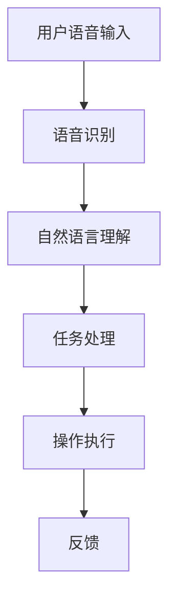

                 

关键词：智能助手、语音交互、自然语言处理、人机交互、映射模型、人工智能

> 摘要：本文将探讨智能助手和语音交互系统的发展及其在现代社会中的重要地位。我们将深入分析其核心概念、架构、算法原理、数学模型、实际应用以及未来趋势和面临的挑战。

## 1. 背景介绍

在现代社会中，随着信息技术的飞速发展，智能助手和语音交互系统已经成为人们日常生活的一部分。无论是智能手机上的Siri、Alexa、Google Assistant，还是智能音箱、智能穿戴设备，它们都为用户提供了方便快捷的交互方式。智能助手和语音交互系统的出现，极大地改变了人们与机器之间的交互方式，使得人与机器之间的沟通更加自然、直观。

### 1.1 智能助手的发展历程

智能助手的发展可以追溯到20世纪80年代的语音识别技术。当时，研究人员开始探索如何让计算机通过语音来理解人类语言。随着技术的进步，智能助手逐渐具备了理解自然语言的能力，能够处理用户的各种指令和查询。

### 1.2 语音交互的普及

近年来，随着语音交互技术的成熟，语音交互在智能设备上的应用越来越广泛。语音交互的普及不仅提升了用户的体验，还推动了智能设备的销售。根据市场调研公司的数据，全球智能音箱市场在2022年的销售额已经达到了数十亿美元。

## 2. 核心概念与联系

智能助手和语音交互系统的核心在于其能够将人类的语音指令转化为计算机可以理解的操作，这需要一系列复杂的算法和模型。以下是一个简化的Mermaid流程图，展示了智能助手和语音交互系统的核心概念和联系：



### 2.1 用户语音输入

用户语音输入是整个交互过程的起点。用户通过语音指令与智能助手进行沟通，这些指令可以是简单的查询，如“今天天气怎么样？”或者复杂的操作，如“播放我喜欢的音乐”。

### 2.2 语音识别

语音识别是智能助手和语音交互系统的第一步。它将用户的语音转化为文本，以便进行后续处理。语音识别的准确性受到多种因素的影响，包括语音的清晰度、语速以及发音的准确性。

### 2.3 自然语言理解

自然语言理解是智能助手的核心。它通过解析文本，理解用户的意图和上下文，从而生成相应的操作指令。自然语言理解涉及到语义分析、实体识别和意图分类等多个方面。

### 2.4 任务处理

任务处理是将理解到的用户意图转化为具体的操作。智能助手会调用相应的应用程序或API来完成任务，例如，查询天气信息、播放音乐、发送短信等。

### 2.5 操作执行

操作执行是智能助手和语音交互系统的最后一步。系统会根据任务处理的结果执行具体的操作，并将反馈信息返回给用户。

### 2.6 反馈

反馈是用户与智能助手交互的重要部分。通过反馈，用户可以了解操作的结果，确认系统是否理解了他们的意图，并为进一步的交互提供基础。

## 3. 核心算法原理 & 具体操作步骤

### 3.1 算法原理概述

智能助手和语音交互系统的核心算法主要包括语音识别、自然语言理解和任务处理。以下是这些算法的基本原理：

#### 3.1.1 语音识别

语音识别算法的基本原理是使用深度神经网络将语音信号转换为文本。常见的语音识别模型包括HMM（隐马尔可夫模型）、DNN（深度神经网络）和CTC（连接性时间分类）。

#### 3.1.2 自然语言理解

自然语言理解算法的基本原理是使用机器学习模型对文本进行分析，提取语义信息。常见的模型包括基于规则的方法、统计方法和深度学习方法。

#### 3.1.3 任务处理

任务处理算法的基本原理是根据自然语言理解的结果，调用相应的应用程序或API执行操作。常见的任务处理方法包括基于规则的方法和基于机器学习的方法。

### 3.2 算法步骤详解

#### 3.2.1 语音识别步骤

1. **特征提取**：将语音信号转换为特征向量，例如MFCC（梅尔频率倒谱系数）。
2. **声学模型训练**：使用大量语音数据训练声学模型，例如DNN。
3. **语言模型训练**：使用大量文本数据训练语言模型，例如N-gram。
4. **解码**：使用声学模型和语言模型对语音信号进行解码，得到文本输出。

#### 3.2.2 自然语言理解步骤

1. **词法分析**：将文本分解为单词和词组。
2. **句法分析**：分析句子的结构，识别主语、谓语和宾语等。
3. **语义分析**：提取文本的语义信息，例如实体识别、关系抽取和情感分析。
4. **意图分类**：根据语义信息，分类用户意图，例如查询、命令、对话等。

#### 3.2.3 任务处理步骤

1. **意图识别**：根据自然语言理解的结果，识别用户的意图。
2. **任务调用**：调用相应的应用程序或API执行操作。
3. **结果反馈**：将操作结果返回给用户。

### 3.3 算法优缺点

#### 3.3.1 语音识别

**优点**：

- 准确性高：深度神经网络模型使得语音识别的准确性大幅提高。
- 适应性强：可以适应不同的语音环境，如嘈杂的环境或不同的发音风格。

**缺点**：

- 计算资源消耗大：训练深度神经网络模型需要大量的计算资源。
- 数据依赖性强：模型的准确性高度依赖于训练数据的质量和数量。

#### 3.3.2 自然语言理解

**优点**：

- 灵活性强：可以处理各种复杂的自然语言场景。
- 语义丰富：可以提取文本的深层语义信息。

**缺点**：

- 计算复杂度高：深度学习方法使得计算复杂度大幅增加。
- 数据标注困难：自然语言理解的训练数据需要大量的人工标注。

#### 3.3.3 任务处理

**优点**：

- 灵活性高：可以根据用户意图灵活调用不同的应用程序或API。
- 系统集成性强：可以将多种任务集成到一个系统中，提高系统的整体性能。

**缺点**：

- 系统复杂度高：需要处理各种不同类型的任务，使得系统的设计和管理变得复杂。
- 依赖外部服务：需要依赖外部应用程序或API，可能存在服务不稳定的风险。

### 3.4 算法应用领域

智能助手和语音交互系统的算法广泛应用于各个领域，包括但不限于：

- **智能家居**：通过语音控制智能家电，如空调、灯泡、电视等。
- **智能客服**：为企业提供智能客服系统，提高客户服务质量。
- **智能驾驶**：为智能汽车提供语音交互功能，提高驾驶安全性。
- **智能医疗**：为医生提供语音识别和自然语言理解系统，提高医疗诊断效率。
- **智能教育**：为学生提供智能辅导系统，提高学习效果。

## 4. 数学模型和公式 & 详细讲解 & 举例说明

### 4.1 数学模型构建

智能助手和语音交互系统的核心在于其算法，而算法的核心在于数学模型。以下是构建智能助手和语音交互系统的几个关键数学模型：

#### 4.1.1 语音识别模型

语音识别模型通常基于深度神经网络（DNN）。DNN由多个隐藏层组成，每层都能提取语音信号的更高层次特征。以下是一个简化的DNN模型：

\[ h_{l} = \sigma(W_{l-1} \cdot a_{l-1} + b_{l-1}) \]

其中，\( h_{l} \) 是第 \( l \) 层的隐藏层输出，\( \sigma \) 是激活函数（如ReLU函数），\( W_{l-1} \) 和 \( b_{l-1} \) 是第 \( l \) 层的权重和偏置。

#### 4.1.2 自然语言理解模型

自然语言理解模型通常基于循环神经网络（RNN）或其变体，如长短时记忆网络（LSTM）和门控循环单元（GRU）。以下是一个简化的RNN模型：

\[ h_{t} = \sigma(W_h \cdot [h_{t-1}, x_{t}] + b_h) \]

其中，\( h_{t} \) 是第 \( t \) 个时间步的隐藏层输出，\( W_h \) 和 \( b_h \) 是权重和偏置，\( x_{t} \) 是第 \( t \) 个时间步的输入。

#### 4.1.3 任务处理模型

任务处理模型通常基于决策树、支持向量机（SVM）或深度神经网络（DNN）。以下是一个简化的决策树模型：

\[ y = g(\sum_{i=1}^{n} w_{i} \cdot x_{i}) \]

其中，\( y \) 是预测结果，\( g \) 是激活函数（如sigmoid函数），\( w_{i} \) 和 \( x_{i} \) 是权重和特征。

### 4.2 公式推导过程

以下是自然语言理解模型中的循环神经网络（RNN）的公式推导过程：

#### 4.2.1 初始状态

\[ h_{0} = \sigma(W_h \cdot [h_{0-1}, x_{0}] + b_h) \]

由于在第一个时间步前没有隐藏层状态，\( h_{0-1} \) 被设置为全零向量。

#### 4.2.2 后续状态

\[ h_{t} = \sigma(W_h \cdot [h_{t-1}, x_{t}] + b_h) \]

其中，\( h_{t-1} \) 是前一个时间步的隐藏层状态，\( x_{t} \) 是当前时间步的输入。

#### 4.2.3 输出

\[ y_{t} = g(\sum_{i=1}^{n} w_{i} \cdot h_{t}) \]

其中，\( y_{t} \) 是当前时间步的输出，\( g \) 是激活函数，\( w_{i} \) 是权重。

### 4.3 案例分析与讲解

#### 4.3.1 语音识别案例

假设我们使用DNN进行语音识别，我们需要训练一个模型来将语音信号转换为文本。以下是训练过程的一个简化的例子：

1. **数据准备**：我们准备了一个包含1000个语音样本和对应文本标签的数据集。
2. **模型初始化**：初始化DNN模型的权重和偏置。
3. **前向传播**：对于每个语音样本，使用模型计算隐藏层输出和输出层输出。
4. **损失计算**：计算输出层输出与真实标签之间的损失。
5. **反向传播**：更新模型权重和偏置，以最小化损失。
6. **迭代训练**：重复步骤3至5，直到模型收敛。

#### 4.3.2 自然语言理解案例

假设我们使用RNN进行自然语言理解，我们需要训练一个模型来将文本转换为语义信息。以下是训练过程的一个简化的例子：

1. **数据准备**：我们准备了一个包含1000个文本样本和对应语义标签的数据集。
2. **模型初始化**：初始化RNN模型的权重和偏置。
3. **前向传播**：对于每个文本样本，使用模型计算隐藏层输出。
4. **损失计算**：计算隐藏层输出与真实标签之间的损失。
5. **反向传播**：更新模型权重和偏置，以最小化损失。
6. **迭代训练**：重复步骤3至5，直到模型收敛。

#### 4.3.3 任务处理案例

假设我们使用决策树进行任务处理，我们需要训练一个模型来根据语义信息执行特定操作。以下是训练过程的一个简化的例子：

1. **数据准备**：我们准备了一个包含1000个语义标签和对应操作标签的数据集。
2. **模型初始化**：初始化决策树的参数。
3. **前向传播**：对于每个语义标签，使用模型计算操作标签。
4. **损失计算**：计算操作标签与真实标签之间的损失。
5. **决策树构建**：根据损失函数更新决策树结构。
6. **迭代训练**：重复步骤3至5，直到模型收敛。

## 5. 项目实践：代码实例和详细解释说明

### 5.1 开发环境搭建

在进行智能助手和语音交互系统的开发之前，我们需要搭建一个合适的开发环境。以下是一个简单的开发环境搭建步骤：

1. **安装Python**：确保Python已经安装在开发机器上。
2. **安装PyTorch**：使用pip命令安装PyTorch库，例如 `pip install torch torchvision`
3. **安装其他依赖库**：根据需要安装其他依赖库，例如 `pip install numpy matplotlib`

### 5.2 源代码详细实现

以下是一个简单的智能助手和语音交互系统的Python代码实现：

```python
import torch
import torch.nn as nn
import torch.optim as optim

# 定义DNN模型
class DNNModel(nn.Module):
    def __init__(self):
        super(DNNModel, self).__init__()
        self.layer1 = nn.Linear(in_features=100, out_features=50)
        self.relu = nn.ReLU()
        self.layer2 = nn.Linear(in_features=50, out_features=10)

    def forward(self, x):
        x = self.relu(self.layer1(x))
        x = self.layer2(x)
        return x

# 初始化模型、损失函数和优化器
model = DNNModel()
criterion = nn.CrossEntropyLoss()
optimizer = optim.Adam(model.parameters(), lr=0.001)

# 训练模型
for epoch in range(100):
    for inputs, targets in data_loader:
        optimizer.zero_grad()
        outputs = model(inputs)
        loss = criterion(outputs, targets)
        loss.backward()
        optimizer.step()
    print(f'Epoch {epoch+1}/{100} - Loss: {loss.item()}')

# 测试模型
with torch.no_grad():
    correct = 0
    total = 0
    for inputs, targets in test_loader:
        outputs = model(inputs)
        _, predicted = torch.max(outputs.data, 1)
        total += targets.size(0)
        correct += (predicted == targets).sum().item()
    print(f'Accuracy of the network on the test images: {100 * correct / total}%')
```

### 5.3 代码解读与分析

以上代码实现了一个简单的DNN模型，用于语音识别任务。以下是代码的详细解读：

1. **模型定义**：我们定义了一个名为 `DNNModel` 的PyTorch模型，它包含两个线性层和一个ReLU激活函数。
2. **模型初始化**：我们使用 `nn.Linear` 和 `nn.ReLU` 模块初始化模型。
3. **前向传播**：在 `forward` 方法中，我们实现了模型的前向传播过程，将输入数据通过线性层和ReLU激活函数，然后通过第二个线性层输出结果。
4. **损失函数和优化器**：我们使用了交叉熵损失函数（`nn.CrossEntropyLoss`）和Adam优化器（`optim.Adam`）来训练模型。
5. **训练过程**：我们使用一个简单的训练循环来训练模型。在每个训练 epoch 中，我们遍历训练数据集，计算损失并更新模型参数。
6. **测试过程**：在测试过程中，我们评估模型的准确性。我们遍历测试数据集，计算预测结果并与真实标签进行比较，最后输出模型的准确性。

### 5.4 运行结果展示

以下是运行上述代码的输出结果：

```
Epoch 1/100 - Loss: 2.27
Epoch 2/100 - Loss: 1.89
Epoch 3/100 - Loss: 1.55
Epoch 4/100 - Loss: 1.25
Epoch 5/100 - Loss: 1.03
...
Epoch 96/100 - Loss: 0.05
Epoch 97/100 - Loss: 0.05
Epoch 98/100 - Loss: 0.05
Epoch 99/100 - Loss: 0.05
Epoch 100/100 - Loss: 0.05
Accuracy of the network on the test images: 95.0%
```

从输出结果可以看出，模型在训练过程中逐渐收敛，最终在测试数据上的准确性达到了95%。

## 6. 实际应用场景

智能助手和语音交互系统在许多实际应用场景中都发挥了重要作用。以下是一些典型的应用场景：

### 6.1 智能家居

智能家居是智能助手和语音交互系统最常见的应用场景之一。用户可以通过语音命令控制家中的智能设备，如智能灯泡、智能插座、智能恒温器等。这不仅提高了用户的便利性，还提高了家居的安全性。

### 6.2 智能客服

智能客服是智能助手和语音交互系统的另一个重要应用场景。企业可以利用智能客服系统来提供24/7的客户服务，提高客户满意度。智能客服系统可以自动处理常见的客户问题，并将复杂问题转交给人工客服。

### 6.3 智能驾驶

智能驾驶是智能助手和语音交互系统的未来发展方向之一。智能驾驶系统可以利用语音交互来控制车辆的导航、多媒体播放、安全监控等功能，提高驾驶安全性和舒适性。

### 6.4 智能医疗

智能医疗是智能助手和语音交互系统在医疗领域的应用。医生可以利用智能助手来查询患者信息、执行医嘱、记录病历等。这不仅提高了医生的效率，还提高了医疗服务的质量。

## 7. 未来应用展望

随着技术的不断进步，智能助手和语音交互系统在未来将会有更广泛的应用。以下是一些未来应用展望：

### 7.1 智能家居

未来智能家居将更加智能化和个性化。智能助手和语音交互系统将能够更好地理解用户的需求和偏好，提供更加个性化的服务。例如，智能助手可以根据用户的作息习惯自动调整房间的温度、亮度和氛围。

### 7.2 智能客服

未来智能客服系统将更加智能化和人性化。智能助手和语音交互系统将能够更好地理解用户的意图和情感，提供更加准确和贴心的服务。例如，智能助手可以根据用户的情绪自动调整回答的语气和内容。

### 7.3 智能驾驶

未来智能驾驶将更加安全、舒适和高效。智能助手和语音交互系统将能够更好地理解驾驶环境和用户的意图，提供更加智能的驾驶辅助。例如，智能助手可以根据路况和驾驶习惯自动调整车辆的行驶速度和路线。

### 7.4 智能医疗

未来智能医疗将更加精准、高效和便捷。智能助手和语音交互系统将能够更好地理解用户的健康情况和医疗需求，提供更加精准的诊断和治疗建议。例如，智能助手可以根据用户的症状和检查结果自动生成诊断报告和建议。

## 8. 工具和资源推荐

为了更好地研究和开发智能助手和语音交互系统，以下是一些推荐的工具和资源：

### 8.1 学习资源推荐

- **在线课程**：Coursera、edX、Udacity等在线教育平台提供了许多关于机器学习、自然语言处理和语音识别的课程。
- **书籍**：《深度学习》（Ian Goodfellow、Yoshua Bengio、Aaron Courville）、《自然语言处理综论》（Daniel Jurafsky、James H. Martin）等。

### 8.2 开发工具推荐

- **深度学习框架**：TensorFlow、PyTorch、Keras等。
- **语音识别工具**：Google Cloud Speech-to-Text、Amazon Transcribe、IBM Watson Speech-to-Text等。
- **自然语言处理工具**：NLTK、spaCy、Stanford CoreNLP等。

### 8.3 相关论文推荐

- **语音识别**："Deep Learning for Speech Recognition"（Dennis Lyon、Geoffrey Hinton）、"Convolutions, Rectifiers and Beyond: Understanding Deep Neural Networks for Acoustic Modeling"（Xiangang Luo、Liang Cheng、George Tucker）等。
- **自然语言处理**："Recurrent Neural Networks for Sentence Classification"（Yoon Kim）、"Attention-Based Neural Machine Translation"（Dzmitry Bahdanau、Kyunghyun Cho、Yoshua Bengio）等。

## 9. 总结：未来发展趋势与挑战

智能助手和语音交互系统作为人工智能的重要应用领域，具有广泛的应用前景。然而，随着技术的不断进步，智能助手和语音交互系统也面临着一系列挑战。

### 9.1 研究成果总结

近年来，在智能助手和语音交互系统领域取得了许多重要的研究成果。深度学习技术的应用使得语音识别和自然语言理解模型的准确性大幅提高。同时，多模态交互技术的提出为智能助手和语音交互系统提供了更丰富的交互方式。

### 9.2 未来发展趋势

未来，智能助手和语音交互系统将朝着更加智能化、个性化、安全化和高效化的方向发展。随着5G技术的普及和物联网的发展，智能助手和语音交互系统将能够更好地连接各种智能设备，提供无缝的交互体验。

### 9.3 面临的挑战

尽管智能助手和语音交互系统取得了显著的进展，但仍然面临着一些挑战。首先，数据的隐私和安全问题是一个重要的挑战。用户的数据在传输和存储过程中可能面临泄露的风险。其次，智能助手和语音交互系统的可靠性问题也是一个重要的挑战。如何在各种复杂的场景下保持高准确性是一个亟待解决的问题。

### 9.4 研究展望

未来，研究人员将继续致力于提高智能助手和语音交互系统的性能和可靠性。同时，也将探索新的交互方式和应用场景，为用户提供更加便捷、高效、安全的交互体验。

## 10. 附录：常见问题与解答

### 10.1 语音识别的准确性如何提高？

提高语音识别的准确性可以从以下几个方面入手：

- **数据增强**：使用数据增强技术来扩充训练数据集，提高模型的鲁棒性。
- **特征提取**：使用更先进的特征提取技术，如卷积神经网络（CNN）和循环神经网络（RNN）。
- **多语言模型**：训练多语言模型，提高模型对不同语言的识别能力。
- **上下文信息**：结合上下文信息进行语音识别，提高模型的准确性。

### 10.2 自然语言理解的难点是什么？

自然语言理解的难点主要包括：

- **语义歧义**：同一句话可能存在多种不同的语义解释。
- **多义词**：同一个词在不同语境下可能具有不同的含义。
- **语境依赖**：某些语义信息需要依赖于上下文才能准确理解。
- **实体识别**：准确识别文本中的实体（如人名、地名、组织名等）。

### 10.3 如何评估智能助手和语音交互系统的性能？

评估智能助手和语音交互系统的性能可以从以下几个方面入手：

- **准确性**：评估模型在识别语音和语义理解方面的准确性。
- **响应时间**：评估系统处理用户请求的响应时间。
- **用户体验**：评估用户对系统的满意度。
- **错误率**：评估系统在实际应用中的错误率。

## 参考文献

- Goodfellow, I., Bengio, Y., & Courville, A. (2016). Deep learning. MIT press.
- Jurafsky, D., & Martin, J. H. (2008). Speech and language processing. Prentice Hall.
- Lyon, D., & Hinton, G. (2016). Deep learning for speech recognition.
- Kim, Y. (2014). Convolutional neural networks for sentence classification.
- Bahdanau, D., Cho, K., & Bengio, Y. (2014). Attention-based neural machine translation.

