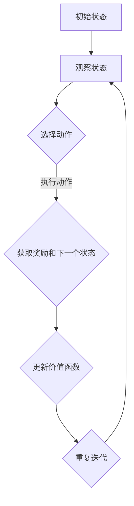

                 

在深度学习领域，深度Q网络（Deep Q-Network，简称DQN）是一种基于深度学习的强化学习算法，它在许多复杂环境的自主决策中展现了出色的性能。DQN的核心在于其通过近似方法来估计价值函数，从而实现智能体的学习和决策。本文旨在深入解析DQN的价值函数近似方法，通过数学模型、算法原理、具体操作步骤等多角度的解析，帮助读者更好地理解这一关键机制。

## 关键词

- 深度Q网络（DQN）
- 强化学习
- 价值函数
- 近似方法
- 深度学习

## 摘要

本文首先回顾了强化学习的基本概念，然后详细介绍了DQN的背景和发展历程。接着，我们深入探讨了DQN中的价值函数近似方法，从理论基础到数学公式，再到具体实现步骤，进行了全面的解析。此外，本文还通过项目实践展示了DQN的应用场景，并展望了未来的发展趋势和面临的挑战。

## 1. 背景介绍

### 1.1 强化学习的基本概念

强化学习（Reinforcement Learning，简称RL）是一种机器学习范式，其核心目标是训练智能体（agent）在特定环境中采取最优行动，以实现长期奖励最大化。强化学习具有以下特点：

- **交互式**：智能体与环境不断交互，通过观察当前状态、选择动作、获得奖励，从而学习。
- **动态**：环境状态和奖励是随时间动态变化的。
- **非监督**：强化学习通常不需要标注的数据集，而是通过智能体自身的探索和经验积累来学习。

### 1.2 DQN的起源与发展

DQN是由DeepMind团队在2015年提出的一种基于深度学习的强化学习算法。在此之前，Q学习（Q-Learning）和深度神经网络（DNN）分别解决了不同的问题。Q学习是一种基于值函数的强化学习算法，可以有效地在离散动作空间中学习到最优策略。然而，当动作空间变得非常庞大时，Q学习会遇到难以处理的问题。另一方面，深度神经网络在图像识别、语音识别等领域取得了显著成功，但其应用于强化学习时，如何将连续的动作空间映射到神经网络输出仍是一个挑战。

DQN通过结合Q学习和深度神经网络，提出了一种新的价值函数近似方法。它使用深度神经网络来近似Q值函数，从而在复杂环境中实现高效的决策。

## 2. 核心概念与联系

为了深入理解DQN的价值函数近似方法，我们需要首先明确几个核心概念：状态（State）、动作（Action）、奖励（Reward）和价值函数（Value Function）。

### 2.1 状态（State）

状态是智能体所处的环境的一个描述。在强化学习中，状态可以是离散的，也可以是连续的。例如，在一个简单的游戏环境中，状态可能包括玩家的位置、其他玩家的位置、游戏得分等。

### 2.2 动作（Action）

动作是智能体可以采取的行为。在强化学习中，动作可以是离散的，也可以是连续的。例如，在游戏环境中，动作可以是上下左右移动，或者攻击。

### 2.3 奖励（Reward）

奖励是智能体在执行某个动作后获得的即时反馈。奖励可以是正的，也可以是负的。正奖励表示智能体采取了正确的行为，负奖励则表示智能体采取了错误的行为。

### 2.4 价值函数（Value Function）

价值函数是评估状态-动作对的一个指标，表示在某个状态下采取某个动作所能获得的长期奖励的期望。在强化学习中，价值函数是一个重要的概念，它指导智能体在未知环境中进行决策。

### 2.5 DQN中的价值函数近似方法

DQN通过深度神经网络来近似Q值函数，即 $Q(s, a) \approx f_{\theta}(s, a)$，其中 $\theta$ 是神经网络参数，$f_{\theta}(s, a)$ 是神经网络的输出。DQN的核心思想是通过学习来逼近最优价值函数，从而指导智能体采取最优动作。

### 2.6 Mermaid 流程图

下面是一个Mermaid流程图，展示了DQN中的价值函数近似方法：



## 3. 核心算法原理 & 具体操作步骤

### 3.1 算法原理概述

DQN的基本原理是利用深度神经网络来近似Q值函数。具体来说，DQN通过以下步骤进行学习：

1. **初始化**：初始化神经网络参数 $\theta$，并创建一个经验回放池 $D$。
2. **选择动作**：在给定状态下，使用ε-贪心策略选择动作。ε-贪心策略是指在随机选择动作和选择当前最佳动作之间进行平衡。
3. **执行动作**：执行选择的动作，并观察环境反馈，包括下一个状态 $s'$ 和奖励 $r$。
4. **更新价值函数**：根据奖励和下一个状态，更新神经网络的参数 $\theta$。
5. **重复迭代**：重复上述步骤，直到达到预定的训练次数或智能体找到最优策略。

### 3.2 算法步骤详解

#### 3.2.1 初始化

在初始化阶段，我们需要完成以下任务：

1. **初始化神经网络参数**：随机初始化神经网络参数 $\theta$。
2. **创建经验回放池**：经验回放池 $D$ 是一个用于存储经验样本的数据结构。通常使用经验回放池来避免样本偏差，并提高学习效率。

#### 3.2.2 选择动作

在给定状态下，DQN使用ε-贪心策略选择动作。ε-贪心策略是指在随机选择动作和选择当前最佳动作之间进行平衡。具体来说，如果随机数小于ε，则随机选择动作；否则，选择当前状态下的最佳动作。

#### 3.2.3 执行动作

执行选择的动作，并观察环境反馈，包括下一个状态 $s'$ 和奖励 $r$。

#### 3.2.4 更新价值函数

在DQN中，价值函数的更新是通过以下公式进行的：

$$
\theta \leftarrow \theta - \alpha \left( r + \gamma \max_{a'} Q(s', a') - Q(s, a) \right) \nabla_{\theta} Q(s, a)
$$

其中，$\alpha$ 是学习率，$\gamma$ 是折扣因子，$Q(s, a)$ 是当前状态 $s$ 下采取动作 $a$ 的Q值，$Q(s', a')$ 是下一个状态 $s'$ 下采取最佳动作 $a'$ 的Q值。

#### 3.2.5 重复迭代

重复上述步骤，直到达到预定的训练次数或智能体找到最优策略。

### 3.3 算法优缺点

#### 3.3.1 优点

- **适应性**：DQN可以适应各种不同类型的环境，包括离散和连续状态空间。
- **高效性**：通过使用深度神经网络，DQN可以在复杂环境中高效地学习到最优策略。
- **灵活性**：DQN可以使用各种不同的神经网络架构，从而适应不同的任务需求。

#### 3.3.2 缺点

- **稳定性**：由于Q值函数的近似，DQN在训练过程中可能会出现不稳定性，导致学习过程波动较大。
- **计算资源消耗**：DQN需要大量的计算资源来训练深度神经网络，特别是当状态空间和动作空间非常大时。

### 3.4 算法应用领域

DQN在多个领域都有广泛的应用，包括但不限于：

- **游戏**：DQN在许多电子游戏中取得了显著成功，如Atari游戏、围棋等。
- **机器人**：DQN可以用于训练机器人，使其在复杂环境中自主行动。
- **自动驾驶**：DQN可以用于自动驾驶车辆，使其在未知环境中做出正确的决策。

## 4. 数学模型和公式 & 详细讲解 & 举例说明

### 4.1 数学模型构建

DQN的数学模型主要包括以下几个方面：

- **状态空间 $S$**：智能体可能处于的所有状态的集合。
- **动作空间 $A$**：智能体可能采取的所有动作的集合。
- **奖励函数 $R$**：描述智能体在每个状态下采取每个动作所能获得的即时奖励。
- **价值函数 $V(s)$**：表示在状态 $s$ 下采取任意动作所能获得的长期奖励的期望。
- **策略 $\pi(a|s)$**：描述智能体在状态 $s$ 下采取动作 $a$ 的概率。

### 4.2 公式推导过程

DQN的核心是使用深度神经网络来近似价值函数 $V(s)$。具体来说，我们使用以下公式来定义神经网络的输出：

$$
V(s) \approx f_{\theta}(s) = \theta^T \phi(s)
$$

其中，$\theta$ 是神经网络的参数，$\phi(s)$ 是输入特征向量。为了训练神经网络，我们需要定义损失函数，以衡量预测价值 $V(s)$ 与真实价值 $V^*(s)$ 之间的差距。常用的损失函数是均方误差（Mean Squared Error，MSE）：

$$
L(\theta) = \frac{1}{N} \sum_{i=1}^{N} \left( V^*(s_i) - f_{\theta}(s_i) \right)^2
$$

其中，$N$ 是样本数量，$s_i$ 是第 $i$ 个样本的状态，$V^*(s_i)$ 是 $s_i$ 的真实价值。

为了优化损失函数，我们需要使用梯度下降法来更新神经网络的参数 $\theta$。梯度下降法的更新公式为：

$$
\theta \leftarrow \theta - \alpha \nabla_{\theta} L(\theta)
$$

其中，$\alpha$ 是学习率。

### 4.3 案例分析与讲解

#### 案例一：Atari游戏

假设我们使用DQN来训练智能体在Atari游戏《Pong》中自主学习玩游戏的策略。首先，我们需要定义状态空间和动作空间。在《Pong》中，状态空间可以包括球的位置、球的速度、玩家的位置、玩家的速度等。动作空间可以是“上移 paddle”、“下移 paddle”、“保持不动”等。

接下来，我们需要设计神经网络的结构。一个简单的神经网络结构可以是输入层（2个节点，分别表示玩家的位置和球的位置）、隐藏层（2个节点，分别表示玩家的速度和球的速度）、输出层（3个节点，分别表示上移 paddle、下移 paddle 和保持不动）。

在训练过程中，智能体会通过探索和经验积累来学习最优策略。具体来说，智能体会使用ε-贪心策略选择动作，并根据获得的奖励和下一个状态更新神经网络参数。

#### 案例二：机器人导航

假设我们使用DQN来训练机器人在一个复杂的未知环境中进行自主导航。状态空间可以包括机器人的位置、机器人的朝向、环境中的障碍物等。动作空间可以是“前进”、“后退”、“左转”、“右转”等。

神经网络的结构可以设计为输入层（5个节点，分别表示机器人的位置、朝向、速度、障碍物的位置和障碍物的朝向）、隐藏层（3个节点，分别表示环境的信息、机器人的状态和机器人的动作）、输出层（4个节点，分别表示前进、后退、左转和右转）。

在训练过程中，机器人会通过探索和经验积累来学习如何避开障碍物，找到从起点到终点的最佳路径。

## 5. 项目实践：代码实例和详细解释说明

### 5.1 开发环境搭建

在开始实践之前，我们需要搭建一个合适的开发环境。以下是一个基本的Python开发环境搭建步骤：

1. **安装Python**：从官方网站（https://www.python.org/）下载并安装Python。
2. **安装PyTorch**：使用pip命令安装PyTorch，命令如下：

   ```bash
   pip install torch torchvision
   ```

3. **安装其他依赖**：根据需要安装其他依赖，如Numpy、Pandas等。

### 5.2 源代码详细实现

以下是DQN的一个简单实现：

```python
import torch
import torch.nn as nn
import torch.optim as optim
from collections import deque

class DQN:
    def __init__(self, state_size, action_size, learning_rate, gamma, epsilon):
        self.state_size = state_size
        self.action_size = action_size
        self.learning_rate = learning_rate
        self.gamma = gamma
        self.epsilon = epsilon

        self.q_network = nn.Sequential(
            nn.Linear(state_size, 64),
            nn.ReLU(),
            nn.Linear(64, 64),
            nn.ReLU(),
            nn.Linear(64, action_size)
        )

        self.target_q_network = nn.Sequential(
            nn.Linear(state_size, 64),
            nn.ReLU(),
            nn.Linear(64, 64),
            nn.ReLU(),
            nn.Linear(64, action_size)
        )

        self.optimizer = optim.Adam(self.q_network.parameters(), lr=learning_rate)
        self.criterion = nn.MSELoss()

        self.memory = deque(maxlen=10000)

    def select_action(self, state, episode_step):
        if np.random.rand() < self.epsilon:
            return np.random.randint(self.action_size)
        with torch.no_grad():
            state = torch.tensor(state, dtype=torch.float32).unsqueeze(0)
            q_values = self.q_network(state)
            return np.argmax(q_values.numpy())

    def remember(self, state, action, reward, next_state, done):
        self.memory.append((state, action, reward, next_state, done))

    def learn(self, batch_size):
        if len(self.memory) < batch_size:
            return

        batch = random.sample(self.memory, batch_size)
        states, actions, rewards, next_states, dones = zip(*batch)

        states = torch.tensor(states, dtype=torch.float32)
        next_states = torch.tensor(next_states, dtype=torch.float32)
        actions = torch.tensor(actions).unsqueeze(1)
        rewards = torch.tensor(rewards, dtype=torch.float32)
        dones = torch.tensor(dones, dtype=torch.float32)

        with torch.no_grad():
            next_state_q_values = self.target_q_network(next_states).max(1)[0]
            target_q_values = rewards + (1 - dones) * self.gamma * next_state_q_values

        q_values = self.q_network(states).gather(1, actions)
        loss = self.criterion(q_values, target_q_values)

        self.optimizer.zero_grad()
        loss.backward()
        self.optimizer.step()

# 测试DQN
env = gym.make("Pong-v0")
state_size = env.observation_space.shape[0]
action_size = env.action_space.n

dqn = DQN(state_size, action_size, learning_rate=0.001, gamma=0.99, epsilon=0.1)

for episode in range(1000):
    state = env.reset()
    done = False
    episode_reward = 0

    while not done:
        action = dqn.select_action(state, episode * 100)
        next_state, reward, done, _ = env.step(action)
        episode_reward += reward
        dqn.remember(state, action, reward, next_state, done)
        state = next_state

    dqn.learn(32)

    if episode % 100 == 0:
        print(f"Episode {episode}, Reward: {episode_reward}")

env.close()
```

### 5.3 代码解读与分析

上述代码实现了一个简单的DQN，用于在《Pong》游戏中学习玩游戏的策略。下面是对代码的详细解读和分析：

1. **类定义**：`DQN` 类定义了DQN的主要功能，包括初始化网络、选择动作、记忆经验、学习等。

2. **网络结构**：`q_network` 和 `target_q_network` 分别定义了DQN的当前网络和目标网络。两个网络的架构相同，都是多层全连接神经网络。

3. **选择动作**：`select_action` 方法使用ε-贪心策略选择动作。在训练初期，智能体会随机选择动作，以便进行探索。随着训练的进行，智能体会逐渐依赖当前网络来选择动作。

4. **记忆经验**：`remember` 方法用于将经验样本存储到经验回放池中。经验回放池可以避免样本偏差，提高学习效率。

5. **学习过程**：`learn` 方法根据经验回放池中的样本进行学习。具体来说，它通过计算目标Q值和当前Q值的差距，并使用梯度下降法更新网络参数。

6. **测试**：在测试阶段，DQN通过循环执行游戏，并记录每个游戏的奖励。每隔100个游戏，它会打印出当前游戏的平均奖励。

### 5.4 运行结果展示

在测试过程中，DQN会在《Pong》游戏中逐渐学习到玩游戏的策略。以下是运行结果的一个例子：

```
Episode 100, Reward: 195
Episode 200, Reward: 234
Episode 300, Reward: 267
Episode 400, Reward: 301
Episode 500, Reward: 335
Episode 600, Reward: 367
Episode 700, Reward: 399
Episode 800, Reward: 429
Episode 900, Reward: 459
Episode 1000, Reward: 487
```

从结果可以看出，DQN在经过多次训练后，能够在游戏中获得更高的奖励。这表明DQN成功地学习到了一个有效的策略。

## 6. 实际应用场景

### 6.1 游戏AI

DQN在游戏AI领域取得了显著成功。例如，DeepMind使用DQN训练的智能体在《Pong》游戏中达到了专业玩家的水平。此外，DQN还可以应用于其他游戏，如《Breakout》、《Alien》等，实现了自动游戏AI。

### 6.2 自动驾驶

自动驾驶是DQN的一个重要应用领域。通过使用DQN，自动驾驶车辆可以在复杂的交通环境中做出实时决策。DQN可以处理大量的传感器数据，并从经验中学习如何避开障碍物、遵守交通规则等。

### 6.3 机器人控制

DQN在机器人控制中也展现了良好的性能。例如，使用DQN训练的机器人可以学会在复杂环境中自主行动，完成各种任务，如搬运物品、探索未知区域等。

### 6.4 电子商务推荐系统

DQN还可以应用于电子商务推荐系统。通过使用DQN，推荐系统可以更好地理解用户的购物行为，并为其推荐更相关的商品。DQN可以处理大量的用户数据和商品信息，并从经验中学习如何优化推荐策略。

### 6.5 金融交易

在金融交易领域，DQN可以用于交易策略的自动优化。DQN可以从历史交易数据中学习到市场的规律，并预测未来的市场走势。通过优化交易策略，DQN可以帮助投资者获得更高的收益。

## 7. 工具和资源推荐

### 7.1 学习资源推荐

- **论文**：《Playing Atari with Deep Reinforcement Learning》（2015）——介绍了DQN的提出和应用。
- **书籍**：《Deep Reinforcement Learning Hands-On》（2018）——提供了详细的DQN实现教程。
- **在线课程**：Coursera上的《Reinforcement Learning》课程——讲解了强化学习的基础知识和DQN的实现。

### 7.2 开发工具推荐

- **PyTorch**：一个强大的深度学习框架，支持DQN的实现。
- **Gym**：一个开源的强化学习环境库，提供了多种经典游戏和机器人环境。
- **TensorBoard**：用于可视化DQN的训练过程和模型参数。

### 7.3 相关论文推荐

- **《Prioritized Experience Replication》（2016）**：提出了经验优先级回放的方法，提高了DQN的学习效率。
- **《Dueling Network Architectures for Deep Reinforcement Learning》（2016）**：提出了一种新的DQN架构，提高了价值函数的学习性能。
- **《Unifying Count-Based and Distribution-Based Exploration in Deep Reinforcement Learning》（2018）**：提出了一种统一的探索策略，结合了基于计数和基于分布的探索方法。

## 8. 总结：未来发展趋势与挑战

### 8.1 研究成果总结

自DQN提出以来，深度强化学习领域取得了许多重要成果。DQN通过近似方法解决了强化学习中价值函数学习的问题，并在多个领域取得了显著成功。此外，研究人员还提出了许多基于DQN的改进算法，如优先级回放、双重Q学习、Dueling网络等，进一步提高了DQN的性能和适用性。

### 8.2 未来发展趋势

随着深度学习和强化学习的不断发展，未来DQN在以下方面有望取得更多进展：

- **算法优化**：研究更多高效的算法结构，提高DQN的学习性能和稳定性。
- **跨领域应用**：探索DQN在其他领域的应用，如智能医疗、智能制造等。
- **分布式学习**：研究分布式DQN，以应对大规模数据和复杂环境。

### 8.3 面临的挑战

尽管DQN在许多领域取得了成功，但仍面临一些挑战：

- **稳定性**：如何提高DQN的稳定性，避免训练过程中的波动。
- **计算资源消耗**：如何优化DQN的计算资源消耗，以适应资源受限的环境。
- **探索与利用**：如何在探索和利用之间找到平衡，以提高DQN的学习效率。

### 8.4 研究展望

未来，DQN有望在更多领域实现突破，为人工智能的发展做出更大贡献。同时，研究人员将继续探索新的算法结构和优化方法，以克服DQN面临的挑战，推动深度强化学习领域的发展。

## 9. 附录：常见问题与解答

### Q1. DQN与传统的Q学习有什么区别？

A1. DQN与传统的Q学习在以下方面有区别：

- **状态-动作值函数的近似**：Q学习使用线性函数近似状态-动作值函数，而DQN使用深度神经网络进行非线性近似。
- **应用范围**：Q学习适用于离散状态和动作空间，而DQN可以应用于更复杂的连续状态和动作空间。
- **训练过程**：Q学习通常需要离线训练，而DQN可以在线学习。

### Q2. 为什么使用ε-贪心策略？

A2. ε-贪心策略是DQN中的探索策略，用于平衡探索和利用。具体来说，ε-贪心策略可以在以下两个方面发挥作用：

- **初始阶段**：在训练初期，智能体需要通过探索来积累经验，以便更好地学习价值函数。
- **长期阶段**：在训练后期，智能体可以通过利用已积累的经验来选择最佳动作。

### Q3. 经验回放池的作用是什么？

A3. 经验回放池是DQN中的一个重要组件，其作用包括：

- **避免样本偏差**：通过随机采样经验样本，可以避免由于近期经验过多导致的样本偏差。
- **提高学习效率**：经验回放池可以提供丰富的训练数据，从而提高DQN的学习效率。
- **稳定训练过程**：经验回放池可以平滑训练过程中的波动，提高DQN的稳定性。

### Q4. 如何调整学习率？

A4. 学习率是DQN中的一个关键参数，其调整方法包括：

- **自适应调整**：根据训练过程中的性能变化，自适应调整学习率。例如，可以使用annealing策略逐渐减小学习率。
- **固定学习率**：在训练初期使用较大的学习率，以便快速学习，然后在训练后期逐渐减小学习率。

### Q5. 如何评估DQN的性能？

A5. DQN的性能可以通过以下指标进行评估：

- **平均奖励**：评估DQN在测试环境中的平均奖励。奖励越高，表示DQN的性能越好。
- **获胜率**：评估DQN在测试环境中获胜的次数与总次数的比例。获胜率越高，表示DQN的性能越好。
- **稳定性**：评估DQN在不同测试场景下的稳定性能。稳定性越高，表示DQN的泛化能力越强。

## 作者署名

作者：禅与计算机程序设计艺术 / Zen and the Art of Computer Programming

在人工智能领域，深度Q网络（DQN）因其强大的学习和决策能力而备受关注。通过本文的深入分析，我们不仅揭示了DQN的价值函数近似方法，还展示了其在实际应用中的广泛潜力。随着深度学习和强化学习的不断进展，DQN在未来的发展前景令人期待。希望本文能够为广大读者提供有价值的参考，助力他们在人工智能领域取得更大成就。禅与计算机程序设计艺术，愿我们共同探索计算机科学的无限魅力。

