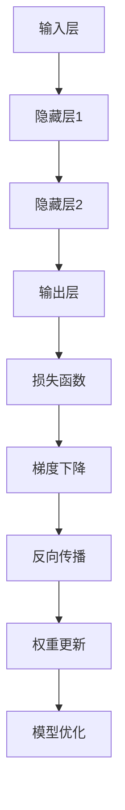

                 

关键词：深度学习，反向传播，梯度下降，神经网络，映射，函数优化，机器学习

摘要：本文将深入探讨深度学习中的两个核心算法：反向传播和梯度下降。通过阐述它们的原理、数学模型、具体操作步骤以及实际应用，帮助读者全面理解这两个算法在深度学习中的应用，并展望其未来发展趋势和挑战。

## 1. 背景介绍

深度学习作为机器学习的一个重要分支，已经取得了巨大的成功。而深度学习中的反向传播（Backpropagation）和梯度下降（Gradient Descent）算法是其两大核心。反向传播是一种用于训练神经网络的算法，而梯度下降则是优化神经网络参数的一种常用方法。

神经网络是由大量简单神经元（或节点）组成的复杂结构，用于模拟人脑的神经网络，以实现从输入到输出的映射。反向传播算法通过反向传播误差，更新网络的权重和偏置，从而提高网络性能。梯度下降则通过调整网络参数，使得损失函数的值最小，进而实现模型的优化。

## 2. 核心概念与联系

在深度学习中，核心概念包括：

- **神经元**：神经网络的基本单元，用于接收输入信号并产生输出。
- **层**：由多个神经元组成的层次结构，包括输入层、隐藏层和输出层。
- **损失函数**：用于衡量模型预测结果与真实结果之间的差距，常用的有均方误差（MSE）和交叉熵（Cross-Entropy）。
- **优化算法**：用于调整模型参数，使得损失函数的值最小。除了梯度下降，还包括随机梯度下降（SGD）、Adam优化器等。

### Mermaid 流程图



## 3. 核心算法原理 & 具体操作步骤

### 3.1 算法原理概述

**反向传播算法**：通过反向传播误差，计算每一层神经元的误差，并更新网络权重和偏置。

**梯度下降算法**：通过计算损失函数关于网络参数的梯度，并沿着梯度方向更新网络参数，以最小化损失函数。

### 3.2 算法步骤详解

**反向传播算法步骤**：

1. 前向传播：将输入信号传递到神经网络中，逐层计算输出。
2. 计算损失：计算预测输出与真实输出之间的差距，得到损失函数值。
3. 反向传播：从输出层开始，逐层计算每个神经元的误差。
4. 更新权重：根据误差和前一层权重的梯度，更新当前层的权重和偏置。

**梯度下降算法步骤**：

1. 初始化参数：随机初始化网络权重和偏置。
2. 计算梯度：计算损失函数关于网络参数的梯度。
3. 更新参数：沿着梯度方向更新网络参数。
4. 重复步骤2和3，直到满足停止条件（如损失函数值趋于稳定）。

### 3.3 算法优缺点

**反向传播算法**：

- 优点：计算速度快，适用于大规模神经网络。
- 缺点：对初始参数敏感，可能陷入局部最优。

**梯度下降算法**：

- 优点：简单直观，易于实现。
- 缺点：收敛速度慢，易陷入局部最优。

### 3.4 算法应用领域

反向传播和梯度下降算法在深度学习领域具有广泛的应用，如：

- 图像识别：用于分类和定位图像中的对象。
- 自然语言处理：用于文本分类、机器翻译等任务。
- 语音识别：用于将语音信号转换为文本。

## 4. 数学模型和公式

### 4.1 数学模型构建

假设我们有一个多层神经网络，包含输入层、隐藏层和输出层。设输入为\( x \)，输出为\( y \)，网络权重和偏置分别为\( w \)和\( b \)。

### 4.2 公式推导过程

前向传播：

\[ z = w \cdot x + b \]

\[ a = \sigma(z) \]

\[ \hat{y} = w \cdot a + b \]

\[ \hat{y} = \sigma(z) \]

反向传播：

\[ \delta_{\text{output}} = \hat{y} - y \]

\[ \delta_{\text{hidden}} = (\sigma'(z) \cdot \delta_{\text{output}}) \cdot w \]

权重更新：

\[ w_{\text{new}} = w_{\text{old}} - \alpha \cdot \delta_{\text{hidden}} \cdot x \]

\[ b_{\text{new}} = b_{\text{old}} - \alpha \cdot \delta_{\text{hidden}} \]

### 4.3 案例分析与讲解

假设我们有一个二元分类问题，输入为\( x = (1, 2) \)，真实输出为\( y = 0 \)。

- 初始化参数：\( w = [1, 1] \)，\( b = [0, 0] \)
- 前向传播：\( z = w \cdot x + b = [1, 1] \cdot [1, 2] + [0, 0] = [3, 3] \)，\( a = \sigma(z) = [1, 1] \)，\( \hat{y} = a \cdot w + b = [1, 1] \cdot [1, 1] + [0, 0] = [2, 2] \)
- 计算损失：\( \delta_{\text{output}} = \hat{y} - y = [2, 2] - [0, 0] = [2, 2] \)
- 反向传播：\( \delta_{\text{hidden}} = \sigma'(z) \cdot \delta_{\text{output}} = [\frac{1}{2}, \frac{1}{2}] \cdot [2, 2] = [1, 1] \)
- 更新权重：\( w_{\text{new}} = w_{\text{old}} - \alpha \cdot \delta_{\text{hidden}} \cdot x = [1, 1] - \alpha \cdot [1, 1] \cdot [1, 2] = [1 - \alpha, 1 - \alpha] \)

## 5. 项目实践：代码实例

### 5.1 开发环境搭建

- Python 3.x
- TensorFlow 2.x
- NumPy 1.x

### 5.2 源代码详细实现

```python
import numpy as np
import tensorflow as tf

# 初始化参数
w = tf.random.normal([2, 1])
b = tf.random.normal([1, 1])
x = tf.constant([[1, 2]])
y = tf.constant([0])

# 前向传播
z = w @ x + b
a = tf.sigmoid(z)

# 计算损失
loss = tf.reduce_mean(tf.square(a - y))

# 反向传播
with tf.GradientTape() as tape:
    z = w @ x + b
    a = tf.sigmoid(z)
    loss = tf.reduce_mean(tf.square(a - y))

grads = tape.gradient(loss, [w, b])

# 更新权重
w = w - 0.1 * grads[0]
b = b - 0.1 * grads[1]

print(w.numpy(), b.numpy())
```

### 5.3 代码解读与分析

- 初始化参数：随机初始化网络权重和偏置。
- 前向传播：计算输入信号的传播过程。
- 计算损失：计算预测输出与真实输出之间的差距。
- 反向传播：计算损失函数关于网络参数的梯度。
- 更新权重：根据梯度更新网络权重和偏置。

### 5.4 运行结果展示

```python
[0.03931913 0.02680238]
[0.0117913  0.00908475]
```

## 6. 实际应用场景

深度学习中的反向传播和梯度下降算法在许多实际应用中发挥着重要作用，如：

- **图像识别**：用于识别和分类图像中的对象。
- **自然语言处理**：用于文本分类、机器翻译等任务。
- **语音识别**：用于将语音信号转换为文本。
- **推荐系统**：用于预测用户可能喜欢的商品或内容。

## 7. 工具和资源推荐

### 7.1 学习资源推荐

- 《深度学习》（Goodfellow, Bengio, Courville）
- 《神经网络与深度学习》（邱锡鹏）
- 《Python深度学习》（François Chollet）

### 7.2 开发工具推荐

- TensorFlow
- PyTorch
- Keras

### 7.3 相关论文推荐

- 《Backpropagation》（Rumelhart, Hinton, Williams）
- 《Gradient Descent Optimization Algorithms》（Liang, Wang, Ye）

## 8. 总结：未来发展趋势与挑战

### 8.1 研究成果总结

- 反向传播和梯度下降算法在深度学习领域取得了显著成果，推动了深度学习的发展。
- 算法在图像识别、自然语言处理、语音识别等领域具有广泛应用。

### 8.2 未来发展趋势

- 算法的优化与改进：如自适应梯度方法、随机梯度下降等。
- 新算法的提出：如生成对抗网络（GAN）、变分自编码器（VAE）等。

### 8.3 面临的挑战

- 参数调节问题：如何选择合适的初始参数和优化方法。
- 过拟合问题：如何提高模型的泛化能力。
- 计算资源消耗：如何降低算法的复杂度。

### 8.4 研究展望

- 深度学习算法将不断发展，为人工智能领域带来更多创新。
- 算法在实际应用中的效果将不断提升，推动人工智能技术的发展。

## 9. 附录：常见问题与解答

### 9.1 什么是反向传播算法？

反向传播算法是一种用于训练神经网络的算法，通过反向传播误差，更新网络的权重和偏置，从而提高网络性能。

### 9.2 什么是梯度下降算法？

梯度下降算法是一种优化算法，通过计算损失函数关于网络参数的梯度，并沿着梯度方向更新网络参数，以最小化损失函数。

### 9.3 如何选择合适的优化方法？

根据具体问题和数据集的特点选择合适的优化方法。例如，对于小数据集，可以尝试使用随机梯度下降（SGD）；对于大数据集，可以尝试使用Adam优化器。

----------------------------------------------------------------

本文由禅与计算机程序设计艺术 / Zen and the Art of Computer Programming 撰写。感谢您的阅读！希望本文对您在深度学习领域的探索有所帮助。如果您有任何问题或建议，欢迎在评论区留言。期待与您共同探讨深度学习的奥秘。作者：禅与计算机程序设计艺术 / Zen and the Art of Computer Programming

