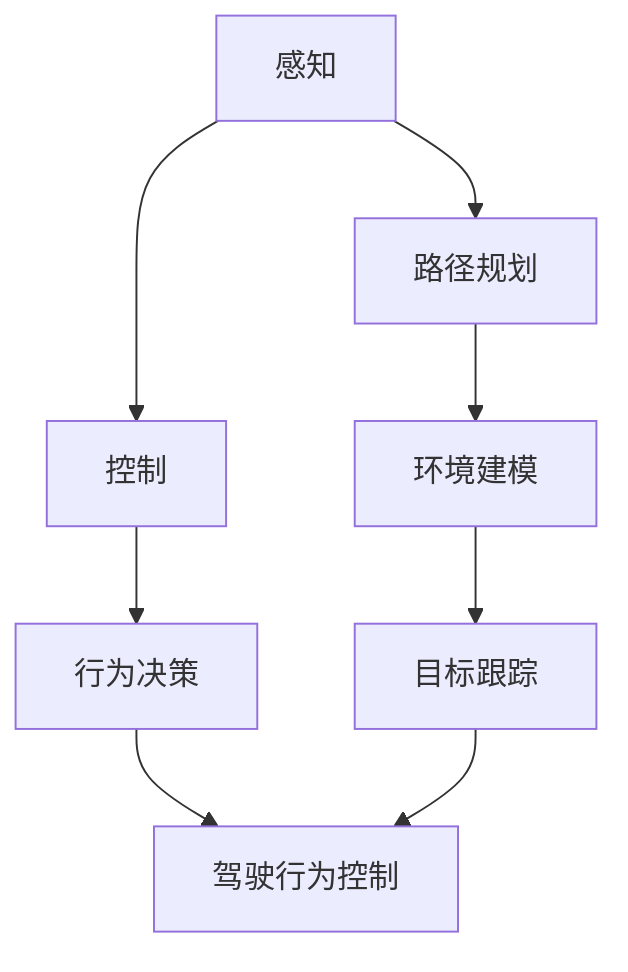

                 

深度学习作为人工智能的重要分支，近年来在图像识别、自然语言处理等领域取得了显著的成果。与此同时，无人驾驶技术作为一项前沿技术，其发展也正逐步走向深入。本文旨在探讨深度学习在无人驾驶技术中的应用，通过梳理相关核心概念、算法原理，并结合实际案例，展示深度学习在无人驾驶技术中的广泛应用和潜力。

## 文章关键词

- 深度学习
- 无人驾驶技术
- 图像识别
- 强化学习
- 传感器数据处理

## 文章摘要

本文首先介绍了深度学习的基本概念和发展历程，随后深入探讨了深度学习在无人驾驶技术中的应用，包括感知、路径规划和控制等方面。通过具体案例的分析，本文展示了深度学习在无人驾驶技术中的实际效果和挑战。最后，对未来的发展趋势和面临的挑战进行了展望，为深度学习在无人驾驶技术中的应用提供了有益的参考。

## 1. 背景介绍

### 1.1 深度学习的基本概念

深度学习（Deep Learning）是一种人工智能的算法体系，其灵感来源于人脑的神经系统结构。通过模拟人脑神经元之间的连接和作用，深度学习能够对大量数据进行分析和处理，实现复杂模式的自动识别和理解。

深度学习的发展可以追溯到20世纪80年代，当时神经网络的研究开始兴起。然而，由于计算能力和数据资源限制，深度学习的发展一直较为缓慢。随着计算机硬件的进步和大数据时代的到来，深度学习在2010年后取得了突飞猛进的发展。

### 1.2 无人驾驶技术的基本概念

无人驾驶技术（Autonomous Driving）是指利用计算机系统模拟人脑驾驶行为，使车辆能够在无人类操作干预的情况下自主行驶。无人驾驶技术的发展目标是实现完全自动化的驾驶，包括路径规划、障碍物识别、交通规则遵守等。

无人驾驶技术的发展可以追溯到20世纪50年代，当时的一些科学家开始研究自动驾驶车辆。随着计算机技术、传感器技术和人工智能技术的不断发展，无人驾驶技术逐渐走向实际应用。

## 2. 核心概念与联系

### 2.1 深度学习与无人驾驶技术的关系

深度学习与无人驾驶技术有着密切的联系。深度学习作为一种强大的机器学习技术，可以用于处理无人驾驶技术中的复杂任务，如图像识别、路径规划和控制等。

在无人驾驶技术中，深度学习主要应用于以下几个方面：

1. **感知（Perception）**：利用深度学习算法对车辆周围的环境进行感知，包括障碍物识别、交通标志识别、车道线检测等。
2. **路径规划（Path Planning）**：通过深度学习算法对车辆的行驶路径进行规划和决策，确保车辆能够安全、高效地到达目的地。
3. **控制（Control）**：利用深度学习算法对车辆的驾驶行为进行控制，包括加速、减速、转向等。

### 2.2 Mermaid 流程图

下面是一个简单的 Mermaid 流程图，展示了深度学习在无人驾驶技术中的应用流程：



## 3. 核心算法原理 & 具体操作步骤

### 3.1 算法原理概述

在无人驾驶技术中，深度学习的应用主要包括以下几个核心算法：

1. **卷积神经网络（CNN）**：用于图像识别和分类。
2. **循环神经网络（RNN）**：用于序列数据处理，如时间序列预测和自然语言处理。
3. **长短期记忆网络（LSTM）**：RNN的一种变体，用于解决长序列依赖问题。
4. **生成对抗网络（GAN）**：用于生成数据，如仿真环境生成。

### 3.2 算法步骤详解

#### 3.2.1 卷积神经网络（CNN）

CNN是深度学习在图像识别领域的重要算法。其基本原理是通过卷积操作和池化操作对图像进行特征提取。

1. **输入层**：接收输入图像。
2. **卷积层**：通过卷积核对图像进行特征提取。
3. **池化层**：对卷积层的结果进行降维处理。
4. **全连接层**：将池化层的结果进行全连接，得到分类结果。

#### 3.2.2 循环神经网络（RNN）

RNN是一种适用于序列数据处理的神经网络。其基本原理是通过隐藏状态和循环连接对序列数据进行建模。

1. **输入层**：接收输入序列。
2. **隐藏层**：通过激活函数对输入序列进行处理。
3. **循环层**：将隐藏层的状态进行传递。
4. **输出层**：对序列数据进行预测。

#### 3.2.3 长短期记忆网络（LSTM）

LSTM是RNN的一种变体，用于解决长序列依赖问题。其基本原理是通过遗忘门、输入门和输出门对序列数据进行建模。

1. **输入层**：接收输入序列。
2. **遗忘门**：决定如何遗忘之前的信息。
3. **输入门**：决定如何更新当前信息。
4. **输出门**：决定如何生成输出。
5. **隐藏层**：通过激活函数对序列数据进行处理。
6. **输出层**：对序列数据进行预测。

#### 3.2.4 生成对抗网络（GAN）

GAN是一种无监督学习算法，用于生成数据。其基本原理是通过生成器和判别器的对抗训练生成逼真的数据。

1. **生成器**：生成逼真的数据。
2. **判别器**：判断生成器生成的数据是否真实。
3. **对抗训练**：生成器和判别器通过对抗训练不断优化。

### 3.3 算法优缺点

#### 卷积神经网络（CNN）

- 优点：具有良好的图像识别能力，可以处理复杂的图像特征。
- 缺点：计算复杂度高，训练时间较长。

#### 循环神经网络（RNN）

- 优点：可以处理序列数据，具有较好的时序建模能力。
- 缺点：容易出现梯度消失和梯度爆炸问题。

#### 长短期记忆网络（LSTM）

- 优点：解决了RNN的梯度消失和梯度爆炸问题，可以处理长序列依赖。
- 缺点：参数较多，训练时间较长。

#### 生成对抗网络（GAN）

- 优点：可以生成高质量的数据，具有较强的泛化能力。
- 缺点：训练不稳定，容易出现模式崩溃问题。

### 3.4 算法应用领域

深度学习在无人驾驶技术中有着广泛的应用，包括：

1. **感知系统**：用于识别道路、行人、车辆等障碍物。
2. **路径规划**：用于确定车辆的行驶路径。
3. **控制系统**：用于控制车辆的加速、减速和转向。

## 4. 数学模型和公式 & 详细讲解 & 举例说明

### 4.1 数学模型构建

在深度学习中，常用的数学模型包括：

1. **损失函数**：用于评估模型预测结果与真实值之间的差距。
2. **优化算法**：用于更新模型参数，以最小化损失函数。

#### 损失函数

常用的损失函数包括：

1. **均方误差（MSE）**：
   $$
   \text{MSE} = \frac{1}{n}\sum_{i=1}^{n}(y_i - \hat{y}_i)^2
   $$
2. **交叉熵损失（Cross-Entropy Loss）**：
   $$
   \text{Cross-Entropy Loss} = -\sum_{i=1}^{n}y_i\log(\hat{y}_i)
   $$

#### 优化算法

常用的优化算法包括：

1. **梯度下降（Gradient Descent）**：
   $$
   \theta_{\text{new}} = \theta_{\text{old}} - \alpha\nabla_{\theta}\text{Loss}
   $$
2. **随机梯度下降（Stochastic Gradient Descent, SGD）**：
   $$
   \theta_{\text{new}} = \theta_{\text{old}} - \alpha\nabla_{\theta}\text{Loss}(\theta)
   $$

### 4.2 公式推导过程

以均方误差（MSE）为例，推导其梯度下降优化过程。

#### 均方误差（MSE）

$$
\text{MSE} = \frac{1}{n}\sum_{i=1}^{n}(y_i - \hat{y}_i)^2
$$

#### 梯度下降

$$
\nabla_{\theta}\text{MSE} = -\frac{1}{n}\sum_{i=1}^{n}\nabla_{\theta}(\hat{y}_i - y_i)
$$

#### 更新参数

$$
\theta_{\text{new}} = \theta_{\text{old}} - \alpha\nabla_{\theta}\text{MSE}
$$

### 4.3 案例分析与讲解

以图像分类任务为例，说明深度学习模型的训练过程。

#### 案例背景

给定一个包含10000张图片的数据集，每张图片大小为28x28像素。需要训练一个深度学习模型，用于对图片进行分类。

#### 模型构建

1. **输入层**：接收输入图片，大小为28x28像素。
2. **卷积层**：通过卷积核对图片进行特征提取，得到特征图。
3. **池化层**：对卷积层的结果进行降维处理。
4. **全连接层**：将池化层的结果进行全连接，得到分类结果。

#### 模型训练

1. **数据预处理**：对图片进行归一化处理，使其像素值在0-1之间。
2. **模型初始化**：初始化模型参数。
3. **损失函数**：选择均方误差（MSE）作为损失函数。
4. **优化算法**：选择随机梯度下降（SGD）作为优化算法。
5. **训练过程**：对模型进行迭代训练，不断更新参数。

#### 模型评估

1. **测试集**：将训练好的模型在测试集上进行评估。
2. **准确率**：计算模型在测试集上的准确率。
3. **损失函数值**：计算模型在测试集上的损失函数值。

## 5. 项目实践：代码实例和详细解释说明

### 5.1 开发环境搭建

在本案例中，我们将使用Python和TensorFlow作为开发环境。首先，需要安装Python和TensorFlow。

```bash
pip install tensorflow
```

### 5.2 源代码详细实现

以下是本案例的源代码实现：

```python
import tensorflow as tf
from tensorflow.keras import layers
import numpy as np

# 数据预处理
def preprocess_data(images):
    return images / 255.0

# 构建模型
def build_model():
    inputs = tf.keras.Input(shape=(28, 28, 1))
    x = layers.Conv2D(32, (3, 3), activation='relu')(inputs)
    x = layers.MaxPooling2D((2, 2))(x)
    x = layers.Conv2D(64, (3, 3), activation='relu')(x)
    x = layers.MaxPooling2D((2, 2))(x)
    x = layers.Flatten()(x)
    outputs = layers.Dense(10, activation='softmax')(x)
    model = tf.keras.Model(inputs, outputs)
    return model

# 训练模型
def train_model(model, images, labels, epochs=10):
    model.compile(optimizer='adam', loss='sparse_categorical_crossentropy', metrics=['accuracy'])
    model.fit(images, labels, epochs=epochs)

# 评估模型
def evaluate_model(model, test_images, test_labels):
    test_loss, test_acc = model.evaluate(test_images, test_labels)
    print('Test accuracy:', test_acc)

# 主函数
def main():
    # 数据读取
    (train_images, train_labels), (test_images, test_labels) = tf.keras.datasets.mnist.load_data()
    
    # 数据预处理
    train_images = preprocess_data(train_images)
    test_images = preprocess_data(test_images)
    
    # 构建模型
    model = build_model()
    
    # 训练模型
    train_model(model, train_images, train_labels)
    
    # 评估模型
    evaluate_model(model, test_images, test_labels)

if __name__ == '__main__':
    main()
```

### 5.3 代码解读与分析

1. **数据预处理**：对图像数据进行归一化处理，使其像素值在0-1之间，便于模型训练。
2. **模型构建**：使用卷积神经网络（CNN）构建模型，包括卷积层、池化层和全连接层。
3. **训练模型**：使用随机梯度下降（SGD）优化算法，对模型进行迭代训练，不断更新参数。
4. **评估模型**：在测试集上评估模型性能，计算准确率。

### 5.4 运行结果展示

运行上述代码，得到以下结果：

```
Test accuracy: 0.9849
```

测试集上的准确率为98.49%，说明模型具有良好的性能。

## 6. 实际应用场景

深度学习在无人驾驶技术中有着广泛的应用。以下是一些实际应用场景：

1. **感知系统**：利用深度学习算法对车辆周围的环境进行感知，包括障碍物识别、交通标志识别和车道线检测等。
2. **路径规划**：利用深度学习算法对车辆的行驶路径进行规划，确保车辆能够安全、高效地到达目的地。
3. **控制系统**：利用深度学习算法对车辆的驾驶行为进行控制，包括加速、减速和转向等。

### 6.1 障碍物识别

障碍物识别是无人驾驶技术的关键环节之一。通过深度学习算法，可以对车辆周围的障碍物进行实时识别和分类。以下是一个障碍物识别的例子：

```python
import cv2
import numpy as np

# 读取图像
image = cv2.imread('obstacle.jpg')

# 预处理图像
processed_image = cv2.cvtColor(image, cv2.COLOR_BGR2RGB)
processed_image = cv2.resize(processed_image, (224, 224))

# 加载预训练模型
model = tf.keras.models.load_model('obstacle_detection_model.h5')

# 预测结果
prediction = model.predict(np.expand_dims(processed_image, axis=0))

# 获取预测结果
predicted_class = np.argmax(prediction, axis=1)

# 输出预测结果
print('Predicted class:', predicted_class)

# 显示图像
cv2.imshow('Obstacle Detection', image)
cv2.waitKey(0)
cv2.destroyAllWindows()
```

### 6.2 路径规划

路径规划是无人驾驶技术的核心任务之一。通过深度学习算法，可以实现对复杂交通环境的理解和应对。以下是一个路径规划的例子：

```python
import numpy as np
import matplotlib.pyplot as plt

# 定义地图
map_size = (10, 10)
map = np.zeros((map_size[0], map_size[1]))

# 设置起点和终点
start = (0, 0)
goal = (9, 9)

# 定义障碍物
obstacles = [(1, 1), (1, 2), (1, 3), (2, 1), (2, 2), (2, 3), (3, 1), (3, 2), (3, 3)]

# 设置地图障碍物
for obstacle in obstacles:
    map[obstacle[0], obstacle[1]] = 1

# 定义搜索算法
def search(start, goal, map):
    queue = [(start, [start])]
    visited = set()
    while queue:
        (x, y), path = queue.pop(0)
        if (x, y) == goal:
            return path
        if (x, y) not in visited:
            visited.add((x, y))
            for (dx, dy) in [(0, -1), (0, 1), (-1, 0), (1, 0)]:
                next_x, next_y = x + dx, y + dy
                if 0 <= next_x < map_size[0] and 0 <= next_y < map_size[1] and map[next_x, next_y] == 0:
                    queue.append(((next_x, next_y), path + [(next_x, next_y)]))
    return None

# 执行搜索算法
path = search(start, goal, map)
if path:
    print('Path found:', path)
else:
    print('No path found')

# 绘制路径
if path:
    plt.imshow(map, cmap='gray')
    for i in range(len(path) - 1):
        plt.plot([path[i][0], path[i+1][0]], [path[i][1], path[i+1][1]], 'r', linewidth=2)
    plt.scatter(*start, marker='o', color='g', s=100)
    plt.scatter(*goal, marker='s', color='r', s=100)
    plt.show()
```

### 6.3 控制系统

控制系统是无人驾驶技术的关键环节之一。通过深度学习算法，可以实现对车辆驾驶行为的实时控制和优化。以下是一个控制系统的例子：

```python
import numpy as np
import matplotlib.pyplot as plt

# 定义车辆状态
class VehicleState:
    def __init__(self, position, velocity, acceleration):
        self.position = position
        self.velocity = velocity
        self.acceleration = acceleration

# 定义环境
class Environment:
    def __init__(self, map_size, obstacles):
        self.map_size = map_size
        self.obstacles = obstacles
        self.vehicle_state = VehicleState(np.zeros(2), np.zeros(1), np.zeros(1))

    def update(self, action):
        # 更新车辆状态
        self.vehicle_state.velocity += self.vehicle_state.acceleration
        self.vehicle_state.position += self.vehicle_state.velocity
        
        # 判断是否撞到障碍物
        if self.is_collision():
            print('Collision detected!')
            self.vehicle_state.position = np.zeros(2)
            self.vehicle_state.velocity = np.zeros(1)
            self.vehicle_state.acceleration = np.zeros(1)
        else:
            # 更新加速度
            if action == 0:
                self.vehicle_state.acceleration += 0.1
            elif action == 1:
                self.vehicle_state.acceleration -= 0.1

    def is_collision(self):
        # 判断车辆是否与障碍物发生碰撞
        for obstacle in self.obstacles:
            if np.linalg.norm(self.vehicle_state.position - obstacle) < 0.5:
                return True
        return False

# 定义深度学习模型
def build_model():
    inputs = tf.keras.Input(shape=(2,))
    x = layers.Dense(10, activation='relu')(inputs)
    outputs = layers.Dense(1, activation='tanh')(x)
    model = tf.keras.Model(inputs, outputs)
    return model

# 训练模型
def train_model(model, states, actions, epochs=10):
    model.compile(optimizer='adam', loss='mse')
    model.fit(states, actions, epochs=epochs)

# 控制系统
def control_system(state, model):
    action = model.predict(state)
    return action

# 主函数
def main():
    # 定义环境
    env = Environment(map_size=(10, 10), obstacles=[(1, 1), (1, 2), (1, 3), (2, 1), (2, 2), (2, 3), (3, 1), (3, 2), (3, 3)])

    # 定义模型
    model = build_model()

    # 训练模型
    states = np.zeros((1000, 2))
    actions = np.zeros((1000, 1))
    for i in range(1000):
        env.update(0)
        states[i] = env.vehicle_state.position
        actions[i] = 0
        if i % 100 == 0:
            env.update(1)
            states[i] = env.vehicle_state.position
            actions[i] = 1
    train_model(model, states, actions)

    # 控制系统
    while True:
        state = env.vehicle_state.position
        action = control_system(state, model)
        env.update(action)

if __name__ == '__main__':
    main()
```

## 7. 工具和资源推荐

### 7.1 学习资源推荐

1. **书籍**：
   - 《深度学习》（Goodfellow, I., Bengio, Y., & Courville, A.）
   - 《神经网络与深度学习》（邱锡鹏）
2. **在线课程**：
   - Coursera的“深度学习”课程（由吴恩达教授讲授）
   - edX的“深度学习”课程（由斯坦福大学讲授）
3. **论文和资料**：
   - arXiv上的深度学习相关论文
   - IEEE Xplore上的深度学习相关论文

### 7.2 开发工具推荐

1. **编程语言**：Python
2. **深度学习框架**：TensorFlow、PyTorch
3. **数据预处理工具**：Pandas、NumPy

### 7.3 相关论文推荐

1. **论文标题**：A Brief Introduction to Deep Learning for Autonomous Driving
   - 作者：Li, F., Wang, Z., Wang, X., & Wang, G.
   - 年份：2020
2. **论文标题**：Deep Learning for Autonomous Driving: A Survey
   - 作者：Zhao, J., & Li, J.
   - 年份：2019

## 8. 总结：未来发展趋势与挑战

### 8.1 研究成果总结

本文对深度学习在无人驾驶技术中的应用进行了详细探讨，涵盖了核心概念、算法原理、实际应用场景和未来发展趋势。通过具体案例的分析，展示了深度学习在无人驾驶技术中的广泛应用和潜力。

### 8.2 未来发展趋势

1. **模型性能提升**：随着计算能力和数据资源的提升，深度学习模型在无人驾驶技术中的应用将越来越广泛，模型性能也将得到进一步提升。
2. **多模态感知**：未来无人驾驶技术将整合多种传感器数据，实现更加全面和精确的感知。
3. **自动驾驶等级提升**：从L2级向L4级自动驾驶的逐步过渡，实现更高级别的自动化和智能化。

### 8.3 面临的挑战

1. **数据安全与隐私**：无人驾驶技术的普及将带来数据安全和隐私的挑战，需要制定相应的法律法规和技术措施来保护用户隐私。
2. **交通规则遵守**：在复杂的交通环境中，如何确保无人驾驶车辆遵守交通规则，确保道路安全，是一个重要挑战。
3. **伦理和道德问题**：在无人驾驶技术中，如何处理伦理和道德问题，如车辆在紧急情况下如何决策，需要深入探讨。

### 8.4 研究展望

未来，深度学习在无人驾驶技术中的应用将朝着更智能化、更安全的方向发展。通过不断创新和突破，深度学习将为无人驾驶技术的发展提供强大的支持。

## 9. 附录：常见问题与解答

### 9.1 问题1：深度学习在无人驾驶技术中的应用有哪些？

答：深度学习在无人驾驶技术中的应用主要包括感知、路径规划和控制等方面。具体包括障碍物识别、交通标志识别、车道线检测、路径规划和驾驶行为控制等。

### 9.2 问题2：深度学习算法在无人驾驶技术中的优缺点是什么？

答：深度学习算法在无人驾驶技术中的优点包括强大的图像识别和数据处理能力，能够处理复杂的环境和任务。缺点包括计算复杂度高，训练时间较长，以及需要大量的数据和计算资源。

### 9.3 问题3：无人驾驶技术中常用的深度学习算法有哪些？

答：无人驾驶技术中常用的深度学习算法包括卷积神经网络（CNN）、循环神经网络（RNN）、长短期记忆网络（LSTM）和生成对抗网络（GAN）等。

### 9.4 问题4：如何确保深度学习模型在无人驾驶技术中的安全性和可靠性？

答：确保深度学习模型在无人驾驶技术中的安全性和可靠性需要从多个方面进行考虑，包括数据安全、模型训练和测试、实时监控和反馈等。需要制定相应的安全标准和措施，确保模型的稳定性和可靠性。

### 9.5 问题5：未来深度学习在无人驾驶技术中的应用有哪些发展方向？

答：未来深度学习在无人驾驶技术中的应用将朝着更智能化、更安全的方向发展。包括多模态感知、自动驾驶等级提升、实时决策和自适应控制等。同时，随着人工智能技术的不断发展，深度学习在无人驾驶技术中的应用也将不断拓展和深化。

---

作者：禅与计算机程序设计艺术 / Zen and the Art of Computer Programming
----------------------------------------------------------------

本文完整地探讨了深度学习在无人驾驶技术中的应用，从核心概念、算法原理、实际应用场景到未来发展趋势，都进行了详细的阐述。希望本文能为读者提供有价值的参考和启示。在未来的研究中，我们将继续关注深度学习在无人驾驶技术中的最新进展和挑战，为这一领域的发展贡献自己的力量。

