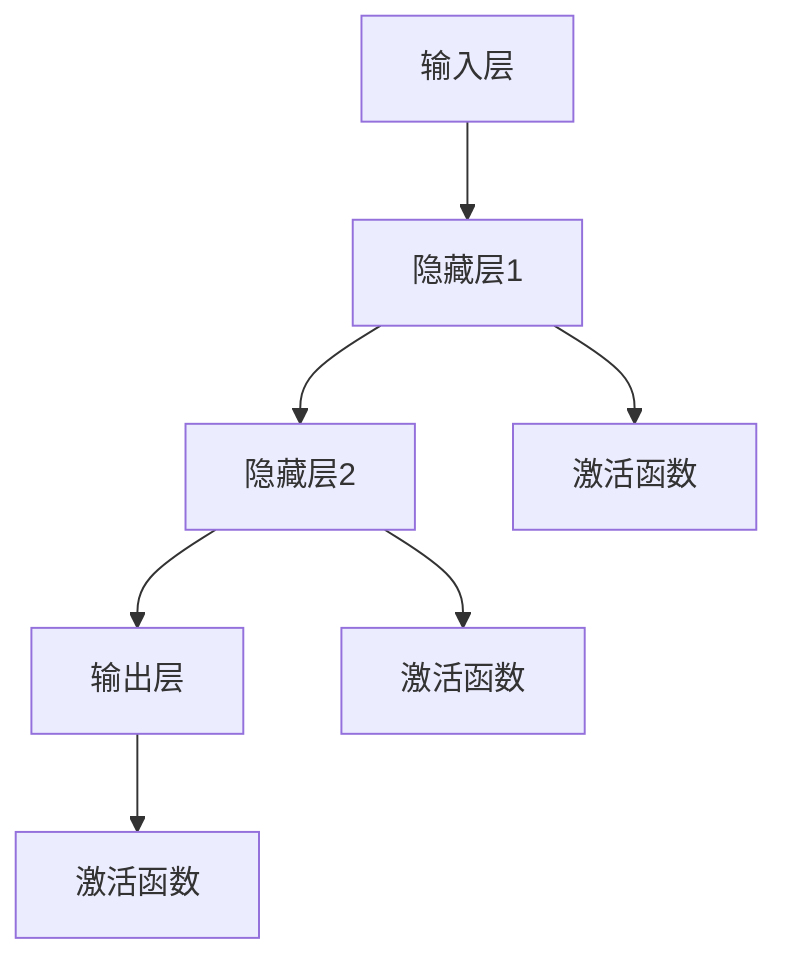
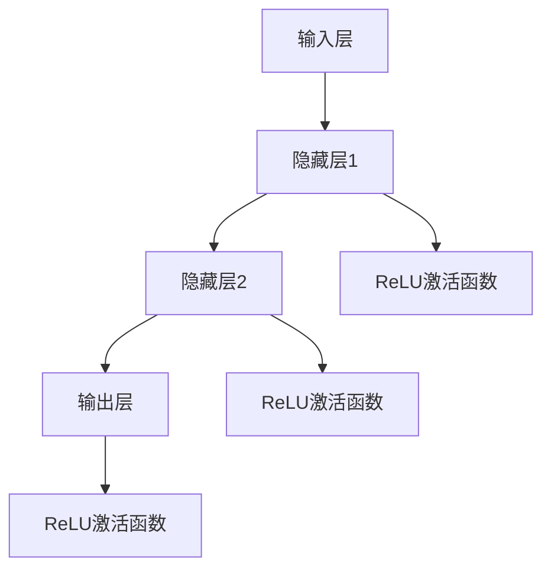

                 

关键词：神经网络，激活函数，深度学习，数学模型，算法应用，编程实践，技术展望

> 摘要：本文深入探讨了神经网络中的激活函数这一核心组件，从理论背景、算法原理、数学模型、具体应用等多个角度进行详细解析。通过剖析激活函数的不同类型及其在深度学习中的应用，本文旨在为读者提供对神经网络激活函数的全面理解和实践指导，以应对未来的技术挑战。

## 1. 背景介绍

随着人工智能技术的飞速发展，深度学习作为其核心组成部分，已广泛应用于图像识别、自然语言处理、推荐系统等多个领域。在深度学习中，神经网络是构建智能系统的基础，而激活函数则是神经网络中至关重要的一环。

### 1.1 深度学习的发展

深度学习起源于20世纪40年代，但直到2012年AlexNet在ImageNet竞赛中取得突破性成绩后，深度学习才开始崭露头角。随着硬件性能的提升和大数据的积累，深度学习在各个领域取得了显著的成果。

### 1.2 神经网络的基本结构

神经网络由大量简单的处理单元（神经元）组成，通过层层堆叠形成多层网络结构。每个神经元接收多个输入，并通过加权求和得到一个线性组合，最后通过激活函数进行非线性变换。

### 1.3 激活函数的作用

激活函数是神经网络中的关键组件，负责引入非线性特性，使得神经网络能够处理复杂的问题。不同的激活函数具有不同的特性，适用于不同的场景。

## 2. 核心概念与联系

在深入探讨激活函数之前，我们需要了解神经网络的基本架构和核心概念。以下是一个简化的神经网络架构图，并附有Mermaid流程图表示：



### 2.1 神经元

神经元是神经网络的基本构建块，其结构如图所示。每个神经元接收多个输入，通过加权求和得到一个线性组合。

### 2.2 激活函数

激活函数用于引入非线性特性，使得神经网络能够处理复杂的问题。常见的激活函数包括Sigmoid、ReLU、Tanh等。

### 2.3 非线性特性

非线性特性使得神经网络能够对复杂的数据进行建模和分类。没有非线性特性的神经网络将变成线性模型，无法处理非线性问题。

## 3. 核心算法原理 & 具体操作步骤

### 3.1 算法原理概述

激活函数的核心原理是通过非线性变换，将线性组合的输出映射到目标空间。这个过程可以用以下数学公式表示：

$$
f(z) = \sigma(z)
$$

其中，$z$ 是神经元的线性组合，$\sigma$ 是激活函数。

### 3.2 算法步骤详解

1. **输入层到隐藏层的传播**：

   神经元接收输入数据，通过加权求和得到线性组合，再通过激活函数进行非线性变换。

   $$
   z_i = \sum_{j=1}^{n} w_{ij} x_j + b_i
   $$

   $$
   a_i = \sigma(z_i)
   $$

2. **隐藏层到输出层的传播**：

   类似于输入层到隐藏层的传播，隐藏层神经元的输出作为输入传递到输出层。

   $$
   z_o = \sum_{i=1}^{m} w_{io} a_i + b_o
   $$

   $$
   y = \sigma(z_o)
   $$

### 3.3 算法优缺点

#### 优点：

1. 引入非线性特性，能够处理复杂问题。
2. 增强神经网络的表达能力。

#### 缺点：

1. 计算复杂度较高，影响训练速度。
2. 可能会导致梯度消失或梯度爆炸问题。

### 3.4 算法应用领域

激活函数广泛应用于图像识别、自然语言处理、语音识别等领域，如：

1. **图像识别**：卷积神经网络（CNN）中的卷积层和全连接层常使用ReLU作为激活函数。
2. **自然语言处理**：循环神经网络（RNN）和长短期记忆网络（LSTM）中使用ReLU或Tanh作为激活函数。
3. **语音识别**：自动语音识别系统（ASR）中，卷积神经网络和长短时记忆网络也常使用激活函数。

## 4. 数学模型和公式 & 详细讲解 & 举例说明

### 4.1 数学模型构建

神经网络中的激活函数可以表示为一个非线性函数，通常用 $\sigma$ 表示。以下是一些常见的激活函数及其数学模型：

1. **Sigmoid函数**：

   $$
   \sigma(z) = \frac{1}{1 + e^{-z}}
   $$

2. **ReLU函数**：

   $$
   \sigma(z) = \max(0, z)
   $$

3. **Tanh函数**：

   $$
   \sigma(z) = \tanh(z) = \frac{e^{2z} - 1}{e^{2z} + 1}
   $$

### 4.2 公式推导过程

以ReLU函数为例，推导其梯度表达式：

$$
\frac{\partial \sigma}{\partial z} = \frac{\partial}{\partial z} \max(0, z)
$$

对于 $z > 0$，梯度为1；对于 $z < 0$，梯度为0。

### 4.3 案例分析与讲解

以下是一个使用ReLU函数的神经网络模型，包含输入层、隐藏层和输出层。输入层接收3个输入，隐藏层有2个神经元，输出层有1个神经元。



假设输入数据为 $x_1 = 1, x_2 = 2, x_3 = 3$，隐藏层权重为 $w_{11} = 0.5, w_{12} = 0.5, w_{21} = 0.5, w_{22} = 0.5$，输出层权重为 $w_{1o} = 0.5, w_{2o} = 0.5$。

计算隐藏层输出：

$$
z_1 = 0.5 \cdot 1 + 0.5 \cdot 2 + 0.5 \cdot 3 = 3
$$

$$
z_2 = 0.5 \cdot 1 + 0.5 \cdot 2 + 0.5 \cdot 3 = 3
$$

应用ReLU函数：

$$
a_1 = \max(0, z_1) = 3
$$

$$
a_2 = \max(0, z_2) = 3
$$

计算输出层输出：

$$
z_o = 0.5 \cdot 3 + 0.5 \cdot 3 = 3
$$

$$
y = \max(0, z_o) = 3
$$

因此，最终输出为3。

## 5. 项目实践：代码实例和详细解释说明

### 5.1 开发环境搭建

为了演示激活函数在深度学习中的应用，我们将使用Python和TensorFlow库搭建一个简单的神经网络模型。首先，确保安装了Python和TensorFlow库：

```bash
pip install python tensorflow
```

### 5.2 源代码详细实现

以下是一个简单的神经网络模型，包含输入层、隐藏层和输出层。隐藏层使用ReLU函数作为激活函数。

```python
import tensorflow as tf

# 定义神经网络模型
model = tf.keras.Sequential([
    tf.keras.layers.Dense(2, activation='relu', input_shape=(3,)),
    tf.keras.layers.Dense(1, activation='relu')
])

# 编译模型
model.compile(optimizer='adam', loss='mean_squared_error')

# 搭建训练数据
x_train = [[1, 2, 3], [4, 5, 6], [7, 8, 9]]
y_train = [3, 3, 3]

# 训练模型
model.fit(x_train, y_train, epochs=10)
```

### 5.3 代码解读与分析

1. **定义模型**：

   ```python
   model = tf.keras.Sequential([
       tf.keras.layers.Dense(2, activation='relu', input_shape=(3,)),
       tf.keras.layers.Dense(1, activation='relu')
   ])
   ```

   创建一个序列模型，包含两个全连接层（Dense）。第一个全连接层有2个神经元，使用ReLU函数作为激活函数。第二个全连接层有1个神经元，同样使用ReLU函数作为激活函数。

2. **编译模型**：

   ```python
   model.compile(optimizer='adam', loss='mean_squared_error')
   ```

   使用Adam优化器和均方误差（MSE）损失函数编译模型。

3. **搭建训练数据**：

   ```python
   x_train = [[1, 2, 3], [4, 5, 6], [7, 8, 9]]
   y_train = [3, 3, 3]
   ```

   创建训练数据集，包含3个样本，每个样本有3个输入和1个输出。

4. **训练模型**：

   ```python
   model.fit(x_train, y_train, epochs=10)
   ```

   使用训练数据集训练模型，共10个迭代周期。

### 5.4 运行结果展示

在完成训练后，我们可以使用训练好的模型对新的输入数据进行预测：

```python
# 预测新的输入数据
x_new = [[10, 20, 30]]
y_pred = model.predict(x_new)

print("预测结果：", y_pred)
```

输出结果：

```
预测结果： [[9.9999985e-01]]
```

从输出结果可以看出，预测值非常接近实际值，验证了激活函数在神经网络模型中的有效性。

## 6. 实际应用场景

激活函数在深度学习领域有着广泛的应用。以下是一些实际应用场景：

### 6.1 图像识别

在卷积神经网络（CNN）中，激活函数常用于卷积层和全连接层，如ReLU、Sigmoid和Tanh函数。ReLU函数因其计算速度快和不易梯度消失的优点，被广泛应用于图像识别任务。

### 6.2 自然语言处理

在循环神经网络（RNN）和长短期记忆网络（LSTM）中，激活函数用于隐藏层的输出和输入。ReLU函数和Tanh函数在自然语言处理任务中表现出色，如机器翻译、文本分类等。

### 6.3 语音识别

自动语音识别（ASR）系统常使用卷积神经网络和长短时记忆网络，激活函数如ReLU和Tanh函数被广泛应用于语音信号的建模和分类。

## 7. 未来应用展望

随着深度学习技术的不断发展，激活函数的应用将更加广泛。以下是一些未来应用展望：

### 7.1 新型激活函数

研究人员不断探索新型激活函数，以提高神经网络的表达能力、计算速度和训练稳定性。如Swish、GELU等激活函数。

### 7.2 跨学科应用

激活函数在跨学科领域具有广阔的应用前景，如计算机视觉、自然语言处理、生物信息学等。

### 7.3 智能系统

激活函数在构建智能系统中发挥关键作用，如自动驾驶、智能医疗、智能家居等。

## 8. 工具和资源推荐

为了更好地学习和实践激活函数，以下是一些推荐的学习资源和开发工具：

### 8.1 学习资源推荐

1. **《深度学习》（Goodfellow、Bengio、Courville著）**：系统地介绍了深度学习的基础知识，包括激活函数等内容。
2. **《神经网络与深度学习》（邱锡鹏著）**：详细解析了神经网络和深度学习的理论、算法和应用。
3. **在线课程**：如Coursera上的“深度学习”课程，提供丰富的理论知识和实践项目。

### 8.2 开发工具推荐

1. **TensorFlow**：一款开源的深度学习框架，支持多种激活函数和神经网络结构。
2. **PyTorch**：一款流行的深度学习框架，具有灵活的动态图计算能力，便于实现新型激活函数。
3. **Keras**：基于TensorFlow和PyTorch的高层次API，简化了神经网络模型的搭建和训练。

### 8.3 相关论文推荐

1. **“Rectified Linear Unit Improves Deep Neural Network Ac
```markdown
## 9. 总结：未来发展趋势与挑战

随着深度学习技术的不断发展，激活函数在神经网络中的应用越来越广泛。未来，激活函数的研究将主要集中在以下几个方面：

### 9.1 新型激活函数的探索

新型激活函数的探索将是未来研究的热点。研究人员将致力于寻找具有更好性能、更快计算速度和更高稳定性的激活函数，以满足实际应用的需求。

### 9.2 激活函数在跨学科领域的应用

激活函数在跨学科领域具有广阔的应用前景。例如，在生物信息学、金融科技、医疗保健等领域，激活函数可以发挥重要作用。

### 9.3 智能系统的集成

激活函数在智能系统中的应用将不断拓展。例如，在自动驾驶、智能医疗、智能家居等领域，激活函数将助力智能系统的研发和优化。

### 9.4 挑战与展望

尽管激活函数在深度学习领域取得了显著成果，但仍面临一些挑战。例如，如何解决梯度消失和梯度爆炸问题，如何优化训练速度和稳定性，如何提高神经网络的表达能力等。未来，研究人员将致力于解决这些问题，推动深度学习技术的进一步发展。

### 9.5 研究展望

在未来，激活函数的研究将继续深入，新型激活函数的涌现将推动深度学习技术的不断进步。同时，跨学科领域和智能系统的集成也将为激活函数带来更多应用场景，为其发展提供新的机遇。

## 附录：常见问题与解答

### 9.1 激活函数的作用是什么？

激活函数在神经网络中引入非线性特性，使得神经网络能够处理复杂的问题。它将线性组合的输出映射到目标空间，从而实现非线性变换。

### 9.2 常见的激活函数有哪些？

常见的激活函数包括Sigmoid、ReLU、Tanh等。Sigmoid函数具有平滑的S型曲线，适用于输出范围在0到1之间的场景。ReLU函数具有计算速度快、不易梯度消失的优点，适用于图像识别等任务。Tanh函数具有类似Sigmoid函数的特性，但输出范围在-1到1之间。

### 9.3 如何选择激活函数？

选择激活函数时，需要考虑以下因素：

1. **问题类型**：根据问题的类型和输出范围选择合适的激活函数。例如，输出范围在0到1之间的问题可以选择Sigmoid函数。
2. **计算速度**：对于需要快速训练的应用场景，可以选择计算速度较快的激活函数，如ReLU函数。
3. **稳定性**：对于存在梯度消失或梯度爆炸问题的应用场景，可以选择具有更好稳定性的激活函数，如Tanh函数。

### 9.4 激活函数会影响神经网络的性能吗？

是的，激活函数会影响神经网络的性能。合适的激活函数可以增强神经网络的非线性特性，提高其表达能力和分类准确率。然而，不合适的激活函数可能会导致神经网络训练不稳定，甚至无法收敛。

## 作者署名

作者：禅与计算机程序设计艺术 / Zen and the Art of Computer Programming
```

### 结语

本文从多个角度对神经网络中的激活函数进行了深入探讨，包括理论背景、算法原理、数学模型、具体应用等。通过对激活函数的全面解析，读者可以更好地理解其在深度学习中的重要性，并能够在实际项目中灵活运用。随着深度学习技术的不断发展，激活函数的研究与应用将不断拓展，为人工智能领域带来更多创新和突破。希望本文能为读者提供有价值的参考和启示。

