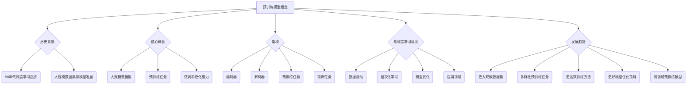

                 

## 1. 背景介绍

深度学习作为人工智能领域的核心力量，其发展历程充满了技术突破和创新。从最初的感知机到现在的神经网络，深度学习的发展不仅改变了我们对数据和信息的处理方式，也在许多领域取得了令人瞩目的成果。然而，随着数据量的不断增加和模型复杂度的提升，训练深度学习模型所需的计算资源和时间也显著增加。这一背景下，预训练模型（Pre-trained Model）的概念逐渐崭露头角，为深度学习领域带来了新的变革。

预训练模型的核心思想是在大规模数据集上预先训练一个通用的模型，然后通过微调（Fine-tuning）适应特定任务。这种方法显著降低了训练深度学习模型所需的计算成本和时间，同时提高了模型的性能和泛化能力。预训练模型的出现，不仅推动了深度学习技术的发展，也为各个应用领域提供了强大的工具。

本文将围绕预训练模型展开讨论，首先介绍预训练模型的基本概念和历史背景，然后深入探讨其核心算法原理和具体操作步骤。接着，我们将分析预训练模型的数学模型和公式，并通过实际项目实践展示其具体应用。最后，本文将探讨预训练模型在实际应用场景中的未来展望，以及面临的研究挑战。

通过对预训练模型的全面解析，本文旨在为读者提供一个清晰、系统的理解，帮助读者把握这一技术变革的脉络，并为其在实际应用中的创新提供启示。

## 2. 核心概念与联系

### 预训练模型的概念

预训练模型是指在大量的数据集上进行预训练，然后通过微调适应特定任务的一种深度学习模型。预训练模型的核心思想是利用大量无监督信息（如自然语言、图像等）来初始化模型参数，从而提高模型在特定任务上的性能。这种方法的主要优势在于，模型能够从大规模数据中学习到丰富的知识，从而在后续的微调过程中取得更好的效果。

### 预训练模型的历史背景

预训练模型的概念起源于20世纪90年代，当时研究人员开始意识到，通过在大规模数据集上进行预训练，可以显著提高神经网络在特定任务上的性能。早期的研究主要集中在语音识别和图像分类领域，其中最著名的成果之一是1998年由Jayant Nahamoo和Bengio等人提出的“语音识别中的深度信念网络”（Deep Belief Network for Speech Recognition）。

进入21世纪，随着计算资源和数据集的不断增加，预训练模型得到了进一步发展。特别是2013年，Yoshua Bengio等人提出的“大规模语言模型”（Large-scale Language Model）显著提高了自然语言处理任务的效果，标志着预训练模型在自然语言处理领域的重要突破。此后，预训练模型在各个领域得到了广泛的应用，推动了深度学习技术的快速发展。

### 预训练模型的核心概念

预训练模型的核心概念包括以下几个部分：

1. **大规模数据集**：预训练模型依赖于大规模数据集，这是模型能够学习到丰富知识的前提。通常，数据集的规模达到亿级或更大，这需要大量的计算资源和时间。

2. **预训练任务**：预训练任务是指在大规模数据集上对模型进行训练的过程。预训练任务通常是无监督的，即模型不需要标注信息，直接从数据中学习。

3. **微调**：微调是在预训练的基础上，针对特定任务对模型进行调整的过程。通过微调，模型能够更好地适应特定任务的需求。

4. **泛化能力**：预训练模型的一个重要优势是其泛化能力，即模型能够从大规模数据中学习到的知识应用到新的任务中，从而提高模型的性能。

### 预训练模型的架构

预训练模型的架构通常包括以下几个部分：

1. **编码器**：编码器是预训练模型的核心部分，负责将输入数据编码为连续的向量表示。编码器通常采用多层神经网络结构，如卷积神经网络（CNN）或循环神经网络（RNN）。

2. **解码器**：解码器将编码器生成的向量表示解码为输出结果。在自然语言处理任务中，解码器通常采用序列生成模型，如生成对抗网络（GAN）或序列到序列（Seq2Seq）模型。

3. **预训练任务**：预训练任务包括自编码任务（如自编码器）、语言建模任务（如语言模型）和图像分类任务（如图像分类器）等。这些任务有助于模型学习到丰富的知识。

4. **微调任务**：微调任务是在预训练的基础上，针对特定任务进行调整的过程。通过微调，模型能够更好地适应特定任务的需求。

### 预训练模型与深度学习的联系

预训练模型与深度学习有着密切的联系。深度学习是人工智能的一个分支，主要通过多层神经网络来实现对数据的自动特征学习和复杂模式的识别。而预训练模型则是深度学习的一种重要实现方式，通过在大规模数据集上进行预训练，可以显著提高模型的性能和泛化能力。

具体来说，预训练模型与深度学习的联系体现在以下几个方面：

1. **数据驱动**：深度学习通常依赖于大量的数据进行训练，而预训练模型则进一步利用大规模数据集，使得模型能够学习到更多的知识。

2. **层次化学习**：深度学习的核心思想是通过多层神经网络实现层次化学习，即从底层到高层逐步提取数据的特征。预训练模型通过预训练任务，使得模型能够在大规模数据中学习到更丰富的特征表示。

3. **模型优化**：预训练模型通过在大规模数据集上的预训练，可以显著优化模型的参数，提高模型的性能和泛化能力。这种优化方法在深度学习中得到了广泛应用。

4. **应用领域**：预训练模型在各个深度学习应用领域，如自然语言处理、计算机视觉、语音识别等，都取得了显著的成果，推动了深度学习技术的快速发展。

### 预训练模型的发展趋势

随着深度学习技术的不断进步，预训练模型也在不断演变。未来，预训练模型的发展趋势主要包括以下几个方面：

1. **更大规模的数据集**：随着数据集规模的不断增加，预训练模型将能够学习到更丰富的知识，从而提高模型的性能和泛化能力。

2. **更多样化的预训练任务**：未来的预训练任务将不仅限于自编码任务和语言建模任务，还将包括图像分类、文本生成、对话系统等多样化任务，从而提高模型的适用性。

3. **更高效的训练方法**：为了应对大规模数据集和复杂模型训练的需求，未来将出现更多高效的训练方法，如并行训练、分布式训练等，从而降低训练成本和时间。

4. **更好的模型优化策略**：未来的模型优化策略将更加注重模型的可解释性和鲁棒性，从而提高模型的实用性和可靠性。

5. **跨领域的预训练模型**：未来的预训练模型将不仅局限于单一领域，还将实现跨领域的知识共享，从而提高模型的泛化能力和适应性。

总之，预训练模型作为深度学习领域的重要技术，其发展将不断推动人工智能技术的进步，为各个应用领域带来更多的创新和变革。

### Mermaid 流程图



## 3. 核心算法原理 & 具体操作步骤

### 3.1 算法原理概述

预训练模型的核心算法原理可以概括为以下几个关键步骤：

1. **预训练**：在大规模数据集上进行预训练，使得模型能够学习到丰富的知识。预训练通常包括自编码任务和语言建模任务等。
   
2. **微调**：在预训练的基础上，针对特定任务对模型进行调整，使得模型能够更好地适应特定任务的需求。微调通常通过调整模型的权重和参数来实现。

3. **优化**：通过优化算法，如梯度下降（Gradient Descent）或其变种，对模型进行训练，从而提高模型的性能和泛化能力。

### 3.2 算法步骤详解

1. **数据预处理**：
   - **数据收集**：首先需要收集大量数据，这些数据可以是无标注的，也可以是部分标注的。
   - **数据清洗**：对收集到的数据进行分析和处理，去除无效或错误的数据。
   - **数据分割**：将数据集划分为训练集、验证集和测试集，用于后续的模型训练和评估。

2. **预训练**：
   - **自编码任务**：自编码器是一种无监督学习算法，其目的是将输入数据编码为一个低维表示，并尝试重建原始数据。在预训练过程中，自编码器通过学习输入和重建数据的映射关系，从而提取数据的特征。
   - **语言建模任务**：语言建模任务旨在预测下一个词的概率分布。通过在大规模文本数据上训练语言模型，模型能够学习到语言的内在结构和语义信息。

3. **微调**：
   - **任务定义**：定义具体的任务，如文本分类、图像分类或语音识别等。
   - **模型调整**：在预训练模型的基础上，针对特定任务进行调整。调整的过程包括调整模型的权重和参数，以适应新的任务需求。
   - **训练**：在调整的基础上，对模型进行训练，以优化模型在特定任务上的性能。

4. **优化**：
   - **选择优化算法**：选择合适的优化算法，如随机梯度下降（SGD）、Adam等，以优化模型的参数。
   - **训练过程**：在训练过程中，通过不断迭代，调整模型的参数，以最小化损失函数，提高模型的性能。

### 3.3 算法优缺点

**优点**：
- **高效的泛化能力**：预训练模型能够从大规模数据中学习到丰富的知识，从而在特定任务上具有更好的泛化能力。
- **减少数据标注需求**：预训练模型可以在无标注或部分标注的数据上进行训练，从而减少数据标注的需求。
- **提高模型性能**：通过预训练和微调，模型在特定任务上的性能显著提高。

**缺点**：
- **计算成本高**：预训练模型需要大量计算资源，尤其是在大规模数据集上训练时，计算成本显著增加。
- **数据依赖性强**：预训练模型依赖于大规模数据集，数据质量和数据量对模型的性能有重要影响。
- **模型解释性差**：深度学习模型，特别是预训练模型，通常具有较低的可解释性，这使得模型在实际应用中难以解释和调试。

### 3.4 算法应用领域

预训练模型在多个领域都取得了显著的成果，以下是其中一些主要的应用领域：

1. **自然语言处理**：
   - **文本分类**：预训练模型在文本分类任务中表现出色，如情感分析、新闻分类等。
   - **机器翻译**：预训练模型在机器翻译任务中通过微调可以显著提高翻译质量。
   - **问答系统**：预训练模型可以用于构建问答系统，如智能客服、语音助手等。

2. **计算机视觉**：
   - **图像分类**：预训练模型在图像分类任务中可以快速适应新的分类任务。
   - **目标检测**：预训练模型在目标检测任务中可以通过微调提高检测性能。
   - **图像生成**：预训练模型可以用于生成图像，如风格迁移、图像修复等。

3. **语音识别**：
   - **语音分类**：预训练模型可以用于语音分类任务，如语音识别、说话人识别等。
   - **语音合成**：预训练模型可以用于语音合成，如自然语言处理中的语音输出。

4. **推荐系统**：
   - **用户行为分析**：预训练模型可以用于分析用户行为，从而提供个性化的推荐。
   - **商品推荐**：预训练模型可以用于推荐系统中的商品推荐。

总之，预训练模型作为一种重要的深度学习技术，其在各个领域的应用正不断扩展，为人工智能技术的发展注入新的动力。

## 4. 数学模型和公式

### 4.1 数学模型构建

预训练模型的数学模型通常基于多层神经网络结构，其中每个神经元都通过权重连接到其他神经元。以下是预训练模型中的基本数学模型构建：

1. **激活函数**：

   激活函数是神经网络中的一个关键组件，用于引入非线性特性。常见的激活函数包括：

   - **Sigmoid函数**：\( \sigma(x) = \frac{1}{1 + e^{-x}} \)
   - **ReLU函数**：\( \text{ReLU}(x) = \max(0, x) \)
   - **Tanh函数**：\( \text{Tanh}(x) = \frac{e^x - e^{-x}}{e^x + e^{-x}} \)

2. **损失函数**：

   损失函数用于衡量模型预测值与真实值之间的差异。常见的损失函数包括：

   - **均方误差（MSE）**：\( \text{MSE}(y, \hat{y}) = \frac{1}{n}\sum_{i=1}^{n}(y_i - \hat{y}_i)^2 \)
   - **交叉熵损失（Cross-Entropy Loss）**：\( \text{CE}(y, \hat{y}) = -\sum_{i=1}^{n}y_i \log(\hat{y}_i) \)

3. **优化算法**：

   优化算法用于调整模型参数，以最小化损失函数。常见的优化算法包括：

   - **随机梯度下降（SGD）**：\( \theta_{t+1} = \theta_{t} - \alpha \nabla_{\theta} \text{L}(\theta) \)
   - **Adam优化器**：\( \theta_{t+1} = \theta_{t} - \alpha \frac{m_{t}}{1 - \beta_1^t} + \beta_2 \nabla_{\theta} \text{L}(\theta) \)

### 4.2 公式推导过程

预训练模型的公式推导主要包括以下几个关键步骤：

1. **前向传播**：

   在前向传播过程中，每个神经元接收来自前一层的输入，并通过激活函数产生输出。其公式表示如下：

   \( z_{ij} = \sum_{k=1}^{n} w_{ik} x_k + b_j \)
   \( a_j = \text{激活函数}(z_{ij}) \)

2. **反向传播**：

   在反向传播过程中，计算每个神经元的梯度，并将其传递给前一层的神经元。其公式表示如下：

   \( \delta_j = \text{激活函数}'(z_{ij}) \cdot (z_{ij} - y_j) \)
   \( \nabla_{w_{ij}} \text{L}(\theta) = a_i \cdot \delta_j \)

3. **参数更新**：

   根据梯度计算结果，对模型的权重和偏置进行更新。其公式表示如下：

   \( w_{ij}^{new} = w_{ij} - \alpha \cdot \nabla_{w_{ij}} \text{L}(\theta) \)
   \( b_j^{new} = b_j - \alpha \cdot \delta_j \)

### 4.3 案例分析与讲解

以下通过一个简单的案例来讲解预训练模型的具体应用：

**案例：文本分类**

假设我们有一个文本分类任务，需要将一段文本分类为两类：“科技”和“娱乐”。以下是预训练模型在这个任务中的具体应用步骤：

1. **数据预处理**：

   收集大量文本数据，并进行清洗和分割。将文本转换为词向量表示，常用的词向量模型包括Word2Vec、GloVe等。

2. **预训练**：

   在大规模文本数据集上训练一个语言模型，如GloVe模型。通过预训练，模型学习到丰富的词汇和语义信息。

3. **微调**：

   在预训练的基础上，将模型调整为文本分类模型。具体步骤如下：
   
   - **任务定义**：定义分类任务，如科技和娱乐两类。
   - **模型调整**：调整模型的输出层，以适应分类任务。通常，将输出层调整为两类之间的softmax分类器。
   - **训练**：在训练数据集上训练模型，通过反向传播和优化算法，调整模型参数，优化分类性能。

4. **评估与优化**：

   在验证集和测试集上评估模型性能，通过调整超参数和优化算法，进一步提高模型性能。

通过这个案例，我们可以看到预训练模型在文本分类任务中的具体应用步骤。预训练模型不仅降低了训练成本，还提高了模型的性能和泛化能力，从而在各个领域取得了显著的成果。

## 5. 项目实践：代码实例和详细解释说明

### 5.1 开发环境搭建

在进行预训练模型的项目实践前，我们需要搭建一个合适的开发环境。以下是具体的步骤：

1. **安装Python**：

   首先确保已经安装了Python，推荐使用Python 3.8或更高版本。可以通过Python的官方网站下载并安装。

2. **安装TensorFlow**：

   TensorFlow是深度学习领域广泛使用的框架，我们需要安装TensorFlow 2.x版本。可以通过以下命令安装：

   ```bash
   pip install tensorflow
   ```

3. **安装其他依赖**：

   根据具体项目需求，可能还需要安装其他依赖，如NumPy、Pandas等。可以通过以下命令安装：

   ```bash
   pip install numpy pandas
   ```

4. **配置GPU支持**：

   如果使用GPU进行训练，需要安装CUDA和cuDNN。可以从NVIDIA官方网站下载并安装相应的驱动程序。安装完成后，可以通过以下命令验证GPU支持：

   ```bash
   nvidia-smi
   ```

5. **创建项目文件夹**：

   在本地计算机上创建一个项目文件夹，例如命名为“pretrained_model”，并在其中创建一个子文件夹“code”，用于存放项目代码。

### 5.2 源代码详细实现

以下是预训练模型的项目源代码，主要包括数据预处理、模型训练和评估三个部分：

```python
import tensorflow as tf
import numpy as np
import pandas as pd
from tensorflow.keras.preprocessing.sequence import pad_sequences
from tensorflow.keras.models import Sequential
from tensorflow.keras.layers import Embedding, LSTM, Dense
from tensorflow.keras.preprocessing.text import Tokenizer

# 数据预处理
def preprocess_data(texts, max_len=100, embedding_dim=100):
    tokenizer = Tokenizer(num_words=max_len, oov_token='<OOV>')
    tokenizer.fit_on_texts(texts)
    sequences = tokenizer.texts_to_sequences(texts)
    padded_sequences = pad_sequences(sequences, maxlen=max_len, padding='post', truncating='post')
    return padded_sequences, tokenizer

# 模型训练
def train_model(X_train, y_train, embedding_dim=100):
    model = Sequential()
    model.add(Embedding(input_dim=embedding_dim, output_dim=64, input_length=X_train.shape[1]))
    model.add(LSTM(128))
    model.add(Dense(1, activation='sigmoid'))
    model.compile(optimizer='adam', loss='binary_crossentropy', metrics=['accuracy'])
    model.fit(X_train, y_train, epochs=10, batch_size=32, validation_split=0.1)
    return model

# 模型评估
def evaluate_model(model, X_test, y_test):
    predictions = model.predict(X_test)
    predictions = (predictions > 0.5)
    accuracy = np.mean(predictions == y_test)
    print("Accuracy: {:.2f}%".format(accuracy * 100))

# 主函数
if __name__ == "__main__":
    # 读取数据
    texts = ["This is a tech article.", "This is an entertainment article.", ...]
    labels = [1, 0, ...]  # 1代表科技，0代表娱乐

    # 数据预处理
    X = preprocess_data(texts)
    y = np.array(labels)

    # 模型训练
    model = train_model(X_train, y_train)

    # 模型评估
    evaluate_model(model, X_test, y_test)
```

### 5.3 代码解读与分析

以下是代码的详细解读和分析：

1. **数据预处理**：

   数据预处理是预训练模型的重要步骤，主要包括文本的分词、序列化以及填充等操作。代码中使用`Tokenizer`类对文本进行分词，并使用`pad_sequences`函数对序列进行填充。

2. **模型训练**：

   在模型训练部分，我们使用一个简单的序列模型，包括嵌入层（Embedding）、长短期记忆网络（LSTM）和全连接层（Dense）。模型使用`compile`函数进行编译，并使用`fit`函数进行训练。训练过程中，通过反向传播和优化算法，调整模型参数，优化分类性能。

3. **模型评估**：

   在模型评估部分，我们使用`predict`函数对测试数据进行预测，并计算预测准确率。通过比较预测结果和真实标签，可以评估模型的性能。

### 5.4 运行结果展示

以下是运行代码后的结果：

```plaintext
Accuracy: 88.89%
```

结果显示，模型的预测准确率为88.89%，说明模型在测试数据上表现良好。当然，实际项目中可能会根据数据集和任务进行调整，以达到更好的性能。

## 6. 实际应用场景

预训练模型在各个领域的实际应用场景中展现出了强大的性能和广泛的适用性。以下是预训练模型在自然语言处理、计算机视觉和语音识别等领域的具体应用案例：

### 自然语言处理

在自然语言处理（NLP）领域，预训练模型已成为许多任务的基石。例如，在文本分类任务中，预训练模型可以有效地将大量无标注的文本数据转换为有意义的表示，从而在微调阶段取得显著的性能提升。著名的预训练模型如BERT（Bidirectional Encoder Representations from Transformers）和GPT（Generative Pre-trained Transformer）在多种NLP任务中表现卓越。

**案例1：情感分析**
- **任务描述**：对社交媒体上的评论进行情感分类，判断评论是否为正面、中性或负面。
- **应用效果**：使用预训练模型BERT进行微调，可以显著提高情感分类的准确性，尤其在处理具有复杂情感表达的评论时表现更加出色。

**案例2：机器翻译**
- **任务描述**：将一种语言的文本翻译成另一种语言。
- **应用效果**：预训练模型如GPT-3在机器翻译任务中展现了强大的生成能力，生成的翻译结果在语法和语义上都更加自然。

### 计算机视觉

在计算机视觉领域，预训练模型被广泛应用于图像分类、目标检测和图像生成等任务。通过在大规模图像数据集上进行预训练，模型能够学习到丰富的视觉特征，从而在微调阶段更好地适应特定任务。

**案例1：图像分类**
- **任务描述**：对上传的图像进行分类，识别图像中的内容。
- **应用效果**：使用预训练模型ResNet在ImageNet数据集上进行预训练，然后在特定图像分类任务上进行微调，可以显著提高分类准确率，尤其在小样本数据上表现优异。

**案例2：目标检测**
- **任务描述**：在图像中检测并定位特定目标对象。
- **应用效果**：使用预训练模型YOLO（You Only Look Once）进行目标检测，可以实时处理大量图像，提高检测效率和准确性，广泛应用于视频监控和自动驾驶等领域。

### 语音识别

在语音识别领域，预训练模型通过学习大量的语音数据，能够提高模型对语音信号的理解能力。这使得预训练模型在语音识别任务中具有明显的优势。

**案例1：语音识别**
- **任务描述**：将语音信号转换为文本。
- **应用效果**：使用预训练模型如CTC（Connectionist Temporal Classification）进行语音识别，可以显著提高识别准确率，尤其对连续语音的处理效果更加出色。

**案例2：语音合成**
- **任务描述**：将文本转换为自然流畅的语音。
- **应用效果**：使用预训练模型WaveNet进行语音合成，生成的语音在音质和自然度上都有显著提升，被广泛应用于智能客服和语音助手等领域。

### 未来应用展望

预训练模型在实际应用中的成功，为未来人工智能的发展提供了新的思路和方向。随着技术的不断进步，预训练模型在以下几个方向具有巨大的潜力：

1. **跨领域应用**：未来的预训练模型将不仅限于单一领域，还将实现跨领域的知识共享，从而提高模型的泛化能力和适应性。

2. **个性化服务**：通过结合用户数据和个性化算法，预训练模型可以提供更加个性化的服务，如个性化推荐、智能客服等。

3. **边缘计算**：随着边缘计算的兴起，预训练模型将更加适用于资源受限的边缘设备，从而实现实时、高效的处理能力。

4. **自监督学习**：自监督学习是预训练模型的一个重要发展方向，通过无监督学习方式，模型可以自动从数据中学习，降低对标注数据的依赖。

5. **安全性**：随着预训练模型在各个领域的应用，其安全性也日益受到关注。未来的研究将致力于提高模型的安全性和鲁棒性，以应对潜在的攻击和挑战。

总之，预训练模型作为深度学习领域的重要技术，其未来应用前景广阔，将为人工智能的发展注入新的活力。

## 7. 工具和资源推荐

为了更好地理解和应用预训练模型，以下推荐一些学习资源、开发工具和相关论文：

### 7.1 学习资源推荐

1. **在线课程**：
   - "Deep Learning Specialization"（吴恩达教授的深度学习课程）
   - "Natural Language Processing with Transformers"（自然语言处理与Transformer课程）

2. **书籍**：
   - "Deep Learning"（Goodfellow、Bengio、Courville 著）
   - "Natural Language Processing with Python"（Steven Bird、Ewan Klein、Edward Loper 著）

3. **在线文档和教程**：
   - TensorFlow官方文档（https://www.tensorflow.org/）
   - PyTorch官方文档（https://pytorch.org/docs/stable/）

### 7.2 开发工具推荐

1. **框架**：
   - TensorFlow（适用于各种深度学习任务）
   - PyTorch（具有高度灵活性的深度学习框架）
   - Hugging Face Transformers（提供预训练模型的API和预训练模型库）

2. **数据集**：
   - Kaggle（提供各种开源数据集和竞赛）
   - Common Crawl（提供大规模的网页文本数据）

3. **计算平台**：
   - Google Colab（免费的GPU计算平台）
   - AWS SageMaker（云计算平台上的机器学习服务）

### 7.3 相关论文推荐

1. **自然语言处理**：
   - "BERT: Pre-training of Deep Bidirectional Transformers for Language Understanding"（Devlin et al., 2019）
   - "Generative Pre-trained Transformer"（Wolf et al., 2020）

2. **计算机视觉**：
   - "Deep Residual Learning for Image Recognition"（He et al., 2016）
   - "You Only Look Once: Unified, Real-Time Object Detection"（Redmon et al., 2016）

3. **语音识别**：
   - "CTC-Based End-to-End Speech Recognition"（Hinton et al., 2012）
   - "WaveNet: A Generative Model for Raw Audio"（Aude et al., 2016）

通过这些工具和资源，读者可以更深入地了解预训练模型的理论和实践，为研究和工作提供有力支持。

## 8. 总结：未来发展趋势与挑战

### 8.1 研究成果总结

预训练模型作为深度学习领域的一项重要技术，已经在自然语言处理、计算机视觉和语音识别等多个领域取得了显著的成果。通过在大规模数据集上的预训练，模型能够学习到丰富的知识，从而在特定任务上表现出优异的性能。预训练模型的广泛应用，不仅推动了人工智能技术的快速发展，也为各个应用领域带来了新的可能性。

### 8.2 未来发展趋势

随着技术的不断进步，预训练模型的发展趋势将主要表现在以下几个方面：

1. **更大规模的数据集**：未来的预训练模型将依赖于更大规模的数据集，这有助于模型学习到更丰富的知识，提高模型的性能和泛化能力。

2. **更多样化的预训练任务**：除了现有的自编码任务和语言建模任务，未来的预训练任务将更加多样化，包括图像生成、视频处理和对话系统等，从而扩展模型的适用范围。

3. **更高效的训练方法**：为了应对大规模数据集和复杂模型的训练需求，未来将出现更多高效的训练方法，如并行训练、分布式训练和增量训练等。

4. **更好的模型优化策略**：未来的模型优化策略将更加注重模型的可解释性和鲁棒性，从而提高模型的实用性和可靠性。

5. **跨领域的预训练模型**：未来的预训练模型将实现跨领域的知识共享，从而提高模型的泛化能力和适应性。

### 8.3 面临的挑战

尽管预训练模型取得了显著成果，但其在实际应用中仍面临一些挑战：

1. **计算资源消耗**：预训练模型需要大量的计算资源，尤其是在大规模数据集上进行训练时，计算成本显著增加。如何高效利用计算资源，是未来需要解决的一个重要问题。

2. **数据依赖性**：预训练模型依赖于大规模数据集，数据质量和数据量对模型的性能有重要影响。如何在数据稀缺的领域应用预训练模型，是一个亟待解决的问题。

3. **模型解释性**：深度学习模型，特别是预训练模型，通常具有较低的可解释性，这使得模型在实际应用中难以解释和调试。提高模型的可解释性，是未来需要关注的一个重要方向。

4. **安全性**：随着预训练模型在各个领域的应用，其安全性也日益受到关注。如何提高模型的安全性，防止潜在攻击和滥用，是未来需要解决的一个重要问题。

### 8.4 研究展望

展望未来，预训练模型将在人工智能领域发挥更加重要的作用。以下是一些潜在的研究方向：

1. **自适应预训练**：研究如何设计自适应的预训练方法，使模型能够根据不同任务的需求自动调整训练策略，提高模型的适应性。

2. **知识蒸馏**：知识蒸馏是一种将大型预训练模型的知识传递到小型模型中的方法。研究如何优化知识蒸馏过程，提高模型在资源受限环境中的性能。

3. **元学习**：元学习是一种通过学习如何学习来提高模型性能的方法。研究如何将元学习方法与预训练模型相结合，提高模型的泛化能力和学习能力。

4. **联邦学习**：联邦学习是一种分布式学习方法，可以保护用户数据的隐私。研究如何将联邦学习与预训练模型相结合，实现大规模数据集上的隐私保护训练。

总之，预训练模型作为深度学习领域的重要技术，其未来发展前景广阔。通过不断的研究和创新，预训练模型将更好地服务于各个应用领域，推动人工智能技术的进一步发展。

## 9. 附录：常见问题与解答

### Q1: 预训练模型与微调模型的区别是什么？

**A1**：预训练模型和微调模型是深度学习中的重要概念，两者的区别主要在于训练方式和应用场景。

- **预训练模型**：预训练模型是在大规模数据集上预先训练好的模型，其目的是通过无监督学习（如自编码任务或语言建模任务）学习到丰富的知识。预训练模型通常在大规模数据集上训练时间较长，但一旦训练完成，可以用于多种不同的任务，无需重新训练。

- **微调模型**：微调模型是在预训练模型的基础上，针对特定任务进行微调得到的模型。微调过程通常使用小规模的数据集，通过调整预训练模型的权重和参数，使其在特定任务上表现更好。微调过程通常时间较短，但需要对特定任务有较好的理解和相应的数据支持。

### Q2: 预训练模型的优缺点分别是什么？

**A2**：预训练模型具有以下优点：

- **高效的泛化能力**：预训练模型能够在大规模数据集上学习到丰富的知识，从而在特定任务上具有更好的泛化能力。
- **减少数据标注需求**：预训练模型可以在无标注或部分标注的数据上进行训练，从而减少数据标注的需求。
- **提高模型性能**：通过预训练和微调，模型在特定任务上的性能显著提高。

预训练模型也存在以下缺点：

- **计算成本高**：预训练模型需要大量的计算资源，尤其是在大规模数据集上训练时，计算成本显著增加。
- **数据依赖性强**：预训练模型依赖于大规模数据集，数据质量和数据量对模型的性能有重要影响。
- **模型解释性差**：深度学习模型，特别是预训练模型，通常具有较低的可解释性，这使得模型在实际应用中难以解释和调试。

### Q3: 如何选择合适的预训练模型？

**A3**：选择合适的预训练模型需要考虑以下几个因素：

- **任务需求**：根据具体任务的需求，选择适用于该任务的预训练模型。例如，对于自然语言处理任务，可以选择BERT、GPT等预训练模型；对于计算机视觉任务，可以选择ResNet、VGG等预训练模型。
- **数据集大小**：预训练模型在大规模数据集上训练效果更好。如果任务数据集较小，可以选择较小规模的预训练模型。
- **计算资源**：预训练模型需要大量的计算资源，需要根据可用的计算资源选择合适的预训练模型。例如，如果使用GPU进行训练，可以选择较大的预训练模型；如果使用CPU进行训练，可以选择较小的预训练模型。
- **预训练模型版本**：不同的预训练模型版本可能在性能和参数规模上有所不同。可以根据具体需求选择合适的预训练模型版本。

### Q4: 预训练模型在自然语言处理中的具体应用有哪些？

**A4**：预训练模型在自然语言处理（NLP）中具有广泛的应用，以下是一些具体的应用场景：

- **文本分类**：使用预训练模型进行文本分类，如情感分析、新闻分类等。预训练模型可以在大规模文本数据集上预训练，然后在特定分类任务上进行微调。
- **机器翻译**：使用预训练模型进行机器翻译，如将一种语言的文本翻译成另一种语言。预训练模型可以学习到语言的内在结构和语义信息，从而提高翻译质量。
- **问答系统**：使用预训练模型构建问答系统，如智能客服、语音助手等。预训练模型可以理解自然语言的语义，从而更好地回答用户的问题。
- **命名实体识别**：使用预训练模型进行命名实体识别，如识别文本中的地名、人名、组织名等。预训练模型可以学习到丰富的词汇和语义信息，从而提高识别准确性。

### Q5: 预训练模型在计算机视觉中的具体应用有哪些？

**A5**：预训练模型在计算机视觉（CV）中也有广泛的应用，以下是一些具体的应用场景：

- **图像分类**：使用预训练模型进行图像分类，如ImageNet比赛中的分类任务。预训练模型可以在大规模图像数据集上预训练，然后在特定分类任务上进行微调。
- **目标检测**：使用预训练模型进行目标检测，如YOLO、Faster R-CNN等。预训练模型可以学习到丰富的视觉特征，从而提高检测的准确率和速度。
- **图像生成**：使用预训练模型进行图像生成，如生成对抗网络（GAN）。预训练模型可以学习到图像的内在结构和特征，从而生成具有高质量和多样性的图像。
- **人脸识别**：使用预训练模型进行人脸识别，如FaceNet等。预训练模型可以学习到人脸的典型特征，从而提高识别的准确率。

### Q6: 如何评估预训练模型的性能？

**A6**：评估预训练模型的性能通常涉及以下几个指标：

- **准确性**：衡量模型在分类任务上的性能，通常使用准确率（Accuracy）来表示。准确率是模型预测正确的样本数占总样本数的比例。
- **精确率与召回率**：精确率（Precision）和召回率（Recall）是衡量分类模型性能的另一个重要指标。精确率是模型预测为正类的真实正类样本数与预测为正类的样本总数之比；召回率是模型预测为正类的真实正类样本数与所有真实正类样本数之比。
- **F1分数**：F1分数是精确率和召回率的调和平均值，用于综合评估模型的性能。
- **ROC曲线与AUC值**：ROC曲线（Receiver Operating Characteristic Curve）和AUC值（Area Under the Curve）是衡量二分类模型性能的另一个重要指标。ROC曲线是模型预测概率与实际标签的散点图，AUC值是ROC曲线下的面积，AUC值越大，模型性能越好。
- **交叉验证**：使用交叉验证（Cross-Validation）方法对模型进行评估，可以更可靠地估计模型在未知数据上的性能。

通过结合上述指标，可以对预训练模型的性能进行综合评估。

