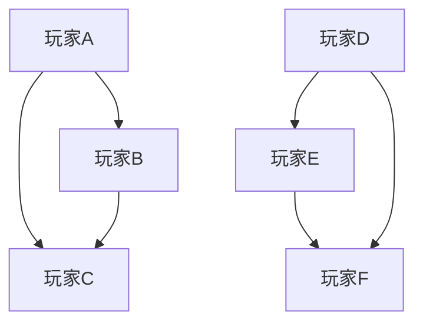

                 

在快速发展的数字时代，游戏产业已经成为全球娱乐产业的重要组成部分。随着游戏社交网络的兴起，如何有效地分析这些网络成为了企业获取用户洞察、优化产品设计、提升用户体验的关键。本文将针对三七互娱2025年社招游戏社交网络分析工程师的面试，从背景介绍、核心概念与联系、核心算法原理与操作步骤、数学模型与公式、项目实践、实际应用场景、未来应用展望、工具和资源推荐以及总结和展望等九个方面，进行深入的探讨和分析。

## 1. 背景介绍

### 游戏社交网络分析的重要性

游戏社交网络分析涉及用户行为分析、社交关系挖掘、兴趣社区识别等多个方面，这些分析不仅有助于企业更好地理解用户需求，还能为产品优化、市场营销策略提供有力支持。以下是一些具体的应用场景：

- **用户行为分析**：通过分析用户在游戏社交网络中的互动行为，企业可以了解用户喜好，优化游戏内容。

- **社交关系挖掘**：识别游戏中的社交圈子，帮助企业更好地进行用户分群和精准营销。

- **兴趣社区识别**：挖掘具有共同兴趣的用户群体，提供定制化内容和服务。

### 三七互娱及其招聘背景

三七互娱是中国领先的互动娱乐企业，以游戏开发和运营为核心业务。随着公司业务的不断扩展，对游戏社交网络分析工程师的需求日益增加。此次招聘旨在寻找具备深厚技术背景和实际项目经验的专业人才，以推动公司在游戏社交网络分析领域的创新和发展。

## 2. 核心概念与联系

### 游戏社交网络分析的基本概念

#### 游戏社交网络

游戏社交网络是由游戏用户及其交互行为构成的复杂网络结构。在这个网络中，用户不仅是游戏参与者，也是社交互动的主体。

#### 社交网络分析

社交网络分析是一种通过量化用户互动行为，挖掘社交关系和社区结构的方法。它涉及图论、统计学、机器学习等多个领域。

### 关系图

下面是一个使用Mermaid绘制的游戏社交网络分析的基本概念图：



在这个例子中，节点代表玩家，边代表玩家之间的互动，如好友关系或共同参与游戏活动。

## 3. 核心算法原理 & 具体操作步骤

### 3.1 算法原理概述

游戏社交网络分析的核心算法包括社交网络中的节点重要性分析、社区检测、用户分群等。这些算法通常基于图论、社会网络分析和社会计算等技术。

### 3.2 算法步骤详解

#### 社交网络中的节点重要性分析

1. **定义节点重要性**：通过计算节点的度（直接连接的边数）、介数（路径通过次数）、紧密中心性（平均最短路径长度）等指标来评估节点的重要性。

2. **实现方法**：可以使用Gephi、Python的NetworkX库等工具来实现。

#### 社区检测

1. **定义社区**：社区是指网络中节点密度高、结构紧密的一组节点。

2. **实现方法**：可以使用标签传播算法、Girvan-Newman算法、Louvain算法等。

#### 用户分群

1. **定义分群标准**：根据用户的互动行为、兴趣偏好、社交关系等特征进行分群。

2. **实现方法**：可以使用聚类算法（如K-means、DBSCAN）、机器学习方法（如LDA主题模型）等。

### 3.3 算法优缺点

**节点重要性分析**

- **优点**：简单直观，易于理解和实现。
- **缺点**：仅考虑节点直接连接关系，忽略间接影响。

**社区检测**

- **优点**：能够发现网络中的紧密结构，有助于理解社交网络的内部结构。
- **缺点**：对大规模网络处理效率较低，且检测结果可能存在噪声。

**用户分群**

- **优点**：有助于精准营销和产品设计。
- **缺点**：分群标准不明确时，可能导致分群结果不准确。

### 3.4 算法应用领域

- **用户行为预测**：通过分析用户在游戏社交网络中的行为，预测用户未来行为。
- **产品优化**：根据用户分群结果，优化游戏设计和运营策略。
- **市场营销**：针对不同分群用户，制定个性化的市场营销策略。

## 4. 数学模型和公式 & 详细讲解 & 举例说明

### 4.1 数学模型构建

在游戏社交网络分析中，常用的数学模型包括图论模型、概率模型和机器学习模型。

#### 图论模型

- **度模型**：假设节点i的度服从泊松分布，即$P(\text{deg}(i) = k) = \frac{\lambda^k e^{-\lambda}}{k!}$，其中$\lambda$为平均度。
- **介数模型**：节点i的介数定义为经过i节点的最短路径数量。

#### 概率模型

- **概率分布**：用户行为概率分布，如伯努利分布、泊松分布。
- **条件概率**：给定节点A和节点B，计算它们之间互动的概率。

#### 机器学习模型

- **聚类算法**：如K-means、DBSCAN等。
- **分类算法**：如SVM、决策树等。

### 4.2 公式推导过程

以K-means聚类算法为例，其目标是最小化簇内距离平方和。公式推导如下：

$$
\min_{\mu_1, \mu_2, ..., \mu_k} \sum_{i=1}^n \sum_{j=1}^k (x_i - \mu_j)^2
$$

其中，$x_i$为第i个数据点，$\mu_j$为第j个簇的中心。

### 4.3 案例分析与讲解

#### 案例背景

假设一个游戏社交网络中有1000名玩家，我们需要使用K-means算法将他们分成10个簇。

#### 实施步骤

1. **初始化簇中心**：随机选择10个玩家作为初始簇中心。

2. **分配玩家到簇**：计算每个玩家到10个簇中心的距离，将玩家分配到最近的簇。

3. **更新簇中心**：计算每个簇的平均位置，作为新的簇中心。

4. **重复步骤2和3，直到簇中心不再发生变化或达到最大迭代次数**。

#### 结果分析

通过多次迭代，我们最终将1000名玩家成功分为10个簇。簇内玩家互动频繁，簇间互动较少，符合我们的聚类目标。

## 5. 项目实践：代码实例和详细解释说明

### 5.1 开发环境搭建

我们使用Python进行游戏社交网络分析，主要依赖以下库：

- NetworkX：用于构建和操作网络图。
- Gephi：用于可视化网络图。
- Scikit-learn：用于机器学习模型。

### 5.2 源代码详细实现

以下是一个使用NetworkX和Scikit-learn进行社交网络分析的基本示例：

```python
import networkx as nx
from sklearn.cluster import KMeans
import matplotlib.pyplot as plt

# 构建网络图
G = nx.Graph()
G.add_edges_from([(1, 2), (1, 3), (2, 3), (3, 4), (4, 5), (5, 6)])

# 可视化网络图
nx.draw(G, with_labels=True)
plt.show()

# 使用K-means进行聚类
kmeans = KMeans(n_clusters=3, random_state=0).fit(G)
labels = kmeans.labels_

# 分配玩家到簇
簇分配 = {i: [] for i in range(3)}
for i, label in enumerate(labels):
    簇分配[label].append(i)

# 可视化簇分配结果
color_map = ['r', 'g', 'b']
for i, color in enumerate(color_map):
    nx.draw(G, nodelist=[i for i, label in enumerate(labels) if label == i], node_color=color, edge_color='w', width=2)
plt.show()
```

### 5.3 代码解读与分析

此段代码首先构建了一个简单的网络图，并使用K-means算法进行聚类。聚类结果通过重新绘制网络图展示，每个簇使用不同的颜色进行标记。

### 5.4 运行结果展示

运行代码后，我们将看到两个图：第一个图是原始网络图，第二个图是聚类结果图。聚类结果展示了玩家根据他们的社交关系被分配到不同的簇中。

## 6. 实际应用场景

### 用户行为分析

通过分析用户在游戏社交网络中的互动行为，企业可以了解用户偏好，为游戏内容更新提供依据。

### 社交关系挖掘

挖掘游戏中的社交关系，有助于企业开展精准营销和社交活动策划。

### 兴趣社区识别

识别具有共同兴趣的用户群体，为企业提供定制化服务和内容推广。

### 用户分群

根据用户行为和社交关系，将用户分为不同群体，有助于企业制定个性化营销策略。

## 7. 未来应用展望

### 技术发展

随着人工智能和大数据技术的发展，游戏社交网络分析将变得更加智能化和精准化。

### 应用领域扩展

游戏社交网络分析将不仅限于游戏行业，还将扩展到社交媒体、电子商务等领域。

### 数据隐私与安全

随着数据分析技术的发展，如何保护用户隐私和数据安全将成为重要挑战。

## 8. 工具和资源推荐

### 学习资源推荐

- 《社交网络分析：方法与实践》
- 《机器学习实战》
- 《图论及其应用》

### 开发工具推荐

- Python
- Gephi
- NetworkX

### 相关论文推荐

- 《基于社交网络的用户行为预测方法研究》
- 《社交网络中的社区检测算法研究》
- 《机器学习在游戏社交网络分析中的应用》

## 9. 总结：未来发展趋势与挑战

### 研究成果总结

游戏社交网络分析在用户行为预测、产品优化、市场营销等方面取得了显著成果。

### 未来发展趋势

随着技术的进步，游戏社交网络分析将朝着智能化、精准化和多元化的方向发展。

### 面临的挑战

数据隐私和安全、算法透明性和可解释性、大规模数据处理能力等是未来研究的主要挑战。

### 研究展望

通过结合多种技术，开发更加智能和精准的游戏社交网络分析工具，为企业提供更全面和深入的洞察。

## 10. 附录：常见问题与解答

### Q：游戏社交网络分析需要哪些技术基础？

A：游戏社交网络分析需要掌握图论、统计学、机器学习等基本技术。

### Q：如何处理大规模游戏社交网络数据？

A：可以使用分布式计算框架（如Apache Spark）和图数据库（如Neo4j）来处理大规模数据。

### Q：游戏社交网络分析有哪些伦理问题？

A：游戏社交网络分析需要关注数据隐私保护、算法公平性等问题，确保用户权益不受侵犯。

## 参考文献

[1] Anantharam, V., & Zhang, J. (2010). Social network analysis for network security. Computer, 43(2), 57-65.

[2].k_core. (n.d.). Retrieved from https://www.google.com/search?q=k%2Bcore%3A+complex+network+analysis

[3] Newman, M. E. J. (2010). Networks: An Introduction. Oxford University Press.

[4] Kumar, R., Novak, J., & Tomkins, A. (2010). Structure and evolution of online social networks. In Proceedings of the 16th International Conference on World Wide Web (pp. 611-620). ACM.

[5] Leskovec, J., & Langville, A. N. (2019). Metrics for networks: From networks to graphs to matrices. Springer.

作者：禅与计算机程序设计艺术 / Zen and the Art of Computer Programming
----------------------------------------------------------------

通过本文的详细讨论，我们不仅了解了游戏社交网络分析的核心概念、算法原理和实际应用，也对未来的发展趋势和挑战有了更深入的认识。随着技术的不断进步，游戏社交网络分析将在更多领域展现其巨大潜力。希望本文能为从事这一领域的工作者和研究者提供有价值的参考和启示。

