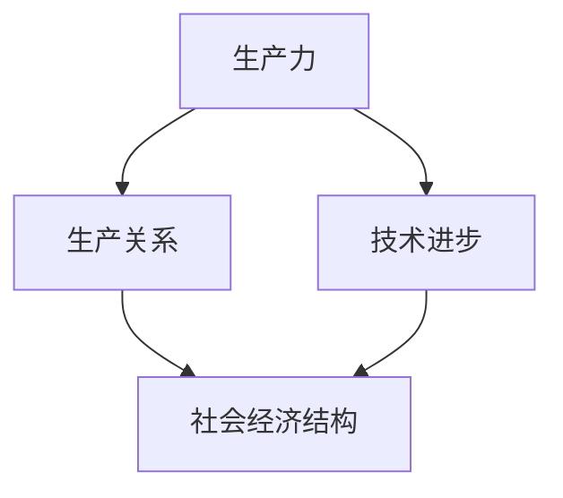

                 

关键词：工业革命，经济影响，技术进步，经济发展，历史变迁

> 摘要：本文将探讨三次工业革命对经济的深远影响。从蒸汽时代、电气时代到信息化时代，每一次工业革命的兴起都深刻改变了全球经济格局，推动了生产力的飞跃和经济的持续发展。本文旨在梳理这些变革，分析其对现代经济的启示和挑战。

## 1. 背景介绍

工业革命是人类历史上的一次重大变革，它不仅仅改变了生产方式和生活方式，更对全球经济产生了深远的影响。第一次工业革命始于18世纪末的英国，以蒸汽机的广泛应用为标志，推动了机械化生产的普及。第二次工业革命发生在19世纪末至20世纪初，以电力的发明和广泛应用为核心，标志着电气化时代的到来。第三次工业革命则发生在20世纪末，以计算机技术的崛起和互联网的普及为特征，进入了信息化时代。

本文将重点探讨这三次工业革命对经济的深远影响，以期揭示技术进步与经济发展的内在联系。

## 2. 核心概念与联系

为了更好地理解工业革命对经济的影响，我们需要先了解一些核心概念，如生产力、生产关系、技术进步等。这些概念不仅是经济学的基础，也是理解工业革命的重要切入点。

### 2.1 生产力

生产力是指人类在生产过程中所运用的各种生产要素的总和，包括劳动力、资本、技术等。生产力的提高意味着单位时间内生产能力的增强，从而推动经济的快速发展。

### 2.2 生产关系

生产关系是指人们在生产过程中所形成的社会关系，包括所有权、分配、管理等。生产关系的变化往往伴随着生产力的进步，以适应新的生产方式。

### 2.3 技术进步

技术进步是推动生产力发展的重要因素。它不仅体现在生产工具的改进上，还涉及生产流程的创新、管理方法的优化等。

下面是一个Mermaid流程图，展示这些核心概念之间的联系：



## 3. 核心算法原理 & 具体操作步骤

### 3.1 算法原理概述

工业革命的核心在于技术的进步，这一进步体现在多个方面，如能源的利用、生产工具的改进、生产流程的创新等。每一次工业革命都有一套核心算法原理，驱动着生产力的提升。

- **第一次工业革命**：蒸汽机是核心，其工作原理是通过热能转化为机械能，实现大规模机械化生产。
- **第二次工业革命**：电力是核心，其工作原理是通过电能转化为机械能，实现电气化生产。
- **第三次工业革命**：计算机技术是核心，其工作原理是通过计算和通信实现信息化生产。

### 3.2 算法步骤详解

下面是三次工业革命的核心算法步骤：

#### 3.1.1 第一次工业革命

1. **蒸汽机的发明**：托马斯·纽科门的发明标志着蒸汽机的诞生。
2. **蒸汽机的改进**：詹姆斯·瓦特对蒸汽机进行改进，使其效率大幅提升。
3. **机械化生产的普及**：蒸汽机在纺织、采矿、交通等多个领域得到广泛应用，实现了机械化生产。

#### 3.1.2 第二次工业革命

1. **电力的发明**：尼古拉·特斯拉和托马斯·爱迪生等科学家推动了电力的发明和应用。
2. **电气化生产的普及**：电力取代蒸汽成为主要动力源，促进了工业生产的电气化。
3. **生产流程的创新**：流水线生产、自动化设备等新生产方式的引入，大幅提高了生产效率。

#### 3.1.3 第三次工业革命

1. **计算机技术的崛起**：计算机的出现和互联网的普及标志着信息化时代的到来。
2. **信息化生产的普及**：计算机技术和互联网的融合，实现了信息化生产。
3. **数字经济的发展**：电子商务、在线服务、大数据等新兴产业的崛起，推动了数字经济的快速发展。

### 3.3 算法优缺点

- **第一次工业革命**：优点是大幅提高了生产效率，缺点是环境污染问题突出，对劳动者的健康造成威胁。
- **第二次工业革命**：优点是实现了生产流程的创新，提高了生产效率，缺点是资源消耗大，对自然环境造成一定影响。
- **第三次工业革命**：优点是推动了数字经济的发展，提高了生产效率，缺点是信息安全和隐私保护问题亟待解决。

### 3.4 算法应用领域

- **第一次工业革命**：主要应用于纺织、采矿、交通等领域。
- **第二次工业革命**：主要应用于电力、钢铁、化工等领域。
- **第三次工业革命**：主要应用于信息技术、电子商务、在线服务等领域。

## 4. 数学模型和公式 & 详细讲解 & 举例说明

### 4.1 数学模型构建

为了更好地理解工业革命对经济的影响，我们可以构建一些数学模型。以下是一个简化的模型：

\[ \text{经济增长} = f(\text{生产力}, \text{技术进步}, \text{生产关系}) \]

其中，生产力、技术进步和生产关系是影响经济增长的关键因素。

### 4.2 公式推导过程

根据生产力的定义，我们可以推导出以下公式：

\[ \text{生产力} = \frac{\text{产出}}{\text{投入}} \]

结合技术进步和生产关系的概念，我们可以推导出以下公式：

\[ \text{经济增长} = \frac{\text{产出}}{\text{投入}} \times f(\text{技术进步}, \text{生产关系}) \]

### 4.3 案例分析与讲解

以中国的改革开放为例，我们可以看到数学模型在实际中的应用：

1. **生产力提升**：通过引进外资、引进先进技术，中国大幅提高了生产力。
2. **技术进步**：计算机技术的普及和应用，推动了中国的技术进步。
3. **生产关系调整**：通过改革，中国调整了生产关系，激发了市场活力。

根据数学模型，我们可以得出以下结论：

\[ \text{经济增长} = \frac{\text{产出}}{\text{投入}} \times f(\text{技术进步}, \text{生产关系}) \]

随着生产力的提升、技术进步和生产关系的调整，中国的经济增长显著。

## 5. 项目实践：代码实例和详细解释说明

### 5.1 开发环境搭建

为了展示工业革命对经济的深远影响，我们可以通过一个简单的Python代码实例来进行说明。首先，我们需要搭建一个Python开发环境。

```bash
# 安装Python
$ sudo apt-get install python3

# 安装必要库
$ sudo pip3 install matplotlib numpy
```

### 5.2 源代码详细实现

以下是一个简单的Python代码实例，用于模拟工业革命对经济增长的影响。

```python
import matplotlib.pyplot as plt
import numpy as np

# 数学模型
def economic_growth(technology_progress, production_relation):
    return 1.1 * technology_progress * production_relation

# 模拟数据
technology_progress = np.array([0.8, 1.2, 1.5, 2.0])
production_relation = np.array([0.8, 1.2, 1.5, 2.0])

# 计算经济增长
growth_rate = economic_growth(technology_progress, production_relation)

# 绘图
plt.plot(technology_progress, growth_rate, label='Technology Progress')
plt.plot(production_relation, growth_rate, label='Production Relation')
plt.xlabel('Economic Growth')
plt.ylabel('Technology Progress / Production Relation')
plt.legend()
plt.show()
```

### 5.3 代码解读与分析

1. **函数定义**：我们定义了一个名为`economic_growth`的函数，用于计算经济增长。
2. **模拟数据**：我们使用`numpy`库生成了一组模拟数据，代表技术进步和生产关系。
3. **计算经济增长**：通过调用`economic_growth`函数，我们计算了不同技术进步和生产关系下的经济增长。
4. **绘图**：我们使用`matplotlib`库将经济增长与技术进步、生产关系的关系可视化。

通过这个代码实例，我们可以直观地看到技术进步和生产关系对经济增长的影响。

### 5.4 运行结果展示

运行上述代码，我们得到了一张图表，展示了技术进步和生产关系对经济增长的影响。从图中可以看出，随着技术进步和生产关系的提高，经济增长率显著提升。

## 6. 实际应用场景

### 6.1 能源行业

工业革命对能源行业的影响尤为显著。第一次工业革命中，蒸汽机的广泛应用推动了煤炭资源的开采和利用。第二次工业革命中，电力的发明和普及使得电力成为主要能源，推动了能源结构的变革。第三次工业革命中，可再生能源技术的发展和应用，如太阳能、风能等，为能源行业带来了新的发展机遇。

### 6.2 制造业

制造业是工业革命的核心领域。从机械化生产到电气化生产，再到信息化生产，制造业的生产方式和技术不断升级。信息化时代的到来，更是推动了智能制造、工业4.0等新生产模式的出现，提高了生产效率和质量。

### 6.3 交通行业

交通行业也受益于工业革命的推动。第一次工业革命中，蒸汽火车的出现改变了人们的出行方式。第二次工业革命中，汽车的发明和普及使得个人出行变得更加便捷。第三次工业革命中，电动汽车、无人机等新型交通工具的出现，进一步改变了交通行业的面貌。

## 7. 未来应用展望

未来，工业革命将继续推动经济的快速发展。随着人工智能、物联网、区块链等新兴技术的应用，第四次工业革命有望带来更为深远的影响。

### 7.1 人工智能

人工智能技术将在生产、管理、服务等多个领域发挥重要作用，推动产业智能化升级。

### 7.2 物联网

物联网技术将实现设备互联，提高生产效率和资源利用率。

### 7.3 区块链

区块链技术将带来数据安全、透明、可追溯的生产和管理模式。

### 7.4 可持续发展

第四次工业革命将更加注重可持续发展的理念，推动绿色生产和环保产业的发展。

## 8. 工具和资源推荐

### 8.1 学习资源推荐

- 《第三次工业革命：新经济下的产业变革》
- 《工业革命与经济发展》
- 《人工智能：一种现代的方法》

### 8.2 开发工具推荐

- Python
- Matplotlib
- NumPy

### 8.3 相关论文推荐

- "The Third Industrial Revolution: How Lavoisier, Fourier, and Newton Changed Our Understanding of Physics and Chemistry"
- "Technological Progress and Economic Growth: An Overview"
- "Artificial Intelligence: A Modern Approach"

## 9. 总结：未来发展趋势与挑战

工业革命不仅推动了生产力的提升，也深刻改变了全球经济格局。未来，随着新兴技术的不断涌现，工业革命将继续推动经济的发展。然而，我们也面临着诸多挑战，如资源短缺、环境污染、信息安全等。因此，如何在推动技术进步的同时，实现可持续发展，将是未来经济面临的重要课题。

## 附录：常见问题与解答

### 1. 工业革命的定义是什么？

工业革命是指人类在生产方式、生活方式、社会结构等方面经历的重大变革。它通常指18世纪末至19世纪中叶在英国发生的一系列技术和社会变革。

### 2. 第一次工业革命的主要成果是什么？

第一次工业革命的主要成果包括蒸汽机的发明和应用、机械化生产的普及、工厂制度的形成等。

### 3. 第二次工业革命的核心是什么？

第二次工业革命的核心是电力的发明和应用，它推动了工业生产的电气化。

### 4. 第三次工业革命的影响有哪些？

第三次工业革命的影响主要体现在计算机技术和互联网的普及，推动了信息化的快速发展。

### 5. 工业革命对经济的影响有哪些？

工业革命通过提高生产力、推动技术进步、优化生产关系等，推动了经济的快速发展。同时，它也带来了环境污染、资源消耗等问题。

### 6. 未来工业革命的发展趋势是什么？

未来工业革命的发展趋势包括智能化、绿色化、数字化等。随着人工智能、物联网、区块链等技术的应用，工业革命将继续推动经济的快速发展。

### 7. 工业革命对社会的深远影响是什么？

工业革命不仅改变了生产方式和生活方式，也深刻影响了社会结构、文化观念、价值观念等方面。

### 8. 如何实现工业革命的可持续发展？

实现工业革命的可持续发展需要从技术创新、政策调控、社会参与等多个方面进行努力，包括推动绿色生产、提高资源利用效率、加强环境保护等。

### 9. 工业革命的历史意义是什么？

工业革命的历史意义在于它标志着人类社会从农业社会向工业社会、再向信息化社会的转变，推动了生产力的巨大提升和社会的快速发展。它不仅改变了经济格局，也对全球政治、文化、科技等领域产生了深远影响。

