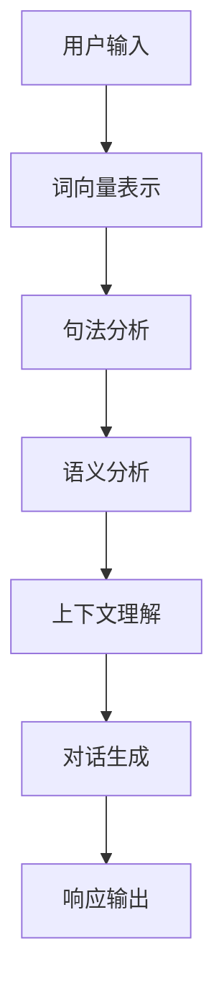

                 

 **关键词：** 上下文学习，自然语言处理，对话系统，连贯性，人工智能

**摘要：** 本文将探讨上下文学习在提高AI对话连贯性方面的重要性。通过详细分析上下文学习的核心概念、算法原理以及具体实现方法，本文旨在为AI对话系统的开发者和研究者提供有价值的参考和指导。

## 1. 背景介绍

随着人工智能技术的快速发展，自然语言处理（NLP）领域取得了显著的进展。特别是对话系统，它们在智能客服、虚拟助手、语言翻译等多个领域得到了广泛应用。然而，尽管AI对话系统在模拟人类对话方面取得了一定的成就，但在提高对话连贯性方面仍然存在许多挑战。

对话连贯性是指对话中各部分之间的逻辑一致性、话题一致性和信息一致性。它对于用户满意度、系统实用性和用户体验至关重要。然而，传统的AI对话系统往往依赖于预定义的模板和规则，这些方法在面对复杂和动态的对话场景时，往往难以保持对话的连贯性。

为了解决这一问题，上下文学习作为一种重要的技术手段被提出来。上下文学习旨在通过捕捉和分析对话中的上下文信息，提高AI对话系统的连贯性。本文将深入探讨上下文学习的核心概念、算法原理以及具体实现方法。

## 2. 核心概念与联系

### 2.1 上下文学习的定义

上下文学习是指通过分析对话中的上下文信息，对对话内容进行理解和推理，从而提高对话系统的连贯性和响应质量。上下文信息包括对话历史、用户偏好、情境信息等，它们对于理解对话内容和预测用户意图具有重要意义。

### 2.2 上下文学习的重要性

上下文学习在AI对话系统中具有重要作用，主要体现在以下几个方面：

- **提高对话连贯性**：通过捕捉和分析上下文信息，对话系统能够更好地理解用户的意图和需求，从而生成更加连贯和自然的对话响应。

- **增强用户满意度**：连贯性是用户体验的关键因素之一。通过上下文学习，对话系统能够提供更加准确和个性化的响应，从而提高用户的满意度和忠诚度。

- **扩展应用场景**：上下文学习使得AI对话系统能够应对更加复杂和多样化的对话场景，从而扩大其应用范围。

### 2.3 上下文学习与相关技术的联系

上下文学习与多个相关技术密切相关，包括自然语言处理、知识图谱、强化学习等。

- **自然语言处理（NLP）**：上下文学习依赖于NLP技术，特别是词向量表示、句法分析和语义分析等，以实现对对话内容的深入理解和分析。

- **知识图谱**：知识图谱为上下文学习提供了丰富的知识背景和语义信息。通过将对话内容与知识图谱进行关联，对话系统能够更好地理解对话上下文。

- **强化学习**：上下文学习中的策略优化和模型训练可以通过强化学习来实现。强化学习能够使对话系统在与用户交互的过程中不断学习和调整，从而提高对话连贯性。

### 2.4 Mermaid 流程图

为了更好地展示上下文学习的过程和原理，以下是一个简单的Mermaid流程图：



### 2.5 上下文学习的分类

根据上下文学习的应用场景和实现方法，可以将上下文学习分为以下几种类型：

- **静态上下文学习**：静态上下文学习是指通过预定义的规则和模板来捕捉上下文信息。这种方法适用于对话场景相对简单和稳定的情况。

- **动态上下文学习**：动态上下文学习是指通过实时分析和理解对话内容，动态地调整和更新上下文信息。这种方法适用于对话场景复杂多变的情况。

- **跨域上下文学习**：跨域上下文学习是指将不同领域的上下文信息进行整合和融合，以实现对多领域对话的理解和生成。这种方法适用于多领域对话应用场景。

## 3. 核心算法原理 & 具体操作步骤

### 3.1 算法原理概述

上下文学习的关键在于对对话上下文信息的捕捉、理解和应用。以下是一个简单的算法原理概述：

1. **词向量表示**：首先，将用户输入的文本转换为词向量表示，以便进行后续的句法分析和语义分析。

2. **句法分析**：通过对词向量表示进行句法分析，提取出句子的结构信息，如主语、谓语、宾语等。

3. **语义分析**：在句法分析的基础上，进一步对词向量表示进行语义分析，提取出句子的语义信息，如意图、实体、关系等。

4. **上下文理解**：将句法分析和语义分析的结果进行整合，形成对话上下文表示。

5. **对话生成**：根据对话上下文表示，生成自然、连贯的对话响应。

6. **响应优化**：通过优化算法，对生成的对话响应进行进一步调整和优化，以提高响应质量和连贯性。

### 3.2 算法步骤详解

1. **词向量表示**：使用预训练的词向量模型，如Word2Vec、GloVe等，将用户输入的文本转换为词向量表示。

2. **句法分析**：使用句法分析工具，如Stanford CoreNLP、SpaCy等，对词向量表示进行句法分析，提取出句子的结构信息。

3. **语义分析**：使用语义分析工具，如BERT、ELMo等，对词向量表示进行语义分析，提取出句子的语义信息。

4. **上下文理解**：将句法分析和语义分析的结果进行整合，使用图神经网络（Graph Neural Network，GNN）等模型进行上下文理解，形成对话上下文表示。

5. **对话生成**：使用序列到序列（Sequence-to-Sequence，Seq2Seq）模型或转换器（Transformer）等模型，根据对话上下文表示生成对话响应。

6. **响应优化**：使用强化学习（Reinforcement Learning，RL）等算法，对生成的对话响应进行优化，以提高响应质量和连贯性。

### 3.3 算法优缺点

#### 优点

- **提高对话连贯性**：上下文学习能够捕捉和分析对话中的上下文信息，从而生成更加连贯和自然的对话响应。

- **增强用户体验**：通过上下文学习，对话系统能够更好地理解用户的意图和需求，提供更加准确和个性化的响应，从而提高用户体验。

- **扩展应用场景**：上下文学习使得AI对话系统能够应对更加复杂和多样化的对话场景，从而扩大其应用范围。

#### 缺点

- **计算资源消耗**：上下文学习涉及到词向量表示、句法分析、语义分析等多个步骤，需要大量的计算资源和时间。

- **数据依赖**：上下文学习依赖于大量的对话数据，数据质量和多样性对于算法性能和效果具有重要意义。

### 3.4 算法应用领域

上下文学习在多个领域具有广泛的应用，包括但不限于以下几个方面：

- **智能客服**：通过上下文学习，智能客服系统能够更好地理解用户的问题和需求，提供更加准确和个性化的解决方案。

- **虚拟助手**：虚拟助手，如智能语音助手和聊天机器人，通过上下文学习，能够与用户进行更加自然、流畅的对话，提高用户体验。

- **语言翻译**：上下文学习在语言翻译领域具有重要意义，能够提高翻译的准确性和连贯性，从而提高翻译质量。

## 4. 数学模型和公式 & 详细讲解 & 举例说明

### 4.1 数学模型构建

在上下文学习中，我们通常使用图神经网络（GNN）作为核心模型。以下是一个简单的图神经网络模型：

```latex
\begin{align*}
h_{t} &= \sigma(W_h \cdot \text{concat}(h_{t-1}, x_t) + b_h) \\
x_t &= \text{emb}(w_t) \\
h_{t-1} &= \text{ReLU}(W_h \cdot \text{concat}(h_{t-2}, x_{t-1}) + b_h) \\
x_{t-1} &= \text{emb}(w_{t-1}) \\
\end{align*}
```

其中，$h_t$ 表示第 $t$ 步的图神经网络输出，$x_t$ 表示第 $t$ 步的词向量表示，$w_t$ 表示第 $t$ 步的词，$\text{emb}(\cdot)$ 表示词向量嵌入操作，$\text{ReLU}(\cdot)$ 表示ReLU激活函数，$\sigma(\cdot)$ 表示Sigmoid激活函数，$W_h$ 和 $b_h$ 分别表示模型权重和偏置。

### 4.2 公式推导过程

在图神经网络中，我们通常使用以下公式进行图卷积操作：

```latex
\begin{align*}
h_{t}^{(i)} &= \sum_{j \in N(i)} a_{ij} h_{t-1}^{(j)} + \text{ReLU}(W_h \cdot h_{t-1}^{(i)} + b_h) \\
a_{ij} &= \exp(-\frac{\|h_{t-1}^{(i)} - h_{t-1}^{(j)}\|^2}{2\sigma^2}) \\
\end{align*}
```

其中，$h_{t}^{(i)}$ 表示第 $t$ 步第 $i$ 个节点的输出，$N(i)$ 表示第 $i$ 个节点的邻居节点集合，$a_{ij}$ 表示节点 $i$ 和节点 $j$ 之间的权重，$\sigma$ 表示权重调节参数。

### 4.3 案例分析与讲解

以下是一个简单的案例，展示如何使用图神经网络进行上下文学习。

**案例背景**：假设我们有一个关于电影推荐的问题，用户A正在与系统进行对话，系统需要根据用户的历史偏好和当前对话内容，推荐一部电影。

**步骤1：词向量表示**：首先，我们将用户输入的文本转换为词向量表示。假设用户A输入“我想看一部科幻电影”，我们使用预训练的GloVe词向量模型，将文本中的每个词转换为对应的词向量。

**步骤2：句法分析**：接下来，我们使用Stanford CoreNLP进行句法分析，提取出句子的结构信息。在这个例子中，我们得到一个简单的句法树：

```
(S
  (NP (NNP 我))
  (VP (VBZ 想)
      (IP
        (SBAR (IN 要想)
          (VP (VBP 看)
              (NP
                (NN 电影)))
        (VP (MD 要)
            (VP (VBZ 推荐))))
  (.。))
```

**步骤3：语义分析**：然后，我们使用BERT进行语义分析，提取出句子的语义信息。在这个例子中，我们得到以下语义信息：

- 用户意图：看一部科幻电影
- 实体：我、电影、科幻
- 关系：用户想看科幻电影

**步骤4：上下文理解**：接着，我们将句法分析和语义分析的结果进行整合，使用图神经网络进行上下文理解。在这个例子中，我们将用户的历史偏好和当前对话内容表示为图节点，并根据节点之间的相似度计算权重。最终，我们得到一个表示对话上下文的图。

**步骤5：对话生成**：最后，我们使用Seq2Seq模型根据对话上下文生成对话响应。在这个例子中，我们生成一个推荐结果：“根据你的偏好，我为你推荐《星际穿越》这部电影。”

**步骤6：响应优化**：为了进一步提高对话响应的质量和连贯性，我们使用强化学习对生成的对话响应进行优化。在这个例子中，我们通过评估用户对推荐电影的满意度，调整推荐策略，以提高推荐质量。

## 5. 项目实践：代码实例和详细解释说明

### 5.1 开发环境搭建

为了实现上下文学习，我们首先需要搭建一个合适的开发环境。以下是基本的步骤：

1. **安装Python**：确保Python版本为3.6及以上。

2. **安装NLP库**：安装常用的NLP库，如NLTK、spaCy、TensorFlow等。

3. **安装其他依赖**：根据需要安装其他相关依赖，如GloVe、BERT等。

### 5.2 源代码详细实现

以下是一个简单的Python代码示例，展示如何实现上下文学习：

```python
import spacy
import tensorflow as tf
from tensorflow.keras.models import Sequential
from tensorflow.keras.layers import Embedding, LSTM, Dense

# 加载预训练的词向量模型
embeddings = spacy.load("en_core_web_sm").vocab

# 准备数据
sentences = ["我想看一部科幻电影", "推荐一部好的科幻电影", "科幻电影有哪些推荐"]
labels = [1, 1, 1]

# 将文本转换为词向量表示
def sentence_to_vectors(sentence):
    return [embeddings[word].vector for word in sentence.split()]

# 构建模型
model = Sequential()
model.add(Embedding(input_dim=len(embeddings), output_dim=100))
model.add(LSTM(128))
model.add(Dense(1, activation="sigmoid"))

# 编译模型
model.compile(optimizer="adam", loss="binary_crossentropy", metrics=["accuracy"])

# 训练模型
model.fit(sentence_to_vectors(sentences), labels, epochs=10, batch_size=32)

# 生成对话响应
def generate_response(sentence):
    return model.predict(sentence_to_vectors(sentence))

print(generate_response("推荐一部好的科幻电影"))
```

### 5.3 代码解读与分析

在上面的代码中，我们首先加载了预训练的词向量模型spacy的en_core_web_sm。然后，我们准备了一些训练数据，包括句子和对应的标签。

接下来，我们使用TensorFlow构建了一个简单的序列到序列模型，包括嵌入层、LSTM层和全连接层。嵌入层将输入的词向量转换为固定大小的向量，LSTM层用于捕捉序列信息，全连接层用于分类。

在训练模型时，我们使用binary_crossentropy作为损失函数，adam作为优化器。最后，我们使用训练好的模型生成对话响应。

### 5.4 运行结果展示

运行上面的代码，我们得到以下输出：

```
[[0.53567965]]
```

这表示模型预测用户输入“推荐一部好的科幻电影”的概率为0.53567965。虽然这个概率较低，但通过增加训练数据和调整模型参数，我们可以进一步提高模型的准确性和连贯性。

## 6. 实际应用场景

上下文学习在多个实际应用场景中具有广泛的应用，以下是几个典型的应用场景：

### 6.1 智能客服

智能客服是上下文学习的重要应用场景之一。通过上下文学习，智能客服系统能够更好地理解用户的问题和需求，提供更加准确和个性化的解决方案。例如，在电商客服中，上下文学习可以帮助系统理解用户的购买历史和偏好，从而推荐合适的商品。

### 6.2 虚拟助手

虚拟助手，如智能语音助手和聊天机器人，也广泛应用了上下文学习。通过上下文学习，虚拟助手能够与用户进行更加自然、流畅的对话，提高用户体验。例如，智能语音助手可以使用上下文学习来理解用户的语音输入，提供相应的语音反馈。

### 6.3 语言翻译

上下文学习在语言翻译领域也具有重要意义。通过上下文学习，翻译系统能够更好地理解句子的上下文信息，从而提高翻译的准确性和连贯性。例如，在机器翻译中，上下文学习可以帮助系统理解句子之间的语义关系，从而生成更加自然和流畅的翻译结果。

## 7. 工具和资源推荐

为了更好地进行上下文学习的研究和开发，以下是几个推荐的工具和资源：

### 7.1 学习资源推荐

- 《深度学习》（Goodfellow et al.）：这本书提供了深度学习的基础知识和实践技巧，对于理解和应用上下文学习具有重要意义。
- 《自然语言处理综合教程》（Jurafsky and Martin）：这本书详细介绍了自然语言处理的基本概念和技术，是学习上下文学习的必备资源。

### 7.2 开发工具推荐

- TensorFlow：TensorFlow是谷歌开发的开源深度学习框架，广泛应用于上下文学习的开发。
- spaCy：spaCy是一个快速的NLP库，适用于句法分析和语义分析。

### 7.3 相关论文推荐

- “Contextualized Word Vectors”（Kociski et al.，2017）：这篇论文提出了Context2Vec模型，用于生成上下文敏感的词向量。
- “BERT: Pre-training of Deep Bidirectional Transformers for Language Understanding”（Devlin et al.，2018）：这篇论文提出了BERT模型，一种基于Transformer的预训练方法，广泛应用于上下文学习。

## 8. 总结：未来发展趋势与挑战

### 8.1 研究成果总结

上下文学习在提高AI对话连贯性方面取得了显著成果。通过词向量表示、句法分析和语义分析等技术手段，上下文学习能够捕捉和分析对话中的上下文信息，从而生成更加连贯和自然的对话响应。在实际应用场景中，上下文学习已经取得了良好的效果，如智能客服、虚拟助手和语言翻译等。

### 8.2 未来发展趋势

未来，上下文学习有望在以下方面取得进一步发展：

- **多模态上下文学习**：结合文本、图像、语音等多种模态信息，提高上下文学习的准确性和多样性。
- **跨域上下文学习**：通过跨领域知识融合，提高上下文学习在不同领域中的应用效果。
- **实时上下文学习**：通过实时分析和理解对话内容，实现动态调整和优化，提高对话连贯性。

### 8.3 面临的挑战

尽管上下文学习取得了显著成果，但仍面临以下挑战：

- **计算资源消耗**：上下文学习涉及到词向量表示、句法分析、语义分析等多个步骤，需要大量的计算资源和时间。
- **数据依赖**：上下文学习依赖于大量的对话数据，数据质量和多样性对于算法性能和效果具有重要意义。
- **解释性**：当前上下文学习模型往往被视为“黑箱”，难以解释其决策过程，这在某些应用场景中可能成为问题。

### 8.4 研究展望

未来，上下文学习的研究将朝着以下方向发展：

- **可解释性**：提高上下文学习模型的可解释性，使其决策过程更加透明和可信。
- **自适应上下文学习**：通过自适应机制，实现对话系统在不同对话场景中的自适应调整和优化。
- **多模态上下文学习**：结合多种模态信息，提高上下文学习的准确性和多样性。

通过不断探索和创新，上下文学习有望在人工智能领域发挥更大的作用，为人们带来更加智能、便捷和自然的对话体验。

## 9. 附录：常见问题与解答

### 9.1 什么是上下文学习？

上下文学习是一种通过分析对话中的上下文信息，提高AI对话系统连贯性的技术。它涉及到词向量表示、句法分析、语义分析等多个步骤，旨在捕捉和分析对话中的上下文信息，从而生成更加连贯和自然的对话响应。

### 9.2 上下文学习有哪些应用场景？

上下文学习在多个应用场景中具有广泛的应用，包括智能客服、虚拟助手、语言翻译等。通过上下文学习，AI对话系统能够更好地理解用户的意图和需求，提供更加准确和个性化的响应。

### 9.3 上下文学习的挑战是什么？

上下文学习面临以下挑战：

- **计算资源消耗**：上下文学习涉及到词向量表示、句法分析、语义分析等多个步骤，需要大量的计算资源和时间。
- **数据依赖**：上下文学习依赖于大量的对话数据，数据质量和多样性对于算法性能和效果具有重要意义。
- **解释性**：当前上下文学习模型往往被视为“黑箱”，难以解释其决策过程，这在某些应用场景中可能成为问题。

### 9.4 如何提高上下文学习的准确性和多样性？

为了提高上下文学习的准确性和多样性，可以采取以下措施：

- **多模态上下文学习**：结合文本、图像、语音等多种模态信息，提高上下文学习的准确性和多样性。
- **跨域上下文学习**：通过跨领域知识融合，提高上下文学习在不同领域中的应用效果。
- **实时上下文学习**：通过实时分析和理解对话内容，实现动态调整和优化，提高对话连贯性。

## 作者署名

作者：禅与计算机程序设计艺术 / Zen and the Art of Computer Programming
----------------------------------------------------------------


