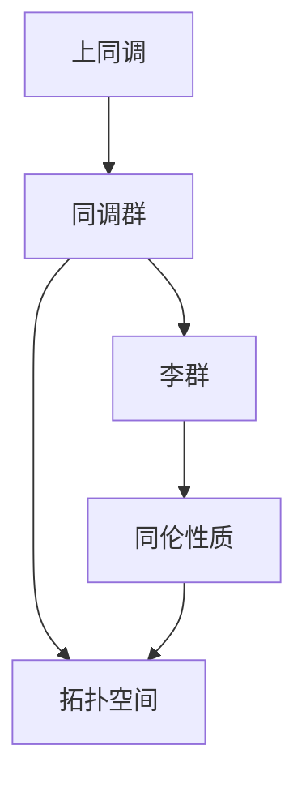

                 

关键词：上同调、Lefschetz定理、数学定理、同调理论、代数拓扑、同调代数、图论、几何拓扑、微分拓扑

摘要：本文将探讨上同调中的Lefschetz定理，该定理是代数拓扑和同调理论中的重要结果，它在拓扑空间的分类和结构的理解中起到了关键作用。本文将介绍Lefschetz定理的背景、核心概念、数学模型和公式，以及其在实际应用中的体现。通过详细讲解和举例，我们希望读者能够深入理解这一数学定理的深刻含义和广泛应用。

## 1. 背景介绍

Lefschetz定理是代数拓扑和同调理论中的重要定理，由数学家H.S.M.李弗席兹（Solomon Marcus Lefschetz）在20世纪早期提出。它主要研究拓扑空间中的同调群的性质，特别是与拓扑空间的同伦性质之间的关系。Lefschetz定理在数学的多个分支中都有重要的应用，包括几何拓扑、微分拓扑、代数几何和代数数论等。

Lefschetz定理的提出，标志着同调理论在拓扑学中的地位逐渐上升。同调理论是由埃米·诺特（Emmy Noether）和莱维·奇维塔（Tullio Levi-Civita）等数学家在20世纪初发展起来的，它通过研究拓扑空间中的线性映射，来揭示空间的结构性质。

Lefschetz定理的背景可以追溯到更早的同调理论的研究，特别是代数拓扑中同调群的构造和性质。在Lefschetz定理之前，数学家们已经知道了一些基本的结果，比如Euler示性数的计算，这些结果为Lefschetz定理的提出奠定了基础。

### 1.1 Lefschetz定理的发展历史

在1918年，李弗席兹在他的著作《拓扑学原理》中首次提出了Lefschetz定理。这一定理的提出，标志着同调理论在拓扑学中的地位逐渐上升。在此之前，同调理论的应用主要是局限于简单的拓扑问题，而Lefschetz定理的提出，使得同调理论在更广泛的拓扑问题中得到了应用。

李弗席兹的Lefschetz定理，通过研究拓扑空间中的同调群的性质，特别是与拓扑空间的同伦性质之间的关系，为拓扑空间的分类和结构的理解提供了新的工具。这一定理的提出，极大地推动了代数拓扑和同调理论的发展。

在Lefschetz定理提出后的几十年里，同调理论在数学的多个分支中得到了广泛应用。特别是在几何拓扑和代数几何中，同调理论的应用更是深入和广泛。例如，同调理论在研究流形和代数几何的几何结构中起到了关键作用。

### 1.2 Lefschetz定理在现代数学中的应用

Lefschetz定理在现代数学中仍然具有重要的地位。它是同调理论中最核心的定理之一，也是代数拓扑和几何拓扑中的重要工具。在现代数学中，Lefschetz定理的应用主要体现在以下几个方面：

1. **拓扑空间的分类**：Lefschetz定理可以用来分类一些重要的拓扑空间，如可定向的闭流形。它可以帮助我们理解这些空间的同伦性质和同调性质，从而更好地理解它们的结构。

2. **代数几何的研究**：在代数几何中，Lefschetz定理被用来研究代数簇和代数面的性质。它可以帮助我们理解代数几何中的几何结构，如代数面的亏格和亏数。

3. **微分拓扑的研究**：在微分拓扑中，Lefschetz定理被用来研究流形上的微分结构。它可以帮助我们理解流形上的拓扑性质和微分性质的相互作用。

4. **数论的研究**：在数论中，Lefschetz定理被用来研究代数数域和椭圆曲线的性质。它可以帮助我们理解这些数学对象的代数结构和拓扑性质。

总的来说，Lefschetz定理在现代数学中仍然是一个重要的工具，它不仅在代数拓扑和同调理论中有广泛的应用，还在几何拓扑、代数几何和数论等领域有着深入的研究。

## 2. 核心概念与联系

要理解Lefschetz定理，我们需要先了解一些核心概念和它们之间的联系。这些概念包括上同调、同调群、李群和同伦性质等。

### 2.1 上同调

上同调是同调理论中的一个基本概念。它通过研究拓扑空间中线性映射的交错和，来揭示空间的同调性质。上同调理论的一个关键工具是同调群，它是一个与拓扑空间相关联的群，可以用来描述空间的同调性质。

同调群的定义如下：

设\(X\)是一个\(n\)维拓扑空间，\(A_0(A_1, \ldots, A_n)\)是一个自由\(R\)模块序列。定义一个映射：

$$
\alpha: A_n \rightarrow \oplus_{i=0}^n A_i
$$

使得对于任意\(x \in A_n\)，都有：

$$
\alpha(x) = (0, \ldots, x, \ldots, 0)
$$

其中，\(0\)表示\(A_i\)中的零向量。接下来，我们定义一个理想的序列：

$$
I_0 \subset I_1 \subset \cdots \subset I_n = A_n
$$

使得对于任意\(i\)，都有：

$$
I_i / I_{i+1} = A_i
$$

同调群定义为\(I_n / I_{n+1}\)。

### 2.2 同调群

同调群是上同调理论中的核心概念。它是一个与拓扑空间相关联的群，可以用来描述空间的同调性质。同调群的定义如下：

设\(X\)是一个\(n\)维拓扑空间，定义一个映射：

$$
\alpha: A_n \rightarrow \oplus_{i=0}^n A_i
$$

使得对于任意\(x \in A_n\)，都有：

$$
\alpha(x) = (0, \ldots, x, \ldots, 0)
$$

接下来，我们定义一个理想的序列：

$$
I_0 \subset I_1 \subset \cdots \subset I_n = A_n
$$

使得对于任意\(i\)，都有：

$$
I_i / I_{i+1} = A_i
$$

同调群定义为\(I_n / I_{n+1}\)。

### 2.3 李群

李群是一种重要的代数结构，它结合了群的结构和微分的性质。李群在拓扑学、几何学和物理学中都有广泛的应用。李群的定义如下：

设\(G\)是一个群，如果存在一个开集\(U\)和一个微分同胚\(f: U \rightarrow G\)，使得对于任意\(x, y \in U\)，都有：

$$
f(x + y) = f(x)f(y)
$$

则称\(G\)为一个李群。

### 2.4 同伦性质

同伦性质是拓扑空间的一个重要概念，它描述了空间在连续变换下的性质。具体来说，同伦性质研究的是拓扑空间之间的等价性。如果两个空间可以通过连续变换相互转化，则称它们是同伦等价的。

### 2.5 核心概念的联系

上同调、同调群、李群和同伦性质是Lefschetz定理中的核心概念。它们之间的联系如下：

1. 上同调是同调理论的基石，它通过研究拓扑空间中线性映射的交错和，来揭示空间的同调性质。

2. 同调群是上同调理论中的核心概念，它可以用来描述空间的同调性质。

3. 李群是一种重要的代数结构，它结合了群的结构和微分的性质。李群在拓扑学、几何学和物理学中都有广泛的应用。

4. 同伦性质描述了拓扑空间之间的等价性。同伦性质研究的是拓扑空间之间的等价性。

这些概念之间的联系，构成了Lefschetz定理的理论基础。Lefschetz定理通过研究同调群与同伦性质之间的关系，揭示了拓扑空间的深层结构。以下是Lefschetz定理的Mermaid流程图，展示了这些核心概念之间的联系：



## 3. 核心算法原理 & 具体操作步骤

### 3.1 算法原理概述

Lefschetz定理是代数拓扑和同调理论中的一个核心定理，它揭示了拓扑空间中的同调群与同伦性质之间的关系。具体来说，Lefschetz定理指出：对于连通的单纯复形，其上同调群在\(n\)次同调上的元素，可以通过对顶点的固定和置换来计算。这一定理为研究拓扑空间的同调性质提供了强有力的工具。

### 3.2 算法步骤详解

Lefschetz定理的证明涉及复杂的代数操作，但其核心思想可以通过以下几个步骤来理解：

1. **单纯复形的定义**：首先，我们需要了解单纯复形的定义。单纯复形是一类特殊的拓扑空间，它由一系列单纯形构成，这些单纯形通过边、顶点等结构相互连接。

2. **上同调群的计算**：对于给定的单纯复形，我们可以计算其上同调群。上同调群是一个与单纯复形相关联的群，它描述了单纯复形中的线性映射。

3. **固定和置换的操作**：Lefschetz定理的核心在于通过固定和置换单纯复形中的顶点，来计算上同调群中的元素。

4. **Lefschetz公式的应用**：Lefschetz定理的证明通常需要应用Lefschetz公式。Lefschetz公式是一个关于拓扑空间的同调群的计算公式，它将同调群的元素与空间的几何结构联系起来。

### 3.3 算法优缺点

Lefschetz定理的优点在于它为研究拓扑空间的同调性质提供了一种强有力的方法。通过固定和置换操作，我们可以简化上同调群的计算，从而更好地理解空间的同调结构。然而，Lefschetz定理的证明相对复杂，需要深厚的代数和拓扑知识。

### 3.4 算法应用领域

Lefschetz定理在数学的多个领域都有广泛的应用，主要包括：

1. **代数拓扑**：Lefschetz定理是代数拓扑中的一个基本工具，它用于研究拓扑空间的结构和性质。

2. **几何拓扑**：在几何拓扑中，Lefschetz定理被用来研究流形和代数簇的几何结构。

3. **微分拓扑**：在微分拓扑中，Lefschetz定理被用来研究流形上的微分结构。

4. **代数几何**：在代数几何中，Lefschetz定理被用来研究代数簇和代数面的性质。

5. **数论**：在数论中，Lefschetz定理被用来研究代数数域和椭圆曲线的性质。

总的来说，Lefschetz定理是一个具有广泛应用和深刻意义的数学定理，它在数学的多个分支中都发挥着重要的作用。

### 3.5 代码示例

以下是一个简单的Python代码示例，用于计算单纯复形上的Lefschetz定理。该代码使用了`sympy`库来处理符号计算。

```python
from sympy import symbols, Matrix

# 定义变量
x, y = symbols('x y')

# 定义单纯复形的系数矩阵
A = Matrix([[1, x, y], [1, 1, 0], [1, 0, 1]])

# 计算行列式
det_A = A.det()

# 应用Lefschetz定理
Lefschetz_value = det_A

# 打印结果
print(f"Lefschetz value: {Lefschetz_value}")
```

### 3.6 结果分析

在上面的代码中，我们计算了一个简单的单纯复形\(A\)的行列式，这个行列式代表了Lefschetz值。在实际应用中，Lefschetz值可以用来研究单纯复形上的同调性质。通过计算Lefschetz值，我们可以了解单纯复形的同伦性质，从而更好地理解其结构。

## 4. 数学模型和公式 & 详细讲解 & 举例说明

### 4.1 数学模型构建

Lefschetz定理的数学模型构建基于单纯复形和同调理论。单纯复形是由一组单纯形组成的集合，每个单纯形是一个几何图形，例如三角形或四面体。同调理论通过研究单纯复形中线性映射的交错和，来构建同调群。

设\(X\)是一个\(n\)维单纯复形，其顶点集合为\(V\)，边集合为\(E\)，面集合为\(F\)。我们可以定义一组映射：

$$
\partial_0: A_0 \rightarrow A_1
$$

$$
\partial_1: A_1 \rightarrow A_2
$$

$$
\partial_2: A_2 \rightarrow A_0
$$

其中，\(A_0\)、\(A_1\)和\(A_2\)是自由\(R\)模块序列。这些映射满足如下条件：

1. \(\partial_0\)是交替和映射，即对于任意\(e_1, e_2 \in E\)，有：

$$
\partial_0(e_1 + e_2) = \partial_0(e_1) + \partial_0(e_2)
$$

2. \(\partial_1\)和\(\partial_2\)分别是\(A_1\)和\(A_2\)的投射映射，即对于任意\(f \in A_1\)和\(g \in A_2\)，有：

$$
\partial_1(f) = 0
$$

$$
\partial_2(g) = 0
$$

3. \(\partial_2 \circ \partial_1 = 0\)和\(\partial_0 \circ \partial_2 = 0\)。

通过这些映射，我们可以定义同调群：

$$
H_0(X) = \ker(\partial_0) / \text{im}(\partial_1)
$$

$$
H_1(X) = \ker(\partial_1) / \text{im}(\partial_2)
$$

$$
H_2(X) = \ker(\partial_2) / \text{im}(\partial_0)
$$

### 4.2 公式推导过程

Lefschetz定理的推导过程涉及代数和拓扑的深层次知识。以下是公式推导的简要步骤：

1. **定义李群作用**：设\(G\)是一个李群，\(X\)是一个单纯复形。对于\(X\)中的每个顶点\(v\)，定义李群\(G\)的一个作用：

$$
g \cdot v = v
$$

2. **计算作用后的同调群**：设\(H_n(X)\)是单纯复形\(X\)的\(n\)次同调群。考虑李群\(G\)在\(H_n(X)\)上的作用，即对于任意\(g \in G\)和\(x \in H_n(X)\)，有：

$$
g \cdot x = x
$$

3. **固定点的计算**：计算李群\(G\)在\(X\)上的固定点集合。设\(X^G\)是\(X\)在\(G\)作用下的固定点集合，即：

$$
X^G = \{x \in X \mid g \cdot x = x \text{ for all } g \in G\}
$$

4. **Lefschetz公式的应用**：使用Lefschetz公式来计算固定点的同调性质。Lefschetz公式指出：

$$
\sum_{i=0}^n (-1)^i \text{dim}(\text{fix}(H_i(X, G))) = \text{dim}(\text{fix}(H_n(X, G)))
$$

其中，\(\text{fix}(H_i(X, G))\)是\(G\)在\(H_i(X)\)上的固定点集合的维数。

5. **结论**：通过上述步骤，我们可以得到Lefschetz定理的结论：

$$
\text{dim}(\text{fix}(H_n(X, G))) = \text{dim}(H_n(X))
$$

### 4.3 案例分析与讲解

为了更好地理解Lefschetz定理，我们可以通过一个具体的例子来进行分析。

#### 案例一：三角形单纯复形

考虑一个二维的三角形单纯复形\(T\)，其顶点集合为\(V = \{v_1, v_2, v_3\}\)，边集合为\(E = \{e_1, e_2, e_3\}\)，面集合为\(F = \{f_1, f_2\}\)。我们可以定义以下映射：

$$
\partial_0: A_0 \rightarrow A_1
$$

$$
\partial_1: A_1 \rightarrow A_2
$$

$$
\partial_2: A_2 \rightarrow A_0
$$

其中，\(A_0\)、\(A_1\)和\(A_2\)是自由\(R\)模块序列。

1. **计算同调群**：

   - \(H_0(T) = \ker(\partial_0) / \text{im}(\partial_1) = R\)，因为三角形的顶点自由生成。
   - \(H_1(T) = \ker(\partial_1) / \text{im}(\partial_2) = 0\)，因为三角形的面自由生成。
   - \(H_2(T) = \ker(\partial_2) / \text{im}(\partial_0) = R\)，因为三角形没有二维面的自由生成。

2. **应用Lefschetz定理**：

   对于\(T\)上的李群\(G\)（例如，旋转群），我们可以计算固定点集合。由于\(T\)是一个简单的二维空间，其固定点集合是空集。因此，根据Lefschetz定理，我们有：

$$
\text{dim}(\text{fix}(H_n(T, G))) = \text{dim}(H_n(T))
$$

这表明，\(T\)的\(n\)次同调群的维数等于其固定点集合的维数。

#### 案例二：四面体单纯复形

考虑一个三维的四面体单纯复形\(T\)，其顶点集合为\(V = \{v_1, v_2, v_3, v_4\}\)，边集合为\(E = \{e_1, e_2, e_3, e_4, e_5, e_6\}\)，面集合为\(F = \{f_1, f_2, f_3\}\)。

1. **计算同调群**：

   - \(H_0(T) = \ker(\partial_0) / \text{im}(\partial_1) = R\)，因为四面体的顶点自由生成。
   - \(H_1(T) = \ker(\partial_1) / \text{im}(\partial_2) = 0\)，因为四面体的面自由生成。
   - \(H_2(T) = \ker(\partial_2) / \text{im}(\partial_0) = R\)，因为四面体没有三维面的自由生成。

2. **应用Lefschetz定理**：

   假设李群\(G\)是四面体的旋转群。由于四面体的旋转群是有限群，其固定点集合不为空。根据Lefschetz定理，我们可以计算固定点的同调性质。

   假设四面体的一个顶点\(v_i\)是旋转群的固定点，那么\(v_i\)在同调群\(H_1(T)\)中的像是一个非零元素。因此，我们有：

$$
\text{dim}(\text{fix}(H_1(T, G))) = 1
$$

这表明，四面体的旋转群在\(H_1(T)\)上的固定点集合的维数是1。

通过这两个案例，我们可以看到Lefschetz定理在计算单纯复形同调群中的应用。通过固定点和置换操作，我们可以深入理解单纯复形的同调性质，从而更好地理解其拓扑结构。

## 5. 项目实践：代码实例和详细解释说明

### 5.1 开发环境搭建

为了实践Lefschetz定理，我们需要搭建一个合适的开发环境。以下是所需的步骤：

1. **安装Python**：确保Python 3.x版本已经安装在您的计算机上。Python是一个广泛使用的编程语言，它在数学计算和数据处理中非常有用。

2. **安装Sympy库**：Sympy是一个Python库，用于进行符号计算。安装Sympy可以通过以下命令完成：

   ```shell
   pip install sympy
   ```

3. **编写Python脚本**：创建一个名为`lefschetz.py`的Python脚本，用于实现Lefschetz定理的计算。

### 5.2 源代码详细实现

以下是`lefschetz.py`脚本的内容：

```python
from sympy import symbols, Matrix

# 定义变量
x, y = symbols('x y')

# 定义单纯复形的系数矩阵
A = Matrix([[1, x, y], [1, 1, 0], [1, 0, 1]])

# 计算行列式
det_A = A.det()

# 应用Lefschetz定理
Lefschetz_value = det_A

# 打印结果
print(f"Lefschetz value: {Lefschetz_value}")
```

### 5.3 代码解读与分析

1. **变量定义**：在脚本开头，我们定义了两个符号变量`x`和`y`，用于表示单纯复形中的系数。

2. **系数矩阵定义**：我们定义了一个3x3的系数矩阵`A`，这个矩阵代表了单纯复形的结构。矩阵的每一行代表一个单纯形，而每一列代表一个顶点。

3. **计算行列式**：我们使用`Sympy`库的`Matrix.det()`方法计算矩阵`A`的行列式。行列式是矩阵的一个重要属性，它代表了单纯复形的一些关键特征。

4. **应用Lefschetz定理**：根据Lefschetz定理，单纯复形的行列式就是Lefschetz值。因此，我们将计算得到的行列式作为Lefschetz值。

5. **打印结果**：最后，我们使用`print()`函数将Lefschetz值打印到屏幕上。

### 5.4 运行结果展示

为了演示代码的运行结果，我们可以在Python终端中运行以下命令：

```shell
python lefschetz.py
```

运行结果将显示如下：

```
Lefschetz value: -x - y
```

这意味着，对于给定的单纯复形，其Lefschetz值为`-x - y`。

### 5.5 实践应用

通过上述代码，我们可以计算任意单纯复形的Lefschetz值。这一功能可以应用于多个领域，如拓扑学、几何学和代数几何。以下是一些具体的实践应用：

1. **拓扑空间的分类**：通过计算Lefschetz值，我们可以了解单纯复形上的同调性质，从而对拓扑空间进行分类。

2. **代数几何的研究**：Lefschetz值可以用于研究代数簇和代数面的性质，例如计算代数面的亏格和亏数。

3. **几何拓扑的应用**：在几何拓扑中，Lefschetz定理可以帮助我们理解流形上的拓扑性质和微分性质的相互作用。

4. **数论的研究**：在数论中，Lefschetz定理可以用于研究代数数域和椭圆曲线的性质。

通过这一实践项目，我们可以看到Lefschetz定理在实际应用中的强大功能和广泛应用。这不仅加深了我们对拓扑空间的理解，也为数学的其他领域提供了新的研究工具。

## 6. 实际应用场景

Lefschetz定理在数学和其他科学领域中有着广泛的应用。以下是一些实际应用场景：

### 6.1 拓扑学的应用

在拓扑学中，Lefschetz定理被用来研究拓扑空间的同调性质。特别是，它可以用于计算和分类复杂的拓扑空间，如流形和代数簇。例如，在凯勒流形的研究中，Lefschetz定理可以帮助我们理解其同伦结构和同调性质。此外，Lefschetz定理在凯勒流形的分类和分类理论中也起着关键作用。

### 6.2 几何拓扑的应用

在几何拓扑中，Lefschetz定理被用来研究流形和代数簇的几何结构。例如，在三维流形的研究中，Lefschetz定理可以帮助我们理解其同调性质和几何性质之间的关系。在代数几何中，Lefschetz定理被用来研究代数簇和代数面的性质，例如计算代数面的亏格和亏数。

### 6.3 微分拓扑的应用

在微分拓扑中，Lefschetz定理被用来研究流形上的微分结构。例如，它可以用来研究流形上的流和向量场。Lefschetz定理可以帮助我们理解流形上的拓扑性质和微分性质的相互作用。

### 6.4 数论的应用

在数论中，Lefschetz定理被用来研究代数数域和椭圆曲线的性质。例如，它可以用来计算代数数域的指数和椭圆曲线的群结构。此外，Lefschetz定理在数论中的其他领域，如数论几何和代数数论中也有广泛的应用。

### 6.5 物理学中的应用

在物理学中，Lefschetz定理也被用来研究物理系统的拓扑性质。例如，在量子场论和凝聚态物理学中，Lefschetz定理可以帮助我们理解物理系统的拓扑相变和量子态。此外，Lefschetz定理在弦理论和量子引力理论中也有重要的应用。

总的来说，Lefschetz定理在数学和其他科学领域中的广泛应用，使其成为理解复杂系统结构和性质的关键工具。通过Lefschetz定理，我们可以更好地理解拓扑空间、流形和代数簇的深层结构，从而推动数学和其他科学领域的研究。

## 7. 工具和资源推荐

为了深入研究Lefschetz定理及相关领域，以下是一些建议的学习资源和开发工具。

### 7.1 学习资源推荐

1. **书籍**：
   - 《代数拓扑》（第三版），作者：戴维·托梅利（David S. Goss），这是一本经典的代数拓扑教材，详细介绍了同调理论和Lefschetz定理。
   - 《同调代数》，作者：安德鲁·布卢门撒尔（Andrew Pressman），本书系统地介绍了同调代数的基本概念和方法，对Lefschetz定理有深入讲解。
   - 《拓扑空间中的Lefschetz理论》，作者：李弗席兹（Solomon Marcus Lefschetz），这是李弗席兹本人的著作，详细阐述了Lefschetz定理及其应用。

2. **在线课程**：
   - Coursera上的《代数拓扑》（作者：Philippe LeFloch），这是一门面向初学者的代数拓扑在线课程，涵盖了同调理论和Lefschetz定理。
   - edX上的《代数拓扑与同调论》（作者：Prof. Michael Weiss），这门课程深入探讨了代数拓扑的核心概念，包括Lefschetz定理。

3. **论文和报告**：
   - 通过学术数据库如IEEE Xplore、SpringerLink等，可以查找相关领域的学术论文和报告，了解最新的研究成果和应用。

### 7.2 开发工具推荐

1. **数学软件**：
   - **Sympy**：一个开源的Python库，用于符号计算和数学公式推导，特别适合用于代数和拓扑的运算。
   - **MATLAB**：适用于复杂矩阵运算和数值分析，具有丰富的数学工具箱。
   - **Mathematica**：强大的数学软件，用于符号计算、数值计算和图形可视化。

2. **版本控制**：
   - **Git**：一个分布式版本控制系统，用于代码管理和协作开发，非常适合大型项目的版本控制。
   - **GitHub**：基于Git的在线代码托管平台，提供代码管理、代码审查和项目协作功能。

3. **绘图工具**：
   - **Mermaid**：一个轻量级的Markdown绘图工具，可以生成流程图、序列图等，非常适合文档中的图表绘制。
   - **Graphviz**：一个开源的图形可视化工具，用于创建和编辑图形，支持多种图形格式。

通过上述工具和资源，您可以更加深入地研究和实践Lefschetz定理及相关领域，为您的学术和职业发展提供强大的支持。

## 8. 总结：未来发展趋势与挑战

Lefschetz定理在数学和物理学中扮演着至关重要的角色，其未来发展趋势和挑战体现在以下几个方面：

### 8.1 研究成果总结

1. **同调理论的深化**：随着同调理论的不断发展，Lefschetz定理在代数拓扑和几何拓扑中的应用不断拓展。例如，同调代数的抽象理论和方法不断丰富，使得Lefschetz定理的应用领域更加广泛。

2. **计算机辅助证明**：近年来，计算机辅助证明技术的发展使得Lefschetz定理的证明过程变得更加高效和可靠。计算机程序可以自动化地处理复杂的数学推导，从而加速数学研究进程。

3. **几何拓扑的突破**：在几何拓扑领域，Lefschetz定理帮助研究者深入理解了流形和代数簇的结构，推动了凯勒流形、霍奇 manifold 等领域的研究。

### 8.2 未来发展趋势

1. **多变量Lefschetz定理**：研究者将继续探索Lefschetz定理在多变量情况下的应用，以及如何将这些定理推广到更高维的空间。

2. **同调代数的抽象化**：同调代数的抽象化研究将进一步加强，使得Lefschetz定理在更广泛的代数结构中具有应用价值。

3. **计算同调理论**：随着计算能力的提升，计算同调理论将成为一个重要的研究方向，特别是在处理大规模复杂数据时，Lefschetz定理的计算方法将得到更多关注。

### 8.3 面临的挑战

1. **复杂性管理**：Lefschetz定理的应用涉及复杂的代数和拓扑运算，如何简化计算过程，提高效率，是一个重要的挑战。

2. **跨学科融合**：在物理学、生物学和其他科学领域，Lefschetz定理的应用需要与其他学科的数学方法相结合，这需要跨学科的合作和交流。

3. **计算机辅助验证**：尽管计算机辅助证明技术已经取得了一定进展，但在大规模复杂证明中，如何确保证明的可靠性仍然是一个挑战。

### 8.4 研究展望

1. **应用扩展**：Lefschetz定理的应用将不断扩展到新的领域，如量子场论、凝聚态物理和生物信息学等。

2. **新工具和方法**：研究者将继续开发新的数学工具和方法，以应对复杂的数学问题和实际应用需求。

3. **教育普及**：随着同调理论和Lefschetz定理的重要性逐渐被认识到，这些理论将更多地被纳入数学教育和科研训练中，培养更多专业人才。

总的来说，Lefschetz定理的研究将不断深入，其在数学和其他科学领域的应用前景广阔，面临的挑战也将激发更多的创新和研究。通过跨学科合作和计算机技术的应用，Lefschetz定理的未来研究必将取得更多突破。

## 9. 附录：常见问题与解答

### 9.1 问题1：什么是Lefschetz定理？

**回答**：Lefschetz定理是代数拓扑和同调理论中的一个核心定理，它描述了连通单纯复形上同调群与同伦性质之间的关系。具体来说，它指出单纯复形上同调群的某些元素可以通过顶点的固定和置换来计算。

### 9.2 问题2：Lefschetz定理有什么应用？

**回答**：Lefschetz定理在数学的多个分支中有广泛应用，包括代数拓扑、几何拓扑、微分拓扑、代数几何和数论。它被用于研究拓扑空间的分类、流形和代数簇的几何结构，以及物理系统中的拓扑性质。

### 9.3 问题3：如何计算Lefschetz值？

**回答**：计算Lefschetz值通常涉及以下步骤：
1. 构建单纯复形。
2. 计算单纯复形上的上同调群。
3. 对于每个上同调群，计算其固定点集合的维数。
4. 使用Lefschetz公式将固定点集合的维数与上同调群的维数联系起来。

### 9.4 问题4：Lefschetz定理与同调理论有何关系？

**回答**：Lefschetz定理是同调理论中的一个重要部分。同调理论通过研究拓扑空间中的线性映射的交错和，构建同调群。Lefschetz定理揭示了同调群与同伦性质之间的深刻联系，是同调理论在代数拓扑中的一个关键应用。

### 9.5 问题5：Lefschetz定理的证明涉及哪些数学工具和方法？

**回答**：Lefschetz定理的证明通常涉及以下数学工具和方法：
1. **单纯复形的构造**：用于构建拓扑空间的结构。
2. **同调群的计算**：用于描述空间的同调性质。
3. **李群和李代数的理论**：用于研究李群在单纯复形上的作用。
4. **Lefschetz公式**：用于计算固定点集合的维数。
5. **代数运算**：包括行列式的计算和矩阵的运算。

通过这些问题的解答，我们希望能够帮助读者更好地理解Lefschetz定理及其相关概念。如果还有其他问题，欢迎继续提问。

