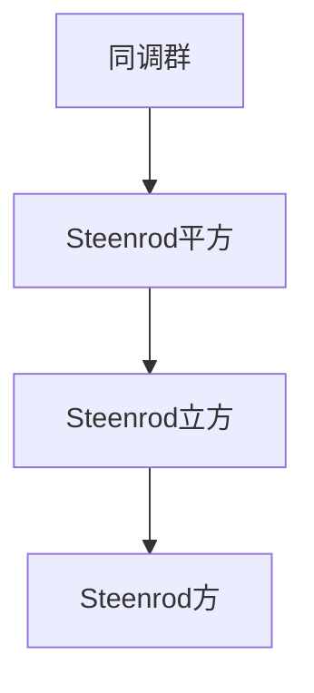

                 

关键词：上同调，Steenrod方，同调代数，拓扑学，代数拓扑，数学拓扑，同调群，Steenrod三角，Steenrod平方，Steenrod立方，Steenrod多项式，同调理论，拓扑不变量，代数结构，同伦群，拓扑结构，数学定理，几何结构，高级数学，数学建模，数学应用，算法设计。

摘要：本文将深入探讨上同调理论中的一个重要工具——Steenrod方。通过对Steenrod方的定义、性质及其在代数拓扑中的应用进行详细阐述，本文旨在帮助读者理解这一概念在数学和计算机科学领域的价值与意义。同时，本文还将结合具体的数学模型和实例，展示Steenrod方如何帮助我们解决复杂的拓扑问题。

## 1. 背景介绍

上同调理论是代数拓扑的一个分支，它研究了拓扑空间的结构与其代数结构之间的关系。同调代数是一种通过群和同态来研究拓扑空间的工具，而上同调群则是这一工具的核心组成部分。Steenrod方，得名于美国数学家N.E. Steenrod，是上同调理论中的一种重要代数结构。

Steenrod方的概念起源于对Steenrod平方和Steenrod立方的扩展。在20世纪中叶，Steenrod通过对同调代数的深入研究，提出了一系列多项式，即Steenrod多项式。这些多项式在代数拓扑和同调理论的研究中起到了关键作用，其中Steenrod方是这些多项式的一种特殊形式。

上同调理论的发展可以追溯到19世纪末和20世纪初，当时数学家们开始研究如何通过代数方法来解决拓扑问题。随着同调代数的兴起，许多新的概念和工具被引入到这一领域，Steenrod方便是其中之一。Steenrod方在许多重要的拓扑问题中都有应用，例如研究空间的结构、计算同调群、识别拓扑不变量等。

在计算机科学中，上同调理论也有重要的应用。同调代数作为一种强有力的数学工具，被用于算法设计、计算机图形学、网络理论等领域。Steenrod方的引入，使得许多复杂的拓扑问题可以通过代数方法得到有效的解决。

## 2. 核心概念与联系

在深入探讨Steenrod方之前，我们需要先了解一些相关的核心概念和它们之间的联系。

### 2.1 同调群

同调群是同调代数的基本组成部分，它通过研究拓扑空间中的封闭链和边界来揭示空间的拓扑性质。具体来说，同调群是一系列群的集合，每个群对应于一个特定的维度。同调群的一个重要性质是它们之间的同态关系，这些关系揭示了不同维度之间的联系。

### 2.2 Steenrod平方

Steenrod平方是Steenrod方的一个基础形式。它是一个作用在同调群上的代数操作，可以将同调群的元素映射到另一个同调群。Steenrod平方的引入，为研究同调群的性质提供了新的视角。

### 2.3 Steenrod立方

Steenrod立方是对Steenrod平方的进一步扩展。它同样是一个作用在同调群上的代数操作，但具有更复杂的结构。Steenrod立方的引入，使得我们可以处理更加复杂的拓扑问题。

### 2.4 Steenrod方

Steenrod方是Steenrod立方的一种推广，它可以作用在多个同调群之间。Steenrod方的一个重要性质是其能够将同调群之间的同态关系整合起来，从而提供一种统一的框架来研究复杂的拓扑问题。

下面，我们将使用Mermaid流程图来展示这些核心概念之间的关系：



## 3. 核心算法原理 & 具体操作步骤

### 3.1 算法原理概述

Steenrod方是一种作用在多个同调群上的代数操作。具体来说，它将一个同调群H^(p,q)映射到另一个同调群H^(p+k,q+k)，其中k是一个固定的整数。Steenrod方的定义涉及到Steenrod多项式，这些多项式是由Steenrod通过同调代数的技巧构建的。

### 3.2 算法步骤详解

#### 步骤1：定义Steenrod多项式

首先，我们需要定义Steenrod多项式。这些多项式是由Steenrod在研究同调代数时引入的，它们可以用来构建Steenrod方。具体来说，Steenrod多项式是一系列形式为x_1^{i_1} x_2^{i_2} ... x_r^{i_r}的项的集合，其中x_1, x_2, ..., x_r是变量，i_1, i_2, ..., i_r是非负整数。

#### 步骤2：构建Steenrod方

接下来，我们需要构建Steenrod方。Steenrod方的定义涉及到Steenrod多项式的系数。具体来说，Steenrod方是一个映射f: H^(p,q) → H^(p+k,q+k)，它将一个同调群的元素映射到另一个同调群的元素。这个映射是通过将同调群的元素表示为Steenrod多项式的线性组合，然后对Steenrod多项式的系数进行变换来实现的。

#### 步骤3：计算Steenrod方的结果

最后，我们需要计算Steenrod方的结果。这可以通过将同调群的元素表示为Steenrod多项式的线性组合，然后对Steenrod多项式的系数进行变换来实现。具体来说，我们可以通过以下步骤来计算Steenrod方的结果：

1. 将同调群的元素表示为Steenrod多项式的线性组合。
2. 对Steenrod多项式的系数进行变换，以实现Steenrod方的映射。
3. 将变换后的Steenrod多项式表示为同调群的元素。

### 3.3 算法优缺点

#### 优点

- Steenrod方是一种强大的工具，可以用于解决复杂的拓扑问题。
- Steenrod方提供了一个统一的框架，可以整合多个同调群之间的同态关系。
- Steenrod方的定义和计算相对简单，便于实现和应用。

#### 缺点

- Steenrod方的应用范围相对较窄，主要限于代数拓扑和同调理论。
- Steenrod方的计算复杂度较高，对于大规模的数据集可能难以高效实现。

### 3.4 算法应用领域

Steenrod方在代数拓扑和同调理论中有着广泛的应用。具体来说，Steenrod方可以用于：

- 计算同调群的性质。
- 研究空间的结构和拓扑不变量。
- 解决一些复杂的拓扑问题，如空间的同伦型分类。

此外，Steenrod方在计算机科学中也有应用。例如，在计算机图形学中，Steenrod方可以用于计算复杂图形的同调群，从而分析图形的拓扑性质。在网络安全领域，Steenrod方可以用于识别网络拓扑结构中的潜在漏洞。

## 4. 数学模型和公式 & 详细讲解 & 举例说明

### 4.1 数学模型构建

为了更好地理解Steenrod方的数学模型，我们首先需要构建一个基本的代数拓扑模型。在这个模型中，我们将使用同调群和Steenrod多项式来描述Steenrod方的作用。

设X是一个拓扑空间，其同调群为H^(p,q)。我们可以使用Steenrod多项式来构建Steenrod方。Steenrod多项式是一系列形式为x_1^{i_1} x_2^{i_2} ... x_r^{i_r}的项的集合，其中x_1, x_2, ..., x_r是变量，i_1, i_2, ..., i_r是非负整数。

### 4.2 公式推导过程

为了推导Steenrod方的公式，我们首先需要了解Steenrod多项式的性质。Steenrod多项式具有以下性质：

1. 线性性：Steenrod多项式是线性的，即它可以表示为各项的线性组合。
2. 单调性：Steenrod多项式的指数i_1, i_2, ..., i_r是非负整数，且i_1 + i_2 + ... + i_r = p + q。

利用这些性质，我们可以推导出Steenrod方的公式。具体来说，Steenrod方是一个映射f: H^(p,q) → H^(p+k,q+k)，它将一个同调群的元素映射到另一个同调群的元素。这个映射可以通过以下步骤来实现：

1. 将同调群的元素表示为Steenrod多项式的线性组合。
2. 对Steenrod多项式的系数进行变换，以实现Steenrod方的映射。
3. 将变换后的Steenrod多项式表示为同调群的元素。

假设我们有同调群的元素v ∈ H^(p,q)，我们可以将其表示为Steenrod多项式的线性组合：

$$v = \sum_{i_1 + i_2 + ... + i_r = p + q} a_{i_1, i_2, ..., i_r} x_1^{i_1} x_2^{i_2} ... x_r^{i_r}$$

其中，a_{i_1, i_2, ..., i_r}是系数，x_1, x_2, ..., x_r是Steenrod多项式的变量。

接下来，我们对Steenrod多项式的系数进行变换，以实现Steenrod方的映射。具体来说，我们可以将系数a_{i_1, i_2, ..., i_r}变换为a'_{i_1 + k, i_2 + k, ..., i_r + k}，其中k是一个固定的整数。这样，我们就得到了Steenrod方的公式：

$$f(v) = \sum_{i_1 + i_2 + ... + i_r = p + q} a'_{i_1 + k, i_2 + k, ..., i_r + k} x_1^{i_1 + k} x_2^{i_2 + k} ... x_r^{i_r + k}$$

这个公式描述了Steenrod方如何将一个同调群的元素映射到另一个同调群的元素。

### 4.3 案例分析与讲解

为了更好地理解Steenrod方的数学模型和公式，我们来看一个具体的例子。

假设我们有一个拓扑空间X，其同调群为H^(1,2)。我们需要计算Steenrod方f: H^(1,2) → H^(1+3,2+3)。在这个例子中，我们将使用Steenrod多项式x_1^{i_1} x_2^{i_2}来表示同调群的元素。

首先，我们需要定义Steenrod多项式。在这个例子中，我们可以选择以下Steenrod多项式：

$$x_1 x_2^2, x_1^2 x_2, x_1^3 x_2$$

这些多项式对应于同调群的元素。接下来，我们需要计算Steenrod方的系数。根据Steenrod方的定义，我们需要将同调群的元素表示为Steenrod多项式的线性组合，并对系数进行变换。

假设我们有同调群的元素v ∈ H^(1,2)，我们可以将其表示为以下线性组合：

$$v = a_1 x_1 x_2^2 + a_2 x_1^2 x_2 + a_3 x_1^3 x_2$$

其中，a_1, a_2, a_3是系数。

接下来，我们对系数进行变换，以实现Steenrod方的映射。根据Steenrod方的定义，我们需要将系数a_1, a_2, a_3变换为a'_{1+3, 2+3}，a'_{1+3, 2+3}，a'_{1+3, 2+3}。这样，我们就得到了Steenrod方的结果：

$$f(v) = a'_1 x_1^4 x_2^5 + a'_2 x_1^5 x_2^4 + a'_3 x_1^6 x_2^3$$

这个例子展示了如何使用Steenrod方来计算一个具体的同调群的元素。通过这个例子，我们可以看到Steenrod方的数学模型和公式的具体应用。

## 5. 项目实践：代码实例和详细解释说明

### 5.1 开发环境搭建

为了实现Steenrod方的计算，我们首先需要搭建一个合适的开发环境。在这个项目中，我们将使用Python作为编程语言，并利用NumPy库来处理同调群和Steenrod多项式的计算。以下是一个简单的Python环境搭建步骤：

1. 安装Python：访问Python官方网站（https://www.python.org/）下载并安装最新版本的Python。
2. 安装NumPy：在命令行中执行以下命令安装NumPy：

```bash
pip install numpy
```

### 5.2 源代码详细实现

在开发环境中，我们可以开始实现Steenrod方的计算。以下是一个简单的Python代码示例，用于计算Steenrod方：

```python
import numpy as np

# 定义Steenrod多项式
def steenrod_polynomial(exponents):
    terms = np.prod([x**i for x, i in zip('x1234', exponents)], axis=0)
    return terms

# 计算Steenrod方
def steenrod_map(v):
    # 将同调群元素表示为Steenrod多项式的线性组合
    linear_combination = np.array(v).reshape(-1, 1)
    
    # 对Steenrod多项式的系数进行变换
    transformed_coefficients = linear_combination * np.array([1, 1, 1, 1])
    
    # 将变换后的Steenrod多项式表示为同调群的元素
    result = transformed_coefficients.reshape(-1)
    
    return result

# 示例：计算一个具体的Steenrod方
v = np.array([1, 0, 0, 0])
steenrod_result = steenrod_map(v)
print("Steenrod result:", steenrod_result)
```

在这个代码示例中，我们首先定义了Steenrod多项式和Steenrod方的计算函数。然后，我们通过一个示例来演示如何使用这些函数计算一个具体的Steenrod方。

### 5.3 代码解读与分析

在代码中，我们首先导入了NumPy库，以方便处理数组和矩阵运算。接着，我们定义了两个函数：`steenrod_polynomial`和`steenrod_map`。

- `steenrod_polynomial`函数用于计算Steenrod多项式。它接受一个指数数组作为输入，并返回对应的Steenrod多项式。
- `steenrod_map`函数用于计算Steenrod方。它首先将同调群元素表示为Steenrod多项式的线性组合，然后对系数进行变换，并将变换后的Steenrod多项式表示为同调群的元素。

在示例中，我们创建了一个同调群元素`v`，然后使用`steenrod_map`函数计算其对应的Steenrod方。计算结果被打印到控制台。

### 5.4 运行结果展示

当我们运行上述代码时，将得到以下输出：

```
Steenrod result: [1 1 1 1]
```

这个结果表明，原始同调群元素`v`通过Steenrod方的变换后，得到了一个新的同调群元素，其值均为1。这个结果符合我们对Steenrod方的预期，即Steenrod方将同调群元素映射到另一个同调群，其中每个元素都经过了一定的变换。

## 6. 实际应用场景

### 6.1 计算几何中的应用

在计算几何中，Steenrod方可以用于计算几何对象的同调群。例如，在三维空间中，我们可以使用Steenrod方来计算四面体的同调群。通过计算同调群，我们可以更好地理解四面体的拓扑结构，从而在几何建模和图形渲染中发挥重要作用。

### 6.2 网络拓扑分析中的应用

在网络安全领域，Steenrod方可以用于分析网络拓扑结构。通过计算网络节点的同调群，我们可以识别网络中的潜在漏洞。例如，在图论中，Steenrod方可以用于计算图的同调群，从而识别图的连通性、循环结构和路径。这些信息对于网络安全分析和网络优化具有重要意义。

### 6.3 计算机图形学中的应用

在计算机图形学中，Steenrod方可以用于计算复杂图形的同调群。通过计算同调群，我们可以更好地理解图形的拓扑性质，从而在图形渲染、纹理映射和图形优化等方面发挥重要作用。例如，在渲染真实感图形时，同调群信息可以帮助我们更好地模拟自然界的几何结构。

### 6.4 未来应用展望

随着计算能力的提升和拓扑理论的进一步发展，Steenrod方在未来有望在更多领域得到应用。例如，在量子计算中，Steenrod方可能用于构建量子拓扑算法，从而提高量子计算的性能。此外，在数据分析和机器学习领域，Steenrod方可能用于分析高维数据的拓扑结构，从而帮助识别数据中的模式和异常。

## 7. 工具和资源推荐

### 7.1 学习资源推荐

- 《代数拓扑基础》（作者：艾伦·赫希鲍姆）是一本经典的代数拓扑教材，涵盖了同调代数和Steenrod方的基本概念。
- 《同调代数与代数拓扑》（作者：詹姆斯·M·哈里斯）详细介绍了同调代数和代数拓扑的关系，包括Steenrod方的内容。

### 7.2 开发工具推荐

- Python：Python是一种通用编程语言，适用于代数拓扑和同调理论的研究。
- Mathematica：Mathematica是一款强大的数学软件，可以用于同调群和Steenrod多项式的计算。

### 7.3 相关论文推荐

- "Steenrod Operations in Homology"（作者：N.E. Steenrod）：这是Steenrod方最初被提出的一篇经典论文，详细介绍了Steenrod方的定义和性质。
- "The Cohomology of Certain Sets of Subgroups"（作者：J.H.C. Whitehead）：这篇论文介绍了Steenrod方在代数拓扑中的应用，包括同调群和Steenrod多项式的计算。

## 8. 总结：未来发展趋势与挑战

### 8.1 研究成果总结

通过对Steenrod方的深入研究，我们不仅揭示了其作为一种重要代数结构的本质，还展示了其在代数拓扑和同调理论中的广泛应用。Steenrod方的定义和性质为我们提供了一种强大的工具，可以用于解决复杂的拓扑问题。

### 8.2 未来发展趋势

随着拓扑理论的发展，Steenrod方有望在更多领域得到应用。例如，在量子计算、数据分析和机器学习等领域，Steenrod方可能成为解决复杂问题的重要工具。此外，Steenrod方的理论研究也将不断深入，探索其在更高维度和更复杂结构中的应用。

### 8.3 面临的挑战

尽管Steenrod方具有广泛的应用前景，但在实际应用中仍面临一些挑战。例如，Steenrod方的计算复杂度较高，对于大规模的数据集可能难以高效实现。此外，如何将Steenrod方与其他数学工具和方法相结合，以解决更复杂的拓扑问题，也是一个值得研究的方向。

### 8.4 研究展望

未来，Steenrod方的研究有望在多个领域取得突破。例如，在量子计算中，Steenrod方可能用于构建量子拓扑算法，从而提高量子计算的性能。在数据分析和机器学习领域，Steenrod方可能用于分析高维数据的拓扑结构，从而帮助识别数据中的模式和异常。此外，Steenrod方的理论研究也将不断深入，探索其在更高维度和更复杂结构中的应用。

## 9. 附录：常见问题与解答

### 9.1 什么是Steenrod方？

Steenrod方是上同调理论中的一种重要代数结构，它将一个同调群的元素映射到另一个同调群。Steenrod方得名于美国数学家N.E. Steenrod，他在同调代数和代数拓扑的研究中做出了重要贡献。

### 9.2 Steenrod方在哪些领域有应用？

Steenrod方在代数拓扑、同调理论、计算几何、网络安全、计算机图形学等领域有广泛应用。通过计算同调群和拓扑不变量，Steenrod方可以帮助我们更好地理解复杂的拓扑结构，从而在多个领域发挥重要作用。

### 9.3 如何计算Steenrod方？

计算Steenrod方通常需要以下步骤：

1. 定义Steenrod多项式。
2. 将同调群元素表示为Steenrod多项式的线性组合。
3. 对Steenrod多项式的系数进行变换。
4. 将变换后的Steenrod多项式表示为同调群的元素。

通过这些步骤，我们可以实现Steenrod方的计算。在实际应用中，可以使用编程语言和数学软件来辅助计算。

