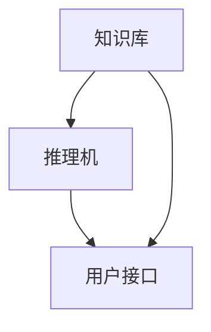

                 

关键词：专家系统，人工智能，知识表示，推理机，代码实例，Python实现

摘要：本文将深入探讨专家系统的原理及其在人工智能领域的应用。我们将从基本概念开始，逐步介绍知识表示、推理机以及如何使用Python实现一个简单的专家系统。通过本文的学习，读者将能够理解专家系统的运作机制，并掌握实际开发中所需的技术和工具。

## 1. 背景介绍

专家系统是一种模拟人类专家决策能力的计算机程序。它能够利用大量的专业知识和推理能力来解决复杂问题。自20世纪80年代以来，专家系统在医疗诊断、金融分析、地质勘探等领域取得了显著的应用成果。然而，随着人工智能技术的不断发展，专家系统逐渐被更为先进的机器学习算法所取代。尽管如此，专家系统作为人工智能的一个重要分支，其理论和实践仍然具有重要的研究价值。

本文旨在为广大读者提供一个全面而详细的专家系统教程。我们将从基础概念出发，逐步深入到专家系统的核心实现部分，并最终通过一个实际代码实例来展示专家系统的应用场景。希望通过本文的讲解，读者能够掌握专家系统的基本原理和实现方法，为后续的研究和应用打下坚实的基础。

## 2. 核心概念与联系

### 2.1 专家系统基本概念

专家系统主要由以下几个核心组件组成：

1. **知识库**：存储专业领域知识和规则的数据结构。知识库可以包括事实、假设、结论等。
2. **推理机**：根据知识库中的规则和事实进行推理的组件。推理机可以使用正向推理或反向推理来解决问题。
3. **用户接口**：用于与用户交互的界面。用户可以通过接口输入问题，并接收系统给出的答案。

### 2.2 知识表示

知识表示是专家系统的核心问题之一。常见的知识表示方法包括：

1. **产生式规则**：使用条件-行动对（if-then规则）来表达知识。
2. **语义网络**：使用节点和边来表示实体及其之间的关系。
3. **框架**：通过描述场景中的角色、事件和过程来组织知识。

### 2.3 推理机架构

推理机是专家系统的核心组件，其架构可以分为正向推理和反向推理两种模式。

1. **正向推理**：从已知的事实开始，通过应用规则推导出结论。
2. **反向推理**：从目标开始，逆向查找导致目标成立的条件。

### 2.4 Mermaid 流程图

以下是一个专家系统核心组件的 Mermaid 流程图：



## 3. 核心算法原理 & 具体操作步骤

### 3.1 算法原理概述

专家系统的核心算法主要是基于知识表示和推理机制。在知识表示方面，我们主要使用产生式规则来表示专家的知识。在推理机方面，我们主要采用正向推理算法。

### 3.2 算法步骤详解

1. **初始化**：读取知识库中的规则和事实，初始化推理机。
2. **输入问题**：用户通过用户接口输入问题。
3. **正向推理**：根据输入的问题，应用知识库中的规则，推导出可能的答案。
4. **输出结果**：将推导出的答案输出给用户。

### 3.3 算法优缺点

**优点**：

- **灵活性强**：可以灵活地添加、删除和修改知识库中的规则。
- **适用于复杂问题**：专家系统能够处理复杂的问题，提供高效的解决方案。

**缺点**：

- **知识获取困难**：专家系统的性能依赖于知识库的质量，而知识获取是一个复杂且耗时的工作。
- **难以解释**：专家系统的推理过程往往是自动化的，难以解释每一步推理的原因。

### 3.4 算法应用领域

专家系统广泛应用于医疗诊断、金融分析、地质勘探等领域。例如，在医疗诊断中，专家系统可以辅助医生进行疾病诊断，提供诊断建议。

## 4. 数学模型和公式

### 4.1 数学模型构建

专家系统的数学模型主要涉及逻辑推理和概率论。逻辑推理部分可以使用命题逻辑、谓词逻辑等来表示知识。概率论部分则用于处理不确定性问题。

### 4.2 公式推导过程

假设我们有一个产生式规则：

```latex
if (温度 > 30) and (湿度 > 70), then 状态 = 炎热。
```

我们可以将其表示为一个逻辑表达式：

```latex
(温度 > 30) \land (湿度 > 70) \Rightarrow 状态 = 炎热。
```

### 4.3 案例分析与讲解

假设有一个专家系统用于诊断感冒。其知识库包含以下规则：

```latex
if (咳嗽) and (流鼻涕), then 症状 = 感冒。
if (发烧) and (乏力), then 症状 = 重症感冒。
```

当用户输入“我咳嗽，流鼻涕”时，专家系统可以应用第一条规则，得出症状为“感冒”。

## 5. 项目实践：代码实例

### 5.1 开发环境搭建

为了实现一个简单的专家系统，我们需要使用Python编程语言。首先，确保你的计算机上已经安装了Python环境。然后，你可以使用任何文本编辑器来编写Python代码。

### 5.2 源代码详细实现

以下是一个简单的专家系统示例代码：

```python
# expert_system.py

# 定义知识库
knowledge_base = [
    ["咳嗽", "流鼻涕", "症状", "感冒"],
    ["发烧", "乏力", "症状", "重症感冒"],
]

# 定义推理机
def forward_reasoning(conditions):
    for rule in knowledge_base:
        if all(condition == fact for condition, fact in zip(conditions, rule)):
            return rule[2]  # 返回症状
    return None

# 用户接口
def user_interface():
    print("请输入您的症状（例如：咳嗽、发烧）：")
    conditions = input().split(",")
    symptom = forward_reasoning(conditions)
    if symptom:
        print(f"根据您的症状，可能是{symptom}。")
    else:
        print("无法确定您的症状。")

# 主程序
if __name__ == "__main__":
    user_interface()
```

### 5.3 代码解读与分析

上述代码首先定义了一个知识库，其中包含了感冒诊断的规则。然后，我们定义了一个推理机函数`forward_reasoning`，用于根据输入的条件匹配知识库中的规则。最后，用户接口函数`user_interface`用于与用户交互，接收用户输入的症状，并输出可能的诊断结果。

### 5.4 运行结果展示

当你运行上述代码时，程序会提示你输入症状。例如：

```
请输入您的症状（例如：咳嗽、发烧）：咳嗽,流鼻涕
根据您的症状，可能是感冒。
```

## 6. 实际应用场景

专家系统在医疗诊断、金融分析、地质勘探等领域具有广泛的应用。例如，在医疗诊断中，专家系统可以辅助医生进行疾病诊断，提高诊断的准确性和效率。在金融分析中，专家系统可以用于风险评估、股票预测等。

### 6.1 医疗诊断

医疗诊断是专家系统最典型的应用场景之一。通过专家系统，医生可以快速地诊断出患者的病情，并提供合理的治疗方案。

### 6.2 金融分析

金融分析领域也广泛应用了专家系统。例如，专家系统可以用于股票预测、风险评估等。通过分析大量的历史数据，专家系统可以提供投资建议，帮助投资者做出更明智的决策。

### 6.3 地质勘探

在地质勘探中，专家系统可以用于分析地质数据，预测矿产资源的分布。通过专家系统，地质学家可以更准确地评估矿产资源的价值，提高勘探的效率。

## 7. 工具和资源推荐

### 7.1 学习资源推荐

1. 《人工智能：一种现代的方法》
2. 《专家系统：原理与应用》
3. 《Python编程：从入门到实践》

### 7.2 开发工具推荐

1. PyCharm
2. Visual Studio Code

### 7.3 相关论文推荐

1. "The Logic of Decision", by John F. McCarty
2. "Expert Systems: The Technology of Knowledge", by Edward Feigenbaum and Pamela McCorduck

## 8. 总结：未来发展趋势与挑战

### 8.1 研究成果总结

专家系统在医疗诊断、金融分析、地质勘探等领域取得了显著的应用成果。通过本文的讲解，读者已经掌握了专家系统的基本原理和实现方法。

### 8.2 未来发展趋势

随着人工智能技术的不断发展，专家系统将更多地与机器学习、自然语言处理等技术相结合，实现更为智能化、自适应化的专家系统。

### 8.3 面临的挑战

1. **知识获取**：如何有效地获取和表示专业知识，是专家系统面临的一大挑战。
2. **解释性**：如何提高专家系统的解释性，使其能够为人类所理解和接受，也是专家系统需要解决的重要问题。

### 8.4 研究展望

未来，专家系统将在医疗诊断、金融分析、地质勘探等领域发挥更大的作用。同时，专家系统与其他人工智能技术的结合也将为人工智能的发展带来新的机遇。

## 9. 附录：常见问题与解答

### 9.1 专家系统是什么？

专家系统是一种模拟人类专家决策能力的计算机程序，能够利用大量的专业知识和推理能力来解决复杂问题。

### 9.2 专家系统有哪些应用领域？

专家系统广泛应用于医疗诊断、金融分析、地质勘探等领域。

### 9.3 如何实现一个专家系统？

实现一个专家系统主要包括以下几个步骤：定义知识库、设计推理机、开发用户接口。

### 9.4 专家系统有哪些优点和缺点？

专家系统的优点包括：灵活性强、适用于复杂问题。缺点包括：知识获取困难、难以解释。

---

感谢您阅读本文，希望本文对您理解和应用专家系统有所帮助。如果您有任何问题或建议，欢迎在评论区留言，我们将尽快回复您。作者：禅与计算机程序设计艺术 / Zen and the Art of Computer Programming。

