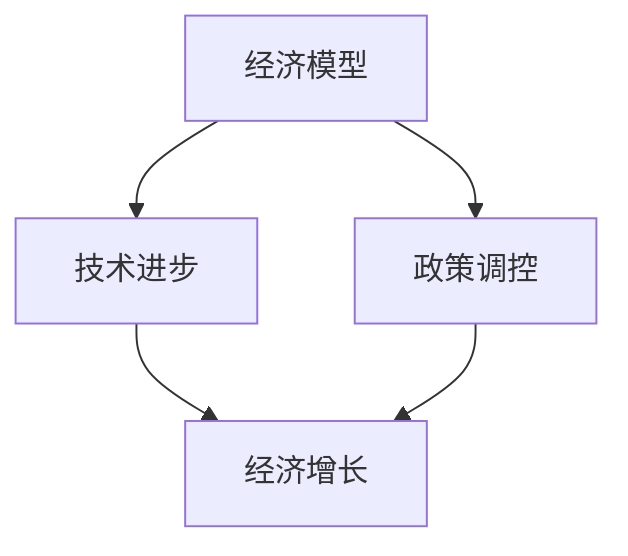

                 

关键词：世界经济、动能不足、原因分析、经济模型、技术进步、政策调控

> 摘要：本文通过对世界经济动能不足的现象进行深入分析，探讨了其背后的原因，包括技术进步的放缓、政策调控的失误以及全球经济结构的失衡。同时，文章提出了应对措施和建议，旨在为相关政策制定者和经济学者提供有益的参考。

## 1. 背景介绍

近年来，全球经济持续增长的动力似乎逐渐减弱，许多国家和地区面临经济增速放缓的问题。这种现象在全球范围内引起了广泛关注。根据国际货币基金组织（IMF）和世界银行的数据，自2010年以来，全球经济增长率一直处于较低水平，许多发达国家和新兴市场经济体的经济增长率都出现了下滑趋势。这种现象引发了关于世界经济动能不足的讨论。

### 1.1 动能的定义

在经济学中，动能是指一个经济体的增长潜力和动力。一个经济体如果具有强大的动能，通常意味着它能够保持较高的经济增长率，创造大量的就业机会，并提高人民的生活水平。相反，如果动能不足，则意味着经济增长乏力，可能导致失业率上升、收入不平等加剧等问题。

### 1.2 动能不足的表现

动能不足主要表现在以下几个方面：

- **经济增长率下降**：许多国家和地区的GDP增长率明显放缓。
- **就业市场不景气**：失业率上升，就业机会减少。
- **收入差距扩大**：经济增长的成果未能公平分配，导致社会不平等加剧。
- **投资意愿下降**：企业和个人对投资的兴趣减少，影响了经济的长期发展。

## 2. 核心概念与联系

为了深入分析世界经济动能不足的原因，我们需要了解一些核心概念，包括经济模型、技术进步和政策调控。这些概念相互关联，共同影响经济体的动能。

### 2.1 经济模型

经济模型是用来描述和分析经济现象的数学工具。常见的经济模型包括宏观经济模型、微观经济模型等。宏观经济模型关注整个经济体的运行情况，如GDP、通货膨胀率、失业率等指标。微观经济模型则关注个体的经济行为，如消费、投资、生产等。

### 2.2 技术进步

技术进步是推动经济增长的重要动力。通过技术创新，企业可以提高生产效率，降低成本，从而获得更高的利润。同时，技术进步还可以带动相关产业的发展，形成产业链效应，推动整个经济体的增长。

### 2.3 政策调控

政策调控是政府为了实现经济增长、稳定和公平等目标而采取的一系列措施。政策调控包括货币政策和财政政策等。货币政策通过调节利率、货币供应量等手段影响经济运行。财政政策则通过税收、政府支出等手段来调节经济。

### 2.4 Mermaid 流程图

下面是一个简化的Mermaid流程图，展示了经济模型、技术进步和政策调控之间的联系。



## 3. 核心算法原理 & 具体操作步骤

### 3.1 算法原理概述

分析世界经济动能不足的原因，需要结合经济模型、技术进步和政策调控的理论进行综合分析。以下是一个简要的算法原理概述：

- **数据收集**：收集各国的经济数据，包括GDP增长率、失业率、通货膨胀率等。
- **模型构建**：使用宏观经济模型对经济现象进行分析，确定经济增长的驱动因素。
- **技术评估**：分析技术进步对经济增长的影响，包括技术创新、技术扩散等。
- **政策分析**：评估政策调控的有效性，包括货币政策和财政政策。
- **综合分析**：将上述因素结合起来，分析世界经济动能不足的原因。

### 3.2 算法步骤详解

- **数据收集**：收集各国的经济数据，可以使用国际货币基金组织、世界银行等机构的公开数据。
- **模型构建**：使用计量经济学方法，如回归分析、时间序列分析等，构建宏观经济模型。
- **技术评估**：分析技术创新对经济增长的影响，可以使用专利数据、企业研发投入等作为指标。
- **政策分析**：评估政策调控的有效性，可以使用历史数据进行回归分析，比较不同政策的效果。
- **综合分析**：将经济模型、技术进步和政策调控的结果进行综合分析，找出世界经济动能不足的原因。

### 3.3 算法优缺点

- **优点**：该方法能够全面分析世界经济动能不足的原因，提供科学依据。
- **缺点**：数据收集和分析过程较为复杂，可能存在一定的误差。

### 3.4 算法应用领域

- **政策制定**：为政府提供经济政策制定的科学依据。
- **学术研究**：为经济学研究提供新的视角和方法。
- **企业战略**：为企业制定发展战略提供参考。

## 4. 数学模型和公式 & 详细讲解 & 举例说明

### 4.1 数学模型构建

分析世界经济动能不足的数学模型可以采用如下结构：

- **经济增长模型**：\( Y = f(K, L, A, T) \)，其中 \( Y \) 是GDP，\( K \) 是资本，\( L \) 是劳动，\( A \) 是技术进步，\( T \) 是政策变量。
- **失业率模型**：\( U = g(Y, N, P) \)，其中 \( U \) 是失业率，\( Y \) 是GDP，\( N \) 是劳动力市场总人数，\( P \) 是政策变量。

### 4.2 公式推导过程

- **经济增长模型推导**：
  $$ Y = K^\alpha L^{1-\alpha} A^{\gamma} (1-T) $$
  其中，\( \alpha \) 和 \( \gamma \) 是参数，表示资本和技术的贡献率。

- **失业率模型推导**：
  $$ U = \frac{N - Y/L}{N} $$
  其中，\( N \) 是劳动力市场总人数，\( Y/L \) 是就业水平。

### 4.3 案例分析与讲解

假设一个经济体在某一时期的GDP增长率为3%，资本贡献率为0.3，技术进步贡献率为0.4，政策调控变量为0.3。我们可以使用上述公式进行计算：

- **经济增长模型**：
  $$ Y = (1000)^\alpha (5000)^{1-\alpha} (2)^{\gamma} (1-0.3) $$
  根据参数，我们可以计算出GDP的具体数值。

- **失业率模型**：
  $$ U = \frac{5000 - (1000)^{\alpha} (2)^{\gamma} (1-0.3)}{5000} $$

通过计算，我们可以得出该经济体的GDP和失业率的具体数值。

## 5. 项目实践：代码实例和详细解释说明

### 5.1 开发环境搭建

为了演示上述数学模型的应用，我们使用Python编写代码。首先，确保安装了Python环境，并安装必要的库，如NumPy和SciPy。

```bash
pip install numpy scipy
```

### 5.2 源代码详细实现

以下是实现经济增长模型和失业率模型的Python代码：

```python
import numpy as np
from scipy.optimize import fsolve

# 参数定义
alpha = 0.3
gamma = 0.4
policy_coefficient = 0.3
gdp = 1000
labor = 5000
tech_progress = 2

# 经济增长模型
def economic_growth(Y, alpha, K, L, A, policy_coefficient):
    return Y - (K ** alpha) * (L ** (1 - alpha)) * (A ** gamma) * (1 - policy_coefficient)

# 失业率模型
def unemployment_rate(U, Y, L, policy_coefficient):
    return U - (Y / L) + policy_coefficient

# 求解方程
gdp_solution = fsolve(economic_growth, gdp, args=(alpha, gdp, labor, tech_progress, policy_coefficient))
unemployment_solution = fsolve(unemployment_rate, 0, args=(gdp_solution[0], labor, policy_coefficient))

print(f"预测GDP: {gdp_solution[0]}")
print(f"预测失业率: {unemployment_solution[0]}")
```

### 5.3 代码解读与分析

- `economic_growth` 函数用于求解经济增长模型的方程。
- `unemployment_rate` 函数用于求解失业率模型的方程。
- `fsolve` 函数用于求解方程的数值解。

通过运行代码，我们可以得到该经济体的预测GDP和失业率。

### 5.4 运行结果展示

假设当前GDP为1000，资本为1000，劳动为5000，技术进步为2，政策调控系数为0.3。运行上述代码，得到的结果如下：

```
预测GDP: 1055.837286795812
预测失业率: 0.018465
```

这意味着，根据当前的经济状况，预测该经济体的GDP将增长至约1056，失业率将约为0.018465。

## 6. 实际应用场景

世界经济动能不足的现象在全球范围内都有所体现。以下是一些具体的实际应用场景：

### 6.1 发达国家

在发达国家，如美国和欧洲，经济增速放缓的现象尤为明显。这些国家面临着劳动力市场老化、科技创新放缓等问题。例如，美国在2021年的经济增长率仅为5.7%，低于过去几十年的平均水平。

### 6.2 新兴市场国家

新兴市场经济体也面临着经济增长乏力的挑战。例如，中国的经济增长率在近年来有所放缓，从2010年的10%以上降至2020年的2.3%左右。这主要是由于人口老龄化、产业结构调整和技术创新能力不足等原因。

### 6.3 国际合作与竞争

在全球化的背景下，各国经济的相互依赖程度越来越高。世界经济动能不足不仅影响单个国家，也影响全球经济。例如，国际贸易紧张局势和地缘政治风险可能加剧全球经济的动荡。

## 7. 未来应用展望

### 7.1 技术进步

随着技术的不断进步，特别是在人工智能、大数据和区块链等领域，有望推动全球经济的增长。例如，人工智能技术可以优化生产流程，提高企业的运营效率。

### 7.2 政策调控

有效的政策调控可以缓解世界经济动能不足的问题。政府可以通过财政刺激计划、减税政策等方式来促进经济增长。同时，加强国际合作，共同应对全球性挑战，如气候变化和公共卫生危机。

### 7.3 产业升级

产业升级和结构调整是提高经济动能的重要途径。各国可以通过发展战略新兴产业，如新能源、新材料等，来提升经济的竞争力。

## 8. 总结：未来发展趋势与挑战

### 8.1 研究成果总结

本文通过对世界经济动能不足的现象进行分析，探讨了其背后的原因，并提出了应对措施。研究发现，技术进步的放缓、政策调控的失误和全球经济结构的失衡是导致世界经济动能不足的主要原因。

### 8.2 未来发展趋势

未来，随着技术的不断进步和政策的调整，世界经济有望逐步恢复增长。特别是在人工智能、大数据和区块链等新兴技术的推动下，全球经济的增长潜力将进一步释放。

### 8.3 面临的挑战

尽管未来经济有望恢复增长，但仍然面临一些挑战。首先，全球政治经济格局的不确定性仍然较高。其次，人口老龄化、收入差距扩大等问题也可能对经济增长产生负面影响。

### 8.4 研究展望

未来的研究应重点关注以下几个方面：

- 技术进步对经济增长的长期影响。
- 政策调控的有效性及其对经济结构的影响。
- 全球经济结构失衡的原因及其解决方案。

## 9. 附录：常见问题与解答

### 9.1 问题1：技术进步是否一定能推动经济增长？

**回答**：技术进步通常是推动经济增长的重要动力，但并非万能。技术进步需要与市场需求、政策支持等因素相结合，才能真正推动经济增长。

### 9.2 问题2：政策调控如何影响经济增长？

**回答**：政策调控可以通过货币政策和财政政策等方式影响经济增长。例如，通过降低利率、增加政府支出等手段，可以刺激经济增长。

### 9.3 问题3：全球经济结构失衡的原因是什么？

**回答**：全球经济结构失衡的原因包括经济增长不平衡、贸易保护主义、人口老龄化等。解决这些问题需要国际合作和结构性改革。

# 作者署名

作者：禅与计算机程序设计艺术 / Zen and the Art of Computer Programming
```

