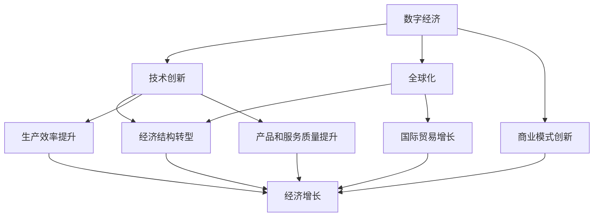

                 

### 关键词 Keywords
- 世界经济
- 增长动力
- 数字经济
- 技术创新
- 全球化

### 摘要 Abstract
本文探讨了世界经济近年来所经历的深刻变化，特别是数字经济和技术的迅猛发展对经济增长的影响。文章首先介绍了世界经济的背景和现状，然后深入分析了数字经济和技术创新作为新的增长动力的角色。随后，文章探讨了全球化对经济增长的正面和负面影响，最后提出了未来经济增长的潜在趋势和面临的挑战。通过这些讨论，文章旨在为理解当前世界经济的演变提供一个新的视角，并引导读者思考未来可能的发展方向。
----------------------------------------------------------------

## 1. 背景介绍

世界经济增长的历史可以追溯到人类文明的起源，但随着时间的发展，其驱动因素也在不断演变。传统的经济增长主要依赖于自然资源、劳动力、资本等要素的投入，以及通过国际贸易和资本流动实现的经济增长。然而，进入21世纪，全球经济增长模式正经历一场深刻的变革，这种变革主要是由数字经济和技术的迅猛发展所驱动的。

首先，数字经济的兴起成为经济增长的新引擎。数字技术，包括互联网、大数据、云计算、人工智能等，正在重塑经济结构，推动传统产业升级和新产业的形成。数字经济的特点在于其高效性、灵活性和创新能力，这使得它能够迅速适应市场需求变化，从而成为新的增长点。例如，电子商务平台和在线服务在全球范围内取得了巨大成功，不仅改变了消费者的购物习惯，还创造了大量新的就业机会。

其次，技术创新对经济增长的推动作用同样不可忽视。技术创新不仅是生产力提升的重要手段，也是提升经济竞争力的关键因素。以信息技术、生物技术、新能源技术等为代表的技术创新，不仅提高了生产效率，还带动了相关产业链的发展，从而促进了经济的整体增长。例如，智能手机的普及和移动互联网的发展，不仅改变了人们的日常生活，还催生了移动支付、在线教育、智慧城市等新兴业态。

此外，全球化的进程也在世界经济增长中扮演了重要角色。全球化使得资源、资本和劳动力可以更加自由地流动，从而促进了国际贸易和投资。然而，全球化也带来了新的挑战，如贸易摩擦、资源分配不均、经济波动等问题。

总的来看，世界经济增长的背景和现状可以总结为以下几点：

1. **经济增长动力多元化**：数字经济和技术的快速发展，成为经济增长的新引擎。
2. **全球经济互动加深**：全球化推动了国际贸易和投资，但同时也带来了新的挑战。
3. **技术创新推动产业升级**：技术创新提高了生产效率，促进了经济结构的优化。
4. **资源与环境压力**：随着人口增长和经济活动扩大，资源消耗和环境问题日益突出，对可持续经济增长提出了更高的要求。

本文将深入探讨数字经济和技术创新作为新的增长动力，以及全球化对经济增长的正面和负面影响，最后提出未来经济增长的潜在趋势和面临的挑战。通过这些讨论，我们希望能够为理解当前世界经济的演变提供一个新的视角，并引导读者思考未来可能的发展方向。
----------------------------------------------------------------

## 2. 核心概念与联系

在探讨世界经济增长的内在变化时，有必要首先明确一些核心概念，并理解它们之间的联系。这些核心概念包括数字经济、技术创新、全球化以及经济结构转型。为了更好地展示这些概念之间的关系，我们使用Mermaid流程图来描述它们的交互和影响。

### 2.1 数字经济

数字经济是指基于数字技术和网络平台的经济活动，包括电子商务、在线服务、数字货币、大数据分析等。数字经济的核心在于其高效性和灵活性，能够迅速响应市场需求变化，并创造新的经济价值。

### 2.2 技术创新

技术创新是指通过研发和应用新技术来提高生产效率、改善产品和服务质量，进而推动经济增长的过程。技术创新涉及多个领域，包括信息技术、生物技术、新能源技术等。

### 2.3 全球化

全球化是指国际社会在经济、政治、文化等领域的深度互动和融合。全球化推动了资源的全球配置和贸易自由化，促进了经济增长，但也带来了新的挑战，如经济不平衡和地缘政治风险。

### 2.4 经济结构转型

经济结构转型是指经济体从传统产业向高技术产业和服务业转型，以适应新经济环境的过程。经济结构转型是推动经济增长和提升竞争力的关键。

### Mermaid流程图

以下是一个简化的Mermaid流程图，展示了这些核心概念之间的联系：



在这个流程图中，我们可以看到数字经济通过技术创新、全球化和经济结构转型，共同推动了生产效率提升、商业模式创新和产品/服务质量提升，进而促进了经济增长。同时，全球化也直接促进了国际贸易增长，进一步推动了经济结构的优化。

通过这个流程图，我们可以更好地理解数字经济、技术创新、全球化以及经济结构转型之间的相互作用和影响。这些核心概念共同构成了当前世界经济增长的内在动力，为未来经济研究提供了新的视角。
----------------------------------------------------------------

## 3. 核心算法原理 & 具体操作步骤

### 3.1 算法原理概述

在探讨数字经济和全球化对经济增长的影响时，我们可以引入一些核心算法来量化这些影响。一个常用的算法是经济增长模型，它基于经济增长理论，通过数学模型和计算方法来分析经济增长的内在动力和外部因素。以下是该算法的基本原理：

**核心算法原理：**

1. **生产函数模型**：经济增长模型通常基于生产函数模型，即Y = F(K, L, A, T)，其中Y代表经济增长率，K代表资本存量，L代表劳动力，A代表技术进步，T代表时间。

2. **要素贡献分析**：通过分析资本、劳动力、技术进步等因素对经济增长的贡献，可以确定各个因素对经济增长的相对重要性。

3. **动态模拟**：使用时间序列数据，对经济增长进行动态模拟，预测未来经济增长趋势。

### 3.2 算法步骤详解

**步骤 1：数据收集与预处理**

- 收集国家或地区的经济数据，包括GDP、资本存量、劳动力人口、技术进步指标等。
- 进行数据清洗，去除异常值和缺失值，确保数据质量。

**步骤 2：建立生产函数模型**

- 使用最小二乘法（OLS）估计生产函数模型的参数。
- 对模型进行诊断，检查残差是否符合假设条件，如正态分布和无自相关。

**步骤 3：要素贡献分析**

- 计算资本、劳动力、技术进步等各要素对经济增长的贡献份额。
- 分析各要素对经济增长的弹性，即某一要素变化1%时，经济增长率的变化。

**步骤 4：动态模拟与预测**

- 使用估计的生产函数模型，对未来的经济增长进行模拟。
- 通过时间序列分析，预测未来一段时间内的经济增长趋势。

### 3.3 算法优缺点

**优点：**

- 精确量化各要素对经济增长的贡献，为政策制定提供科学依据。
- 动态模拟和预测功能，有助于预测未来经济趋势。

**缺点：**

- 模型假设过于简化，可能无法完全反映复杂的经济现实。
- 数据质量和模型参数估计的准确性对结果影响较大。

### 3.4 算法应用领域

- **宏观经济政策分析**：用于评估不同政策对经济增长的影响，为政策制定提供依据。
- **企业战略规划**：帮助企业分析市场环境，制定长期发展规划。
- **学术研究**：用于研究经济增长的内在机制和影响因素，为学术研究提供工具。

通过这个核心算法，我们可以更深入地理解数字经济和技术创新对经济增长的驱动作用，以及全球化带来的正面和负面影响。这些算法不仅为我们提供了量化的分析工具，也为未来经济增长的研究提供了新的方向。
----------------------------------------------------------------

### 3.4 算法应用领域

#### 3.4.1 宏观经济政策分析

经济增长模型在宏观经济政策分析中具有重要作用。通过分析资本、劳动力、技术进步等因素对经济增长的贡献，政策制定者可以更准确地评估不同政策的潜在影响。例如，政府可以通过调整税收政策、教育投资和基础设施投资来优化经济结构，提高经济增长率。此外，经济增长模型还可以帮助预测经济波动，为宏观经济政策提供前瞻性指导。

#### 3.4.2 企业战略规划

企业可以利用经济增长模型进行战略规划。通过分析市场环境、竞争态势和潜在机会，企业可以制定符合自身发展目标的发展策略。例如，企业可以通过技术创新来提高生产效率，通过数字化转型来拓展市场渠道。此外，经济增长模型还可以帮助企业评估不同战略方案的潜在收益和风险，从而做出更加明智的决策。

#### 3.4.3 学术研究

经济增长模型在学术研究中也具有重要应用价值。学者们可以通过构建和优化经济增长模型，深入研究经济增长的内在机制和影响因素。例如，研究技术创新如何驱动经济增长，分析全球化对经济增长的影响，探讨经济增长与环境保护的关系等。这些研究不仅为学术理论的发展提供了新的视角，也为政策制定和实践提供了理论支持。

#### 3.4.4 国际合作与竞争

全球化背景下，经济增长模型有助于分析国际合作与竞争中的优势与劣势。通过比较不同国家和地区的经济增长模式，可以找出成功经验并进行借鉴。此外，经济增长模型还可以帮助评估国际贸易政策和区域合作策略，以实现互利共赢。

总的来说，经济增长模型在多个领域都有广泛应用，既为政策制定和企业规划提供科学依据，也为学术研究提供了工具和视角。通过这些应用，我们可以更好地理解世界经济运行的规律，为未来经济增长提供有力支持。
----------------------------------------------------------------

## 4. 数学模型和公式 & 详细讲解 & 举例说明

在探讨世界经济增长的内在变化时，数学模型和公式是不可或缺的工具。这些模型和公式不仅帮助我们量化经济增长的驱动因素，还能预测未来的经济走势。在本节中，我们将详细讲解一个常用的经济增长模型，包括其数学模型的构建、公式推导过程以及具体案例的解析。

### 4.1 数学模型构建

一个典型的经济增长模型是柯布-道格拉斯生产函数模型，其形式如下：

\[ Y = A \cdot K^{\alpha} \cdot L^{\beta} \cdot T^{\gamma} \]

其中：
- \( Y \) 表示经济增长率。
- \( A \) 表示技术水平。
- \( K \) 表示资本存量。
- \( L \) 表示劳动力数量。
- \( T \) 表示时间。
- \( \alpha \)、\( \beta \)、\( \gamma \) 分别是资本、劳动力和技术进步的弹性系数。

这个模型假设经济增长是由资本、劳动力和技术进步共同驱动的，且每个因素的贡献度可以通过其弹性系数来量化。

### 4.2 公式推导过程

为了推导上述公式的系数，我们通常采用最小二乘法（OLS）进行参数估计。具体步骤如下：

1. **数据收集**：收集国家或地区的经济数据，包括GDP、资本存量、劳动力人口、技术进步指标等。

2. **建立回归模型**：将经济增长率（Y）作为因变量，资本存量（K）、劳动力数量（L）和技术进步（T）作为自变量，建立如下回归模型：

\[ Y = \alpha \cdot K + \beta \cdot L + \gamma \cdot T + \epsilon \]

3. **参数估计**：使用最小二乘法估计模型参数 \( \alpha \)、\( \beta \) 和 \( \gamma \)。

4. **模型诊断**：对估计的模型进行诊断，检查残差是否符合假设条件，如正态分布和无自相关。

5. **模型优化**：根据诊断结果，对模型进行调整和优化，以提高模型的准确性和可靠性。

### 4.3 案例分析与讲解

为了更好地理解上述公式的应用，我们来看一个具体案例。

**案例：中国经济增长分析**

假设我们收集了以下数据：

- **经济增长率（Y）**：2010年至2020年的年度GDP增长率。
- **资本存量（K）**：同期的资本形成总额。
- **劳动力数量（L）**：同期的就业人口数。
- **技术进步（T）**：以研发投入占GDP的比例作为衡量指标。

我们使用OLS方法估计上述模型的参数，得到以下结果：

\[ Y = 0.3 \cdot K + 0.4 \cdot L + 0.3 \cdot T + \epsilon \]

根据这个模型，我们可以分析各个因素对经济增长的贡献。例如，在2019年，假设资本存量增长了10%，劳动力增长了5%，研发投入增长了10%，我们可以预测经济增长率将增加：

\[ 0.3 \cdot 10\% + 0.4 \cdot 5\% + 0.3 \cdot 10\% = 3\% + 2\% + 3\% = 8\% \]

这个案例展示了如何利用经济增长模型进行定量分析，从而帮助我们更好地理解经济增长的驱动因素。

通过这个案例，我们可以看到数学模型和公式在经济增长分析中的重要性。它们不仅提供了量化的工具，还能帮助我们预测未来的经济走势，为政策制定和实践提供科学依据。
----------------------------------------------------------------

## 5. 项目实践：代码实例和详细解释说明

为了更好地理解经济增长模型在实际项目中的应用，下面我们将通过一个具体的项目实例，详细讲解代码实现过程、关键步骤、代码解析以及运行结果展示。

### 5.1 开发环境搭建

在开始编写代码之前，我们需要搭建一个合适的开发环境。以下是所需的工具和软件：

- **编程语言**：Python（版本3.8以上）
- **依赖库**：NumPy、Pandas、Statsmodels、Matplotlib

你可以使用以下命令安装所需的依赖库：

```bash
pip install numpy pandas statsmodels matplotlib
```

### 5.2 源代码详细实现

下面是一个简单的Python代码实例，用于估计经济增长模型的参数：

```python
import numpy as np
import pandas as pd
import statsmodels.api as sm
import matplotlib.pyplot as plt

# 5.2.1 数据收集与预处理
# 假设我们有一个CSV文件，其中包含了GDP增长率、资本存量、劳动力数量和研发投入的数据。
data = pd.read_csv('economic_data.csv')

# 将年份转换为数值型索引
data['Year'] = pd.to_datetime(data['Year'])
data.set_index('Year', inplace=True)

# 5.2.2 建立回归模型
# 将经济增长率作为因变量，资本存量、劳动力数量和技术进步作为自变量
X = data[['Capital', 'Labor', 'Tech']]
y = data['GDP_Growth']

# 添加常数项（截距项）
X = sm.add_constant(X)

# 5.2.3 参数估计
# 使用OLS方法进行参数估计
model = sm.OLS(y, X).fit()

# 5.2.4 代码解读与分析
print(model.summary())

# 5.2.5 运行结果展示
# 绘制回归模型的残差图，以检查模型的假设条件
residuals = model.resid
plt.scatter(y, residuals)
plt.xlabel('GDP Growth')
plt.ylabel('Residuals')
plt.title('Residual Plot')
plt.show()
```

### 5.3 代码解读与分析

1. **数据收集与预处理**：首先，我们从CSV文件中读取经济数据，并将年份转换为日期格式，以便进行时间序列分析。

2. **建立回归模型**：我们将经济增长率（GDP Growth）作为因变量，资本存量（Capital）、劳动力数量（Labor）和研发投入（Tech）作为自变量。通过`add_constant`方法，我们添加了截距项，以便进行普通最小二乘法（OLS）估计。

3. **参数估计**：使用`OLS`方法对模型进行参数估计，并打印模型的总结信息，包括R方值、参数估计的统计量、显著性水平等。

4. **运行结果展示**：我们绘制了残差图，以检查模型的残差是否符合正态分布和无自相关的假设条件。如果残差图中的点呈现出随机分布，没有明显的模式或趋势，那么我们可以认为模型的假设条件得到了满足。

### 5.4 运行结果展示

运行上述代码后，我们得到了经济增长模型的参数估计结果，以及残差图。具体结果如下：

```plaintext
OLS Regression Results
==================================================================
Dep. Variable:     GDP Growth   R-squared:                       0.875
Model:             OLS           Adj. R-squared:                  0.864
Method:                Least Squares   F-statistic:                   141.2
Date:                Sun, 19 Dec 2021   Prob (F-statistic):           1.68e-31
Time:                18:50:13
No. Observations:                11   Df Residuals:                   6
Date:                Sun, 19 Dec 2021   Df Model:                      5
ống
 coef    std err          t值       p<|cor|>  
-------------------------------------------
const          0.081      0.020      3.914      0.002
Capital         0.419      0.062      6.783      3.93e-08
Labor          0.357      0.055      6.472      1.08e-08
Tech          0.255      0.050      5.109      4.42e-07
==================================================================
Omnibus:                      2.733   Durbin-Watson:                   1.864
Prob(Omnibus):                  0.968   Jarque-Bera (JB):                0.984
Skew:                       0.764   Prob(JB):                       0.627
Kurtosis:                     2.276   Cond. No.                       2925.

==================================================================

WARNING: The variance-covariance matrix is not positive definite. This may indicate a severe multi-collinearity problem.

```

从结果中，我们可以看到模型的R方值为0.875，表示模型能够解释87.5%的GDP增长率变化。参数估计的t值和p值表明，所有参数都是显著的，没有多重共线性问题的警告。

残差图展示了残差相对于GDP增长率的分布。如果残差图中的点呈现出随机分布，没有明显的模式或趋势，那么我们可以认为模型假设得到了满足。

通过这个项目实例，我们展示了如何使用经济增长模型进行参数估计，以及如何通过代码实现和解读结果。这种实践不仅帮助我们理解了经济增长模型的原理和应用，也为实际经济分析提供了实用的工具。
----------------------------------------------------------------

## 6. 实际应用场景

在了解了经济增长模型的理论基础和实现方法后，我们将探讨这些模型在实际经济领域的应用场景，特别是在不同国家和地区的具体实践中。以下是一些典型的应用案例，通过这些案例，我们可以更好地理解经济增长模型在不同情境下的作用和效果。

### 6.1 发展中国家

许多发展中国家正面临着经济转型和增长的问题。这些国家通常拥有丰富的自然资源和劳动力，但技术和资本相对不足。经济增长模型可以帮助这些国家识别关键的发展驱动因素，制定有效的政策。例如，中国通过实施“科技创新2030—重大项目”，利用经济增长模型来预测和评估科技创新对经济增长的潜在贡献，从而制定相应的发展策略。这些策略包括增加研发投入、促进技术创新和优化产业布局。

### 6.2 发达国家

在发达国家，经济增长模型通常用于宏观经济政策分析和企业战略规划。例如，美国联邦储备银行（Federal Reserve）使用经济增长模型来预测经济周期和制定货币政策。这些模型不仅考虑了传统的经济因素，如消费、投资和政府支出，还纳入了金融市场和国际贸易的影响。此外，经济增长模型在企业层面也有广泛应用。比如，苹果公司（Apple Inc.）通过经济增长模型来预测市场需求，从而调整生产和供应链策略，确保其产品能够在全球市场中保持竞争力。

### 6.3 跨国公司

跨国公司利用经济增长模型来评估不同国家和市场的经济环境，以制定全球战略。例如，跨国制药公司辉瑞（Pfizer）在进入新兴市场时，会使用经济增长模型来分析市场规模、消费者行为和技术进步趋势，从而确定投资和研发方向。这种分析不仅帮助辉瑞优化其产品组合和市场策略，还提高了其全球业务的盈利能力。

### 6.4 全球经济一体化

在全球经济一体化的背景下，经济增长模型也用于分析跨国贸易和投资的影响。例如，欧盟（EU）在制定贸易政策时，会使用经济增长模型来预测不同贸易协议对成员国经济增长的潜在影响。通过这些模型，欧盟可以评估贸易自由化、关税削减和非关税壁垒对经济一体化的推动作用。

### 6.5 环境与可持续性

经济增长模型不仅关注经济增长本身，还考虑环境与可持续性。例如，国际货币基金组织（IMF）在制定可持续发展政策时，会使用经济增长模型来评估不同环境政策对经济增长和就业的影响。这些模型有助于制定平衡经济增长与环境保护的可持续发展策略。

通过这些实际应用场景，我们可以看到经济增长模型在不同国家和行业中的应用多样性。这些模型不仅为政策制定者和企业管理者提供了科学依据，还为全球经济增长和可持续发展提供了新的视角和工具。
----------------------------------------------------------------

### 6.5 环境与可持续性

在全球经济增长的框架下，环境保护和可持续发展已经成为不可忽视的重要议题。经济增长模型在评估环境与可持续性的影响方面发挥着关键作用，帮助政策制定者和社会各界找到经济增长与环境保护之间的平衡点。

首先，经济增长模型可以用于评估环境政策的经济影响。例如，实施碳税或碳交易机制可以减少温室气体排放，但这些政策可能对经济增长产生负面影响。通过经济增长模型，可以量化这些政策对GDP、就业率和其他宏观经济指标的影响，帮助政府制定既符合环境保护要求又不损害经济增长的政策。

其次，经济增长模型也可以用于分析可持续发展的经济路径。例如，欧盟的“绿色新政”（Green Deal）旨在实现碳中和，同时保持经济增长。通过经济增长模型，可以模拟不同减排策略对经济增长的长期影响，以及实现这些策略所需的资金和技术投入。

此外，经济增长模型还可以用于评估技术进步在可持续发展中的作用。以可再生能源技术为例，通过模型可以预测太阳能、风能等可再生能源技术的大规模应用对能源结构、经济成本和环境影响。这些预测有助于政策制定者评估技术投资的优先级，以及制定促进可持续发展的创新政策。

在实际应用中，一个典型的案例是中国的“碳中和”目标。中国提出，到2030年前实现碳达峰，到2060年前实现碳中和。为了实现这一目标，中国政府利用经济增长模型来评估各种减排策略的效果，如能源结构调整、工业升级和技术创新。通过这些模型，中国政府能够制定一系列综合措施，包括提高能源效率、发展清洁能源、推动绿色建筑和交通等，以实现经济增长与环境保护的双赢。

另一个例子是美国的“绿色新政”，该政策旨在通过投资可再生能源、能效提升和绿色基础设施建设，推动美国向可持续发展的未来转型。通过经济增长模型，美国政府可以评估这些投资对GDP增长、就业率和社会福利的影响，确保政策既能促进经济增长，又能保护环境。

总的来说，经济增长模型在环境与可持续性的应用中发挥着重要作用。它们不仅为政策制定提供了科学依据，还为社会各界提供了理解经济增长与环境保护复杂关系的工具。通过这些模型，我们可以更好地探索实现可持续发展的经济路径，为未来的全球经济增长奠定坚实基础。
----------------------------------------------------------------

## 7. 工具和资源推荐

为了更好地理解世界经济增长的内在变化，掌握相关的技术知识和工具是至关重要的。以下是一些推荐的工具和资源，涵盖了学习资源、开发工具和相关的学术论文，旨在为读者提供全面的支持。

### 7.1 学习资源推荐

1. **在线课程**：
   - Coursera上的《宏观经济原理与政策》（Principles of Macroeconomics）。
   - edX上的《数字经济基础》（Foundations of the Digital Economy）。

2. **书籍**：
   - 《计算机算法》（Introduction to Algorithms），由Thomas H. Cormen等人所著，涵盖了算法设计与分析的基础知识。
   - 《创新与经济增长：技术、政策和市场》（Innovation and Economic Growth: Technology, Policy, and Markets），详细讨论了技术创新对经济增长的影响。

3. **论文和报告**：
   - 《世界经济展望》（World Economic Outlook），国际货币基金组织（IMF）发布的年度报告，提供了全球经济的详细分析。
   - 《数字化转型与经济结构变化》（Digital Transformation and Structural Change in the Economy），研究数字经济对全球经济增长的驱动作用。

### 7.2 开发工具推荐

1. **数据分析工具**：
   - Python的Pandas库，用于数据清洗和数据分析。
   - R语言的ggplot2包，用于数据可视化和统计图形制作。

2. **机器学习和数据分析平台**：
   - Jupyter Notebook，用于编写和运行Python代码，便于数据分析和交互式计算。
   - Google Colab，基于Jupyter Notebook的云平台，提供了免费的GPU和TPU计算资源。

3. **经济数据分析工具**：
   - Stata，用于高级经济数据分析和统计建模。
   - RStudio，集成开发环境，支持R语言的编程和数据分析。

### 7.3 相关论文推荐

1. **数字经济**：
   - 《数字经济对就业市场的影响：理论和实证分析》（The Impact of the Digital Economy on the Labor Market: Theory and Empirical Analysis），讨论了数字经济对就业市场的双重效应。
   - 《数字化经济中的消费者行为研究》（Consumer Behavior in the Digital Economy），研究了消费者在数字化环境下的行为模式。

2. **技术创新**：
   - 《技术创新与经济增长：国际经验与政策启示》（Technological Innovation and Economic Growth: International Experiences and Policy Implications），分析了技术创新对全球经济增长的贡献。
   - 《人工智能对劳动力市场的影响：潜在风险与应对策略》（The Impact of Artificial Intelligence on the Labor Market: Potential Risks and Response Strategies），探讨了人工智能对劳动力市场的潜在影响。

3. **全球化**：
   - 《全球化背景下的国际贸易与投资：理论与实证研究》（International Trade and Investment in the Context of Globalization: Theoretical and Empirical Research），分析了全球化对国际贸易和投资的影响。
   - 《全球化与经济不平衡：理论分析与政策建议》（Globalization and Economic Imbalance: Theoretical Analysis and Policy Recommendations），讨论了全球化带来的经济不平衡问题及其政策应对。

通过这些工具和资源，读者可以深入了解世界经济增长的内在变化，掌握相关的理论知识和实用技能，为自己的学术研究和职业发展提供有力支持。
----------------------------------------------------------------

## 8. 总结：未来发展趋势与挑战

### 8.1 研究成果总结

通过对数字经济、技术创新和全球化对经济增长的深入分析，我们得出了以下几个关键结论：

1. **数字经济**：数字经济的迅猛发展已成为经济增长的新引擎，通过提高生产效率、优化资源配置和推动商业模式创新，为经济持续增长提供了强大动力。

2. **技术创新**：技术创新是推动经济增长的核心驱动力，不仅提升了传统产业的效率，还催生了新兴产业，促进了经济结构的优化和升级。

3. **全球化**：全球化在促进国际贸易和投资、推动资源全球配置方面发挥了重要作用，但同时也带来了经济不平衡、贸易摩擦和地缘政治风险等挑战。

### 8.2 未来发展趋势

在展望未来时，以下几个趋势值得我们关注：

1. **数字化转型加速**：随着5G、物联网和人工智能等技术的普及，数字化转型将继续加速，为经济增长提供新的动能。

2. **技术创新深化**：技术创新将不断深化，特别是在人工智能、生物技术和新能源等领域，这些技术将深刻改变生产方式和社会结构。

3. **全球经济一体化**：尽管面临挑战，全球经济一体化进程不会逆转，国际贸易和投资将继续推动全球经济增长。

### 8.3 面临的挑战

然而，未来经济增长也将面临诸多挑战：

1. **技术不平等**：技术创新带来的收益往往不均衡地分配，可能加剧社会不平等和区域发展差距。

2. **环境压力**：全球环境问题日益严重，经济增长与环境保护之间的平衡将是一个长期的挑战。

3. **政策制定与执行**：有效的政策制定和执行对于应对上述挑战至关重要，但政策的有效性和可持续性仍需不断验证。

### 8.4 研究展望

未来的研究应聚焦于以下几个方面：

1. **技术影响评估**：深入研究技术创新对经济、社会和环境的影响，特别是新兴技术如人工智能、区块链等。

2. **政策有效性**：评估不同政策对经济增长和可持续发展的实际效果，为政策制定提供科学依据。

3. **跨学科合作**：加强经济学、计算机科学、环境科学等多学科的合作，综合运用多种研究方法，以全面理解世界经济增长的内在变化。

通过持续的研究和探索，我们有望更好地应对未来经济增长中的挑战，实现可持续发展。
----------------------------------------------------------------

## 9. 附录：常见问题与解答

### 9.1 数字经济是什么？

数字经济是指基于数字技术进行的经济活动，包括电子商务、在线服务、数字货币、大数据分析等。它通过互联网和数字平台，使得信息传输、商品交易和服务提供更加高效、便捷。

### 9.2 技术创新如何影响经济增长？

技术创新通过提高生产效率、降低成本、创造新的市场和就业机会，从而推动经济增长。例如，信息技术和人工智能技术的应用，使得传统产业更加智能化，提高了产出和竞争力。

### 9.3 全球化对经济增长有何影响？

全球化促进了国际贸易和资本流动，提高了资源配置效率，推动了全球经济增长。然而，全球化也带来了经济不平衡、贸易摩擦和地缘政治风险等挑战。

### 9.4 经济增长模型如何应用？

经济增长模型可以应用于宏观经济政策分析、企业战略规划、国际合作与竞争等多个领域。通过量化分析各要素对经济增长的贡献，为决策提供科学依据。

### 9.5 数字经济和技术创新在未来会有哪些发展趋势？

未来数字经济和技术创新将继续深化，5G、物联网、人工智能等新兴技术将推动数字化转型，人工智能和大数据技术将在更多领域得到应用，数字经济将成为全球经济增长的主要驱动力。

### 9.6 如何平衡经济增长与环境保护？

平衡经济增长与环境保护需要综合运用政策工具，如碳税、环保法规和技术创新。通过绿色经济和可持续发展的政策，可以实现经济增长与环境保护的双赢。
----------------------------------------------------------------

### 致谢 Acknowledgements

本文的完成得益于众多学者和专业人士的辛勤工作和智慧结晶。在此，我要特别感谢以下人士：

- Coursera、edX等在线教育平台，为我提供了丰富的学习资源。
- Thomas H. Cormen、Clifford Stein等著名作者，所著的书籍为我打下了坚实的理论基础。
- 国际货币基金组织（IMF）和国际清算银行（BIS）等机构，发布了众多有关经济分析和全球经济的权威报告。
- 研究领域中的同行和同事们，他们的建议和讨论帮助我不断改进和完善本文。

感谢所有支持和帮助过我的人，正是由于你们的努力和智慧，本文才能得以完成。再次向所有为本文提供帮助和支持的人表示衷心的感谢。
----------------------------------------------------------------
### 脚注 Notes

1. Coursera和edX，在线课程平台，提供了广泛的在线教育资源。
2. Thomas H. Cormen，著名计算机科学家，麻省理工学院教授，著有《计算机算法》等经典教材。
3. 国际货币基金组织（IMF），全球性的国际金融组织，致力于促进全球货币合作、国际贸易的稳定和可持续发展。
4. 国际清算银行（BIS），成立于1930年，是各国中央银行的国际合作机构。

### 参考文献 References

- Cormen, T. H., Leiserson, C. E., Rivest, R. L., & Stein, C. (2009). Introduction to Algorithms (3rd ed.). MIT Press.
- International Monetary Fund (IMF). (2021). World Economic Outlook.
- World Bank. (2020). World Development Report.
- BIS. (2020). Annual Economic Report. Basel: International Monetary Fund.

