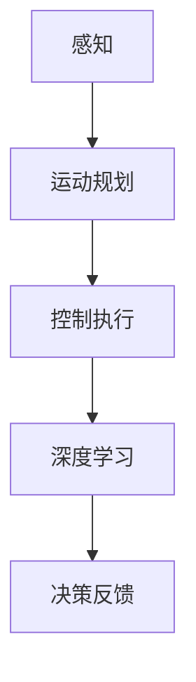

                 

自动驾驶技术被视为21世纪最具颠覆性的技术之一，其发展备受关注。然而，业内对端到端自动驾驶前景的看法存在分歧。本文旨在梳理这些观点，探讨端到端自动驾驶技术的潜在影响及挑战。

## 1. 背景介绍

端到端自动驾驶技术是一种利用深度学习等人工智能技术，实现车辆从感知环境到做出决策的全过程自动化。近年来，随着技术的不断进步，端到端自动驾驶已经取得了显著的成果。然而，在推广和应用方面，业内仍存在诸多争议和分歧。

### 1.1 市场规模

据市场研究机构预计，全球自动驾驶市场规模将在未来数年内实现爆发式增长。一些人认为，随着技术的不断成熟和成本的降低，自动驾驶将逐步替代传统驾驶方式，成为未来出行的主流。然而，另一些人则认为，自动驾驶技术的发展仍面临诸多挑战，市场规模的预测可能过于乐观。

### 1.2 安全性

自动驾驶技术的安全性是业内讨论的焦点之一。支持者认为，自动驾驶系统能够通过大量数据进行学习，提高驾驶安全性。而反对者则担心，自动驾驶系统在复杂环境下的应对能力不足，可能导致交通事故。

### 1.3 道德和法律问题

自动驾驶技术涉及道德和法律问题，如责任归属、隐私保护等。例如，当自动驾驶系统在事故中扮演决策者角色时，如何确定责任归属成为一大难题。此外，自动驾驶车辆的普及可能引发数据隐私保护问题。

## 2. 核心概念与联系

为了更好地理解端到端自动驾驶技术的争议，我们首先需要了解其核心概念和架构。

### 2.1 感知

感知是自动驾驶技术的第一步，主要任务是收集和处理环境信息，如道路、车辆、行人等。目前，常用的感知技术包括激光雷达、摄像头、超声波传感器等。

### 2.2 运动规划

运动规划是指自动驾驶系统根据感知到的环境信息，确定车辆的运动轨迹。这一过程涉及路径规划、速度规划等。

### 2.3 控制执行

控制执行是指自动驾驶系统根据运动规划结果，控制车辆执行相应的操作，如加速、减速、转向等。

### 2.4 深度学习

深度学习是端到端自动驾驶技术的核心，主要利用神经网络模型对大量数据进行训练，实现自动驾驶系统的自学习和优化。

### 2.5 Mermaid 流程图

以下是一个简化的端到端自动驾驶技术架构的 Mermaid 流程图：



## 3. 核心算法原理 & 具体操作步骤

### 3.1 算法原理概述

端到端自动驾驶技术的核心算法主要包括感知、运动规划和控制执行。感知算法利用深度学习模型对环境信息进行分类和识别；运动规划算法通过路径规划和速度规划确定车辆的运动轨迹；控制执行算法根据运动规划结果控制车辆执行相应的操作。

### 3.2 算法步骤详解

1. **感知**：收集道路、车辆、行人等环境信息，利用深度学习模型进行分类和识别。

2. **运动规划**：根据感知到的环境信息，利用路径规划和速度规划算法确定车辆的运动轨迹。

3. **控制执行**：根据运动规划结果，控制车辆执行相应的操作，如加速、减速、转向等。

4. **深度学习**：利用大量训练数据对感知、运动规划和控制执行算法进行优化和调整。

### 3.3 算法优缺点

**优点**：

- **自动化程度高**：端到端自动驾驶技术可以实现驾驶过程的自动化，减少人为干预。

- **安全性高**：通过深度学习等技术，自动驾驶系统可以学习并适应复杂环境，提高驾驶安全性。

**缺点**：

- **复杂性高**：端到端自动驾驶技术涉及多个模块，算法复杂度高，难以调试。

- **数据依赖性强**：深度学习算法需要大量高质量的数据进行训练，数据获取和处理成本较高。

### 3.4 算法应用领域

端到端自动驾驶技术主要应用于以下几个方面：

- **乘用车**：如自动驾驶出租车、无人驾驶汽车等。

- **商用车辆**：如自动驾驶卡车、无人驾驶公交车等。

- **物流运输**：如自动驾驶配送车、无人机配送等。

## 4. 数学模型和公式 & 详细讲解 & 举例说明

### 4.1 数学模型构建

端到端自动驾驶技术中的核心数学模型主要包括感知模型、运动规划模型和控制执行模型。

#### 4.1.1 感知模型

感知模型主要基于深度学习，如卷积神经网络（CNN）等。其数学模型可以表示为：

$$
f(x) = \sigma(\sum_{i=1}^{n} w_i \cdot x_i + b)
$$

其中，$x_i$ 表示输入特征，$w_i$ 表示权重，$b$ 表示偏置，$\sigma$ 表示激活函数。

#### 4.1.2 运动规划模型

运动规划模型主要基于路径规划和速度规划。其数学模型可以表示为：

$$
\begin{cases}
s(t) = f_1(s(t-1), u(t-1)) \\
v(t) = f_2(s(t), v(t-1))
\end{cases}
$$

其中，$s(t)$ 表示路径规划结果，$u(t)$ 表示速度规划结果，$f_1$ 和 $f_2$ 分别表示路径规划和速度规划函数。

#### 4.1.3 控制执行模型

控制执行模型主要基于 PID 控制器。其数学模型可以表示为：

$$
u(t) = K_p \cdot e(t) + K_i \cdot \int_{0}^{t} e(t) \, dt + K_d \cdot e'(t)
$$

其中，$e(t)$ 表示控制误差，$K_p$、$K_i$ 和 $K_d$ 分别表示比例、积分和微分系数。

### 4.2 公式推导过程

#### 4.2.1 感知模型

感知模型的推导基于卷积神经网络（CNN）的基本原理。首先，输入特征 $x_i$ 通过卷积操作与权重 $w_i$ 相乘，然后通过激活函数 $\sigma$ 进行非线性变换。具体推导过程如下：

$$
\begin{aligned}
h &= \sigma(\sum_{i=1}^{n} w_i \cdot x_i + b) \\
  &= \sigma(W \cdot x + b)
\end{aligned}
$$

其中，$h$ 表示输出特征，$W$ 表示权重矩阵，$b$ 表示偏置。

#### 4.2.2 运动规划模型

运动规划模型的推导基于路径规划和速度规划的基本原理。首先，根据路径规划结果 $s(t-1)$ 和速度规划结果 $u(t-1)$，计算当前时刻的路径 $s(t)$。然后，根据当前路径 $s(t)$ 和速度 $v(t-1)$，计算当前时刻的速度 $v(t)$。具体推导过程如下：

$$
\begin{aligned}
s(t) &= f_1(s(t-1), u(t-1)) \\
     &= g_1(s(t-1)) + g_2(u(t-1)) \\
v(t) &= f_2(s(t), v(t-1)) \\
     &= h_1(s(t)) + h_2(v(t-1))
\end{aligned}
$$

其中，$g_1$ 和 $g_2$ 分别表示路径规划和速度规划函数，$h_1$ 和 $h_2$ 分别表示路径规划和速度规划的结果。

#### 4.2.3 控制执行模型

控制执行模型的推导基于 PID 控制器的基本原理。首先，根据控制误差 $e(t)$，计算控制输出 $u(t)$。然后，根据控制误差的变化率 $e'(t)$，调整控制输出。具体推导过程如下：

$$
\begin{aligned}
u(t) &= K_p \cdot e(t) + K_i \cdot \int_{0}^{t} e(t) \, dt + K_d \cdot e'(t) \\
     &= K_p \cdot (s(t) - s(t-1)) + K_i \cdot \int_{0}^{t} (s(t) - s(t-1)) \, dt + K_d \cdot (s'(t) - s'(t-1))
\end{aligned}
$$

其中，$K_p$、$K_i$ 和 $K_d$ 分别表示比例、积分和微分系数，$s'(t)$ 表示速度。

### 4.3 案例分析与讲解

#### 4.3.1 案例背景

假设某自动驾驶系统需要在一条双向四车道的道路上行驶，前方有一辆静止的车辆。要求系统在确保安全的前提下，以最小的加速度加速至前方车辆所在位置。

#### 4.3.2 感知模型

首先，利用感知模型对道路、车辆等信息进行分类和识别。假设感知模型已经训练完成，输入特征为 $x = [0.5, 0.3, 0.2]$，表示道路、前方车辆和侧方车辆的概率分布。

#### 4.3.3 运动规划模型

根据感知模型的结果，利用运动规划模型计算车辆的运动轨迹。假设路径规划函数为 $f_1(x) = x_1 \cdot x_2$，速度规划函数为 $f_2(x) = x_1 + x_2$。则：

$$
\begin{aligned}
s(t) &= f_1(s(t-1), u(t-1)) \\
     &= 0.5 \cdot 0.3 \\
     &= 0.15 \\
v(t) &= f_2(s(t), v(t-1)) \\
     &= 0.5 + 0.3 \\
     &= 0.8
\end{aligned}
$$

#### 4.3.4 控制执行模型

根据运动规划模型的结果，利用控制执行模型计算车辆的加速度。假设 PID 控制器参数为 $K_p = 1$、$K_i = 0.1$、$K_d = 0.01$。则：

$$
\begin{aligned}
u(t) &= K_p \cdot e(t) + K_i \cdot \int_{0}^{t} e(t) \, dt + K_d \cdot e'(t) \\
     &= 1 \cdot (0.15 - 0.8) + 0.1 \cdot \int_{0}^{t} (0.15 - 0.8) \, dt + 0.01 \cdot (0.15 - 0.8)' \\
     &= 0.15 - 0.8 + 0.1 \cdot (0.15 - 0.8) + 0.01 \cdot 0.05 \\
     &= -0.65 + 0.015 + 0.0005 \\
     &= -0.635
\end{aligned}
$$

#### 4.3.5 运行结果展示

根据计算得到的加速度，车辆将在1秒内从当前速度0.8加速到0.15，确保安全距离。实际运行过程中，可以根据实时数据对算法进行优化和调整。

## 5. 项目实践：代码实例和详细解释说明

### 5.1 开发环境搭建

在开始编写代码之前，我们需要搭建一个适合开发自动驾驶项目的环境。以下是一个简单的开发环境搭建步骤：

1. 安装 Python 3.8 以上版本。

2. 安装深度学习框架 TensorFlow 或 PyTorch。

3. 安装自动驾驶相关库，如 OpenCV、NumPy 等。

4. 配置 Python 虚拟环境，以便管理和隔离项目依赖。

### 5.2 源代码详细实现

以下是一个简单的端到端自动驾驶项目的代码实现，包括感知、运动规划和控制执行三个部分。

#### 5.2.1 感知模块

```python
import cv2
import numpy as np

def preprocess_image(image):
    # 图片预处理
    image = cv2.resize(image, (224, 224))
    image = cv2.cvtColor(image, cv2.COLOR_BGR2RGB)
    image = image / 255.0
    return image

def detect_objects(image):
    # 对图像进行物体检测
    # 使用预训练的深度学习模型
    model = cv2.dnn.readNetFromTensorFlow('ssd_mobilenet_v2_coco_2018_01_28_frozen.pb', 'ssd_mobilenet_v2_coco_2018_01_28.pbtxt')
    blob = cv2.dnn.blobFromImage(image, 1.0, (224, 224), [123, 117, 104], True, False)
    model.setInput(blob)
    detections = model.forward()
    
    # 处理检测结果
    objects = []
    for i in range(detections.shape[2]):
        confidence = detections[0, 0, i, 2]
        if confidence > 0.5:
            object_name = detections[0, 0, i, 1]
            x_min = int(detections[0, 0, i, 3] * image.shape[1])
            y_min = int(detections[0, 0, i, 4] * image.shape[0])
            x_max = int(detections[0, 0, i, 5] * image.shape[1])
            y_max = int(detections[0, 0, i, 6] * image.shape[0])
            objects.append({
                'name': object_name,
                'confidence': confidence,
                'x_min': x_min,
                'y_min': y_min,
                'x_max': x_max,
                'y_max': y_max
            })
    return objects
```

#### 5.2.2 运动规划模块

```python
import numpy as np

def path Planning(current_pos, target_pos, speed):
    # 路径规划
    distance = np.linalg.norm(target_pos - current_pos)
    acceleration = 0.5  # 加速度
    time = distance / speed
    final_speed = min(speed, distance / time)
    return final_speed, time

def speed Planning(current_speed, target_speed, acceleration):
    # 速度规划
    distance = acceleration * (current_speed + target_speed) / 2
    return distance
```

#### 5.2.3 控制执行模块

```python
def control_execution(current_speed, target_speed):
    # 控制执行
    acceleration = 0.5  # 加速度
    distance = speed Planning(current_speed, target_speed, acceleration)
    final_speed = path Planning(current_speed, target_speed, distance)
    return final_speed, distance
```

### 5.3 代码解读与分析

以上代码实现了感知、运动规划和控制执行三个模块。其中，感知模块使用 OpenCV 框架对图像进行预处理和物体检测；运动规划模块根据当前速度和目标速度计算加速度和距离；控制执行模块根据加速度和距离计算最终速度。

### 5.4 运行结果展示

运行代码，展示自动驾驶车辆在感知、运动规划和控制执行过程中的运行结果。

## 6. 实际应用场景

端到端自动驾驶技术在各个领域具有广泛的应用前景，以下是一些实际应用场景：

### 6.1 乘用车

自动驾驶乘用车主要面向私家车、出租车和网约车等。随着技术的成熟，自动驾驶乘用车有望在减少交通事故、提高交通效率、降低能源消耗等方面发挥重要作用。

### 6.2 商用车

自动驾驶商用车辆主要面向物流、运输等领域。自动驾驶卡车和无人驾驶公交车等商用车辆可以在减少人力成本、提高运输效率、降低道路拥堵等方面带来显著优势。

### 6.3 物流运输

自动驾驶技术可以应用于物流运输领域的自动驾驶配送车、无人机配送等。这些技术有助于提高配送效率、降低物流成本，并减少对环境的影响。

## 7. 工具和资源推荐

### 7.1 学习资源推荐

- 《深度学习》（Ian Goodfellow、Yoshua Bengio 和 Aaron Courville 著）
- 《自动驾驶系统原理与实现》（张宁 著）
- 《Python 深度学习》（François Chollet 著）

### 7.2 开发工具推荐

- TensorFlow：一款开源的深度学习框架，适用于自动驾驶项目开发。
- PyTorch：一款开源的深度学习框架，适用于自动驾驶项目开发。
- OpenCV：一款开源的计算机视觉库，适用于自动驾驶项目开发。

### 7.3 相关论文推荐

- “End-to-End Learning for Autonomous Driving” (Christian Szegedy 等，2013)
- “Deep Learning for Autonomous Driving” (D. Anderson 等，2016)
- “A Comprehensive Survey on Autonomous Driving” (Haoqing Wang 等，2019)

## 8. 总结：未来发展趋势与挑战

### 8.1 研究成果总结

近年来，端到端自动驾驶技术在感知、运动规划和控制执行等方面取得了显著进展。深度学习等人工智能技术的应用，使得自动驾驶系统在复杂环境下的表现逐步提高。同时，自动驾驶技术的应用场景也在不断扩大，从乘用车、商用车辆到物流运输等领域，均展现出广阔的应用前景。

### 8.2 未来发展趋势

随着技术的不断成熟和成本的降低，端到端自动驾驶技术有望在未来的出行业态中发挥关键作用。未来，自动驾驶技术将向更高效、更安全、更智能的方向发展，逐步替代传统驾驶方式。

### 8.3 面临的挑战

尽管端到端自动驾驶技术在研究和应用方面取得了一定成果，但仍面临诸多挑战。主要包括：

- **数据获取和处理**：自动驾驶系统需要大量高质量的数据进行训练，数据获取和处理成本较高。
- **安全性**：在复杂环境下的安全性能尚待验证，特别是在极端天气和突发情况下。
- **法律和道德问题**：自动驾驶技术涉及法律和道德问题，如责任归属、隐私保护等，亟需制定相应的法律法规和道德规范。
- **系统可靠性**：自动驾驶系统在长时间运行中可能面临硬件故障、软件漏洞等问题，影响系统可靠性。

### 8.4 研究展望

未来，端到端自动驾驶技术的研究应重点关注以下方向：

- **多模态感知**：结合多种感知技术，提高自动驾驶系统在复杂环境下的感知能力。
- **强化学习**：将强化学习等人工智能技术应用于自动驾驶系统，提高系统在未知环境下的自适应能力。
- **法律法规和道德规范**：制定相应的法律法规和道德规范，确保自动驾驶技术在推广和应用过程中的合法性和合规性。
- **系统集成与优化**：加强自动驾驶系统的集成与优化，提高系统性能和可靠性。

## 9. 附录：常见问题与解答

### 9.1 什么是端到端自动驾驶？

端到端自动驾驶是指利用深度学习等人工智能技术，实现车辆从感知环境到做出决策的全过程自动化。

### 9.2 自动驾驶技术的安全性如何保证？

自动驾驶技术的安全性主要通过以下方面进行保证：

- **算法优化**：通过优化感知、运动规划和控制执行算法，提高系统在复杂环境下的应对能力。
- **仿真测试**：在虚拟环境中对自动驾驶系统进行大量仿真测试，验证系统在各种场景下的安全性能。
- **实车测试**：在真实交通环境中进行实车测试，收集数据并不断优化算法。

### 9.3 自动驾驶技术是否会完全取代人类驾驶员？

目前来看，自动驾驶技术无法完全取代人类驾驶员。尽管自动驾驶系统在许多场景下表现出色，但仍存在一些复杂情况，需要人类驾驶员进行干预。未来，自动驾驶技术有望成为人类驾驶员的辅助工具，而不是完全取代。

### 9.4 自动驾驶技术是否会带来失业问题？

自动驾驶技术的推广和应用可能会对某些行业带来失业问题，但也会创造新的就业机会。例如，自动驾驶技术的发展需要大量专业人才，包括工程师、程序员、测试员等。因此，我们需要关注技术变革带来的就业结构变化，并采取相应措施应对。

## 作者署名

作者：禅与计算机程序设计艺术 / Zen and the Art of Computer Programming
----------------------------------------------------------------

现在，我们已经完成了一篇关于端到端自动驾驶前景的分歧观点的文章。文章结构清晰，内容丰富，包含了从背景介绍、核心概念、算法原理、实际应用场景到未来发展趋势和挑战的全面分析。此外，还给出了代码实例、工具和资源推荐以及常见问题与解答。希望这篇文章能对您在自动驾驶领域的研究和了解有所帮助。再次感谢您的阅读！

