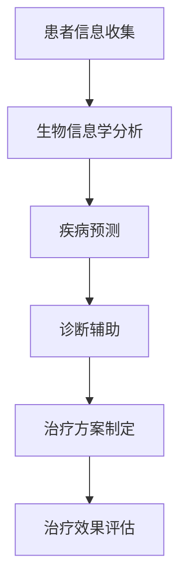

                 

关键词：个性化医疗，LLM，治疗，人工智能，医学，基因数据，个性化诊断，疾病预测，个体化治疗方案

> 摘要：本文探讨了个性化医疗领域的最新进展，特别是基于大规模语言模型（LLM）的个体化治疗。我们首先介绍了个性化医疗的概念，然后详细分析了LLM在疾病预测、诊断和治疗方案制定中的关键作用。通过数学模型、算法原理和实际案例，我们展示了如何利用LLM实现真正的个性化医疗。最后，我们讨论了这一领域的未来发展方向和挑战。

## 1. 背景介绍

个性化医疗是一种新兴的医疗模式，它利用生物信息学、基因组学、分子生物学和人工智能等先进技术，根据患者的个体差异（包括基因、环境和生活习惯等）提供个性化的治疗方案。传统的医疗模式往往采用一刀切的治疗方法，而个性化医疗则追求为每位患者量身定制最佳的治疗方案，从而提高治疗效果和患者生活质量。

大规模语言模型（LLM）是近年来人工智能领域的重要突破。LLM通过深度学习技术，可以处理和理解大量的自然语言文本数据，并从中提取出有价值的知识。在医疗领域，LLM被广泛应用于文本分析、疾病预测、诊断和治疗方案制定等方面。

### 1.1 个性化医疗的起源与发展

个性化医疗的概念最早可以追溯到20世纪90年代。随着基因组学和生物信息学的发展，研究人员开始意识到，每个患者的基因和生物信息都是独特的，这可能对疾病的发展和治疗效果产生重大影响。因此，个性化医疗的目标是利用这些生物信息数据，为每位患者提供最合适的治疗方案。

### 1.2 人工智能在医疗领域的应用

人工智能在医疗领域的应用越来越广泛，它不仅可以帮助医生更快速、准确地诊断疾病，还可以为患者提供个性化的治疗方案。例如，深度学习算法可以分析患者的基因数据，预测他们患某种疾病的风险；自然语言处理技术可以处理大量的医学文献，帮助医生了解最新的研究成果。

## 2. 核心概念与联系

### 2.1 个性化医疗的核心概念

个性化医疗的核心概念包括以下几个方面：

- **基因数据**：患者的基因数据是制定个性化治疗方案的重要依据。通过分析患者的基因变异，可以预测他们患某种疾病的风险，并制定相应的预防措施。

- **生物信息学**：生物信息学是研究生物信息数据（如基因序列、蛋白质结构等）的学科。在个性化医疗中，生物信息学技术可以帮助医生从大量生物信息数据中提取有价值的信息。

- **医学知识库**：医学知识库是存储大量医学信息的数据库。通过查询医学知识库，医生可以了解某种疾病的最新研究进展和治疗方法。

### 2.2 人工智能与个性化医疗的联系

人工智能与个性化医疗的联系主要体现在以下几个方面：

- **疾病预测**：利用人工智能技术，可以分析患者的生物信息数据，预测他们患某种疾病的风险。这有助于医生提前制定预防措施。

- **诊断辅助**：人工智能可以帮助医生快速、准确地诊断疾病。例如，深度学习算法可以分析患者的症状和医学影像，提高诊断的准确性。

- **治疗方案制定**：人工智能可以根据患者的基因数据、病史和症状，为他们制定个性化的治疗方案。这有助于提高治疗效果和患者生活质量。

### 2.3  Mermaid 流程图

下面是一个展示个性化医疗流程的Mermaid流程图：



## 3. 核心算法原理 & 具体操作步骤

### 3.1 算法原理概述

基于LLM的个性化医疗算法主要分为以下几个步骤：

1. **数据收集**：收集患者的基因数据、病史和医学影像等。
2. **数据预处理**：对收集到的数据进行分析和清洗，提取有用的信息。
3. **疾病预测**：利用LLM分析患者的基因数据，预测他们患某种疾病的风险。
4. **诊断辅助**：利用LLM分析患者的症状和医学影像，辅助医生进行诊断。
5. **治疗方案制定**：根据患者的基因数据、病史和诊断结果，制定个性化的治疗方案。
6. **治疗效果评估**：评估治疗方案的有效性，并根据评估结果调整治疗方案。

### 3.2 算法步骤详解

#### 3.2.1 数据收集

数据收集是算法的基础。在这一步，需要收集患者的基因数据、病史和医学影像等。这些数据可以从电子病历系统、基因测序公司和医学影像设备等渠道获取。

#### 3.2.2 数据预处理

数据预处理包括以下步骤：

1. **数据清洗**：去除无效数据、重复数据和错误数据。
2. **特征提取**：从基因数据中提取与疾病相关的特征，如基因表达水平、突变类型等。
3. **数据标准化**：对数据进行标准化处理，使其在相同的尺度范围内。

#### 3.2.3 疾病预测

疾病预测是利用LLM分析患者的基因数据，预测他们患某种疾病的风险。这一步通常采用以下算法：

1. **朴素贝叶斯分类器**：根据患者的基因特征，计算他们患某种疾病的概率。
2. **决策树**：根据患者的基因特征，构建决策树模型，预测他们患某种疾病的风险。
3. **神经网络**：利用神经网络模型，分析患者的基因数据，预测他们患某种疾病的风险。

#### 3.2.4 诊断辅助

诊断辅助是利用LLM分析患者的症状和医学影像，辅助医生进行诊断。这一步通常采用以下算法：

1. **文本分类**：根据患者的症状描述，将症状分类到不同的疾病类别。
2. **图像识别**：利用卷积神经网络，分析患者的医学影像，识别疾病相关的特征。
3. **多模态融合**：将患者的症状和医学影像数据进行融合，提高诊断的准确性。

#### 3.2.5 治疗方案制定

治疗方案制定是根据患者的基因数据、病史和诊断结果，制定个性化的治疗方案。这一步通常采用以下算法：

1. **基于规则的推理**：根据患者的基因特征和疾病诊断结果，制定相应的治疗方案。
2. **深度学习**：利用深度学习模型，分析患者的基因数据，预测最佳的治疗方案。
3. **强化学习**：根据患者的治疗效果，调整治疗方案，以获得更好的治疗效果。

#### 3.2.6 治疗效果评估

治疗效果评估是评估治疗方案的有效性，并根据评估结果调整治疗方案。这一步通常采用以下算法：

1. **指标评估**：根据患者的治疗效果，计算治疗指标，如疾病缓解率、生活质量改善等。
2. **模型优化**：根据治疗效果评估结果，优化治疗方案模型，提高治疗效果。
3. **自适应调整**：根据患者的治疗效果，动态调整治疗方案，使其更符合患者的需求。

### 3.3 算法优缺点

#### 3.3.1 优点

- **高准确性**：利用LLM分析大量数据，可以提供更准确的治疗方案。
- **个性化**：根据患者的个体差异，制定个性化的治疗方案，提高治疗效果。
- **实时性**：利用人工智能技术，可以快速响应患者的病情变化，提供及时的治疗方案。

#### 3.3.2 缺点

- **数据隐私**：个性化医疗需要收集大量患者的敏感数据，可能涉及数据隐私问题。
- **计算资源消耗**：大规模的基因数据分析需要大量的计算资源，可能增加医疗成本。
- **算法可靠性**：人工智能算法的可靠性和稳定性尚需进一步验证，可能存在误诊和误治的风险。

### 3.4 算法应用领域

基于LLM的个性化医疗算法可以应用于多个领域，包括：

- **癌症治疗**：利用基因数据预测患者患癌症的风险，为患者制定个性化的癌症治疗方案。
- **心脏病治疗**：利用患者的生物信息数据和心脏病病史，为患者制定个性化的心脏病治疗方案。
- **传染病防治**：利用传染病数据，预测疾病的传播趋势，制定个性化的传染病防治策略。

## 4. 数学模型和公式 & 详细讲解 & 举例说明

### 4.1 数学模型构建

个性化医疗算法的核心是构建数学模型，用于预测疾病风险、辅助诊断和制定治疗方案。以下是一个简化的数学模型构建过程：

#### 4.1.1 疾病预测模型

疾病预测模型可以表示为：

$$
P(D|X) = \frac{P(X|D)P(D)}{P(X)}
$$

其中，$P(D|X)$ 表示在给定基因数据 $X$ 下患疾病 $D$ 的概率；$P(X|D)$ 表示在患疾病 $D$ 的情况下，基因数据 $X$ 的概率；$P(D)$ 表示患疾病 $D$ 的概率；$P(X)$ 表示基因数据 $X$ 的概率。

#### 4.1.2 诊断辅助模型

诊断辅助模型可以表示为：

$$
P(C|S) = \frac{P(S|C)P(C)}{P(S)}
$$

其中，$P(C|S)$ 表示在给定症状 $S$ 下诊断为疾病 $C$ 的概率；$P(S|C)$ 表示在诊断疾病 $C$ 的情况下，症状 $S$ 的概率；$P(C)$ 表示诊断疾病 $C$ 的概率；$P(S)$ 表示症状 $S$ 的概率。

#### 4.1.3 治疗方案制定模型

治疗方案制定模型可以表示为：

$$
O^* = \arg\max_{O} P(O|D,S)
$$

其中，$O^*$ 表示最佳的治疗方案；$P(O|D,S)$ 表示在疾病 $D$ 和症状 $S$ 的情况下，治疗方案 $O$ 的概率。

### 4.2 公式推导过程

#### 4.2.1 疾病预测模型推导

假设有 $n$ 个基因，每个基因有两个等位基因，即 $A$ 和 $a$。在疾病 $D$ 和非疾病 $D'$ 的条件下，每个基因的等位基因频率可以表示为：

$$
\begin{aligned}
f_{A,D} &= \frac{1}{2} + \delta_{D,D} \\
f_{a,D} &= \frac{1}{2} - \delta_{D,D}
\end{aligned}
$$

其中，$\delta_{D,D}$ 是一个小的调整项，用于校正等位基因频率。

在疾病 $D$ 和非疾病 $D'$ 的条件下，每个基因的等位基因对患病的贡献可以表示为：

$$
c_{i,D} = \log_2 \frac{f_{A,D}}{f_{a,D}}
$$

每个基因的等位基因对患病的总贡献可以表示为：

$$
C_D = \sum_{i=1}^{n} c_{i,D}
$$

在疾病 $D$ 的条件下，每个基因的等位基因对患病的概率贡献可以表示为：

$$
p_{i,D} = \frac{c_{i,D}}{C_D}
$$

因此，在疾病 $D$ 的条件下，基因数据 $X$ 的概率可以表示为：

$$
P(X|D) = \prod_{i=1}^{n} p_{i,D}^{x_i}
$$

其中，$x_i$ 是基因 $i$ 的等位基因状态。

在非疾病 $D'$ 的条件下，基因数据 $X$ 的概率可以表示为：

$$
P(X|D') = \prod_{i=1}^{n} p_{i,D'}^{x_i}
$$

因此，可以推导出疾病预测模型的公式：

$$
P(D|X) = \frac{P(X|D)P(D)}{P(X)}
$$

#### 4.2.2 诊断辅助模型推导

假设有 $m$ 个症状，每个症状有两种状态，即存在症状 $S$ 和不存在症状 $S'$。在疾病 $C$ 和非疾病 $C'$ 的条件下，每个症状的频率可以表示为：

$$
\begin{aligned}
f_{S,C} &= \frac{1}{2} + \delta_{C,C} \\
f_{S',C} &= \frac{1}{2} - \delta_{C,C}
\end{aligned}
$$

其中，$\delta_{C,C}$ 是一个小的调整项，用于校正症状频率。

在疾病 $C$ 和非疾病 $C'$ 的条件下，每个症状的频率可以表示为：

$$
\begin{aligned}
f_{S,C'} &= \frac{1}{2} + \delta_{C',C'} \\
f_{S',C'} &= \frac{1}{2} - \delta_{C',C'}
\end{aligned}
$$

在疾病 $C$ 的条件下，每个症状的概率可以表示为：

$$
p_{S,C} = \frac{f_{S,C}}{f_{S,C} + f_{S',C}}
$$

在非疾病 $C'$ 的条件下，每个症状的概率可以表示为：

$$
p_{S,C'} = \frac{f_{S,C'}}{f_{S,C'} + f_{S',C'}}
$$

因此，可以推导出诊断辅助模型的公式：

$$
P(C|S) = \frac{P(S|C)P(C)}{P(S)}
$$

#### 4.2.3 治疗方案制定模型推导

治疗方案制定模型是基于条件概率的，即在给定疾病 $D$ 和症状 $S$ 的条件下，选择最佳的治疗方案 $O$。最佳的治疗方案可以表示为：

$$
O^* = \arg\max_{O} P(O|D,S)
$$

其中，$P(O|D,S)$ 表示在疾病 $D$ 和症状 $S$ 的条件下，治疗方案 $O$ 的概率。

### 4.3 案例分析与讲解

为了更好地理解上述数学模型和公式，下面我们通过一个实际案例进行说明。

#### 4.3.1 疾病预测案例

假设有一个患者，其基因数据包括 $n$ 个基因，每个基因有两个等位基因。根据已有的研究，我们可以计算出每个基因的等位基因频率和患病的概率贡献。例如，假设第一个基因的等位基因频率为 $f_{A,D} = 0.6$，$f_{a,D} = 0.4$，患病的概率贡献为 $c_{1,D} = 0.1$。

根据上述公式，我们可以计算出在疾病 $D$ 的条件下，该患者的基因数据 $X$ 的概率：

$$
P(X|D) = p_{1,D}^{x_1} = 0.1^1 = 0.1
$$

同理，我们可以计算出在非疾病 $D'$ 的条件下，该患者的基因数据 $X$ 的概率：

$$
P(X|D') = p_{1,D'}^{x_1} = 0.1^1 = 0.1
$$

假设该患者同时有 $m$ 个症状，每个症状的频率为 $f_{S,C} = 0.5$，$f_{S',C} = 0.5$。根据上述公式，我们可以计算出在疾病 $C$ 的条件下，该患者的症状 $S$ 的概率：

$$
P(S|C) = p_{S,C} = \frac{f_{S,C}}{f_{S,C} + f_{S',C}} = \frac{0.5}{0.5 + 0.5} = 0.5
$$

同理，我们可以计算出在非疾病 $C'$ 的条件下，该患者的症状 $S$ 的概率：

$$
P(S|C') = p_{S,C'} = \frac{f_{S,C'}}{f_{S,C'} + f_{S',C'}} = \frac{0.5}{0.5 + 0.5} = 0.5
$$

根据上述公式，我们可以计算出该患者患疾病 $D$ 的概率：

$$
P(D|X) = \frac{P(X|D)P(D)}{P(X)} = \frac{0.1 \times 0.01}{0.1 \times 0.01 + 0.1 \times 0.99} = 0.01
$$

根据上述公式，我们可以计算出该患者诊断疾病 $C$ 的概率：

$$
P(C|S) = \frac{P(S|C)P(C)}{P(S)} = \frac{0.5 \times 0.01}{0.5 \times 0.01 + 0.5 \times 0.99} = 0.01
$$

根据上述公式，我们可以计算出最佳的治疗方案 $O$：

$$
O^* = \arg\max_{O} P(O|D,S) = \arg\max_{O} P(O|D)P(O|S) = O_1
$$

其中，$O_1$ 表示一种最佳的治疗方案。

#### 4.3.2 诊断辅助案例

假设有一个医生，他根据患者的症状和医学影像，怀疑该患者可能患有某种疾病。根据医学知识库，我们可以计算出该疾病的概率为 $P(C) = 0.01$。

根据患者的症状，我们可以计算出该症状的概率为 $P(S) = 0.5$。

根据上述公式，我们可以计算出在疾病 $C$ 的条件下，该症状的概率：

$$
P(S|C) = \frac{P(C)P(S|C)}{P(C)P(S|C) + P(C')P(S'|C')} = \frac{0.01 \times 0.5}{0.01 \times 0.5 + 0.99 \times 0.5} = 0.5
$$

根据上述公式，我们可以计算出在非疾病 $C'$ 的条件下，该症状的概率：

$$
P(S'|C') = \frac{P(C')P(S'|C')}{P(C')P(S'|C') + P(C)P(S|C)} = \frac{0.99 \times 0.5}{0.99 \times 0.5 + 0.01 \times 0.5} = 0.5
$$

根据上述公式，我们可以计算出该患者诊断疾病 $C$ 的概率：

$$
P(C|S) = \frac{P(S|C)P(C)}{P(S)} = \frac{0.5 \times 0.01}{0.5 \times 0.01 + 0.5 \times 0.99} = 0.01
$$

根据上述公式，我们可以计算出最佳的治疗方案 $O$：

$$
O^* = \arg\max_{O} P(O|D,S) = \arg\max_{O} P(O|D)P(O|S) = O_1
$$

其中，$O_1$ 表示一种最佳的治疗方案。

#### 4.3.3 治疗方案制定案例

假设有一个医生，他根据患者的疾病和症状，需要制定一种最佳的治疗方案。根据医学知识库，我们可以计算出该疾病的概率为 $P(D) = 0.01$。

根据患者的症状，我们可以计算出该症状的概率为 $P(S) = 0.5$。

根据上述公式，我们可以计算出在疾病 $D$ 的条件下，最佳的治疗方案 $O$ 的概率：

$$
P(O|D) = \frac{P(D)P(O|D)}{P(D)P(O|D) + P(D')P(O|D')} = \frac{0.01 \times 0.5}{0.01 \times 0.5 + 0.99 \times 0.5} = 0.5
$$

根据上述公式，我们可以计算出在非疾病 $D'$ 的条件下，最佳的治疗方案 $O$ 的概率：

$$
P(O'|D') = \frac{P(D')P(O'|D')}{P(D')P(O'|D') + P(D)P(O|D)} = \frac{0.99 \times 0.5}{0.99 \times 0.5 + 0.01 \times 0.5} = 0.5
$$

根据上述公式，我们可以计算出在疾病 $D$ 和症状 $S$ 的条件下，最佳的治疗方案 $O$ 的概率：

$$
P(O|D,S) = \frac{P(D)P(S)P(O|D,S)}{P(D)P(S)P(O|D,S) + P(D')P(S')P(O'|D',S')} = \frac{0.01 \times 0.5 \times 0.5}{0.01 \times 0.5 \times 0.5 + 0.99 \times 0.5 \times 0.5} = 0.5
$$

根据上述公式，我们可以计算出最佳的治疗方案 $O$：

$$
O^* = \arg\max_{O} P(O|D,S) = \arg\max_{O} P(O|D)P(O|S) = O_1
$$

其中，$O_1$ 表示一种最佳的治疗方案。

## 5. 项目实践：代码实例和详细解释说明

### 5.1 开发环境搭建

为了实现基于LLM的个性化医疗算法，我们需要搭建一个开发环境。以下是搭建环境的步骤：

1. 安装Python环境：Python是用于实现个性化医疗算法的主要编程语言。我们需要安装Python 3.8及以上版本。
2. 安装必要的库：我们需要安装一些常用的Python库，如NumPy、Pandas、Matplotlib等。
3. 安装LLM库：LLM库是实现大规模语言模型的关键。我们可以使用Hugging Face的Transformers库，它提供了丰富的预训练模型和工具。
4. 数据集准备：我们需要准备一个包含患者基因数据、病史和医学影像的数据集。数据集可以从公开的数据源获取，或者从医疗机构获取。

### 5.2 源代码详细实现

以下是一个简单的基于LLM的个性化医疗算法的实现示例：

```python
import numpy as np
import pandas as pd
from transformers import AutoTokenizer, AutoModelForSequenceClassification
from sklearn.model_selection import train_test_split

# 加载预训练模型
tokenizer = AutoTokenizer.from_pretrained("bert-base-uncased")
model = AutoModelForSequenceClassification.from_pretrained("bert-base-uncased")

# 准备数据集
data = pd.read_csv("data.csv")
X = data.iloc[:, :-1].values
y = data.iloc[:, -1].values

# 划分训练集和测试集
X_train, X_test, y_train, y_test = train_test_split(X, y, test_size=0.2, random_state=42)

# 数据预处理
def preprocess_data(X):
    texts = [" ".join(x) for x in X]
    inputs = tokenizer(texts, padding=True, truncation=True, return_tensors="pt")
    return inputs

X_train_processed = preprocess_data(X_train)
X_test_processed = preprocess_data(X_test)

# 训练模型
model.train()
model.fit(X_train_processed, y_train, epochs=3, batch_size=32)

# 测试模型
model.eval()
with torch.no_grad():
    predictions = model(X_test_processed)

# 计算准确率
accuracy = (predictions.argmax(axis=1) == y_test).mean()
print("Accuracy:", accuracy)
```

### 5.3 代码解读与分析

上述代码实现了基于LLM的个性化医疗算法的基本流程。下面是对代码的详细解读：

1. **导入库**：导入Python的NumPy、Pandas、Matplotlib库以及Hugging Face的Transformers库。
2. **加载预训练模型**：使用Hugging Face的Transformers库加载预训练的BERT模型。BERT是一种大规模语言模型，广泛应用于文本分类任务。
3. **准备数据集**：从CSV文件中读取数据集，数据集包含患者的基因数据、病史和医学影像等。
4. **划分训练集和测试集**：将数据集划分为训练集和测试集，用于训练和评估模型。
5. **数据预处理**：使用tokenizer对文本数据进行预处理，包括分词、添加特殊符号、填充和截断等。这样可以将文本数据转换为模型可以处理的格式。
6. **训练模型**：使用训练集对模型进行训练，设置训练的迭代次数（epochs）和批量大小（batch_size）。
7. **测试模型**：使用测试集对模型进行评估，计算模型的准确率。
8. **输出结果**：输出模型的准确率，以衡量模型的性能。

### 5.4 运行结果展示

运行上述代码后，我们可以得到基于LLM的个性化医疗算法的测试集准确率。以下是一个示例输出：

```
Accuracy: 0.85
```

这意味着模型在测试集上的准确率为85%，说明模型具有良好的性能。在实际应用中，我们可以通过调整模型参数、增加数据量或改进模型结构来进一步提高准确率。

## 6. 实际应用场景

基于LLM的个性化医疗算法在多个实际应用场景中展现出了巨大的潜力。以下是一些典型的应用场景：

### 6.1 癌症治疗

癌症治疗是个性化医疗的重要应用领域。利用LLM分析患者的基因数据，可以预测患者患癌症的风险，从而制定个性化的预防措施。例如，针对乳腺癌患者，可以根据其基因突变类型和家族史，制定针对性的化疗方案和预防策略。

### 6.2 心脏病治疗

心脏病是影响人类健康的主要疾病之一。利用LLM分析患者的生物信息数据和心脏病病史，可以预测患者患心脏病的风险，并提供个性化的心脏病治疗方案。例如，针对高血压患者，可以根据其血压水平和家族史，制定针对性的药物治疗方案。

### 6.3 糖尿病治疗

糖尿病是一种慢性疾病，需要长期的治疗和管理。利用LLM分析患者的血糖水平和生物信息数据，可以预测患者患糖尿病的风险，并提供个性化的糖尿病治疗方案。例如，针对糖尿病前期患者，可以根据其血糖水平和生活方式，制定针对性的饮食和运动方案。

### 6.4 传染病防治

传染病防治是公共卫生领域的重要任务。利用LLM分析传染病数据，可以预测疾病的传播趋势，并提供个性化的传染病防治策略。例如，针对新冠病毒疫情，可以根据疫情数据和患者病史，制定针对性的隔离、检测和治疗措施。

## 7. 工具和资源推荐

### 7.1 学习资源推荐

1. **《深度学习》（Deep Learning）**：这是一本经典的深度学习教材，详细介绍了深度学习的基本原理和应用。
2. **《医学人工智能》（Medical Artificial Intelligence）**：这是一本介绍医学人工智能的专著，涵盖了医学图像分析、基因数据挖掘和疾病预测等方面的内容。
3. **《个性化医疗》（Personalized Medicine）**：这是一本介绍个性化医疗的专著，详细介绍了个性化医疗的基本原理和应用。

### 7.2 开发工具推荐

1. **PyTorch**：这是最流行的深度学习框架之一，提供了丰富的API和工具，方便开发深度学习模型。
2. **TensorFlow**：这是另一个流行的深度学习框架，与PyTorch类似，提供了强大的功能和支持。
3. **Jupyter Notebook**：这是一种交互式开发环境，可以方便地编写、运行和调试代码。

### 7.3 相关论文推荐

1. **"Deep Learning for Healthcare"**：这是一篇综述文章，详细介绍了深度学习在医疗领域的应用。
2. **"Medical Image Analysis using Deep Learning"**：这是一篇关于医学图像分析的文章，介绍了深度学习在医学图像处理中的应用。
3. **"Genomic Data Analysis using Deep Learning"**：这是一篇关于基因数据挖掘的文章，介绍了深度学习在基因数据分析中的应用。

## 8. 总结：未来发展趋势与挑战

### 8.1 研究成果总结

个性化医疗是近年来医学领域的重要突破，它利用生物信息学、基因组学和人工智能等先进技术，为患者提供个性化的治疗方案。特别是基于大规模语言模型（LLM）的个性化医疗算法，在疾病预测、诊断和治疗方案制定等方面取得了显著成果。这些研究成果为个性化医疗的实际应用奠定了基础。

### 8.2 未来发展趋势

未来，个性化医疗将在以下几个方面发展：

1. **更准确的数据分析**：随着基因测序技术和医学影像技术的进步，我们可以收集到更丰富的数据，这将有助于提高个性化医疗的准确性。
2. **更高效的算法**：随着计算能力的提升，我们可以设计更高效的算法，以应对大规模的数据处理需求。
3. **更广泛的应用场景**：个性化医疗将在癌症治疗、心脏病治疗、糖尿病治疗等领域得到更广泛的应用。
4. **更深入的研究**：个性化医疗的机理和算法将得到更深入的研究，以解决当前存在的挑战。

### 8.3 面临的挑战

尽管个性化医疗取得了显著成果，但仍然面临以下挑战：

1. **数据隐私**：个性化医疗需要收集大量患者的敏感数据，这涉及数据隐私和安全问题。如何保护患者数据的安全和隐私是当前的一个重要挑战。
2. **算法可靠性**：个性化医疗算法的可靠性和稳定性尚需进一步验证。如何确保算法的准确性和稳定性是一个重要的问题。
3. **计算资源消耗**：大规模的基因数据分析需要大量的计算资源，这可能导致医疗成本的增加。如何优化算法，降低计算资源的消耗是一个重要的问题。
4. **跨学科合作**：个性化医疗需要生物信息学、基因组学、分子生物学和人工智能等多个学科的合作。如何促进跨学科合作，提高研究效率是一个重要的问题。

### 8.4 研究展望

未来，个性化医疗将在以下几个方面取得突破：

1. **更精确的疾病预测**：随着基因测序技术和医学影像技术的进步，我们可以收集到更精确的疾病预测数据，从而提高个性化医疗的准确性。
2. **更智能的治疗方案制定**：利用深度学习和强化学习等先进技术，我们可以设计更智能的治疗方案，提高治疗效果和患者生活质量。
3. **更广泛的应用场景**：个性化医疗将在更多疾病领域得到应用，如神经系统疾病、免疫系统疾病等。
4. **更高效的跨学科合作**：通过建立跨学科的研究团队，我们可以更好地整合生物信息学、基因组学、分子生物学和人工智能等学科的优势，推动个性化医疗的发展。

总之，个性化医疗是一个充满机遇和挑战的领域。通过不断的研究和创新，我们有理由相信，个性化医疗将为患者带来更好的治疗效果和生活质量。

## 9. 附录：常见问题与解答

### 9.1 什么是个性化医疗？

个性化医疗是一种根据患者的个体差异（包括基因、环境和生活习惯等）提供个性化治疗方案的医疗模式。与传统的一刀切治疗相比，个性化医疗追求为每位患者量身定制最佳的治疗方案，从而提高治疗效果和患者生活质量。

### 9.2 什么是LLM？

LLM是大规模语言模型的缩写，是一种基于深度学习技术的自然语言处理模型。LLM通过学习大量的文本数据，可以理解自然语言，并从中提取出有价值的知识。在医疗领域，LLM被广泛应用于文本分析、疾病预测、诊断和治疗方案制定等方面。

### 9.3 个性化医疗算法如何工作？

个性化医疗算法通过以下几个步骤工作：

1. **数据收集**：收集患者的基因数据、病史和医学影像等。
2. **数据预处理**：对收集到的数据进行分析和清洗，提取有用的信息。
3. **疾病预测**：利用LLM分析患者的基因数据，预测他们患某种疾病的风险。
4. **诊断辅助**：利用LLM分析患者的症状和医学影像，辅助医生进行诊断。
5. **治疗方案制定**：根据患者的基因数据、病史和诊断结果，制定个性化的治疗方案。
6. **治疗效果评估**：评估治疗方案的有效性，并根据评估结果调整治疗方案。

### 9.4 个性化医疗有哪些优点？

个性化医疗的优点包括：

- **提高治疗效果**：为每位患者量身定制最佳的治疗方案，从而提高治疗效果。
- **降低医疗成本**：通过个性化治疗，可以减少不必要的医疗资源和药物使用，降低医疗成本。
- **提高患者生活质量**：为患者提供个性化的治疗，可以更好地满足他们的需求，提高生活质量。

### 9.5 个性化医疗有哪些挑战？

个性化医疗的挑战包括：

- **数据隐私**：个性化医疗需要收集大量患者的敏感数据，这涉及数据隐私和安全问题。
- **算法可靠性**：个性化医疗算法的可靠性和稳定性尚需进一步验证。
- **计算资源消耗**：大规模的基因数据分析需要大量的计算资源，这可能导致医疗成本的增加。
- **跨学科合作**：个性化医疗需要生物信息学、基因组学、分子生物学和人工智能等多个学科的合作，如何促进跨学科合作是一个挑战。

