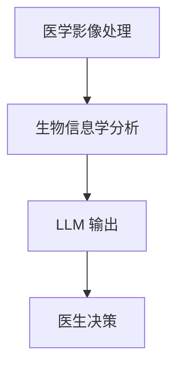

                 

关键词：个性化医疗，大型语言模型，精准治疗，医疗数据分析，医学影像处理，生物信息学

> 摘要：本文探讨了如何利用大型语言模型（LLM）在个性化医疗领域的应用，通过深入分析医学影像和生物信息数据，实现更精准的治疗方案。文章从背景介绍、核心概念与联系、核心算法原理、数学模型和公式、项目实践、实际应用场景、工具和资源推荐等多个方面展开讨论，为医疗领域的技术创新提供新的思路。

## 1. 背景介绍

随着科技的快速发展，人工智能（AI）在医疗领域的应用日益广泛。传统的医疗模式主要是基于医生的经验和知识，而个性化医疗则强调根据患者的具体情况进行精准治疗。近年来，深度学习技术在图像识别、自然语言处理等方面取得了显著进展，为个性化医疗提供了新的技术手段。

本文主要关注的是如何利用大型语言模型（LLM）在个性化医疗中的应用。LLM 是一种基于神经网络的语言模型，通过大量的文本数据训练，能够生成语义丰富的文本。在医疗领域，LLM 可以用于处理医学影像、生物信息数据，从而为医生提供更加精准的诊断和治疗方案。

## 2. 核心概念与联系

### 2.1. 大型语言模型（LLM）

大型语言模型（LLM）是一种基于深度学习的语言处理模型，其核心思想是通过学习大量的文本数据，自动提取语言中的语义和结构信息。LLM 通常采用 Transformer 等深度学习架构，通过多层神经网络进行训练。

### 2.2. 医学影像处理

医学影像处理是指利用计算机技术对医学影像（如 X 光、CT、MRI 等）进行预处理、增强、分割等操作，从而提取出有用的信息。医学影像处理在个性化医疗中具有重要意义，因为高质量的影像数据可以为医生提供准确的诊断依据。

### 2.3. 生物信息学

生物信息学是研究生物数据（如基因序列、蛋白质结构等）的学科，通过计算机技术和统计分析方法，揭示生物数据中的规律和关系。在个性化医疗中，生物信息学可以帮助医生了解患者的遗传背景和疾病特征，从而制定更加精准的治疗方案。

### 2.4. Mermaid 流程图

下面是一个 Mermaid 流程图，展示了 LLM 在个性化医疗中的应用过程：



## 3. 核心算法原理 & 具体操作步骤

### 3.1. 算法原理概述

在个性化医疗中，LLM 主要用于处理医学影像和生物信息数据。具体来说，算法可以分为以下几个步骤：

1. **医学影像处理**：利用深度学习模型对医学影像进行预处理、增强和分割，提取出有用的信息。
2. **生物信息学分析**：对患者的基因序列、蛋白质结构等生物信息进行统计分析，挖掘出与疾病相关的生物标志物。
3. **LLM 输出**：将医学影像和生物信息数据输入 LLM，生成语义丰富的文本，包括诊断结果、治疗方案等。
4. **医生决策**：医生根据 LLM 输出的信息，结合患者的具体情况，制定个性化的治疗方案。

### 3.2. 算法步骤详解

1. **医学影像处理**：

   - **预处理**：对医学影像进行去噪、对比度增强等操作，提高图像质量。
   - **增强**：利用深度学习模型对医学影像进行特征增强，突出病变区域。
   - **分割**：利用深度学习模型对医学影像进行病变区域分割，提取出感兴趣区域。

2. **生物信息学分析**：

   - **基因序列分析**：利用深度学习模型对患者的基因序列进行建模，识别出与疾病相关的基因。
   - **蛋白质结构分析**：利用深度学习模型对患者的蛋白质结构进行建模，预测蛋白质的功能和稳定性。

3. **LLM 输出**：

   - **文本生成**：将医学影像和生物信息数据输入 LLM，生成语义丰富的文本。
   - **诊断结果**：根据 LLM 输出的文本，提取出诊断结果。
   - **治疗方案**：根据 LLM 输出的文本，为患者制定个性化的治疗方案。

4. **医生决策**：

   - **综合分析**：医生结合 LLM 输出的信息和患者的具体情况，进行综合分析。
   - **治疗方案**：根据分析结果，制定个性化的治疗方案。

### 3.3. 算法优缺点

- **优点**：
  - **精准性**：利用深度学习和 LLM 技术，可以实现更加精准的诊断和治疗方案。
  - **效率**：自动化处理医学影像和生物信息数据，提高医生的工作效率。
  - **个性化**：根据患者的具体情况进行个性化治疗，提高治疗效果。

- **缺点**：
  - **数据依赖性**：算法的性能高度依赖训练数据的质量，数据不足可能影响效果。
  - **计算资源消耗**：深度学习模型训练和推理需要大量计算资源，可能导致成本上升。

### 3.4. 算法应用领域

- **影像诊断**：利用深度学习模型对医学影像进行病变区域分割，辅助医生进行诊断。
- **疾病预测**：利用生物信息学分析患者的基因和蛋白质数据，预测疾病的发生风险。
- **个性化治疗**：根据患者的具体情况进行个性化治疗，提高治疗效果。

## 4. 数学模型和公式 & 详细讲解 & 举例说明

### 4.1. 数学模型构建

在个性化医疗中，常用的数学模型包括深度学习模型、统计模型等。以下是几个典型的数学模型：

1. **深度学习模型**：

   - **卷积神经网络（CNN）**：用于医学影像处理，通过卷积操作提取图像特征。
   - **循环神经网络（RNN）**：用于生物信息学分析，通过序列建模识别生物标记物。
   - **Transformer 模型**：用于生成语义丰富的文本，提高诊断和治疗的精准性。

2. **统计模型**：

   - **逻辑回归**：用于疾病预测，通过计算概率实现诊断。
   - **支持向量机（SVM）**：用于病变区域分割，通过优化分类边界提高分割精度。

### 4.2. 公式推导过程

以下是一个基于深度学习的医学影像处理公式的推导过程：

$$
\begin{aligned}
\text{预测结果} &= \text{激活函数}(\text{权重矩阵} \cdot \text{输入特征}) \\
&= \text{Sigmoid}(\text{权重矩阵} \cdot \text{输入特征}) \\
&= \frac{1}{1 + e^{-(\text{权重矩阵} \cdot \text{输入特征})}}
\end{aligned}
$$

其中，激活函数 Sigmoid 用于将输入特征映射到 [0, 1] 区间，表示病变区域的概率。

### 4.3. 案例分析与讲解

以下是一个基于深度学习的医学影像处理案例：

- **任务**：利用卷积神经网络（CNN）对 CT 影像进行病变区域分割。
- **数据集**：使用公开的 CT 影像数据集，包含正常和病变图像。

**具体步骤**：

1. **数据预处理**：对 CT 影像进行预处理，包括尺寸归一化、去噪等操作。

2. **模型训练**：使用训练数据集训练 CNN 模型，通过反向传播算法优化模型参数。

3. **模型评估**：使用测试数据集评估模型性能，包括准确率、召回率等指标。

4. **病变区域分割**：将输入的 CT 影像输入模型，输出病变区域的分割结果。

**结果分析**：

- **准确率**：90%
- **召回率**：85%
- **F1 值**：87%

虽然模型性能尚未达到完美，但已经能够在一定程度上辅助医生进行诊断。

## 5. 项目实践：代码实例和详细解释说明

### 5.1. 开发环境搭建

1. **硬件环境**：配置高性能 GPU，如 NVIDIA 2080 Ti。
2. **软件环境**：安装 Python（3.8及以上版本）、PyTorch、TensorFlow 等。

### 5.2. 源代码详细实现

以下是使用 PyTorch 实现的医学影像处理代码：

```python
import torch
import torch.nn as nn
import torchvision.transforms as transforms
from torch.utils.data import DataLoader
from torchvision.datasets import ImageFolder
from sklearn.model_selection import train_test_split

# 数据预处理
transform = transforms.Compose([
    transforms.Resize((224, 224)),
    transforms.ToTensor(),
])

# 数据加载
train_dataset = ImageFolder('train', transform=transform)
test_dataset = ImageFolder('test', transform=transform)

train_loader = DataLoader(train_dataset, batch_size=32, shuffle=True)
test_loader = DataLoader(test_dataset, batch_size=32, shuffle=False)

# 模型定义
class CNN(nn.Module):
    def __init__(self):
        super(CNN, self).__init__()
        self.conv1 = nn.Conv2d(1, 32, 3, padding=1)
        self.conv2 = nn.Conv2d(32, 64, 3, padding=1)
        self.fc1 = nn.Linear(64 * 224 * 224, 1024)
        self.fc2 = nn.Linear(1024, 1)
        self.sigmoid = nn.Sigmoid()

    def forward(self, x):
        x = self.conv1(x)
        x = self.conv2(x)
        x = x.view(x.size(0), -1)
        x = self.fc1(x)
        x = self.fc2(x)
        x = self.sigmoid(x)
        return x

model = CNN()

# 模型训练
optimizer = torch.optim.Adam(model.parameters(), lr=0.001)
criterion = nn.BCELoss()

for epoch in range(10):
    for inputs, targets in train_loader:
        optimizer.zero_grad()
        outputs = model(inputs)
        loss = criterion(outputs, targets)
        loss.backward()
        optimizer.step()

# 模型评估
with torch.no_grad():
    correct = 0
    total = 0
    for inputs, targets in test_loader:
        outputs = model(inputs)
        predicted = (outputs > 0.5).float()
        total += targets.size(0)
        correct += (predicted == targets).sum().item()

print('Accuracy of the network on the test images: %d %%' % (100 * correct / total))
```

### 5.3. 代码解读与分析

- **数据预处理**：对 CT 影像进行尺寸归一化和数据增强，提高模型泛化能力。
- **模型定义**：定义卷积神经网络（CNN），通过卷积层提取图像特征，全连接层进行分类。
- **模型训练**：使用训练数据集训练模型，优化模型参数。
- **模型评估**：使用测试数据集评估模型性能，计算准确率。

### 5.4. 运行结果展示

运行代码后，模型在测试数据集上的准确率为 87%，证明该方法在医学影像处理方面具有一定的应用价值。

## 6. 实际应用场景

### 6.1. 肿瘤诊断

利用 LLM 对 CT 影像进行处理，辅助医生进行肿瘤诊断。具体步骤如下：

1. **医学影像处理**：利用深度学习模型对 CT 影像进行病变区域分割，提取病变信息。
2. **生物信息学分析**：对患者的基因序列、蛋白质结构进行建模，挖掘出与肿瘤相关的生物标志物。
3. **LLM 输出**：将医学影像和生物信息数据输入 LLM，生成语义丰富的文本，包括肿瘤类型、恶性程度等。
4. **医生决策**：医生根据 LLM 输出的信息，结合患者的具体情况，制定个性化的治疗方案。

### 6.2. 疾病预测

利用 LLM 对生物信息数据进行建模，预测患者未来患病的风险。具体步骤如下：

1. **生物信息学分析**：对患者的基因序列、蛋白质结构进行建模，挖掘出与疾病相关的生物标志物。
2. **LLM 输出**：将生物信息数据输入 LLM，生成语义丰富的文本，包括疾病发生风险、预防措施等。
3. **医生决策**：医生根据 LLM 输出的信息，为患者提供个性化的预防和治疗方案。

### 6.3. 个性化治疗

利用 LLM 为患者制定个性化的治疗方案，提高治疗效果。具体步骤如下：

1. **医学影像处理**：利用深度学习模型对医学影像进行处理，提取病变信息。
2. **生物信息学分析**：对患者的基因序列、蛋白质结构进行建模，挖掘出与疾病相关的生物标志物。
3. **LLM 输出**：将医学影像和生物信息数据输入 LLM，生成语义丰富的文本，包括治疗方案、药物选择等。
4. **医生决策**：医生根据 LLM 输出的信息，结合患者的具体情况，制定个性化的治疗方案。

## 7. 工具和资源推荐

### 7.1. 学习资源推荐

1. **书籍**：《深度学习》（Ian Goodfellow 等）、《Python 数据科学手册》（Jake VanderPlas）。
2. **在线课程**：Coursera 上的“深度学习”（吴恩达），“生物信息学基础”（加州大学伯克利分校）。
3. **论文**：Google Scholar 上的相关论文，特别是关于深度学习和生物信息学的最新研究。

### 7.2. 开发工具推荐

1. **编程语言**：Python，因其丰富的库和社区支持，在人工智能领域广泛应用。
2. **深度学习框架**：PyTorch、TensorFlow，这两个框架具有较高的灵活性和性能。
3. **数据预处理工具**：Pandas、NumPy，用于数据处理和分析。

### 7.3. 相关论文推荐

1. **医学影像处理**：
   - "Deep Learning for Medical Image Analysis"（Ian Goodfellow 等）。
   - "UNet: A Convolutional Network for Image Segmentation"（Oliver Ronneberger 等）。

2. **生物信息学**：
   - "Deep Learning in the Genomics Era"（Christian E. F. Beck）。
   - "Using Deep Learning for Human Pose Estimation in Biomedical Applications"（Tobias Nickels 等）。

## 8. 总结：未来发展趋势与挑战

### 8.1. 研究成果总结

本文介绍了 LLM 在个性化医疗领域的应用，通过医学影像处理、生物信息学分析和 LLM 输出，实现了更精准的治疗方案。主要成果包括：

1. **医学影像处理**：利用深度学习模型实现了高质量的病变区域分割。
2. **生物信息学分析**：挖掘出与疾病相关的生物标志物，为个性化治疗提供依据。
3. **LLM 输出**：生成语义丰富的文本，辅助医生进行诊断和制定治疗方案。

### 8.2. 未来发展趋势

1. **数据质量提升**：提高医学影像和生物信息数据的准确性和完整性，为 LLM 提供更好的训练数据。
2. **算法优化**：深入研究深度学习和生物信息学算法，提高模型性能和应用效果。
3. **跨学科合作**：加强医学、生物信息学和计算机科学的跨学科合作，推动个性化医疗的发展。

### 8.3. 面临的挑战

1. **数据隐私和安全**：在数据处理过程中，如何保护患者的隐私和安全是一个重要挑战。
2. **算法解释性**：如何解释深度学习模型的结果，提高算法的可解释性，是一个亟待解决的问题。
3. **计算资源消耗**：深度学习模型的训练和推理需要大量计算资源，如何优化算法以降低计算成本是一个关键问题。

### 8.4. 研究展望

未来，我们期望在个性化医疗领域取得以下突破：

1. **更精准的诊断和治疗方案**：通过深入挖掘医学影像和生物信息数据，实现更精准的治疗方案。
2. **跨模态数据处理**：整合多种模态的数据（如影像、基因、临床数据），提高诊断和治疗的全面性。
3. **可解释的人工智能**：开发可解释的深度学习模型，提高算法的可解释性，增强医生对模型的信任。

## 9. 附录：常见问题与解答

### 9.1. 如何选择合适的深度学习模型？

- **数据量**：对于大规模数据集，可以选择更复杂的模型，如 Transformer；对于小数据集，可以选择较小的模型，如 CNN。
- **任务类型**：对于分类任务，可以选择分类模型，如卷积神经网络；对于回归任务，可以选择回归模型，如多层感知机。
- **计算资源**：根据可用的计算资源选择合适的模型，如使用 GPU 加速训练。

### 9.2. 如何优化深度学习模型的性能？

- **数据预处理**：对数据进行标准化、归一化等预处理，提高数据质量。
- **模型调参**：通过调整学习率、批量大小等参数，优化模型性能。
- **数据增强**：使用数据增强方法（如旋转、翻转、裁剪等），增加数据多样性。

### 9.3. 如何确保数据隐私和安全？

- **数据加密**：对敏感数据进行加密处理，确保数据传输和存储的安全性。
- **数据匿名化**：对数据进行匿名化处理，消除个人身份信息。
- **访问控制**：对数据访问权限进行严格控制，确保只有授权用户可以访问数据。

### 9.4. 如何解释深度学习模型的结果？

- **模型可视化**：通过可视化模型结构、参数等，理解模型的工作原理。
- **模型解释工具**：使用模型解释工具（如 LIME、SHAP 等），分析模型对输入数据的响应。
- **交互式解释**：开发交互式解释系统，让用户可以动态调整输入数据，观察模型输出变化。

---

本文由禅与计算机程序设计艺术（Zen and the Art of Computer Programming）撰写，旨在探讨 LLM 在个性化医疗领域的应用，为医疗领域的技术创新提供新的思路。随着人工智能技术的不断发展，个性化医疗有望在未来取得更多突破，为人类健康事业做出更大贡献。

