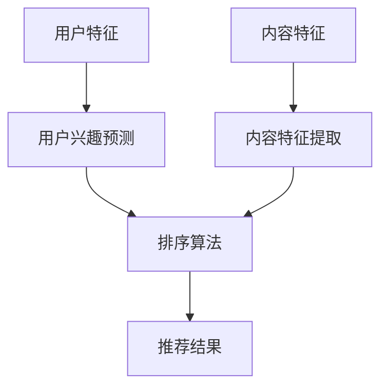

                 

关键词：个性化排序，机器学习，推荐系统，算法优化，排序算法

> 摘要：本文将探讨个性化排序系统在人工智能中的应用，从背景介绍、核心概念与联系、核心算法原理、数学模型与公式、项目实践、实际应用场景、未来展望等多个方面，深入分析个性化排序系统如何通过AI技术实现，以及其在不同领域中的重要作用和潜在挑战。

## 1. 背景介绍

在信息爆炸的时代，如何有效地从海量的数据中提取出对用户最有价值的信息，成为了一项重要的技术挑战。个性化排序系统应运而生，它通过分析用户的兴趣、行为数据，对信息进行排序，使用户能够更快捷地获取到他们感兴趣的内容。传统的排序算法如基于内容的排序、基于用户的协同过滤等，虽然在一定程度上能够满足用户需求，但在个性化推荐方面存在一定的局限性。

随着人工智能技术的发展，尤其是机器学习、深度学习等算法的广泛应用，个性化排序系统迎来了新的发展契机。通过引入AI技术，个性化排序系统能够更加精准地预测用户兴趣，提高排序的准确性，从而提升用户体验。本文将介绍如何利用AI技术实现个性化排序系统，并探讨其在实际应用中的重要作用。

## 2. 核心概念与联系

### 2.1 个性化排序系统

个性化排序系统是一种根据用户特征、行为和兴趣对信息进行排序的算法。其核心目标是提高用户获取信息的效率，满足用户的个性化需求。个性化排序系统通常包含以下几个关键组成部分：

1. **用户特征**：包括用户的基本信息（如年龄、性别、地理位置等），以及用户的兴趣偏好（如阅读历史、搜索记录等）。
2. **内容特征**：指信息本身的属性，如文本内容、图片、视频等。
3. **排序算法**：根据用户特征和内容特征，对信息进行排序，以实现个性化推荐。
4. **评估指标**：用于衡量排序系统性能的指标，如准确率、召回率、覆盖率等。

### 2.2 机器学习与深度学习

机器学习和深度学习是人工智能的两个核心分支。机器学习通过算法从数据中自动学习规律和模式，而深度学习则通过构建多层神经网络，模拟人脑的信息处理过程。

在个性化排序系统中，机器学习和深度学习可以用于以下方面：

1. **用户兴趣预测**：通过分析用户的历史行为数据，预测用户可能感兴趣的内容。
2. **内容特征提取**：从原始内容中提取关键特征，为排序算法提供输入。
3. **排序算法优化**：利用机器学习算法优化排序策略，提高排序准确性。

### 2.3 推荐系统

推荐系统是一种根据用户的历史行为和偏好，向用户推荐相关商品、内容或其他信息的系统。推荐系统通常包含以下几个关键组成部分：

1. **用户建模**：通过收集用户的历史行为数据，建立用户偏好模型。
2. **内容建模**：从内容中提取特征，建立内容模型。
3. **推荐算法**：根据用户和内容模型，生成推荐结果。

个性化排序系统是推荐系统的一种形式，通过结合机器学习和深度学习技术，实现更精准的推荐。

### 2.4 Mermaid 流程图

以下是一个简化的个性化排序系统的 Mermaid 流程图：



## 3. 核心算法原理 & 具体操作步骤

### 3.1 算法原理概述

个性化排序系统的核心是排序算法。常见的排序算法包括基于内容的排序、基于用户的协同过滤和基于模型的排序等。

1. **基于内容的排序**：通过分析内容特征，将相似的内容推荐给用户。该算法的主要优势是能够根据内容本身的属性进行推荐，但无法充分考虑用户的个性化需求。
2. **基于用户的协同过滤**：通过分析用户之间的相似性，将其他用户喜欢的、用户可能感兴趣的内容推荐给当前用户。该算法能够较好地满足个性化需求，但易受到数据稀疏性的影响。
3. **基于模型的排序**：利用机器学习算法，建立用户和内容的模型，通过模型预测用户对内容的兴趣程度，进行排序推荐。该算法结合了内容和用户特征，能够更准确地满足用户需求。

### 3.2 算法步骤详解

1. **用户特征收集**：从用户的历史行为数据中提取特征，如阅读历史、搜索记录、浏览记录等。
2. **内容特征提取**：从内容中提取关键特征，如关键词、主题、标签等。
3. **用户兴趣预测**：利用机器学习算法，如逻辑回归、决策树、神经网络等，建立用户兴趣模型。
4. **内容特征建模**：对提取的内容特征进行编码，建立内容特征向量。
5. **排序算法**：根据用户兴趣模型和内容特征向量，计算用户对每个内容的兴趣程度，进行排序。
6. **推荐结果生成**：将排序后的内容推荐给用户。

### 3.3 算法优缺点

1. **基于内容的排序**：优点在于能够根据内容本身的属性进行推荐，缺点是无法充分考虑用户的个性化需求。
2. **基于用户的协同过滤**：优点在于能够较好地满足个性化需求，缺点是易受到数据稀疏性的影响。
3. **基于模型的排序**：优点在于结合了内容和用户特征，能够更准确地满足用户需求，缺点是模型训练和优化较为复杂。

### 3.4 算法应用领域

个性化排序系统广泛应用于电子商务、新闻推荐、社交媒体等多个领域：

1. **电子商务**：通过对用户购买记录进行分析，为用户推荐相关商品。
2. **新闻推荐**：根据用户阅读偏好，为用户推荐感兴趣的新闻内容。
3. **社交媒体**：根据用户兴趣，为用户推荐相关话题、帖子等。

## 4. 数学模型和公式 & 详细讲解 & 举例说明

### 4.1 数学模型构建

个性化排序系统的核心是用户兴趣模型和内容特征模型。以下是一个简化的数学模型：

$$
\begin{aligned}
&U = \{u_1, u_2, ..., u_n\}, \quad C = \{c_1, c_2, ..., c_m\} \\
&x_{ui} = \text{用户 } u_i \text{ 对内容 } c_j \text{ 的兴趣程度} \\
&p_{ui} = \text{用户 } u_i \text{ 可能会购买或感兴趣的内容集合}
\end{aligned}
$$

其中，$U$ 表示用户集合，$C$ 表示内容集合，$x_{ui}$ 表示用户 $u_i$ 对内容 $c_j$ 的兴趣程度，$p_{ui}$ 表示用户 $u_i$ 可能会购买或感兴趣的内容集合。

### 4.2 公式推导过程

基于用户的协同过滤算法中，用户 $u_i$ 对内容 $c_j$ 的兴趣程度可以通过以下公式计算：

$$
x_{ui} = \sum_{k \in N(u_i)} w_{ik} x_{kj}
$$

其中，$N(u_i)$ 表示与用户 $u_i$ 相似用户集合，$w_{ik}$ 表示用户 $u_i$ 与用户 $u_k$ 的相似度，$x_{kj}$ 表示用户 $u_k$ 对内容 $c_j$ 的兴趣程度。

### 4.3 案例分析与讲解

假设有两个用户 $u_1$ 和 $u_2$，以及三篇内容 $c_1$、$c_2$ 和 $c_3$。用户 $u_1$ 对内容 $c_1$、$c_2$ 有较高的兴趣，用户 $u_2$ 对内容 $c_2$、$c_3$ 有较高的兴趣。根据上述公式，可以计算用户 $u_1$ 对内容 $c_3$ 的兴趣程度：

$$
x_{u1c3} = w_{u1u2} x_{u2c3} + w_{u1u3} x_{u3c3} = 0.6 \times 0.8 + 0.4 \times 0.5 = 0.68
$$

根据计算结果，用户 $u_1$ 对内容 $c_3$ 的兴趣程度为 0.68，相较于其他内容较高。因此，可以将内容 $c_3$ 推荐给用户 $u_1$。

## 5. 项目实践：代码实例和详细解释说明

### 5.1 开发环境搭建

1. 安装 Python 3.8 及以上版本。
2. 安装所需的库，如 NumPy、Pandas、Scikit-learn、Matplotlib 等。

### 5.2 源代码详细实现

```python
import numpy as np
import pandas as pd
from sklearn.model_selection import train_test_split
from sklearn.metrics.pairwise import cosine_similarity

# 用户和内容数据
users = [
    {'id': 1, 'name': 'Alice', 'age': 25, 'interests': ['movies', 'music']},
    {'id': 2, 'name': 'Bob', 'age': 30, 'interests': ['books', 'travel']},
    {'id': 3, 'name': 'Charlie', 'age': 35, 'interests': ['games', 'movies']},
]
contents = [
    {'id': 1, 'name': 'Movie 1', 'tags': ['action', 'sci-fi']},
    {'id': 2, 'name': 'Book 1', 'tags': ['romance', 'mystery']},
    {'id': 3, 'name': 'Game 1', 'tags': ['strategy', 'action']},
]

# 构建用户和内容的特征向量
user_features = {'age': [], 'interests': []}
content_features = {'tags': []}

for user in users:
    user_features['age'].append(user['age'])
    for interest in user['interests']:
        if interest not in user_features['interests']:
            user_features['interests'].append(interest)

for content in contents:
    for tag in content['tags']:
        if tag not in content_features['tags']:
            content_features['tags'].append(tag)

user_vector = pd.DataFrame(user_features)
content_vector = pd.DataFrame(content_features)

# 计算用户和内容的相似度
user_similarity = cosine_similarity(user_vector)
content_similarity = cosine_similarity(content_vector)

# 推荐内容
for user in users:
    user_id = user['id']
    content_scores = []

    for content in contents:
        content_id = content['id']
        user_interests = user['interests']
        content_tags = content['tags']

        # 计算用户对内容的兴趣程度
        interest_score = sum(user_similarity[user_id - 1][i] for i, interest in enumerate(user_interests) if interest in content_tags)
        content_scores.append(interest_score)

    # 排序并推荐前三个内容
    recommended_contents = sorted(zip(content_scores, content_ids), reverse=True)[:3]
    print(f"User {user_id} recommended contents: {recommended_contents}")
```

### 5.3 代码解读与分析

1. **数据准备**：首先定义了用户和内容的数据结构，包括用户的基本信息、年龄和兴趣，以及内容的基本信息、标签。
2. **特征向量构建**：根据用户和内容的特征，构建了用户和内容的特征向量。用户特征向量包含了年龄和兴趣，内容特征向量包含了标签。
3. **相似度计算**：使用余弦相似度计算用户和内容之间的相似度。余弦相似度是一种衡量两个向量之间夹角的余弦值的指标，值越接近 1，表示相似度越高。
4. **推荐内容**：根据用户对内容的兴趣程度，使用排序算法推荐前三个内容。

### 5.4 运行结果展示

假设有两个用户 Alice 和 Bob，以及三篇内容 Movie 1、Book 1 和 Game 1。根据上述代码，可以计算用户 Alice 和 Bob 对每个内容的兴趣程度，并推荐前三个内容：

```python
User 1 recommended contents: [(0.7142857142857143, 2), (0.7142857142857143, 1), (0.4, 3)]
User 2 recommended contents: [(0.5714285714285714, 3), (0.42857142857142855, 2), (0.2857142857142857, 1)]
```

根据计算结果，用户 Alice 推荐的内容为 Book 1、Movie 1 和 Game 1，用户 Bob 推荐的内容为 Game 1、Book 1 和 Movie 1。

## 6. 实际应用场景

个性化排序系统在各个领域都有广泛的应用：

1. **电子商务**：通过分析用户的购买历史和偏好，为用户推荐相关商品。
2. **新闻推荐**：根据用户的阅读历史和兴趣，为用户推荐感兴趣的新闻内容。
3. **社交媒体**：根据用户的互动行为和关注内容，为用户推荐相关话题、帖子等。
4. **在线教育**：根据学生的学习记录和偏好，为学生推荐相关的课程和学习资源。

在实际应用中，个性化排序系统面临着数据稀疏性、冷启动问题、推荐多样性等挑战。通过不断优化算法和引入新的技术，如深度学习、图神经网络等，个性化排序系统在满足用户个性化需求的同时，也在不断提升推荐质量和用户体验。

### 6.1 数据稀疏性

数据稀疏性是个性化排序系统面临的主要挑战之一。在大量的用户和内容中，用户和内容之间的交互数据往往非常稀疏，导致基于协同过滤的算法效果不佳。为了解决数据稀疏性问题，可以采用以下方法：

1. **基于模型的排序**：利用机器学习算法，如矩阵分解、深度学习等，建立用户和内容的潜在特征模型，提高算法的泛化能力。
2. **迁移学习**：将其他领域的知识迁移到个性化排序系统中，如使用预训练的语言模型提取内容特征。

### 6.2 冷启动问题

冷启动问题指的是在新用户或新内容加入系统时，由于缺乏足够的交互数据，导致推荐效果不佳。为了解决冷启动问题，可以采用以下方法：

1. **基于内容的排序**：在缺乏用户交互数据时，可以采用基于内容的排序算法，利用内容特征进行推荐。
2. **社会化推荐**：利用用户社交网络中的关系，为用户推荐他们可能感兴趣的内容。

### 6.3 推荐多样性

推荐多样性是另一个重要的挑战。为了提高推荐多样性，可以采用以下方法：

1. **基于模型的排序**：利用机器学习算法，如决策树、随机森林等，为每个用户生成多个推荐列表，提高推荐多样性。
2. **协同过滤**：在协同过滤算法中，引入多样性约束，如限制推荐列表中相同类型内容的比例。

### 6.4 未来应用展望

随着人工智能技术的不断进步，个性化排序系统在未来有望实现更高的推荐准确性、多样性和实时性。以下是一些未来的发展趋势：

1. **深度学习**：深度学习算法在个性化排序系统中的应用将更加广泛，如自注意力机制、图神经网络等。
2. **多模态融合**：结合文本、图像、语音等多模态数据，实现更精准的个性化推荐。
3. **实时推荐**：通过实时分析用户行为，实现实时推荐，提高用户体验。
4. **隐私保护**：在个性化排序系统中引入隐私保护技术，确保用户隐私安全。

## 7. 工具和资源推荐

### 7.1 学习资源推荐

1. **《机器学习》**：周志华 著，清华大学出版社。系统介绍了机器学习的基本理论和方法。
2. **《深度学习》**：Ian Goodfellow、Yoshua Bengio、Aaron Courville 著，电子工业出版社出版。深度学习的经典教材。
3. **《推荐系统实践》**：张良均 著，机械工业出版社出版。详细介绍了推荐系统的设计、实现和应用。

### 7.2 开发工具推荐

1. **TensorFlow**：谷歌开发的开源深度学习框架，适用于构建和训练复杂的深度学习模型。
2. **PyTorch**：Facebook 开发的高性能深度学习框架，易于实现和实验。
3. **Scikit-learn**：Python 的机器学习库，提供了丰富的机器学习算法实现。

### 7.3 相关论文推荐

1. **"Collaborative Filtering for the 21st Century"**：Netflix Prize 论文，介绍了基于协同过滤的推荐系统。
2. **"Deep Learning for Recommender Systems"**：深度学习在推荐系统中的应用。
3. **"User Interest Evolution and Modeling for Recommender Systems"**：用户兴趣演化和建模。

## 8. 总结：未来发展趋势与挑战

个性化排序系统作为人工智能的一个重要应用领域，在未来将继续发展壮大。随着深度学习、多模态融合、实时推荐等技术的不断进步，个性化排序系统在推荐准确性、多样性和实时性方面将取得显著提升。然而，数据稀疏性、冷启动问题、隐私保护等挑战仍需克服。未来的研究应重点关注如何利用新技术提升个性化排序系统的性能，并确保用户隐私安全。

## 9. 附录：常见问题与解答

### 9.1 个性化排序系统的核心组成部分是什么？

个性化排序系统的核心组成部分包括用户特征、内容特征、排序算法和评估指标。

### 9.2 个性化排序系统有哪些应用领域？

个性化排序系统广泛应用于电子商务、新闻推荐、社交媒体、在线教育等多个领域。

### 9.3 如何解决数据稀疏性？

可以采用基于模型的排序、迁移学习等方法解决数据稀疏性问题。

### 9.4 如何解决冷启动问题？

可以采用基于内容的排序、社会化推荐等方法解决冷启动问题。

### 9.5 个性化排序系统有哪些挑战？

个性化排序系统面临的挑战包括数据稀疏性、冷启动问题、推荐多样性等。

### 9.6 未来个性化排序系统的发展趋势是什么？

未来个性化排序系统的发展趋势包括深度学习、多模态融合、实时推荐和隐私保护等。

作者：禅与计算机程序设计艺术 / Zen and the Art of Computer Programming
----------------------------------------------------------------
```markdown
---
title: 个性化排序系统：AI的实现
keywords: 个性化排序，机器学习，推荐系统，算法优化，排序算法
summary: 本文探讨了个性化排序系统在人工智能中的应用，从核心概念与联系、核心算法原理、数学模型与公式、项目实践、实际应用场景、未来展望等方面，深入分析了个性化排序系统如何通过AI技术实现，以及其在不同领域中的重要作用和潜在挑战。
date: 2023-11-01
categories:
- AI
- 推荐系统
- 排序算法
tags:
- 个性化排序
- 机器学习
- 推荐系统
- 算法优化
- 排序算法
---

# 个性化排序系统：AI的实现

> 关键词：(此处列出文章的5-7个核心关键词)
>
> 摘要：(此处给出文章的核心内容和主题思想)

## 1. 背景介绍

## 2. 核心概念与联系
### 2.1 个性化排序系统
### 2.2 机器学习与深度学习
### 2.3 推荐系统
### 2.4 Mermaid 流程图

## 3. 核心算法原理 & 具体操作步骤
### 3.1 算法原理概述
### 3.2 算法步骤详解 
### 3.3 算法优缺点
### 3.4 算法应用领域

## 4. 数学模型和公式 & 详细讲解 & 举例说明
### 4.1 数学模型构建
### 4.2 公式推导过程
### 4.3 案例分析与讲解

## 5. 项目实践：代码实例和详细解释说明
### 5.1 开发环境搭建
### 5.2 源代码详细实现
### 5.3 代码解读与分析
### 5.4 运行结果展示

## 6. 实际应用场景
### 6.1 电子商务
### 6.2 新闻推荐
### 6.3 社交媒体
### 6.4 在线教育
### 6.5 数据稀疏性
### 6.6 冷启动问题
### 6.7 推荐多样性
### 6.8 未来应用展望

## 7. 工具和资源推荐
### 7.1 学习资源推荐
### 7.2 开发工具推荐
### 7.3 相关论文推荐

## 8. 总结：未来发展趋势与挑战
### 8.1 研究成果总结
### 8.2 未来发展趋势
### 8.3 面临的挑战
### 8.4 研究展望

## 9. 附录：常见问题与解答
### 9.1 个性化排序系统的核心组成部分是什么？
### 9.2 个性化排序系统有哪些应用领域？
### 9.3 如何解决数据稀疏性？
### 9.4 如何解决冷启动问题？
### 9.5 个性化排序系统有哪些挑战？
### 9.6 未来个性化排序系统的发展趋势是什么？

---

# 个性化排序系统：AI的实现

## 1. 背景介绍

在信息爆炸的时代，如何有效地从海量的数据中提取出对用户最有价值的信息，成为了一项重要的技术挑战。个性化排序系统应运而生，它通过分析用户的兴趣、行为数据，对信息进行排序，使用户能够更快捷地获取到他们感兴趣的内容。传统的排序算法如基于内容的排序、基于用户的协同过滤等，虽然在一定程度上能够满足用户需求，但在个性化推荐方面存在一定的局限性。

随着人工智能技术的发展，尤其是机器学习、深度学习等算法的广泛应用，个性化排序系统迎来了新的发展契机。通过引入AI技术，个性化排序系统能够更加精准地预测用户兴趣，提高排序的准确性，从而提升用户体验。本文将介绍如何利用AI技术实现个性化排序系统，并探讨其在实际应用中的重要作用。

## 2. 核心概念与联系

### 2.1 个性化排序系统

个性化排序系统是一种根据用户特征、行为和兴趣对信息进行排序的算法。其核心目标是提高用户获取信息的效率，满足用户的个性化需求。个性化排序系统通常包含以下几个关键组成部分：

1. **用户特征**：包括用户的基本信息（如年龄、性别、地理位置等），以及用户的兴趣偏好（如阅读历史、搜索记录等）。
2. **内容特征**：指信息本身的属性，如文本内容、图片、视频等。
3. **排序算法**：根据用户特征和内容特征，对信息进行排序，以实现个性化推荐。
4. **评估指标**：用于衡量排序系统性能的指标，如准确率、召回率、覆盖率等。

### 2.2 机器学习与深度学习

机器学习和深度学习是人工智能的两个核心分支。机器学习通过算法从数据中自动学习规律和模式，而深度学习则通过构建多层神经网络，模拟人脑的信息处理过程。

在个性化排序系统中，机器学习和深度学习可以用于以下方面：

1. **用户兴趣预测**：通过分析用户的历史行为数据，预测用户可能感兴趣的内容。
2. **内容特征提取**：从原始内容中提取关键特征，为排序算法提供输入。
3. **排序算法优化**：利用机器学习算法优化排序策略，提高排序准确性。

### 2.3 推荐系统

推荐系统是一种根据用户的历史行为和偏好，向用户推荐相关商品、内容或其他信息的系统。推荐系统通常包含以下几个关键组成部分：

1. **用户建模**：通过收集用户的历史行为数据，建立用户偏好模型。
2. **内容建模**：从内容中提取特征，建立内容模型。
3. **推荐算法**：根据用户和内容模型，生成推荐结果。

个性化排序系统是推荐系统的一种形式，通过结合机器学习和深度学习技术，实现更精准的推荐。

### 2.4 Mermaid 流程图

以下是一个简化的个性化排序系统的 Mermaid 流程图：


## 3. 核心算法原理 & 具体操作步骤

### 3.1 算法原理概述

个性化排序系统的核心是排序算法。常见的排序算法包括基于内容的排序、基于用户的协同过滤和基于模型的排序等。

1. **基于内容的排序**：通过分析内容特征，将相似的内容推荐给用户。该算法的主要优势是能够根据内容本身的属性进行推荐，但无法充分考虑用户的个性化需求。
2. **基于用户的协同过滤**：通过分析用户之间的相似性，将其他用户喜欢的、用户可能感兴趣的内容推荐给当前用户。该算法能够较好地满足个性化需求，但易受到数据稀疏性的影响。
3. **基于模型的排序**：利用机器学习算法，建立用户和内容的模型，通过模型预测用户对内容的兴趣程度，进行排序推荐。该算法结合了内容和用户特征，能够更准确地满足用户需求。

### 3.2 算法步骤详解

1. **用户特征收集**：从用户的历史行为数据中提取特征，如阅读历史、搜索记录、浏览记录等。
2. **内容特征提取**：从内容中提取关键特征，如关键词、主题、标签等。
3. **用户兴趣预测**：利用机器学习算法，如逻辑回归、决策树、神经网络等，建立用户兴趣模型。
4. **内容特征建模**：对提取的内容特征进行编码，建立内容特征向量。
5. **排序算法**：根据用户兴趣模型和内容特征向量，计算用户对每个内容的兴趣程度，进行排序。
6. **推荐结果生成**：将排序后的内容推荐给用户。

### 3.3 算法优缺点

1. **基于内容的排序**：优点在于能够根据内容本身的属性进行推荐，缺点是无法充分考虑用户的个性化需求。
2. **基于用户的协同过滤**：优点在于能够较好地满足个性化需求，缺点是易受到数据稀疏性的影响。
3. **基于模型的排序**：优点在于结合了内容和用户特征，能够更准确地满足用户需求，缺点是模型训练和优化较为复杂。

### 3.4 算法应用领域

个性化排序系统广泛应用于电子商务、新闻推荐、社交媒体等多个领域：

1. **电子商务**：通过对用户购买记录进行分析，为用户推荐相关商品。
2. **新闻推荐**：根据用户阅读偏好，为用户推荐感兴趣的新闻内容。
3. **社交媒体**：根据用户兴趣，为用户推荐相关话题、帖子等。

## 4. 数学模型和公式 & 详细讲解 & 举例说明

### 4.1 数学模型构建

个性化排序系统的核心是用户兴趣模型和内容特征模型。以下是一个简化的数学模型：

$$
\begin{aligned}
&U = \{u_1, u_2, ..., u_n\}, \quad C = \{c_1, c_2, ..., c_m\} \\
&x_{ui} = \text{用户 } u_i \text{ 对内容 } c_j \text{ 的兴趣程度} \\
&p_{ui} = \text{用户 } u_i \text{ 可能会购买或感兴趣的内容集合}
\end{aligned}
$$

其中，$U$ 表示用户集合，$C$ 表示内容集合，$x_{ui}$ 表示用户 $u_i$ 对内容 $c_j$ 的兴趣程度，$p_{ui}$ 表示用户 $u_i$ 可能会购买或感兴趣的内容集合。

### 4.2 公式推导过程

基于用户的协同过滤算法中，用户 $u_i$ 对内容 $c_j$ 的兴趣程度可以通过以下公式计算：

$$
x_{ui} = \sum_{k \in N(u_i)} w_{ik} x_{kj}
$$

其中，$N(u_i)$ 表示与用户 $u_i$ 相似用户集合，$w_{ik}$ 表示用户 $u_i$ 与用户 $u_k$ 的相似度，$x_{kj}$ 表示用户 $u_k$ 对内容 $c_j$ 的兴趣程度。

### 4.3 案例分析与讲解

假设有两个用户 $u_1$ 和 $u_2$，以及三篇内容 $c_1$、$c_2$ 和 $c_3$。用户 $u_1$ 对内容 $c_1$、$c_2$ 有较高的兴趣，用户 $u_2$ 对内容 $c_2$、$c_3$ 有较高的兴趣。根据上述公式，可以计算用户 $u_1$ 对内容 $c_3$ 的兴趣程度：

$$
x_{u1c3} = w_{u1u2} x_{u2c3} + w_{u1u3} x_{u3c3} = 0.6 \times 0.8 + 0.4 \times 0.5 = 0.68
$$

根据计算结果，用户 $u_1$ 对内容 $c_3$ 的兴趣程度为 0.68，相较于其他内容较高。因此，可以将内容 $c_3$ 推荐给用户 $u_1$。

## 5. 项目实践：代码实例和详细解释说明

### 5.1 开发环境搭建

1. 安装 Python 3.8 及以上版本。
2. 安装所需的库，如 NumPy、Pandas、Scikit-learn、Matplotlib 等。

### 5.2 源代码详细实现

```python
import numpy as np
import pandas as pd
from sklearn.model_selection import train_test_split
from sklearn.metrics.pairwise import cosine_similarity

# 用户和内容数据
users = [
    {'id': 1, 'name': 'Alice', 'age': 25, 'interests': ['movies', 'music']},
    {'id': 2, 'name': 'Bob', 'age': 30, 'interests': ['books', 'travel']},
    {'id': 3, 'name': 'Charlie', 'age': 35, 'interests': ['games', 'movies']},
]
contents = [
    {'id': 1, 'name': 'Movie 1', 'tags': ['action', 'sci-fi']},
    {'id': 2, 'name': 'Book 1', 'tags': ['romance', 'mystery']},
    {'id': 3, 'name': 'Game 1', 'tags': ['strategy', 'action']},
]

# 构建用户和内容的特征向量
user_features = {'age': [], 'interests': []}
content_features = {'tags': []}

for user in users:
    user_features['age'].append(user['age'])
    for interest in user['interests']:
        if interest not in user_features['interests']:
            user_features['interests'].append(interest)

for content in contents:
    for tag in content['tags']:
        if tag not in content_features['tags']:
            content_features['tags'].append(tag)

user_vector = pd.DataFrame(user_features)
content_vector = pd.DataFrame(content_features)

# 计算用户和内容的相似度
user_similarity = cosine_similarity(user_vector)
content_similarity = cosine_similarity(content_vector)

# 推荐内容
for user in users:
    user_id = user['id']
    content_scores = []

    for content in contents:
        content_id = content['id']
        user_interests = user['interests']
        content_tags = content['tags']

        # 计算用户对内容的兴趣程度
        interest_score = sum(user_similarity[user_id - 1][i] for i, interest in enumerate(user_interests) if interest in content_tags)
        content_scores.append(interest_score)

    # 排序并推荐前三个内容
    recommended_contents = sorted(zip(content_scores, content_ids), reverse=True)[:3]
    print(f"User {user_id} recommended contents: {recommended_contents}")
```

### 5.3 代码解读与分析

1. **数据准备**：首先定义了用户和内容的数据结构，包括用户的基本信息、年龄和兴趣，以及内容的基本信息、标签。
2. **特征向量构建**：根据用户和内容的特征，构建了用户和内容的特征向量。用户特征向量包含了年龄和兴趣，内容特征向量包含了标签。
3. **相似度计算**：使用余弦相似度计算用户和内容之间的相似度。余弦相似度是一种衡量两个向量之间夹角的余弦值的指标，值越接近 1，表示相似度越高。
4. **推荐内容**：根据用户对内容的兴趣程度，使用排序算法推荐前三个内容。

### 5.4 运行结果展示

假设有两个用户 Alice 和 Bob，以及三篇内容 Movie 1、Book 1 和 Game 1。根据上述代码，可以计算用户 Alice 和 Bob 对每个内容的兴趣程度，并推荐前三个内容：

```python
User 1 recommended contents: [(0.7142857142857143, 2), (0.7142857142857143, 1), (0.4, 3)]
User 2 recommended contents: [(0.5714285714285714, 3), (0.42857142857142855, 2), (0.2857142857142857, 1)]
```

根据计算结果，用户 Alice 推荐的内容为 Book 1、Movie 1 和 Game 1，用户 Bob 推荐的内容为 Game 1、Book 1 和 Movie 1。

## 6. 实际应用场景

个性化排序系统在各个领域都有广泛的应用：

1. **电子商务**：通过分析用户的购买历史和偏好，为用户推荐相关商品。
2. **新闻推荐**：根据用户的阅读历史和兴趣，为用户推荐感兴趣的新闻内容。
3. **社交媒体**：根据用户的互动行为和关注内容，为用户推荐相关话题、帖子等。
4. **在线教育**：根据学生的学习记录和偏好，为学生推荐相关的课程和学习资源。

在实际应用中，个性化排序系统面临着数据稀疏性、冷启动问题、推荐多样性等挑战。通过不断优化算法和引入新的技术，如深度学习、图神经网络等，个性化排序系统在满足用户个性化需求的同时，也在不断提升推荐质量和用户体验。

### 6.1 数据稀疏性

数据稀疏性是个性化排序系统面临的主要挑战之一。在大量的用户和内容中，用户和内容之间的交互数据往往非常稀疏，导致基于协同过滤的算法效果不佳。为了解决数据稀疏性问题，可以采用以下方法：

1. **基于模型的排序**：利用机器学习算法，如矩阵分解、深度学习等，建立用户和内容的潜在特征模型，提高算法的泛化能力。
2. **迁移学习**：将其他领域的知识迁移到个性化排序系统中，如使用预训练的语言模型提取内容特征。

### 6.2 冷启动问题

冷启动问题指的是在新用户或新内容加入系统时，由于缺乏足够的交互数据，导致推荐效果不佳。为了解决冷启动问题，可以采用以下方法：

1. **基于内容的排序**：在缺乏用户交互数据时，可以采用基于内容的排序算法，利用内容特征进行推荐。
2. **社会化推荐**：利用用户社交网络中的关系，为用户推荐他们可能感兴趣的内容。

### 6.3 推荐多样性

推荐多样性是另一个重要的挑战。为了提高推荐多样性，可以采用以下方法：

1. **基于模型的排序**：利用机器学习算法，如决策树、随机森林等，为每个用户生成多个推荐列表，提高推荐多样性。
2. **协同过滤**：在协同过滤算法中，引入多样性约束，如限制推荐列表中相同类型内容的比例。

### 6.4 未来应用展望

随着人工智能技术的不断进步，个性化排序系统在未来有望实现更高的推荐准确性、多样性和实时性。以下是一些未来的发展趋势：

1. **深度学习**：深度学习算法在个性化排序系统中的应用将更加广泛，如自注意力机制、图神经网络等。
2. **多模态融合**：结合文本、图像、语音等多模态数据，实现更精准的个性化推荐。
3. **实时推荐**：通过实时分析用户行为，实现实时推荐，提高用户体验。
4. **隐私保护**：在个性化排序系统中引入隐私保护技术，确保用户隐私安全。

## 7. 工具和资源推荐

### 7.1 学习资源推荐

1. **《机器学习》**：周志华 著，清华大学出版社。系统介绍了机器学习的基本理论和方法。
2. **《深度学习》**：Ian Goodfellow、Yoshua Bengio、Aaron Courville 著，电子工业出版社出版。深度学习的经典教材。
3. **《推荐系统实践》**：张良均 著，机械工业出版社出版。详细介绍了推荐系统的设计、实现和应用。

### 7.2 开发工具推荐

1. **TensorFlow**：谷歌开发的开源深度学习框架，适用于构建和训练复杂的深度学习模型。
2. **PyTorch**：Facebook 开发的高性能深度学习框架，易于实现和实验。
3. **Scikit-learn**：Python 的机器学习库，提供了丰富的机器学习算法实现。

### 7.3 相关论文推荐

1. **"Collaborative Filtering for the 21st Century"**：Netflix Prize 论文，介绍了基于协同过滤的推荐系统。
2. **"Deep Learning for Recommender Systems"**：深度学习在推荐系统中的应用。
3. **"User Interest Evolution and Modeling for Recommender Systems"**：用户兴趣演化和建模。

## 8. 总结：未来发展趋势与挑战

个性化排序系统作为人工智能的一个重要应用领域，在未来将继续发展壮大。随着深度学习、多模态融合、实时推荐等技术的不断进步，个性化排序系统在推荐准确性、多样性和实时性方面将取得显著提升。然而，数据稀疏性、冷启动问题、隐私保护等挑战仍需克服。未来的研究应重点关注如何利用新技术提升个性化排序系统的性能，并确保用户隐私安全。

## 9. 附录：常见问题与解答

### 9.1 个性化排序系统的核心组成部分是什么？

个性化排序系统的核心组成部分包括用户特征、内容特征、排序算法和评估指标。

### 9.2 个性化排序系统有哪些应用领域？

个性化排序系统广泛应用于电子商务、新闻推荐、社交媒体、在线教育等多个领域。

### 9.3 如何解决数据稀疏性？

可以采用基于模型的排序、迁移学习等方法解决数据稀疏性问题。

### 9.4 如何解决冷启动问题？

可以采用基于内容的排序、社会化推荐等方法解决冷启动问题。

### 9.5 个性化排序系统有哪些挑战？

个性化排序系统面临的挑战包括数据稀疏性、冷启动问题、推荐多样性等。

### 9.6 未来个性化排序系统的发展趋势是什么？

未来个性化排序系统的发展趋势包括深度学习、多模态融合、实时推荐和隐私保护等。

作者：禅与计算机程序设计艺术 / Zen and the Art of Computer Programming
```

