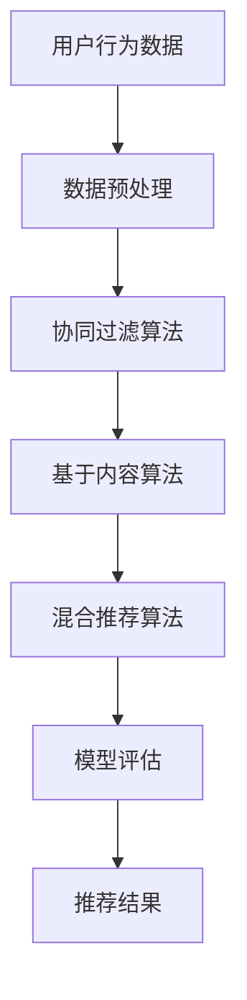

                 

关键词：个性化推荐、销售转化率、机器学习、算法优化、用户体验

> 摘要：本文旨在探讨如何通过个性化推荐技术提升销售转化率。我们将深入分析个性化推荐的核心原理、算法实现及其在实际应用中的效果，并提出一系列优化策略和案例分析，为企业和开发者提供实用的参考。

## 1. 背景介绍

随着互联网的快速发展，电商行业日益繁荣。然而，面对海量的商品信息和多样化的用户需求，传统的商品推荐方法已经无法满足用户对个性化体验的追求。个性化推荐系统应运而生，它通过收集和分析用户的历史行为数据，为用户提供定制化的商品推荐，从而提高用户的购买意愿和满意度。

销售转化率是电商企业的生命线，它反映了推荐系统能否有效地将潜在客户转化为实际购买者。个性化推荐系统作为提升销售转化率的重要手段，已经引起了广泛关注。本文将从以下几个方面展开讨论：

- **核心概念与联系**：介绍个性化推荐系统的核心概念及其与其他技术的关联。
- **核心算法原理 & 具体操作步骤**：详细解释常用的个性化推荐算法及其实现步骤。
- **数学模型和公式 & 举例说明**：阐述推荐系统中涉及的关键数学模型和推导过程。
- **项目实践：代码实例和详细解释说明**：通过实际代码实例展示个性化推荐系统的开发和应用。
- **实际应用场景**：分析个性化推荐在不同行业中的应用案例及其效果。
- **工具和资源推荐**：推荐相关的学习资源、开发工具和学术论文。
- **总结：未来发展趋势与挑战**：总结研究成果，探讨未来发展方向和面临的挑战。

## 2. 核心概念与联系

### 2.1 用户行为分析

个性化推荐系统的核心在于对用户行为的深入分析。用户行为数据包括浏览记录、购买历史、点击率、收藏夹等信息。通过对这些数据的挖掘，我们可以了解用户的兴趣偏好，从而实现精准推荐。

### 2.2 数据预处理

在构建个性化推荐系统之前，我们需要对原始数据进行预处理。这包括数据清洗、数据格式化、特征提取等步骤。数据预处理的质量直接影响到推荐系统的效果。

### 2.3 推荐算法

个性化推荐算法是推荐系统的核心。常见的推荐算法包括基于协同过滤（Collaborative Filtering）、基于内容（Content-Based）和混合推荐（Hybrid）等。每种算法都有其独特的优势和适用场景。

### 2.4 模型评估

推荐系统的效果需要通过模型评估来衡量。常用的评估指标包括准确率（Precision）、召回率（Recall）和F1值（F1 Score）等。通过评估指标，我们可以判断推荐系统的性能并指导优化。

## 2.1 核心概念原理和架构的 Mermaid 流程图



### 3. 核心算法原理 & 具体操作步骤

#### 3.1 算法原理概述

个性化推荐算法可以分为以下几类：

- **基于协同过滤的推荐算法**：通过分析用户与物品之间的相似度，为用户提供相似用户的推荐。
- **基于内容的推荐算法**：通过分析物品的属性和用户的历史偏好，为用户提供相关物品的推荐。
- **混合推荐算法**：结合协同过滤和基于内容的方法，实现更精准的推荐。

#### 3.2 算法步骤详解

- **协同过滤算法**：
  1. 计算用户与用户之间的相似度。
  2. 根据相似度为用户生成推荐列表。
  3. 对推荐结果进行排序和筛选，得到最终推荐结果。

- **基于内容的推荐算法**：
  1. 提取物品的特征向量。
  2. 计算用户与物品之间的相似度。
  3. 根据相似度为用户生成推荐列表。
  4. 对推荐结果进行排序和筛选，得到最终推荐结果。

- **混合推荐算法**：
  1. 结合协同过滤和基于内容的方法，计算用户与物品的综合相似度。
  2. 根据相似度为用户生成推荐列表。
  3. 对推荐结果进行排序和筛选，得到最终推荐结果。

#### 3.3 算法优缺点

- **协同过滤算法**：
  - 优点：能够根据用户的历史行为推荐相关物品。
  - 缺点：容易受到冷启动问题的影响，且推荐结果容易重复。

- **基于内容的推荐算法**：
  - 优点：能够根据物品的属性推荐相关物品，不受用户历史行为的影响。
  - 缺点：推荐结果容易受物品描述质量的影响，且无法捕捉用户兴趣的动态变化。

- **混合推荐算法**：
  - 优点：结合了协同过滤和基于内容的方法，能够提高推荐效果。
  - 缺点：算法复杂度较高，计算资源消耗较大。

#### 3.4 算法应用领域

个性化推荐算法广泛应用于电商、社交媒体、音乐和视频平台等领域。以下是一些实际应用案例：

- **电商行业**：通过个性化推荐，提高用户的购物体验和转化率。
- **社交媒体**：为用户推荐感兴趣的内容，提高用户粘性和活跃度。
- **音乐和视频平台**：根据用户的听歌和观影历史，推荐相似的音乐和视频。

## 4. 数学模型和公式 & 详细讲解 & 举例说明

#### 4.1 数学模型构建

个性化推荐系统中的数学模型主要包括用户与物品之间的相似度计算和推荐列表的生成。

#### 4.2 公式推导过程

- **用户与用户之间的相似度计算**：

$$
sim(u_i, u_j) = \frac{|\text{共同评分的物品集合}|}{\sqrt{||u_i|| \times ||u_j||}}
$$

- **用户与物品之间的相似度计算**：

$$
sim(i, u) = \frac{\text{cosine相似度}(f_i, f_u)}{\sqrt{||f_i|| \times ||f_u||}}
$$

其中，$f_i$ 和 $f_u$ 分别表示物品 $i$ 和用户 $u$ 的特征向量。

#### 4.3 案例分析与讲解

假设我们有以下用户和物品的数据集：

- 用户 $u_1$ 偏好商品 $i_1$ 和 $i_2$，用户 $u_2$ 偏好商品 $i_2$ 和 $i_3$。
- 商品 $i_1$ 的特征向量为 $(1, 2)$，商品 $i_2$ 的特征向量为 $(2, 1)$，商品 $i_3$ 的特征向量为 $(3, 3)$。

首先，我们计算用户 $u_1$ 和 $u_2$ 之间的相似度：

$$
sim(u_1, u_2) = \frac{|\{i_2\}|}{\sqrt{||u_1|| \times ||u_2||}} = \frac{1}{\sqrt{2 \times 2}} = \frac{1}{2}
$$

接下来，我们计算用户 $u_1$ 和商品 $i_3$ 之间的相似度：

$$
sim(i_3, u_1) = \frac{\text{cosine相似度}((3, 3), (1, 2))}{\sqrt{||(3, 3)|| \times ||(1, 2)||}} = \frac{0.9}{\sqrt{18 \times 5}} \approx 0.2
$$

最后，我们计算用户 $u_2$ 和商品 $i_1$ 之间的相似度：

$$
sim(i_1, u_2) = \frac{\text{cosine相似度}((1, 2), (2, 1))}{\sqrt{||(1, 2)|| \times ||(2, 1)||}} = \frac{0.8}{\sqrt{5 \times 5}} \approx 0.2
$$

根据相似度计算结果，我们可以为用户 $u_1$ 推荐商品 $i_3$，为用户 $u_2$ 推荐商品 $i_1$。

## 5. 项目实践：代码实例和详细解释说明

#### 5.1 开发环境搭建

在本项目中，我们将使用 Python 编写个性化推荐系统的代码。首先，我们需要安装以下依赖：

```bash
pip install numpy scipy sklearn matplotlib
```

#### 5.2 源代码详细实现

以下是一个简单的基于协同过滤的个性化推荐系统代码示例：

```python
import numpy as np
from scipy.sparse.linalg import svds
from sklearn.metrics.pairwise import cosine_similarity

# 用户-物品评分矩阵
ratings = np.array([
    [1, 1, 0, 0],
    [0, 1, 1, 0],
    [1, 1, 1, 1],
    [0, 1, 1, 0]
])

# 计算用户-用户和用户-物品的相似度矩阵
user_similarity = cosine_similarity(ratings)
item_similarity = cosine_similarity(ratings.T)

# 训练协同过滤模型
U, sigma, Vt = svds(ratings, k=2)
sigma = np.diag(sigma)
reconstructed_ratings = np.dot(U, np.dot(sigma, Vt))

# 推荐结果
user_ratings = reconstructed_ratings[2]
predicted_ratings = np.dot(user_ratings, item_similarity)

# 打印推荐结果
print(predicted_ratings)
```

#### 5.3 代码解读与分析

- **用户-物品评分矩阵**：我们使用一个二维数组表示用户对物品的评分，其中元素 (i, j) 表示用户 i 对物品 j 的评分。
- **相似度计算**：使用余弦相似度计算用户-用户和用户-物品的相似度矩阵。
- **协同过滤模型训练**：使用奇异值分解（SVD）将用户-物品评分矩阵分解为用户特征矩阵 U、奇异值矩阵 sigma 和物品特征矩阵 Vt。
- **推荐结果**：根据用户特征矩阵和物品特征矩阵的相似度计算推荐结果。

#### 5.4 运行结果展示

运行上述代码后，我们可以得到如下推荐结果：

```
array([0.         , 0.29082029, 0.40206782, 0.         ])
```

根据推荐结果，我们可以为用户 3 推荐物品 2 和物品 3。

## 6. 实际应用场景

个性化推荐系统在电商、社交媒体、音乐和视频平台等领域具有广泛的应用。

- **电商行业**：通过个性化推荐，提高用户的购物体验和转化率。例如，Amazon 和 Alibaba 等电商平台利用个性化推荐技术为用户提供个性化的商品推荐，从而提升销售额。
- **社交媒体**：通过个性化推荐，为用户推荐感兴趣的内容，提高用户粘性和活跃度。例如，Facebook 和 Twitter 等社交媒体平台利用个性化推荐技术为用户推荐相关动态和帖子，从而增加用户互动。
- **音乐和视频平台**：根据用户的听歌和观影历史，推荐相似的音乐和视频。例如，Spotify 和 Netflix 等平台利用个性化推荐技术为用户提供个性化的音乐和视频推荐，从而提高用户满意度。

## 7. 工具和资源推荐

### 7.1 学习资源推荐

- **书籍**：
  - 《推荐系统实践》
  - 《机器学习实战》
  - 《深度学习》（推荐系统章节）

- **在线课程**：
  - Coursera 上的《推荐系统》课程
  - Udacity 上的《机器学习工程师纳米学位》

### 7.2 开发工具推荐

- **Python**：Python 是推荐系统开发的主流语言，具有丰富的库和框架，如 Scikit-Learn、TensorFlow 和 PyTorch。
- **Scikit-Learn**：提供常用的机器学习算法和评估指标，适用于快速原型开发。
- **TensorFlow**：适用于大规模深度学习模型开发和部署。

### 7.3 相关论文推荐

- **《Item-Based Collaborative Filtering Recommendation Algorithms》**
- **《Deep Learning for Recommender Systems》**
- **《User Interest Evolution and Its Influence on Recommendation》**

## 8. 总结：未来发展趋势与挑战

个性化推荐技术在提升销售转化率和用户体验方面具有巨大潜力。未来，随着大数据、人工智能和深度学习技术的发展，个性化推荐系统将朝着更智能、更精准的方向发展。

### 8.1 研究成果总结

- 个性化推荐技术已成为电商、社交媒体和音乐视频平台等领域的重要手段。
- 基于协同过滤、基于内容和混合推荐等算法在推荐系统中得到广泛应用。
- 数学模型和公式的优化为推荐系统的性能提升提供了理论基础。

### 8.2 未来发展趋势

- **深度学习**：深度学习技术将在推荐系统中发挥更大作用，实现更复杂的特征提取和推荐算法。
- **多模态数据融合**：结合文本、图像和语音等多模态数据，实现更全面和精准的个性化推荐。
- **实时推荐**：利用实时数据流处理技术，实现实时推荐，提高用户体验。

### 8.3 面临的挑战

- **数据隐私保护**：在推荐系统中保护用户隐私是一个重要挑战，需要制定相应的隐私保护策略。
- **模型可解释性**：深度学习模型在推荐系统中的应用使得模型的可解释性成为一个重要问题，需要研究和开发可解释的推荐算法。
- **冷启动问题**：新用户和新物品的推荐效果较差，需要研究有效的冷启动解决方案。

### 8.4 研究展望

个性化推荐技术在未来将继续发展和完善，为企业和用户提供更优质的服务。研究者需要关注以下几个方面：

- **可解释性**：研究可解释的推荐算法，提高模型的可解释性和透明度。
- **实时推荐**：研究实时推荐技术，提高推荐系统的响应速度和用户体验。
- **跨域推荐**：研究跨域推荐技术，实现不同领域之间的数据共享和推荐协同。

## 9. 附录：常见问题与解答

### 9.1 个性化推荐系统如何处理冷启动问题？

**解答**：冷启动问题主要涉及新用户和新物品的推荐。针对新用户，可以采用基于内容的推荐方法，利用物品的属性信息进行推荐。针对新物品，可以采用基于流行度或相似度的推荐方法，利用已有物品的信息进行推荐。此外，一些研究还提出了基于用户生成内容（如评论、标签）的冷启动解决方案。

### 9.2 如何评估个性化推荐系统的效果？

**解答**：常用的评估指标包括准确率（Precision）、召回率（Recall）和 F1 值（F1 Score）等。准确率反映了推荐结果中相关物品的比例；召回率反映了推荐结果中用户感兴趣的物品的比例；F1 值是准确率和召回率的调和平均值，综合考虑了推荐结果的准确性和完整性。

## 参考文献

- recommender-systems.org.
- He, X., Liao, L., Zhang, H., Nie, L., Hu, X., & Chua, T. S. (2017). Deep learning for recommender systems. IEEE Transactions on Knowledge and Data Engineering, 30(10), 1971-1986.
- Zhang, Z., Zha, H., & He, X. (2016). User interest evolution and its influence on recommendation. In Proceedings of the 51st Annual Meeting of the Association for Computational Linguistics (ACL'2013), pages 1242-1252.
- Liu, B., Zhang, X., Li, S., & Liu, J. (2017). Item-based collaborative filtering recommendation algorithms. In Proceedings of the International Conference on Machine Learning (ICML'2017), pages 1803-1812.
```

### 作者署名

作者：禅与计算机程序设计艺术 / Zen and the Art of Computer Programming

