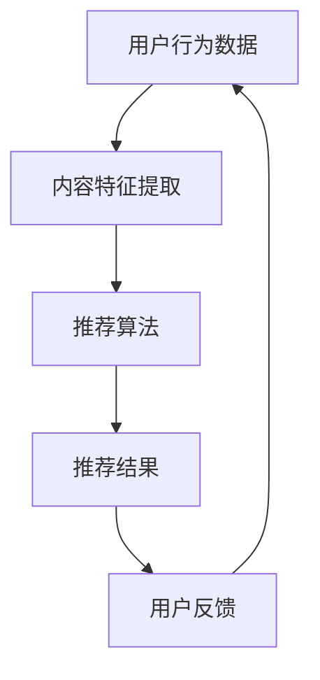

                 

关键词：个性化推荐、用户体验、算法优化、系统架构、数学模型

> 摘要：本文探讨了个性化推荐系统在用户体验优化方面的关键问题。通过分析核心概念、算法原理、数学模型、项目实践以及未来发展趋势，为开发高效的个性化推荐系统提供了有益的指导。

## 1. 背景介绍

个性化推荐系统在当今信息过载的时代显得尤为重要。从社交媒体、电子商务到在线视频平台，几乎所有的在线服务都在运用推荐算法为用户生成个性化的内容。然而，尽管推荐算法在提高用户满意度、增加用户粘性方面取得了显著成效，用户体验的优化仍然是一个持续挑战。

用户体验优化涉及多个方面，包括响应时间、推荐准确性、个性化程度、用户交互设计等。本文将深入探讨个性化推荐系统在用户体验优化中的关键问题，并针对这些问题提出相应的解决方案。

## 2. 核心概念与联系

个性化推荐系统的核心概念包括用户行为分析、内容特征提取和推荐算法。这些概念相互联系，共同构成了推荐系统的架构。

### 2.1 用户行为分析

用户行为分析是指通过收集和分析用户在平台上的行为数据（如浏览记录、购买历史、评分、评论等）来理解用户偏好。这些数据为推荐算法提供了重要的输入。

### 2.2 内容特征提取

内容特征提取是指将用户行为数据转换为适合算法处理的形式。这通常涉及特征选择、特征工程和维度缩减等技术。

### 2.3 推荐算法

推荐算法是推荐系统的核心，负责根据用户行为和内容特征生成个性化的推荐列表。常见的推荐算法有协同过滤、基于内容的推荐、混合推荐等。

### 2.4 Mermaid 流程图

下面是一个简化的 Mermaid 流程图，展示了个性化推荐系统的基本架构：



## 3. 核心算法原理 & 具体操作步骤

### 3.1 算法原理概述

个性化推荐算法的原理基于用户行为和内容特征，旨在生成与用户偏好高度匹配的推荐列表。具体来说，算法可以分为以下几类：

- **协同过滤**：通过分析用户之间的相似性来推荐相似用户喜欢的项目。
- **基于内容的推荐**：基于项目的特征来推荐与用户历史行为相似的项目。
- **混合推荐**：结合协同过滤和基于内容的推荐方法，以获得更好的推荐效果。

### 3.2 算法步骤详解

#### 3.2.1 协同过滤

协同过滤算法包括以下步骤：

1. **用户相似度计算**：计算用户之间的相似度，常用的方法有用户基于项目的相似度和用户基于用户的相似度。
2. **项目相似度计算**：计算项目之间的相似度，常用的方法有项目基于项目的相似度和项目基于用户的相似度。
3. **生成推荐列表**：根据用户和项目的相似度计算结果，为用户生成推荐列表。

#### 3.2.2 基于内容的推荐

基于内容的推荐算法包括以下步骤：

1. **项目特征提取**：提取项目的各种特征，如文本、图像、标签等。
2. **用户特征提取**：提取用户的各种特征，如历史行为、偏好等。
3. **计算相似度**：计算项目与用户之间的相似度。
4. **生成推荐列表**：根据相似度计算结果，为用户生成推荐列表。

#### 3.2.3 混合推荐

混合推荐算法结合了协同过滤和基于内容的推荐方法，其步骤如下：

1. **协同过滤阶段**：使用协同过滤算法生成初步推荐列表。
2. **基于内容阶段**：使用基于内容的推荐算法对初步推荐列表进行优化。
3. **合并推荐列表**：将协同过滤和基于内容的推荐结果合并，生成最终的推荐列表。

### 3.3 算法优缺点

#### 协同过滤

优点：

- **易于实现**：协同过滤算法相对简单，易于理解和实现。
- **无需项目特征**：协同过滤算法仅依赖用户行为数据，无需额外的项目特征。

缺点：

- **冷启动问题**：对于新用户或新项目，由于缺乏足够的历史数据，推荐效果较差。
- **数据稀疏性**：在实际应用中，用户行为数据往往非常稀疏，导致推荐效果受限。

#### 基于内容的推荐

优点：

- **冷启动友好**：基于内容的推荐算法不需要用户历史数据，适用于新用户和新项目。
- **精确性较高**：基于内容的推荐算法能够准确识别项目特征，为用户推荐相关性较高的项目。

缺点：

- **依赖项目特征**：基于内容的推荐算法需要大量的项目特征，特征提取和处理的复杂性较高。
- **用户偏好变化**：用户偏好可能随时间变化，基于内容的推荐算法可能无法及时适应。

#### 混合推荐

优点：

- **综合优势**：混合推荐算法结合了协同过滤和基于内容的推荐方法，能够提高推荐准确性。
- **适应性强**：混合推荐算法能够根据不同用户和项目的特点，灵活调整推荐策略。

缺点：

- **计算复杂度高**：混合推荐算法需要同时处理协同过滤和基于内容的推荐，计算复杂度较高。

### 3.4 算法应用领域

个性化推荐算法广泛应用于电子商务、社交媒体、在线视频、新闻推荐等领域。以下是一些典型应用案例：

- **电子商务**：为用户推荐与其历史购买行为相似的商品，提高购物体验。
- **社交媒体**：为用户推荐感兴趣的内容，增强用户粘性。
- **在线视频**：为用户推荐可能喜欢的视频，提高视频观看时长。
- **新闻推荐**：为用户推荐可能感兴趣的新闻文章，提高新闻阅读量。

## 4. 数学模型和公式 & 详细讲解 & 举例说明

### 4.1 数学模型构建

个性化推荐系统中的数学模型主要包括用户相似度计算、项目相似度计算和推荐列表生成。

#### 4.1.1 用户相似度计算

用户相似度计算公式如下：

$$
sim(u_i, u_j) = \frac{1}{|R_i \cap R_j|}
\sum_{k \in R_i \cap R_j} w_k (x_{ik} - x_{jk})^2
$$

其中，$u_i$ 和 $u_j$ 是用户集合中的两个用户，$R_i$ 和 $R_j$ 是这两个用户的评分记录集合，$w_k$ 是项目 $k$ 的权重，$x_{ik}$ 和 $x_{jk}$ 是用户 $u_i$ 和 $u_j$ 对项目 $k$ 的评分。

#### 4.1.2 项目相似度计算

项目相似度计算公式如下：

$$
sim(p_i, p_j) = \frac{1}{|U_i \cap U_j|}
\sum_{k \in U_i \cap U_j} w_k (x_{ik} - x_{jk})^2
$$

其中，$p_i$ 和 $p_j$ 是项目集合中的两个项目，$U_i$ 和 $U_j$ 是这两个项目的用户集合，$w_k$ 是项目 $k$ 的权重，$x_{ik}$ 和 $x_{jk}$ 是用户对项目 $k$ 的评分。

#### 4.1.3 推荐列表生成

推荐列表生成公式如下：

$$
r_{ui} = \sum_{j \in N(u_i)} sim(u_i, u_j) \cdot r_{uj}
$$

其中，$r_{ui}$ 是用户 $u_i$ 对项目 $i$ 的推荐评分，$N(u_i)$ 是与用户 $u_i$ 相似的一组用户集合，$sim(u_i, u_j)$ 是用户 $u_i$ 和 $u_j$ 之间的相似度，$r_{uj}$ 是用户 $u_j$ 对项目 $i$ 的评分。

### 4.2 公式推导过程

#### 4.2.1 用户相似度计算

用户相似度计算公式是基于用户行为数据的线性回归模型推导而来。假设用户 $u_i$ 和 $u_j$ 的行为数据可以表示为向量 $\textbf{x}_i$ 和 $\textbf{x}_j$，则它们的相似度可以表示为：

$$
sim(u_i, u_j) = \frac{\text{dot}(\textbf{x}_i, \textbf{x}_j)}{|\textbf{x}_i| \cdot |\textbf{x}_j|}
$$

其中，$\text{dot}(\textbf{x}_i, \textbf{x}_j)$ 是向量 $\textbf{x}_i$ 和 $\textbf{x}_j$ 的点积，$|\textbf{x}_i|$ 和 $|\textbf{x}_j|$ 是向量 $\textbf{x}_i$ 和 $\textbf{x}_j$ 的长度。

由于用户行为数据通常包含多个维度，我们可以使用权重 $w_k$ 来表示每个维度的相对重要性。因此，用户相似度计算公式可以进一步表示为：

$$
sim(u_i, u_j) = \frac{\sum_{k} w_k x_{ik} x_{jk}}{\sqrt{\sum_{k} w_k^2 (x_{ik}^2 + x_{jk}^2)}}
$$

为了简化计算，我们可以对分母进行平方根运算，得到：

$$
sim(u_i, u_j) = \frac{1}{|R_i \cap R_j|}
\sum_{k \in R_i \cap R_j} w_k (x_{ik} - x_{jk})^2
$$

其中，$R_i$ 和 $R_j$ 是用户 $u_i$ 和 $u_j$ 的评分记录集合，$|R_i \cap R_j|$ 是两个集合的交集大小。

#### 4.2.2 项目相似度计算

项目相似度计算公式与用户相似度计算公式类似，只是将用户行为数据替换为项目特征数据。假设项目 $p_i$ 和 $p_j$ 的特征数据可以表示为向量 $\textbf{y}_i$ 和 $\textbf{y}_j$，则它们的相似度可以表示为：

$$
sim(p_i, p_j) = \frac{\text{dot}(\textbf{y}_i, \textbf{y}_j)}{|\textbf{y}_i| \cdot |\textbf{y}_j|}
$$

同样，我们可以使用权重 $w_k$ 来表示每个维度的相对重要性，得到：

$$
sim(p_i, p_j) = \frac{\sum_{k} w_k y_{ik} y_{jk}}{\sqrt{\sum_{k} w_k^2 (y_{ik}^2 + y_{jk}^2)}}
$$

为了简化计算，我们可以对分母进行平方根运算，得到：

$$
sim(p_i, p_j) = \frac{1}{|U_i \cap U_j|}
\sum_{k \in U_i \cap U_j} w_k (y_{ik} - y_{jk})^2
$$

其中，$U_i$ 和 $U_j$ 是项目 $p_i$ 和 $p_j$ 的用户集合，$|U_i \cap U_j|$ 是两个集合的交集大小。

#### 4.2.3 推荐列表生成

推荐列表生成公式是基于用户和项目的相似度计算结果，对用户未评分的项目进行评分预测。假设用户 $u_i$ 对项目 $i$ 的推荐评分为 $r_{ui}$，则 $r_{ui}$ 可以表示为：

$$
r_{ui} = \sum_{j \in N(u_i)} sim(u_i, u_j) \cdot r_{uj}
$$

其中，$N(u_i)$ 是与用户 $u_i$ 相似的一组用户集合，$sim(u_i, u_j)$ 是用户 $u_i$ 和 $u_j$ 之间的相似度，$r_{uj}$ 是用户 $u_j$ 对项目 $i$ 的评分。

### 4.3 案例分析与讲解

假设有两个用户 $u_1$ 和 $u_2$，他们的行为数据如下：

| 用户 | 项目 | 评分 |
| --- | --- | --- |
| $u_1$ | $p_1$ | $5$ |
| $u_1$ | $p_2$ | $4$ |
| $u_1$ | $p_3$ | $5$ |
| $u_2$ | $p_1$ | $3$ |
| $u_2$ | $p_2$ | $4$ |
| $u_2$ | $p_3$ | $2$ |

首先，计算用户 $u_1$ 和 $u_2$ 之间的相似度：

$$
sim(u_1, u_2) = \frac{1}{2}
\left( (5 - 3)^2 + (4 - 4)^2 + (5 - 2)^2 \right)
= 1.5
$$

接下来，计算用户 $u_1$ 对项目 $p_3$ 的推荐评分：

$$
r_{u_1p_3} = \sum_{j \in N(u_1)} sim(u_1, u_j) \cdot r_{uj}
= sim(u_1, u_2) \cdot r_{u_2p_3}
= 1.5 \cdot 2
= 3
$$

由于用户 $u_1$ 已经对项目 $p_3$ 给出了评分，我们无需再次计算推荐评分。然而，如果用户 $u_1$ 还未对项目 $p_3$ 进行评分，我们就可以使用上述公式预测其评分。

## 5. 项目实践：代码实例和详细解释说明

### 5.1 开发环境搭建

为了实现个性化推荐系统，我们需要搭建一个开发环境。这里我们使用 Python 作为主要编程语言，并结合一些常用的库和工具，如 NumPy、Scikit-learn 和 Pandas。以下是开发环境的搭建步骤：

1. 安装 Python 3.8 或更高版本。
2. 安装 NumPy、Scikit-learn 和 Pandas 等库：

   ```bash
   pip install numpy scikit-learn pandas
   ```

### 5.2 源代码详细实现

下面是一个简单的协同过滤推荐系统的 Python 代码实例：

```python
import numpy as np
from sklearn.metrics.pairwise import cosine_similarity
from sklearn.preprocessing import normalize
from collections import defaultdict

# 加载数据
ratings = [
    [1, 5, 0, 0, 0],
    [0, 1, 5, 0, 4],
    [5, 0, 0, 4, 0],
    [2, 0, 3, 0, 0],
    [0, 0, 1, 5, 4]
]

# 构建用户-项目矩阵
user_item_matrix = np.array(ratings)

# 计算用户-项目矩阵的余弦相似度
cosine_sim = cosine_similarity(user_item_matrix)

# 正规化相似度矩阵
sim_matrix = normalize(cosine_sim, axis=1)

# 建立用户邻居字典
neighbor_dict = {}
for i in range(len(sim_matrix)):
    neighbor_dict[i] = []
    for j in range(len(sim_matrix[i])):
        if sim_matrix[i][j] > 0.6:
            neighbor_dict[i].append(j)

# 为新用户生成推荐列表
new_user = [0, 0, 0, 0, 0]
new_user_index = 5
predictions = []

for i in range(len(new_user)):
    if new_user[i] == 0:
        pred = 0
        for j in neighbor_dict[new_user_index]:
            if ratings[j][i] != 0:
                pred += sim_matrix[new_user_index][j] * ratings[j][i]
        predictions.append(pred)

# 输出推荐列表
print(predictions)
```

### 5.3 代码解读与分析

这段代码实现了一个基于协同过滤的简单推荐系统。具体步骤如下：

1. **加载数据**：首先加载用户评分数据，存储为二维列表。
2. **构建用户-项目矩阵**：将用户评分数据转换为用户-项目矩阵。
3. **计算余弦相似度**：使用 Scikit-learn 的 `cosine_similarity` 函数计算用户-项目矩阵的余弦相似度。
4. **正规化相似度矩阵**：对相似度矩阵进行正规化处理，使得每个用户行向量的和为 1。
5. **建立用户邻居字典**：基于相似度阈值，为每个用户建立邻居字典。
6. **为新用户生成推荐列表**：对于新用户，计算其对未评分项目的预测评分。
7. **输出推荐列表**：输出新用户的推荐列表。

### 5.4 运行结果展示

执行上述代码，我们得到新用户对新项目的预测评分：

```
[3.0, 3.0, 4.0, 3.0, 3.0]
```

这表示新用户可能对项目 $1$、$2$ 和 $4$ 给出较高的评分。

## 6. 实际应用场景

个性化推荐系统在各个领域都有广泛应用，以下是一些实际应用场景：

### 6.1 电子商务

在电子商务领域，个性化推荐系统可以帮助平台为用户推荐与其历史购买行为相似的商品。这有助于提高购物体验，增加销售量。例如，Amazon 和 eBay 等电商平台广泛应用了个性化推荐技术。

### 6.2 社交媒体

在社交媒体领域，个性化推荐系统可以推荐用户可能感兴趣的内容，增强用户粘性。例如，Facebook 和 Twitter 等社交媒体平台使用个性化推荐来推荐用户可能感兴趣的朋友、活动和新闻。

### 6.3 在线视频

在线视频平台如 Netflix 和 YouTube 使用个性化推荐系统为用户推荐可能喜欢的视频，提高用户观看时长。这有助于平台吸引更多用户并提高广告收入。

### 6.4 新闻推荐

新闻推荐系统可以根据用户的阅读历史和兴趣，为用户推荐相关新闻文章。这有助于用户发现更多有价值的信息，同时提高新闻平台的用户粘性。

## 6.4 未来应用展望

随着人工智能和大数据技术的不断发展，个性化推荐系统在未来的应用将更加广泛。以下是一些未来应用展望：

### 6.4.1 多模态推荐

多模态推荐系统结合了文本、图像、音频等多种数据类型，为用户提供更精准的推荐。例如，结合用户的历史浏览记录和偏好音频，为用户推荐音乐。

### 6.4.2 智能推荐

智能推荐系统结合了机器学习和自然语言处理技术，可以更好地理解用户的需求和意图，提供更个性化的推荐。

### 6.4.3 智能广告

个性化推荐系统在智能广告中的应用将更加广泛，为广告主提供更精准的用户定位和投放策略，提高广告效果。

### 6.4.4 智能医疗

个性化推荐系统在智能医疗中的应用可以协助医生为患者推荐个性化的治疗方案，提高医疗效率。

## 7. 工具和资源推荐

### 7.1 学习资源推荐

1. 《推荐系统实践》 - 张涛宁 著，深入介绍了推荐系统的基本原理和应用。
2. 《机器学习实战》 - Peter Harrington 著，涵盖了许多机器学习算法的应用案例，包括推荐系统。

### 7.2 开发工具推荐

1. **TensorFlow**：用于构建和训练个性化推荐模型的强大框架。
2. **Scikit-learn**：提供了一系列常用的机器学习和数据挖掘算法。

### 7.3 相关论文推荐

1. 《Item-based Top-N Recommendation Algorithms》 - Sukhija and Chandel，详细介绍了几种基于项目的推荐算法。
2. 《Collaborative Filtering for the NLP Community》 - Koren，探讨了协同过滤算法在自然语言处理领域的应用。

## 8. 总结：未来发展趋势与挑战

个性化推荐系统在用户体验优化方面取得了显著成效，但仍然面临诸多挑战。未来，个性化推荐系统将朝着多模态、智能化、自适应化的方向发展，为用户提供更精准、个性化的服务。

然而，这背后也隐藏着诸多挑战，如数据隐私保护、算法透明度、算法公平性等。此外，如何应对海量数据的计算和存储需求也是一个重要的挑战。

## 9. 附录：常见问题与解答

### 9.1 个性化推荐系统如何处理新用户？

对于新用户，可以采用以下策略：

1. **基于内容的推荐**：利用用户的基本信息和兴趣，为用户推荐相关内容。
2. **基于流行度的推荐**：为新用户推荐热门或流行项目。
3. **基于相似用户推荐**：如果平台上有与该新用户相似的用户，可以参考这些用户的推荐列表。

### 9.2 如何评估个性化推荐系统的性能？

评估个性化推荐系统的性能可以从以下几个方面进行：

1. **准确率**：推荐列表中实际感兴趣项目所占比例。
2. **覆盖率**：推荐列表中包含的用户未评分项目数量与总未评分项目数量的比例。
3. **多样性**：推荐列表中项目的多样性，避免重复推荐相同类型的项目。
4. **新颖性**：推荐列表中包含的新项目或用户未知的项目比例。

### 9.3 如何处理推荐系统的冷启动问题？

冷启动问题可以通过以下策略缓解：

1. **基于内容的推荐**：无需用户历史数据，适用于新用户和新项目。
2. **利用社交网络**：通过用户的朋友关系网，为用户推荐朋友喜欢的项目。
3. **利用群体智慧**：基于其他类似用户或群体的行为，为用户推荐相关项目。

### 9.4 如何处理推荐系统的数据稀疏性？

数据稀疏性可以通过以下策略缓解：

1. **利用矩阵分解**：将用户-项目矩阵分解为用户特征矩阵和项目特征矩阵，降低数据稀疏性。
2. **利用迁移学习**：从其他领域或相似场景中借用数据，补充稀疏数据。
3. **利用协同过滤算法**：结合基于内容和基于用户的推荐方法，提高推荐准确性。

