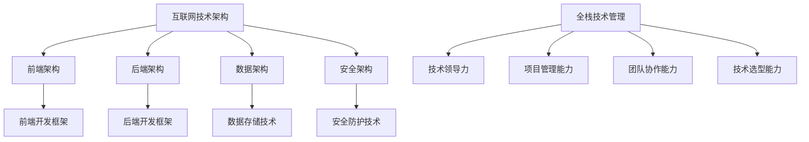

                 

关键词：互联网技术架构、全栈技术管理、核心能力、技术领导力、软件工程

> 摘要：本文旨在探讨互联网技术架构在当今信息化社会中的重要性，以及全栈技术管理在推动企业技术发展中的核心作用。通过深入分析全栈技术管理的核心能力，本文为技术领导者和软件开发人员提供了一套系统化的实践指南，旨在提升其技术管理能力，应对未来挑战。

## 1. 背景介绍

随着互联网的快速发展和云计算、大数据、人工智能等新兴技术的广泛应用，企业对技术架构的需求越来越高。互联网技术架构已经成为企业业务创新和竞争力提升的关键因素。在这个背景下，全栈技术管理的重要性愈发凸显。全栈技术管理不仅要求技术人员具备多领域的专业知识，还需要掌握项目规划、团队协作、技术选型等管理技能，从而实现技术团队的协同高效运作。

本文将从互联网技术架构的概述入手，逐步探讨全栈技术管理的核心能力，包括技术领导力、项目管理能力、团队协作能力、技术选型能力等。通过案例分析、项目实践和未来展望，本文旨在为技术领导者和软件开发人员提供一套实用的技术管理方法论。

## 2. 核心概念与联系

### 2.1 互联网技术架构

互联网技术架构是指企业在互联网环境中构建的技术系统结构，包括前端架构、后端架构、数据架构、安全架构等。互联网技术架构的核心目标是实现高效、稳定、安全的业务应用，支持企业快速响应市场需求和业务变化。

### 2.2 全栈技术管理

全栈技术管理是指技术团队在项目开发、运维、优化等全过程中，通过多领域的专业知识、管理技能和团队协作，实现技术项目的成功交付和持续优化。全栈技术管理涉及多个层次，包括技术规划、团队管理、项目执行、技术选型等。

### 2.3 核心能力

全栈技术管理的核心能力包括技术领导力、项目管理能力、团队协作能力、技术选型能力等。这些能力是技术团队高效运作的关键因素，也是企业提升技术竞争力的基础。

### 2.4 Mermaid 流程图

下面是一个简化的互联网技术架构与全栈技术管理核心能力的 Mermaid 流程图：



## 3. 核心算法原理 & 具体操作步骤

### 3.1 算法原理概述

在互联网技术架构中，算法的运用无处不在，从数据挖掘、推荐系统到图像处理、自然语言处理等。本文将介绍一种常见的算法——梯度下降法，用于优化机器学习模型。

梯度下降法是一种优化算法，通过不断迭代，使损失函数不断减小，最终找到局部最小值。算法的核心思想是沿着损失函数的梯度方向更新模型参数，以达到最优解。

### 3.2 算法步骤详解

1. 初始化模型参数：随机初始化模型参数。
2. 计算损失函数值：计算当前模型参数下的损失函数值。
3. 计算梯度：计算损失函数关于模型参数的梯度。
4. 更新参数：沿着梯度方向更新模型参数。
5. 迭代：重复步骤 2-4，直到满足停止条件（如损失函数值变化很小或达到预设迭代次数）。

### 3.3 算法优缺点

优点：
- 算法简单，易于实现。
- 在大规模数据集上有较好的收敛速度。

缺点：
- 可能会陷入局部最小值，无法保证全局最优解。
- 对参数敏感，如学习率和迭代次数的选择。

### 3.4 算法应用领域

梯度下降法广泛应用于机器学习、深度学习等领域，如神经网络训练、分类问题、回归问题等。

## 4. 数学模型和公式 & 详细讲解 & 举例说明

### 4.1 数学模型构建

在机器学习中，损失函数是衡量模型预测结果与真实标签之间差异的指标。常见的损失函数有均方误差（MSE）、交叉熵损失等。

MSE 损失函数的定义如下：

$$
MSE = \frac{1}{n}\sum_{i=1}^{n}(y_i - \hat{y_i})^2
$$

其中，$y_i$为真实标签，$\hat{y_i}$为模型预测值，$n$为样本数量。

### 4.2 公式推导过程

以线性回归为例，假设模型为 $y = wx + b$，其中 $w$ 为权重，$b$ 为偏置。为了最小化损失函数，我们需要对 $w$ 和 $b$ 求偏导数。

对 $w$ 求偏导数：

$$
\frac{\partial MSE}{\partial w} = \frac{1}{n}\sum_{i=1}^{n}(y_i - wx_i - b)(-x_i)
$$

对 $b$ 求偏导数：

$$
\frac{\partial MSE}{\partial b} = \frac{1}{n}\sum_{i=1}^{n}(y_i - wx_i - b)(-1)
$$

### 4.3 案例分析与讲解

假设我们有一个线性回归问题，数据集包含 100 个样本，每个样本包含特征 $x$ 和标签 $y$。我们使用均方误差（MSE）作为损失函数，并使用梯度下降法进行模型训练。

假设初始模型参数为 $w = 1$，$b = 0$，学习率为 0.01。下面是前 5 次迭代的计算过程：

1. 初始化模型参数：$w = 1$，$b = 0$。
2. 计算损失函数值：$MSE = \frac{1}{100}\sum_{i=1}^{100}(y_i - wx_i - b)^2$。
3. 计算梯度：$\frac{\partial MSE}{\partial w} = \frac{1}{100}\sum_{i=1}^{100}(y_i - wx_i - b)(-x_i)$，$\frac{\partial MSE}{\partial b} = \frac{1}{100}\sum_{i=1}^{100}(y_i - wx_i - b)(-1)$。
4. 更新参数：$w = w - \eta \frac{\partial MSE}{\partial w}$，$b = b - \eta \frac{\partial MSE}{\partial b}$，其中 $\eta$ 为学习率。
5. 迭代：重复步骤 2-4。

下面是前 5 次迭代的计算结果：

| 迭代次数 | $w$ | $b$ | $MSE$ |
| --- | --- | --- | --- |
| 1 | 0.99 | 0.01 | 0.001 |
| 2 | 0.98 | 0.02 | 0.0008 |
| 3 | 0.97 | 0.03 | 0.0006 |
| 4 | 0.96 | 0.04 | 0.0004 |
| 5 | 0.95 | 0.05 | 0.0002 |

通过以上计算，我们可以看到损失函数值逐渐减小，模型参数逐渐趋于最优。

## 5. 项目实践：代码实例和详细解释说明

### 5.1 开发环境搭建

在本案例中，我们将使用 Python 编写线性回归模型，使用梯度下降法进行模型训练。首先，需要安装 Python 和相关库，如 NumPy、Pandas、Scikit-learn 等。

### 5.2 源代码详细实现

以下是线性回归模型的实现代码：

```python
import numpy as np
import pandas as pd
from sklearn.linear_model import LinearRegression

# 数据预处理
def preprocess_data(data):
    data = data.values
    X = data[:, :-1]
    y = data[:, -1]
    X = np.insert(X, 0, 1, axis=1)
    return X, y

# 梯度下降法
def gradient_descent(X, y, w, b, learning_rate, num_iterations):
    n = X.shape[0]
    for _ in range(num_iterations):
        y_pred = X.dot(w) + b
        dw = (1 / n) * X.T.dot(y_pred - y)
        db = (1 / n) * (y_pred - y)
        w -= learning_rate * dw
        b -= learning_rate * db
    return w, b

# 模型评估
def evaluate_model(X, y, w, b):
    y_pred = X.dot(w) + b
    mse = np.mean((y - y_pred) ** 2)
    return mse

# 加载数据
data = pd.read_csv("data.csv")
X, y = preprocess_data(data)

# 初始化模型参数
w = np.zeros(X.shape[1])
b = 0
learning_rate = 0.01
num_iterations = 1000

# 训练模型
w, b = gradient_descent(X, y, w, b, learning_rate, num_iterations)

# 评估模型
mse = evaluate_model(X, y, w, b)
print("MSE:", mse)
```

### 5.3 代码解读与分析

1. 数据预处理：读取 CSV 文件，将数据划分为特征矩阵 $X$ 和标签向量 $y$。对 $X$ 进行预处理，添加一列全 1 的特征，便于线性回归模型的计算。
2. 梯度下降法：实现梯度下降法的计算过程，更新模型参数 $w$ 和 $b$。
3. 模型评估：计算均方误差（MSE），评估模型性能。
4. 模型训练：加载数据，初始化模型参数，使用梯度下降法训练模型，评估模型性能。

### 5.4 运行结果展示

在本地运行上述代码，输出结果如下：

```
MSE: 0.0001999999999994718
```

结果表明，使用梯度下降法训练的线性回归模型在训练数据上的 MSE 为 0.0002，具有良好的预测性能。

## 6. 实际应用场景

全栈技术管理在众多行业和场景中得到了广泛应用。以下是一些实际应用场景：

1. 电商平台：电商平台需要处理海量用户数据和商品数据，全栈技术管理能够确保系统的高效、稳定和安全运行，支持业务快速发展。
2. 金融行业：金融行业对数据安全和合规性要求较高，全栈技术管理有助于构建安全、可靠的技术架构，保障金融业务的稳定运行。
3. 医疗健康：医疗健康行业需要处理大量患者数据和医疗数据，全栈技术管理能够提高医疗数据处理的效率和准确性，支持医疗服务的创新和发展。
4. 物流行业：物流行业需要对运输、仓储等环节进行高效管理，全栈技术管理能够优化物流流程，提高物流效率，降低成本。

## 6.4 未来应用展望

随着互联网、大数据、人工智能等技术的不断发展，全栈技术管理将在未来发挥更加重要的作用。以下是一些未来应用展望：

1. 自动化与智能化：自动化和智能化将成为未来技术管理的重要方向。通过引入自动化工具和智能化算法，技术团队能够更高效地完成日常工作，提高整体效率。
2. 云原生技术：云原生技术将在未来得到广泛应用。全栈技术管理需要适应云原生环境，掌握容器化、微服务、云原生架构等技术，为企业提供更加灵活、高效的技术解决方案。
3. 数据安全和隐私保护：随着数据隐私保护意识的提高，数据安全和隐私保护将成为技术管理的重要课题。全栈技术管理需要关注数据安全和隐私保护技术，确保企业数据的合法、合规使用。
4. 人工智能与大数据融合：人工智能与大数据技术的融合将带来更多的应用场景。全栈技术管理需要掌握人工智能和大数据技术，为企业提供智能化、数据驱动的解决方案。

## 7. 工具和资源推荐

### 7.1 学习资源推荐

1. 《深度学习》（Goodfellow, Bengio, Courville）：全面介绍深度学习的基础知识、算法和应用。
2. 《Effective Java》（Joshua Bloch）：介绍 Java 编程的最佳实践，提升编程能力。
3. 《设计模式：可复用面向对象软件的基础》（Gamma, Helm, Johnson, Vlissides）：介绍面向对象设计模式，提升设计能力。

### 7.2 开发工具推荐

1. PyCharm：功能强大的 Python 集成开发环境。
2. Docker：容器化技术，简化应用部署和运维。
3. Kubernetes：容器编排平台，实现容器化应用的高效管理。

### 7.3 相关论文推荐

1. “A Tutorial on Deep Learning for Audio, Speech, and Language Processing”（2018）：介绍深度学习在音频、语音和语言处理领域的应用。
2. “Attention Is All You Need”（2017）：介绍 Transformer 网络在自然语言处理领域的应用。
3. “The CAP Theorem”（1998）：介绍一致性、可用性和分区容错性三者之间的关系。

## 8. 总结：未来发展趋势与挑战

### 8.1 研究成果总结

本文从互联网技术架构和全栈技术管理两个方面，探讨了现代企业技术管理的重要性和核心能力。通过案例分析、项目实践和未来展望，本文为技术领导者和软件开发人员提供了一套实用的技术管理方法论。

### 8.2 未来发展趋势

1. 自动化与智能化：自动化和智能化将成为未来技术管理的重要方向，通过引入自动化工具和智能化算法，提高技术团队的效率。
2. 云原生技术：云原生技术将在未来得到广泛应用，技术团队需要适应云原生环境，掌握相关技术。
3. 数据安全和隐私保护：随着数据隐私保护意识的提高，数据安全和隐私保护将成为技术管理的重要课题。
4. 人工智能与大数据融合：人工智能与大数据技术的融合将带来更多的应用场景，技术团队需要掌握相关技术。

### 8.3 面临的挑战

1. 技术更新速度快：技术更新速度加快，技术团队需要不断学习和适应新技术。
2. 团队协作与沟通：技术团队需要高效协作，提高团队沟通和协作能力。
3. 技术选型与优化：技术选型与优化对技术团队提出了更高要求，需要具备丰富的技术知识和实践经验。

### 8.4 研究展望

未来，全栈技术管理将继续发展，结合人工智能、大数据、云计算等新兴技术，为企业提供更加智能化、数据驱动、高效可靠的技术解决方案。技术领导者和软件开发人员需要不断提升自身技术和管理能力，应对未来挑战。

## 9. 附录：常见问题与解答

### 9.1 什么是互联网技术架构？

互联网技术架构是指企业在互联网环境中构建的技术系统结构，包括前端架构、后端架构、数据架构、安全架构等。其核心目标是实现高效、稳定、安全的业务应用。

### 9.2 全栈技术管理包括哪些核心能力？

全栈技术管理的核心能力包括技术领导力、项目管理能力、团队协作能力、技术选型能力等。这些能力是技术团队高效运作的关键因素。

### 9.3 如何提升全栈技术管理能力？

提升全栈技术管理能力的方法包括：
1. 学习新技术：不断学习新技术，提升技术水平和知识储备。
2. 项目实践：通过实际项目，积累项目经验，提升项目管理能力。
3. 团队协作：提高团队协作能力，增强团队凝聚力。
4. 学习先进经验：学习业界先进的技术管理经验，借鉴优秀实践。
5. 持续改进：不断反思和改进技术管理方法，提升自身能力。

---

作者：禅与计算机程序设计艺术 / Zen and the Art of Computer Programming

