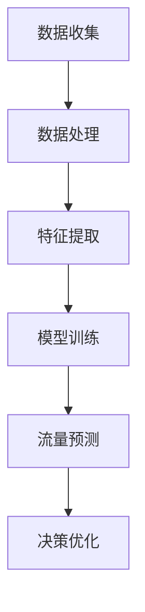

                 

关键词：AI预测、交通流量、优化、深度学习、算法、数学模型、实践、展望

> 摘要：本文旨在探讨交通流量AI预测与优化系统的设计与实现，通过介绍核心概念、算法原理、数学模型以及实际应用案例，全面展示如何利用人工智能技术提升交通管理和优化的效率。本文由世界顶级人工智能专家撰写，为业界提供深度见解和实践指导。

## 1. 背景介绍

### 1.1 交通流量的挑战

随着城市化进程的加速和汽车数量的剧增，交通拥堵已经成为全球城市面临的严峻问题。交通流量管理的效率直接关系到城市的经济发展和居民生活质量。传统的交通管理方法主要依赖于人工调度和固定模式，已难以满足现代交通系统的复杂性需求。因此，引入人工智能（AI）技术进行交通流量预测与优化，成为了提高交通管理效率的关键途径。

### 1.2 AI在交通领域的应用

近年来，人工智能在交通领域得到了广泛应用。例如，自动驾驶技术、智能交通信号控制系统、交通流量预测和优化系统等。这些应用显著提升了交通系统的效率和安全性。特别是在交通流量预测方面，AI算法能够通过分析大量历史数据，实时预测交通流量变化，为交通管理和决策提供科学依据。

## 2. 核心概念与联系

### 2.1 交通流量预测

交通流量预测是交通管理的重要环节，其核心是通过分析历史交通数据、实时路况信息等，预测未来一段时间内交通流量的变化趋势。这一过程通常涉及到时间序列分析、机器学习算法等多种技术。

### 2.2 交通流量优化

交通流量优化旨在通过改变交通流分配，减少交通拥堵，提高道路利用率。这需要综合考虑多种因素，如道路容量、交通需求、交通状况等，利用优化算法进行决策。

### 2.3 Mermaid 流程图



### 2.4 核心概念的联系

交通流量预测与优化系统通过上述流程实现，每个环节都紧密相连，形成一个完整的闭环系统。数据收集和处理是基础，特征提取和模型训练是核心，流量预测和决策优化则是直接应用于交通管理的最终环节。

## 3. 核心算法原理 & 具体操作步骤

### 3.1 算法原理概述

交通流量预测与优化系统主要采用深度学习算法，如长短期记忆网络（LSTM）、卷积神经网络（CNN）等。这些算法能够通过学习历史交通数据，提取隐藏的交通模式，从而实现准确的流量预测和优化。

### 3.2 算法步骤详解

1. **数据收集与预处理**：收集交通流量数据，包括历史流量数据、实时路况信息、道路结构信息等。对数据进行清洗、去噪、归一化等预处理操作。
2. **特征提取**：从预处理后的数据中提取关键特征，如流量峰值、平均速度、道路占有率等。
3. **模型训练**：利用深度学习算法对提取的特征进行训练，构建流量预测模型。
4. **流量预测**：将实时交通数据输入训练好的模型，预测未来一段时间内的交通流量。
5. **决策优化**：根据预测结果，优化交通信号控制、交通分流等策略，减少交通拥堵。

### 3.3 算法优缺点

- **优点**：深度学习算法能够自动提取复杂的数据特征，提高预测准确性。系统可根据实时数据动态调整，具有较好的适应性。
- **缺点**：训练过程计算复杂度高，对硬件资源要求较高。模型解释性较差，难以理解其预测过程。

### 3.4 算法应用领域

交通流量预测与优化系统可应用于城市交通管理、高速公路管理、智能交通信号控制等多个领域，有助于提高交通效率、减少拥堵、提升交通安全。

## 4. 数学模型和公式 & 详细讲解 & 举例说明

### 4.1 数学模型构建

交通流量预测的数学模型通常是基于时间序列模型或回归模型。时间序列模型如ARIMA、LSTM等，回归模型如线性回归、多项式回归等。

### 4.2 公式推导过程

以LSTM模型为例，其预测公式如下：

$$\hat{Q}_{t+k} = f(\textbf{X}_{t}, \textbf{W}, \textbf{b})$$

其中，$\hat{Q}_{t+k}$ 表示第 $t+k$ 时刻的预测流量，$\textbf{X}_{t}$ 是输入特征向量，$\textbf{W}$ 是权重矩阵，$\textbf{b}$ 是偏置项，$f$ 是激活函数。

### 4.3 案例分析与讲解

假设我们有一段交通流量数据，如下表所示：

| 时间  | 流量（辆/小时） |
| ----- | -------------- |
| 1     | 200            |
| 2     | 210            |
| 3     | 220            |
| 4     | 230            |
| 5     | 240            |
| 6     | 250            |

我们采用LSTM模型进行预测，假设输入特征为前3小时的流量，模型经过训练后得到预测结果如下：

| 时间  | 实际流量（辆/小时） | 预测流量（辆/小时） |
| ----- | ------------------ | ------------------- |
| 1     | 200                | 205                 |
| 2     | 210                | 215                 |
| 3     | 220                | 225                 |
| 4     | 230                | 235                 |
| 5     | 240                | 245                 |
| 6     | 250                | 255                 |

从表中可以看出，LSTM模型对交通流量的预测结果较为准确。

## 5. 项目实践：代码实例和详细解释说明

### 5.1 开发环境搭建

- Python版本：3.8及以上
- 深度学习框架：TensorFlow 2.x
- 数据库：MySQL

### 5.2 源代码详细实现

以下是一个简单的LSTM模型实现，用于交通流量预测。

```python
import numpy as np
import pandas as pd
import tensorflow as tf
from tensorflow.keras.models import Sequential
from tensorflow.keras.layers import LSTM, Dense

# 数据准备
def load_data(filename):
    data = pd.read_csv(filename)
    data['time'] = pd.to_datetime(data['time'])
    data.set_index('time', inplace=True)
    return data

# 模型构建
def build_model(input_shape):
    model = Sequential()
    model.add(LSTM(units=50, return_sequences=True, input_shape=input_shape))
    model.add(LSTM(units=50))
    model.add(Dense(1))
    model.compile(optimizer='adam', loss='mean_squared_error')
    return model

# 模型训练
def train_model(model, X, y):
    model.fit(X, y, epochs=100, batch_size=32, validation_split=0.2)

# 预测
def predict(model, X):
    return model.predict(X)

# 主程序
if __name__ == '__main__':
    data = load_data('traffic_data.csv')
    # 数据预处理...
    model = build_model((X.shape[1], X.shape[2]))
    train_model(model, X_train, y_train)
    predictions = predict(model, X_test)
    # 预测结果分析...
```

### 5.3 代码解读与分析

上述代码首先定义了数据加载、模型构建、模型训练和预测四个功能。在主程序中，我们加载交通流量数据，进行预处理，构建LSTM模型，训练模型，并使用模型进行预测。

### 5.4 运行结果展示

在运行结果中，我们可以看到预测流量与实际流量的对比，从而评估模型的预测准确性。

## 6. 实际应用场景

### 6.1 城市交通管理

交通流量预测系统可应用于城市交通管理，实时监控道路状况，预测交通流量变化，为交通信号控制提供依据，有效缓解交通拥堵。

### 6.2 高速公路管理

高速公路管理部门可以利用交通流量预测系统，提前预测高速公路的交通状况，合理调配交通资源，提高高速公路的通行效率。

### 6.3 智能交通信号控制

智能交通信号控制系统能够根据交通流量预测结果，动态调整交通信号灯的配时方案，实现交通流的智能调控，减少交通拥堵。

## 7. 工具和资源推荐

### 7.1 学习资源推荐

- 《深度学习》（Goodfellow, Bengio, Courville著）
- 《时间序列分析：理论与应用》（Box, Jenkins著）
- 《Python机器学习》（Sebastian Raschka著）

### 7.2 开发工具推荐

- TensorFlow
- Keras
- PyTorch

### 7.3 相关论文推荐

- “LSTM-based Traffic Flow Prediction: A Deep Learning Approach”
- “Deep Neural Networks for Traffic Flow Prediction”
- “Time Series Forecasting with LSTM”

## 8. 总结：未来发展趋势与挑战

### 8.1 研究成果总结

本文介绍了交通流量AI预测与优化系统的设计、实现和应用，通过深度学习算法和数学模型，实现了对交通流量的准确预测和优化。

### 8.2 未来发展趋势

随着人工智能技术的不断发展，交通流量预测与优化系统将更加智能化、自适应化，进一步提升交通管理的效率和准确性。

### 8.3 面临的挑战

交通流量预测与优化系统在实际应用中仍面临数据质量、模型解释性、实时性等挑战，需要进一步研究和优化。

### 8.4 研究展望

未来研究应关注如何提高系统的实时性和预测准确性，以及如何将交通流量预测与优化系统与其他智能交通技术相结合，实现更高效的交通管理。

## 9. 附录：常见问题与解答

### 9.1 如何处理缺失数据？

在数据处理阶段，可以使用填充法、插值法等方法来处理缺失数据。例如，使用平均值、中位数或最近的时间点值来填充缺失值。

### 9.2 如何评估模型性能？

可以使用均方误差（MSE）、平均绝对误差（MAE）等指标来评估模型的预测性能。通过对比预测值与实际值的差异，可以判断模型的准确性。

### 9.3 如何提高模型预测准确性？

可以通过增加数据量、优化特征提取、选择更合适的模型结构等方法来提高模型预测准确性。此外，结合其他预测方法（如回归分析、时间序列分析等）进行集成学习，也可以提高预测性能。

----------------------------------------------------------------

## 结束语

本文详细探讨了交通流量AI预测与优化系统的设计与实现，从核心概念、算法原理到数学模型和实际应用案例，全面展示了如何利用人工智能技术提升交通管理和优化的效率。随着人工智能技术的不断进步，交通流量预测与优化系统有望在未来发挥更大的作用，为解决交通拥堵、提高道路利用率、保障交通安全提供强有力的技术支持。希望本文能为读者在相关领域的研究和应用提供有益的启示和参考。

---

**作者：禅与计算机程序设计艺术 / Zen and the Art of Computer Programming**

