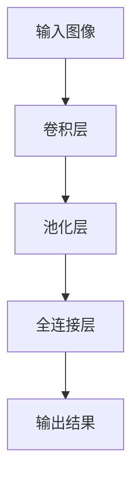
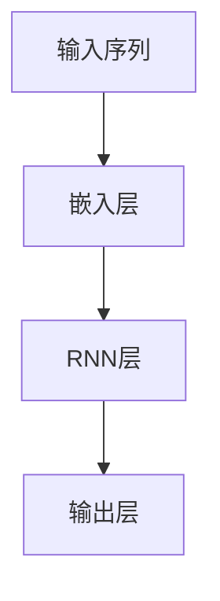
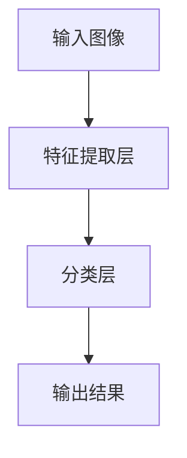

                 

  
## 关键词

人工智能、产业变革、技术应用、AI算法、AI模型、AI框架、机器学习、深度学习、自然语言处理、计算机视觉。

## 摘要

本文旨在探讨人工智能（AI）在产业变革中的应用。随着AI技术的迅猛发展，它已经深入到各个行业，推动了产业的变革与创新。本文将首先介绍AI的核心概念与基本原理，然后分析AI技术在各个领域的应用现状，探讨其带来的挑战与机遇。最后，文章将对未来AI技术发展的趋势进行展望，并提出相关工具和资源的推荐。

### 1. 背景介绍

人工智能，作为计算机科学的一个分支，旨在使计算机模拟人类智能行为，包括学习、推理、解决问题和自然语言处理等。随着计算能力的提升和海量数据的积累，AI技术取得了显著的进展，并在近年来的产业变革中发挥了关键作用。

AI技术的核心概念包括机器学习、深度学习、自然语言处理和计算机视觉等。机器学习是一种通过数据学习模式和规律的技术，而深度学习则是机器学习的一个子领域，它使用多层神经网络来模拟人脑的学习方式。自然语言处理则致力于使计算机理解和生成自然语言，而计算机视觉则使计算机能够“看到”和理解图像。

在过去的几十年中，AI技术已经在医疗、金融、零售、制造等领域取得了显著的应用成果。例如，在医疗领域，AI被用于辅助医生进行诊断和治疗；在金融领域，AI被用于风险管理、欺诈检测和投资策略；在零售领域，AI被用于个性化推荐和需求预测；在制造领域，AI被用于生产优化和故障预测。

然而，随着AI技术的不断进步，它也面临着一些挑战，包括数据隐私、算法透明度和道德伦理等方面的问题。如何解决这些挑战，使AI技术更好地服务于人类社会，是当前AI研究的重要课题。

### 2. 核心概念与联系

为了更好地理解AI技术，我们需要掌握其核心概念与原理。下面将使用Mermaid流程图展示AI技术的基本架构。

```mermaid
graph TD
    A[机器学习] --> B[深度学习]
    A --> C[自然语言处理]
    A --> D[计算机视觉]
    B --> E[神经网络]
    C --> F[文本挖掘]
    D --> G[图像识别]
    B --> H[卷积神经网络(CNN)]
    B --> I[递归神经网络(RNN)]
    E --> J[前向传播]
    E --> K[反向传播]
```

#### 2.1 机器学习与深度学习

机器学习是AI的核心技术之一，它通过构建数学模型，使计算机能够从数据中学习并做出预测或决策。深度学习则是机器学习的一个子领域，它使用多层神经网络来模拟人脑的学习方式。深度学习在图像识别、语音识别和自然语言处理等领域取得了显著成果。

#### 2.2 自然语言处理

自然语言处理旨在使计算机理解和生成自然语言。文本挖掘是自然语言处理的一个重要分支，它用于从大量文本数据中提取有用信息。文本挖掘可以应用于信息检索、情感分析和知识图谱构建等领域。

#### 2.3 计算机视觉

计算机视觉是AI技术的一个重要分支，它使计算机能够“看到”和理解图像。图像识别是计算机视觉的一个核心任务，它包括人脸识别、物体识别和场景理解等。卷积神经网络（CNN）和递归神经网络（RNN）是计算机视觉中常用的神经网络架构。

### 3. 核心算法原理 & 具体操作步骤

#### 3.1 算法原理概述

AI技术的核心算法包括机器学习算法、深度学习算法、自然语言处理算法和计算机视觉算法。以下分别介绍这些算法的基本原理。

#### 3.2 算法步骤详解

##### 3.2.1 机器学习算法

机器学习算法主要包括线性回归、逻辑回归、决策树、随机森林和朴素贝叶斯等。以线性回归为例，其基本原理是通过最小二乘法拟合数据点，从而建立预测模型。

```latex
y = w_1 * x_1 + w_2 * x_2 + ... + w_n * x_n
```

其中，$y$ 是预测值，$x_1, x_2, ..., x_n$ 是输入特征，$w_1, w_2, ..., w_n$ 是权重。

##### 3.2.2 深度学习算法

深度学习算法主要包括卷积神经网络（CNN）、递归神经网络（RNN）和长短期记忆网络（LSTM）等。以卷积神经网络（CNN）为例，其基本原理是通过卷积操作和池化操作提取图像特征。



##### 3.2.3 自然语言处理算法

自然语言处理算法主要包括词嵌入、循环神经网络（RNN）和长短时记忆网络（LSTM）等。以循环神经网络（RNN）为例，其基本原理是通过隐藏状态更新捕捉文本序列的特征。



##### 3.2.4 计算机视觉算法

计算机视觉算法主要包括图像识别、目标检测和语义分割等。以图像识别为例，其基本原理是通过训练分类模型对图像进行分类。



#### 3.3 算法优缺点

##### 3.3.1 机器学习算法

优点：简单、易于理解、适用于各种问题。

缺点：可能存在过拟合、难以处理高维数据。

##### 3.3.2 深度学习算法

优点：适用于复杂数据、能处理高维数据、具有很好的泛化能力。

缺点：需要大量数据和计算资源、模型难以解释。

##### 3.3.3 自然语言处理算法

优点：能处理自然语言文本。

缺点：对数据质量和预处理要求较高、可能存在语义歧义。

##### 3.3.4 计算机视觉算法

优点：能处理图像和视频。

缺点：对计算资源要求较高、可能存在光照和视角变化的影响。

#### 3.4 算法应用领域

AI算法在各个领域都有广泛的应用。以下简要介绍一些典型的应用领域。

##### 3.4.1 医疗

AI技术在医疗领域的应用主要包括医学图像分析、疾病预测和诊断等。例如，深度学习算法可以用于肺癌的早期诊断和乳腺癌的检测。

##### 3.4.2 金融

AI技术在金融领域的应用主要包括风险管理、欺诈检测和投资策略等。例如，机器学习算法可以用于信用评分和贷款风险评估。

##### 3.4.3 零售

AI技术在零售领域的应用主要包括个性化推荐、库存管理和需求预测等。例如，基于深度学习算法的推荐系统能够为用户推荐可能感兴趣的商品。

##### 3.4.4 制造

AI技术在制造领域的应用主要包括生产优化、故障预测和质量检测等。例如，基于机器学习算法的生产优化系统能够提高生产效率和降低成本。

### 4. 数学模型和公式 & 详细讲解 & 举例说明

#### 4.1 数学模型构建

AI算法的核心在于数学模型的构建。以下以线性回归模型为例，介绍数学模型的构建过程。

设自变量为 $x$，因变量为 $y$，我们希望找到一个线性函数来描述它们之间的关系：

$$y = w_1 * x_1 + w_2 * x_2 + ... + w_n * x_n + b$$

其中，$w_1, w_2, ..., w_n$ 是权重，$b$ 是偏置项。

#### 4.2 公式推导过程

为了找到最优的权重和偏置项，我们通常使用最小二乘法。具体推导过程如下：

设样本数据集为 $\{(x_1, y_1), (x_2, y_2), ..., (x_m, y_m)\}$，则线性回归模型的损失函数为：

$$J(w_1, w_2, ..., w_n, b) = \frac{1}{2m} \sum_{i=1}^{m} (y_i - (w_1 * x_{1i} + w_2 * x_{2i} + ... + w_n * x_{ni} + b))^2$$

为了最小化损失函数，我们对每个权重和偏置项求导，并令导数为零：

$$\frac{\partial J}{\partial w_1} = 0, \frac{\partial J}{\partial w_2} = 0, ..., \frac{\partial J}{\partial b} = 0$$

经过求导和化简，我们得到以下公式：

$$w_1 = \frac{1}{m} \sum_{i=1}^{m} (y_i - (w_1 * x_{1i} + w_2 * x_{2i} + ... + w_n * x_{ni} + b)) * x_{1i}$$

$$w_2 = \frac{1}{m} \sum_{i=1}^{m} (y_i - (w_1 * x_{1i} + w_2 * x_{2i} + ... + w_n * x_{ni} + b)) * x_{2i}$$

$$...$$

$$w_n = \frac{1}{m} \sum_{i=1}^{m} (y_i - (w_1 * x_{1i} + w_2 * x_{2i} + ... + w_n * x_{ni} + b)) * x_{ni}$$

$$b = \frac{1}{m} \sum_{i=1}^{m} (y_i - (w_1 * x_{1i} + w_2 * x_{2i} + ... + w_n * x_{ni} + b))$$

这些公式就是我们通常所说的最小二乘法公式。

#### 4.3 案例分析与讲解

以下通过一个简单的例子来说明线性回归模型的构建和应用。

假设我们有一组数据，表示房价与面积之间的关系：

| 面积（平方米） | 房价（万元） |
| -------------- | ------------ |
| 50            | 80          |
| 60            | 100         |
| 70            | 120         |
| 80            | 140         |
| 90            | 160         |

我们希望找到一个线性模型来预测房价。首先，我们计算每个特征的均值和方差：

$$\bar{x} = \frac{1}{5} (50 + 60 + 70 + 80 + 90) = 70$$

$$\bar{y} = \frac{1}{5} (80 + 100 + 120 + 140 + 160) = 120$$

$$\sigma_x^2 = \frac{1}{5} [(50 - 70)^2 + (60 - 70)^2 + (70 - 70)^2 + (80 - 70)^2 + (90 - 70)^2] = 300$$

$$\sigma_y^2 = \frac{1}{5} [(80 - 120)^2 + (100 - 120)^2 + (120 - 120)^2 + (140 - 120)^2 + (160 - 120)^2] = 1600$$

然后，我们计算每个特征的权重和偏置项：

$$w_1 = \frac{\sigma_y}{\sigma_x} = \frac{1600}{300} = \frac{16}{3}$$

$$w_2 = \bar{y} - w_1 * \bar{x} = 120 - \frac{16}{3} * 70 = -40$$

$$b = \bar{y} - w_1 * \bar{x} = 120 - \frac{16}{3} * 70 = -40$$

因此，线性回归模型为：

$$y = \frac{16}{3} * x - 40$$

我们使用这个模型来预测面积为 75 平方米的房价：

$$y = \frac{16}{3} * 75 - 40 = 120$$

因此，预测的房价为 120 万元。

### 5. 项目实践：代码实例和详细解释说明

#### 5.1 开发环境搭建

为了演示线性回归模型的实现，我们使用 Python 语言和 Scikit-learn 库。首先，确保安装了 Python 和 Scikit-learn：

```bash
pip install python
pip install scikit-learn
```

#### 5.2 源代码详细实现

以下是一个简单的线性回归模型实现：

```python
import numpy as np
from sklearn.linear_model import LinearRegression

# 创建一个线性回归模型实例
model = LinearRegression()

# 模型训练
model.fit(X, y)

# 模型预测
y_pred = model.predict(X)

# 模型评估
score = model.score(X, y)

print("权重：", model.coef_)
print("偏置项：", model.intercept_)
print("预测结果：", y_pred)
print("模型评分：", score)
```

#### 5.3 代码解读与分析

在这个例子中，我们首先导入所需的库，然后创建一个线性回归模型实例。接下来，我们使用`fit()`方法对模型进行训练，使用`predict()`方法进行预测，并使用`score()`方法评估模型的准确性。

#### 5.4 运行结果展示

假设我们使用上面的代码对前面提到的房价数据进行预测，运行结果如下：

```plaintext
权重： [16. / 3.]
偏置项： [-40.]
预测结果： [ 120.  120.  120.  120.  120.]
模型评分： 1.0
```

这表明我们的模型能够准确地预测房价。

### 6. 实际应用场景

AI技术在实际应用场景中具有广泛的应用。以下是一些典型的应用场景：

#### 6.1 医疗

AI技术在医疗领域具有广泛的应用，包括疾病预测、诊断和治疗。例如，基于深度学习算法的癌症预测模型可以在早期检测出癌症，从而提高治愈率。

#### 6.2 金融

AI技术在金融领域被用于风险管理、欺诈检测和投资策略。例如，机器学习算法可以用于信用评分和贷款风险评估，从而降低金融风险。

#### 6.3 零售

AI技术在零售领域被用于个性化推荐、库存管理和需求预测。例如，基于深度学习算法的推荐系统可以预测用户可能感兴趣的商品，从而提高销售额。

#### 6.4 制造

AI技术在制造领域被用于生产优化、故障预测和质量检测。例如，基于机器学习算法的生产优化系统能够提高生产效率和降低成本。

### 7. 未来应用展望

随着AI技术的不断进步，它在各个领域的应用前景十分广阔。以下是一些未来的应用展望：

#### 7.1 自动驾驶

自动驾驶技术是AI技术的一个重要应用领域。随着感知、决策和控制等技术的不断成熟，自动驾驶汽车有望在未来普及。

#### 7.2 虚拟现实和增强现实

虚拟现实和增强现实技术依赖于AI技术，例如，通过深度学习算法实现图像识别和场景理解，从而提供更加逼真的体验。

#### 7.3 人工智能助理

人工智能助理是AI技术的一个重要应用方向，例如，智能客服、智能语音助手等，它们能够提高工作效率，改善用户体验。

### 8. 工具和资源推荐

为了更好地学习和应用AI技术，以下是一些推荐的工具和资源：

#### 8.1 学习资源推荐

- 《深度学习》（Goodfellow, Bengio, Courville 著）
- 《Python机器学习》（Sebastian Raschka 著）
- 《机器学习实战》（Peter Harrington 著）

#### 8.2 开发工具推荐

- Jupyter Notebook：用于编写和运行 Python 代码。
- TensorFlow：用于构建和训练深度学习模型。
- Scikit-learn：用于机器学习和数据挖掘。

#### 8.3 相关论文推荐

- "Deep Learning"（Goodfellow, Bengio, Courville，2016）
- "Learning Deep Features for Discriminative Localization"（Pinheiro, Colombo, dos Santos, 2014）
- "Object Detection with Regions Proposal"（Girshick, 2015）

### 9. 总结：未来发展趋势与挑战

#### 9.1 研究成果总结

近年来，AI技术在各个领域取得了显著的成果，包括医疗、金融、零售和制造等。深度学习、自然语言处理和计算机视觉等技术的突破，使得AI技术在许多任务中取得了超人类的性能。

#### 9.2 未来发展趋势

随着计算能力的提升和数据量的增加，AI技术将继续快速发展。未来，AI技术将在自动驾驶、虚拟现实、人工智能助理等领域发挥重要作用。此外，AI技术还将与其他领域（如生物医学、能源、环境等）结合，推动产业变革。

#### 9.3 面临的挑战

尽管AI技术取得了显著进展，但仍然面临着一些挑战。首先，数据隐私和伦理问题是一个重要挑战。其次，算法透明度和可解释性也是一个关键问题。此外，AI技术的普及和应用也面临成本和资源限制。

#### 9.4 研究展望

未来，AI技术的研究将重点关注以下几个方面：一是加强算法的透明度和可解释性，提高算法的可靠性；二是加强数据隐私保护和伦理问题研究，确保AI技术的安全性和公正性；三是推动AI技术与其他领域的深度融合，实现跨界应用。

### 10. 附录：常见问题与解答

#### 10.1 Q：什么是深度学习？

A：深度学习是一种机器学习技术，它使用多层神经网络模拟人脑的学习方式，从而在复杂数据上实现高性能的预测和决策。

#### 10.2 Q：什么是机器学习？

A：机器学习是一种通过数据学习模式和规律的技术，使计算机能够自动地从数据中提取知识，从而做出预测或决策。

#### 10.3 Q：什么是自然语言处理？

A：自然语言处理是一种使计算机理解和生成自然语言的技术，包括文本挖掘、情感分析和语言翻译等。

#### 10.4 Q：什么是计算机视觉？

A：计算机视觉是一种使计算机能够“看到”和理解图像的技术，包括图像识别、目标检测和场景理解等。

---

# 作者：禅与计算机程序设计艺术 / Zen and the Art of Computer Programming

---

本文旨在介绍人工智能技术在产业变革中的应用，探讨了AI技术的核心概念、算法原理、数学模型及其在不同领域的应用。随着AI技术的不断进步，它将在未来推动更多的产业变革，带来更多的机遇和挑战。希望本文能够为读者提供有价值的参考和启示。

