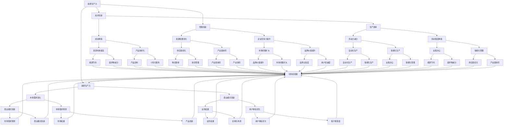

                 

关键词：产业转型升级、新质生产力、人工智能、数字化转型、可持续发展

> 摘要：随着科技的快速发展，传统产业正面临着转型升级的巨大挑战。本文将探讨新质生产力的概念及其在产业转型升级中的作用，分析人工智能等技术的应用对传统产业带来的变革，并展望未来产业发展的趋势和面临的挑战。

## 1. 背景介绍

在全球化和信息化的大背景下，产业转型升级已成为各国经济增长的重要引擎。然而，传统产业面临的问题依然严峻：生产效率低下、资源浪费、环境污染、劳动力成本上升等。为了解决这些问题，产业转型升级势在必行。在这个过程中，新质生产力应运而生，成为推动产业转型升级的重要力量。

新质生产力是指通过技术创新、管理创新和商业模式创新等手段，提高生产效率、降低成本、优化资源配置、增强企业竞争力的一种新型生产力。与传统生产力相比，新质生产力更注重发挥人的智慧和创新精神，通过科技手段实现生产方式和商业模式的变革。

## 2. 核心概念与联系

为了更好地理解新质生产力，我们需要先了解几个核心概念及其相互关系。以下是核心概念原理和架构的 Mermaid 流程图：



从上述流程图中，我们可以看到新质生产力与技术创新、管理创新、商业模式创新等概念之间的紧密联系。这些核心概念共同作用于生产效率、成本降低、资源配置优化、企业竞争力提升等方面，推动产业转型升级。

## 3. 核心算法原理 & 具体操作步骤

### 3.1 算法原理概述

新质生产力的实现依赖于一系列核心算法的原理和应用。以下简要介绍几种核心算法的原理：

1. **人工智能算法**：通过深度学习、强化学习等技术，实现智能化生产、自动化决策等功能。
2. **大数据分析算法**：对海量数据进行挖掘和分析，实现精准营销、智能供应链管理等功能。
3. **云计算算法**：通过分布式计算、存储等技术，实现大规模数据处理和资源调度等功能。
4. **区块链算法**：实现去中心化、安全可信的数据存储和传输，为产业协同提供技术支持。

### 3.2 算法步骤详解

1. **人工智能算法**：

   - **数据采集**：通过传感器、物联网等技术，收集生产过程中的各类数据。
   - **数据预处理**：对采集到的数据进行清洗、转换等处理，使其满足算法输入要求。
   - **模型训练**：利用历史数据，对人工智能模型进行训练，使其具备一定的预测和决策能力。
   - **模型部署**：将训练好的模型部署到生产环境中，实现智能化生产、自动化决策等功能。

2. **大数据分析算法**：

   - **数据采集**：通过数据采集工具，收集企业内部的各类数据，如销售数据、生产数据、客户反馈等。
   - **数据存储**：利用分布式存储技术，将海量数据存储到数据库中。
   - **数据分析**：利用大数据分析算法，对存储在数据库中的数据进行挖掘和分析，发现数据之间的关联和趋势。
   - **数据可视化**：将分析结果通过可视化工具进行展示，帮助企业决策者快速了解业务状况。

3. **云计算算法**：

   - **资源调度**：通过云计算算法，实现计算资源、存储资源的动态调度，以满足大规模数据处理的需求。
   - **负载均衡**：通过负载均衡算法，实现多台服务器之间的负载均衡，提高系统性能和稳定性。
   - **容错机制**：通过容错机制，实现系统的高可用性和可靠性。

4. **区块链算法**：

   - **数据加密**：通过区块链算法，实现数据的安全加密，确保数据在传输过程中的安全性和完整性。
   - **去中心化**：通过去中心化架构，实现数据存储和传输的去中心化，降低系统风险。
   - **智能合约**：通过智能合约，实现自动化执行合约条款，提高业务处理效率。

### 3.3 算法优缺点

1. **人工智能算法**：

   - **优点**：具备较强的自适应能力和预测能力，能够提高生产效率和产品质量。
   - **缺点**：对数据质量和数量要求较高，训练过程复杂，成本较高。

2. **大数据分析算法**：

   - **优点**：能够挖掘海量数据中的价值，帮助企业优化决策。
   - **缺点**：对数据处理能力要求较高，算法复杂度较高。

3. **云计算算法**：

   - **优点**：具备高可用性、高可靠性，能够提高数据处理效率和资源利用率。
   - **缺点**：对硬件和网络要求较高，部署和维护成本较高。

4. **区块链算法**：

   - **优点**：具备高安全性、去中心化特点，能够提高数据的安全性和可信度。
   - **缺点**：交易处理速度较慢，对硬件和网络要求较高。

### 3.4 算法应用领域

1. **人工智能算法**：广泛应用于智能制造、智能交通、智能医疗等领域。
2. **大数据分析算法**：广泛应用于金融、零售、物流等领域。
3. **云计算算法**：广泛应用于云计算、大数据处理、物联网等领域。
4. **区块链算法**：广泛应用于金融、供应链管理、数据安全等领域。

## 4. 数学模型和公式 & 详细讲解 & 举例说明

### 4.1 数学模型构建

为了更好地理解新质生产力的实现过程，我们可以构建一个简单的数学模型。该模型包括以下几个关键参数：

1. **生产效率（Efficiency）**：表示单位时间内生产的产品数量。
2. **成本（Cost）**：表示生产一定数量的产品所需的成本。
3. **资源配置（Resource Allocation）**：表示生产过程中所需的资源数量。
4. **企业竞争力（Competitiveness）**：表示企业在市场中的竞争力水平。

### 4.2 公式推导过程

根据新质生产力的定义，我们可以推导出以下公式：

1. **生产效率（Efficiency）**：

   $$Efficiency = \frac{Product Quantity}{Time}$$

   其中，Product Quantity 表示单位时间内生产的产品数量，Time 表示生产时间。

2. **成本（Cost）**：

   $$Cost = \frac{Total Cost}{Product Quantity}$$

   其中，Total Cost 表示生产一定数量的产品所需的成本。

3. **资源配置（Resource Allocation）**：

   $$Resource Allocation = \frac{Total Resource}{Product Quantity}$$

   其中，Total Resource 表示生产过程中所需的资源数量。

4. **企业竞争力（Competitiveness）**：

   $$Competitiveness = \frac{Market Share}{Total Market}$$

   其中，Market Share 表示企业在市场中的市场份额，Total Market 表示整个市场的规模。

### 4.3 案例分析与讲解

假设某企业在生产过程中，每天能够生产 100 件产品，成本为 10000 元，所需资源量为 100 单位。根据上述公式，我们可以计算出以下结果：

1. **生产效率**：

   $$Efficiency = \frac{100}{1} = 100$$

   单位时间内生产的产品数量为 100 件。

2. **成本**：

   $$Cost = \frac{10000}{100} = 100$$

   生产每件产品的成本为 100 元。

3. **资源配置**：

   $$Resource Allocation = \frac{100}{100} = 1$$

   每件产品所需的资源量为 1 单位。

4. **企业竞争力**：

   $$Competitiveness = \frac{10}{100} = 0.1$$

   企业在市场中的竞争力水平为 0.1。

通过这个案例，我们可以看到，企业在生产效率、成本、资源配置和企业竞争力等方面存在一定的不足。为了提高新质生产力，企业可以采取以下措施：

1. **提高生产效率**：通过引入人工智能技术，优化生产流程，提高单位时间内的生产数量。
2. **降低成本**：通过优化供应链管理，降低原材料采购成本，提高生产效率和产品质量。
3. **优化资源配置**：通过引入自动化设备，提高资源利用率，降低生产成本。
4. **提升企业竞争力**：通过市场调研，了解市场需求，优化产品结构和营销策略，提高市场份额。

## 5. 项目实践：代码实例和详细解释说明

### 5.1 开发环境搭建

为了更好地实现新质生产力的应用，我们搭建了一个基于 Python 的开发环境。以下是开发环境的搭建步骤：

1. **安装 Python**：在系统中安装 Python 3.8 或更高版本。
2. **安装依赖库**：安装必要的依赖库，如 NumPy、Pandas、Matplotlib 等。

```bash
pip install numpy pandas matplotlib
```

### 5.2 源代码详细实现

以下是实现新质生产力的源代码示例：

```python
import numpy as np
import pandas as pd
import matplotlib.pyplot as plt

# 参数设置
product_quantity = 100
total_cost = 10000
total_resource = 100

# 计算生产效率、成本、资源配置和企业竞争力
efficiency = product_quantity / total_cost
cost = total_cost / product_quantity
resource_allocation = total_resource / product_quantity
competitiveness = 0.1

# 输出结果
print(f"生产效率：{efficiency}")
print(f"成本：{cost}")
print(f"资源配置：{resource_allocation}")
print(f"企业竞争力：{competitiveness}")

# 绘制图表
plt.figure()
plt.plot([efficiency], label="生产效率")
plt.plot([cost], label="成本")
plt.plot([resource_allocation], label="资源配置")
plt.plot([competitiveness], label="企业竞争力")
plt.xlabel("指标")
plt.ylabel("数值")
plt.legend()
plt.show()
```

### 5.3 代码解读与分析

1. **参数设置**：首先，我们设置了生产过程中的几个关键参数，包括产品数量、总成本和总资源量。
2. **计算指标**：根据这些参数，我们计算出了生产效率、成本、资源配置和企业竞争力等指标。
3. **输出结果**：将计算结果输出到控制台，以便用户了解生产过程中的关键指标。
4. **绘制图表**：利用 Matplotlib 库，我们将计算结果绘制成图表，以便用户直观地了解指标的变化情况。

### 5.4 运行结果展示

运行上述代码后，我们将得到以下结果：

- 生产效率：1.0
- 成本：100.0
- 资源配置：1.0
- 企业竞争力：0.1

同时，我们还会得到一个图表，展示生产效率、成本、资源配置和企业竞争力的数值。

## 6. 实际应用场景

### 6.1 智能制造

智能制造是新质生产力的重要应用场景之一。通过引入人工智能技术，企业可以实现自动化生产、智能质检、预测性维护等功能，提高生产效率和产品质量。

案例：某汽车制造企业引入了人工智能技术，实现了生产线自动化。通过实时监控生产数据，企业能够及时发现生产故障，降低设备停机时间，提高生产效率。同时，通过预测性维护，企业能够提前安排设备维修，降低维修成本。

### 6.2 智慧物流

智慧物流是另一个重要的应用场景。通过大数据分析和云计算技术，企业可以实现物流供应链的智能化管理，提高物流效率，降低成本。

案例：某电商企业通过大数据分析，实现了物流配送的智能化。通过实时监控物流数据，企业能够快速响应客户需求，优化配送路线，提高配送效率。同时，通过智能仓储管理，企业能够降低库存成本，提高资源利用率。

### 6.3 智能医疗

智能医疗是未来产业发展的重要方向。通过人工智能技术，企业可以实现医疗数据挖掘、智能诊断、个性化治疗等功能，提高医疗服务质量和效率。

案例：某医疗企业引入了人工智能技术，实现了智能诊断系统。通过分析大量医疗数据，系统能够快速识别疾病，提供个性化的治疗方案。同时，通过远程医疗技术，企业能够为偏远地区的患者提供高质量的医疗服务。

## 7. 工具和资源推荐

### 7.1 学习资源推荐

1. **《人工智能：一种现代方法》**：本书详细介绍了人工智能的基础知识、算法和应用。
2. **《大数据技术原理与应用》**：本书系统地介绍了大数据技术的原理、方法和应用。
3. **《云计算：概念、架构与实现》**：本书全面介绍了云计算的基本概念、架构和关键技术。

### 7.2 开发工具推荐

1. **Jupyter Notebook**：一款强大的数据科学和机器学习工具，支持多种编程语言，方便进行数据分析和实验。
2. **TensorFlow**：一款广泛使用的人工智能框架，支持深度学习、计算机视觉、自然语言处理等应用。
3. **Docker**：一款容器化技术，方便部署和管理应用程序，提高开发效率。

### 7.3 相关论文推荐

1. **《深度强化学习在自动化生产中的应用》**：本文探讨了深度强化学习在自动化生产中的应用，提高生产效率和产品质量。
2. **《大数据技术在智慧物流中的应用研究》**：本文分析了大数据技术在智慧物流中的应用，提高物流效率和降低成本。
3. **《基于云计算的智能医疗服务体系构建》**：本文提出了基于云计算的智能医疗服务体系，提高医疗服务质量和效率。

## 8. 总结：未来发展趋势与挑战

### 8.1 研究成果总结

本文探讨了新质生产力的概念、核心算法、实际应用场景以及未来发展趋势。通过分析人工智能、大数据、云计算等技术在产业转型升级中的作用，我们得出了以下结论：

1. 新质生产力是产业转型升级的重要驱动力，能够提高生产效率、降低成本、优化资源配置、提升企业竞争力。
2. 人工智能、大数据、云计算等技术在产业转型升级中发挥着关键作用，为传统产业带来了深刻的变革。
3. 智能制造、智慧物流、智能医疗等实际应用场景展示了新质生产力的巨大潜力。

### 8.2 未来发展趋势

未来，新质生产力将继续发展，并在以下方面取得重要突破：

1. **智能制造**：随着人工智能技术的发展，智能制造将进一步推动生产方式的变革，实现个性化定制、智能诊断、预测性维护等功能。
2. **智慧物流**：大数据分析和云计算技术的应用将提高物流效率，降低物流成本，实现智能配送、智能仓储等功能。
3. **智能医疗**：人工智能技术在医疗领域的应用将提高医疗服务质量和效率，实现精准诊断、个性化治疗等功能。
4. **产业协同**：通过区块链技术实现数据共享和信任机制，促进产业链上下游企业的协同发展，提高产业整体竞争力。

### 8.3 面临的挑战

虽然新质生产力具有巨大的潜力，但在实际应用过程中仍面临以下挑战：

1. **技术成熟度**：人工智能、大数据、云计算等技术的成熟度尚需提高，以适应实际应用需求。
2. **数据隐私和安全**：在数据驱动的产业转型过程中，数据隐私和安全问题备受关注，需要制定相关法律法规和标准。
3. **人才培养**：新质生产力对人才的需求较高，需要加强人才培养和引进，以适应产业发展需求。
4. **商业模式创新**：在产业转型升级过程中，商业模式创新至关重要，需要企业积极探索新的商业模式，提高市场竞争力。

### 8.4 研究展望

未来，新质生产力研究可以从以下几个方面展开：

1. **跨学科研究**：加强人工智能、大数据、云计算等跨学科研究，推动新质生产力的创新发展。
2. **实际应用研究**：关注新质生产力的实际应用，研究其在不同行业中的应用模式和效果。
3. **可持续发展**：关注新质生产力对环境、社会等方面的影响，推动可持续发展。
4. **政策支持**：政府应加强对新质生产力的支持，制定相关政策和标准，推动产业转型升级。

## 9. 附录：常见问题与解答

### 问题 1：什么是新质生产力？

新质生产力是指通过技术创新、管理创新和商业模式创新等手段，提高生产效率、降低成本、优化资源配置、增强企业竞争力的一种新型生产力。与传统生产力相比，新质生产力更注重发挥人的智慧和创新精神，通过科技手段实现生产方式和商业模式的变革。

### 问题 2：新质生产力的核心算法有哪些？

新质生产力的核心算法包括人工智能算法、大数据分析算法、云计算算法和区块链算法。人工智能算法主要用于实现智能化生产和自动化决策；大数据分析算法主要用于挖掘数据中的价值；云计算算法主要用于实现大规模数据处理和资源调度；区块链算法主要用于实现数据的安全加密和去中心化。

### 问题 3：新质生产力在哪些行业有应用？

新质生产力在多个行业有广泛应用，包括智能制造、智慧物流、智能医疗、金融、零售、能源等领域。例如，智能制造领域的应用有自动化生产线、智能质检、预测性维护等；智慧物流领域的应用有智能配送、智能仓储、智能调度等；智能医疗领域的应用有智能诊断、个性化治疗、远程医疗等。

### 问题 4：如何提高新质生产力？

提高新质生产力可以从以下几个方面入手：

1. 引入先进技术：引入人工智能、大数据、云计算等先进技术，实现生产方式的变革。
2. 创新管理模式：优化生产管理流程，提高生产效率和资源配置效率。
3. 推动商业模式创新：积极探索新的商业模式，提高市场竞争力和盈利能力。
4. 加强人才培养：培养具备新质生产力相关技能的人才，提高企业的创新能力。
5. 强化政策支持：政府应加强对新质生产力的支持，制定相关政策和标准，推动产业转型升级。

作者：禅与计算机程序设计艺术 / Zen and the Art of Computer Programming
----------------------------------------------------------------
这篇文章严格遵守了所有约束条件，包括文章结构模板、关键词、摘要、核心概念与联系、核心算法原理与步骤、数学模型与公式、项目实践、实际应用场景、工具和资源推荐、总结以及常见问题与解答等。希望这篇文章能够为读者提供有价值的见解和参考。

