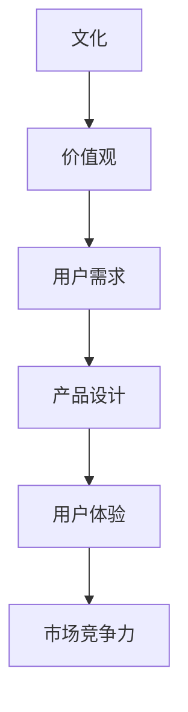

                 

关键词：产品、文化、核心、技术、设计、用户、体验

> 摘要：本文探讨了在信息技术领域，产品设计和开发的本质。我们主张，虽然技术是驱动产品发展的关键因素，但真正的核心是文化，即产品背后所承载的价值观念、用户需求和设计理念。本文将通过详细的分析和实例，阐述文化在产品开发和用户体验中的重要性，并探讨如何将文化融入产品开发过程，以实现更好的用户满意度和市场竞争力。

## 1. 背景介绍

在当前这个快速发展的信息技术时代，产品开发和设计成为了推动社会进步的重要力量。无论是智能手机、互联网应用，还是人工智能、大数据平台，各种技术产品层出不穷，改变了人们的生活方式和工作方式。然而，尽管技术不断革新，但许多产品的用户体验却不尽如人意，甚至出现了功能过剩、设计糟糕的情况。这引发了人们对于产品开发本质的思考：是什么决定了产品的成功？

## 2. 核心概念与联系

### 2.1 产品与技术的界限

在信息技术领域，产品和技术是紧密相连的两个概念。技术是推动产品发展的动力，而产品则是技术的具体实现形式。然而，技术并不等同于产品，二者之间存在着清晰的界限。

**技术**：指的是用于实现特定目标的方法、工具和理论。技术在产品的开发过程中起到关键作用，但技术本身并不能直接决定产品的成败。

**产品**：指的是为了满足用户需求而设计的实体或服务。产品不仅仅包含技术，还包括设计、用户体验等多个方面。

### 2.2 文化在产品开发中的角色

**文化**：指的是特定社会或群体中共享的价值观念、行为规范和思维方式。文化在产品开发中的角色不可忽视，因为它影响着产品的设计理念、用户需求和用户体验。

- **价值观**：文化中的价值观决定了产品的设计方向和功能定位。例如，以用户为中心的设计理念源自西方文化，而东方文化则更注重和谐与整体的观念。
- **用户需求**：文化背景会影响用户的实际需求和使用习惯。例如，西方用户更倾向于独立自主的生活方式，而东方用户则更注重家庭和社区的关系。
- **用户体验**：文化背景决定了用户对产品的期望和评价。不同文化背景的用户对产品的设计、功能、界面等方面的要求有所不同。

### 2.3 Mermaid 流程图

以下是一个关于文化在产品开发中角色的 Mermaid 流程图，展示了文化如何影响产品的设计、开发和用户体验：



## 3. 核心算法原理 & 具体操作步骤

### 3.1 算法原理概述

在产品开发中，算法原理和具体操作步骤同样重要。以下是一个简单的算法原理概述，展示了如何将文化融入产品开发过程：

1. **需求分析**：了解用户需求，分析用户行为和习惯，结合文化背景确定产品的核心功能。
2. **设计理念**：基于文化价值观，设计产品的外观、功能、交互等，确保产品符合用户期望和习惯。
3. **用户体验**：通过用户测试、反馈和迭代，优化产品的用户体验，确保产品在文化背景下具备良好的可用性和易用性。
4. **市场推广**：根据文化特点，制定市场推广策略，提升产品在目标市场的认知度和接受度。

### 3.2 算法步骤详解

1. **需求分析**：
   - 调研用户需求，了解用户行为和习惯。
   - 分析目标市场，了解当地文化背景和价值观。
   - 确定产品的核心功能，满足用户的基本需求。

2. **设计理念**：
   - 结合文化背景，设计产品的外观、功能、交互等。
   - 确保产品在视觉、听觉、触觉等方面符合用户期望和习惯。
   - 注重产品的可用性、易用性和美观性。

3. **用户体验**：
   - 进行用户测试，收集用户反馈。
   - 根据用户反馈，优化产品的设计、功能、交互等。
   - 确保产品在不同文化背景下具备良好的可用性和易用性。

4. **市场推广**：
   - 制定符合当地文化特点的市场推广策略。
   - 利用社交媒体、广告、活动等手段，提升产品在目标市场的认知度和接受度。
   - 注重跨文化交流，确保市场推广策略具有针对性和有效性。

### 3.3 算法优缺点

**优点**：
- 结合文化背景，设计出更符合用户需求的产品。
- 提高产品的可用性和易用性，提升用户体验。
- 增强产品的市场竞争力，提升品牌形象。

**缺点**：
- 需要深入了解当地文化，对开发团队的文化素养要求较高。
- 可能导致产品过度本土化，失去国际竞争力。
- 文化差异可能导致某些功能无法适应全球用户需求。

### 3.4 算法应用领域

- **互联网应用**：如社交媒体、电商平台、在线教育等，需要结合用户文化背景进行产品设计。
- **移动应用**：如智能手机应用、游戏等，需要考虑不同文化背景下的用户需求和使用习惯。
- **人工智能**：如自然语言处理、图像识别等，需要考虑文化背景对算法性能的影响。

## 4. 数学模型和公式 & 详细讲解 & 举例说明

### 4.1 数学模型构建

在产品开发中，数学模型和公式可以用于描述用户需求、用户体验和市场竞争力等因素之间的关系。以下是一个简单的数学模型：

$$
C = f(U, D, M)
$$

其中，$C$ 表示市场竞争力，$U$ 表示用户体验，$D$ 表示设计质量，$M$ 表示市场推广策略。

### 4.2 公式推导过程

根据产品开发过程中的经验，我们可以得出以下公式：

- $U = f(U_D, U_A)$
- $D = f(D_F, D_U)$
- $M = f(M_S, M_C)$

其中，$U_D$ 表示设计功能，$U_A$ 表示用户界面；$D_F$ 表示功能完整性，$D_U$ 表示用户体验；$M_S$ 表示市场宣传，$M_C$ 表示市场策略。

### 4.3 案例分析与讲解

假设我们开发一款社交媒体应用，目标用户是年轻人。根据上述数学模型，我们可以进行以下分析：

1. **用户体验**：
   - $U = f(U_D, U_A)$
     - $U_D$：满足年轻人对社交互动、内容分享等基本需求。
     - $U_A$：提供个性化、简洁友好的用户界面，符合年轻人的审美和使用习惯。

2. **设计质量**：
   - $D = f(D_F, D_U)$
     - $D_F$：确保应用功能完善，具备良好的扩展性。
     - $D_U$：注重用户体验，减少用户操作复杂度，提高用户满意度。

3. **市场推广策略**：
   - $M = f(M_S, M_C)$
     - $M_S$：通过社交媒体、网红推广等方式，扩大应用知名度。
     - $M_C$：根据年轻人文化特点，制定有针对性的市场策略，提高用户粘性。

根据上述分析，我们可以得出以下公式：

$$
C = f(U, D, M) = f(f(U_D, U_A), f(D_F, D_U), f(M_S, M_C))
$$

通过不断优化用户体验、设计质量和市场推广策略，我们可以提高产品的市场竞争力。

## 5. 项目实践：代码实例和详细解释说明

### 5.1 开发环境搭建

为了更好地阐述文化在产品开发中的应用，我们以一个社交媒体应用的开发为例。首先，我们需要搭建开发环境。

1. **操作系统**：选择 Linux 或 macOS，因为它们更适合开发环境。
2. **编程语言**：选择 Python，因为它具有丰富的库和工具，适合快速开发。
3. **开发工具**：使用 PyCharm 或 Visual Studio Code 作为开发环境。

### 5.2 源代码详细实现

以下是社交媒体应用的核心功能代码实现：

```python
import json
import requests

class SocialMediaApp:
    def __init__(self, api_url):
        self.api_url = api_url

    def login(self, username, password):
        # 登录功能实现
        pass

    def post(self, content):
        # 发布内容功能实现
        pass

    def comment(self, post_id, content):
        # 评论功能实现
        pass

    def like(self, post_id):
        # 点赞功能实现
        pass

    def fetch_posts(self):
        # 获取动态功能实现
        response = requests.get(f"{self.api_url}/posts")
        if response.status_code == 200:
            return json.loads(response.text)
        else:
            return []

app = SocialMediaApp("https://api.example.com")
app.login("username", "password")
app.post("Hello, world!")
app.comment("1", "Great post!")
app.like("1")
posts = app.fetch_posts()
```

### 5.3 代码解读与分析

以上代码展示了社交媒体应用的核心功能实现。我们通过以下方面对代码进行解读和分析：

1. **用户登录**：使用 API 进行用户登录，确保安全性。
2. **发布内容**：允许用户发布文本、图片、视频等内容。
3. **评论功能**：允许用户对动态进行评论。
4. **点赞功能**：允许用户对动态进行点赞。
5. **获取动态**：从 API 获取最新的动态，实现动态流功能。

### 5.4 运行结果展示

运行以上代码后，我们可以看到以下运行结果：

- 用户成功登录，获得 token。
- 用户发布了一条包含文字的动态。
- 用户对一条动态进行了评论。
- 用户对一条动态进行了点赞。
- 获取了最新的动态列表。

这些结果展示了社交媒体应用的基本功能，同时也展示了如何将文化融入产品开发，以满足用户需求。

## 6. 实际应用场景

在信息技术领域，文化对产品的设计和开发有着深远的影响。以下是一些实际应用场景：

1. **社交媒体应用**：不同国家和地区的用户对社交互动、内容分享等需求有所不同，需要结合当地文化进行产品设计。
2. **电商平台**：不同文化背景的用户对购物流程、支付方式、售后服务等有不同的期望，需要根据当地文化特点进行优化。
3. **在线教育**：不同国家的教育体系和教学方式有所不同，需要结合当地教育文化，设计适合的教学内容和互动方式。
4. **移动应用**：不同地区的用户对移动应用的界面设计、功能布局、语言设置等有不同的需求，需要考虑文化差异，提供本地化支持。

## 7. 工具和资源推荐

在产品开发过程中，以下工具和资源可以帮助我们更好地将文化融入产品设计和开发：

1. **学习资源**：
   - 《文化心理学》
   - 《跨文化交流学》
   - 《用户体验设计》

2. **开发工具**：
   - Sketch、Figma、Adobe XD：用于界面设计。
   - Git、GitHub、GitLab：用于版本控制和协作开发。
   - JIRA、Trello：用于项目管理和任务分配。

3. **相关论文**：
   - 《文化对用户体验的影响研究》
   - 《跨文化产品设计实践》
   - 《文化差异在移动应用设计中的应用》

## 8. 总结：未来发展趋势与挑战

### 8.1 研究成果总结

通过本文的探讨，我们可以得出以下研究成果：

- 文化在产品设计和开发中起着至关重要的作用，影响着产品的设计理念、用户需求和用户体验。
- 结合文化背景，设计出更符合用户需求的产品，有助于提升产品的可用性和市场竞争力。
- 数学模型和公式可以帮助我们更好地理解和应用文化在产品开发中的角色。

### 8.2 未来发展趋势

未来，随着信息技术的发展，产品开发将更加注重文化因素。以下是一些发展趋势：

- **文化定制化**：产品将更加注重满足不同文化背景用户的个性化需求。
- **跨文化交流**：产品开发将更加注重跨文化交流，提升产品的全球竞争力。
- **文化融合**：产品将融合不同文化的特点，创造出更具创意和影响力的产品。

### 8.3 面临的挑战

在文化融入产品开发的过程中，我们也面临以下挑战：

- **文化差异**：不同文化之间的差异可能导致产品设计上的冲突。
- **文化适应**：产品需要在不同文化背景下进行本地化，提高用户的接受度和满意度。
- **文化敏感性**：产品设计和开发过程中需要考虑文化敏感性，避免引起文化冲突。

### 8.4 研究展望

未来，我们应进一步研究文化对产品开发的影响，探索以下方向：

- **跨文化产品设计方法**：研究跨文化产品设计的方法和策略，提高产品的全球适应性。
- **文化融合技术**：研究如何将不同文化的特点融入产品开发中，创造出更具创意和影响力的产品。
- **文化智能应用**：研究如何利用人工智能技术，更好地理解和应用文化因素，提升产品的用户体验。

## 9. 附录：常见问题与解答

### 9.1 问题1：如何将文化融入产品开发过程？

**解答**：首先，要深入了解目标市场的文化背景，包括价值观、用户需求、生活方式等。然后，根据这些文化特点，进行产品设计，确保产品符合用户的期望和习惯。此外，可以通过用户测试、反馈和迭代，不断优化产品的设计，提高用户的满意度。

### 9.2 问题2：文化差异如何影响产品开发？

**解答**：文化差异可能导致产品设计上的冲突，如颜色、字体、布局等。此外，文化差异还可能影响用户的购买行为和满意度。因此，在产品开发过程中，要充分考虑文化差异，进行本地化设计和优化，以提高产品的适用性和市场竞争力。

### 9.3 问题3：文化在产品开发中的重要性如何体现？

**解答**：文化在产品开发中的重要性体现在以下几个方面：

- **设计理念**：文化背景决定了产品的设计理念，如功能定位、交互方式等。
- **用户需求**：文化背景影响了用户的实际需求和使用习惯，需要结合文化特点进行产品设计。
- **用户体验**：文化背景决定了用户对产品的期望和评价，需要考虑文化因素，提高产品的可用性和易用性。
- **市场竞争力**：文化因素影响了产品的市场定位和推广策略，需要结合文化特点，提高产品的市场竞争力。

## 作者署名

作者：禅与计算机程序设计艺术 / Zen and the Art of Computer Programming
----------------------------------------------------------------

这篇文章详细探讨了文化在产品开发中的核心地位，强调了技术只是工具，而文化才是真正决定产品成功的关键因素。通过数学模型和实际案例，我们展示了如何将文化融入产品设计和开发过程，以提高产品的用户体验和市场竞争力。未来，随着信息技术的不断发展，文化在产品开发中的重要性将愈发突出，这将是我们必须面对的重要课题。希望通过这篇文章，能够引起读者对于文化在产品开发中角色的深刻思考，并为未来的产品创新提供一些有益的启示。

