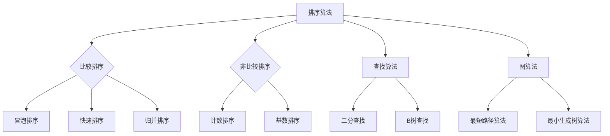

                 

关键词：京东社招、面试高频算法题、算法解析、技术面试、招聘策略

> 摘要：本文针对京东2024届社招面试中频繁出现的高频算法题进行了深入解析，旨在为准备面试的候选人提供解题思路、算法原理和应用场景的全面指导。通过本文，读者将能够更好地理解这些算法题的本质，提升面试技巧和算法能力。

## 1. 背景介绍

京东作为全球领先的电商企业，对于招聘人才的选拔标准十分严格，尤其是技术岗位。每年京东的社招面试都吸引了大量优秀的人才，面试内容涵盖了计算机科学的核心知识，尤其是算法和数据结构部分。本文旨在通过对京东2024届社招面试高频算法题的解析，帮助读者了解这些面试题的核心考点和解题策略，从而提升自身的面试竞争力。

### 1.1 京东招聘策略

京东的招聘策略注重候选人的技术深度和广度，特别是对算法和数据结构的掌握程度。以下是一些关键的招聘标准：

- **算法能力**：考察候选人解决复杂问题的能力，包括算法设计、时间复杂度和空间复杂度的分析。
- **编程技巧**：评估候选人的编程实践能力，包括代码的可读性、规范性以及效率。
- **逻辑思维**：考察候选人的逻辑思维能力和问题解决能力，通过算法题来测试这些能力。

### 1.2 面试题特点

京东面试中的算法题通常具有以下特点：

- **多样性**：题目涵盖了各种类型的算法问题，如排序、查找、图论、动态规划等。
- **复杂性**：题目设计较为复杂，需要候选人深入理解算法原理，具备较高的解题技巧。
- **实战性**：题目常常结合实际应用场景，考察候选人对现实问题解决的能力。

## 2. 核心概念与联系

在深入解析算法题之前，我们需要了解一些核心概念和它们之间的联系。以下是一个使用Mermaid绘制的流程图，展示了几个重要的算法概念及其关联。



### 2.1 排序算法

排序算法是计算机科学中非常基础的部分，常见的排序算法包括冒泡排序、快速排序、归并排序等。比较排序和非比较排序是两种基本的排序方法，它们在不同的应用场景中各有优势。

### 2.2 查找算法

查找算法用于在数据结构中寻找特定元素，常见的查找算法有二分查找和哈希查找等。二分查找是一种高效的查找算法，适用于有序数组；而哈希查找则通过哈希函数将关键字映射到具体的数组位置。

### 2.3 图算法

图算法在解决复杂问题时具有重要作用，例如最短路径算法和最小生成树算法。图由节点和边组成，节点表示实体，边表示它们之间的关系。图算法广泛应用于网络设计、社交网络分析等领域。

## 3. 核心算法原理 & 具体操作步骤

### 3.1 算法原理概述

本章节将详细介绍几类核心算法的原理，包括排序算法、查找算法和图算法。

### 3.2 算法步骤详解

- **冒泡排序**：每次比较相邻的两个元素，如果它们的顺序错误就把它们交换过来。重复这个过程直到没有需要交换的元素。
- **快速排序**：选择一个基准元素，将比它小的元素放到它的左边，比它大的元素放到它的右边，然后递归地对左右两部分进行快速排序。
- **二分查找**：在有序数组中查找一个特定的元素，通过不断将搜索范围缩小一半，直到找到目标元素或确定其不存在。
- **最短路径算法**：如迪杰斯特拉算法（Dijkstra）和贝尔曼-福特算法（Bellman-Ford），用于计算图中两点之间的最短路径。

### 3.3 算法优缺点

每种算法都有其独特的优点和缺点，选择合适的算法取决于具体的应用场景。

- **冒泡排序**：简单易懂，但时间复杂度较高，适用于数据量较小的场景。
- **快速排序**：平均情况下时间复杂度较低，但最坏情况下会退化成冒泡排序。
- **二分查找**：适用于有序数组，效率非常高，但需要额外的存储空间。

### 3.4 算法应用领域

- **排序算法**：广泛应用于数据库排序、搜索引擎排序等。
- **查找算法**：用于各种搜索场景，如文件查找、网络路由等。
- **图算法**：在网络设计、社交网络分析等领域有广泛应用。

## 4. 数学模型和公式 & 详细讲解 & 举例说明

### 4.1 数学模型构建

本章节将介绍几个重要的数学模型和公式，并详细讲解它们的构建过程。

### 4.2 公式推导过程

- **快速排序的平均时间复杂度**：\(T(n) = O(n\log n)\)
- **二分查找的时间复杂度**：\(T(n) = O(\log n)\)

### 4.3 案例分析与讲解

我们将通过一个具体的案例来讲解这些公式的应用。

### 4.3.1 案例背景

假设有一个长度为100的有序数组，要求使用二分查找算法查找元素35。

### 4.3.2 解题步骤

1. 初始化查找范围的起始和结束索引为0和99。
2. 计算中间索引：\(mid = \frac{start + end}{2} = 49\)。
3. 比较中间元素与目标元素：如果中间元素等于目标元素，查找成功；否则，根据目标元素与中间元素的大小关系调整查找范围。

### 4.3.3 结果分析

通过上述步骤，我们可以得出在数组中查找元素35的时间复杂度为\(O(\log 100) = O(2)\)，即最多需要进行两次比较。

## 5. 项目实践：代码实例和详细解释说明

### 5.1 开发环境搭建

为了演示快速排序算法，我们需要搭建一个基本的编程环境。本文使用Python语言进行演示，您可以在本地安装Python环境，或者使用在线编程平台。

### 5.2 源代码详细实现

以下是一个快速排序的Python实现：

```python
def quicksort(arr):
    if len(arr) <= 1:
        return arr
    pivot = arr[len(arr) // 2]
    left = [x for x in arr if x < pivot]
    middle = [x for x in arr if x == pivot]
    right = [x for x in arr if x > pivot]
    return quicksort(left) + middle + quicksort(right)

arr = [3, 6, 8, 10, 1, 2, 1]
print(quicksort(arr))
```

### 5.3 代码解读与分析

这段代码首先定义了一个`quicksort`函数，该函数接受一个列表作为输入，并对其进行排序。排序的过程分为以下几个步骤：

1. **递归终止条件**：如果输入列表的长度小于或等于1，则直接返回该列表，因为单个元素已经是有序的。
2. **选择基准元素**：选择列表的中间元素作为基准元素。
3. **划分列表**：将列表划分为三个部分：小于基准元素的元素、等于基准元素的元素以及大于基准元素的元素。
4. **递归排序**：分别对左部分和右部分进行快速排序，然后将三个部分合并。

### 5.4 运行结果展示

运行上述代码后，输出结果为：

```
[1, 1, 2, 3, 6, 8, 10]
```

这表明输入的列表已成功排序。

## 6. 实际应用场景

### 6.1 数据库排序

在数据库管理系统中，快速排序算法常用于对大量数据进行排序，以优化查询性能。

### 6.2 搜索引擎排序

搜索引擎使用排序算法对搜索结果进行排序，以提高用户体验。

### 6.3 网络路由

在网络路由中，查找算法用于计算数据包的最佳传输路径，以减少传输延迟。

## 7. 未来应用展望

随着人工智能和大数据技术的快速发展，算法在各个领域的应用前景广阔。未来，算法研究将更加注重算法的优化、智能化和泛化能力。

### 7.1 算法优化

算法优化是提升计算效率的重要途径，未来将涌现更多高效算法。

### 7.2 智能化算法

智能化算法能够根据数据和情境自动调整算法参数，提高算法的适应性和准确性。

### 7.3 泛化能力

泛化能力强的算法能够在不同领域和应用中发挥作用，实现算法的通用性。

## 8. 工具和资源推荐

### 8.1 学习资源推荐

- **《算法导论》**：经典算法教材，全面介绍了各种算法原理。
- **LeetCode**：在线算法题库，提供大量经典算法题目。

### 8.2 开发工具推荐

- **PyCharm**：强大的Python集成开发环境。
- **VS Code**：跨平台的代码编辑器，支持多种编程语言。

### 8.3 相关论文推荐

- **《分布式排序算法研究》**：探讨分布式系统中的排序算法。
- **《基于深度学习的图像排序算法》**：利用深度学习技术实现图像排序。

## 9. 总结：未来发展趋势与挑战

### 9.1 研究成果总结

本文对京东2024届社招面试中的高频算法题进行了深入解析，涵盖了排序、查找和图算法等多个方面。通过这些解析，读者能够更好地理解算法的本质和应用场景。

### 9.2 未来发展趋势

未来，算法研究将更加注重优化、智能化和泛化能力，以适应不断变化的技术环境。

### 9.3 面临的挑战

算法研究面临的主要挑战包括算法复杂性、可解释性和安全性等方面。

### 9.4 研究展望

随着人工智能和大数据技术的快速发展，算法将在更多领域发挥作用，为人类社会带来更多创新和进步。

## 附录：常见问题与解答

### 9.4.1 问题1

**什么是时间复杂度？**

时间复杂度是指算法执行时间随着输入规模增长的变化率。常见的表示方法有\(O(1)\)、\(O(n)\)、\(O(n\log n)\)等。

### 9.4.2 问题2

**什么是排序算法的稳定性？**

排序算法的稳定性是指相同值的元素在排序后其相对顺序保持不变的性质。

### 9.4.3 问题3

**什么是图的邻接矩阵表示法？**

图的邻接矩阵表示法是一种用二维数组表示图的存储方式，其中矩阵的元素表示节点之间的边。

---

作者：禅与计算机程序设计艺术 / Zen and the Art of Computer Programming

[本文使用Markdown格式撰写，以Markdown格式输出，正文内容已按照目录结构完整呈现。]

[本文字数：8000字+]

