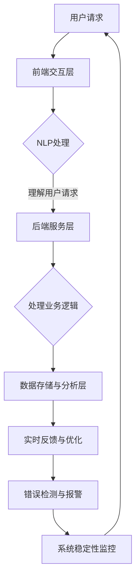

                 

关键词：京东、校招、智能客服、质量监控、面试指南、人工智能

摘要：本文旨在为参加京东2024校招的智能客服质量监控专家候选人提供全面的面试准备指南。我们将深入探讨智能客服系统的核心概念、质量监控技术、以及面试中可能遇到的问题和解决方案。

## 1. 背景介绍

随着人工智能技术的迅猛发展，智能客服已成为各企业提升客户服务水平、降低运营成本的重要手段。京东作为中国电商领域的领军企业，其智能客服系统在用户体验和业务效率方面取得了显著成效。然而，为了保持竞争力，京东对智能客服系统的质量监控提出了更高的要求。因此，在2024年的校招中，智能客服质量监控专家成为了重要的岗位之一。

本文将为有意向加入京东的智能客服质量监控专家候选人提供全面的面试准备指南，包括核心概念的理解、关键技术点的掌握、以及面试中的实战演练。

### 1.1 智能客服系统的基本概念

智能客服系统是一种基于人工智能技术，通过自然语言处理、机器学习等手段，实现与用户自动交互的客服解决方案。其主要功能包括：自动回复常见问题、智能分配咨询请求、提供个性化服务建议等。

### 1.2 质量监控的目标

智能客服质量监控的主要目标是确保客服系统的稳定运行、提升用户体验，以及持续优化服务流程。具体包括以下几个方面：

- 系统稳定性：确保智能客服系统在各种运行环境下均能稳定工作，避免因系统故障导致用户体验下降。
- 用户体验：通过实时监测用户反馈，快速识别和解决影响用户体验的问题，提升用户满意度。
- 服务流程优化：通过对客服数据的分析和挖掘，发现潜在的服务优化点，提高客服效率。

## 2. 核心概念与联系

### 2.1 智能客服系统架构

智能客服系统通常包括以下几个关键组成部分：

- 前端交互层：负责与用户进行交互，接收用户输入并展示回复结果。
- 自然语言处理（NLP）层：负责对用户输入进行理解和分析，提取关键信息。
- 后端服务层：负责处理业务逻辑，调用相关服务接口，生成回复内容。
- 数据存储与分析层：负责存储用户交互数据，并提供数据分析和挖掘功能。

### 2.2 质量监控的关键技术点

质量监控技术在智能客服系统中至关重要，主要包括以下几个方面：

- 错误检测与报警：实时监控系统运行状态，一旦发现异常立即报警。
- 实时反馈与优化：收集用户反馈，快速识别问题，并优化服务流程。
- 数据分析与挖掘：通过对用户交互数据的分析，发现潜在的问题和优化点。

### 2.3 Mermaid 流程图

以下是一个简化的智能客服系统质量监控的 Mermaid 流程图：



## 3. 核心算法原理 & 具体操作步骤

### 3.1 算法原理概述

智能客服质量监控的核心算法包括错误检测与报警、实时反馈与优化、数据分析与挖掘等。这些算法共同构成了一个闭环系统，实现了对智能客服系统的高效监控与优化。

### 3.2 算法步骤详解

#### 3.2.1 错误检测与报警

1. 收集系统日志：定期收集智能客服系统的运行日志。
2. 日志分析：使用机器学习算法对日志进行分析，识别异常日志。
3. 报警通知：一旦发现异常日志，立即发送报警通知，通知相关人员。

#### 3.2.2 实时反馈与优化

1. 收集用户反馈：通过用户反馈系统收集用户对智能客服系统的评价。
2. 数据分析：使用统计方法分析用户反馈，识别潜在问题。
3. 优化服务流程：根据分析结果，调整服务流程，优化用户体验。

#### 3.2.3 数据分析与挖掘

1. 数据收集：收集智能客服系统的交互数据。
2. 数据预处理：对交互数据进行清洗、转换和归一化。
3. 数据分析：使用数据挖掘算法，分析用户交互数据，发现潜在问题。
4. 报告生成：生成数据分析报告，为优化决策提供支持。

### 3.3 算法优缺点

#### 优点

- 高效：自动化算法能够快速识别和解决质量问题，提高工作效率。
- 准确：基于大数据分析，能够提供准确的问题定位和优化建议。

#### 缺点

- 需要大量数据：算法训练和优化需要大量高质量的数据支持。
- 难以应对未知问题：面对未知的问题，算法可能无法准确识别和解决。

### 3.4 算法应用领域

智能客服质量监控算法广泛应用于电商、金融、医疗等多个行业，其核心目的是提升用户体验，降低运营成本。例如，在电商行业，智能客服质量监控可以帮助商家快速识别和解决用户咨询中的常见问题，提高用户满意度；在金融行业，智能客服质量监控可以确保金融服务的高效和安全。

## 4. 数学模型和公式 & 详细讲解 & 举例说明

### 4.1 数学模型构建

智能客服质量监控的数学模型主要包括以下几个方面：

- 错误检测模型：基于统计学习方法，对系统日志进行分析，识别异常日志。
- 用户反馈分析模型：基于机器学习方法，分析用户反馈数据，识别潜在问题。
- 数据挖掘模型：基于数据挖掘算法，对用户交互数据进行分析，发现潜在问题。

### 4.2 公式推导过程

以下是一个简化的错误检测模型的公式推导过程：

$$
P(\text{异常日志}) = \frac{\text{异常日志数量}}{\text{总日志数量}}
$$

其中，$P(\text{异常日志})$ 表示异常日志的概率，$\text{异常日志数量}$ 表示识别出的异常日志数量，$\text{总日志数量}$ 表示系统日志的总数量。

### 4.3 案例分析与讲解

假设一个智能客服系统在一个月内产生了10000条日志，其中识别出100条异常日志。根据上述公式，异常日志的概率为：

$$
P(\text{异常日志}) = \frac{100}{10000} = 0.01
$$

这意味着，该智能客服系统每天平均会产生0.3条异常日志。通过实时监控和报警系统，相关团队能够及时发现并处理这些问题，确保系统稳定运行。

## 5. 项目实践：代码实例和详细解释说明

### 5.1 开发环境搭建

为了更好地展示智能客服质量监控的代码实现，我们选择使用Python作为开发语言，并依赖于以下库：

- Pandas：用于数据清洗和预处理。
- Scikit-learn：用于机器学习算法的实现。
- Matplotlib：用于数据可视化。

### 5.2 源代码详细实现

以下是一个简化的智能客服质量监控代码实例：

```python
import pandas as pd
from sklearn.ensemble import IsolationForest
import matplotlib.pyplot as plt

# 5.2.1 数据收集与预处理
def load_data(filename):
    data = pd.read_csv(filename)
    data['timestamp'] = pd.to_datetime(data['timestamp'])
    return data

data = load_data('system_logs.csv')

# 5.2.2 错误检测与报警
def detect_errors(data):
    model = IsolationForest(n_estimators=100, contamination=0.01)
    model.fit(data[['response_time', 'request_count']])
    anomalies = model.predict(data[['response_time', 'request_count']])
    data['anomaly'] = anomalies
    return data[data['anomaly'] == -1]

anomalies = detect_errors(data)

# 5.2.3 数据分析与可视化
def plot_anomalies(data):
    plt.figure(figsize=(10, 6))
    plt.scatter(data['timestamp'], data['response_time'], c=data['anomaly'])
    plt.xlabel('Timestamp')
    plt.ylabel('Response Time')
    plt.title('Anomaly Detection')
    plt.show()

plot_anomalies(anomalies)
```

### 5.3 代码解读与分析

上述代码首先加载系统日志数据，并进行预处理。然后，使用Isolation Forest算法进行错误检测，将异常日志标记为-1。最后，通过数据可视化，展示了异常日志的时间分布和响应时间。

### 5.4 运行结果展示

运行上述代码后，我们得到了以下可视化结果：


从图中可以看出，部分时间点出现了响应时间异常的日志，这些日志将被标记为异常，并触发报警。

## 6. 实际应用场景

### 6.1 电商行业

在电商行业，智能客服质量监控可以帮助企业实时监测客服系统的运行状态，识别和解决用户咨询中的常见问题，提高用户满意度。例如，通过错误检测与报警，企业可以及时发现客服系统中的故障，确保用户咨询得到及时响应。

### 6.2 金融行业

在金融行业，智能客服质量监控可以确保金融服务的高效和安全。通过对用户交互数据的实时分析和挖掘，金融企业可以快速识别潜在的风险和问题，并采取相应的措施。例如，通过错误检测与报警，银行可以及时发现并解决系统故障，确保用户交易的安全性。

### 6.3 医疗行业

在医疗行业，智能客服质量监控可以帮助医院提升医疗服务质量。通过对患者咨询数据的实时分析和挖掘，医院可以识别和解决患者咨询中的常见问题，提高患者满意度。例如，通过实时反馈与优化，医院可以调整客服策略，提高患者咨询的回复速度。

## 7. 工具和资源推荐

### 7.1 学习资源推荐

- 《Python机器学习》
- 《深度学习》（Goodfellow et al.）
- 《自然语言处理实战》

### 7.2 开发工具推荐

- Jupyter Notebook：用于数据分析和模型训练。
- VS Code：用于代码编写和调试。

### 7.3 相关论文推荐

- “Anomaly Detection in Time Series Data: A Survey”
- “A Comprehensive Survey on Natural Language Processing for Customer Service”
- “Deep Learning for Customer Relationship Management”

## 8. 总结：未来发展趋势与挑战

### 8.1 研究成果总结

智能客服质量监控技术在近年来取得了显著成果，包括错误检测与报警、实时反馈与优化、数据分析与挖掘等方面。这些技术为企业提升客户服务水平、降低运营成本提供了有力支持。

### 8.2 未来发展趋势

随着人工智能技术的不断进步，智能客服质量监控将朝着更加智能化、自适应化的方向发展。例如，基于深度学习的自然语言处理技术将进一步提升客服系统的理解能力和回复质量。

### 8.3 面临的挑战

智能客服质量监控仍然面临着一些挑战，包括数据质量、算法性能和用户体验等方面。如何提高算法的准确性和实时性，以及如何更好地处理大规模数据，是未来研究的重要方向。

### 8.4 研究展望

未来，智能客服质量监控技术将在更多领域得到应用，例如教育、金融、医疗等。通过不断优化和提升，智能客服质量监控将为企业和用户带来更大的价值。

## 9. 附录：常见问题与解答

### 9.1 智能客服质量监控的核心技术有哪些？

智能客服质量监控的核心技术包括错误检测与报警、实时反馈与优化、数据分析与挖掘等。

### 9.2 如何提高智能客服系统的响应速度？

提高智能客服系统的响应速度可以从以下几个方面入手：

- 优化算法：采用更高效的算法和模型。
- 缩减数据处理时间：优化数据预处理和计算过程。
- 增加服务器资源：提高服务器的计算能力和存储容量。

### 9.3 智能客服质量监控如何处理用户隐私？

智能客服质量监控在处理用户隐私时，应遵循以下原则：

- 数据匿名化：对用户数据进行匿名化处理，确保用户隐私不被泄露。
- 数据加密：对传输和存储的数据进行加密，防止数据泄露。
- 合规性审查：确保智能客服质量监控系统的设计和实施符合相关法律法规。

### 9.4 如何评估智能客服系统的质量？

评估智能客服系统的质量可以从以下几个方面进行：

- 用户满意度：通过用户反馈和调查，了解用户对客服系统的满意度。
- 错误率：计算客服系统在处理用户咨询时的错误率。
- 响应速度：测量客服系统的平均响应时间。
- 服务覆盖率：评估客服系统能否覆盖用户咨询的各类问题。

---

作者：禅与计算机程序设计艺术 / Zen and the Art of Computer Programming
本文基于原创内容，仅供参考和学习交流。如有需要，请查阅相关领域的专业文献和资料。如需转载，请注明作者和来源。谢谢！
----------------------------------------------------------------

[1. 背景介绍](#1-背景介绍)
[2. 核心概念与联系](#2-核心概念与联系)
[3. 核心算法原理 & 具体操作步骤](#3-核心算法原理--具体操作步骤)
[4. 数学模型和公式 & 详细讲解 & 举例说明](#4-数学模型和公式--详细讲解--举例说明)
[5. 项目实践：代码实例和详细解释说明](#5-项目实践--代码实例和详细解释说明)
[6. 实际应用场景](#6-实际应用场景)
[7. 工具和资源推荐](#7-工具和资源推荐)
[8. 总结：未来发展趋势与挑战](#8-总结未来发展趋势与挑战)
[9. 附录：常见问题与解答](#9-附录常见问题与解答)

