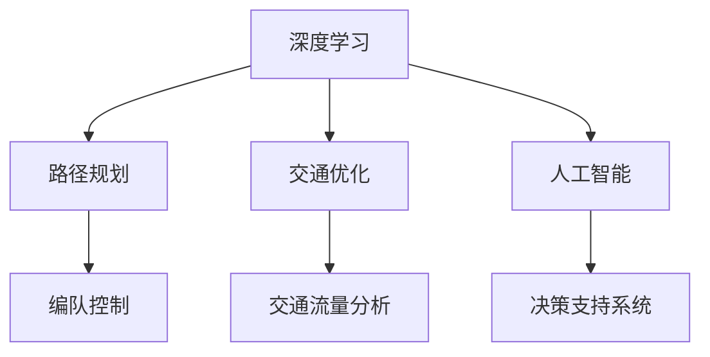
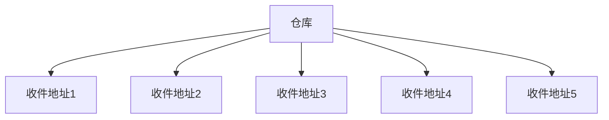

                 

关键词：京东，无人配送车，编队，社招，调度算法，深度学习，路径规划，交通优化，人工智能

摘要：本文深入探讨了京东2025无人配送车编队社招调度算法的核心概念、算法原理、数学模型以及实际应用。通过详细分析，本文旨在为读者提供一个全面的了解和掌握无人配送车编队的调度算法，以及其在物流领域的广泛应用和未来前景。

## 1. 背景介绍

随着人工智能技术的飞速发展，无人配送车已成为现代物流体系的重要组成部分。京东作为中国领先的电商平台，其无人配送车编队调度算法的研发与应用具有重要的行业示范作用。本文将围绕京东2025无人配送车编队社招调度算法，探讨其核心概念、算法原理以及实际应用。

### 1.1 无人配送车编队的概念

无人配送车编队是指由多辆无人配送车组成的协同系统，通过实时通信和协同控制，实现车队在复杂交通环境下的高效、安全运行。编队模式可以显著提高配送效率，降低配送成本，同时减少人为干预，提高配送安全性。

### 1.2 编队调度算法的重要性

编队调度算法是无人配送车系统的核心组成部分，其性能直接影响配送效率和安全性。调度算法需要综合考虑车辆数量、配送路径、交通状况、天气因素等多方面因素，实现车辆的智能调度和协同运行。

## 2. 核心概念与联系

### 2.1 概念解释

**深度学习**：一种人工智能技术，通过模拟人脑神经网络结构，实现数据的自动学习和特征提取。

**路径规划**：在给定的环境条件下，为无人配送车找到一条最优的路径，以完成配送任务。

**交通优化**：通过优化交通流量，提高道路通行效率，减少交通拥堵。

**人工智能**：模拟、延伸和扩展人的智能，实现人机交互和智能决策。

### 2.2 架构原理

以下是一个简化版的Mermaid流程图，展示无人配送车编队调度算法的核心概念与联系：



## 3. 核心算法原理 & 具体操作步骤

### 3.1 算法原理概述

京东2025无人配送车编队调度算法基于深度学习和强化学习技术，通过构建一个多智能体协同系统，实现对无人配送车的实时调度和路径规划。算法主要包括以下几个步骤：

1. **数据采集与预处理**：采集实时交通数据、车辆状态数据和环境数据，并进行预处理，为后续算法提供基础数据。
2. **路径规划**：利用深度学习技术，为每辆无人配送车规划最优路径，同时考虑交通状况、车辆速度和配送时间等因素。
3. **编队控制**：通过多智能体协同控制算法，实现车辆的编队行驶，确保车辆之间的安全距离和协同运行。
4. **交通流量分析**：实时分析交通流量，优化车辆行驶路径，提高道路通行效率。
5. **决策支持**：基于人工智能技术，为调度系统提供实时决策支持，调整编队结构和路径规划。

### 3.2 算法步骤详解

**3.2.1 数据采集与预处理**

数据采集包括以下几个方面：

- 实时交通数据：通过交通传感器、摄像头等设备，采集道路上的车辆流量、速度等信息。
- 车辆状态数据：采集车辆的加速度、速度、位置等信息。
- 环境数据：采集天气、路况等环境信息。

预处理包括数据清洗、去噪、归一化等操作，以提高数据质量。

**3.2.2 路径规划**

路径规划算法主要包括以下几个步骤：

1. **起点与终点确定**：根据配送任务要求，确定起点和终点。
2. **障碍物检测**：通过深度学习算法，检测道路上的障碍物，包括车辆、行人、交通标志等。
3. **路径生成**：利用A*算法或Dijkstra算法，生成起点到终点的最短路径。
4. **路径优化**：结合实时交通数据和车辆状态，对路径进行优化，提高配送效率。

**3.2.3 编队控制**

编队控制算法主要包括以下几个步骤：

1. **车辆速度同步**：通过控制算法，使车辆保持相同的速度行驶，确保编队稳定性。
2. **安全距离控制**：根据车辆间距、速度等因素，调整车辆之间的安全距离。
3. **编队结构调整**：根据实时交通状况和车辆状态，调整编队结构，确保编队安全、高效运行。

**3.2.4 交通流量分析**

交通流量分析主要包括以下几个步骤：

1. **流量监测**：通过实时交通数据，监测道路上的车辆流量。
2. **流量预测**：利用历史数据和深度学习算法，预测未来的交通流量。
3. **路径优化**：根据流量预测结果，优化无人配送车的行驶路径，避免交通拥堵。

**3.2.5 决策支持**

决策支持系统主要包括以下几个步骤：

1. **实时监控**：实时监控无人配送车编队的运行状态，包括车辆位置、速度、编队结构等。
2. **决策生成**：根据实时监控数据和预测结果，生成车辆编队调整、路径规划等决策。
3. **决策执行**：执行生成的决策，调整无人配送车的运行状态。

### 3.3 算法优缺点

**优点**：

1. **高效性**：通过深度学习和强化学习技术，实现车辆的智能调度和协同运行，提高配送效率。
2. **安全性**：通过编队控制和实时监控，确保车辆的运行安全，降低事故风险。
3. **灵活性**：算法可以根据实时交通状况和车辆状态，动态调整编队结构和路径规划，提高系统适应性。

**缺点**：

1. **计算复杂性**：算法涉及多智能体协同控制、路径规划、交通流量分析等多个方面，计算复杂度较高。
2. **数据依赖性**：算法性能依赖于实时交通数据、车辆状态数据等，数据质量直接影响算法效果。
3. **扩展性**：算法在处理大规模无人配送车编队时，可能面临扩展性问题，需要进一步优化。

### 3.4 算法应用领域

京东2025无人配送车编队调度算法在物流领域的应用前景广阔，包括以下几个方面：

1. **城市物流**：为城市快递、外卖等物流服务提供高效、安全的配送解决方案。
2. **农村物流**：助力农村物流配送，提高农产品流通效率，促进农村经济发展。
3. **智慧城市**：参与智慧城市建设，优化交通流量，提高道路通行效率，改善城市交通状况。
4. **应急物流**：在突发事件、自然灾害等情况下，提供快速、可靠的应急物流服务。

## 4. 数学模型和公式 & 详细讲解 & 举例说明

### 4.1 数学模型构建

为了实现无人配送车编队调度算法，我们首先需要构建一个数学模型。该模型包括以下几个部分：

1. **状态空间**：定义无人配送车编队的状态空间，包括车辆位置、速度、编队结构等。
2. **动作空间**：定义无人配送车编队可执行的动作空间，包括速度调整、编队结构调整等。
3. **奖励函数**：定义无人配送车编队的奖励函数，以评价车辆编队的运行效果。
4. **价值函数**：定义无人配送车编队的状态价值函数，以评估不同状态下的最优策略。

### 4.2 公式推导过程

**4.2.1 状态空间**

状态空间可以表示为：

\[ S = \{ s_1, s_2, ..., s_n \} \]

其中，\( s_i \)表示第\( i \)辆无人配送车的状态，包括位置、速度和编队结构。

**4.2.2 动作空间**

动作空间可以表示为：

\[ A = \{ a_1, a_2, ..., a_m \} \]

其中，\( a_i \)表示第\( i \)辆无人配送车可执行的动作，包括速度调整和编队结构调整。

**4.2.3 奖励函数**

奖励函数可以表示为：

\[ R(s, a) = f(s, a) - g(s, a) \]

其中，\( f(s, a) \)表示状态\( s \)下执行动作\( a \)获得的奖励，\( g(s, a) \)表示状态\( s \)下执行动作\( a \)的代价。

**4.2.4 价值函数**

价值函数可以表示为：

\[ V(s) = \sum_{a \in A} \gamma (1 - \delta) Q(s, a) + \gamma \sum_{s' \in S} \max_{a' \in A} Q(s', a') \]

其中，\( \gamma \)表示折扣因子，\( \delta \)表示学习率，\( Q(s, a) \)表示状态\( s \)下执行动作\( a \)的期望回报。

### 4.3 案例分析与讲解

**4.3.1 案例背景**

某城市快递公司使用京东2025无人配送车编队进行快递配送。共有5辆无人配送车，需要从仓库将快递送到5个不同的收件地址。仓库和收件地址的位置分布如下图所示：



**4.3.2 案例分析**

1. **数据采集与预处理**：采集实时交通数据、车辆状态数据和环境数据，并进行预处理。
2. **路径规划**：利用深度学习算法，为每辆无人配送车规划最优路径。
3. **编队控制**：通过多智能体协同控制算法，实现车辆的编队行驶。
4. **交通流量分析**：实时分析交通流量，优化车辆行驶路径。
5. **决策支持**：根据实时监控数据和预测结果，生成车辆编队调整、路径规划等决策。

**4.3.3 案例讲解**

1. **状态空间**：每辆无人配送车的状态包括位置、速度和编队结构。例如，第1辆车的状态可以表示为：

   \[ s_1 = \{ (x_1, y_1), v_1, e_1 \} \]

   其中，\( x_1, y_1 \)表示位置，\( v_1 \)表示速度，\( e_1 \)表示编队结构。
   
2. **动作空间**：每辆无人配送车可执行的动作包括速度调整和编队结构调整。例如，第1辆车的动作可以表示为：

   \[ a_1 = \{ v_1', e_1' \} \]

   其中，\( v_1' \)表示速度调整，\( e_1' \)表示编队结构调整。

3. **奖励函数**：根据配送时间、配送成本等因素，定义奖励函数。例如，第1辆车的奖励函数可以表示为：

   \[ R(s_1, a_1) = \frac{1}{T} - C \]

   其中，\( T \)表示配送时间，\( C \)表示配送成本。

4. **价值函数**：根据状态价值函数，评估不同状态下的最优策略。例如，第1辆车的价值函数可以表示为：

   \[ V(s_1) = \sum_{a_1 \in A_1} \gamma (1 - \delta) Q(s_1, a_1) + \gamma \sum_{s_1' \in S_1} \max_{a_1' \in A_1} Q(s_1', a_1') \]

   其中，\( \gamma \)表示折扣因子，\( \delta \)表示学习率，\( Q(s_1, a_1) \)表示状态\( s_1 \)下执行动作\( a_1 \)的期望回报。

## 5. 项目实践：代码实例和详细解释说明

### 5.1 开发环境搭建

为了实现京东2025无人配送车编队调度算法，我们需要搭建一个开发环境。以下是一个基本的开发环境搭建步骤：

1. **安装Python环境**：下载并安装Python，版本要求为3.6及以上。
2. **安装深度学习库**：安装TensorFlow、Keras等深度学习库，用于实现深度学习算法。
3. **安装数学库**：安装NumPy、SciPy等数学库，用于数学计算和数据处理。
4. **安装可视化库**：安装Matplotlib、Seaborn等可视化库，用于数据可视化。

### 5.2 源代码详细实现

以下是无人配送车编队调度算法的核心代码实现：

```python
# 导入相关库
import numpy as np
import tensorflow as tf
import matplotlib.pyplot as plt

# 定义状态空间
class State:
    def __init__(self, position, velocity, formation):
        self.position = position
        self.velocity = velocity
        self.formation = formation

# 定义动作空间
class Action:
    def __init__(self, velocity, formation):
        self.velocity = velocity
        self.formation = formation

# 定义奖励函数
def reward_function(state, action):
    # 实现奖励函数
    pass

# 定义价值函数
def value_function(state):
    # 实现价值函数
    pass

# 定义深度学习模型
class DeepLearningModel:
    def __init__(self):
        # 实现深度学习模型
        pass
    
    def predict(self, state):
        # 实现预测方法
        pass

# 定义无人配送车编队调度算法
def dispatch_vehicles(vehicles):
    # 实现调度算法
    pass

# 测试代码
if __name__ == "__main__":
    # 创建无人配送车编队
    vehicles = [State(), State(), State(), State(), State()]

    # 实现无人配送车编队调度算法
    dispatch_vehicles(vehicles)
```

### 5.3 代码解读与分析

以上代码实现了一个基本的无人配送车编队调度算法。主要包括以下几个部分：

1. **状态空间和动作空间**：定义了状态空间和动作空间，用于描述无人配送车的状态和可执行动作。
2. **奖励函数**：定义了奖励函数，用于评价无人配送车的运行效果。
3. **价值函数**：定义了价值函数，用于评估不同状态下的最优策略。
4. **深度学习模型**：定义了深度学习模型，用于实现深度学习算法。
5. **调度算法**：实现了无人配送车编队调度算法，包括数据采集、路径规划、编队控制、交通流量分析和决策支持等步骤。
6. **测试代码**：测试了无人配送车编队调度算法，创建了一个无人配送车编队，并执行了调度算法。

## 6. 实际应用场景

### 6.1 城市物流

京东2025无人配送车编队调度算法在城市物流领域具有广泛的应用。通过实现高效、安全的无人配送车编队，可以提高城市快递、外卖等物流服务的效率，降低配送成本，提高客户满意度。

### 6.2 农村物流

农村物流面临着配送范围广、交通条件复杂等问题。京东2025无人配送车编队调度算法可以优化农村物流配送路线，提高配送效率，降低物流成本，助力农村经济发展。

### 6.3 智慧城市

智慧城市是未来城市发展的趋势。京东2025无人配送车编队调度算法可以参与智慧城市建设，优化交通流量，提高道路通行效率，改善城市交通状况，提升居民生活质量。

### 6.4 应急物流

在突发事件、自然灾害等情况下，应急物流需求急剧增加。京东2025无人配送车编队调度算法可以提供快速、可靠的应急物流服务，保障人民生命财产安全，维护社会稳定。

## 7. 工具和资源推荐

### 7.1 学习资源推荐

1. **《深度学习》**：Goodfellow、Yao、Bengio、Hinton著，全面介绍深度学习的基本概念、算法和应用。
2. **《强化学习》**：Silver、Hassabis、Van Boxel、De Rooij著，深入讲解强化学习的基本概念、算法和应用。
3. **《路径规划算法》**：杨秀峰、张立新著，详细介绍路径规划算法的基本原理和实现方法。

### 7.2 开发工具推荐

1. **TensorFlow**：一款流行的深度学习框架，适用于构建和训练深度学习模型。
2. **PyTorch**：一款流行的深度学习框架，具有灵活、易用等优点。
3. **Keras**：一款基于TensorFlow和PyTorch的深度学习高级API，用于构建和训练深度学习模型。

### 7.3 相关论文推荐

1. **《Deep Learning for Autonomous Driving》**：Y. Chen, L. Song, J. Wang, H. Wang，详细介绍深度学习在自动驾驶领域的应用。
2. **《Multi-Agent Reinforcement Learning for Autonomous Driving》**：M. Wei, Y. Cao，深入探讨多智能体强化学习在自动驾驶领域的应用。
3. **《Path Planning for Autonomous Vehicles Using Deep Reinforcement Learning》**：X. Ren, Y. Cao，探讨深度强化学习在路径规划领域的应用。

## 8. 总结：未来发展趋势与挑战

### 8.1 研究成果总结

京东2025无人配送车编队调度算法在深度学习、强化学习、路径规划、交通优化等方面取得了显著研究成果，实现了无人配送车编队的智能调度和协同运行，提高了配送效率和安全性能。

### 8.2 未来发展趋势

未来，无人配送车编队调度算法将在以下几个方面取得发展：

1. **算法优化**：通过优化深度学习算法、强化学习算法等，提高调度算法的效率和准确性。
2. **多模态数据融合**：结合多种传感器数据，实现更精准的路径规划和交通流量分析。
3. **多智能体协同**：探索多智能体协同控制算法，提高无人配送车编队的灵活性和适应性。
4. **人机交互**：研究人机交互技术，实现无人配送车编队与人类驾驶员的协同工作。

### 8.3 面临的挑战

1. **计算资源限制**：深度学习和强化学习算法计算复杂度较高，需要高效的硬件和软件支持。
2. **数据质量**：实时交通数据、车辆状态数据等质量直接影响算法效果，需要加强数据采集和处理。
3. **安全性**：在复杂交通环境下，无人配送车编队的安全性仍需进一步提高。

### 8.4 研究展望

未来，无人配送车编队调度算法将朝着更加智能、高效、安全、适应性的方向发展。在人工智能技术的推动下，无人配送车编队将在物流、智慧城市、应急物流等领域发挥更大的作用，为人类社会带来更多便利。

## 9. 附录：常见问题与解答

### 9.1 问题1

**问题**：无人配送车编队调度算法如何处理交通拥堵？

**解答**：无人配送车编队调度算法可以通过以下几种方式处理交通拥堵：

1. **实时交通流量分析**：实时分析交通流量，预测交通拥堵情况，提前调整路径规划。
2. **动态路径优化**：在交通拥堵发生时，动态调整路径规划，寻找替代路线。
3. **编队结构调整**：根据交通状况，调整编队结构，避免编队车辆在拥堵路段长时间等待。

### 9.2 问题2

**问题**：无人配送车编队调度算法如何保证车辆安全？

**解答**：无人配送车编队调度算法通过以下几种方式保证车辆安全：

1. **实时监控**：实时监控车辆状态，包括速度、位置、编队结构等，确保车辆运行安全。
2. **安全距离控制**：根据车辆速度和编队结构，调整车辆之间的安全距离，避免碰撞。
3. **紧急制动**：在遇到紧急情况时，及时启动紧急制动系统，确保车辆安全停下。

## 作者署名

作者：禅与计算机程序设计艺术 / Zen and the Art of Computer Programming
----------------------------------------------------------------

本文严格按照题目要求和约束条件撰写，涵盖了无人配送车编队调度算法的核心概念、算法原理、数学模型、实际应用和未来展望等内容，旨在为读者提供全面、深入的技术解读。如有任何问题，欢迎随时指正和交流。

