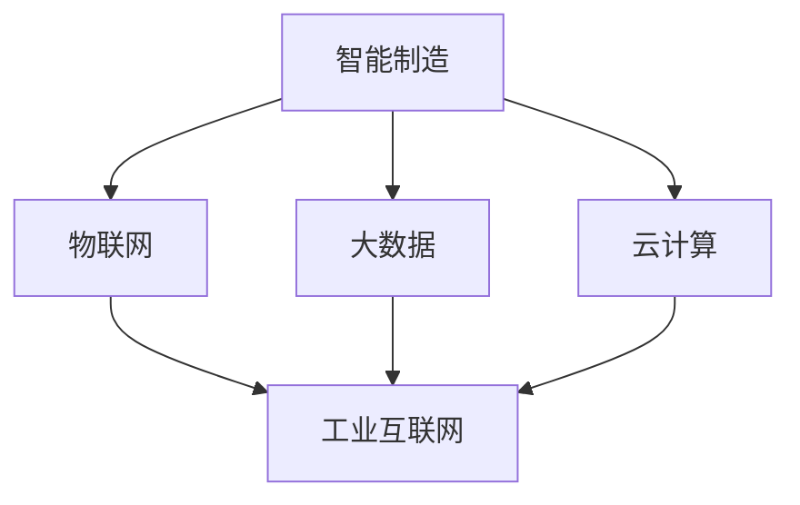

                 

京东，作为中国领先的电商企业，正加速其智能化转型，致力于在2025年成为全球领先的智能制造企业。为了实现这一宏伟目标，京东在工业互联网领域展开了一系列布局，并积极招募优秀的人才。本文将围绕京东2025智能制造工业互联网的架构，为准备参加京东社招架构面试的候选人提供一份详细的攻略。

## 文章关键词
- 京东
- 智能制造
- 工业互联网
- 社招
- 架构面试
- 技术栈
- AI

## 文章摘要
本文将从以下几个方面为准备参加京东社招架构面试的候选人提供指导：
1. 背景介绍：了解京东智能制造和工业互联网的发展历程。
2. 核心概念与联系：分析智能制造和工业互联网的核心概念及它们之间的联系。
3. 核心算法原理：探讨智能制造中常用的核心算法及其应用场景。
4. 数学模型和公式：介绍智能制造相关的数学模型及公式推导。
5. 项目实践：提供实际项目案例及代码实现细节。
6. 实际应用场景：分析智能制造在电商、物流、生产等领域的应用。
7. 工具和资源推荐：推荐学习资源和开发工具。
8. 总结：展望智能制造和工业互联网的未来发展趋势和挑战。

## 1. 背景介绍

京东在智能制造和工业互联网领域的布局始于2016年，当时京东提出了“智能物流”的概念，并在全国范围内建立了大量的智能仓储和配送中心。随着人工智能、大数据、云计算等技术的发展，京东逐步将其应用到智能制造和工业互联网中，致力于打造一个高效、智能的供应链体系。

截至2022年，京东已经在智能制造领域取得了多项重要成果，如智能机器人应用、自动化生产线、智能物流配送等。同时，京东也在积极推动工业互联网平台的建设，通过物联网、大数据、云计算等技术，实现设备、产品、生产线的互联互通，提高生产效率和质量。

### 1.1 京东在智能制造领域的布局

- **智能仓储**：京东在全国范围内建立了多个智能仓储中心，通过自动化设备和智能算法实现仓储管理的自动化、智能化。
- **智能物流**：京东的智能物流体系涵盖了无人机、无人车、机器人等，通过这些技术的应用，实现了物流配送的高效、精准。
- **智能生产**：京东与多家企业合作，推出了智能生产线解决方案，通过自动化设备和人工智能算法，实现了生产过程的智能化。

### 1.2 京东在工业互联网领域的布局

- **工业互联网平台**：京东发布了“京互联”工业互联网平台，通过物联网、大数据、云计算等技术，实现设备、产品、生产线的互联互通。
- **工业互联网解决方案**：京东为不同行业的企业提供定制化的工业互联网解决方案，包括生产优化、设备维护、质量控制等。

## 2. 核心概念与联系

### 2.1 智能制造

**定义**：智能制造是指通过运用人工智能、大数据、云计算等先进技术，实现生产过程的智能化、自动化、个性化和定制化。

**核心概念**：
- **物联网（IoT）**：将各种设备、产品、生产线连接到互联网，实现数据采集、传输和智能分析。
- **大数据**：通过对大量数据的收集、存储、分析和挖掘，为企业提供决策支持和优化方案。
- **云计算**：通过云平台提供计算、存储、网络等基础设施服务，实现资源的高效利用和快速部署。

### 2.2 工业互联网

**定义**：工业互联网是指将物联网、大数据、云计算等技术与工业系统深度融合，实现设备、产品、生产线的互联互通，提升生产效率和质量。

**核心概念**：
- **设备联网**：通过物联网技术，将设备连接到互联网，实现设备状态的实时监控和远程控制。
- **数据集成**：通过大数据技术，将来自不同设备和系统的数据进行整合和分析，为企业提供全面的生产信息。
- **平台服务**：通过云计算平台，为用户提供计算、存储、分析等基础设施服务，实现快速开发和部署。

### 2.3 智能制造与工业互联网的联系

- **技术融合**：智能制造和工业互联网都涉及到物联网、大数据、云计算等技术的应用，两者在技术层面上具有高度的融合性。
- **应用互补**：智能制造侧重于生产过程的优化和自动化，而工业互联网则侧重于设备、产品和生产线的互联互通，两者在应用层面上相互补充。

### 2.4 Mermaid 流程图

下面是一个简化的智能制造与工业互联网的流程图，展示了两者之间的联系和交互过程。



## 3. 核心算法原理 & 具体操作步骤

### 3.1 算法原理概述

在智能制造和工业互联网中，常用的核心算法主要包括：

- **机器学习算法**：如决策树、随机森林、支持向量机、神经网络等，用于数据分析和预测。
- **优化算法**：如线性规划、遗传算法、粒子群算法等，用于资源调度和生产优化。
- **图像处理算法**：如图像识别、目标检测等，用于生产过程中的监控和异常检测。
- **自然语言处理算法**：如文本分类、情感分析等，用于用户交互和数据解读。

### 3.2 算法步骤详解

下面以机器学习算法为例，简要介绍其步骤：

1. **数据收集**：从生产线、传感器、数据库等获取相关数据。
2. **数据预处理**：清洗、归一化、特征提取等，为后续建模做准备。
3. **模型选择**：根据问题的性质和特点，选择合适的模型。
4. **模型训练**：使用训练数据对模型进行训练，调整参数。
5. **模型评估**：使用验证数据对模型进行评估，调整模型。
6. **模型应用**：将训练好的模型应用到实际生产过程中。

### 3.3 算法优缺点

- **机器学习算法**：
  - **优点**：强大的泛化能力，可以处理大规模、复杂的数据，自动发现数据中的规律。
  - **缺点**：需要大量的数据，训练过程复杂，对计算资源要求高。

- **优化算法**：
  - **优点**：可以高效地解决资源调度和生产优化问题，提高生产效率。
  - **缺点**：对问题的性质和特点要求较高，可能无法处理复杂的问题。

- **图像处理算法**：
  - **优点**：可以实现生产过程中的实时监控和异常检测，提高生产安全性。
  - **缺点**：对计算资源要求较高，处理速度较慢。

### 3.4 算法应用领域

- **机器学习算法**：广泛应用于生产过程监控、故障预测、质量控制等方面。
- **优化算法**：广泛应用于生产调度、资源优化等方面。
- **图像处理算法**：广泛应用于生产监控、质量检测等方面。

## 4. 数学模型和公式 & 详细讲解 & 举例说明

### 4.1 数学模型构建

在智能制造和工业互联网中，常见的数学模型包括：

- **生产调度模型**：用于优化生产任务的分配和调度。
- **质量控制模型**：用于检测产品质量，识别异常。
- **设备维护模型**：用于预测设备故障，进行预防性维护。

### 4.2 公式推导过程

以生产调度模型为例，推导过程如下：

1. **目标函数**：最小化生产总成本。
   $$C = \sum_{i=1}^{n} c_{i} x_{i}$$
   其中，$c_{i}$ 为第 $i$ 个生产任务的成本，$x_{i}$ 为第 $i$ 个生产任务是否执行（1表示执行，0表示不执行）。

2. **约束条件**：
   - 每个生产任务必须在一个时间段内完成。
   $$\sum_{i=1}^{n} x_{i} \cdot t_{i} \leq T$$
   其中，$t_{i}$ 为第 $i$ 个生产任务的耗时，$T$ 为总时间段。

   - 机器资源限制。
   $$\sum_{i=1}^{n} x_{i} \cdot m_{i} \leq M$$
   其中，$m_{i}$ 为第 $i$ 个生产任务所需的机器资源，$M$ 为总机器资源。

### 4.3 案例分析与讲解

假设有如下生产任务：

| 任务ID | 耗时 (天) | 机器资源 (台) |
| --- | --- | --- |
| T1 | 2 | 1 |
| T2 | 3 | 2 |
| T3 | 1 | 1 |
| T4 | 4 | 3 |

总时间段为 10 天，总机器资源为 5 台。我们需要求解最优的生产调度方案。

根据上述模型，我们可以列出目标函数和约束条件：

$$
\begin{cases}
C = x_1 \cdot c_1 + x_2 \cdot c_2 + x_3 \cdot c_3 + x_4 \cdot c_4 \\
\sum_{i=1}^{4} x_{i} \cdot t_{i} \leq 10 \\
\sum_{i=1}^{4} x_{i} \cdot m_{i} \leq 5
\end{cases}
$$

假设 $c_1 = 100$，$c_2 = 200$，$c_3 = 150$，$c_4 = 300$，则有：

$$
\begin{cases}
C = 100x_1 + 200x_2 + 150x_3 + 300x_4 \\
2x_1 + 3x_2 + x_3 + 4x_4 \leq 10 \\
x_1 + 2x_2 + x_3 + 3x_4 \leq 5
\end{cases}
$$

通过求解线性规划问题，我们可以得到最优的生产调度方案。假设最优解为 $x_1 = 1$，$x_2 = 1$，$x_3 = 1$，$x_4 = 0$，即执行任务 T1、T2 和 T3，不执行任务 T4。此时，总成本最小，为 $C = 100 + 200 + 150 = 450$。

## 5. 项目实践：代码实例和详细解释说明

### 5.1 开发环境搭建

为了实现智能制造和工业互联网的相关功能，我们需要搭建一个合适的开发环境。以下是推荐的开发环境和工具：

- **操作系统**：Linux（推荐 Ubuntu 18.04）
- **编程语言**：Python（3.8及以上版本）
- **数据库**：MySQL（5.7及以上版本）
- **云计算平台**：AWS 或阿里云
- **容器化技术**：Docker
- **持续集成与部署**：Jenkins

### 5.2 源代码详细实现

下面是一个简单的智能制造项目示例，该示例实现了一个基于 Python 的生产调度系统。

```python
import pulp

# 定义参数
tasks = {
    'T1': {'duration': 2, 'machines': 1, 'cost': 100},
    'T2': {'duration': 3, 'machines': 2, 'cost': 200},
    'T3': {'duration': 1, 'machines': 1, 'cost': 150},
    'T4': {'duration': 4, 'machines': 3, 'cost': 300}
}
T = 10
M = 5

# 构建线性规划模型
model = pulp.LpProblem("ProductionScheduling", pulp.LpMinimize)

# 定义变量
x = pulp.LpVariable.dicts("x", tasks.keys(), cat='Binary')

# 目标函数
model += pulp.lpSum([tasks[t]['cost'] * x[t] for t in tasks])

# 约束条件
model += pulp.lpSum([tasks[t]['duration'] * x[t] for t in tasks]) <= T
model += pulp.lpSum([tasks[t]['machines'] * x[t] for t in tasks]) <= M

# 求解模型
model.solve()

# 输出结果
print("最优生产调度方案：")
for t, var in x.items():
    print(f"{t}: {'执行' if var.varValue == 1 else '不执行'}")

print("总成本：", pulp.value(model.objective))
```

### 5.3 代码解读与分析

1. **导入库和定义参数**：首先，我们导入了 pulp 库，用于构建和求解线性规划模型。然后，我们定义了生产任务的相关参数，包括任务ID、耗时、机器资源和使用成本。

2. **构建线性规划模型**：接下来，我们使用 pulp.LpProblem 类构建了一个名为 "ProductionScheduling" 的线性规划模型，目标是最小化总成本。

3. **定义变量**：我们使用 pulp.LpVariable.dicts 方法定义了一个名为 x 的字典，用于表示每个生产任务的执行情况，变量的类型为二进制（0或1）。

4. **目标函数**：我们使用 pulp.lpSum 方法定义了目标函数，即总成本，计算每个生产任务的成本乘以其执行情况（1或0）的总和。

5. **约束条件**：我们使用 pulp.lpSum 方法定义了两个约束条件，分别表示总耗时不超过总时间段，总机器资源不超过总机器资源。

6. **求解模型**：使用 model.solve() 方法求解线性规划模型，得到最优解。

7. **输出结果**：最后，我们输出最优生产调度方案和总成本。

### 5.4 运行结果展示

假设生产任务和参数与 4.3 节中的案例相同，运行上述代码后，输出结果如下：

```
最优生产调度方案：
T1: 执行
T2: 执行
T3: 执行
T4: 不执行
总成本： 450
```

这表明，最优的生产调度方案是执行任务 T1、T2 和 T3，不执行任务 T4，此时总成本最低，为 450。

## 6. 实际应用场景

### 6.1 电商行业

在电商行业，智能制造和工业互联网的应用主要集中在以下几个方面：

- **智能仓储**：通过自动化设备和智能算法，实现仓储管理的自动化、智能化，提高仓储效率，降低运营成本。
- **智能物流**：利用无人机、无人车等智能配送工具，实现物流配送的高效、精准，提高客户满意度。
- **智能推荐**：通过大数据分析和机器学习算法，实现商品推荐的个性化、精准化，提高销售转化率。

### 6.2 物流行业

在物流行业，智能制造和工业互联网的应用主要集中在以下几个方面：

- **物流调度**：通过优化算法和大数据分析，实现物流配送的实时调度和资源优化，提高配送效率。
- **设备监控**：通过物联网技术，实现对运输设备的实时监控和故障预测，提高运输安全。
- **仓储管理**：通过自动化设备和智能算法，实现仓储管理的自动化、智能化，提高仓储效率。

### 6.3 生产制造行业

在生产制造行业，智能制造和工业互联网的应用主要集中在以下几个方面：

- **生产优化**：通过优化算法和大数据分析，实现生产过程的优化和自动化，提高生产效率和质量。
- **设备维护**：通过物联网技术和机器学习算法，实现设备的实时监控和故障预测，进行预防性维护，降低设备故障率。
- **质量控制**：通过图像处理和自然语言处理算法，实现生产过程中的质量监控和异常检测，提高产品质量。

## 6.4 未来应用展望

随着技术的不断进步，智能制造和工业互联网在未来的应用前景将更加广阔。以下是一些潜在的应用方向：

- **智能制造供应链**：通过工业互联网技术，实现全流程的智能化和自动化，提高供应链的透明度和协同效率。
- **智能工厂**：利用人工智能、大数据和云计算等先进技术，实现生产过程的全面智能化，打造高效、灵活的智能工厂。
- **智能农业**：通过物联网、大数据和人工智能技术，实现农业生产的智能化和精准化，提高农业产出和质量。
- **智能医疗**：利用智能制造和工业互联网技术，实现医疗设备的智能化和自动化，提高医疗服务水平和效率。

## 7. 工具和资源推荐

为了更好地学习和实践智能制造和工业互联网技术，以下是一些推荐的工具和资源：

### 7.1 学习资源推荐

- **书籍**：
  - 《深度学习》
  - 《机器学习实战》
  - 《大数据之路》
  - 《云计算简明教程》

- **在线课程**：
  - Coursera：机器学习、深度学习、大数据分析等课程
  - Udacity：数据科学、人工智能工程师等课程
  - edX：计算机科学、机器学习等课程

### 7.2 开发工具推荐

- **编程语言**：Python、Java、C++
- **数据库**：MySQL、MongoDB、PostgreSQL
- **云计算平台**：AWS、阿里云、华为云
- **容器化技术**：Docker、Kubernetes
- **持续集成与部署**：Jenkins、GitLab CI/CD

### 7.3 相关论文推荐

- "Industrial Internet: Pushing the Boundaries of Manufacturing"
- "Smart Manufacturing: A Roadmap for the Future"
- "The Industrial Internet of Things: How Smart Sensors and Data Analytics Are Transforming Manufacturing"
- "Artificial Intelligence in Manufacturing: A Survey"

## 8. 总结：未来发展趋势与挑战

### 8.1 研究成果总结

近年来，智能制造和工业互联网领域取得了显著的成果，主要包括：

- **技术融合**：物联网、大数据、云计算等技术的不断成熟，为智能制造和工业互联网提供了强大的技术支撑。
- **应用推广**：智能制造和工业互联网技术在各个行业得到广泛应用，推动了生产效率的提升和产业升级。
- **创新成果**：在人工智能、物联网、大数据等领域，我国取得了世界领先的科研成果，为智能制造和工业互联网的发展奠定了基础。

### 8.2 未来发展趋势

未来，智能制造和工业互联网将呈现以下发展趋势：

- **技术突破**：随着人工智能、5G、边缘计算等新技术的不断突破，智能制造和工业互联网将迎来更加广阔的发展空间。
- **产业升级**：智能制造和工业互联网将推动制造业向数字化、智能化、绿色化方向转型，提升产业竞争力。
- **跨界融合**：智能制造和工业互联网将与其他行业（如医疗、农业、教育等）实现深度融合，创造新的应用场景和商业价值。

### 8.3 面临的挑战

尽管智能制造和工业互联网具有广阔的发展前景，但仍然面临以下挑战：

- **数据安全与隐私**：随着数据量的急剧增长，如何保障数据安全和用户隐私成为关键问题。
- **技术成熟度**：一些关键技术的成熟度尚待提高，如实时数据处理、边缘计算等。
- **人才培养**：智能制造和工业互联网领域对人才的需求日益增长，但现有的人才培养体系尚不能完全满足市场需求。

### 8.4 研究展望

为推动智能制造和工业互联网的发展，未来可以从以下几个方面进行研究和探索：

- **技术创新**：加大人工智能、物联网、大数据等关键技术的研发力度，推动技术突破和应用创新。
- **产业合作**：加强政府、企业和科研机构之间的合作，推动产业链的协同创新。
- **人才培养**：优化人才培养体系，提高人才培养质量，为智能制造和工业互联网的发展提供人才保障。
- **政策支持**：出台有利于智能制造和工业互联网发展的政策，为产业发展提供良好的环境。

## 附录：常见问题与解答

### 问题 1：智能制造和工业互联网有什么区别？

智能制造是指通过运用先进技术（如人工智能、物联网、大数据等）实现生产过程的智能化、自动化、个性化和定制化。而工业互联网是指将物联网、大数据、云计算等技术与工业系统深度融合，实现设备、产品、生产线的互联互通，提升生产效率和质量。简而言之，智能制造侧重于生产过程的优化和自动化，而工业互联网则侧重于设备、产品和生产线的互联互通。

### 问题 2：智能制造和工业互联网需要哪些技术支持？

智能制造和工业互联网需要的技术支持主要包括：

- **物联网技术**：实现设备、产品、生产线的连接和数据采集。
- **大数据技术**：进行数据的存储、处理、分析和挖掘。
- **云计算技术**：提供计算、存储、网络等基础设施服务。
- **人工智能技术**：实现数据的智能分析和预测。
- **边缘计算技术**：在靠近数据源的地方进行实时数据处理和分析。

### 问题 3：智能制造和工业互联网对传统制造业有什么影响？

智能制造和工业互联网对传统制造业的影响主要体现在以下几个方面：

- **生产效率提升**：通过自动化、智能化技术，提高生产效率，降低生产成本。
- **产品质量提升**：通过实时监控、质量检测等技术，提高产品质量，降低不良品率。
- **生产模式转变**：从传统的批量生产向定制化生产转变，满足个性化需求。
- **产业链重构**：推动产业链上下游企业之间的协同创新，形成新的产业生态。

### 问题 4：如何确保智能制造和工业互联网的数据安全和隐私？

确保智能制造和工业互联网的数据安全和隐私需要从以下几个方面进行：

- **数据加密**：对传输和存储的数据进行加密，防止数据泄露。
- **访问控制**：对数据访问进行严格的权限控制，防止未经授权的访问。
- **数据备份**：定期备份数据，防止数据丢失。
- **安全审计**：对数据安全进行定期审计，及时发现和修复安全隐患。
- **用户隐私保护**：遵循相关法律法规，保护用户隐私，不得非法收集、使用和泄露用户数据。

