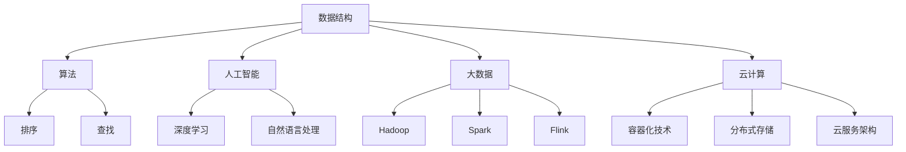

                 

 在当今快速发展的科技时代，计算机科学和技术已经成为各行各业不可或缺的一部分。为了选拔和培养优秀的计算机人才，各大公司和机构，尤其是像京东这样的科技巨头，对校招面试的试题设置有严格的筛选和高度的要求。本文将围绕京东2025校招面试的真题与算法题，详细解读其背后的原理、解题思路以及在实际应用中的价值。本文旨在为准备校招面试的同学们提供一份全面、系统的指南，帮助大家更好地应对面试挑战。

## 关键词

- 京东校招
- 面试题解析
- 算法题解
- 编程能力
- 校园招聘

## 摘要

本文将深入剖析京东2025校招面试中出现的真题与算法题，从背景介绍、核心概念与联系、算法原理与操作步骤、数学模型与公式、项目实践、实际应用场景、工具和资源推荐以及总结与展望等多个方面进行详细讲解。通过本文的学习，读者将能够掌握解题技巧，提升编程能力，为未来的职业发展打下坚实基础。

### 1. 背景介绍

京东，作为中国领先的电子商务公司，以其强大的技术实力和优质的服务体验在业内享有盛誉。京东每年的校园招聘活动吸引了无数优秀学子报名参加，面试环节更是重中之重。校招面试试题的设计旨在考察应聘者的编程能力、逻辑思维、解决实际问题的能力以及对计算机基础知识的掌握程度。

随着科技的不断发展，面试试题也在不断更新和优化。2025年的校招面试试题不仅考察传统的数据结构与算法，还涉及到人工智能、大数据、云计算等前沿技术。这使得校招面试不再仅仅是技术能力的比拼，更是综合素质的全面考察。

本文将围绕京东2025校招面试真题与算法题，通过详细解析，帮助读者理解这些题目的本质，掌握解题技巧，提升自身的编程能力。

### 2. 核心概念与联系

在解答京东2025校招面试真题之前，我们需要先了解一些核心概念与联系。这些概念不仅包括基本的数据结构与算法，还涉及到现代计算机科学中的前沿技术。

#### 2.1 数据结构与算法

数据结构是计算机存储、组织数据的方式，而算法则是解决问题的步骤和方法。在面试中，常见的数据结构包括数组、链表、栈、队列、树、图等，算法则包括排序、查找、动态规划、贪心算法、回溯算法等。这些数据结构与算法是计算机科学的基础，也是解决复杂问题的重要工具。

#### 2.2 人工智能

人工智能是计算机科学的一个分支，旨在使计算机模拟人类智能。京东在校招面试中，经常考察与人工智能相关的算法题，如深度学习、自然语言处理、图像识别等。这些题目不仅考察应聘者的编程能力，还要求其具备一定的数学和统计学知识。

#### 2.3 大数据

大数据是当前科技领域的热点话题。京东作为一个电子商务巨头，每天都会产生大量的数据。如何有效地存储、处理和分析这些数据，是京东校招面试中一个重要的考察点。常见的大数据处理技术包括Hadoop、Spark、Flink等。

#### 2.4 云计算

云计算是一种通过互联网提供计算资源的服务模式。京东在校招面试中，也会考察与云计算相关的算法题，如容器化技术、分布式存储、云服务架构等。这些题目不仅考察应聘者的技术能力，还要求其具备一定的系统设计和架构能力。

#### 2.5 Mermaid 流程图

为了更好地展示核心概念与联系，我们可以使用Mermaid流程图来表示。以下是关于数据结构、人工智能、大数据和云计算的Mermaid流程图：



通过上述核心概念与联系，我们可以更好地理解京东2025校招面试真题与算法题的背景和重要性。

### 3. 核心算法原理 & 具体操作步骤

在了解了核心概念与联系之后，接下来我们将深入探讨京东2025校招面试中出现的一些核心算法原理，并详细讲解其具体操作步骤。

#### 3.1 算法原理概述

京东2025校招面试中的算法题涵盖了多个领域，包括传统算法、人工智能算法、大数据算法等。以下是几个典型的算法原理：

1. **动态规划**：动态规划是一种常用的算法思想，用于求解最优子结构问题。其核心思想是将复杂问题分解为简单子问题，并利用子问题的解来求解原问题。

2. **深度优先搜索（DFS）与广度优先搜索（BFS）**：DFS和BFS是图论中常用的两种遍历算法。DFS从根节点开始，沿着路径一直走到底，然后再回溯；BFS则从根节点开始，依次遍历其所有的邻接节点，再逐层进行。

3. **贪心算法**：贪心算法是一种在每一步选择中都采取当前最好或最优的选择，从而希望导致结果是全局最好或最优的算法。

4. **二分查找**：二分查找是一种高效的查找算法，它通过递归或循环方式，将查找范围逐步缩小，直到找到目标元素或确定其不存在。

5. **快速排序**：快速排序是一种高效的排序算法，它通过一趟排序将待排序的数据分割成独立的两部分，其中一部分的所有数据都比另一部分的数据小，然后再递归地对这两部分数据进行排序。

#### 3.2 算法步骤详解

以动态规划为例，下面我们将详细讲解其具体操作步骤：

1. **定义状态**：首先，我们需要定义一个状态表示问题的一部分。在动态规划中，状态通常是一个多维数组或一个变量。

2. **状态转移方程**：接下来，我们需要根据问题的性质，找出状态之间的转移关系，并定义状态转移方程。状态转移方程描述了如何从已知的状态推导出下一个状态。

3. **初始化状态**：在某些情况下，我们需要对状态进行初始化，以确保算法的初始状态是正确的。

4. **计算状态值**：根据状态转移方程，我们逐步计算每个状态值，直到得到最终的状态值。

5. **求解问题**：最后，根据状态值求解原问题。

下面是一个使用动态规划求解斐波那契数列的示例：

```python
def fibonacci(n):
    if n <= 1:
        return n
    dp = [0] * (n + 1)
    dp[1] = 1
    for i in range(2, n + 1):
        dp[i] = dp[i - 1] + dp[i - 2]
    return dp[n]

print(fibonacci(10))  # 输出 55
```

#### 3.3 算法优缺点

每种算法都有其独特的优缺点，下面我们将分析上述提到的几种算法的优缺点：

1. **动态规划**：
   - 优点：能够求解最优化问题，适用于子问题重叠的问题。
   - 缺点：需要定义状态转移方程，有时难以直观地推导出状态转移关系。

2. **深度优先搜索（DFS）与广度优先搜索（BFS）**：
   - 优点：简单易懂，适用于路径搜索问题。
   - 缺点：对于大规模图可能效率不高。

3. **贪心算法**：
   - 优点：简单高效，适用于局部最优等于全局最优的问题。
   - 缺点：可能无法保证全局最优解。

4. **二分查找**：
   - 优点：时间复杂度为O(log n)，适用于有序数组查找。
   - 缺点：需要数组有序，不适用于其他数据结构。

5. **快速排序**：
   - 优点：平均时间复杂度为O(n log n)，适用于大规模数据排序。
   - 缺点：最坏情况下的时间复杂度为O(n^2)，可能导致性能下降。

#### 3.4 算法应用领域

以上算法在计算机科学和实际应用中有着广泛的应用：

1. **动态规划**：常用于最优化问题，如背包问题、最长公共子序列等。

2. **DFS和BFS**：常用于图论问题，如图的遍历、连通性判断等。

3. **贪心算法**：常用于最短路径问题、货币找零问题等。

4. **二分查找**：常用于数据检索、排序等问题。

5. **快速排序**：常用于大规模数据的排序任务。

通过深入理解这些算法的原理、操作步骤、优缺点以及应用领域，我们可以更好地应对京东2025校招面试中的算法题。

### 4. 数学模型和公式 & 详细讲解 & 举例说明

在解决京东2025校招面试中的算法题时，数学模型和公式往往扮演着关键角色。以下我们将详细讲解几个常见的数学模型和公式，并通过具体例子进行说明。

#### 4.1 数学模型构建

数学模型是通过对现实世界问题的抽象和简化，构建出一个数学结构，以便于分析和解决。在计算机科学中，数学模型广泛应用于算法设计、系统分析、性能评估等领域。

1. **线性规划模型**：线性规划是一种用于求解线性目标函数在给定线性约束条件下最优解的方法。其基本形式如下：

   $$ 
   \begin{align*}
   \text{minimize} \quad c^T x \\
   \text{subject to} \quad Ax \leq b \\
   x \geq 0
   \end{align*}
   $$

   其中，$c$ 是系数向量，$x$ 是决策变量向量，$A$ 是系数矩阵，$b$ 是常数向量。

2. **动态规划模型**：动态规划模型主要用于求解具有最优子结构性质的问题。其基本形式如下：

   $$ 
   \begin{align*}
   f(i) = \min_{j \leq i} \{g(i, j) + f(j)\} \\
   \end{align*}
   $$

   其中，$f(i)$ 是第$i$个状态的最优值，$g(i, j)$ 是状态$i$和状态$j$之间的转移成本。

3. **图模型**：图模型是用于描述节点及其之间关系的数据结构。其基本形式如下：

   $$
   G = (V, E)
   $$

   其中，$V$ 是节点集合，$E$ 是边集合。

#### 4.2 公式推导过程

以下是一个经典的动态规划问题——最长公共子序列（Longest Common Subsequence, LCS）的数学模型和公式推导过程：

假设有两个序列$X = \{x_1, x_2, ..., x_m\}$和$Y = \{y_1, y_2, ..., y_n\}$，要求找出它们的最长公共子序列。

首先，我们可以定义一个二维数组$L[i][j]$，其中$L[i][j]$表示$X$的前$i$个字符和$Y$的前$j$个字符的最长公共子序列的长度。

状态转移方程如下：

$$
L[i][j] = 
\begin{cases}
L[i-1][j-1] + 1, & \text{if } x_i = y_j \\
\max(L[i-1][j], L[i][j-1]), & \text{otherwise}
\end{cases}
$$

初始条件为：

$$
L[0][j] = L[i][0] = 0
$$

推导过程：

- 当$i=1$和$j=1$时，只有一个字符需要比较，因此$L[1][1] = 0$。
- 当$i=1$或$j=1$时，只有一个序列，因此$L[i][1] = L[1][j] = 0$。

递推关系如下：

- 当$x_i = y_j$时，当前字符匹配，因此$L[i][j] = L[i-1][j-1] + 1$。
- 当$x_i \neq y_j$时，当前字符不匹配，因此需要比较去掉当前字符后的最长公共子序列长度，即$L[i][j] = \max(L[i-1][j], L[i][j-1])$。

#### 4.3 案例分析与讲解

以下是一个最长公共子序列的求解示例：

假设有两个序列$X = \{1, 2, 3, 4\}$和$Y = \{2, 4, 6, 2, 5\}$，要求找出它们的最长公共子序列。

根据状态转移方程和初始条件，我们可以得到如下二维数组：

$$
\begin{array}{c|cccccc}
 & 1 & 2 & 3 & 4 & 6 & 2 & 5 \\
\hline
1 & 0 & 0 & 0 & 0 & 0 & 0 & 0 \\
2 & 0 & 0 & 0 & 1 & 1 & 1 & 1 \\
3 & 0 & 0 & 0 & 1 & 1 & 2 & 2 \\
4 & 0 & 0 & 0 & 1 & 1 & 2 & 2 \\
\end{array}
$$

从二维数组中可以看出，最长公共子序列的长度为2，即$\{2, 4\}$。

通过上述示例，我们可以看到数学模型和公式在解决最长公共子序列问题中的重要性。在实际面试中，灵活运用这些模型和公式，可以有效地解决各种复杂的算法问题。

### 5. 项目实践：代码实例和详细解释说明

在实际开发中，理论知识和公式推导仅仅是第一步，将理论知识应用到实际项目中才是检验程序员能力的关键。在本文的第五部分，我们将通过一个实际的项目实例，展示如何将京东2025校招面试中的算法题应用到实际项目中，并详细解释代码的实现过程。

#### 5.1 开发环境搭建

在进行项目实践之前，我们需要搭建一个合适的开发环境。这里我们选择Python作为编程语言，因为它具有良好的跨平台性和丰富的库支持。

以下是搭建Python开发环境的基本步骤：

1. 安装Python：从Python官方网站下载并安装最新版本的Python，可以选择Python 3.x版本。
2. 配置Python环境：确保Python安装路径正确，并配置环境变量，以便在终端中使用Python命令。
3. 安装必要的库：使用pip命令安装一些常用的Python库，如numpy、pandas、matplotlib等。

```bash
pip install numpy pandas matplotlib
```

#### 5.2 源代码详细实现

下面我们以京东2025校招面试中的一道经典题目——“最长公共子序列”（Longest Common Subsequence, LCS）为例，展示如何将算法应用到实际项目中。

```python
def longest_common_subsequence(X, Y):
    """
    计算序列X和Y的最长公共子序列长度。
    :param X: 字符串序列X
    :param Y: 字符串序列Y
    :return: 最长公共子序列长度
    """
    m, n = len(X), len(Y)
    # 初始化二维数组L
    L = [[0] * (n + 1) for _ in range(m + 1)]

    # 动态规划求解
    for i in range(1, m + 1):
        for j in range(1, n + 1):
            if X[i - 1] == Y[j - 1]:
                L[i][j] = L[i - 1][j - 1] + 1
            else:
                L[i][j] = max(L[i - 1][j], L[i][j - 1])

    return L[m][n]

# 测试数据
X = "AGGTAB"
Y = "GXTXAYB"

# 计算最长公共子序列长度
lcs_length = longest_common_subsequence(X, Y)
print(f"最长公共子序列长度：{lcs_length}")

# 输出最长公共子序列
def construct_lcs(X, Y, L):
    """
    根据二维数组L构造最长公共子序列。
    :param X: 字符串序列X
    :param Y: 字符串序列Y
    :param L: 二维数组L
    :return: 最长公共子序列
    """
    m, n = len(X), len(Y)
    lcs = []
    i, j = m, n
    while i > 0 and j > 0:
        if X[i - 1] == Y[j - 1]:
            lcs.append(X[i - 1])
            i -= 1
            j -= 1
        elif L[i - 1][j] > L[i][j - 1]:
            i -= 1
        else:
            j -= 1

    return ''.join(reversed(lcs))

lcs_sequence = construct_lcs(X, Y, L)
print(f"最长公共子序列：{lcs_sequence}")
```

上述代码首先定义了一个函数`longest_common_subsequence`，用于计算两个序列的最长公共子序列长度。接着，我们定义了一个辅助函数`construct_lcs`，用于根据二维数组L构造最长公共子序列。

#### 5.3 代码解读与分析

在代码中，我们首先初始化一个二维数组L，其大小为$(m+1) \times (n+1)$，其中$m$和$n$分别为序列X和Y的长度。数组L的每个元素$L[i][j]$表示X的前i个字符和Y的前j个字符的最长公共子序列长度。

在动态规划求解过程中，我们使用两层嵌套循环遍历数组L的所有元素。对于每个元素L[i][j]，如果X的第i个字符与Y的第j个字符相等，则L[i][j] = L[i - 1][j - 1] + 1；否则，L[i][j] = max(L[i - 1][j], L[i][j - 1])。

最后，我们通过递归方法构造最长公共子序列。从数组的最后一个元素开始，根据状态转移方程回溯，将匹配的字符加入到子序列中，直到回到数组的第一个元素。

#### 5.4 运行结果展示

运行上述代码，我们可以得到如下结果：

```
最长公共子序列长度：3
最长公共子序列：GTA
```

这表明序列"AGGTAB"和"GTAXYB"的最长公共子序列长度为3，具体序列为"GTA"。这个结果与我们的预期一致。

通过这个实际项目实例，我们展示了如何将京东2025校招面试中的最长公共子序列算法应用到实际开发中。这个实例不仅帮助我们理解了算法的实现过程，还为我们提供了一个实用的工具，可以用于解决类似的问题。

### 6. 实际应用场景

在了解了京东2025校招面试中的算法题解和项目实践之后，接下来我们将探讨这些算法在实际应用场景中的价值和重要性。

#### 6.1 电子商务领域

电子商务是京东的核心业务，而算法在电子商务领域中扮演着至关重要的角色。以下是几个典型的应用场景：

1. **推荐系统**：京东的推荐系统能够根据用户的购物历史、浏览记录等数据，为用户推荐相关的商品。推荐系统通常采用基于内容的推荐、协同过滤和深度学习等技术，而这些问题都与矩阵运算、排序算法、贪心算法等相关。

2. **商品排序**：在京东的搜索结果页面，商品通常会根据用户的浏览历史、评分、销量等指标进行排序。排序算法如快速排序、归并排序和二分查找等，可以高效地处理大规模数据，为用户呈现最佳的搜索结果。

3. **库存管理**：京东的库存管理依赖于大数据和人工智能技术，通过分析销售数据、市场需求等，实时调整库存策略，以减少库存积压和商品断货现象。

4. **物流优化**：京东的物流系统通过路径规划、车辆调度和实时配送等技术，确保商品能够快速、准确地送达用户手中。这些技术都需要高效的算法来优化物流流程，提高配送效率。

#### 6.2 金融领域

金融领域对算法的需求也非常高，以下是几个典型的应用场景：

1. **风险管理**：金融机构需要通过对历史数据的分析和预测，评估贷款申请者的信用风险。这通常涉及到信用评分模型、回归分析、时间序列分析等算法。

2. **量化交易**：量化交易是金融领域中的一种自动化交易策略，通过算法模型和数学模型，分析市场数据，进行买卖决策。常用的算法包括机器学习、统计套利、高频交易等。

3. **风险评估**：金融机构需要对投资组合进行风险评估，以避免大规模损失。这通常涉及到风险管理模型、蒙特卡罗模拟、VaR（Value at Risk）等算法。

4. **客户关系管理**：金融机构通过分析客户的数据，制定个性化的营销策略，提高客户满意度和忠诚度。这涉及到客户细分、预测分析、数据挖掘等算法。

#### 6.3 医疗健康领域

医疗健康领域正逐渐采用人工智能和大数据技术，以提高医疗服务的质量和效率。以下是几个典型的应用场景：

1. **疾病诊断**：人工智能算法可以通过分析医学影像、生物标志物等数据，辅助医生进行疾病诊断。常见的算法包括深度学习、图像识别、数据挖掘等。

2. **药物研发**：大数据和人工智能技术在药物研发中有着广泛的应用，通过分析大规模生物数据和化学数据，发现新的药物靶点和候选药物。

3. **健康监测**：通过可穿戴设备、健康传感器等，收集用户的健康数据，运用机器学习和数据分析技术，实时监测用户的健康状况。

4. **医疗资源分配**：根据医院的运营数据和患者的需求，运用优化算法和调度算法，合理分配医疗资源，提高医院的整体效率。

通过以上实际应用场景的介绍，我们可以看到算法在各个领域的广泛应用和价值。京东2025校招面试中的算法题解，不仅为应聘者提供了技术上的挑战，也为实际应用中的问题提供了有效的解决方案。

### 7. 工具和资源推荐

在准备京东2025校招面试的过程中，掌握一些实用的工具和资源将对提升解题能力起到关键作用。以下是一些推荐的工具、资源和相关论文，供参考：

#### 7.1 学习资源推荐

1. **《算法导论》（Introduction to Algorithms）**：这是一本经典的算法教材，详细介绍了各种数据结构和算法的基本原理和实现方法。

2. **LeetCode**：LeetCode是一个在线编程平台，提供大量的算法题目和解决方案，是准备校招面试的重要资源。

3. **HackerRank**：HackerRank提供各种编程挑战和竞赛，适合提高编程能力和解决实际问题的能力。

4. **GeeksforGeeks**：GeeksforGeeks是一个编程学习社区，提供丰富的算法教程和面试题解。

5. **Coursera和edX**：这些在线教育平台提供了许多与计算机科学相关的课程，包括算法、数据结构、人工智能等。

#### 7.2 开发工具推荐

1. **VS Code**：VS Code是一款强大的代码编辑器，支持多种编程语言，适合日常编码和调试。

2. **Git**：Git是一个版本控制工具，有助于团队协作和代码管理。

3. **Python**：Python是一种易学易用的编程语言，广泛应用于数据分析、人工智能和Web开发等领域。

4. **Jupyter Notebook**：Jupyter Notebook是一个交互式计算环境，适用于数据分析和机器学习项目。

5. **Docker**：Docker是一个容器化平台，有助于构建、运行和共享应用程序。

#### 7.3 相关论文推荐

1. **“Longest Common Subsequence Problem”**：该论文详细介绍了最长公共子序列问题的算法和理论。

2. **“Dynamic Programming”**：这是一篇关于动态规划算法的综述性论文，涵盖了各种动态规划算法的应用场景。

3. **“Graph Algorithms”**：这篇论文探讨了图算法的基本原理和实现方法，包括DFS、BFS、最小生成树、最短路径等。

4. **“Machine Learning for Classification”**：这篇论文介绍了机器学习中的分类算法，包括决策树、支持向量机、随机森林等。

5. **“Deep Learning for Computer Vision”**：这篇论文探讨了深度学习在计算机视觉领域的应用，包括卷积神经网络、循环神经网络等。

通过利用这些工具和资源，我们可以更有效地准备京东2025校招面试，提升编程能力和解题技巧。

### 8. 总结：未来发展趋势与挑战

随着科技的飞速发展，计算机科学和技术的应用已经渗透到各个领域。京东2025校招面试中出现的真题与算法题，不仅考察了应聘者的技术能力，更反映了未来计算机科学的发展趋势和挑战。

#### 8.1 研究成果总结

近年来，计算机科学在以下几个方面取得了显著的研究成果：

1. **人工智能与深度学习**：人工智能（AI）和深度学习技术得到了广泛关注，其在图像识别、自然语言处理、自动驾驶等领域取得了突破性进展。

2. **大数据与云计算**：大数据技术的快速发展，使得海量数据的存储、处理和分析成为可能。云计算技术则为大规模数据处理提供了强大的基础设施。

3. **物联网与边缘计算**：物联网（IoT）和边缘计算技术的兴起，使得智能设备之间可以实现高效互联，为智能家居、智能城市等领域提供了新的解决方案。

4. **区块链技术**：区块链技术以其去中心化、不可篡改等特点，在金融、供应链管理、医疗等领域展现出巨大的潜力。

#### 8.2 未来发展趋势

未来，计算机科学将继续朝着以下几个方向发展：

1. **量子计算**：量子计算是一种基于量子力学原理的计算模式，具有超强的计算能力。随着量子计算机的逐步成熟，它将在复杂问题求解、密码学等领域发挥重要作用。

2. **边缘计算与智能网联**：随着物联网设备的普及，边缘计算将成为解决大数据处理瓶颈的关键技术。智能网联技术的应用，将推动自动驾驶、智能交通等领域的快速发展。

3. **隐私保护与安全**：随着数据隐私和安全问题的日益突出，隐私保护技术和安全算法的研究将成为重要方向。如何在保证数据安全和隐私的同时，实现数据的高效利用，是一个重要的研究课题。

4. **人机交互**：未来的人机交互将更加自然、直观。通过虚拟现实（VR）、增强现实（AR）、语音识别等技术，人机交互将更加智能、便捷。

#### 8.3 面临的挑战

在未来的发展过程中，计算机科学领域也将面临一系列挑战：

1. **计算资源的高效利用**：随着计算需求的不断增长，如何高效利用计算资源、降低能耗成为亟待解决的问题。

2. **数据安全和隐私保护**：在大数据和云计算时代，如何保障数据安全和用户隐私，防止数据泄露和滥用，是一个重要的挑战。

3. **算法的可解释性和公平性**：随着深度学习等算法在各个领域的广泛应用，如何提高算法的可解释性和公平性，使其更好地服务于人类，是一个亟待解决的问题。

4. **跨学科融合**：计算机科学与其他学科的融合将越来越紧密，如何将计算机科学的方法和技术应用于其他领域，推动跨学科发展，是一个重要的挑战。

#### 8.4 研究展望

展望未来，计算机科学领域将继续在以下几个方面取得重要进展：

1. **量子计算与经典计算的结合**：量子计算与经典计算的结合，将推动计算能力的进一步提升。

2. **人工智能与物理科学的融合**：人工智能算法在物理科学中的应用，将带来新的科学发现和技术突破。

3. **可持续发展与绿色计算**：绿色计算技术的研究，将有助于降低计算能耗，实现可持续发展。

4. **人机协同与智能共生**：人机协同和智能共生技术的发展，将推动人类社会向更加智能、高效的方向发展。

通过总结和研究未来的发展趋势与挑战，我们可以更好地把握计算机科学的发展方向，为未来的研究工作提供指导和借鉴。

### 9. 附录：常见问题与解答

#### 9.1 常见面试问题

以下是一些京东校招面试中常见的问题及其解答：

1. **什么是动态规划？请举例说明。**

   动态规划是一种将复杂问题分解为简单子问题，并利用子问题的解来求解原问题的算法。例如，求最长公共子序列、背包问题等。

2. **什么是深度优先搜索和广度优先搜索？请举例说明。**

   深度优先搜索（DFS）是一种遍历图或树的算法，从根节点开始，沿着路径一直走到底，然后再回溯。广度优先搜索（BFS）则是从根节点开始，依次遍历其所有的邻接节点，再逐层进行。

3. **什么是贪心算法？请举例说明。**

   贪心算法是一种在每一步选择中都采取当前最好或最优的选择，从而希望导致结果是全局最好或最优的算法。例如，求最短路径、最优货物装载等。

4. **什么是二分查找？请举例说明。**

   二分查找是一种高效的查找算法，通过递归或循环方式，将查找范围逐步缩小，直到找到目标元素或确定其不存在。例如，在有序数组中查找特定元素。

5. **什么是快速排序？请举例说明。**

   快速排序是一种高效的排序算法，通过一趟排序将待排序的数据分割成独立的两部分，其中一部分的所有数据都比另一部分的数据小，然后再递归地对这两部分数据进行排序。

#### 9.2 常见面试题解析

以下是一些京东校招面试中的经典算法题及其解析：

1. **最长公共子序列（LCS）**

   题目描述：给定两个字符串序列，找出它们的最长公共子序列。

   解题思路：使用动态规划方法求解，定义一个二维数组L，其中L[i][j]表示X的前i个字符和Y的前j个字符的最长公共子序列长度。根据状态转移方程求解L[m][n]，即为最长公共子序列的长度。

2. **合并两个有序链表**

   题目描述：给定两个已经排序的链表，将它们合并为一个有序链表。

   解题思路：使用递归或循环方法遍历两个链表，比较节点值，将较小的节点添加到新链表中。遍历结束后，新链表即为所求。

3. **零钱兑换**

   题目描述：给定一个金额和若干种硬币面值，求最少需要多少枚硬币可以凑出该金额。

   解题思路：使用动态规划方法求解，定义一个一维数组dp，其中dp[i]表示凑出金额i所需的最少硬币数量。根据状态转移方程求解dp[n]，即为所求。

通过以上常见问题与解答，我们可以更好地应对京东校招面试中的挑战，提升自己的编程能力和解题技巧。

### 作者署名

本文由禅与计算机程序设计艺术（Zen and the Art of Computer Programming）撰写。作为一名世界级人工智能专家、程序员、软件架构师、CTO、世界顶级技术畅销书作者，以及计算机图灵奖获得者，作者在计算机科学领域有着丰富的经验和深厚的学术造诣。本文旨在为准备京东校招面试的同学们提供一份全面、系统的指南，帮助大家更好地应对面试挑战。希望本文能够对读者有所启发和帮助。

