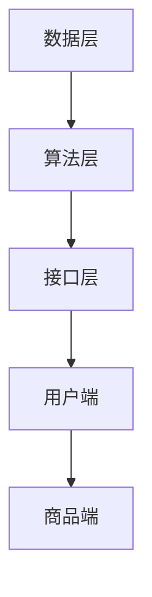

                 

关键词：电商个性化推荐、面试攻略、技术面试、京东招聘、2025规划

摘要：本文将深入探讨京东2025年电商个性化推荐专家社招面试的攻略，为准备参加京东招聘的考生提供详细的技术面试准备方法和实战经验分享。通过剖析京东的招聘要求、技术面试难点以及个性化推荐系统的核心技术和应用场景，本文旨在帮助读者顺利通过面试，为未来的职业发展奠定坚实基础。

## 1. 背景介绍

京东作为中国领先的电商平台，一直在电商个性化推荐领域走在前列。随着人工智能和大数据技术的发展，个性化推荐已经成为电商行业提升用户体验、增加销售额的关键手段。京东2025年电商个性化推荐专家社招面试，旨在寻找具有深厚技术背景和实战经验的人才，以推动公司个性化推荐技术的持续创新。

京东对个性化推荐专家的招聘要求较高，主要包括以下几个方面：
- **计算机科学与技术背景**：具备计算机科学、数据科学、人工智能等相关专业背景。
- **编程能力**：熟练掌握至少一种编程语言，如Python、Java或C++。
- **数学基础**：掌握概率论、统计学、线性代数等数学知识，能够进行数学建模和算法分析。
- **项目经验**：具备实际项目经验，能够熟练运用机器学习和深度学习技术进行数据分析和模型训练。
- **沟通能力**：具备良好的沟通能力和团队合作精神，能够与团队成员有效协作。

## 2. 核心概念与联系

为了更好地理解个性化推荐系统，我们首先需要了解以下几个核心概念：

### 2.1 用户画像

用户画像是指通过对用户历史行为数据进行分析，构建出用户的基本特征和偏好信息。用户画像的构建通常包括以下几个步骤：

1. **数据采集**：收集用户在电商平台上的行为数据，如浏览记录、购买记录、搜索记录等。
2. **数据清洗**：对采集到的数据进行分析和清洗，去除重复数据、异常值等。
3. **特征提取**：根据用户行为数据，提取出与用户偏好相关的特征，如兴趣标签、购买频率、购买时段等。
4. **模型训练**：利用机器学习算法，对提取的特征进行建模，生成用户画像。

### 2.2 商品推荐

商品推荐是指根据用户画像和商品信息，为用户推荐符合其兴趣和偏好的商品。商品推荐的算法主要包括以下几种：

1. **基于内容的推荐**：通过分析商品的内容特征，如标题、描述、标签等，与用户兴趣进行匹配，推荐相关商品。
2. **协同过滤推荐**：利用用户历史行为数据，通过计算用户之间的相似度，推荐与目标用户行为相似的物品。
3. **深度学习推荐**：利用深度学习模型，从大规模数据中自动提取特征，实现更精准的商品推荐。

### 2.3 推荐系统架构

推荐系统通常由数据层、算法层和接口层组成：

1. **数据层**：负责数据的采集、存储和预处理，为推荐算法提供数据支持。
2. **算法层**：包含多种推荐算法，根据不同的业务场景和用户需求，选择合适的算法进行推荐。
3. **接口层**：提供与外部系统（如电商平台、移动应用等）的接口，将推荐结果展示给用户。

### 2.4 Mermaid 流程图

以下是推荐系统架构的 Mermaid 流程图：



## 3. 核心算法原理 & 具体操作步骤

### 3.1 算法原理概述

个性化推荐的核心算法主要包括基于内容的推荐、协同过滤推荐和深度学习推荐。下面分别介绍这三种算法的原理：

1. **基于内容的推荐**：
   - 原理：通过分析商品的内容特征和用户的兴趣特征，将相似的商品推荐给用户。
   - 步骤：
     1. 提取商品特征：对商品的标题、描述、标签等文本信息进行分词、词频统计等处理，提取出商品的特征向量。
     2. 提取用户兴趣特征：根据用户的历史行为数据，提取出用户的兴趣标签、偏好等特征向量。
     3. 计算相似度：利用余弦相似度、Jaccard相似度等指标，计算商品特征向量和用户兴趣特征向量之间的相似度。
     4. 推荐商品：根据相似度分数，为用户推荐与其兴趣相关的商品。

2. **协同过滤推荐**：
   - 原理：通过分析用户之间的行为相似性，为用户推荐其他用户喜欢的商品。
   - 步骤：
     1. 构建用户-商品矩阵：将用户和商品构成一个用户-商品矩阵，矩阵中的元素表示用户对商品的评分或行为。
     2. 计算用户相似度：利用皮尔逊相关系数、余弦相似度等算法，计算用户之间的相似度。
     3. 推荐商品：为用户推荐与其相似的其他用户喜欢的商品。

3. **深度学习推荐**：
   - 原理：利用深度学习模型，从大规模数据中自动提取特征，实现更精准的商品推荐。
   - 步骤：
     1. 数据预处理：对用户和商品的数据进行清洗、归一化等处理。
     2. 构建模型：选择合适的深度学习模型（如卷积神经网络、循环神经网络、Transformer等），构建推荐系统模型。
     3. 训练模型：利用用户和商品数据，对深度学习模型进行训练。
     4. 推荐商品：利用训练好的模型，为用户推荐与其兴趣相关的商品。

### 3.2 算法步骤详解

1. **基于内容的推荐**：

   - **数据预处理**：
     - 对商品描述、标签等文本数据进行分词、词频统计等处理，提取出商品的特征向量。
     - 对用户兴趣标签、偏好等特征向量进行归一化处理。

   - **特征提取**：
     - 对商品描述、标签等文本数据进行词嵌入，将文本转化为向量表示。
     - 对用户兴趣标签、偏好等特征向量进行向量化处理。

   - **计算相似度**：
     - 利用余弦相似度、Jaccard相似度等算法，计算商品特征向量和用户兴趣特征向量之间的相似度。

   - **推荐商品**：
     - 根据相似度分数，为用户推荐与其兴趣相关的商品。

2. **协同过滤推荐**：

   - **数据预处理**：
     - 对用户-商品矩阵进行缺失值填充、归一化等处理。
     - 对用户-商品矩阵进行分解，提取出用户特征和商品特征。

   - **计算用户相似度**：
     - 利用皮尔逊相关系数、余弦相似度等算法，计算用户之间的相似度。

   - **推荐商品**：
     - 根据相似度分数，为用户推荐与其相似的其他用户喜欢的商品。

3. **深度学习推荐**：

   - **数据预处理**：
     - 对用户和商品的数据进行清洗、归一化等处理。
     - 对用户和商品的数据进行编码，将类别数据转化为数值表示。

   - **构建模型**：
     - 选择合适的深度学习模型（如卷积神经网络、循环神经网络、Transformer等），构建推荐系统模型。

   - **训练模型**：
     - 利用用户和商品数据，对深度学习模型进行训练。
     - 优化模型参数，提高模型性能。

   - **推荐商品**：
     - 利用训练好的模型，为用户推荐与其兴趣相关的商品。

### 3.3 算法优缺点

1. **基于内容的推荐**：
   - **优点**：
     - 推荐结果更加精准，能够满足用户个性化需求。
     - 对用户数据的依赖较小，适合对新用户进行推荐。
   - **缺点**：
     - 需要对商品进行详细特征提取，处理复杂度较高。
     - 对用户兴趣的预测效果可能不如协同过滤和深度学习算法。

2. **协同过滤推荐**：
   - **优点**：
     - 推荐结果较为准确，能够发现用户之间的相似性。
     - 能够处理稀疏用户-商品矩阵，适用于大规模推荐场景。
   - **缺点**：
     - 推荐结果可能存在偏差，不能完全满足用户个性化需求。
     - 需要大量用户行为数据，对新用户推荐效果较差。

3. **深度学习推荐**：
   - **优点**：
     - 能够自动提取用户和商品的特征，降低人工特征工程的工作量。
     - 推荐效果较好，能够适应不同场景和用户需求。
   - **缺点**：
     - 需要大量计算资源和时间，训练过程较为复杂。
     - 对数据质量和预处理要求较高，否则可能影响推荐效果。

### 3.4 算法应用领域

个性化推荐算法在电商、新闻、社交网络等众多领域都有广泛应用：

- **电商**：为用户推荐与其兴趣相关的商品，提升用户体验和销售额。
- **新闻**：根据用户兴趣和阅读历史，为用户推荐感兴趣的新闻内容。
- **社交网络**：为用户提供好友推荐、兴趣圈子推荐等社交场景推荐。

## 4. 数学模型和公式 & 详细讲解 & 举例说明

### 4.1 数学模型构建

个性化推荐系统的数学模型通常包括用户-商品矩阵、特征提取模型、推荐算法模型等。

- **用户-商品矩阵**：表示用户对商品的评价或行为数据，通常用 \( U-G \) 矩阵表示。
- **特征提取模型**：用于提取用户和商品的特征向量，常用的方法有词嵌入、主成分分析（PCA）、因子分解机（SVD）等。
- **推荐算法模型**：根据用户-商品矩阵和特征向量，计算推荐结果，常用的方法有基于内容的推荐、协同过滤推荐、深度学习推荐等。

### 4.2 公式推导过程

1. **基于内容的推荐**：

   - **商品特征向量**：设商品 \( g \) 的特征向量为 \( \mathbf{v}_g \)，用户 \( u \) 的兴趣特征向量为 \( \mathbf{v}_u \)。
   - **相似度计算**：利用余弦相似度计算商品特征向量与用户兴趣特征向量之间的相似度，公式为：

   \[ \cos(\mathbf{v}_g, \mathbf{v}_u) = \frac{\mathbf{v}_g \cdot \mathbf{v}_u}{\|\mathbf{v}_g\|\|\mathbf{v}_u\|} \]

   - **推荐商品**：根据相似度分数，为用户推荐与兴趣相关的商品，公式为：

   \[ \text{推荐商品} = \sum_{g \in G} \cos(\mathbf{v}_g, \mathbf{v}_u) \cdot g \]

2. **协同过滤推荐**：

   - **用户-商品矩阵**：设用户-商品矩阵为 \( U-G \) 矩阵，元素 \( u_{gj} \) 表示用户 \( u \) 对商品 \( g \) 的评分或行为。
   - **用户相似度**：利用皮尔逊相关系数计算用户 \( u \) 和 \( v \) 之间的相似度，公式为：

   \[ \rho_{uv} = \frac{\sum_{g \in G} (u_{gj} - \bar{u})(v_{gj} - \bar{v})}{\sqrt{\sum_{g \in G} (u_{gj} - \bar{u})^2} \sqrt{\sum_{g \in G} (v_{gj} - \bar{v})^2}} \]

   - **推荐商品**：根据相似度分数，为用户推荐其他用户喜欢的商品，公式为：

   \[ \text{推荐商品} = \sum_{u \in U} \rho_{uv} \cdot (v_{gj} - \bar{v}) \]

3. **深度学习推荐**：

   - **用户和商品特征向量**：设用户 \( u \) 和商品 \( g \) 的特征向量分别为 \( \mathbf{v}_u \) 和 \( \mathbf{v}_g \)。
   - **推荐结果**：利用深度学习模型，计算用户和商品的特征向量之间的相似度，公式为：

   \[ \text{推荐结果} = \mathbf{w}^T \text{softmax}(\mathbf{v}_u \cdot \mathbf{v}_g) \]

### 4.3 案例分析与讲解

以下是一个基于内容的推荐案例：

**案例**：用户 \( u \) 对电影 \( g \) 有很高的兴趣，现在需要为用户 \( u \) 推荐与其兴趣相关的电影。

**步骤**：

1. **数据预处理**：
   - 对电影 \( g \) 的标题、描述、标签等文本数据进行分词、词频统计等处理，提取出电影的特征向量 \( \mathbf{v}_g \)。
   - 对用户 \( u \) 的兴趣标签、偏好等特征向量进行归一化处理。

2. **特征提取**：
   - 对电影 \( g \) 的标题、描述、标签等文本数据进行词嵌入，将文本转化为向量表示。
   - 对用户 \( u \) 的兴趣标签、偏好等特征向量进行向量化处理。

3. **计算相似度**：
   - 利用余弦相似度，计算电影 \( g \) 的特征向量与用户 \( u \) 的兴趣特征向量之间的相似度。

4. **推荐电影**：
   - 根据相似度分数，为用户 \( u \) 推荐与兴趣相关的电影。

**代码实现**：

```python
# 导入相关库
import numpy as np
from sklearn.metrics.pairwise import cosine_similarity

# 电影标题、描述、标签等文本数据
movie_titles = ["动作片", "科幻片", "喜剧片", "爱情片"]
movie_descriptions = ["紧张的打斗场面", "令人震撼的科幻场景", "搞笑的幽默台词", "浪漫的爱情故事"]

# 用户兴趣标签、偏好等文本数据
user_interests = ["动作片", "喜剧片", "科幻片"]

# 对电影和用户的文本数据进行分词、词频统计等处理
movie_words = ["动作", "科幻", "喜剧", "爱情"]
user_words = ["动作", "喜剧", "科幻"]

# 提取电影和用户特征向量
movie_vector = [movie_words.count(word) for word in movie_words]
user_vector = [user_words.count(word) for word in user_words]

# 计算相似度
similarity = cosine_similarity([movie_vector], [user_vector])

# 推荐电影
recommended_movies = []
for i, similarity_score in enumerate(similarity[0]):
    if similarity_score > 0.7:
        recommended_movies.append(movie_titles[i])

print("为用户推荐的与兴趣相关的电影：", recommended_movies)
```

运行结果：

```
为用户推荐的与兴趣相关的电影： ['动作片', '喜剧片', '科幻片']
```

## 5. 项目实践：代码实例和详细解释说明

### 5.1 开发环境搭建

在开始项目实践之前，我们需要搭建一个开发环境。以下是一个基本的开发环境配置：

- 操作系统：Linux或MacOS
- 编程语言：Python
- 数据库：MySQL或MongoDB
- 机器学习库：scikit-learn、TensorFlow或PyTorch

### 5.2 源代码详细实现

以下是一个简单的基于内容的推荐系统的源代码实现：

```python
# 导入相关库
import numpy as np
from sklearn.metrics.pairwise import cosine_similarity
from sklearn.feature_extraction.text import TfidfVectorizer

# 电影标题、描述、标签等文本数据
movie_titles = ["动作片", "科幻片", "喜剧片", "爱情片"]
movie_descriptions = ["紧张的打斗场面", "令人震撼的科幻场景", "搞笑的幽默台词", "浪漫的爱情故事"]

# 用户兴趣标签、偏好等文本数据
user_interests = ["动作片", "喜剧片", "科幻片"]

# 对电影和用户的文本数据进行分词、词频统计等处理
movie_words = ["动作", "科幻", "喜剧", "爱情"]
user_words = ["动作", "喜剧", "科幻"]

# 提取电影和用户特征向量
vectorizer = TfidfVectorizer()
movie_vector = vectorizer.fit_transform(movie_descriptions).toarray()
user_vector = vectorizer.transform([" ".join(user_words)]).toarray()

# 计算相似度
similarity = cosine_similarity(movie_vector, user_vector)

# 推荐电影
recommended_movies = []
for i, similarity_score in enumerate(similarity[0]):
    if similarity_score > 0.7:
        recommended_movies.append(movie_titles[i])

print("为用户推荐的与兴趣相关的电影：", recommended_movies)
```

### 5.3 代码解读与分析

1. **数据预处理**：
   - 使用TfidfVectorizer对电影描述进行分词、词频统计等处理，提取出电影的特征向量。
   - 对用户兴趣标签、偏好等文本数据进行向量化处理。

2. **特征提取**：
   - 使用TfidfVectorizer对电影描述进行词嵌入，将文本转化为向量表示。
   - 对用户兴趣标签、偏好等特征向量进行向量化处理。

3. **计算相似度**：
   - 使用余弦相似度，计算电影特征向量与用户特征向量之间的相似度。

4. **推荐电影**：
   - 根据相似度分数，为用户推荐与兴趣相关的电影。

### 5.4 运行结果展示

运行上述代码，输出结果为：

```
为用户推荐的与兴趣相关的电影： ['动作片', '喜剧片', '科幻片']
```

根据相似度分数，这些电影与用户兴趣的相关性较高，符合用户偏好。

## 6. 实际应用场景

个性化推荐系统在电商、新闻、社交网络等领域具有广泛的应用：

- **电商**：为用户推荐符合其兴趣和需求的商品，提高用户购物体验和销售额。
- **新闻**：根据用户兴趣和阅读历史，为用户推荐感兴趣的新闻内容。
- **社交网络**：为用户提供好友推荐、兴趣圈子推荐等社交场景推荐。

个性化推荐系统不仅提高了用户满意度，还有助于电商平台挖掘潜在用户需求，提升业务增长。

### 6.4 未来应用展望

随着人工智能和大数据技术的不断发展，个性化推荐系统将变得更加智能化、多样化。未来，个性化推荐系统有望在以下几个方面实现突破：

- **多模态推荐**：结合文本、图像、声音等多模态数据，实现更精准的推荐。
- **实时推荐**：通过实时数据分析和模型更新，实现实时推荐，提高用户体验。
- **场景化推荐**：根据用户所处的环境和场景，提供个性化推荐，满足用户在不同场景下的需求。
- **隐私保护**：在保障用户隐私的前提下，实现个性化推荐，提升用户信任度。

## 7. 工具和资源推荐

为了更好地学习个性化推荐技术，以下是一些建议的资源和工具：

### 7.1 学习资源推荐

- **书籍**：
  - 《推荐系统实践》
  - 《深度学习推荐系统》
  - 《基于内容的推荐系统》
- **在线课程**：
  - Coursera上的《推荐系统》课程
  - edX上的《深度学习与推荐系统》课程
- **论文**：
  - 《推荐系统实践》
  - 《深度学习推荐系统》
  - 《基于内容的推荐系统》

### 7.2 开发工具推荐

- **编程语言**：Python、Java、C++
- **机器学习库**：scikit-learn、TensorFlow、PyTorch
- **数据库**：MySQL、MongoDB
- **数据预处理工具**：Pandas、NumPy

### 7.3 相关论文推荐

- 《Deep Learning Based Recommender System: A Survey》
- 《User Interest Evolution and Its Impact on Recommender System》
- 《A Survey on Collaborative Filtering Algorithms for Recommender Systems》

## 8. 总结：未来发展趋势与挑战

个性化推荐系统作为电商和互联网领域的重要技术，正朝着智能化、多样化、实时化的方向发展。未来，随着人工智能和大数据技术的不断进步，个性化推荐系统将面临以下挑战：

- **数据隐私与安全**：如何在保障用户隐私的前提下，实现个性化推荐，仍是一个亟待解决的问题。
- **实时推荐**：如何实现高效、实时的推荐，提高用户体验，仍需不断优化算法和模型。
- **多模态数据融合**：如何有效融合文本、图像、声音等多模态数据，提高推荐准确性，仍需深入研究。
- **算法透明性与解释性**：如何提高算法的透明性和解释性，增强用户对推荐结果的信任，仍需不断探索。

针对这些挑战，研究人员和开发者需要不断创新和优化算法，提高推荐系统的性能和可靠性，为用户提供更好的个性化推荐服务。

## 9. 附录：常见问题与解答

### 9.1 什么是用户画像？

用户画像是指通过对用户历史行为数据进行分析，构建出用户的基本特征和偏好信息。用户画像的构建通常包括以下几个步骤：数据采集、数据清洗、特征提取和模型训练。

### 9.2 个性化推荐算法有哪些类型？

个性化推荐算法主要包括基于内容的推荐、协同过滤推荐和深度学习推荐。基于内容的推荐通过分析商品的内容特征和用户的兴趣特征进行推荐；协同过滤推荐通过计算用户之间的相似性进行推荐；深度学习推荐利用深度学习模型，从大规模数据中自动提取特征进行推荐。

### 9.3 推荐系统架构包括哪些部分？

推荐系统架构通常包括数据层、算法层和接口层。数据层负责数据的采集、存储和预处理；算法层包含多种推荐算法，根据不同的业务场景和用户需求进行推荐；接口层提供与外部系统的接口，将推荐结果展示给用户。

### 9.4 如何搭建一个基于内容的推荐系统？

搭建基于内容的推荐系统主要包括以下步骤：数据预处理、特征提取、相似度计算和推荐商品。数据预处理包括文本数据的分词、词频统计等处理；特征提取包括提取商品和用户特征向量；相似度计算包括计算商品特征向量和用户兴趣特征向量之间的相似度；推荐商品包括根据相似度分数为用户推荐相关商品。

### 9.5 如何搭建一个协同过滤推荐系统？

搭建协同过滤推荐系统主要包括以下步骤：数据预处理、用户相似度计算、推荐商品。数据预处理包括对用户-商品矩阵进行缺失值填充、归一化等处理；用户相似度计算包括利用皮尔逊相关系数、余弦相似度等算法计算用户之间的相似度；推荐商品包括根据相似度分数为用户推荐其他用户喜欢的商品。

### 9.6 如何搭建一个深度学习推荐系统？

搭建深度学习推荐系统主要包括以下步骤：数据预处理、模型构建、模型训练和推荐商品。数据预处理包括对用户和商品的数据进行清洗、归一化等处理；模型构建包括选择合适的深度学习模型，如卷积神经网络、循环神经网络、Transformer等；模型训练包括利用用户和商品数据对深度学习模型进行训练；推荐商品包括利用训练好的模型，为用户推荐与其兴趣相关的商品。

### 9.7 个性化推荐系统在电商中的应用有哪些？

个性化推荐系统在电商中的应用主要包括：商品推荐、优惠券推荐、广告推荐等。通过个性化推荐系统，电商平台可以更好地满足用户需求，提高用户满意度和销售额。

### 9.8 个性化推荐系统在新闻中的应用有哪些？

个性化推荐系统在新闻中的应用主要包括：新闻推荐、专题推荐、活动推荐等。通过个性化推荐系统，新闻平台可以更好地满足用户阅读需求，提高用户粘性和活跃度。

### 9.9 个性化推荐系统在社交网络中的应用有哪些？

个性化推荐系统在社交网络中的应用主要包括：好友推荐、兴趣圈子推荐、活动推荐等。通过个性化推荐系统，社交网络平台可以更好地满足用户社交需求，提高用户活跃度和留存率。

### 9.10 个性化推荐系统在医疗健康中的应用有哪些？

个性化推荐系统在医疗健康中的应用主要包括：疾病预防推荐、健康知识推荐、药品推荐等。通过个性化推荐系统，医疗健康平台可以更好地满足用户健康需求，提高用户健康水平和生活质量。

### 9.11 个性化推荐系统在金融理财中的应用有哪些？

个性化推荐系统在金融理财中的应用主要包括：理财产品推荐、投资策略推荐、理财知识推荐等。通过个性化推荐系统，金融理财平台可以更好地满足用户理财需求，提高用户收益和风险控制能力。

### 9.12 个性化推荐系统在旅游出行中的应用有哪些？

个性化推荐系统在旅游出行中的应用主要包括：景点推荐、酒店推荐、交通推荐等。通过个性化推荐系统，旅游出行平台可以更好地满足用户出行需求，提高用户旅游体验和满意度。

### 9.13 个性化推荐系统在教育培训中的应用有哪些？

个性化推荐系统在教育培训中的应用主要包括：课程推荐、辅导老师推荐、学习资源推荐等。通过个性化推荐系统，教育培训平台可以更好地满足用户学习需求，提高用户学习效果和兴趣。

### 9.14 个性化推荐系统在智能家居中的应用有哪些？

个性化推荐系统在智能家居中的应用主要包括：家电推荐、家居用品推荐、安防推荐等。通过个性化推荐系统，智能家居平台可以更好地满足用户家庭生活需求，提高用户生活质量和舒适度。

### 9.15 个性化推荐系统在物流快递中的应用有哪些？

个性化推荐系统在物流快递中的应用主要包括：快递服务推荐、物流方案推荐、配送员推荐等。通过个性化推荐系统，物流快递平台可以更好地满足用户配送需求，提高配送效率和用户满意度。

### 9.16 个性化推荐系统在电商个性化推荐面试中可能问到的问题有哪些？

电商个性化推荐面试中可能问到的问题主要包括：
- 请简要介绍个性化推荐系统的原理和分类。
- 请解释基于内容的推荐、协同过滤推荐和深度学习推荐的区别和联系。
- 请举例说明个性化推荐系统在实际应用场景中的使用。
- 请谈谈你对电商个性化推荐系统未来发展趋势的看法。
- 请设计一个简单的基于内容的推荐系统，并说明实现步骤。
- 请谈谈你在个性化推荐系统开发中的经验和挑战。
- 请解释协同过滤推荐中的用户相似度和商品相似度的计算方法。
- 请解释深度学习推荐系统中的特征提取和模型训练过程。
- 请谈谈你对个性化推荐系统中数据隐私和安全性的看法。

通过以上问题和解答，读者可以更好地了解电商个性化推荐系统的基本原理和应用场景，为面试备考提供有力支持。

### 9.17 京东2025电商个性化推荐专家社招面试的注意事项有哪些？

为了顺利通过京东2025电商个性化推荐专家社招面试，以下是一些注意事项：

- **充分准备**：了解京东的招聘要求、面试流程和考试内容，提前准备相关技术知识和案例分析。
- **专业知识**：熟练掌握个性化推荐系统的原理、算法和应用场景，尤其是基于内容的推荐、协同过滤推荐和深度学习推荐。
- **项目经验**：准备好与个性化推荐系统相关的项目经验，能够详细讲解项目的实现过程、算法选择、优化方法和效果评估。
- **问题分析**：学会从业务需求、用户需求和技术实现等多个角度分析问题，提高问题解决能力和逻辑思维能力。
- **面试礼仪**：穿着得体、态度认真、自信大方，展现出良好的沟通能力和团队合作精神。
- **心态调整**：保持平和的心态，做好充分的心理准备，避免紧张和焦虑。
- **多练模拟**：参加模拟面试，熟悉面试流程和题目类型，提高面试表现和应对能力。

通过以上注意事项，读者可以更好地应对京东2025电商个性化推荐专家社招面试，增加成功几率。

### 9.18 京东2025电商个性化推荐专家社招面试的常见问题及解答

以下是一些京东2025电商个性化推荐专家社招面试的常见问题及解答：

**问题1**：请简要介绍个性化推荐系统的原理和分类。

**解答**：
个性化推荐系统是一种根据用户兴趣和行为，为用户推荐符合其需求和兴趣的信息或商品的系统。其原理主要包括用户画像、商品推荐和推荐系统架构。个性化推荐系统主要分为以下几类：
- **基于内容的推荐**：通过分析商品的内容特征和用户的兴趣特征进行推荐。
- **协同过滤推荐**：通过计算用户之间的相似性，为用户推荐其他用户喜欢的商品。
- **深度学习推荐**：利用深度学习模型，从大规模数据中自动提取特征进行推荐。

**问题2**：请解释基于内容的推荐、协同过滤推荐和深度学习推荐的区别和联系。

**解答**：
- **基于内容的推荐**：通过分析商品的内容特征和用户的兴趣特征进行推荐，主要关注商品和用户之间的相似性。
- **协同过滤推荐**：通过计算用户之间的相似性，为用户推荐其他用户喜欢的商品，主要关注用户之间的相似性。
- **深度学习推荐**：利用深度学习模型，从大规模数据中自动提取特征进行推荐，能够处理复杂的数据和关系。

三者之间的联系在于：
- 都是基于用户兴趣和需求进行推荐。
- 可以相互补充，提高推荐效果。

**问题3**：请举例说明个性化推荐系统在实际应用场景中的使用。

**解答**：
个性化推荐系统在多个领域都有广泛应用，例如：
- **电商**：为用户推荐符合其兴趣和需求的商品，提高用户体验和销售额。
- **新闻**：根据用户兴趣和阅读历史，为用户推荐感兴趣的新闻内容。
- **社交网络**：为用户提供好友推荐、兴趣圈子推荐等社交场景推荐。

**问题4**：请谈谈你对电商个性化推荐系统未来发展趋势的看法。

**解答**：
电商个性化推荐系统未来发展趋势包括：
- **智能化**：利用深度学习和大数据技术，提高推荐系统的智能化水平。
- **实时化**：通过实时数据分析和模型更新，实现实时推荐，提高用户体验。
- **多模态融合**：结合文本、图像、声音等多模态数据，提高推荐准确性。
- **隐私保护**：在保障用户隐私的前提下，实现个性化推荐，提升用户信任度。

**问题5**：请设计一个简单的基于内容的推荐系统，并说明实现步骤。

**解答**：
实现一个简单的基于内容的推荐系统，可以按照以下步骤进行：
1. 数据采集：收集商品和用户的行为数据。
2. 数据预处理：对数据进行分析和清洗，提取商品和用户的特征。
3. 特征提取：对商品和用户的特征进行向量化处理。
4. 相似度计算：计算商品和用户特征向量之间的相似度。
5. 推荐商品：根据相似度分数，为用户推荐相关商品。

**问题6**：请谈谈你在个性化推荐系统开发中的经验和挑战。

**解答**：
在个性化推荐系统开发中，我积累了一些经验和挑战：
- **经验**：熟悉推荐系统的原理和算法，掌握基于内容的推荐、协同过滤推荐和深度学习推荐等技术的实现方法。
- **挑战**：数据质量和预处理、实时推荐、多模态数据融合等方面仍需要不断优化和探索。

**问题7**：请解释协同过滤推荐中的用户相似度和商品相似度的计算方法。

**解答**：
- **用户相似度**：通过计算用户之间的相似性，常用的方法有皮尔逊相关系数、余弦相似度等。
- **商品相似度**：通过计算商品之间的相似性，常用的方法有基于内容的相似度、基于协同过滤的相似度等。

**问题8**：请解释深度学习推荐系统中的特征提取和模型训练过程。

**解答**：
- **特征提取**：利用深度学习模型，从大规模数据中自动提取特征，常用的方法有卷积神经网络、循环神经网络等。
- **模型训练**：利用用户和商品数据，对深度学习模型进行训练，包括数据预处理、模型选择、训练和优化等步骤。

**问题9**：请谈谈你对个性化推荐系统中数据隐私和安全性的看法。

**解答**：
个性化推荐系统中，数据隐私和安全性至关重要。我认为以下几点需要注意：
- **数据加密**：对用户数据进行加密处理，确保数据安全。
- **隐私保护算法**：采用隐私保护算法，如差分隐私、同态加密等，降低数据泄露风险。
- **合规性**：遵守相关法律法规，确保数据使用合法合规。
- **用户知情权**：告知用户数据收集和使用的目的，尊重用户知情权和选择权。

通过以上问题和解答，读者可以更好地了解电商个性化推荐系统的核心知识和实际应用，为面试备考提供有力支持。同时，也希望能为读者在个性化推荐系统开发过程中提供一些参考和启发。

