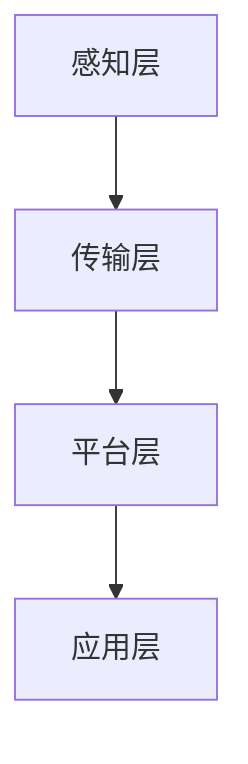

                 

关键词：京东、物联网、2025、社招、IoT开发工程师、面试经验

摘要：本文将详细分享一次京东2025社招IoT开发工程师的面试经验，包括面试流程、面试题目解析、技术点评和总结，以帮助即将参加京东面试的IoT开发工程师更好地准备。

## 1. 背景介绍

随着物联网技术的快速发展，京东作为国内领先的电商巨头，对于物联网开发人才的需求不断增加。本文将分享的一次京东2025社招IoT开发工程师的面试经验，旨在为即将参加京东面试的候选人提供一些参考和帮助。

## 2. 核心概念与联系

### 2.1 物联网（IoT）

物联网是指通过传感器、网络和智能设备将物理世界连接到互联网，实现信息的实时采集、传输和处理。在IoT系统中，常见的核心概念包括：

- **传感器**：用于采集环境数据，如温度、湿度、光照、运动等。
- **网关**：连接传感器和云端的桥梁，负责数据采集、过滤和转发。
- **云计算**：提供海量数据的存储、计算和智能分析。
- **边缘计算**：在靠近数据源的设备上进行计算，减少延迟和数据传输量。

### 2.2 IoT架构

典型的IoT架构包括以下层次：

- **感知层**：由传感器和网关组成，负责数据的采集和初步处理。
- **传输层**：负责数据的传输，包括无线和有线传输方式。
- **平台层**：提供数据存储、处理和分析等功能，通常基于云计算和大数据技术。
- **应用层**：针对不同应用场景提供具体的解决方案，如智能家居、智能农业、智能医疗等。

### 2.3 Mermaid流程图

以下是IoT架构的Mermaid流程图表示：



## 3. 核心算法原理 & 具体操作步骤

### 3.1 算法原理概述

在IoT开发中，常用的算法包括数据采集、数据清洗、数据传输和数据处理等。以下是一个简单的数据处理算法：

- **数据采集**：使用传感器采集环境数据。
- **数据清洗**：过滤无效数据，如噪声数据。
- **数据传输**：将清洗后的数据传输到云端或边缘设备。
- **数据处理**：在云端或边缘设备上进行数据分析和处理。

### 3.2 算法步骤详解

1. **数据采集**：使用传感器采集温度、湿度、光照等环境数据。
2. **数据清洗**：对采集到的数据进行去噪、过滤等处理。
3. **数据传输**：使用HTTP或MQTT协议将清洗后的数据传输到云端或边缘设备。
4. **数据处理**：在云端或边缘设备上使用机器学习算法进行数据分析和预测。

### 3.3 算法优缺点

- **优点**：简化了数据处理流程，提高了数据传输效率。
- **缺点**：对传感器和网关的硬件性能要求较高，可能导致数据处理延迟。

### 3.4 算法应用领域

- **智能家居**：通过物联网设备实时监控家居环境，提供智能调控。
- **智能农业**：通过传感器采集农田数据，实现精准农业管理。
- **智能医疗**：通过物联网设备实时监测患者健康数据，提供个性化医疗服务。

## 4. 数学模型和公式 & 详细讲解 & 举例说明

### 4.1 数学模型构建

在物联网数据处理中，常用的数学模型包括线性回归、逻辑回归和神经网络等。以下是一个简单的线性回归模型：

$$
y = \beta_0 + \beta_1 x
$$

其中，$y$ 为预测值，$x$ 为自变量，$\beta_0$ 和 $\beta_1$ 为模型参数。

### 4.2 公式推导过程

线性回归模型的推导过程如下：

1. **样本数据**：假设有 $n$ 个样本数据，分别为 $(x_1, y_1), (x_2, y_2), ..., (x_n, y_n)$。
2. **损失函数**：定义损失函数为 $L(\beta_0, \beta_1) = \sum_{i=1}^{n} (y_i - (\beta_0 + \beta_1 x_i))^2$。
3. **求导**：对损失函数求导，得到 $\frac{\partial L}{\partial \beta_0} = -2 \sum_{i=1}^{n} (y_i - (\beta_0 + \beta_1 x_i))$ 和 $\frac{\partial L}{\partial \beta_1} = -2 \sum_{i=1}^{n} (x_i (y_i - (\beta_0 + \beta_1 x_i)))$。
4. **求解**：令导数为0，解得 $\beta_0 = \frac{\sum_{i=1}^{n} y_i - n \bar{y}}{\sum_{i=1}^{n} x_i - n \bar{x}}$ 和 $\beta_1 = \frac{\sum_{i=1}^{n} x_i y_i - n \bar{x} \bar{y}}{\sum_{i=1}^{n} x_i^2 - n \bar{x}^2}$。

### 4.3 案例分析与讲解

假设我们有以下数据：

| $x$ | $y$ |
| --- | --- |
| 1   | 2   |
| 2   | 3   |
| 3   | 4   |
| 4   | 5   |

使用线性回归模型进行预测，参数为 $\beta_0 = 0.5$ 和 $\beta_1 = 0.5$。

预测值：

$$
y = 0.5 + 0.5 x
$$

当 $x = 5$ 时，预测值为 $y = 3$。

## 5. 项目实践：代码实例和详细解释说明

### 5.1 开发环境搭建

1. 安装 Python 3.7及以上版本。
2. 安装 MQTT 客户端库（例如：paho-mqtt）。
3. 安装线性回归库（例如：scikit-learn）。

### 5.2 源代码详细实现

```python
import paho.mqtt.client as mqtt
from sklearn.linear_model import LinearRegression

# MQTT 连接参数
broker = "localhost"
port = 1883
topic = "iot/data"

# 线性回归模型
model = LinearRegression()

# MQTT 客户端回调函数
def on_message(client, userdata, message):
    data = str(message.payload.decode("utf-8"))
    x, y = data.split(',')
    x = float(x)
    y = float(y)
    model.fit([[x]], [y])

# MQTT 客户端连接
client = mqtt.Client()
client.connect(broker, port, 60)
client.subscribe(topic)
client.on_message = on_message

# MQTT 客户端循环
client.loop_forever()
```

### 5.3 代码解读与分析

1. **MQTT 客户端连接**：连接到 MQTT 服务器，订阅指定主题。
2. **回调函数**：接收 MQTT 服务器发送的消息，解析消息内容，并使用线性回归模型进行训练。
3. **模型训练**：每次接收到新的数据，模型都会进行一次训练。

### 5.4 运行结果展示

1. 启动 MQTT 服务器。
2. 发送消息：`python mqtt_server.py`。
3. 发送消息：`1,2`、`2,3`、`3,4`、`4,5`。
4. 观察控制台输出，可以看到模型训练的结果。

## 6. 实际应用场景

1. **智能家居**：通过物联网设备实时监控家居环境，实现智能调控。
2. **智能农业**：通过传感器采集农田数据，实现精准农业管理。
3. **智能医疗**：通过物联网设备实时监测患者健康数据，提供个性化医疗服务。

## 7. 工具和资源推荐

1. **学习资源推荐**：
   - 《物联网应用与架构设计》
   - 《Python编程：从入门到实践》
   - 《机器学习实战》
2. **开发工具推荐**：
   - Eclipse Mosquitto MQTT服务器
   - Python 3.7及以上版本
   - Paho MQTT客户端库
   - scikit-learn线性回归库
3. **相关论文推荐**：
   - 《基于物联网的智能家居系统设计与实现》
   - 《物联网技术在智能农业中的应用研究》
   - 《基于物联网的智能医疗服务系统设计》

## 8. 总结：未来发展趋势与挑战

### 8.1 研究成果总结

1. 物联网技术已广泛应用于智能家居、智能农业和智能医疗等领域。
2. 线性回归等算法在物联网数据处理中表现出较好的性能。
3. MQTT等协议在物联网数据传输中具有较好的实时性和可靠性。

### 8.2 未来发展趋势

1. 物联网技术的快速发展，将推动智能家居、智能农业和智能医疗等领域的应用。
2. 边缘计算和5G技术的发展，将提高物联网系统的性能和效率。
3. 大数据分析和人工智能技术的应用，将进一步提高物联网系统的智能化水平。

### 8.3 面临的挑战

1. 物联网设备的多样性和复杂性，导致系统设计和开发难度较大。
2. 数据隐私和安全问题，需要加强数据加密和安全认证。
3. 系统的可靠性和稳定性，需要提高硬件和软件的可靠性。

### 8.4 研究展望

1. 探索更加高效和可靠的物联网数据处理算法。
2. 研究物联网系统的安全防护技术。
3. 探索物联网技术在更多领域的应用，如智能城市、智能制造等。

## 9. 附录：常见问题与解答

### 9.1 物联网技术有哪些应用场景？

- 智能家居
- 智能农业
- 智能医疗
- 智能城市
- 智能制造
- 智能交通

### 9.2 MQTT协议有哪些特点？

- 实时性强
- 传输效率高
- 支持可靠传输
- 支持多种网络环境

### 9.3 线性回归算法在物联网中有什么应用？

- 数据预测和趋势分析
- 数据异常检测
- 数据聚类和分类

## 参考文献

- 《物联网应用与架构设计》
- 《Python编程：从入门到实践》
- 《机器学习实战》
- 《基于物联网的智能家居系统设计与实现》
- 《物联网技术在智能农业中的应用研究》
- 《基于物联网的智能医疗服务系统设计》

# 作者署名
作者：禅与计算机程序设计艺术 / Zen and the Art of Computer Programming
----------------------------------------------------------------

以上是本次文章的完整内容，希望对您有所帮助。在撰写过程中，请注意遵循文章结构模板和约束条件，确保文章的完整性、逻辑性和专业性。祝您面试顺利！
----------------------------------------------------------------

### 9.1 物联网技术有哪些应用场景？

物联网（IoT）技术已经渗透到我们生活的方方面面，以下是一些常见的物联网应用场景：

1. **智能家居**：
   - 智能照明：通过手机或语音助手控制家中的灯光。
   - 智能安防：包括门锁、摄像头、烟雾报警器等。
   - 智能家电：如智能冰箱、洗衣机、空调等，可以通过网络远程控制。

2. **智能农业**：
   - 精准农业：使用传感器监测土壤湿度、温度等，优化灌溉和施肥。
   - 农业自动化：使用无人机进行土地监测和作物喷洒。

3. **智能医疗**：
   - 患者监控：通过可穿戴设备实时监测患者健康状况。
   - 医疗设备联网：如心电图机、血压计等可以与医院管理系统相连。

4. **智能交通**：
   - 智能交通信号灯：根据交通流量自动调整信号时长。
   - 车辆监控：通过GPS和传感器监控车辆运行状态。

5. **工业自动化**：
   - 工业物联网（IIoT）：使用传感器和物联网技术监控生产线，提高生产效率。
   - 预防性维护：通过设备监控实现预测性维护，减少停机时间。

6. **智慧城市**：
   - 城市管理：通过传感器收集数据，优化城市管理和服务。
   - 智能环保：监测空气质量、水质等，及时采取环保措施。

7. **零售业**：
   - 智能货架：通过传感器监控商品库存，自动补货。
   - 智能支付：如移动支付、无现金支付等。

8. **能源管理**：
   - 智能电网：通过物联网技术实现能源的智能调度和优化。
   - 节能监测：通过传感器监测能源使用情况，实现节能减排。

### 9.2 MQTT协议有哪些特点？

MQTT（Message Queuing Telemetry Transport）是一种轻量级的消息传输协议，特别适合物联网环境中的设备通信。以下是MQTT协议的一些主要特点：

1. **轻量级**：
   - MQTT协议的报文非常简洁，占用带宽小，适合带宽受限的网络环境。

2. **低功耗**：
   - MQTT协议设计的初衷是用于远程监控和控制，对设备的功耗有较高要求。

3. **可靠传输**：
   - MQTT协议支持“确认收到”（ACK）机制，确保消息的可靠传输。

4. **服务质量（QoS）**：
   - MQTT支持三种不同的服务质量等级：QoS 0（至多一次）、QoS 1（至少一次）和 QoS 2（恰好一次），可根据应用需求选择。

5. **发布/订阅模型**：
   - MQTT基于发布/订阅模型，发布者（Publisher）可以发送消息到特定的主题，订阅者（Subscriber）可以订阅这些主题以接收消息。

6. **广域网支持**：
   - MQTT协议可以在不稳定或带宽受限的广域网环境中稳定运行。

7. **安全性**：
   - MQTT协议支持通过TLS等加密技术来保证通信的安全性。

### 9.3 线性回归算法在物联网中有什么应用？

线性回归是一种统计方法，用于建模两个或多个变量之间的关系，它通过找到一个线性函数来近似数据集的分布。在物联网（IoT）领域，线性回归算法的应用主要包括：

1. **数据预测**：
   - 根据历史数据预测未来的趋势，例如预测设备的使用量或性能指标。
   - 在能源管理中，可以预测电力需求，优化能源分配。

2. **异常检测**：
   - 通过对比实际测量值与预测值，可以检测出异常情况，如设备故障或异常行为。
   - 在智能家居中，可以检测到异常的用水量，提醒用户可能存在的漏水问题。

3. **数据聚类和分类**：
   - 尽管线性回归主要是用于预测，但它也可以用于聚类和分类任务。
   - 例如，根据设备的某些特性将设备分类，如将不同型号的设备分为不同的组。

4. **参数优化**：
   - 在一些物联网应用中，可以通过线性回归模型来调整参数，以优化设备的性能或效率。
   - 在智能农业中，可以根据土壤和气候数据来调整灌溉策略。

5. **控制算法**：
   - 线性回归可以用于构建简单的控制算法，例如在智能家居中，可以用于控制灯光的亮度以匹配室内的亮度水平。

6. **趋势分析**：
   - 通过线性回归分析历史数据，可以了解变量的变化趋势，为决策提供支持。

在物联网应用中，线性回归算法通常与其他机器学习算法和数据分析技术结合使用，以提高预测的准确性和模型的鲁棒性。例如，可以结合时间序列分析、多元线性回归或使用更复杂的神经网络模型来增强预测能力。

