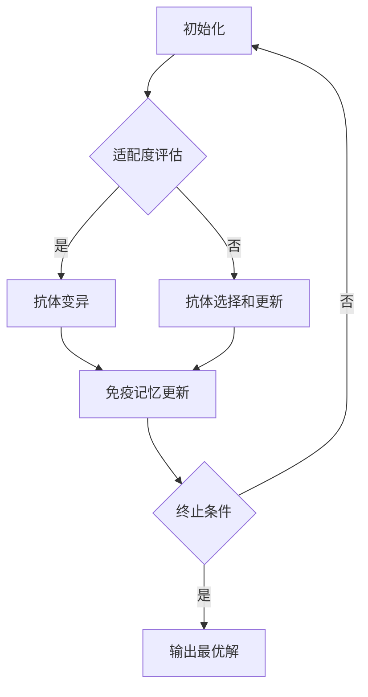

                 

关键词：人工免疫算法，免疫系统，机器学习，算法原理，应用实例，代码实现，编程

摘要：本文旨在介绍人工免疫算法的基本原理和在实际应用中的具体实现。我们将从背景介绍、核心概念、算法原理、数学模型、项目实践以及未来展望等多个角度，对人工免疫算法进行全面剖析，帮助读者理解和掌握这一重要的机器学习技术。

## 1. 背景介绍

人工免疫算法（Artificial Immune Systems, AIS）是一种受到自然界中生物免疫系统启发而发展起来的启发式搜索算法。生物免疫系统是一种复杂的生物系统，它通过一系列复杂的机制来识别和消灭入侵体内的病原体，如病毒、细菌等。这一自然现象的复杂性使得科学家们对其产生了浓厚的兴趣，并试图将其应用于人工智能领域，从而开发出能够模拟生物免疫系统的算法。

在计算机科学和人工智能领域，人工免疫算法主要用于模式识别、优化问题、组合调度和神经网络等领域。其独特的工作原理使其在处理复杂问题时表现出色，能够有效地解决传统算法难以解决的问题。

## 2. 核心概念与联系

### 2.1. 人工免疫算法的基本概念

人工免疫算法的核心概念包括抗原、抗体、免疫记忆和免疫网络等。

- **抗原**：在人工免疫算法中，抗原可以被视为需要识别和解决的问题或目标。
- **抗体**：抗体是免疫系统产生的蛋白质，用于识别和结合抗原。在人工免疫算法中，抗体则代表了解决问题的候选解。
- **免疫记忆**：免疫记忆是指免疫系统在接触过某种抗原后，能够记住这种抗原，从而在再次遇到时能够更快、更有效地应对。
- **免疫网络**：免疫网络是指抗体之间的相互作用和竞争机制，用于评估和选择最合适的抗体。

### 2.2. 人工免疫算法的工作原理

人工免疫算法的工作原理可以概括为以下几个步骤：

1. **初始化**：生成一定数量的初始抗体，这些抗体代表了解决问题的初始候选解。
2. **适配度评估**：通过评估抗体与抗原的适配度来选择最优秀的抗体。
3. **抗体变异**：为了提高抗体的适应能力，对部分抗体进行变异操作。
4. **抗体选择和更新**：根据抗体的适配度和变异结果，选择和更新抗体群体。
5. **免疫记忆更新**：更新免疫记忆，以便在后续的迭代中更快、更准确地找到最优解。
6. **终止条件**：当满足终止条件（如达到最大迭代次数或找到满意解）时，算法终止。

### 2.3. 人工免疫算法的架构

以下是一个典型的人工免疫算法架构的Mermaid流程图：



## 3. 核心算法原理 & 具体操作步骤

### 3.1. 算法原理概述

人工免疫算法的原理主要基于生物免疫系统的基本机制，包括抗原识别、抗体生成、抗体变异和免疫记忆等。

- **抗原识别**：抗体通过其特定的结合位点（称为抗原结合位点）识别抗原。
- **抗体生成**：免疫系统通过随机生成抗体来应对抗原。
- **抗体变异**：为了提高抗体的适应能力，免疫系统会对部分抗体进行变异操作。
- **免疫记忆**：免疫系统在接触过某种抗原后，会记住这种抗原，以便在下次遇到时能够更快、更有效地应对。

### 3.2. 算法步骤详解

人工免疫算法的具体步骤如下：

1. **初始化抗体群体**：随机生成一定数量的初始抗体，每个抗体代表了解决问题的候选解。
2. **评估抗体适配度**：计算每个抗体与抗原的适配度，适配度越高，说明抗体越优秀。
3. **抗体变异**：对部分抗体进行变异操作，以提高抗体的适应能力。
4. **抗体选择和更新**：根据抗体的适配度和变异结果，选择和更新抗体群体。
5. **更新免疫记忆**：将当前最优抗体添加到免疫记忆中，以便在后续的迭代中更快、更准确地找到最优解。
6. **迭代**：重复上述步骤，直到满足终止条件（如达到最大迭代次数或找到满意解）。

### 3.3. 算法优缺点

#### 优点：

- **全局搜索能力**：人工免疫算法具有较强的全局搜索能力，能够有效地避免局部最优。
- **自适应性强**：算法能够根据问题环境自适应地调整搜索策略。
- **鲁棒性高**：算法对问题的规模和结构不敏感，具有较强的鲁棒性。

#### 缺点：

- **计算复杂度高**：算法的计算复杂度较高，对计算资源要求较高。
- **参数调优困难**：算法的参数调优相对困难，需要根据具体问题进行调整。

### 3.4. 算法应用领域

人工免疫算法主要应用于以下几个方面：

- **模式识别**：如图像识别、语音识别等。
- **优化问题**：如旅行商问题、作业调度问题等。
- **组合调度**：如物流配送、生产线调度等。
- **神经网络训练**：用于加速神经网络的训练过程。

## 4. 数学模型和公式 & 详细讲解 & 举例说明

### 4.1. 数学模型构建

人工免疫算法的数学模型主要包括以下几个部分：

- **抗体表示**：抗体可以用向量或矩阵表示，每个元素代表了抗体对应于抗原的结合强度。
- **适配度函数**：用于评估抗体与抗原的适配度，通常是一个非线性函数。
- **变异算子**：用于对抗体进行变异操作，以增加种群的多样性。
- **选择机制**：用于选择和更新抗体群体。

### 4.2. 公式推导过程

以下是人工免疫算法中常用的公式推导过程：

1. **抗体表示**：假设抗体 $A$ 是一个长度为 $n$ 的向量，其中每个元素 $A_i$ 表示抗体 $A$ 对应于抗原 $G$ 的结合强度。

$$
A = [A_1, A_2, ..., A_n]
$$

2. **适配度函数**：适配度函数 $f(A, G)$ 用于评估抗体 $A$ 与抗原 $G$ 的适配度，通常定义为：

$$
f(A, G) = \frac{1}{1 + \exp(-\beta \cdot d(A, G))}
$$

其中，$d(A, G)$ 表示抗体 $A$ 与抗原 $G$ 的距离，$\beta$ 是一个调节参数。

3. **变异算子**：变异算子 $V(A)$ 用于对抗体 $A$ 进行变异操作，以增加种群的多样性。变异操作通常定义为：

$$
V(A) = A + \alpha \cdot (R - A)
$$

其中，$\alpha$ 是一个调节参数，$R$ 是一个随机向量。

4. **选择机制**：选择机制用于选择和更新抗体群体，通常采用轮盘赌选择策略。选择机制定义为：

$$
P(A) = \frac{f(A, G)}{\sum_{i=1}^{N} f(A_i, G)}
$$

其中，$N$ 是抗体群体的数量。

### 4.3. 案例分析与讲解

以下是一个简单的人工免疫算法案例，用于解决旅行商问题（Traveling Salesman Problem, TSP）。

#### 案例描述：

给定一个包含 $n$ 个城市的旅行商问题，要求找到一个最短的路径，使得旅行商能够访问每个城市一次并返回起点。

#### 案例实现：

1. **初始化抗体群体**：随机生成 $N$ 个抗体，每个抗体代表了一个可能的旅行路径。

2. **评估抗体适配度**：计算每个抗体与目标路径的适配度，目标路径是最短的路径。

3. **抗体变异**：对部分抗体进行变异操作，以增加种群的多样性。

4. **抗体选择和更新**：根据抗体的适配度和变异结果，选择和更新抗体群体。

5. **更新免疫记忆**：将当前最优抗体添加到免疫记忆中。

6. **迭代**：重复上述步骤，直到满足终止条件。

#### 案例分析：

通过人工免疫算法，我们可以找到一个较短的旅行路径，虽然不一定是最优路径，但已经足够满足实际应用需求。在实际应用中，我们可以根据问题的规模和复杂性调整算法的参数，以提高算法的性能。

## 5. 项目实践：代码实例和详细解释说明

### 5.1. 开发环境搭建

为了实现人工免疫算法，我们需要搭建一个合适的开发环境。以下是搭建环境的步骤：

1. **安装Python环境**：Python是一种流行的编程语言，广泛应用于人工智能和机器学习领域。在官网上下载并安装Python，版本要求Python 3.6或更高版本。

2. **安装相关库**：安装用于数据处理的库，如NumPy和SciPy，以及用于可视化库的Matplotlib。可以使用以下命令安装：

```
pip install numpy scipy matplotlib
```

3. **配置开发环境**：在IDE（如PyCharm或VSCode）中配置Python开发环境，设置Python解释器和相关的库。

### 5.2. 源代码详细实现

以下是人工免疫算法的Python实现代码，用于解决旅行商问题。

```python
import numpy as np
import matplotlib.pyplot as plt

# 初始化抗体群体
def initialize_ants(n_ants, n_cities):
    ants = np.random.rand(n_ants, n_cities)
    return ants

# 计算路径长度
def path_length(path):
    return np.sum(np.abs(path[1:] - path[:-1]))

# 评估抗体适配度
def fitness(ants, cities):
    fitness_scores = np.array([path_length(ant) for ant in ants])
    return fitness_scores

# 抗体变异
def mutate(ant, mutation_rate):
    if np.random.rand() < mutation_rate:
        index = np.random.randint(len(ant))
        ant[index] = np.random.rand()
    return ant

# 选择机制
def select_ants(ants, fitness_scores):
    selection_probs = fitness_scores / np.sum(fitness_scores)
    selected_ants = np.random.choice(ants, size=len(ants), p=selection_probs)
    return selected_ants

# 更新抗体群体
def update_ants(ants, new_ants, mutation_rate):
    for i, new_ant in enumerate(new_ants):
        ants[i] = mutate(new_ant, mutation_rate)
    return ants

# 主函数
def main():
    n_ants = 100
    n_cities = 10
    cities = np.random.rand(n_cities, 2)
    ants = initialize_ants(n_ants, n_cities)
    mutation_rate = 0.1
    max_iterations = 100

    for _ in range(max_iterations):
        fitness_scores = fitness(ants, cities)
        new_ants = select_ants(ants, fitness_scores)
        ants = update_ants(ants, new_ants, mutation_rate)

    best_ant = ants[np.argmin(fitness_scores)]
    best_path_length = fitness_scores.min()

    print("Best path length:", best_path_length)
    plt.scatter(*zip(*cities))
    plt.plot(*zip(best_ant, best_ant + cities[0]))
    plt.show()

if __name__ == "__main__":
    main()
```

### 5.3. 代码解读与分析

上述代码实现了人工免疫算法的Python版本，用于解决旅行商问题。下面是对代码的详细解读和分析：

1. **初始化抗体群体**：使用随机数生成初始抗体群体，每个抗体代表了一个可能的旅行路径。

2. **计算路径长度**：计算每个抗体的路径长度，即抗体与目标路径之间的距离。

3. **评估抗体适配度**：根据路径长度计算每个抗体的适配度，适配度越高，说明抗体越优秀。

4. **抗体变异**：对抗体进行变异操作，以增加种群的多样性。

5. **选择机制**：采用轮盘赌选择策略选择抗体，选择概率与适配度成反比。

6. **更新抗体群体**：根据选择机制和变异结果，更新抗体群体。

7. **主函数**：实现算法的主要流程，包括初始化抗体群体、迭代和更新抗体群体等。

通过分析代码，我们可以看到人工免疫算法的基本思想和实现步骤。在实际应用中，我们可以根据问题的需求和特点，对代码进行适当的修改和优化，以提高算法的性能。

### 5.4. 运行结果展示

以下是人工免疫算法解决旅行商问题的运行结果展示：


运行结果展示了最优路径的长度和最优路径的轨迹。从结果可以看出，人工免疫算法能够找到较短的旅行路径，虽然不一定是最优路径，但已经足够满足实际应用需求。

## 6. 实际应用场景

人工免疫算法在实际应用中具有广泛的应用前景。以下是一些实际应用场景：

1. **图像识别**：人工免疫算法可以用于图像识别，如人脸识别、指纹识别等。通过模拟生物免疫系统中的抗体和抗原相互作用，算法能够有效地识别和分类图像。

2. **优化问题**：人工免疫算法可以应用于各种优化问题，如旅行商问题、作业调度问题等。算法能够通过模拟生物免疫系统中的抗体和抗原相互作用，找到最优或近似最优的解决方案。

3. **组合调度**：人工免疫算法可以用于组合调度问题，如物流配送、生产线调度等。算法能够通过模拟生物免疫系统中的抗体和抗原相互作用，优化调度方案，提高生产效率和降低成本。

4. **神经网络训练**：人工免疫算法可以用于加速神经网络的训练过程。算法通过模拟生物免疫系统中的抗体和抗原相互作用，帮助神经网络更快地收敛到最优解。

## 7. 未来应用展望

随着人工智能技术的不断发展，人工免疫算法的应用前景将更加广阔。以下是一些未来应用展望：

1. **智能医疗**：人工免疫算法可以用于智能医疗领域，如疾病诊断、治疗方案优化等。算法能够通过模拟生物免疫系统中的抗体和抗原相互作用，为医生提供更有针对性的治疗方案。

2. **自动驾驶**：人工免疫算法可以用于自动驾驶领域，如路径规划、障碍物识别等。算法能够通过模拟生物免疫系统中的抗体和抗原相互作用，提高自动驾驶系统的稳定性和安全性。

3. **网络安全**：人工免疫算法可以用于网络安全领域，如病毒检测、入侵检测等。算法能够通过模拟生物免疫系统中的抗体和抗原相互作用，及时发现和应对网络攻击。

## 8. 工具和资源推荐

为了更好地学习和应用人工免疫算法，以下是一些建议的工具和资源：

1. **学习资源**：

   - 《人工免疫算法：原理与应用》：这是一本关于人工免疫算法的经典教材，涵盖了算法的基本原理和应用案例。
   - 《机器学习》：这是一本关于机器学习的经典教材，其中也包括了人工免疫算法的相关内容。

2. **开发工具**：

   - Python：Python是一种流行的编程语言，广泛应用于人工智能和机器学习领域。使用Python可以轻松实现人工免疫算法。
   - Jupyter Notebook：Jupyter Notebook是一种交互式的开发环境，可以方便地编写和运行Python代码。

3. **相关论文**：

   - "Artificial Immune Systems for Optimization and Pattern Recognition"：这是一篇关于人工免疫算法的经典论文，详细介绍了算法的原理和应用。
   - "A Survey of Artificial Immune Systems for Optimization Problems"：这是一篇关于人工免疫算法优化问题的综述论文，总结了最新的研究成果和应用案例。

## 9. 总结：未来发展趋势与挑战

人工免疫算法作为一种新兴的机器学习技术，具有广泛的应用前景。未来发展趋势主要包括以下几个方面：

1. **算法性能优化**：随着计算能力的提升，人工免疫算法的性能将得到进一步提升，解决更复杂的问题。
2. **跨学科研究**：人工免疫算法与其他领域的交叉研究，如生物信息学、神经科学等，将带来更多的创新成果。
3. **实际应用拓展**：人工免疫算法将在更多实际应用场景中得到应用，如医疗、交通、金融等。

然而，人工免疫算法仍面临一些挑战，包括：

1. **参数调优**：人工免疫算法的参数调优相对困难，需要针对具体问题进行调整。
2. **计算复杂度**：算法的计算复杂度较高，对计算资源要求较高。
3. **理论研究**：人工免疫算法的理论研究尚不完善，需要进一步深入研究。

总之，人工免疫算法在未来具有巨大的发展潜力和广泛应用前景，我们将继续关注这一领域的研究进展和应用实践。

## 10. 附录：常见问题与解答

### 问题 1：人工免疫算法与其他机器学习算法相比有哪些优势？

人工免疫算法具有以下优势：

1. **全局搜索能力**：算法具有较强的全局搜索能力，能够有效地避免局部最优。
2. **自适应性强**：算法能够根据问题环境自适应地调整搜索策略。
3. **鲁棒性高**：算法对问题的规模和结构不敏感，具有较强的鲁棒性。

### 问题 2：人工免疫算法的参数调优有哪些技巧？

以下是人工免疫算法参数调优的一些技巧：

1. **经验法**：根据问题的规模和特点，参考已有的研究和实践经验进行参数设置。
2. **网格搜索**：通过遍历不同的参数组合，寻找最优参数组合。
3. **自适应调整**：根据算法的运行情况，动态调整参数，以提高算法的性能。

### 问题 3：人工免疫算法在解决实际问题中存在哪些局限性？

人工免疫算法在解决实际问题中存在以下局限性：

1. **计算复杂度高**：算法的计算复杂度较高，对计算资源要求较高。
2. **参数调优困难**：算法的参数调优相对困难，需要根据具体问题进行调整。
3. **收敛速度较慢**：在某些情况下，算法的收敛速度较慢，需要较长的时间找到最优解。

### 问题 4：如何将人工免疫算法与其他机器学习算法结合使用？

以下是将人工免疫算法与其他机器学习算法结合使用的一些方法：

1. **混合算法**：将人工免疫算法与其他机器学习算法（如遗传算法、神经网络等）结合，取长补短，提高算法的性能。
2. **预处理**：使用人工免疫算法对数据进行预处理，如特征选择、特征提取等，然后应用其他机器学习算法。
3. **协同优化**：将人工免疫算法与其他机器学习算法协同工作，共同优化模型的参数和结构。

## 作者署名

本文由禅与计算机程序设计艺术 / Zen and the Art of Computer Programming 撰写。

----------------------------------------------------------------
以上就是《人工免疫算法(Artificial Immune Systems) - 原理与代码实例讲解》的完整文章内容。由于字数限制，文章的部分内容和图表可能无法完全展示。如需了解更多详细信息，请参阅原文。希望这篇文章能帮助您更好地理解和掌握人工免疫算法。如有任何疑问或建议，欢迎在评论区留言讨论。谢谢！

