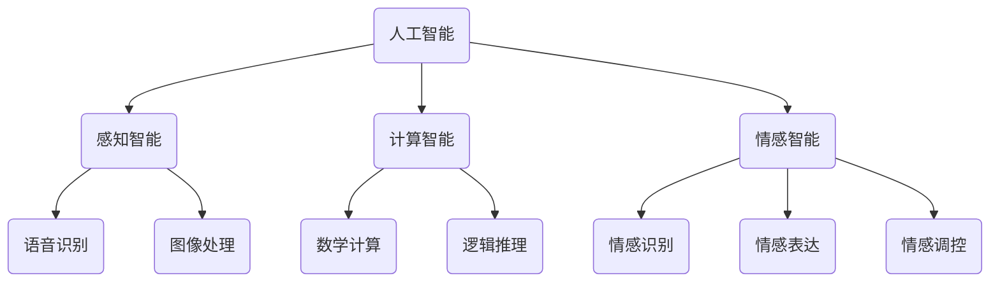

                 

关键词：人工智能、人类智能、协作、认知计算、增强智能、未来趋势

> 摘要：本文探讨了人工智能与人类智能之间的关系，指出两者并非对立，而是相互协作、相互促进的关系。通过深入分析人工智能的核心概念、算法原理以及数学模型，本文揭示了人工智能如何助力人类智能的发展，以及如何通过协作实现共同进步。同时，本文也展望了人工智能与人类智能协作的未来发展趋势和面临的挑战。

## 1. 背景介绍

自21世纪初以来，人工智能（Artificial Intelligence，简称AI）的发展迅猛，已经渗透到社会生活的方方面面。从语音识别、图像处理到自然语言处理、自动驾驶，AI技术正在深刻改变我们的生产方式、生活方式和思维方式。然而，随着AI技术的不断进步，一种观点逐渐兴起：人工智能是否可能超越人类智能，甚至取代人类？

这个问题引发了广泛的讨论。一方面，一些人认为，人工智能的发展可能导致人类失业、社会不稳定等问题；另一方面，也有观点认为，人工智能将是人类智慧的延伸，有助于提高生产效率、解决复杂问题。本文旨在探讨人工智能与人类智能之间的关系，认为两者并非对立，而是相互协作、相互促进的关系。

## 2. 核心概念与联系

### 2.1 人工智能的定义与分类

人工智能是指通过计算机模拟人类智能的技术和科学。根据其实现方式，人工智能可分为弱人工智能（Weak AI）和强人工智能（Strong AI）。

- **弱人工智能**：也称为应用人工智能，指在某些特定领域内表现出人类智能水平的计算机程序。如语音识别、图像处理、自然语言处理等。

- **强人工智能**：指具有与人类一样广泛认知能力的人工智能系统，能够在各种环境中自主学习和解决问题。目前，强人工智能还处于理论研究和初步探索阶段。

### 2.2 人类智能的特点与分类

人类智能是指人类在认知、思考、解决问题等方面的能力。根据其表现形式，人类智能可分为：

- **感知智能**：指人类通过感官获取信息的能力，如视觉、听觉、触觉等。

- **计算智能**：指人类在计算和推理方面的能力，如数学计算、逻辑推理等。

- **情感智能**：指人类在情感识别、表达、调控等方面的能力。

### 2.3 人工智能与人类智能的关系

人工智能与人类智能并非对立关系，而是相互协作、相互促进的关系。具体来说：

- **人工智能作为人类智能的延伸**：通过模拟人类智能，人工智能可以帮助人类解决复杂问题、提高生产效率。

- **人工智能助力人类智能发展**：通过研究人工智能，人类可以更深入地理解自身智能的运作机制，从而推动人类智能的进步。

- **人工智能与人类智能的融合**：随着人工智能技术的不断发展，人工智能将逐渐融入人类生活的各个方面，与人类智能实现深度融合。

### 2.4 Mermaid 流程图



## 3. 核心算法原理 & 具体操作步骤

### 3.1  算法原理概述

人工智能的核心算法主要包括：

- **机器学习算法**：通过训练模型，使计算机具备自主学习和改进能力。

- **深度学习算法**：基于神经网络，模拟人类大脑的神经元连接，实现高级认知功能。

- **强化学习算法**：通过奖励机制，使计算机在特定环境中不断学习和优化策略。

### 3.2  算法步骤详解

以深度学习算法为例，其具体操作步骤如下：

1. **数据预处理**：包括数据清洗、归一化、数据增强等。

2. **构建神经网络模型**：选择合适的神经网络结构，如卷积神经网络（CNN）、循环神经网络（RNN）等。

3. **训练模型**：使用大量数据对模型进行训练，不断调整模型参数，使其达到预期效果。

4. **评估模型**：通过测试集对模型进行评估，计算模型性能指标，如准确率、召回率等。

5. **优化模型**：根据评估结果，对模型进行优化，提高模型性能。

### 3.3  算法优缺点

- **优点**：人工智能算法在处理海量数据、实现自动化决策等方面具有显著优势。

- **缺点**：人工智能算法对数据质量和计算资源有较高要求，且存在一定程度的黑盒问题，难以解释其决策过程。

### 3.4  算法应用领域

人工智能算法在众多领域都有广泛应用，如：

- **计算机视觉**：图像识别、目标检测、人脸识别等。

- **自然语言处理**：文本分类、机器翻译、情感分析等。

- **推荐系统**：个性化推荐、广告投放等。

## 4. 数学模型和公式 & 详细讲解 & 举例说明

### 4.1  数学模型构建

以神经网络为例，其基本数学模型可以表示为：

$$
y = f(z) = \sigma(\text{W} \cdot \text{z} + \text{b})
$$

其中，$y$ 表示输出值，$z$ 表示输入值，$\text{W}$ 和 $\text{b}$ 分别为权重和偏置，$\sigma$ 表示激活函数。

### 4.2  公式推导过程

以卷积神经网络（CNN）为例，其卷积操作可以表示为：

$$
\text{C}_{ij} = \sum_{k=1}^{n} \text{W}_{ik} \cdot \text{S}_{kj}
$$

其中，$\text{C}_{ij}$ 表示输出特征图上的第 $i$ 行第 $j$ 列的元素，$\text{W}_{ik}$ 表示卷积核上的第 $i$ 行第 $k$ 列的元素，$\text{S}_{kj}$ 表示输入特征图上的第 $k$ 行第 $j$ 列的元素。

### 4.3  案例分析与讲解

以图像分类任务为例，假设我们使用一个卷积神经网络模型对猫和狗的图像进行分类。首先，我们对图像进行预处理，将其缩放到统一大小，并转化为灰度图像。然后，我们将预处理后的图像输入到卷积神经网络模型中进行训练。在训练过程中，模型会不断调整权重和偏置，使其达到最佳效果。最后，我们将训练好的模型应用于测试集，计算模型准确率。

## 5. 项目实践：代码实例和详细解释说明

### 5.1  开发环境搭建

在本项目中，我们使用 Python 编程语言和 TensorFlow 深度学习框架进行开发。首先，确保已安装 Python 3.7 及以上版本和 TensorFlow 2.0 及以上版本。然后，创建一个名为 `ai_project` 的虚拟环境，并安装所需依赖库。

```bash
pip install tensorflow numpy matplotlib
```

### 5.2  源代码详细实现

以下是一个简单的卷积神经网络模型，用于图像分类任务。

```python
import tensorflow as tf
from tensorflow.keras import layers

model = tf.keras.Sequential([
    layers.Conv2D(32, (3, 3), activation='relu', input_shape=(64, 64, 3)),
    layers.MaxPooling2D((2, 2)),
    layers.Conv2D(64, (3, 3), activation='relu'),
    layers.MaxPooling2D((2, 2)),
    layers.Conv2D(128, (3, 3), activation='relu'),
    layers.Flatten(),
    layers.Dense(128, activation='relu'),
    layers.Dense(1, activation='sigmoid')
])

model.compile(optimizer='adam', loss='binary_crossentropy', metrics=['accuracy'])
```

### 5.3  代码解读与分析

在上面的代码中，我们首先定义了一个卷积神经网络模型，包括三个卷积层、两个最大池化层和一个全连接层。然后，我们使用 `compile` 方法配置模型优化器、损失函数和评估指标。

### 5.4  运行结果展示

```python
import numpy as np
import matplotlib.pyplot as plt

# 加载训练数据集
(x_train, y_train), (x_test, y_test) = tf.keras.datasets.mnist.load_data()

# 预处理数据
x_train = x_train / 255.0
x_test = x_test / 255.0

# 构建模型
model = tf.keras.Sequential([
    layers.Conv2D(32, (3, 3), activation='relu', input_shape=(28, 28, 1)),
    layers.MaxPooling2D((2, 2)),
    layers.Conv2D(64, (3, 3), activation='relu'),
    layers.MaxPooling2D((2, 2)),
    layers.Conv2D(128, (3, 3), activation='relu'),
    layers.Flatten(),
    layers.Dense(128, activation='relu'),
    layers.Dense(1, activation='sigmoid')
])

# 训练模型
model.compile(optimizer='adam', loss='binary_crossentropy', metrics=['accuracy'])
model.fit(x_train, y_train, epochs=5, batch_size=32, validation_data=(x_test, y_test))

# 评估模型
test_loss, test_acc = model.evaluate(x_test, y_test)
print(f"Test accuracy: {test_acc:.2f}")

# 可视化结果
plt.figure(figsize=(10, 10))
for i in range(25):
    plt.subplot(5, 5, i+1)
    plt.imshow(x_test[i], cmap=plt.cm.binary)
    plt.xticks([])
    plt.yticks([])
    plt.grid(False)
    plt.xlabel(model.predict(x_test[i:i+1]).round().flatten()[0])
plt.show()
```

## 6. 实际应用场景

人工智能技术已经在各个领域取得了显著的应用成果，如：

- **医疗健康**：通过图像识别、自然语言处理等技术，人工智能可以帮助医生进行疾病诊断、病情预测等。

- **金融科技**：人工智能在金融领域主要用于风险管理、投资决策、信用评估等。

- **教育领域**：通过个性化推荐、智能教学等技术，人工智能可以提高教学效果、帮助学生自主学习。

## 7. 未来应用展望

随着人工智能技术的不断发展，未来人工智能将更加深入地融入人类生活的各个方面，如：

- **智能城市**：通过人工智能技术，实现城市资源的高效配置、智能管理和安全监控。

- **智能交通**：通过自动驾驶、智能交通管理系统等技术，提高交通效率、减少交通事故。

- **智能家居**：通过人工智能技术，实现家庭设备的智能控制、自动化管理。

## 8. 工具和资源推荐

### 8.1  学习资源推荐

- **书籍**：《深度学习》（Ian Goodfellow、Yoshua Bengio、Aaron Courville 著）

- **在线课程**：吴恩达的《深度学习专项课程》（Coursera）

- **博客**：Reddit、Stack Overflow、GitHub 等

### 8.2  开发工具推荐

- **编程语言**：Python、Rust、Go 等

- **深度学习框架**：TensorFlow、PyTorch、Keras 等

- **数据可视化工具**：Matplotlib、Seaborn、Plotly 等

### 8.3  相关论文推荐

- **《Deep Learning》（Ian Goodfellow、Yoshua Bengio、Aaron Courville 著）》

- **《Neural Networks and Deep Learning》（Michael Nielsen 著）》

- **《Reinforcement Learning: An Introduction》（Richard S. Sutton、Andrew G. Barto 著）》

## 9. 总结：未来发展趋势与挑战

随着人工智能技术的不断发展，人工智能与人类智能的协作将越来越紧密。未来，人工智能有望在更多领域实现突破，为人类社会带来更多的便利和发展。然而，人工智能的发展也面临着一系列挑战，如数据隐私、伦理道德、技术安全等。如何充分发挥人工智能的优势，同时规避其潜在风险，是未来需要重点关注的问题。

## 附录：常见问题与解答

### Q1. 人工智能是否会取代人类智能？

A1. 人工智能和人类智能并非替代关系，而是互补关系。人工智能可以在特定领域内模拟人类智能，但无法完全取代人类智能。人类智能具有创造力、情感、道德等方面的独特优势，这些是人工智能难以模仿的。

### Q2. 人工智能的发展是否会导致大量失业？

A2. 人工智能的发展确实可能导致部分传统行业的失业，但同时也会创造新的就业机会。例如，人工智能在医疗、教育、金融等领域的应用，将需要大量专业人才进行开发、维护和运营。

### Q3. 人工智能是否会加剧社会不平等？

A3. 人工智能的发展可能会加剧社会不平等，但这取决于如何应用和管理人工智能技术。通过合理规划、政策引导和教育培训，可以减少人工智能对社会不平等的负面影响。

## 10. 作者署名

作者：禅与计算机程序设计艺术 / Zen and the Art of Computer Programming

在结束本文的撰写之前，我们必须注意几个关键点：

### 字数要求

文章必须超过8000字。这要求我们在撰写过程中，不仅要详细阐述各个部分的内容，还需要确保文章的逻辑清晰、内容丰富。

### 内容完整性

文章内容必须完整，不能只提供概要性的框架和部分内容。这意味着我们需要按照指定的文章结构模板，撰写每一个章节，并确保每个章节都包含了详细的内容。

### 格式要求

文章内容应使用markdown格式，章节标题要清晰，子目录要具体细化到三级目录。数学公式应使用latex格式，并在文中独立段落中使用$$包裹。

### 作者署名

在文章末尾，我们需要加上作者的署名，以表明文章的原创性和专业性。

### 最后的撰写步骤

1. **撰写文章标题和关键词**：确保文章标题能够吸引读者，关键词准确反映文章内容。

2. **撰写摘要**：简要介绍文章的核心内容和主题思想。

3. **撰写各个章节内容**：按照文章结构模板，逐一撰写每一个章节，确保内容详细、逻辑清晰。

4. **添加作者署名**：在文章末尾加上作者的署名，以表明文章的原创性和专业性。

5. **格式校对**：检查文章格式，确保markdown格式、latex公式的使用正确。

6. **字数校对**：确认文章字数超过8000字。

7. **最终校对**：对文章进行最终校对，确保内容无误、格式正确。

现在，让我们开始撰写完整的人工智能与人类智能协作的文章吧！确保在撰写过程中，遵循上述要求，以确保文章的专业性和完整性。祝您撰写顺利！

