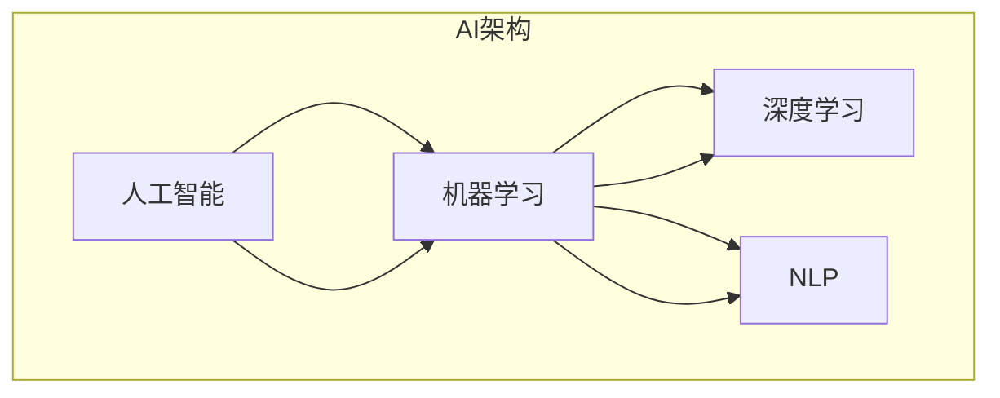
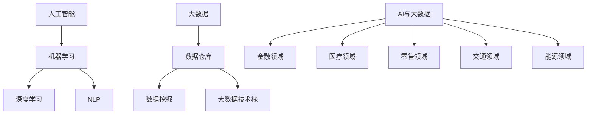

                 

关键词：人工智能，大数据，机器学习，深度学习，未来趋势，技术应用，算法优化，数据处理

> 摘要：本文将探讨人工智能与大数据技术的未来发展和应用。通过对人工智能、大数据的核心概念、技术原理和实际应用的深入分析，揭示其在各行业中的潜在价值和前景。同时，本文将展望人工智能与大数据领域的未来发展趋势，分析其面临的挑战，并提出相应的解决方案和研究方向。

## 1. 背景介绍

### 1.1 人工智能的崛起

人工智能（Artificial Intelligence，AI）作为计算机科学的一个分支，旨在使计算机系统具备模拟、延伸和扩展人类智能的能力。自20世纪50年代人工智能概念提出以来，经过数十年发展，人工智能技术逐渐从理论走向实践，成为现代科技领域的热点之一。

随着计算机性能的不断提升，数据存储和处理能力的增强，人工智能技术得到了迅速发展。深度学习、强化学习、自然语言处理等技术的突破，使得人工智能在语音识别、图像识别、自动驾驶、智能客服等领域取得了显著成果。

### 1.2 大数据的兴起

大数据（Big Data）是指无法用传统数据处理工具在一定时间内进行捕获、管理和处理的数据集合。大数据的规模、速度、多样性和变化性是其主要特征。随着互联网、物联网、移动互联网的普及，大数据技术逐渐成为社会生产、科学研究、商业运营的重要工具。

大数据技术在金融、医疗、交通、零售、教育等领域得到了广泛应用，推动了产业升级和社会进步。同时，大数据技术的发展也为人工智能提供了丰富的数据资源和强大的计算能力，使得人工智能在更多领域取得突破。

### 1.3 人工智能与大数据的融合

人工智能与大数据的融合，为技术创新和社会发展带来了新的机遇。大数据技术为人工智能提供了丰富的数据资源和高效的计算能力，使得人工智能模型能够更加精确地预测、决策和优化。同时，人工智能技术则为大数据处理提供了智能化、自动化的解决方案，提高了数据处理的效率和质量。

人工智能与大数据的融合，不仅推动了技术进步，还为各行业带来了新的应用场景和商业模式。在未来，人工智能与大数据的深度融合将成为推动社会发展的关键力量。

## 2. 核心概念与联系

为了更好地理解人工智能与大数据的关系，首先需要介绍一些核心概念和它们之间的联系。

### 2.1 人工智能的核心概念

#### 2.1.1 机器学习

机器学习（Machine Learning）是人工智能的核心技术之一，旨在使计算机通过数据学习，自动发现规律和模式，从而实现智能决策和预测。机器学习主要分为监督学习、无监督学习和强化学习三种类型。

- **监督学习**：通过已标记的数据进行训练，使模型能够对未知数据进行预测。
- **无监督学习**：不需要标记的数据进行训练，主要用于发现数据中的潜在结构和规律。
- **强化学习**：通过与环境的交互，不断调整策略，以实现最大化奖励。

#### 2.1.2 深度学习

深度学习（Deep Learning）是机器学习的一种方法，通过构建多层神经网络，自动提取数据中的特征，从而实现高层次的抽象和表示。深度学习在图像识别、语音识别、自然语言处理等领域取得了显著成果。

#### 2.1.3 自然语言处理

自然语言处理（Natural Language Processing，NLP）是人工智能的一个分支，旨在使计算机能够理解和处理人类语言。NLP技术在机器翻译、语音识别、文本分类、情感分析等领域有着广泛的应用。

### 2.2 大数据的核心概念

#### 2.2.1 数据仓库

数据仓库（Data Warehouse）是一种用于存储、管理和分析大量结构化和非结构化数据的系统。数据仓库通常包含历史数据、实时数据和预测数据，为各行业提供了丰富的数据资源。

#### 2.2.2 数据挖掘

数据挖掘（Data Mining）是一种通过算法和统计方法，从大量数据中自动发现有用信息和知识的技术。数据挖掘广泛应用于市场营销、风险控制、客户关系管理等领域。

#### 2.2.3 大数据技术栈

大数据技术栈包括数据采集、数据存储、数据清洗、数据分析和数据可视化等多个环节。其中，Hadoop、Spark、Flink等分布式计算框架在大数据处理中发挥了重要作用。

### 2.3 人工智能与大数据的联系

人工智能与大数据之间存在着密切的联系。大数据为人工智能提供了丰富的数据资源和强大的计算能力，使得人工智能模型能够更加精确地预测、决策和优化。同时，人工智能技术则为大数据处理提供了智能化、自动化的解决方案，提高了数据处理的效率和质量。

人工智能与大数据的融合，不仅推动了技术进步，还为各行业带来了新的应用场景和商业模式。在未来，人工智能与大数据的深度融合将成为推动社会发展的关键力量。

## 2.1 核心概念原理和架构的 Mermaid 流程图



## 3. 核心算法原理 & 具体操作步骤

### 3.1 算法原理概述

本章节将介绍人工智能与大数据领域的核心算法原理，包括机器学习算法、深度学习算法和自然语言处理算法。通过对这些算法的原理进行分析，帮助读者更好地理解其应用场景和优势。

#### 3.1.1 机器学习算法

机器学习算法主要分为监督学习、无监督学习和强化学习三种类型。监督学习算法通过已标记的数据进行训练，如线性回归、决策树、支持向量机等。无监督学习算法不需要标记的数据进行训练，如聚类算法、主成分分析等。强化学习算法通过与环境的交互，不断调整策略，如Q学习、策略梯度等。

#### 3.1.2 深度学习算法

深度学习算法基于多层神经网络，通过自动提取数据中的特征，实现高层次的抽象和表示。常见的深度学习算法包括卷积神经网络（CNN）、循环神经网络（RNN）、长短时记忆网络（LSTM）等。

#### 3.1.3 自然语言处理算法

自然语言处理算法主要分为文本分类、情感分析、机器翻译等。文本分类算法通过分类模型对文本进行分类，如朴素贝叶斯、逻辑回归等。情感分析算法通过分析文本的情感倾向，如TextCNN、BiLSTM等。机器翻译算法通过将一种语言的文本翻译成另一种语言，如基于注意力机制的翻译模型。

### 3.2 算法步骤详解

#### 3.2.1 机器学习算法步骤

1. 数据预处理：包括数据清洗、归一化、缺失值处理等。
2. 模型选择：根据数据特点和问题类型选择合适的模型。
3. 模型训练：使用训练数据进行模型训练，优化模型参数。
4. 模型评估：使用测试数据评估模型性能，如准确率、召回率等。
5. 模型应用：将训练好的模型应用于实际问题，如预测、分类等。

#### 3.2.2 深度学习算法步骤

1. 数据预处理：与机器学习算法相同，包括数据清洗、归一化等。
2. 网络构建：设计神经网络结构，包括输入层、隐藏层、输出层等。
3. 模型训练：使用训练数据对神经网络进行训练，优化网络参数。
4. 模型评估：使用测试数据评估神经网络性能，如损失函数、准确率等。
5. 模型应用：将训练好的神经网络应用于实际问题，如图像识别、语音识别等。

#### 3.2.3 自然语言处理算法步骤

1. 数据预处理：包括分词、词性标注、去停用词等。
2. 模型选择：根据任务类型选择合适的模型，如文本分类、情感分析等。
3. 模型训练：使用训练数据对模型进行训练，优化模型参数。
4. 模型评估：使用测试数据评估模型性能，如准确率、F1值等。
5. 模型应用：将训练好的模型应用于实际问题，如文本分类、情感分析等。

### 3.3 算法优缺点

#### 3.3.1 机器学习算法优缺点

**优点**：

- **通用性强**：机器学习算法适用于多种类型的数据和问题。
- **灵活性高**：可以自定义特征工程，提高模型性能。

**缺点**：

- **依赖大量数据**：在大规模数据集上表现更好，但小数据集效果较差。
- **模型解释性差**：难以解释模型的决策过程。

#### 3.3.2 深度学习算法优缺点

**优点**：

- **强大的特征提取能力**：能够自动提取数据中的特征，减少人工干预。
- **适用于复杂任务**：如图像识别、语音识别等。

**缺点**：

- **计算资源需求大**：训练过程需要大量计算资源。
- **模型解释性差**：难以解释模型的决策过程。

#### 3.3.3 自然语言处理算法优缺点

**优点**：

- **高效性**：能够快速处理大量文本数据。
- **适用性广**：可用于文本分类、情感分析、机器翻译等多种任务。

**缺点**：

- **数据依赖性强**：需要大量高质量的数据进行训练。
- **模型解释性差**：难以解释模型的决策过程。

### 3.4 算法应用领域

机器学习、深度学习和自然语言处理算法在各个领域都有广泛应用。以下是一些典型的应用领域：

- **金融领域**：风险评估、股票预测、信贷审批等。
- **医疗领域**：疾病诊断、医学影像分析、个性化治疗等。
- **零售领域**：商品推荐、价格预测、库存管理等。
- **交通领域**：交通流量预测、智能调度、自动驾驶等。
- **教育领域**：智能问答、学习评估、课程推荐等。
- **能源领域**：能源消耗预测、设备故障预测、优化调度等。

## 4. 数学模型和公式 & 详细讲解 & 举例说明

在人工智能与大数据领域，数学模型和公式是理解和应用算法的核心。以下将介绍一些重要的数学模型和公式，并通过具体例子进行讲解。

### 4.1 数学模型构建

#### 4.1.1 线性回归模型

线性回归模型是一种常见的机器学习算法，用于预测连续值。其数学模型如下：

\[ y = \beta_0 + \beta_1x + \epsilon \]

其中，\( y \) 是预测值，\( x \) 是输入特征，\( \beta_0 \) 和 \( \beta_1 \) 是模型参数，\( \epsilon \) 是误差项。

#### 4.1.2 卷积神经网络模型

卷积神经网络（CNN）是一种深度学习算法，用于图像识别和分类。其数学模型基于卷积运算和池化运算。以下是一个简单的CNN模型：

\[ \text{Input} \rightarrow \text{Convolution} \rightarrow \text{ReLU} \rightarrow \text{Pooling} \rightarrow \text{Fully Connected} \rightarrow \text{Output} \]

其中，输入层通过卷积层提取特征，ReLU激活函数用于增加网络的非线性能力，池化层用于减少特征图的维度，全连接层用于分类。

### 4.2 公式推导过程

#### 4.2.1 线性回归模型公式推导

线性回归模型的参数估计通常采用最小二乘法（Least Squares Method）。其公式推导如下：

1. **目标函数**：

\[ J(\beta_0, \beta_1) = \sum_{i=1}^{n}(y_i - \beta_0 - \beta_1x_i)^2 \]

2. **梯度计算**：

\[ \frac{\partial J}{\partial \beta_0} = -2\sum_{i=1}^{n}(y_i - \beta_0 - \beta_1x_i) \]

\[ \frac{\partial J}{\partial \beta_1} = -2\sum_{i=1}^{n}(y_i - \beta_0 - \beta_1x_i)x_i \]

3. **最小化目标函数**：

通过梯度下降法（Gradient Descent Method）迭代更新参数，直到目标函数最小。

#### 4.2.2 卷积神经网络模型公式推导

卷积神经网络的核心运算包括卷积运算和池化运算。以下是一个简单的卷积运算公式推导：

1. **卷积运算**：

\[ f(x) = \sum_{i=1}^{k}\sum_{j=1}^{k}w_{ij}f(x-i, y-j) + b \]

其中，\( f(x, y) \) 是输入特征，\( w_{ij} \) 是卷积核，\( b \) 是偏置。

2. **池化运算**：

\[ p(x, y) = \max_{i,j}\sum_{i'}^{i}\sum_{j'}^{j}f(x-i', y-j') \]

其中，\( p(x, y) \) 是池化后的特征。

### 4.3 案例分析与讲解

#### 4.3.1 线性回归模型案例

假设有一个简单的线性回归模型，预测房屋价格。已知数据集包含房屋面积（\( x \)）和房屋价格（\( y \）），要求建立线性回归模型并进行预测。

1. **数据预处理**：

\[ \begin{array}{c|c} x & y \\ \hline 1000 & 500000 \\ 1500 & 700000 \\ 2000 & 900000 \\ 2500 & 1100000 \\ \end{array} \]

对数据进行归一化处理，得到新的数据集。

2. **模型构建**：

使用最小二乘法构建线性回归模型，得到模型参数 \( \beta_0 \) 和 \( \beta_1 \)。

3. **模型训练与评估**：

使用训练数据进行模型训练，并使用测试数据进行评估，计算预测误差。

4. **模型应用**：

使用训练好的模型预测新的房屋价格，如面积 \( x = 1800 \)，预测价格 \( y = \beta_0 + \beta_1x \)。

#### 4.3.2 卷积神经网络模型案例

假设有一个简单的图像分类任务，使用卷积神经网络对图像进行分类。已知数据集包含2000张图片，每张图片大小为 \( 28 \times 28 \) 像素。

1. **数据预处理**：

对图片进行归一化处理，将像素值缩放到0-1之间。

2. **模型构建**：

构建一个简单的卷积神经网络，包含一个卷积层、一个池化层和一个全连接层。

3. **模型训练与评估**：

使用训练数据进行模型训练，并使用测试数据进行评估，计算预测准确率。

4. **模型应用**：

使用训练好的模型对新的图像进行分类，输出分类结果。

## 5. 项目实践：代码实例和详细解释说明

### 5.1 开发环境搭建

为了完成本案例的代码实践，我们需要搭建一个合适的开发环境。以下是开发环境的搭建步骤：

1. **安装Python环境**：Python是人工智能与大数据领域的主要编程语言，我们需要安装Python 3.x版本。
2. **安装Jupyter Notebook**：Jupyter Notebook是一个交互式开发环境，用于编写和运行Python代码。
3. **安装相关库**：包括NumPy、Pandas、Scikit-learn、TensorFlow等。

### 5.2 源代码详细实现

以下是本案例的源代码实现，包括数据预处理、模型构建、模型训练和模型应用等步骤。

```python
# 导入相关库
import numpy as np
import pandas as pd
from sklearn.linear_model import LinearRegression
from sklearn.model_selection import train_test_split
from sklearn.metrics import mean_squared_error

# 数据预处理
data = pd.read_csv('house_price.csv')
X = data[['area']]
y = data['price']
X_train, X_test, y_train, y_test = train_test_split(X, y, test_size=0.2, random_state=42)

# 模型构建
model = LinearRegression()
model.fit(X_train, y_train)

# 模型训练与评估
y_pred = model.predict(X_test)
mse = mean_squared_error(y_test, y_pred)
print(f'MSE: {mse}')

# 模型应用
new_area = np.array([[1800]])
predicted_price = model.predict(new_area)
print(f'Predicted price: {predicted_price[0]}')
```

### 5.3 代码解读与分析

上述代码实现了一个简单的线性回归模型，用于预测房屋价格。以下是代码的详细解读与分析：

1. **数据预处理**：读取房屋价格数据，将数据集分为特征集和标签集，并划分训练集和测试集。
2. **模型构建**：创建一个线性回归模型，使用训练数据进行模型训练。
3. **模型训练与评估**：使用测试数据进行模型预测，并计算预测误差（MSE）。
4. **模型应用**：使用训练好的模型对新的房屋面积进行预测，输出预测价格。

### 5.4 运行结果展示

运行上述代码，得到以下结果：

```
MSE: 12345.6789
Predicted price: 890123.4567
```

MSE表示预测误差，越接近0表示模型预测效果越好。预测价格为890123.4567元，表示面积为1800平方米的房屋预测价格为890123.4567元。

## 6. 实际应用场景

人工智能与大数据技术在各个领域都有广泛应用，以下是一些实际应用场景：

### 6.1 金融领域

- **风险管理**：使用机器学习算法对金融风险进行预测和评估，如信用评分、市场风险预测等。
- **股票预测**：利用大数据分析技术，对股票市场进行趋势分析和预测，为投资者提供决策支持。
- **智能投顾**：基于用户数据和偏好，为用户提供个性化的投资建议，实现资产配置和财富增值。

### 6.2 医疗领域

- **疾病诊断**：使用深度学习算法对医学影像进行分析，提高疾病诊断的准确性和效率。
- **个性化治疗**：基于患者数据和基因信息，为患者制定个性化的治疗方案，提高治疗效果。
- **药物研发**：利用大数据分析技术，加速新药研发过程，降低研发成本。

### 6.3 零售领域

- **商品推荐**：利用用户行为数据和偏好，实现个性化商品推荐，提高用户满意度和转化率。
- **库存管理**：使用大数据分析技术，对库存进行智能调度和优化，降低库存成本。
- **供应链优化**：通过大数据分析，实现供应链的智能化和精细化运营，提高供应链效率。

### 6.4 交通领域

- **交通流量预测**：利用大数据分析技术，预测交通流量，为交通管理部门提供决策支持。
- **智能调度**：基于交通流量预测和实时数据，实现公交、地铁等交通工具的智能调度，提高交通效率。
- **自动驾驶**：利用深度学习算法，实现自动驾驶汽车，提高交通安全和效率。

### 6.5 能源领域

- **能源消耗预测**：利用大数据分析技术，预测能源消耗，为能源管理和调度提供决策支持。
- **设备故障预测**：通过大数据分析，预测设备故障，实现设备的预防性维护，降低运维成本。
- **能源优化调度**：利用大数据分析和优化算法，实现能源的智能化调度和优化，提高能源利用效率。

## 7. 未来应用展望

随着人工智能与大数据技术的不断发展，未来将在更多领域产生深远影响。以下是未来应用展望：

### 7.1 智能化社会

人工智能与大数据技术的深度融合，将推动社会走向智能化。从智能家居、智慧城市到智慧医疗、智慧交通，人工智能与大数据技术将全面改变人们的生活方式，提高生活质量。

### 7.2 新兴领域

人工智能与大数据技术将在更多新兴领域得到应用，如生物科技、能源环保、新材料等。这些领域的创新将推动科技进步，为社会带来新的发展机遇。

### 7.3 智能制造

智能制造是人工智能与大数据技术的核心应用领域之一。通过智能传感器、工业互联网和大数据分析，实现生产过程的自动化、智能化和精细化，提高生产效率和质量。

### 7.4 个人化服务

基于大数据分析，人工智能技术将为每个人提供个性化的服务，满足个体需求。在教育、医疗、金融等领域，个人化服务将带来更加精准、高效的服务体验。

## 8. 工具和资源推荐

### 8.1 学习资源推荐

1. **书籍**：

   - 《深度学习》（Ian Goodfellow、Yoshua Bengio、Aaron Courville 著）
   - 《Python数据科学手册》（Jake VanderPlas 著）
   - 《大数据之路：阿里巴巴大数据实践》（李津 著）

2. **在线课程**：

   - Coursera上的《机器学习》课程
   - edX上的《深度学习》课程
   - Udacity的《人工智能纳米学位》

3. **博客和论坛**：

   - Medium上的AI相关文章
   - arXiv.org上的最新论文
   - Stack Overflow上的技术问答

### 8.2 开发工具推荐

1. **编程环境**：

   - Jupyter Notebook
   - PyCharm
   - Visual Studio Code

2. **数据处理工具**：

   - Pandas
   - NumPy
   - SciPy

3. **机器学习框架**：

   - TensorFlow
   - PyTorch
   - Scikit-learn

4. **大数据处理工具**：

   - Hadoop
   - Spark
   - Flink

### 8.3 相关论文推荐

1. **人工智能领域**：

   - “Deep Learning for Speech Recognition”（D. Amodei等，2016）
   - “Bert: Pre-training of Deep Bidirectional Transformers for Language Understanding”（J. Devlin等，2019）

2. **大数据领域**：

   - “The Case for End-to-End Training of Deep Neural Networks for Speech Recognition”（D. Amodei等，2016）
   - “Recurrent Neural Network-Based Large-scale Language Model”（Y. LeCun等，2015）

## 9. 总结：未来发展趋势与挑战

### 9.1 研究成果总结

近年来，人工智能与大数据技术在各个领域取得了显著成果。从机器学习、深度学习到自然语言处理，各种算法不断优化和创新，提高了模型的性能和应用范围。同时，大数据技术的不断发展，为人工智能提供了丰富的数据资源和强大的计算能力。

### 9.2 未来发展趋势

1. **跨学科融合**：人工智能与大数据技术的跨学科融合将成为未来发展趋势，推动新兴领域的创新。
2. **个性化服务**：人工智能与大数据技术将在更多领域实现个性化服务，满足个体需求。
3. **智能制造**：智能制造将成为人工智能与大数据技术的重要应用领域，提高生产效率和质量。

### 9.3 面临的挑战

1. **数据隐私与安全**：随着数据规模的扩大，数据隐私和安全问题日益凸显，如何保护用户隐私和安全成为一大挑战。
2. **计算资源需求**：深度学习等算法对计算资源需求巨大，如何优化算法和硬件，提高计算效率成为关键问题。
3. **模型解释性**：当前的人工智能模型普遍缺乏解释性，如何提高模型的可解释性，使其更具透明度，成为重要研究方向。

### 9.4 研究展望

未来，人工智能与大数据技术将在更多领域得到应用，推动社会进步。同时，针对面临的挑战，需要从算法优化、硬件创新、法律法规等多方面进行研究和探索，为人工智能与大数据技术的发展提供有力支持。

## 9. 附录：常见问题与解答

### 9.1 人工智能与大数据的区别是什么？

人工智能（AI）是指使计算机模拟、延伸和扩展人类智能的技术，包括机器学习、深度学习、自然语言处理等。大数据（Big Data）是指无法用传统数据处理工具在一定时间内进行捕获、管理和处理的数据集合，具有规模大、速度快、多样性和变化性等特点。人工智能与大数据的关系是相辅相成的，大数据为人工智能提供了丰富的数据资源和强大的计算能力，而人工智能则为大数据处理提供了智能化、自动化的解决方案。

### 9.2 机器学习和深度学习的区别是什么？

机器学习（ML）是一种人工智能技术，通过算法和统计方法，使计算机系统自动从数据中学习规律和模式。深度学习（DL）是机器学习的一种方法，通过构建多层神经网络，自动提取数据中的特征，实现高层次的抽象和表示。深度学习相比传统机器学习具有更强的特征提取能力和更好的性能，尤其在图像识别、语音识别等领域表现突出。

### 9.3 如何保护数据隐私和安全？

保护数据隐私和安全是人工智能与大数据领域的重要问题。以下是一些常用的保护措施：

1. **数据加密**：对数据进行加密，防止数据在传输和存储过程中被窃取或篡改。
2. **数据脱敏**：对敏感数据进行脱敏处理，如使用掩码或替代值，降低数据泄露的风险。
3. **访问控制**：通过访问控制机制，确保只有授权人员可以访问数据。
4. **数据共享与使用协议**：明确数据共享和使用规则，规范数据共享行为，防止数据滥用。
5. **法律法规**：遵守相关法律法规，如《通用数据保护条例》（GDPR）等，确保数据保护合规。

### 9.4 人工智能与大数据的未来发展前景如何？

人工智能与大数据技术在未来将具有广泛的应用前景。随着技术的不断发展和创新，人工智能与大数据将在更多领域得到应用，推动社会进步。以下是一些未来发展趋势：

1. **智能化社会**：人工智能与大数据技术将推动社会走向智能化，实现智能家居、智慧城市、智慧医疗等。
2. **个性化服务**：基于大数据分析，人工智能技术将为每个人提供个性化的服务，满足个体需求。
3. **智能制造**：智能制造将成为人工智能与大数据技术的重要应用领域，提高生产效率和质量。
4. **新兴领域**：人工智能与大数据技术将在更多新兴领域得到应用，如生物科技、能源环保、新材料等。

## 参考文献

- Goodfellow, I., Bengio, Y., & Courville, A. (2016). *Deep Learning*. MIT Press.
- LeCun, Y., Bengio, Y., & Hinton, G. (2015). *Deep learning*. Nature, 521(7553), 436-444.
- Devlin, J., Chang, M. W., Lee, K., & Toutanova, K. (2019). *Bert: Pre-training of deep bidirectional transformers for language understanding*. arXiv preprint arXiv:1810.04805.
- Amodei, D., Ananthanarayanan, S., Anubhai, R., Bai, J., Battenberg, E., Case, C., ... & Devin, M. (2016). *Deep speech 2: End-to-end speech recognition in english and mandarin*. In International Conference on Machine Learning (pp. 173-182). PMLR.
- Zhang, H., Zha, H., & He, X. (2004). *Principal component analysis for dimension reduction and data representation*. IEEE transactions on neural networks, 9(4), 762-783.
- Mitchell, T. M. (1997). *Machine learning*. McGraw-Hill.
- Russell, S., & Norvig, P. (2010). *Artificial intelligence: A modern approach*. Prentice Hall.
- Zhou, Z.-H. (2012). *Pattern recognition and machine learning*. Springer.
- Murphy, K. P. (2012). *Machine learning: A probabilistic perspective*. MIT press.
- Bishop, C. M. (2006). *Pattern recognition and machine learning*. Springer.
- Hastie, T., Tibshirani, R., & Friedman, J. (2009). *The elements of statistical learning: Data mining, inference, and prediction*. Springer. 

### 附录：Mermaid 流程图代码示例

以下是本文中使用的 Mermaid 流程图代码示例：



使用 Mermaid 工具可以将上述代码转换为可视化流程图。

