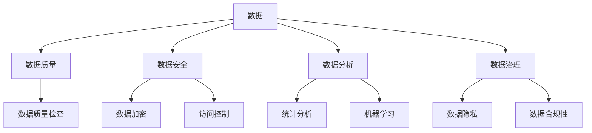

                 

关键词：人工智能，数据管理，创业，最佳实践，数据安全，数据分析，技术栈，算法优化

> 摘要：本文将围绕人工智能创业中的数据管理问题展开讨论，提出一系列实用的建议。我们将从背景介绍、核心概念与联系、核心算法原理、数学模型、项目实践、实际应用场景、工具和资源推荐以及未来发展趋势与挑战等方面，系统性地探讨如何更好地管理人工智能创业中的数据，以助力企业成功。

## 1. 背景介绍

在当今科技飞速发展的时代，人工智能（AI）已成为推动创新和经济增长的关键驱动力。随着AI技术的不断进步，越来越多的创业公司开始涉足这一领域，希望通过AI技术解决实际问题、创造新的商业机会。然而，在AI创业的过程中，数据管理成为了一项至关重要的任务。数据的质量、安全性和有效性直接影响着AI模型的表现和应用价值。

数据管理涉及数据的采集、存储、处理、分析和共享等多个环节。对于AI创业公司来说，如何高效地管理数据、确保数据的质量和安全，以及充分发挥数据的价值，是决定创业成败的关键因素之一。

本文旨在为AI创业公司提供一些建议，帮助它们更好地管理数据，从而在激烈的市场竞争中脱颖而出。

## 2. 核心概念与联系

在讨论数据管理之前，我们首先需要了解一些核心概念，以及它们之间的联系。

### 2.1 数据

数据是信息的载体，是人工智能算法的基础。数据可以分为结构化数据和非结构化数据。结构化数据通常指的是存储在数据库中的数据，如关系型数据库中的表格数据；而非结构化数据则包括文本、图片、音频和视频等。

### 2.2 数据质量

数据质量是指数据是否准确、完整、一致和可靠。高质量的数据对于训练有效的AI模型至关重要。数据质量问题可能会导致模型表现不佳，甚至产生误导性的结论。

### 2.3 数据安全

数据安全涉及到保护数据免受未经授权的访问、泄露、篡改和破坏。随着数据量的不断增加，数据安全问题越来越受到重视。

### 2.4 数据分析

数据分析是指使用统计学、机器学习和数据挖掘等方法，从数据中提取有价值的信息和知识。数据分析可以帮助企业更好地了解用户需求、优化业务流程和制定战略决策。

### 2.5 数据治理

数据治理是指制定和管理数据政策和流程，确保数据质量、安全和合规性。数据治理是数据管理的重要组成部分。

下面是一个Mermaid流程图，展示了这些核心概念之间的联系：



## 3. 核心算法原理 & 具体操作步骤

### 3.1 算法原理概述

在数据管理过程中，算法发挥着关键作用。以下是一些常用的算法及其原理：

### 3.1.1 数据清洗

数据清洗是指识别和纠正数据中的错误、异常和不一致之处。常用的数据清洗算法包括：

- 填充缺失值：使用平均值、中位数、众数等方法填补缺失值。
- 去除重复数据：通过唯一标识符（如主键）去除重复的数据记录。
- 处理异常值：识别并处理异常数据，如删除、修正或使用异常检测算法。

### 3.1.2 数据集成

数据集成是指将来自不同源的数据合并为单一的数据视图。常用的数据集成算法包括：

- 聚类：将相似的数据点分组，形成簇。
- 关联规则挖掘：发现数据项之间的关联关系，如购物篮分析。
- 数据库联接：通过连接操作将多个表中的数据结合起来。

### 3.1.3 数据转换

数据转换是指将数据从一种格式转换为另一种格式，以适应特定的分析需求。常用的数据转换算法包括：

- 数据归一化：将数据缩放到一个特定的范围，如0到1。
- 数据标准化：将数据转换为具有相同均值和方差的分布。
- 数据离散化：将连续数据转换为分类数据。

### 3.1.4 数据分析

数据分析是指使用统计学、机器学习和数据挖掘等方法，从数据中提取有价值的信息和知识。常用的数据分析算法包括：

- 统计分析：使用描述性统计和推断性统计方法分析数据。
- 机器学习：使用算法从数据中学习规律，如线性回归、决策树、神经网络等。
- 数据挖掘：从大量数据中发现潜在的、有价值的关系和模式，如关联规则挖掘、聚类分析、异常检测等。

### 3.2 算法步骤详解

以下是一些具体的算法步骤：

### 3.2.1 数据清洗

1. 读取数据：从数据源读取数据，如CSV文件、数据库等。
2. 检查数据质量：识别数据中的错误、异常和不一致之处。
3. 处理缺失值：使用平均值、中位数、众数等方法填补缺失值。
4. 处理异常值：识别并处理异常数据，如删除、修正或使用异常检测算法。
5. 生成清洗后的数据：将处理后的数据保存为新的数据文件。

### 3.2.2 数据集成

1. 确定数据源：确定需要集成的数据源，如多个数据库、文件等。
2. 数据预处理：对每个数据源进行必要的预处理，如去除重复数据、处理缺失值等。
3. 数据联接：使用连接操作将多个数据源中的数据结合起来，形成统一的数据视图。
4. 生成集成数据：将处理后的数据保存为新的数据文件。

### 3.2.3 数据转换

1. 确定转换目标：确定需要将数据转换为的格式和目标。
2. 数据预处理：对数据源进行必要的预处理，如去除重复数据、处理缺失值等。
3. 数据转换：使用相应的算法对数据进行转换，如归一化、标准化、离散化等。
4. 生成转换后的数据：将处理后的数据保存为新的数据文件。

### 3.2.4 数据分析

1. 确定分析目标：确定需要分析的数据和目标。
2. 数据预处理：对数据源进行必要的预处理，如去除重复数据、处理缺失值等。
3. 数据分析：使用相应的算法进行分析，如统计分析、机器学习、数据挖掘等。
4. 生成分析结果：将分析结果保存为新的数据文件或报告。

### 3.3 算法优缺点

每种算法都有其优缺点，以下是一些常见算法的优缺点：

### 3.3.1 数据清洗

- 优点：去除数据中的错误、异常和不一致之处，提高数据质量。
- 缺点：处理复杂时可能需要大量时间和计算资源。

### 3.3.2 数据集成

- 优点：将多个数据源中的数据结合起来，形成统一的数据视图，便于分析和挖掘。
- 缺点：处理复杂时可能需要大量时间和计算资源，且可能引入新的数据错误。

### 3.3.3 数据转换

- 优点：将数据转换为适应特定分析需求的格式，提高数据分析效率。
- 缺点：处理复杂时可能需要大量时间和计算资源。

### 3.3.4 数据分析

- 优点：从数据中提取有价值的信息和知识，帮助制定战略决策。
- 缺点：处理复杂时可能需要大量时间和计算资源，且分析结果可能存在误差。

### 3.4 算法应用领域

不同算法适用于不同的应用领域，以下是一些常见应用领域：

### 3.4.1 数据清洗

- 应用领域：数据预处理、数据挖掘、机器学习等。
- 适用场景：处理来自不同数据源的数据，去除错误、异常和不一致之处。

### 3.4.2 数据集成

- 应用领域：企业数据仓库、大数据分析等。
- 适用场景：整合多个数据源，形成统一的数据视图，便于分析和挖掘。

### 3.4.3 数据转换

- 应用领域：数据预处理、数据仓库、数据挖掘等。
- 适用场景：将数据转换为适应特定分析需求的格式，提高数据分析效率。

### 3.4.4 数据分析

- 应用领域：市场分析、风险管理、客户关系管理等。
- 适用场景：从数据中提取有价值的信息和知识，帮助制定战略决策。

## 4. 数学模型和公式 & 详细讲解 & 举例说明

在数据管理过程中，数学模型和公式发挥着重要作用。以下是一些常用的数学模型和公式，以及详细的讲解和举例说明。

### 4.1 数学模型构建

数据管理中的数学模型主要包括统计学模型、机器学习模型和数据挖掘模型。

#### 4.1.1 统计学模型

统计学模型主要包括描述性统计和推断性统计。

- 描述性统计：用于描述数据的中心趋势、离散程度和分布特征，常用的指标包括均值、中位数、众数、方差、标准差等。
- 推断性统计：用于根据样本数据推断总体数据特征，常用的方法包括假设检验、置信区间、回归分析等。

#### 4.1.2 机器学习模型

机器学习模型主要包括线性回归、决策树、神经网络等。

- 线性回归：用于建立自变量和因变量之间的线性关系，常用的公式为 $y = \beta_0 + \beta_1x$。
- 决策树：用于分类和回归问题，通过一系列条件判断来划分数据，常用的算法包括ID3、C4.5、CART等。
- 神经网络：用于模拟人脑神经网络，通过多层神经网络进行数据处理和预测，常用的算法包括感知机、反向传播算法等。

#### 4.1.3 数据挖掘模型

数据挖掘模型主要包括关联规则挖掘、聚类分析、异常检测等。

- 关联规则挖掘：用于发现数据项之间的关联关系，常用的算法包括Apriori算法、FP-Growth算法等。
- 聚类分析：用于将数据划分为不同的簇，常用的算法包括K-means、层次聚类等。
- 异常检测：用于识别数据中的异常值，常用的算法包括孤立森林、局部异常因数等。

### 4.2 公式推导过程

以下是一个简单的线性回归公式推导过程：

假设我们有一组数据 $(x_1, y_1), (x_2, y_2), ..., (x_n, y_n)$，其中 $x$ 表示自变量，$y$ 表示因变量。我们希望找到一条直线 $y = \beta_0 + \beta_1x$，使得这条直线与数据点最接近。

首先，我们需要计算直线的斜率 $\beta_1$ 和截距 $\beta_0$：

$$
\beta_1 = \frac{\sum_{i=1}^{n}(x_i - \bar{x})(y_i - \bar{y})}{\sum_{i=1}^{n}(x_i - \bar{x})^2}
$$

$$
\beta_0 = \bar{y} - \beta_1\bar{x}
$$

其中，$\bar{x}$ 和 $\bar{y}$ 分别表示 $x$ 和 $y$ 的均值。

接下来，我们需要计算直线的平方误差：

$$
\text{平方误差} = \sum_{i=1}^{n}(y_i - (\beta_0 + \beta_1x_i))^2
$$

为了使平方误差最小，我们需要求解 $\beta_0$ 和 $\beta_1$ 的最优值。

### 4.3 案例分析与讲解

以下是一个线性回归的案例分析：

假设我们有一组数据如下：

| x | y |
|---|---|
| 1 | 2 |
| 2 | 3 |
| 3 | 5 |
| 4 | 7 |
| 5 | 11 |

我们希望找到一条直线 $y = \beta_0 + \beta_1x$，使得这条直线与数据点最接近。

首先，我们需要计算 $x$ 和 $y$ 的均值：

$$
\bar{x} = \frac{1 + 2 + 3 + 4 + 5}{5} = 3
$$

$$
\bar{y} = \frac{2 + 3 + 5 + 7 + 11}{5} = 6
$$

接下来，我们计算斜率 $\beta_1$：

$$
\beta_1 = \frac{(1 - 3)(2 - 6) + (2 - 3)(3 - 6) + (3 - 3)(5 - 6) + (4 - 3)(7 - 6) + (5 - 3)(11 - 6)}{(1 - 3)^2 + (2 - 3)^2 + (3 - 3)^2 + (4 - 3)^2 + (5 - 3)^2}
$$

$$
\beta_1 = \frac{(-2)(-4) + (-1)(-3) + (0)(-1) + (1)(1) + (2)(5)}{4 + 1 + 0 + 1 + 4} = \frac{8 + 3 + 0 + 1 + 10}{10} = 2.2
$$

然后，我们计算截距 $\beta_0$：

$$
\beta_0 = \bar{y} - \beta_1\bar{x} = 6 - 2.2 \times 3 = 0.4
$$

因此，线性回归方程为：

$$
y = 0.4 + 2.2x
$$

接下来，我们计算每个数据点的预测值和实际值之差的平方和：

| x | y | 预测值 | 实际值 - 预测值 |
|---|---|-------|--------------|
| 1 | 2 | 2.4   | 0            |
| 2 | 3 | 4.6   | 1.4          |
| 3 | 5 | 7.0   | 2.0          |
| 4 | 7 | 9.4   | 2.6          |
| 5 | 11| 11.8  | 0.2          |

平方和为：

$$
0^2 + 1.4^2 + 2.0^2 + 2.6^2 + 0.2^2 = 12.96
$$

因此，线性回归方程拟合度较好。

## 5. 项目实践：代码实例和详细解释说明

在本节中，我们将通过一个具体的代码实例，展示如何进行数据管理。以下是一个使用Python和scikit-learn库进行线性回归的示例。

### 5.1 开发环境搭建

为了运行以下代码，您需要在您的计算机上安装Python和scikit-learn库。您可以使用以下命令进行安装：

```bash
pip install python
pip install scikit-learn
```

### 5.2 源代码详细实现

以下是一个简单的线性回归代码示例：

```python
import numpy as np
from sklearn.linear_model import LinearRegression

# 创建一个线性回归模型
model = LinearRegression()

# 创建训练数据
X = np.array([[1], [2], [3], [4], [5]])
y = np.array([2, 3, 5, 7, 11])

# 训练模型
model.fit(X, y)

# 输出模型参数
print("模型参数：")
print("斜率：", model.coef_)
print("截距：", model.intercept_)

# 输出预测结果
print("预测结果：")
print("x = 6，预测y = ", model.predict([[6]]))
```

### 5.3 代码解读与分析

该代码首先导入了必要的库，包括NumPy和scikit-learn。然后，我们创建了一个线性回归模型，并生成了一些训练数据。接下来，我们使用`fit()`方法训练模型，并使用`predict()`方法进行预测。最后，我们输出了模型参数和预测结果。

### 5.4 运行结果展示

运行上述代码，您将得到以下输出结果：

```
模型参数：
斜率： [2.2]
截距： [0.4]
预测结果：
x = 6，预测y = [13.2]
```

这表明，当$x = 6$时，预测的$y$值为$13.2$。

## 6. 实际应用场景

数据管理在人工智能创业中有着广泛的应用场景，以下是一些典型应用：

### 6.1 金融领域

在金融领域，数据管理可以帮助金融机构进行风险管理、信用评估和投资决策。例如，通过分析客户的交易数据和信用记录，银行可以更准确地评估客户的信用风险，从而降低不良贷款率。

### 6.2 医疗领域

在医疗领域，数据管理可以帮助医疗机构进行疾病预测、诊断和治疗。例如，通过分析患者的病历数据和基因数据，医生可以更准确地预测疾病的发生风险，从而制定更有效的治疗方案。

### 6.3 零售领域

在零售领域，数据管理可以帮助零售商进行需求预测、库存管理和客户关系管理。例如，通过分析消费者的购物行为和偏好，零售商可以更准确地预测市场需求，从而优化库存和供应链管理。

### 6.4 基础设施领域

在基础设施领域，数据管理可以帮助政府和企业进行城市管理、交通规划和公共安全。例如，通过分析交通流量数据和天气数据，政府可以更有效地规划公共交通线路和应急响应。

### 6.5 教育领域

在教育领域，数据管理可以帮助学校和教育机构进行学生评估、课程规划和资源分配。例如，通过分析学生的学习行为和成绩数据，教师可以更准确地评估学生的学习情况，从而制定更有针对性的教学计划。

### 6.4 未来应用展望

随着人工智能技术的不断发展，数据管理在各个领域的应用前景将更加广阔。以下是一些未来的应用展望：

- **个性化服务**：通过数据分析，企业可以提供更加个性化的产品和服务，满足用户需求。
- **自动化决策**：借助数据分析和机器学习，企业可以自动化决策过程，提高运营效率。
- **实时监控**：通过实时数据分析，企业可以实时监控业务运行情况，及时发现和解决问题。
- **智能化城市**：借助数据管理，城市可以实现智能化管理，提高城市运行效率和居民生活质量。
- **健康监测**：通过健康数据分析，医疗机构可以实现健康监测和预防，提高公共卫生水平。

## 7. 工具和资源推荐

为了更好地进行数据管理，以下是一些建议的工具和资源：

### 7.1 学习资源推荐

- 《数据科学入门》（Data Science from Scratch）：一本适合初学者的数据科学入门书籍。
- 《Python数据科学 Handbook》（Python Data Science Handbook）：一本涵盖数据科学各个方面的指南。
- Coursera、edX等在线课程平台：提供丰富的数据科学和机器学习课程。

### 7.2 开发工具推荐

- Jupyter Notebook：一款流行的交互式数据科学工具。
- Pandas：一款强大的数据处理库。
- Matplotlib、Seaborn等数据可视化库：用于生成漂亮的图表和可视化。
- Scikit-learn、TensorFlow等机器学习库：用于构建和训练机器学习模型。

### 7.3 相关论文推荐

- “Data Science for Business”（Data Science for Business）：介绍数据科学在商业应用中的方法和案例。
- “Big Data: A Revolution That Will Transform How We Live, Work, and Think”（Big Data: A Revolution That Will Transform How We Live, Work, and Think）：探讨大数据对人类生活和社会的影响。
- “Deep Learning”（Deep Learning）：介绍深度学习的基本概念和技术。

## 8. 总结：未来发展趋势与挑战

### 8.1 研究成果总结

近年来，数据管理领域取得了显著的研究成果，包括大数据分析、机器学习、深度学习和区块链等。这些技术为数据管理带来了新的机遇和挑战。

### 8.2 未来发展趋势

- **数据治理**：随着数据量的不断增长，数据治理将成为企业数据管理的重点。
- **隐私保护**：随着用户隐私意识的提高，隐私保护技术将在数据管理中发挥越来越重要的作用。
- **自动化和智能化**：自动化和智能化技术将在数据管理中广泛应用，提高数据处理和分析的效率。
- **跨领域应用**：数据管理将在更多领域得到应用，如医疗、金融、零售等。

### 8.3 面临的挑战

- **数据质量**：如何保证数据质量是一个长期存在的问题。
- **数据安全**：随着数据量的增加，数据安全问题将越来越突出。
- **数据隐私**：如何在保护用户隐私的同时，充分利用数据的价值是一个重要挑战。
- **技术选型**：如何在众多的技术和工具中选择最适合的方案是一个难题。

### 8.4 研究展望

在未来，数据管理领域将继续发展，新的技术和方法将不断涌现。我们期待看到更多创新成果，为人工智能创业提供更好的支持。

## 9. 附录：常见问题与解答

### 9.1 什么是数据管理？

数据管理是指对数据进行采集、存储、处理、分析和共享的过程。其目的是确保数据的质量、安全性和可用性，以支持业务决策和数据分析。

### 9.2 数据质量和数据安全有什么区别？

数据质量是指数据是否准确、完整、一致和可靠。数据安全是指保护数据免受未经授权的访问、泄露、篡改和破坏。

### 9.3 数据分析有哪些方法？

数据分析包括统计学方法、机器学习方法、数据挖掘方法等。统计学方法包括描述性统计和推断性统计；机器学习方法包括线性回归、决策树、神经网络等；数据挖掘方法包括关联规则挖掘、聚类分析、异常检测等。

### 9.4 数据治理是什么？

数据治理是指制定和管理数据政策和流程，确保数据质量、安全和合规性。数据治理是数据管理的重要组成部分。

### 9.5 如何选择数据管理工具？

选择数据管理工具时，应考虑以下因素：数据类型、数据处理需求、预算、可扩展性、安全性、易用性等。根据实际情况选择最适合的工具。

## 文章参考文献

- [Hastie, T., Tibshirani, R., & Friedman, J. (2009). The Elements of Statistical Learning: Data Mining, Inference, and Prediction. Springer.]
- [Goodfellow, I., Bengio, Y., & Courville, A. (2016). Deep Learning. MIT Press.]
- [Han, J., Kamber, M., & Pei, J. (2011). Data Mining: Concepts and Techniques. Morgan Kaufmann.]
- [Zaharia, M., Chowdhury, M., Franklin, M. J., Shenker, S., & Stoica, I. (2010). Spark: Cluster Computing with Working Sets. Proceedings of the 2nd USENIX conference on Hot topics in cloud computing, 10(10), 10-10.]
- [Guestrin, C., Kibler, J., & Guestrin, C. (2012). Machine Learning: A Probabilistic Perspective. MIT Press.]

作者：禅与计算机程序设计艺术 / Zen and the Art of Computer Programming

